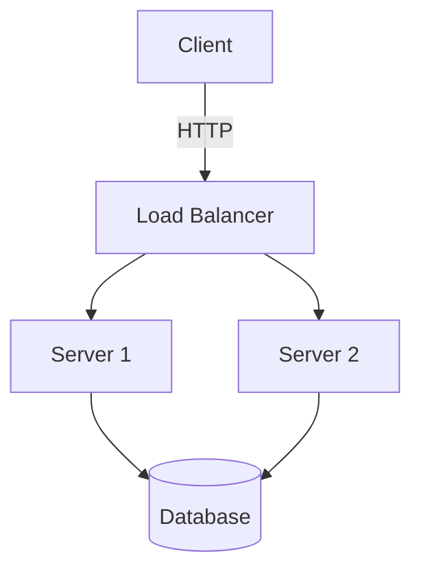

# Technical Documentation

Unified skill for all documentation content generation. Replaces the former
`documentation-writer`, `technical-writing`, and `user-guide-writing` skills.

> **Scope boundary**: This skill writes *content*. For `doc/` directory naming,
> type prefix enforcement, and header validation, use **doc-writer** (`/doc`).

## When to Use

- Writing technical specs, architecture docs, or API documentation
- Creating user guides, tutorials, onboarding docs, or FAQs
- Any documentation task where you need structured content generation

## Workflow

Follow this process for every documentation request:

### Step 1: Clarify

Before writing, determine:

| Question | Options |
|----------|---------|
| **Document type** | Spec / Architecture / Runbook / API / Tutorial / How-to / FAQ / Explanation |
| **Target audience** | Developer / DevOps / Manager / End user |
| **User's goal** | What does the reader want to achieve? |
| **Scope** | What to include and, importantly, what to exclude |

Ask the user if any of these are unclear. Do not guess.

### Step 2: Propose Outline

Present a table-of-contents with brief section descriptions. Wait for approval
before writing full content.

### Step 3: Generate Content

Write the full document in Markdown, following the principles and templates below.

---

## Writing Principles

1. **Clarity** — Simple, direct language. One idea per sentence. Define terms.
2. **Accuracy** — Code examples must be correct and testable.
3. **User-centricity** — Every section must help a specific reader achieve a specific goal.
4. **Consistency** — Match the project's existing tone, terminology, and style.
5. **Show, don't tell** — Use code examples, diagrams, screenshots. No vague instructions.
6. **Active voice** — "The system sends a notification" not "A notification is sent".

### Audience-Specific Guidelines

| Audience | Focus | Language | Include |
|----------|-------|----------|---------|
| **Developer** | Implementation details | Technical terms OK | Code examples, API contracts |
| **DevOps** | Deployment & maintenance | Configuration-focused | Runbooks, monitoring, troubleshooting |
| **Manager** | Business impact | Minimal jargon | Outcomes, timelines, risks |
| **End user** | Task completion | Simple, clear | Screenshots, step-by-step, FAQ |

---

## Templates

### Technical Specification

```markdown
# [Feature Name] Technical Specification

**Status**: Draft / Review / Approved

## Overview
1-2 paragraphs describing what this spec covers.

## Problem Statement
What problem are we solving? Why now?

## Goals
- Goal 1
- Goal 2

## Non-Goals
- What we're explicitly not doing

## Solution Design

### High-Level Architecture
### Data Models
### API Contracts
### User Interface

## Alternatives Considered
Other approaches and why we didn't choose them.

## Implementation Plan
- Phase 1: ...
- Phase 2: ...

## Testing Strategy

## Security Considerations

## Performance Considerations

## Rollout / Rollback Plan

## Open Questions
```

### Architecture Document

```markdown
# [System Name] Architecture

## Overview
High-level system description.

## Architecture Diagram
[Mermaid or ASCII diagram]

## Components

### Component 1
- **Responsibility**: ...
- **Technology**: ...
- **Interfaces**: ...

## Data Flow
How data moves through the system.

## Key Design Decisions

### Decision 1
- **Context**: ...
- **Options**: ...
- **Decision**: ...
- **Rationale**: ...

## Scalability

## Security

## Monitoring & Observability

## Disaster Recovery
```

### Runbook

```markdown
# [Service Name] Runbook

## Service Overview

## Dependencies
- Service A
- Database X

## Deployment

### Deploy
[commands]

### Rollback
[commands]

## Monitoring

### Key Metrics
- Request rate / Error rate / Latency

### Dashboards
- [link]

## Common Issues

### Issue: [Description]
**Symptoms**: ...
**Diagnosis**: ...
**Resolution**: ...

## Emergency Contacts
```

### API Documentation

```markdown
# [Service] API Documentation

## Authentication
[Auth method and example]

## Endpoints

### [Action] [Resource]
[HTTP method] [path]

**Parameters**:
| Name | Type | Required | Description |
|------|------|----------|-------------|

**Example Request**:
[curl or code example]

**Example Response**:
[JSON example]

**Error Responses**:
| Status | Description |
|--------|-------------|
```

### Quick Start Guide (End User)

```markdown
# Getting Started with [Product]

This guide gets you up and running in 5 minutes.

## Step 1: [First Action]
1. ...
2. ...
[screenshot]

## Step 2: [Second Action]
1. ...
2. ...

## Next Steps
- [Link to deeper guide]
- [Link to tutorial]

## Need Help?
- [Support channels]
```

### How-To Guide (Task-Focused)

```markdown
# How to [Accomplish Task]

## Before You Start
- Prerequisite 1
- Prerequisite 2

## Step-by-Step

### 1. [Action]
[Instructions with screenshots]

### 2. [Action]
[Instructions]

## Troubleshooting

**Problem**: [Description]
- [Solution steps]

## Related Guides
- [Link]
```

### FAQ

```markdown
# Frequently Asked Questions

## [Category 1]

### [Question]?
[Answer with steps if needed]

### [Question]?
[Answer]

## [Category 2]
...

## Still Have Questions?
[Support channels]
```

### Tutorial (Learning-Focused)

```markdown
# Tutorial: [What You'll Build]

**Time**: X minutes | **Difficulty**: Beginner/Intermediate | **Prerequisites**: ...

## What You'll Build
[Screenshot or description of end result]

## Step 1: [Action]
[Detailed instructions with context — explain *why*, not just *how*]

## Step 2: [Action]
...

## What You Learned
[Summary of concepts covered]

## Next Steps
[Links to more advanced topics]
```

---

## Visual Aids

Use Mermaid diagrams for architecture, sequence, and flow:



For user-facing docs, include annotated screenshots at every major step.

---

## Self-Review Checklist

Before delivering any document:

- [ ] Clear purpose stated in first paragraph
- [ ] Logical flow — each section builds on the previous
- [ ] All technical terms defined on first use
- [ ] Code examples are correct and can be copy-pasted
- [ ] Diagrams are clear and labeled
- [ ] Consistent formatting (headings, lists, tables)
- [ ] Audience-appropriate language level
- [ ] No orphan references (all links resolve)

## Project Integration

When writing docs for this project:

- Files in `doc/` must follow the 6-type naming convention (use `/doc` to validate)
- Match existing terminology from `CLAUDE.md` and `codebase-snapshot.md`
- Use Chinese for user-facing content, English for API/technical references
- Reference existing docs rather than duplicating content
