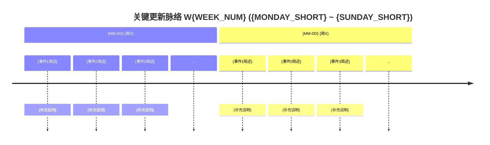

# Weekly Update Summary — 自动化周报生成

每周自动从 git 历史中收集数据，分析归类后生成结构化中文周报。

## 触发词

- "生成周报"
- "写周报"
- "本周总结"
- "周报"
- "weekly report"
- "weekly summary"
- "上周总结"（明确指定生成上周的报告）

## 执行流程

### Phase 1: 确定目标周

根据当前日期自动判断应该生成哪一周的周报。

```bash
DOW=$(date +%u)   # 1=周一 ... 7=周日
TODAY=$(date +%Y-%m-%d)
```

**判断规则**：
- 周六 (6) 或周日 (7)：生成**本周**周报（当周已接近尾声）
- 周一 (1)：生成**上周**周报（刚过去的一周）
- 周二到周五 (2-5)：询问用户要生成本周还是上周

**计算周范围**：

```bash
# 计算目标周的周一日期
if [ "$DOW" -ge 6 ]; then
  MONDAY=$(date -d "$TODAY - $((DOW - 1)) days" +%Y-%m-%d)
elif [ "$DOW" -eq 1 ]; then
  MONDAY=$(date -d "$TODAY - 7 days" +%Y-%m-%d)
fi

SUNDAY=$(date -d "$MONDAY + 6 days" +%Y-%m-%d)
NEXT_MONDAY=$(date -d "$MONDAY + 7 days" +%Y-%m-%d)
WEEK_NUM=$(date -d "$MONDAY" +%V)
ISO_YEAR=$(date -d "$MONDAY" +%G)

REPORT_FILE="doc/weekly-report-${ISO_YEAR}-W${WEEK_NUM}.md"
```

**重要**：使用 `%G` (ISO 年份) 和 `%V` (ISO 周号)，不要用 `%Y`，避免跨年边界错误。

---

### Phase 2: 数据收集

依次执行以下 6 组 git 命令收集原始数据。

#### 2.1 提交总量

```bash
COMMIT_COUNT=$(git log --oneline --since="$MONDAY" --until="$NEXT_MONDAY" | wc -l)
git log --oneline --since="$MONDAY" --until="$NEXT_MONDAY"
```

#### 2.2 去重文件/行数统计

> **⛔ 绝对禁止使用 `git log --shortstat` 逐条累加！**
>
> 该方式会导致被多次提交修改的文件和行数被重复计算，产生严重膨胀的数字。
> 本仓库为 shallow clone（`.git/shallow` 含 9 个边界提交），膨胀更为极端。
>
> **实际案例**：W06 真实净变更为 +53K 行，但累加 shortstat 得到 +2.3M 行（膨胀 44 倍）。

**正确做法** — 使用 `git diff --shortstat` 在首尾提交之间做一次性差分：

```bash
FIRST_COMMIT=$(git log --since="$MONDAY" --until="$NEXT_MONDAY" --reverse --format="%H" | head -1)
LAST_COMMIT=$(git log --since="$MONDAY" --until="$NEXT_MONDAY" --format="%H" | head -1)

# 尝试包含第一个提交的变更 (FIRST^..LAST)
STATS=$(git diff --shortstat "$FIRST_COMMIT^..$LAST_COMMIT" 2>/dev/null)
if [ $? -ne 0 ]; then
  # 浅克隆边界：第一个提交的 parent 不可达，退而使用 FIRST..LAST
  STATS=$(git diff --shortstat "$FIRST_COMMIT..$LAST_COMMIT")
  # 注意：此方式少算第一个提交的变更，误差通常可忽略
fi

echo "$STATS"
# 输出格式: "325 files changed, 37362 insertions(+), 5449 deletions(-)"
```

#### 2.3 PR 列表

**方式 A — gh CLI 可用时**（优先）：

```bash
gh pr list --state merged \
  --search "merged:$MONDAY..$NEXT_MONDAY" \
  --json number,title,mergedAt \
  --limit 100 \
  --jq '.[] | "#\(.number) | \(.title)"'
```

**方式 B — gh 不可用时**（从 merge commit 提取）：

```bash
git log --merges --since="$MONDAY" --until="$NEXT_MONDAY" --format="%H %s" | \
while read HASH MSG; do
  PR_NUM=$(echo "$MSG" | sed -n 's/^Merge pull request #\([0-9]*\) .*/\1/p')
  if [ -n "$PR_NUM" ]; then
    TITLE=$(git log "$HASH^2" --oneline -1 --format="%s" 2>/dev/null)
    echo "#$PR_NUM | $TITLE"
  fi
done | sort -t'#' -k2 -n
```

#### 2.4 贡献者统计

```bash
git log --since="$MONDAY" --until="$NEXT_MONDAY" --format="%an" | sort | uniq -c | sort -rn
```

#### 2.5 提交类型分布

```bash
git log --since="$MONDAY" --until="$NEXT_MONDAY" --format="%s" | \
  sed 's/(.*//; s/:.*//' | sort | uniq -c | sort -rn
```

归入标准类别：`feat` / `fix` / `refactor` / `docs` / `chore` / `perf` / `ui` / `style` / `test` / `ci`。中文开头或无前缀的归入 "中文 commit / 无前缀"。

#### 2.6 每日提交分布

```bash
git log --since="$MONDAY" --until="$NEXT_MONDAY" \
  --format="%ad" --date=format:"%m-%d %A" | sort | uniq -c
```

对每天标注重点方向（分析当天 commit 消息中的关键词聚类）。

---

### Phase 3: 加载上周报告

```bash
PREV_WEEK_NUM=$((10#$WEEK_NUM - 1))
if [ "$PREV_WEEK_NUM" -lt 1 ]; then
  PREV_ISO_YEAR=$((ISO_YEAR - 1))
  PREV_WEEK_NUM=52
else
  PREV_ISO_YEAR=$ISO_YEAR
fi
PREV_FILE="doc/weekly-report-${PREV_ISO_YEAR}-W$(printf '%02d' $PREV_WEEK_NUM).md"
```

如果 `$PREV_FILE` 存在：

1. 读取其 **"下周优先级建议"** 表格
2. 提取每条建议的方向和动作
3. 在新报告 Section 五中对比实际进展，生成 **"上周方向落地情况"** 表格
4. 读取上周统计数字（提交数、PR 数、文件变更、行数）用于指标对比

如果不存在：跳过 Section 五的对比部分。

---

### Phase 4: 分析与分类

阅读全部 commit message 和 PR 列表，执行以下分析。

#### 4.1 按功能主题分组

- 同一 PR 下的所有 commit 归为一组
- 未关联 PR 的 commit 按消息关键词聚类
- 识别本周的 2~3 个主线功能（commit 数量最多的主题）

#### 4.2 分类

每个功能组归入以下类别之一：

| 类别 | 关键词信号 | 报告标签 |
|------|-----------|----------|
| 新功能 | feat, add, implement, 新增, 实现 | ✨ 新功能 |
| 更新/增强 | enhance, improve, update, 优化, 改进 | 🔄 更新 |
| Bug 修复 | fix, bugfix, hotfix, 修复 | 🐛 Bug 修复 |
| 重构/架构 | refactor, restructure, simplify, 重构 | 🏗️ 架构 |
| 性能优化 | perf, performance, optimize | ⚡ 性能 |
| UI/UX | ui, style, layout, design, 样式 | 🎨 UI/UX |
| 移动端 | mobile, responsive, 移动端 | 📱 移动端 |
| 桌面端 | desktop, tauri, 桌面 | 🖥️ 桌面端 |
| DevOps/测试 | test, ci, deploy, build, script | 🔧 DevOps |
| 文档 | docs, readme, 文档 | 📝 文档 |
| 安全/权限 | auth, permission, security, rbac | 🔐 权限 |
| AI 能力 | llm, model, gateway, thinking | 🧠 AI 能力 |
| 工作流 | workflow, automation, 工作流 | ⚙️ 工作流 |

#### 4.3 排序规则

在 "三、本周完成" 中，按以下优先级排序：

1. **新功能** — 最大最完整的功能优先（commit 数越多、影响范围越广越靠前）
2. **重大更新/增强**
3. **UI/UX 统一性改进**
4. **Bug 修复集合**（可合并为一个小节）
5. **架构/基础设施**
6. **其他改进**

#### 4.4 撰写价值主张

每个主要功能需附带 `> **价值**：...` 引用块，用一句话从**用户/团队视角**解释这个功能为什么重要，不使用技术术语。

#### 4.5 新功能详情展开

对于分类为 "新功能" 的重大功能，展开为子列表：

- 后端架构要点
- 前端实现要点
- 关键子功能或子模块列表
- 质量保障措施（如有测试覆盖）

#### 4.6 生成关键更新脉络图数据

基于每日提交分布（2.6）和功能主题分组（4.1）的分析结果，为 Mermaid timeline 准备数据：

1. **筛选活跃日**：只保留当天提交数 ≥ 3 的日期（排除零星修补日）
2. **提取当日关键事件**：每天最多 3 个事件，从当天 commit/PR 中选取最重要的功能变更
3. **事件描述精炼**：每个事件用 ≤ 10 个中文字概括（Mermaid 渲染时宽度有限）
4. **按时间排序**：section 按日期升序排列

**事件筛选优先级**（同一天内）：
1. 新功能 / 完整模块上线
2. 重大架构变更
3. 重要 Bug 修复或性能优化
4. UI/UX 改进

**注意**：如果一周内活跃日不足 3 天，放宽阈值到提交数 ≥ 1。

---

### Phase 5: 生成报告

使用以下模板生成完整报告，写入 `$REPORT_FILE`。

```markdown
# 周报 {ISO_YEAR}-W{WEEK_NUM} ({MONDAY} ~ {SUNDAY})

> **总计 {COMMIT_COUNT} 次提交 | {FILES_CHANGED} 个文件变更 | +{INSERTIONS} 行 / -{DELETIONS} 行 | {PR_COUNT} 个 PR 合并 (#{FIRST_PR} ~ #{LAST_PR})**
>
> **贡献者**：{contributor1} ({count1} commits), {contributor2} ({count2} commits)

**本周趋势**：{一段话概括本周整体方向、主线功能、与上周的延续或转变}

---

## 关键更新脉络



> **生成规则**：
> - 每个 `section` 对应一个活跃日（提交数 ≥ 3），格式为 `{MM-DD} {周X}`（如 `02-10 周一`）
> - 每天最多 3 个事件，按重要程度降序
> - 事件主文本 ≤ 10 字中文，冒号后补充说明 ≤ 15 字
> - 跳过无实质提交的日期（纯文档/merge commit 日）
> - 如果该周合并了 PR，优先从 PR 标题提炼事件

---

## 一、已合并 Pull Requests (#{FIRST_PR} ~ #{LAST_PR})

| PR | 标题 | 分类 |
|----|------|------|
| #{num} | {PR 标题 — 简洁中文描述} | {emoji} {category} |
| ... | ... | ... |

---

## 二、本周完成

### 1. {功能名称} — {一句话总结}

> **价值**：{从用户/团队角度说明这个功能为什么重要}

{对于新功能，展开子列表：}
- 要点 1
- 要点 2
  - 子要点（子模块/子功能）
- 要点 3

### 2. {下一个功能} — {一句话总结}

> **价值**：{...}

- ...

{按分类排序继续...}

---

## 三、本周数据

### 每日提交分布

| 日期 | 提交数 | 重点方向 |
|------|--------|----------|
| {MM-DD} ({周X}) | {count} | {当天主要方向} |

### 提交类型分布

| 类型 | 数量 | 占比 |
|------|------|------|
| feat (新功能) | {n} | {pct}% |
| fix (Bug 修复) | {n} | {pct}% |
| refactor (重构) | {n} | {pct}% |
| docs/chore/perf/ui/style | {n} | {pct}% |
| 中文 commit / 无前缀 | {n} | {pct}% |

---

## 四、与上周 (W{PREV}) 对比

| 指标 | W{PREV} | W{CURR} | 变化 |
|------|---------|---------|------|
| 提交数 | {prev} | {curr} | {diff}% |
| 合并 PR 数 | {prev} | {curr} | {diff} |
| 文件变更 | {prev} | {curr} | {diff}% |
| 净增行数 | {prev} | {curr} | {diff}% |

### 上周方向落地情况

| W{PREV} 建议方向 | W{CURR} 实际进展 |
|------------------|------------------|
| {P0 方向} | ✅ / ⚠️ / ❌ {实际进展描述} |
| {P1 方向} | ... |

---

## 五、下周优先级建议

| 优先级 | 方向 | 建议动作 |
|--------|------|----------|
| P0 | {方向} | {建议动作} |
| P1 | {方向} | {建议动作} |
| P2 | {方向} | {建议动作} |
```

---

### Phase 6: 输出与确认

1. 将报告写入 `doc/weekly-report-{ISO_YEAR}-W{WEEK_NUM}.md`
2. 向用户展示摘要：

```
✅ 周报已生成：doc/weekly-report-2026-W08.md

📊 本周概要：
- {COMMIT_COUNT} 次提交，{PR_COUNT} 个 PR 合并
- {FILES_CHANGED} 个文件变更，+{INS} / -{DEL} 行
- Top 3 功能：
  1. {Feature 1}
  2. {Feature 2}
  3. {Feature 3}

是否需要调整内容？
```

---

## 边界情况处理

### 浅克隆边界

本仓库为浅克隆（`.git/shallow` 含多个边界提交）。当 `git diff --shortstat FIRST^..LAST` 失败时自动回退：

```bash
if ! git diff --shortstat "$FIRST_COMMIT^..$LAST_COMMIT" 2>/dev/null; then
  git diff --shortstat "$FIRST_COMMIT..$LAST_COMMIT"
fi
```

### 无提交的周

如果目标周没有提交，生成一份简短报告：

```markdown
# 周报 {YEAR}-W{NUM} ({MON} ~ {SUN})

> **本周无提交活动**
```

### 跨年周 (W52/W53 → W01)

使用 ISO 8601 周计算，`date +%G` 和 `date +%V` 自动处理。

### 报告已存在

如果 `$REPORT_FILE` 已存在，提示用户选择：
1. 覆盖现有报告
2. 取消生成
3. 生成到新文件（添加 `-v2` 后缀）

## 注意事项

1. **报告语言**：全部使用中文，与现有 W06/W07 报告保持一致
2. **PR 标题**：英文 PR 标题需翻译为简洁的中文描述
3. **价值主张风格**：从用户/团队视角描述，避免技术术语
4. **排版一致性**：严格遵循模板中的表格、分隔线、引用块格式
5. **数字准确性**：所有统计数字必须来自 git 命令输出，不可估算
6. **风格**：正式技术周报风格，表格中的分类 emoji 是结构标记
