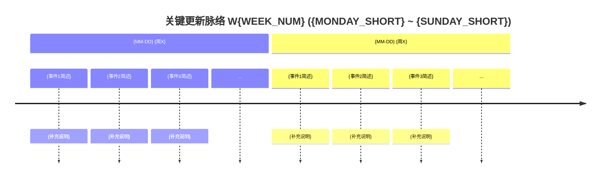

# 周报模板

> 被 SKILL.md Phase 5 引用。生成报告时按此模板输出到 `doc/report.{ISO_YEAR}-W{WEEK_NUM}.md`。

```markdown
# 周报 {ISO_YEAR}-W{WEEK_NUM} ({MONDAY} ~ {SUNDAY})

> **总计 {COMMIT_COUNT} 次提交 | {FILES_CHANGED} 个文件变更 | +{INSERTIONS} 行 / -{DELETIONS} 行 | {PR_COUNT} 个 PR 合并 (#{FIRST_PR} ~ #{LAST_PR})**
>
> **贡献者**：{contributor1} ({count1} commits), {contributor2} ({count2} commits)

**本周趋势**：{一段话概括本周整体方向、主线功能、与上周的延续或转变}

---

## 关键更新脉络



> **生成规则**：
> - 每个 `section` 对应一个活跃日（提交数 >= 3），格式为 `{MM-DD} {周X}`（如 `02-10 周一`）
> - 每天最多 3 个事件，按重要程度降序
> - 事件主文本 <= 10 字中文，冒号后补充说明 <= 15 字
> - 跳过无实质提交的日期（纯文档/merge commit 日）
> - 如果该周合并了 PR，优先从 PR 标题提炼事件

---

## 一、本周完成

### 1. {功能名称} — {一句话总结}

> **价值**：{从用户/团队角度说明这个功能为什么重要}

{对于新功能，展开子列表：}
- 要点 1
- 要点 2
  - 子要点（子模块/子功能）
- 要点 3

### 2. {下一个功能} — {一句话总结}

> **价值**：{...}

- ...

{按分类排序继续...}

---

## 二、本周数据

### 每日提交分布

| 日期 | 提交数 | 重点方向 |
|------|--------|----------|
| {MM-DD} ({周X}) | {count} | {当天主要方向} |

### 提交类型分布

| 类型 | 数量 | 占比 |
|------|------|------|
| feat (新功能) | {n} | {pct}% |
| fix (Bug 修复) | {n} | {pct}% |
| refactor (重构) | {n} | {pct}% |
| docs/chore/perf/ui/style | {n} | {pct}% |
| 中文 commit / 无前缀 | {n} | {pct}% |

---

## 三、与上周 (W{PREV}) 对比

| 指标 | W{PREV} | W{CURR} | 变化 |
|------|---------|---------|------|
| 提交数 | {prev} | {curr} | {diff}% |
| 合并 PR 数 | {prev} | {curr} | {diff} |
| 文件变更 | {prev} | {curr} | {diff}% |
| 净增行数 | {prev} | {curr} | {diff}% |

### 上周方向落地情况

| W{PREV} 建议方向 | W{CURR} 实际进展 |
|------------------|------------------|
| {P0 方向} | ✅ / ⚠️ / ❌ {实际进展描述} |
| {P1 方向} | ... |

---

## 四、下周优先级建议

| 优先级 | 方向 | 建议动作 |
|--------|------|----------|
| P0 | {方向} | {建议动作} |
| P1 | {方向} | {建议动作} |
| P2 | {方向} | {建议动作} |

---

## 附录：已合并 Pull Requests (#{FIRST_PR} ~ #{LAST_PR})

| PR | 标题 | 分类 |
|----|------|------|
| #{num} | {PR 标题 — 简洁中文描述} | {emoji} {category} |
| ... | ... | ... |
```
