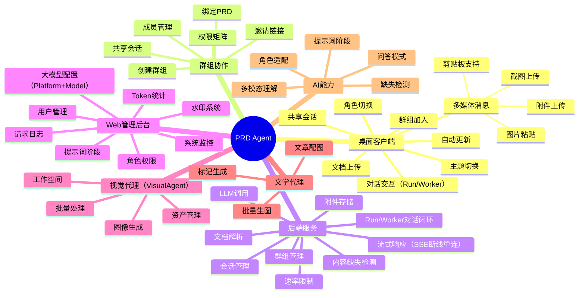
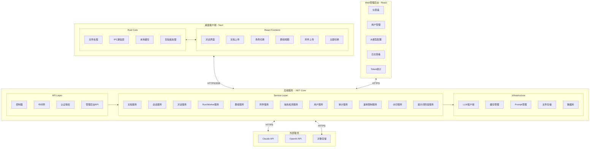
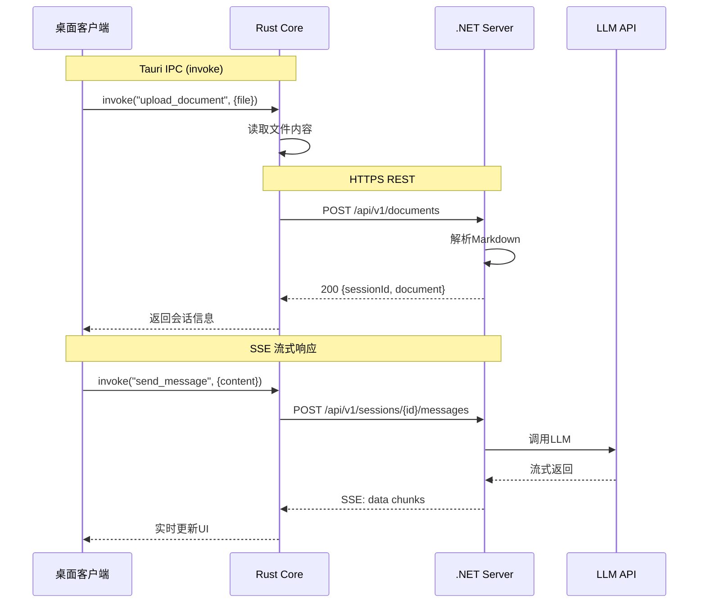
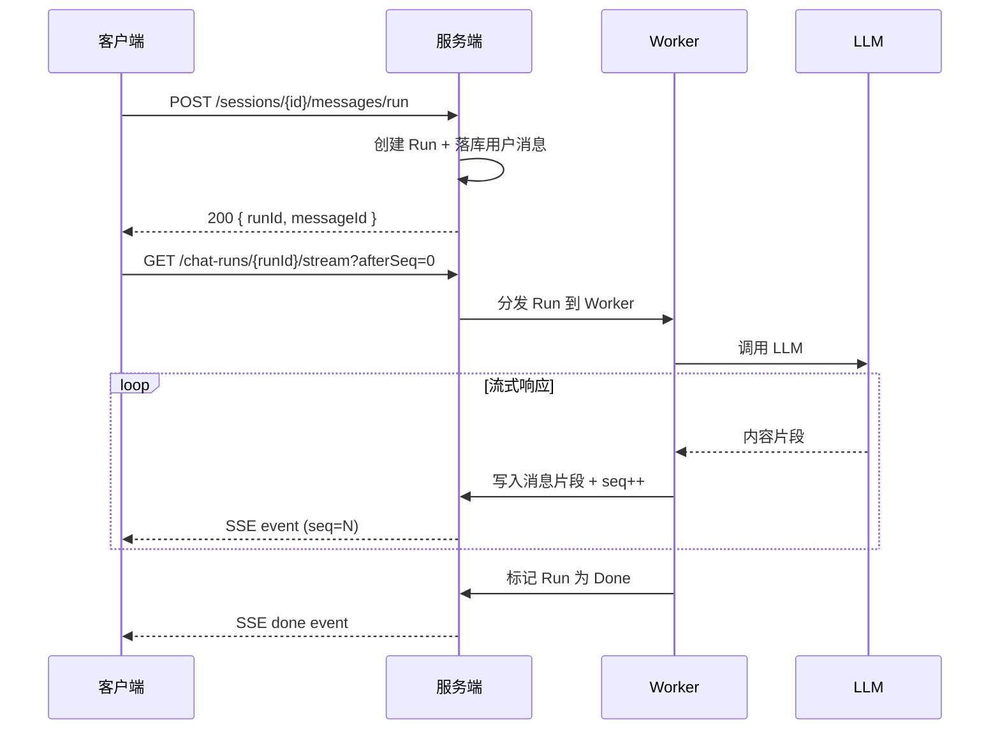
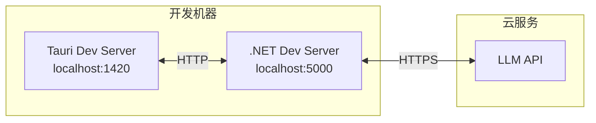
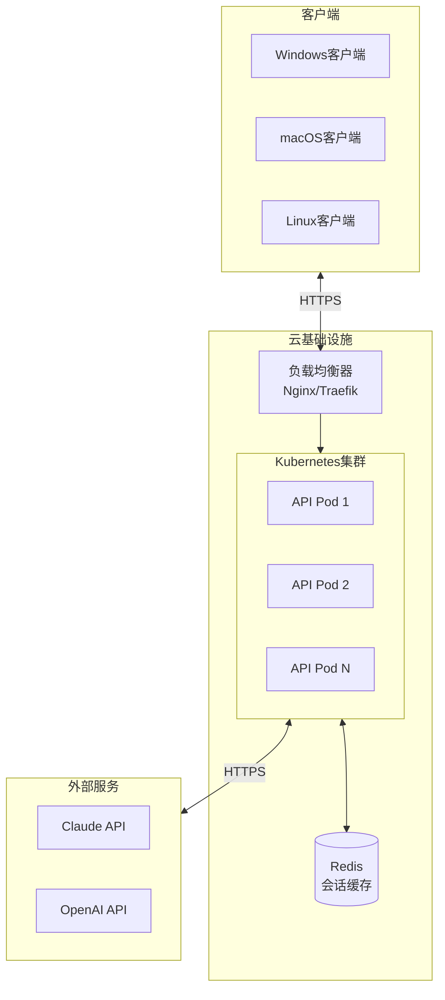
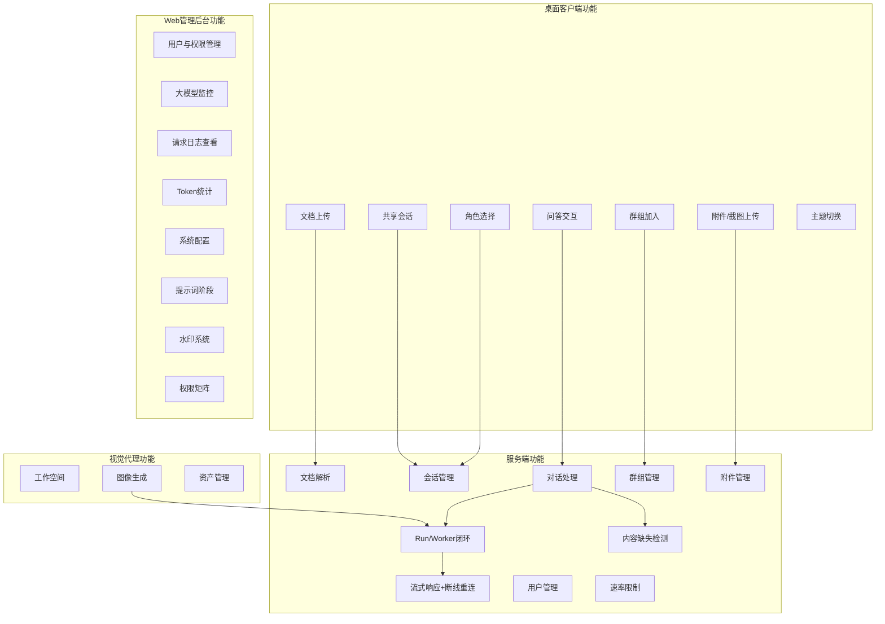
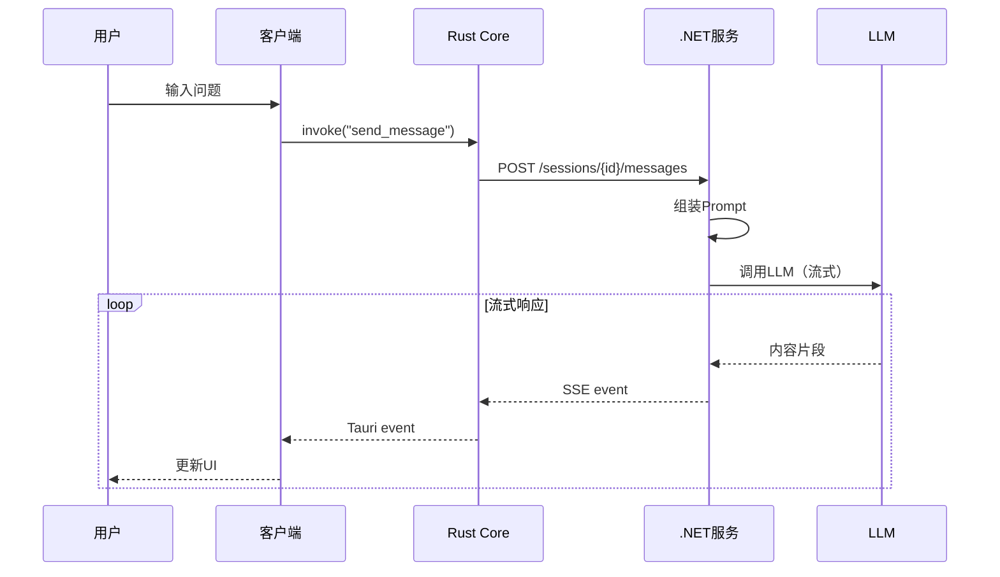
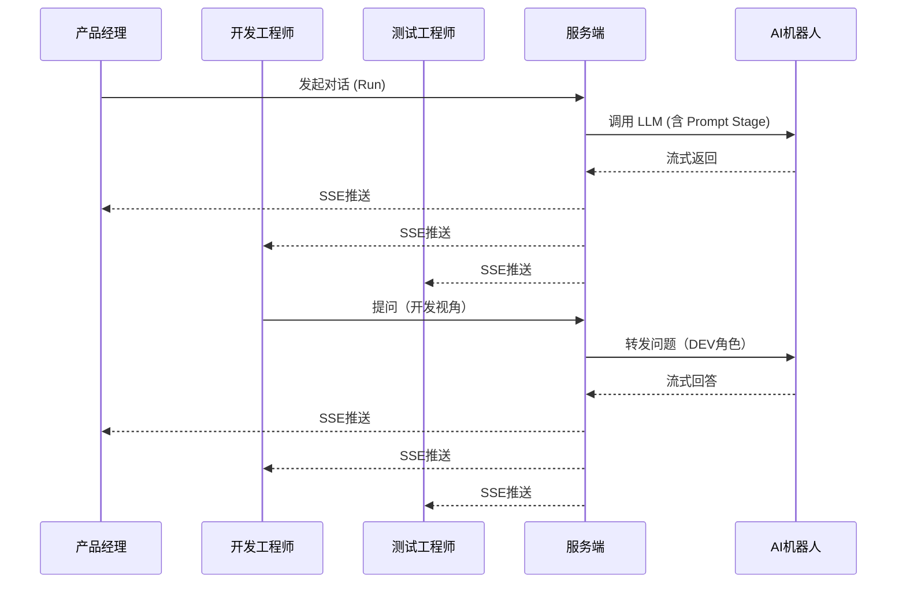
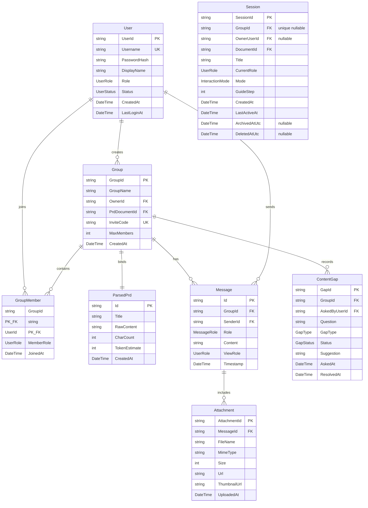

# PRD理解与交互智能体 软件需求规格说明书（SRS）

**文档版本**：v3.0
**创建日期**：2024年12月10日
**修订日期**：2026年1月22日
**项目名称**：PRD Agent（PRD智能解读助手）
**文档标准**：ISO/IEC/IEEE 29148:2018

---

## 修订历史

| 版本 | 日期 | 修订内容 | 作者 |
|------|------|----------|------|
| v1.0 | 2024-12-10 | 初稿 | - |
| v1.1 | 2024-12-10 | 增加系统架构、技术选型、通信协议等技术规格 | - |
| v2.0 | 2024-12-10 | 新增群组协作、用户角色（含超管）、Web管理后台、内容缺失检测等模块 | - |
| v3.0 | 2026-01-22 | 全面同步实现：废弃Guide模式、新增Run/Worker链路、Platform+Model架构、视觉代理、水印系统、权限矩阵、速率限制、应用身份隔离等 | - |

---

## 文档状态说明（重要）

本 SRS 于 2026-01-22 完成全面同步更新，已与仓库最新实现基本对齐。

### v3.0 已完成的主要对齐

- **交互模式** ✅ 已对齐：
  - 引导讲解（Guide）模式已完全删除
  - 新增 **提示词阶段**（Prompt Stages）体系，由管理后台配置
  - 新增 **Run/Worker** 对话闭环（`/sessions/{id}/messages/run` + `/chat-runs/{runId}/stream`），支持断线重连

- **模型配置体系** ✅ 已对齐：
  - 从"Provider + Model"演进为 **"Platform + Model"**
  - `(platformId, modelId)` 作为业务唯一标识

- **应用身份隔离** ✅ 新增：
  - 每个应用通过 `appKey` 标识（`prd-agent`、`visual-agent`、`literary-agent`）
  - Controller 层硬编码 appKey，不由前端传递

- **新增功能模块** ✅ 已记录：
  - 视觉代理（VisualAgent）：替代原 ImageMaster
  - 水印系统：appKey 绑定、字体管理、多锚点位置
  - 权限矩阵：SystemRole + allow - deny RBAC 模型
  - 速率限制：Redis 分布式限速
  - 液态玻璃主题：统一视觉样式

### 仍存在的"待决策冲突"

- **PRD 原文留存**：
  - 文档：强调"PRD 原文不落盘，仅缓存"
  - 实现：`ParsedPrd.RawContent` 持久化到 MongoDB，提供 `/api/v1/documents/{id}/content` 接口
  - **决策建议**：以实现为准，更新文档描述

- **系统 API 请求日志**：
  - 实现：`ApiRequestLogs` 记录部分 request body（上限 256KB）
  - 仅对 `prompt/messages/systemPrompt` 做 `<omitted>`，`documents.content` 未覆盖

维护流程详见：[`doc/0.doc-maintenance.md`](0.doc-maintenance.md)

---

## 目录

1. [引言](#第一章-引言)
2. [总体描述](#第二章-总体描述)
3. [系统架构与技术规格](#第三章-系统架构与技术规格)
4. [功能需求](#第四章-功能需求)
5. [外部接口需求](#第五章-外部接口需求)
6. [非功能性需求](#第六章-非功能性需求)
7. [数据模型](#第七章-数据模型)
8. [附录](#第八章-附录)

---

## 第一章 引言

### 1.1 目的

本文档旨在详细描述「PRD理解与交互智能体」的软件需求规格，为产品设计、开发实现、测试验收提供统一的需求基线。本文档遵循 ISO/IEC/IEEE 29148:2018 标准编写，包含完整的技术规格说明。

**目标读者**：

| 角色 | 使用目的 |
|------|----------|
| 产品经理 | 确认需求完整性，作为后续迭代基线 |
| 开发工程师 | 理解系统功能边界与技术架构，指导实现 |
| 测试工程师 | 制定测试用例，明确验收标准 |
| 项目经理 | 评估工作量，制定项目计划 |
| 架构师 | 评审技术方案，确保架构合理性 |

### 1.2 项目背景

随着MD文档在产品设计中的普及，产品方案文档呈现出以下结构性问题：

1. **文档膨胀**：越写越长、越写越散，从"可执行方案"退化为"长篇说明文"
2. **理解偏差**：研发与测试频繁反馈"看不懂""抓不住主流程"
3. **沟通依赖**：关键决策仅存在于口头沟通中，无法沉淀复用
4. **恶性循环**：文档不可执行 → 反复沟通补偿 → 信息再次丢失 → 文档继续膨胀

本系统的核心目标是：**用AI作为产品经理的"嘴替"，让"讲解"从依赖个人精力转变为可扩展、可复用、可追溯的系统能力。**

### 1.3 范围

#### 1.3.1 系统边界

**本系统包含**：
- PRD文档的智能解读与问答
- 基于产品/开发/测试三种角色视角的差异化讲解
- 交互式问答与主动引导讲解两种交互模式
- 多媒体消息支持：文本、截图、图片、附件文档等多种输入形式
- 桌面客户端应用（跨平台：Windows/macOS/Linux）
- 群组协作功能：产品经理创建讨论组，团队成员通过链接加入，共享AI讲解过程
- 内容缺失检测与提醒：当用户提问涉及PRD未覆盖内容时，提醒产品经理补全
- 后端API服务
- Web管理后台：用户管理、大模型监控、请求日志、Token统计、系统配置

**本系统不包含**：
- PRD文档的撰写与生成
- 项目管理、任务分配等协作功能
- 代码生成、自动化测试用例生成
- 多文档关联分析与知识图谱构建

#### 1.3.2 用户范围

| 角色 | 客户端 | 职责描述 |
|------|--------|----------|
| 产品经理（PM） | 桌面客户端 | 方案讲解"委托方"，创建群组、上传PRD、邀请成员、响应内容缺失提醒 |
| 开发工程师（DEV） | 桌面客户端 | 技术实现视角"理解方"，通过链接加入群组、提问、参与共享讲解 |
| 测试工程师（QA） | 桌面客户端 | 质量保障视角"理解方"，通过链接加入群组、提问、参与共享讲解 |
| 超级管理员（Admin） | Web管理后台 | 系统管理员，负责用户管理、大模型配置、日志监控、系统运维 |

### 1.4 术语定义

| 术语 | 定义 |
|------|------|
| PRD | Product Requirements Document，产品需求文档 |
| Agent | 智能体，指具备特定能力的AI系统 |
| Cache | 上下文缓存，指将完整文档加载至模型上下文的技术方案 |
| RAG | Retrieval-Augmented Generation，检索增强生成 |
| Tauri | 基于Rust的跨平台桌面应用框架 |
| WebView | 嵌入式浏览器组件，用于渲染前端界面 |
| IPC | Inter-Process Communication，进程间通信 |
| SSE | Server-Sent Events，服务器推送事件 |
| JWT | JSON Web Token，用于API认证的令牌 |
| Context Window | 大语言模型单次可处理的最大上下文长度 |
| Token | 模型处理文本的最小单位，约0.7个汉字或4个英文字符 |
| Group（群组/讨论组） | 由产品经理创建的协作空间，绑定一份PRD文档，成员共享AI讲解过程 |
| Invite Link（邀请链接） | 产品经理生成的唯一链接，其他用户通过该链接加入群组 |
| Content Gap（内容缺失） | 用户提问涉及PRD文档中未明确描述的内容，需提醒产品经理补充 |
| Admin Console（管理后台） | Web端管理界面，供超级管理员进行用户管理、日志监控、大模型配置等操作 |
| LLM Quota（模型配额） | 大语言模型API调用的Token限额与速率限制 |
| Attachment（附件） | 用户在对话中上传的非文本内容，包括截图、图片、文档等文件 |
| Multimodal（多模态） | 支持文本、图片等多种输入形式的AI交互能力 |

### 1.5 参考文档

| 文档名称 | 版本/链接 | 说明 |
|----------|-----------|------|
| ISO/IEC/IEEE 29148:2018 | - | 系统与软件工程 — 生命周期过程 — 需求工程 |
| 《问? 什么样的Agent最适合产研提效?》 | - | 项目背景分析与设计思路来源 |
| Tauri官方文档 | https://tauri.app/docs | 桌面应用框架参考 |
| ASP.NET Core文档 | https://docs.microsoft.com/aspnet/core | 后端框架参考 |
| Anthropic Claude API文档 | https://docs.anthropic.com | 大语言模型API参考 |
| OpenAI GPT-4 API文档 | https://platform.openai.com/docs | 大语言模型API参考 |

### 1.6 文档约定

- **[必须]**：表示强制性需求，系统必须实现
- **[应该]**：表示推荐性需求，系统应当实现
- **[可选]**：表示可选需求，根据资源情况决定是否实现
- 需求编号规则：`[模块缩写]-[序号]`，如 `DOC-001`

### 1.7 文档结构与阅读指引

- 第一章：阅读目的、范围、角色、术语，快速了解文档适用人群
- 第二章：产品愿景、用户特征、约束与假设，判断方案边界
- 第三章：架构与技术规格，定位端到端技术栈与通信路径
- 第四章：功能需求，按编号查看输入/流程/输出/异常与验收
- 第五章：外部接口，查找UI/IPC/API协议、错误码与鉴权方式
- 第六章：非功能性需求，查看性能/安全/可用性/维护性指标
- 第七章：数据模型，查询实体关系、字段定义与数据约束
- 第八章：附录，查看角色Prompt模板、配置清单、开发要求等

---

## 第二章 总体描述

### 2.1 产品愿景

构建一个**专精于PRD理解**的智能Agent，实现：

> **"文档即共识"** —— 任何角色在首次阅读时即可完整理解方案背景、核心流程与边界条件，无需依赖额外的口头讲解。

### 2.2 核心设计原则

基于早期项目"米多智库"的失败教训，本系统严格遵循以下四项设计原则：

| 原则 | 策略 | 实现方式 |
|------|------|----------|
| 面向资料 | 收窄知识边界 | 仅针对当前加载的PRD文档 |
| 面向群体 | 锁定专业用户 | 产品经理、开发、测试三种角色 |
| 面向问题 | 限定问题分类 | 具象问题，描述性输出 |
| 面向技术 | Cache替代RAG | 完整上下文加载，不做任何切分 |

### 2.3 产品功能概览



### 2.4 用户特征

#### 2.4.1 产品经理

| 属性 | 描述 |
|------|------|
| 技术背景 | 中等，熟悉Markdown语法 |
| 使用场景 | 上传PRD后，让系统代为讲解方案 |
| 核心诉求 | 减少重复讲解的时间成本 |
| 使用频率 | 每个迭代周期多次 |

#### 2.4.2 开发工程师

| 属性 | 描述 |
|------|------|
| 技术背景 | 高，关注技术实现细节 |
| 使用场景 | 快速理解PRD中的技术要求、状态流转、接口设计 |
| 核心诉求 | 精准定位关注的技术点，减少阅读全文时间 |
| 使用频率 | 需求评审、开发过程中多次 |

#### 2.4.3 测试工程师

| 属性 | 描述 |
|------|------|
| 技术背景 | 中高，关注边界条件与异常场景 |
| 使用场景 | 快速识别测试点、边界条件、验收标准 |
| 核心诉求 | 不遗漏测试场景，明确验收标准 |
| 使用频率 | 测试设计、测试执行阶段多次 |

#### 2.4.4 超级管理员

| 属性 | 描述 |
|------|------|
| 技术背景 | 高，熟悉系统运维、监控与安全 |
| 使用场景 | 通过Web管理后台进行用户管理、大模型配置、日志监控、系统运维 |
| 核心诉求 | 保障系统稳定运行，监控资源消耗，管理用户权限 |
| 使用频率 | 日常运维、异常排查、配置变更时使用 |
| 客户端 | Web管理后台（非桌面客户端） |

### 2.5 设计约束

1. **模型依赖**：系统核心能力依赖外部LLM API（Claude/GPT-4），需确保API可用性
2. **上下文限制**：单次会话的PRD文档大小受模型Context Window限制（目前最大支持100万Token）
3. **语言限制**：首期仅支持中文PRD文档解析与交互
4. **格式限制**：仅支持Markdown格式的PRD文档
5. **平台限制**：桌面客户端需支持Windows 10+、macOS 11+、Ubuntu 20.04+
6. **合规与审计**：PRD原文不落盘（仅缓存）；传输仅限HTTPS；日志仅对密钥/Token/密码等**密钥类字段**脱敏（不做内容级`[REDACTED]`）；为便于排障，LLM请求日志允许保留**用户问题**与**模型最终回答**（单条≤200k字符，超出截断并记录长度/哈希用于对照）；`running` 状态超过阈值必须自动纠错为 `TIMEOUT`，避免长期“进行中”

### 2.6 假设与依赖

| 假设/依赖 | 说明 |
|-----------|------|
| LLM API可用 | 系统依赖Claude或GPT-4 API，需确保网络可达且API Key有效 |
| PRD格式规范 | 假设输入的PRD文档具有基本的Markdown结构（标题层级、列表等） |
| 用户具备专业背景 | 假设用户为产研团队成员，具备基本的产品/技术理解能力 |
| 网络连接 | 桌面客户端需要网络连接以访问后端服务 |
| 数据库可用 | 系统依赖MongoDB存储用户、群组、消息、缺失记录、LLM请求日志等持久化数据 |
| 对象存储可用 | 附件上传依赖S3兼容对象存储服务（如MinIO/阿里云OSS） |
| 邮件服务（可选） | 告警通知依赖邮件服务或Webhook，可选配置 |

### 2.7 产品环境与外部依赖

- 外部服务：LLM供应商（Claude/OpenAI），需稳定的HTTPS访问与可用配额
- 数据库：MongoDB 8.0+，存储用户、群组、消息历史、缺失记录、LLM请求日志、审计日志
- 缓存与会话：依赖Redis存放会话状态与分布式锁，超时后清理
- 对象存储：S3兼容存储（MinIO/阿里云OSS/AWS S3），存储附件文件
- 部署环境：Docker Compose（当前实现）；K8s + 负载均衡为目标架构（⚠️ 未配置）
- 客户端运行环境：需可用WebView（Win WebView2 / macOS WebKit / Linux WebKitGTK）
- 合规约束：PRD原文不落盘（仅缓存）；敏感信息通过环境变量/密钥管理注入；日志仅隐藏密钥/Token/密码等**密钥类字段**，允许保留用户问题与模型回答用于排障（单条≤200k字符）

---

## 第三章 系统架构与技术规格

### 3.1 系统架构总览



### 3.2 技术选型规格

#### 3.2.1 桌面客户端技术栈

| 层级 | 技术 | 版本要求 | 说明 |
|------|------|----------|------|
| **应用框架** | Tauri | 2.0+ | Rust后端 + WebView前端的跨平台桌面框架 |
| **核心语言** | Rust | 1.70+ | 系统级编程，负责文件I/O、IPC、安全 |
| **前端框架** | React | 18.0+ | 用户界面渲染 |
| **前端语言** | TypeScript | 5.0+ | 类型安全的JavaScript |
| **构建工具** | Vite | 5.0+ | 快速的前端构建工具 |
| **状态管理** | Zustand | 4.0+ | 轻量级状态管理 |
| **UI组件** | Tailwind CSS + Radix UI | - | 样式与无障碍组件 |
| **Markdown渲染** | react-markdown | 9.0+ | Markdown内容渲染 |
| **HTTP客户端** | reqwest (Rust) | 0.11+ | Rust侧HTTP请求 |

**桌面客户端目录结构**：
```
prd-desktop/
├── src-tauri/                  # Rust后端代码
│   ├── src/
│   │   ├── main.rs            # 应用入口
│   │   ├── commands/          # Tauri命令
│   │   │   ├── mod.rs
│   │   │   ├── document.rs    # 文档相关命令
│   │   │   └── session.rs     # 会话相关命令
│   │   ├── services/          # 业务服务
│   │   │   ├── mod.rs
│   │   │   ├── api_client.rs  # API客户端
│   │   │   └── cache.rs       # 本地缓存
│   │   └── models/            # 数据模型
│   │       └── mod.rs
│   ├── Cargo.toml             # Rust依赖配置
│   └── tauri.conf.json        # Tauri配置
├── src/                        # React前端代码
│   ├── components/            # UI组件
│   │   ├── Chat/
│   │   ├── Document/
│   │   ├── Role/
│   │   ├── Group/
│   │   ├── Comments/
│   │   ├── KnowledgeBase/
│   │   ├── Settings/
│   │   └── Effects/
│   ├── hooks/                 # 自定义Hooks
│   ├── stores/                # Zustand状态
│   ├── services/              # 前端服务
│   ├── types/                 # TypeScript类型
│   ├── App.tsx
│   └── main.tsx
├── package.json
├── vite.config.ts
└── tsconfig.json
```

#### 3.2.2 后端服务技术栈

| 层级 | 技术 | 版本要求 | 说明 |
|------|------|----------|------|
| **运行时** | .NET | 8.0+ | LTS版本 |
| **Web框架** | ASP.NET Core | 8.0+ | 高性能Web API框架 |
| **语言** | C# | 12.0+ | 主要开发语言 |
| **API风格** | RESTful + SSE | - | REST接口 + 服务器推送事件 |
| **序列化** | System.Text.Json | - | JSON序列化 |
| **HTTP客户端** | HttpClient + Polly | - | HTTP请求与重试策略 |
| **缓存** | Redis / IMemoryCache | 7.0+ | 会话缓存与分布式锁 |
| **数据库** | MongoDB | 8.0+ | 用户、群组、消息、缺失记录、LLM请求日志等持久化存储 |
| **数据访问** | MongoDB.Driver | - | MongoDB官方驱动 |
| **对象存储** | S3兼容存储/(腾讯云COS） | - | 附件文件存储 |
| **日志** | Serilog | 3.0+ | 结构化日志 |
| **认证** | JWT Bearer | - | 用户认证与授权 |
| **配置** | IConfiguration | - | 配置管理 |
| **依赖注入** | 内置DI容器 | - | 依赖注入 |

#### 3.2.3 Web管理后台技术栈

| 层级 | 技术 | 版本要求 | 说明 |
|------|------|----------|------|
| **前端框架** | React | 18.0+ | 用户界面渲染 |
| **语言** | TypeScript | 5.0+ | 类型安全的JavaScript |
| **构建工具** | Vite | 5.0+ | 快速的前端构建工具 |
| **UI组件** | Ant Design | 5.0+ | 企业级UI组件库 |
| **状态管理** | Zustand | 4.0+ | 轻量级状态管理 |
| **图表** | ECharts / Recharts | - | 数据可视化 |
| **HTTP客户端** | Axios | - | API请求 |

**后端服务目录结构**：
```
prd-api/
├── src/
│   ├── PrdAgent.Api/              # API层
│   │   ├── Controllers/
│   │   │   ├── AuthController.cs         # 用户认证
│   │   │   ├── UsersController.cs        # 用户管理
│   │   │   ├── GroupsController.cs       # 群组管理
│   │   │   ├── DocumentsController.cs    # 文档上传
│   │   │   ├── SessionsController.cs     # 会话管理
│   │   │   ├── MessagesController.cs     # 消息发送
│   │   │   ├── ChatRunsController.cs     # Run/Worker 对话闘环
│   │   │   ├── AttachmentsController.cs  # 附件上传
│   │   │   ├── GapsController.cs         # 内容缺失
│   │   │   └── Admin/                    # 管理后台API
│   │   │       ├── AdminUsersController.cs
│   │   │       ├── AdminLLMConfigController.cs
│   │   │       ├── AdminLlmLogsController.cs
│   │   │       └── AdminStatsController.cs
│   │   ├── Middleware/
│   │   │   ├── ExceptionMiddleware.cs
│   │   │   ├── AuthMiddleware.cs
│   │   │   └── RateLimitMiddleware.cs
│   │   ├── Models/
│   │   │   ├── Requests/
│   │   │   └── Responses/
│   │   └── Program.cs
│   ├── PrdAgent.Core/             # 核心业务层
│   │   ├── Services/
│   │   │   ├── IUserService.cs
│   │   │   ├── UserService.cs
│   │   │   ├── IGroupService.cs
│   │   │   ├── GroupService.cs
│   │   │   ├── IDocumentService.cs
│   │   │   ├── DocumentService.cs
│   │   │   ├── ISessionService.cs
│   │   │   ├── SessionService.cs
│   │   │   ├── IChatService.cs
│   │   │   ├── ChatService.cs
│   │   │   ├── IChatRunService.cs
│   │   │   ├── ChatRunService.cs
│   │   │   ├── IAttachmentService.cs
│   │   │   ├── AttachmentService.cs
│   │   │   ├── IGapDetectionService.cs
│   │   │   ├── GapDetectionService.cs
│   │   │   ├── IAdminService.cs
│   │   │   └── AdminService.cs
│   │   ├── Models/
│   │   │   ├── User.cs
│   │   │   ├── Group.cs
│   │   │   ├── GroupMember.cs
│   │   │   ├── Session.cs
│   │   │   ├── ParsedPrd.cs
│   │   │   ├── Message.cs
│   │   │   ├── Attachment.cs
│   │   │   ├── ContentGap.cs
│   │   │   └── Enums.cs
│   │   └── Interfaces/
│   └── PrdAgent.Infrastructure/   # 基础设施层
│       ├── LLM/
│       │   ├── ILLMClient.cs
│       │   ├── ClaudeClient.cs
│       │   └── OpenAIClient.cs
│       ├── Cache/
│       │   └── SessionCacheManager.cs
│       ├── Storage/
│       │   ├── IFileStorage.cs
│       │   └── OssFileStorage.cs
│       ├── Database/
│       │   ├── MongoDbContext.cs
│       │   └── Repositories/
│       ├── Prompts/
│       │   ├── IPromptManager.cs
│       │   ├── PromptManager.cs
│       │   └── Templates/
│       │       ├── pm.md
│       │       ├── dev.md
│       │       └── qa.md
│       └── Markdown/
│           └── MarkdownParser.cs
├── tests/
│   ├── PrdAgent.Api.Tests/
│   ├── PrdAgent.Core.Tests/
│   └── PrdAgent.Infrastructure.Tests/
├── PrdAgent.sln
└── docker-compose.yml
```

**Web管理后台目录结构**：
```
prd-admin/
├── src/
│   ├── components/            # UI组件
│   │   ├── Layout/
│   │   ├── Dashboard/
│   │   ├── Users/
│   │   ├── LLMConfig/
│   │   ├── Logs/
│   │   └── Stats/
│   ├── pages/                 # 页面
│   │   ├── DashboardPage.tsx
│   │   ├── UsersPage.tsx
│   │   ├── LLMConfigPage.tsx
│   │   ├── LogsPage.tsx
│   │   └── StatsPage.tsx
│   ├── services/              # API服务
│   ├── stores/                # 状态管理
│   ├── types/                 # TypeScript类型
│   ├── App.tsx
│   └── main.tsx
├── package.json
├── vite.config.ts
└── tsconfig.json
```

#### 3.2.3 LLM服务规格

| 属性 | Claude | OpenAI GPT-4 |
|------|--------|--------------|
| 模型版本 | claude-3-5-sonnet-20241022 | gpt-4-turbo-2024-04-09 |
| 最大上下文 | 200K tokens | 128K tokens |
| 缓存支持 | Prompt Caching (beta) | - |
| 流式输出 | 支持 | 支持 |
| API端点 | https://api.anthropic.com/v1 | https://api.openai.com/v1 |

#### 3.2.4 LLM 调度与日志要求（强制）

1. **三级调度默认启用**：所有 LLM 请求必须通过统一调度算法选择模型，调度顺序为  
   **专属模型池 → 默认模型池 → 直连单模型**。  
   **例外**：模型实验室（ModelLab）允许直接选择模型进行测试，不走调度，但仍需记录 `LlmRequestContext` 且 `ModelResolutionType=DirectModel`。
2. **统一入口**：业务层不得直接构造 LLM 客户端；必须经 `ISmartModelScheduler` 获取客户端或解析结果。
3. **请求日志字段完整**：每次 LLM 请求必须写入 `LlmRequestContext`，至少包含  
   `RequestType`、`RequestPurpose`、`ModelResolutionType`、`ModelGroupId`、`ModelGroupName`。

### 3.3 通信协议规格

#### 3.3.1 客户端-服务器通信



#### 3.3.2 Tauri IPC 命令规格

**IPC命令清单**：

| 命令名 | 参数 | 返回值 | 说明 |
|--------|------|--------|------|
| `upload_document` | `file_path?: string, content?: string` | `UploadResult` | 上传PRD文档 |
| `send_message` | `session_id: string, content: string, role: string` | `void` | 发送消息（通过事件推送响应） |
| `switch_role` | `session_id: string, role: string` | `RoleResult` | 切换角色 |
| `create_run` | `session_id: string, content: string` | `RunResult` | 创建对话 Run |
| `subscribe_run` | `run_id: string, after_seq?: int` | `void` | 订阅 Run 流（支持断线重连） |
| `cancel_run` | `run_id: string` | `void` | 取消 Run |

**IPC事件清单**：

| 事件名 | 数据结构 | 说明 |
|--------|----------|------|
| `message-chunk` | `{ type: string, content?: string, seq?: int }` | 流式消息响应 |
| `run-status` | `{ runId: string, status: string }` | Run 状态变更 |
| `error` | `{ code: string, message: string }` | 错误事件 |

#### 3.3.3 HTTP API 协议规格

**基础信息**：
- 基础URL：`https://{server-host}/api/v1`
- 内容类型：`application/json`
- 认证方式：Bearer Token（可选）
- 字符编码：UTF-8

**通用响应格式**：
```json
{
  "success": true,
  "data": { ... },
  "error": null
}

// 错误响应
{
  "success": false,
  "data": null,
  "error": {
    "code": "DOCUMENT_TOO_LARGE",
    "message": "文档超出大小限制（最大10MB）"
  }
}
```

**错误码定义**：

| 错误码 | HTTP状态码 | 说明 |
|--------|------------|------|
| INVALID_FORMAT | 400 | 文件格式不支持 |
| CONTENT_EMPTY | 400 | 文档内容为空 |
| DOCUMENT_TOO_LARGE | 413 | 文档超出大小限制 |
| SESSION_NOT_FOUND | 404 | 会话不存在 |
| SESSION_EXPIRED | 410 | 会话已过期 |
| LLM_ERROR | 502 | LLM服务调用失败 |
| INTERNAL_ERROR | 500 | 服务器内部错误 |

#### 3.3.4 SSE 流式响应规格（Run/Worker 模式）

**Run/Worker 对话流程**：


**创建 Run**：
```
POST /api/v1/sessions/{sessionId}/messages/run
Content-Type: application/json
```

**订阅 Run（支持断线重连）**：
```
GET /api/v1/chat-runs/{runId}/stream?afterSeq=0
Accept: text/event-stream
Last-Event-ID: {lastSeq}  // 可选，断线重连时使用
```

**事件格式**：
```
id: 1
event: message
data: {"type": "start", "messageId": "msg-xxx", "seq": 1}

id: 2
event: message
data: {"type": "delta", "content": "这是", "seq": 2}

id: 3
event: message
data: {"type": "delta", "content": "回答内容", "seq": 3}

id: 4
event: message
data: {"type": "done", "messageId": "msg-xxx", "seq": 4, "tokenUsage": {"input": 1500, "output": 200}}

event: error
data: {"code": "LLM_ERROR", "message": "模型调用超时"}
```

**断线重连机制**：
- 客户端断线后，携带 `afterSeq` 参数或 `Last-Event-ID` 头重新连接
- 服务端从 `afterSeq` 之后的事件开始推送，避免重复
- 若 Run 已完成，直接返回最终结果

**Run 状态**：`Queued` → `Running` → `Done` / `Error` / `Cancelled` / `Timeout`

**超时纠错**：`Running` 状态超过阈值（默认 120s）自动纠正为 `Timeout`

### 3.4 部署架构

#### 3.4.1 开发环境



#### 3.4.2 生产环境（目标架构）

> **⚠️ 当前实现**：仅有 `docker-compose.yml` 部署。以下 K8s 集群为目标架构规划。



#### 3.4.3 部署要求

**后端服务部署要求**：

| 要求项 | 规格 |
|--------|------|
| 容器化 | 支持Docker部署 |
| 端口 | HTTP 80 / HTTPS 443 |
| 健康检查 | 提供 `/health` 端点 |
| 配置注入 | 通过环境变量注入敏感配置（API Key等） |
| 日志输出 | 结构化日志，支持stdout输出 |

**必需的环境变量**：

| 变量名 | 说明 | 示例 |
|--------|------|------|
| `LLM__Provider` | LLM服务商 | `Claude` 或 `OpenAI` |
| `LLM__Claude__ApiKey` | Claude API密钥 | - |
| `LLM__OpenAI__ApiKey` | OpenAI API密钥 | - |
| `Cache__SessionTimeout` | 会话超时（秒） | `1800` |

**桌面客户端打包要求**：

| 平台 | 打包格式 |
|------|----------|
| Windows | MSI安装包 |
| macOS | DMG镜像 |
| Linux | DEB包 / AppImage |

> **注**：具体的Dockerfile、docker-compose.yml、tauri.conf.json等配置文件请参考项目仓库中的开发文档。

### 3.5 运行环境要求

#### 3.5.1 服务器环境

| 项目 | 最低要求 | 推荐配置 |
|------|----------|----------|
| 操作系统 | Linux (Ubuntu 20.04+ / CentOS 8+) | Ubuntu 22.04 LTS |
| .NET Runtime | 8.0+ | 8.0 LTS |
| CPU | 2核心 | 4核心+ |
| 内存 | 4GB | 8GB+ |
| 存储 | 20GB | 50GB+ SSD |
| 网络带宽 | 10Mbps | 100Mbps+ |

#### 3.5.2 客户端环境

**Windows**：
| 项目 | 要求 |
|------|------|
| 操作系统 | Windows 10 (1803+) / Windows 11 |
| WebView2 | 自动安装 |
| 内存 | 4GB+ |
| 存储 | 200MB（安装包） |

**macOS**：
| 项目 | 要求 |
|------|------|
| 操作系统 | macOS 11 (Big Sur)+ |
| 架构 | x86_64 / Apple Silicon (arm64) |
| 内存 | 4GB+ |
| 存储 | 150MB（安装包） |

**Linux**：
| 项目 | 要求 |
|------|------|
| 发行版 | Ubuntu 20.04+ / Fedora 35+ / Debian 11+ |
| WebKitGTK | 4.0+ |
| 内存 | 4GB+ |
| 存储 | 100MB（安装包） |

---

## 第四章 功能需求

### 4.0 需求描述格式与共性约束

- 每条需求应包含：前置条件、输入（含类型/必填/长度）、处理步骤、输出（含类型/长度/格式）、异常/超时/错误码、并发/配额、重试与幂等、审计与日志、验收标准
- 通用异常处理：若依赖下游（LLM/缓存/网络）失败，需可重试（≤3次，指数退避），失败后返回明确错误码与提示
- 并发与配额：会话并发、消息频率、文档大小需有上限并返回可理解的配额提示
- 幂等性：写入类接口需支持Idempotency-Key，重复请求不得造成重复资源
- 审计与日志：记录关键操作（上传文档、切换角色、启动/停止引导、配置变更）；**审计日志**仅记录元数据与结果，且仅对密钥类字段脱敏；**LLM请求日志**用于排障可保留用户问题与模型最终回答（≤200k字符），不记录 raw SSE；必须保证 `done/error/firstByte` 状态写入可靠，且提供 `running` 超时纠错

#### 4.0.1 服务器优先闭环（AI 操作强制原则）

**原则**：任何 AI 相关操作（对话/解析/生图/上传后处理/结构化提取等），从“客户端发出指令”的那一刻开始，**闭环必须在服务器内完成**。客户端永远只是**指令发送者 + 状态观察者 + 结果渲染器**。

**必须满足**：
1. **任务化**：客户端发起请求后，服务器应立即返回 `taskId/runId`（或等价标识），并在服务器侧持久化任务元数据与状态（`Queued/Running/Done/Error/Cancelled` 等）。
2. **服务端执行**：耗时计算与调用（LLM/图像生成/文档解析/文件转换/上传落盘/回填）必须由服务器后台执行（worker/队列/轮询 claim），不得绑定在单个 HTTP 连接存活期。
3. **服务端落盘**：任务产物必须由服务器落盘到可靠介质（数据库元数据 + 对象存储/COS 大内容），并保证幂等与去重；客户端不得成为唯一持有者。
4. **可订阅/可查询**：服务器提供
   - 查询接口（`GET /.../runs/{runId}`）用于恢复；
   - 订阅接口（SSE `GET /.../runs/{runId}/stream?afterSeq=...`）用于实时进度与断线续传。
5. **断线不浪费**：客户端切换页面、刷新、断网、崩溃或关机，不应导致任务中断或结果丢失；客户端重进后可通过 `runId` 或业务对象（会话/workspace）重新恢复最终结果。
6. **幂等**：创建类/写入类接口必须支持 `Idempotency-Key`，重复提交不得创建重复任务/重复资源；服务端需对并发重复请求正确返回同一个 `runId` 或同一个资源。

**推荐落地模式（示例）**：
- 对话：`POST /sessions/{id}/messages`（立即返回 messageId/traceId） + SSE 流式输出；服务器确保 `done/error/firstByte` 写入可靠，并支持断线重连不重复首段。
- 生图：`POST /image-gen/runs` 创建 `runId` → `ImageGenRunWorker` 后台执行 → SSE/查询恢复 → 最终产物落对象存储并写回业务资源（如 workspace 资产/画布）。

### 4.1 功能模块总览



### 4.2 PRD文档加载模块

#### 4.2.1 DOC-001 文档上传（客户端）

| 属性 | 描述 |
|------|------|
| 需求编号 | DOC-001 |
| 需求名称 | PRD文档上传 |
| 优先级 | **[必须]** |
| 实现层 | 桌面客户端（Tauri + React） |

**功能详述**：
1. 支持通过文件选择器选择`.md`文件
2. 支持拖拽文件到指定区域上传
3. 支持直接粘贴Markdown文本内容
4. 文件大小限制为10MB
5. 上传过程显示进度指示

**前置条件**：客户端已联网；文件存在且可读  
**输入**：`file_path` 或 `content`（UTF-8，≤10MB）  
**处理**：校验格式与大小，读取内容并发送至后端；展示进度  
**输出**：成功返回`sessionId`与解析结果；失败返回错误码（如`INVALID_FORMAT`、`DOCUMENT_TOO_LARGE`）  
**异常/超时**：网络/后端错误需提示并可重试，超时<10秒  

**验收标准**：
- [ ] 可通过文件选择器上传.md文件
- [ ] 可拖拽文件到上传区域
- [ ] 可直接粘贴文本内容
- [ ] 超过10MB的文件给出明确提示
- [ ] 上传过程有进度指示

#### 4.2.2 DOC-002 文档解析（服务端）

| 属性 | 描述 |
|------|------|
| 需求编号 | DOC-002 |
| 需求名称 | Markdown文档解析 |
| 优先级 | **[必须]** |
| 实现层 | 后端服务（.NET Core） |

**功能详述**：
1. 解析Markdown标题层级（H1-H6）
2. 识别有序列表、无序列表、表格
3. 保留代码块、引用块的原始格式
4. 提取文档元数据（标题、字数统计等）
5. 估算Token数量

**服务能力要求**：

| 能力 | 说明 |
|------|------|
| 文档解析 | 解析Markdown内容，返回结构化文档对象 |
| 结构提取 | 提取文档的章节层级结构 |
| Token估算 | 估算文档的Token数量 |

**验收标准**：
- [ ] 正确识别所有级别的Markdown标题
- [ ] 正确解析表格、列表结构
- [ ] Token估算误差在10%以内
- [ ] 解析时间 < 1秒（10万字以内）

### 4.3 角色视角适配模块

#### 4.3.1 ROLE-001 角色选择

| 属性 | 描述 |
|------|------|
| 需求编号 | ROLE-001 |
| 需求名称 | 用户角色选择 |
| 优先级 | **[必须]** |
| 实现层 | 客户端 + 服务端 |

**功能详述**：
1. 提供三种角色选项：产品经理(PM)、开发(DEV)、测试(QA)
2. 支持会话中途切换角色
3. 默认角色为"产品经理"
4. 角色选择后，UI明确显示当前角色状态

**角色视角差异**：

| 角色 | 关注重点 | 回答风格 | 典型问题 |
|------|----------|----------|----------|
| 产品经理 | 业务目标、用户价值、优先级 | 偏业务语言，关注"为什么" | "这个功能的核心价值是什么？" |
| 开发 | 技术实现、接口设计、数据流转 | 偏技术语言，关注"怎么做" | "这个状态流转的边界条件是什么？" |
| 测试 | 边界条件、异常场景、验收标准 | 偏验证语言，关注"怎么验" | "这个流程有哪些异常分支需要覆盖？" |

**验收标准**：
- [ ] 界面提供清晰的角色切换入口
- [ ] 切换角色后回答风格有明显差异
- [ ] 角色状态在整个会话中保持一致

#### 4.3.2 ROLE-002 角色Prompt模板管理

| 属性 | 描述 |
|------|------|
| 需求编号 | ROLE-002 |
| 需求名称 | 角色Prompt模板管理 |
| 优先级 | **[必须]** |
| 实现层 | 后端服务（.NET Core） |

**功能详述**：
1. 每种角色对应独立的System Prompt模板
2. 模板以Markdown文件形式存储，支持热更新
3. 模板定义：角色身份、关注领域、回答风格、输出格式

**服务能力要求**：

| 能力 | 说明 |
|------|------|
| 获取角色Prompt | 根据角色类型返回对应的System Prompt |
| 构建完整Prompt | 组装角色Prompt + PRD内容 + 对话历史 |
| 模板热更新 | 支持运行时重新加载模板，无需重启 |

**角色枚举**：`PM`（产品经理）、`DEV`（开发）、`QA`（测试）

**验收标准**：
- [ ] 三种角色模板均已配置且可用
- [ ] 模板变更后无需重启即可生效
- [ ] 不同角色回答同一问题时视角明显不同

### 4.4 交互模式模块

#### 4.4.1 CHAT-001 问答模式

| 属性 | 描述 |
|------|------|
| 需求编号 | CHAT-001 |
| 需求名称 | 智能问答交互 |
| 优先级 | **[必须]** |
| 实现层 | 全栈 |

**功能详述**：
1. 支持自然语言提问
2. 回答严格基于已加载的PRD内容
3. 对于PRD中未提及的内容，明确告知"文档中未找到相关信息"
4. 支持多轮连续对话，保持上下文连贯
5. 支持流式输出（打字机效果）

**前置条件**：会话已创建且未过期；角色已确定  
**输入**：`content`（UTF-8，≤16KB）、`role`（可选，PM/DEV/QA）  
**处理**：构建Prompt（角色+PRD+历史），调用LLM流式返回  
**输出**：SSE流式消息`start/delta/done`，附token用量  
**异常/超时**：LLM超时/限流重试≤3次；超出范围问题返回拒答提示；网络断线可重连继续

**交互流程**：


**服务能力要求**：

| 能力 | 说明 |
|------|------|
| 发送消息 | 接收用户问题，流式返回AI回答 |
| 角色适配 | 根据当前角色调整回答视角 |
| 上下文维护 | 保持多轮对话的上下文连贯 |

**流式响应事件类型**：`start`（开始）、`delta`（内容片段）、`done`（完成）

**验收标准**：
- [ ] 问答响应首字延迟 < 2秒
- [ ] 回答内容与PRD文档相关且准确
- [ ] PRD中不存在的信息不会被编造
- [ ] 多轮对话上下文连贯
- [ ] 流式输出平滑无卡顿

#### 4.4.2 CHAT-002 问题边界识别

| 属性 | 描述 |
|------|------|
| 需求编号 | CHAT-002 |
| 需求名称 | 问题边界识别与拒答 |
| 优先级 | **[必须]** |
| 实现层 | 后端服务 |

**功能详述**：
1. 通过Prompt指令控制回答边界
2. 识别与PRD无关的问题（如闲聊、通用知识问答）
3. 对超出范围的问题给出友好的拒答

**验收标准**：
- [ ] 准确识别80%以上的无关问题
- [ ] 拒答时语气友好，不生硬
- [ ] 拒答后给出有效的问题引导

#### 4.4.4 CHAT-003 问答并发与配额控制

| 属性 | 描述 |
|------|------|
| 需求编号 | CHAT-003 |
| 需求名称 | 问答并发/频率控制 |
| 优先级 | **[必须]** |
| 实现层 | 后端服务 |

**功能详述**：
1. 单会话并发回答上限（如1条进行中）；超限返回错误码`RATE_LIMITED`
2. 每分钟请求频率限制，超过后需等待或提示冷却时间
3. 支持Idempotency-Key防止重复提交同一问题
4. SSE断线后可携带上次messageId重连，避免重复回答

**验收标准**：
- [ ] 并发请求超过上限时返回429与`RATE_LIMITED`
- [ ] 重复Idempotency-Key不产生重复回答
- [ ] 断线重连后不重复首段内容，且能完成回答

#### 4.4.3 PROMPT-001 提示词阶段体系（替代原 GUIDE-001）

> **变更说明**：原"引导讲解（Guide）"模式已于 v3.0 完全删除，由"提示词阶段（Prompt Stages）"体系替代。

| 属性 | 描述 |
|------|------|
| 需求编号 | PROMPT-001 |
| 需求名称 | 提示词阶段管理 |
| 优先级 | **[必须]** |
| 实现层 | Web管理后台 + 后端服务 |

**功能详述**：
1. 管理员可配置多个"提示词阶段"（Prompt Stage）
2. 每个阶段定义：名称、promptKey、System Prompt 模板、适用角色
3. 客户端通过 `promptKey` 参数触发特定阶段的对话
4. 支持运行时热更新，无需重启服务

**提示词阶段数据结构**：

| 字段 | 类型 | 说明 |
|------|------|------|
| `id` | string | 阶段唯一标识 |
| `name` | string | 阶段名称（如"技术方案概述"） |
| `promptKey` | string | 客户端调用标识（如 `tech-overview`） |
| `systemPrompt` | string | System Prompt 模板（支持变量替换） |
| `roles` | string[] | 适用角色（`pm`、`dev`、`qa`） |
| `order` | int | 排序权重 |
| `isActive` | bool | 是否启用 |

**管理后台能力**：

| 能力 | 说明 |
|------|------|
| 列表查看 | 分页查看所有提示词阶段 |
| 创建阶段 | 新建提示词阶段 |
| 编辑阶段 | 修改阶段配置与 Prompt 模板 |
| 启用/禁用 | 控制阶段是否生效 |
| 排序调整 | 拖拽调整阶段顺序 |

**API 端点**：
- `GET /api/v1/admin/prompt-stages` - 获取阶段列表
- `POST /api/v1/admin/prompt-stages` - 创建阶段
- `PUT /api/v1/admin/prompt-stages/{id}` - 更新阶段
- `DELETE /api/v1/admin/prompt-stages/{id}` - 删除阶段

**验收标准**：
- [x] 管理员可创建、编辑、删除提示词阶段
- [x] 客户端可通过 promptKey 触发特定阶段对话
- [x] 配置变更实时生效
- [x] 支持按角色筛选可用阶段

### 4.5 会话管理模块

#### 4.5.1 SESSION-001 会话生命周期管理

| 属性 | 描述 |
|------|------|
| 需求编号 | SESSION-001 |
| 需求名称 | 会话生命周期管理 |
| 优先级 | **[必须]** |
| 实现层 | 后端服务 |

**功能详述**：
1. 上传PRD后自动创建新会话
2. 会话包含：PRD文档、角色状态、对话历史、交互模式
3. **对话上下文缓存**支持超时自动清理（默认30分钟滑动过期），用于控制资源与性能
4. **会话元数据（session）持久化为 IM 形态**：不再默认“30分钟无操作即消失”，支持归档/删除（软删除）

**服务能力要求**：

| 能力 | 说明 |
|------|------|
| 创建会话 | 上传文档后创建新会话 |
| 获取会话 | 根据sessionId获取会话状态 |
| 更新会话 | 更新角色、模式、历史等状态 |
| 删除会话 | 手动删除/结束会话（软删除） |
| 归档会话 | 归档/取消归档会话（个人会话） |
| 清理缓存 | 定时清理对话上下文缓存（不影响会话元数据） |

**交互模式**：`QA`（问答模式）— 通过"提示词阶段"（Prompt Stages）控制对话上下文

**验收标准**：
- [ ] 会话创建成功后返回唯一sessionId
- [ ] 会话元数据可长期保留，并支持归档/删除
- [ ] 对话上下文缓存可独立清理，且不影响会话与消息持久化

### 4.6 异常与降级策略

| 场景 | 处理策略 | 验收标准 |
|------|----------|----------|
| SSE断流/网络抖动 | 客户端自动重连；服务器支持Idempotent重放最近一条消息 | 重连后不重复/丢失消息 |
| LLM超时/限流 | 启用重试（指数退避≤3次），仍失败则友好提示并记录错误码 | 提示包含错误码与重试次数 |
| 文档/会话配额 | 单会话大小、并发数、消息频率达上限时拒绝并提示剩余额度 | 提示清晰，拒绝后无副作用 |
| 角色/模式切换异常 | 保持原状态并返回错误事件 | 状态一致性，无部分切换 |
| 缓存失效 | 检测到会话丢失时提示“会话过期”，引导重新上传 | 不产生脏读/错配 |

### 4.7 配置管理与版本更新

| 属性 | 描述 |
|------|------|
| 需求编号 | CONF-001 |
| 需求名称 | 配置管理与热更新 |
| 优先级 | **[应该]** |
| 实现层 | 后端服务 |

**功能详述**：
1. 运行时配置支持环境变量/配置文件注入，敏感信息不写入仓库
2. 支持非敏感配置热加载（如限流阈值、提示模板路径）
3. 配置变更需记录审计日志（变更人、时间、旧值、新值）

**验收标准**：
- [ ] 配置更新后服务无需重启即可生效（敏感信息除外）
- [ ] 配置变更有审计记录，可追溯

### 4.8 用户设置与客户端更新

| 属性 | 描述 |
|------|------|
| 需求编号 | CLIENT-001 |
| 需求名称 | 客户端版本检测与更新 |
| 优先级 | **[应该]** |
| 实现层 | 桌面客户端 |

**功能详述**：
1. 客户端启动时检测最新版本，提示用户更新
2. 更新失败可回滚至上一版本
3. 用户本地轻量设置（如默认角色、主题）存储在本地，不上传

**验收标准**：
- [ ] 新版本可检测并提示
- [ ] 更新失败后可回退
- [ ] 本地设置不影响会话/服务端安全

### 4.9 日志与审计

| 属性 | 描述 |
|------|------|
| 需求编号 | AUDIT-001 |
| 需求名称 | 日志与审计 |
| 优先级 | **[必须]** |
| 实现层 | 后端服务 |

**功能详述**：
1. 记录关键操作：文档上传、角色切换、配置变更、Run 创建/完成
2. 日志分级：Info/Warning/Error，错误记录错误码与上下文
3. 审计日志不得包含密钥/Token/密码/个人信息/PRD正文；LLM请求日志用于排障可保留响应流内容，但必须隐藏密钥类字段

**验收标准**：
- [ ] 审计日志可查询到关键操作与时间
- [ ] 无明文敏感信息

### 4.10 附件与多媒体模块

> **⚠️ 实现状态：PARTIAL** — `Attachment` 数据模型与 MongoDB 集合已定义，`Message.AttachmentIds` 字段已关联，但 **通用附件上传 Controller 尚未实现**。当前仅有特定场景的上传入口（水印字体、桌面资产、头像）。以下为规格设计，待开发。

#### 4.10.1 ATTACH-001 截图与图片上传

| 属性 | 描述 |
|------|------|
| 需求编号 | ATTACH-001 |
| 需求名称 | 截图与图片上传 |
| 优先级 | **[必须]** |
| 实现层 | 桌面客户端 + 后端服务 |

**功能详述**：
1. 支持从剪贴板直接粘贴截图（Ctrl+V / Cmd+V）
2. 支持拖拽图片文件到输入区域
3. 支持点击按钮选择本地图片文件
4. 支持的图片格式：PNG、JPG、JPEG、GIF、WebP
5. 单张图片大小限制：5MB
6. 上传后显示缩略图预览，支持删除已选图片
7. 图片与文字可同时发送

**前置条件**：用户已加入会话或群组  
**输入**：图片文件（二进制，≤5MB，格式PNG/JPG/JPEG/GIF/WebP）  
**处理**：客户端压缩（可选）→ 上传至后端 → 存储至对象存储 → 返回附件ID与URL  
**输出**：附件元数据（id、url、mimeType、size、uploadTime）  
**异常/超时**：文件过大返回`ATTACHMENT_TOO_LARGE`；格式不支持返回`INVALID_ATTACHMENT_TYPE`；上传超时返回`UPLOAD_TIMEOUT`

**验收标准**：
- [ ] 可通过Ctrl+V粘贴剪贴板截图
- [ ] 可拖拽图片到输入区域
- [ ] 上传后显示缩略图预览
- [ ] 超过5MB的图片给出明确提示
- [ ] 不支持的格式给出明确提示

#### 4.10.2 ATTACH-002 文档附件上传

| 属性 | 描述 |
|------|------|
| 需求编号 | ATTACH-002 |
| 需求名称 | 文档附件上传 |
| 优先级 | **[应该]** |
| 实现层 | 桌面客户端 + 后端服务 |

**功能详述**：
1. 支持上传补充文档作为对话附件
2. 支持的文档格式：PDF、TXT、MD、DOCX
3. 单个文档大小限制：10MB
4. 附件用于补充说明，非主PRD替换
5. 附件内容可被AI引用回答问题

**前置条件**：用户已加入会话或群组  
**输入**：文档文件（≤10MB，格式PDF/TXT/MD/DOCX）  
**处理**：上传至后端 → 解析文本内容（用于AI理解） → 存储至对象存储  
**输出**：附件元数据（id、fileName、url、mimeType、size、textPreview）  
**异常/超时**：格式不支持返回`INVALID_ATTACHMENT_TYPE`；解析失败返回`ATTACHMENT_PARSE_FAILED`

**验收标准**：
- [ ] 可上传PDF/TXT/MD/DOCX格式文档
- [ ] 附件内容可被AI引用
- [ ] 超过10MB的文档给出明确提示

#### 4.10.3 ATTACH-003 多模态消息发送

| 属性 | 描述 |
|------|------|
| 需求编号 | ATTACH-003 |
| 需求名称 | 多模态消息发送 |
| 优先级 | **[必须]** |
| 实现层 | 全栈 |

**功能详述**：
1. 消息可同时包含文本与多个附件（图片/文档）
2. AI回答时可引用附件内容（如"根据您上传的截图..."）
3. 附件在对话历史中持久显示，支持点击查看/下载
4. 群组消息中的附件对所有成员可见

**验收标准**：
- [ ] 可同时发送文本+图片+文档
- [ ] AI可识别并引用图片内容（多模态模型支持时）
- [ ] 附件在历史消息中可查看/下载

### 4.11 群组协作模块

#### 4.11.1 GROUP-001 群组创建

| 属性 | 描述 |
|------|------|
| 需求编号 | GROUP-001 |
| 需求名称 | 群组创建 |
| 优先级 | **[必须]** |
| 实现层 | 桌面客户端 + 后端服务 |

**功能详述**：
1. 仅产品经理(PM)角色可创建群组
2. 创建群组时必须绑定一份PRD文档
3. 群组名称由系统自动生成（基于PRD标题），可修改
4. 创建成功后生成唯一邀请链接
5. 群组创建者自动成为群主

**前置条件**：用户已登录且角色为PM；已有PRD文档可绑定  
**输入**：`prdDocumentId`（必填）、`groupName`（可选，≤50字符）  
**处理**：校验用户权限 → 创建群组记录 → 关联PRD → 生成邀请链接  
**输出**：`groupId`、`groupName`、`inviteLink`、`createdAt`  
**异常**：非PM角色返回`PERMISSION_DENIED`；PRD不存在返回`DOCUMENT_NOT_FOUND`

**验收标准**：
- [ ] PM可成功创建群组
- [ ] 群组必须绑定PRD文档
- [ ] 创建后生成可分享的邀请链接
- [ ] 非PM角色无法创建群组

#### 4.11.2 GROUP-002 群组加入

| 属性 | 描述 |
|------|------|
| 需求编号 | GROUP-002 |
| 需求名称 | 通过链接加入群组 |
| 优先级 | **[必须]** |
| 实现层 | 桌面客户端 + 后端服务 |

**功能详述**：
1. 用户在桌面客户端输入邀请链接
2. 系统校验链接有效性（未过期、群组存在）
3. 用户选择自己的角色（DEV/QA）后加入群组
4. 加入后可查看群组绑定的PRD文档
5. 加入后可参与群组共享讲解

**前置条件**：用户已登录；邀请链接有效  
**输入**：`inviteLink`或`inviteCode`（必填）、`userRole`（DEV/QA，必填）  
**处理**：解析链接 → 校验有效性 → 添加用户至群组成员  
**输出**：`groupId`、`groupName`、`prdTitle`、`memberCount`  
**异常**：链接无效返回`INVALID_INVITE_LINK`；链接过期返回`INVITE_EXPIRED`；群组已满返回`GROUP_FULL`

**验收标准**：
- [ ] 可通过链接成功加入群组
- [ ] 加入时需选择角色
- [ ] 无效/过期链接给出明确提示
- [ ] 加入后可查看群组PRD

#### 4.11.3 GROUP-003 共享讲解会话

| 属性 | 描述 |
|------|------|
| 需求编号 | GROUP-003 |
| 需求名称 | 群组共享讲解会话 |
| 优先级 | **[必须]** |
| 实现层 | 全栈 |

**功能详述**：
1. 群组内所有成员共享同一个AI讲解会话
2. 任一成员提问，所有成员实时可见问答内容
3. AI机器人根据提问者角色调整回答风格
4. 提示词阶段由管理员配置，对群组内所有成员统一可用
5. 历史消息对所有成员可查看

**交互流程**：


**验收标准**：
- [ ] 群组成员可实时看到其他成员的提问与回答
- [ ] AI根据提问者角色调整回答风格
- [ ] 提示词阶段对群组内成员统一生效
- [ ] 新加入成员可查看历史消息

#### 4.11.4 GROUP-004 群组成员管理

| 属性 | 描述 |
|------|------|
| 需求编号 | GROUP-004 |
| 需求名称 | 群组成员管理 |
| 优先级 | **[应该]** |
| 实现层 | 桌面客户端 + 后端服务 |

**功能详述**：
1. 群主（PM）可查看群组成员列表
2. 群主可移除成员
3. 群主可重新生成邀请链接（使旧链接失效）
4. 群主可设置群组最大人数（默认20人）
5. 成员可主动退出群组

**验收标准**：
- [ ] 群主可查看成员列表
- [ ] 群主可移除成员
- [ ] 可重新生成邀请链接
- [ ] 成员可主动退出

### 4.12 内容缺失检测模块

#### 4.12.1 GAP-001 内容缺失检测

| 属性 | 描述 |
|------|------|
| 需求编号 | GAP-001 |
| 需求名称 | PRD内容缺失检测 |
| 优先级 | **[必须]** |
| 实现层 | 后端服务（AI能力） |

**功能详述**：
1. 当用户提问涉及PRD文档中未明确描述的内容时，AI自动识别
2. AI回答时标注"该内容在PRD中未明确说明"
3. 系统记录缺失点（问题、缺失类型、时间、提问者）
4. 缺失类型：流程缺失、边界未定义、异常未说明、数据格式未明确等

**处理逻辑**：
1. AI回答问题时评估置信度
2. 若置信度低于阈值或明确找不到相关内容，标记为"内容缺失"
3. 生成缺失记录并通知群主（PM）

**验收标准**：
- [ ] 对于PRD未覆盖的问题，AI明确告知"文档中未找到相关信息"
- [ ] 缺失点被记录并可查询
- [ ] 缺失记录包含问题原文、缺失类型、时间

#### 4.12.2 GAP-002 缺失提醒与补全建议

| 属性 | 描述 |
|------|------|
| 需求编号 | GAP-002 |
| 需求名称 | 缺失提醒与补全建议 |
| 优先级 | **[必须]** |
| 实现层 | 桌面客户端 + 后端服务 |

**功能详述**：
1. 产品经理（群主）收到缺失内容的实时提醒
2. 提醒包含：缺失问题、提问者、建议补充的内容方向
3. PM可标记缺失为"已处理"或"暂不处理"
4. PM可上传补充文档或关联已有文档
5. 群组内可查看缺失问题汇总列表

**验收标准**：
- [ ] PM收到缺失内容的实时提醒
- [ ] 提醒包含问题详情与建议
- [ ] PM可标记处理状态
- [ ] 可上传补充文档关联

### 4.13 用户与角色管理模块

#### 4.13.1 USER-001 用户注册与登录

| 属性 | 描述 |
|------|------|
| 需求编号 | USER-001 |
| 需求名称 | 用户注册与登录 |
| 优先级 | **[必须]** |
| 实现层 | 桌面客户端 + Web管理后台 + 后端服务 |

**功能详述**：
1. 支持用户名/密码登录
2. 支持邀请码注册（由管理员生成）
3. 登录后返回JWT Token，用于后续请求认证
4. Token有效期24小时，支持刷新
5. 桌面客户端与Web后台使用统一认证体系

**验收标准**：
- [ ] 可通过用户名/密码登录
- [ ] 可通过邀请码注册
- [ ] 登录后获取有效Token
- [ ] Token过期后可刷新

#### 4.13.2 USER-002 角色与权限

| 属性 | 描述 |
|------|------|
| 需求编号 | USER-002 |
| 需求名称 | 用户角色与权限管理 |
| 优先级 | **[必须]** |
| 实现层 | 后端服务 |

**功能详述**：
1. 系统支持四种角色：PM（产品经理）、DEV（开发）、QA（测试）、Admin（超管）
2. 用户注册时选择角色（PM/DEV/QA），Admin由超管指定
3. 角色权限矩阵：

| 功能 | PM | DEV | QA | Admin |
|------|:--:|:---:|:--:|:-----:|
| 创建群组 | ✓ | - | - | ✓ |
| 加入群组 | ✓ | ✓ | ✓ | ✓ |
| 上传PRD | ✓ | - | - | ✓ |
| 提问/对话 | ✓ | ✓ | ✓ | ✓ |
| 查看缺失提醒 | ✓ | - | - | ✓ |
| 管理群组成员 | ✓(群主) | - | - | ✓ |
| 访问Web后台 | - | - | - | ✓ |
| 用户管理 | - | - | - | ✓ |
| 系统配置 | - | - | - | ✓ |

**验收标准**：
- [ ] 四种角色权限正确隔离
- [ ] 越权操作返回`PERMISSION_DENIED`
- [ ] Admin可管理所有用户

### 4.14 Web管理后台模块

#### 4.14.1 ADMIN-001 用户管理

| 属性 | 描述 |
|------|------|
| 需求编号 | ADMIN-001 |
| 需求名称 | 用户管理 |
| 优先级 | **[必须]** |
| 实现层 | Web管理后台 + 后端服务 |

**功能详述**：
1. 查看所有用户列表（分页、搜索、筛选）
2. 创建新用户/生成邀请码
3. 编辑用户信息（角色、状态）
4. 禁用/启用用户账号
5. 重置用户密码

**验收标准**：
- [ ] 可查看用户列表并分页
- [ ] 可创建用户/生成邀请码
- [ ] 可禁用/启用用户
- [ ] 可重置密码

#### 4.14.2 ADMIN-002 大模型配置

| 属性 | 描述 |
|------|------|
| 需求编号 | ADMIN-002 |
| 需求名称 | 大模型配置管理 |
| 优先级 | **[必须]** |
| 实现层 | Web管理后台 + 后端服务 |

**功能详述**：
1. 配置LLM服务商（Claude/OpenAI）
2. 配置API Key（加密存储）
3. 配置模型版本（如claude-3-5-sonnet、gpt-4-turbo）
4. 配置默认参数（max_tokens、temperature等）
5. 配置速率限制与配额

**验收标准**：
- [ ] 可切换LLM服务商
- [ ] API Key加密存储，界面脱敏显示
- [ ] 配置变更即时生效
- [ ] 可设置速率限制

#### 4.14.3 ADMIN-003 请求日志监控

| 属性 | 描述 |
|------|------|
| 需求编号 | ADMIN-003 |
| 需求名称 | LLM请求日志监控 |
| 优先级 | **[必须]** |
| 实现层 | Web管理后台 + 后端服务 |

**功能详述**：
1. 查看LLM请求日志（时间、用户、群组、模型、耗时、状态）
2. 日志用于排障：尽量保留请求与响应信息（尤其是流式响应 raw SSE），仅隐藏 API Key/Token/密码等密钥类字段
3. 支持按时间范围、用户、状态筛选
4. 支持导出日志

**验收标准**：
- [ ] 可查看请求日志列表
- [ ] 日志中不包含 API Key/Token/密码等密钥类字段
- [ ] 可按条件筛选
- [ ] 可导出日志

#### 4.14.4 ADMIN-004 Token用量统计

| 属性 | 描述 |
|------|------|
| 需求编号 | ADMIN-004 |
| 需求名称 | Token用量统计 |
| 优先级 | **[必须]** |
| 实现层 | Web管理后台 + 后端服务 |

**功能详述**：
1. 统计总Token消耗（输入/输出分开统计）
2. 按日/周/月维度展示趋势图
3. 按用户/群组维度统计消耗
4. 设置Token用量告警阈值
5. 预估成本计算

**验收标准**：
- [ ] 可查看Token消耗总量与趋势
- [ ] 可按用户/群组统计
- [ ] 可设置告警阈值
- [ ] 显示预估成本

#### 4.14.5 ADMIN-005 系统监控与告警

| 属性 | 描述 |
|------|------|
| 需求编号 | ADMIN-005 |
| 需求名称 | 系统监控与告警 |
| 优先级 | **[应该]** |
| 实现层 | Web管理后台 + 后端服务 |

**功能详述**：
1. 仪表盘展示：在线用户数、活跃群组数、今日请求数、错误率 ✅ 已实现 (DashboardPage)
2. 服务健康状态监控（API、LLM、缓存、数据库） ✅ 已实现
3. 告警配置（错误率、响应时间、LLM失败率） ⚠️ 未实现
4. 告警通知（邮件/Webhook） ⚠️ 未实现 — 当前仅有 AdminNotification 面板内通知

**验收标准**：
- [x] 仪表盘展示核心指标
- [ ] 可查看服务健康状态
- [ ] 可配置告警规则
- [ ] 告警可通知到指定渠道

### 4.15 视觉代理模块（VisualAgent）

> **v3.0 新增**：原 ImageMaster 已重命名为 VisualAgent

#### 4.15.1 VISUAL-001 工作空间管理

| 属性 | 描述 |
|------|------|
| 需求编号 | VISUAL-001 |
| 需求名称 | 视觉代理工作空间 |
| 优先级 | **[必须]** |
| 实现层 | Web管理后台 + 后端服务 |

**功能详述**：
1. 创建视觉创作工作空间（Workspace）
2. 工作空间绑定 `appKey: visual-agent`
3. 支持图像生成任务管理
4. 资产管理（生成的图像存储与检索）
5. 批量处理能力

**API 端点**：
- `GET /api/v1/admin/visual-agent/workspaces` - 获取工作空间列表
- `POST /api/v1/admin/visual-agent/workspaces` - 创建工作空间
- `GET /api/v1/admin/visual-agent/workspaces/{id}` - 获取工作空间详情
- `DELETE /api/v1/admin/visual-agent/workspaces/{id}` - 删除工作空间

#### 4.15.2 VISUAL-002 图像生成任务

| 属性 | 描述 |
|------|------|
| 需求编号 | VISUAL-002 |
| 需求名称 | 图像生成 Run/Worker |
| 优先级 | **[必须]** |
| 实现层 | 后端服务 |

**功能详述**：
1. 创建图像生成任务（Run），立即返回 `runId`
2. 后台 Worker 执行实际生图（调用 LLM 图像生成 API）
3. SSE 流式推送进度与结果
4. 支持断线重连（`afterSeq` 参数）
5. 生成结果自动落盘到对象存储

**Run 状态流转**：`Queued → Running → Done/Error/Cancelled`

**API 端点**：
- `POST /api/v1/admin/visual-agent/image-gen/runs` - 创建生图任务
- `GET /api/v1/admin/visual-agent/image-gen/runs/{runId}` - 查询任务状态
- `GET /api/v1/admin/visual-agent/image-gen/runs/{runId}/stream` - SSE 订阅
- `POST /api/v1/admin/visual-agent/image-gen/runs/{runId}/cancel` - 取消任务

### 4.16 水印系统模块

> **v3.0 新增**

#### 4.16.1 WATERMARK-001 水印配置管理

| 属性 | 描述 |
|------|------|
| 需求编号 | WATERMARK-001 |
| 需求名称 | 水印配置管理 |
| 优先级 | **[应该]** |
| 实现层 | Web管理后台 + 后端服务 |

**功能详述**：
1. 水印配置基于 `appKey` 绑定
2. 支持多种水印类型：文字水印、图片水印
3. 支持多锚点位置：左上、右上、左下、右下、居中、平铺
4. 支持字体管理（上传自定义字体）
5. 支持边框、圆角、透明度配置

**水印配置数据结构**：

| 字段 | 类型 | 说明 |
|------|------|------|
| `appKey` | string | 绑定的应用标识 |
| `type` | enum | 水印类型：`text`、`image` |
| `anchor` | enum | 锚点位置 |
| `text` | string | 文字内容（文字水印） |
| `fontFamily` | string | 字体名称 |
| `fontSize` | int | 字体大小 |
| `opacity` | float | 透明度（0-1） |
| `margin` | object | 边距配置 |

**API 端点**：
- `GET /api/v1/admin/watermarks` - 获取水印配置列表
- `POST /api/v1/admin/watermarks` - 创建水印配置
- `PUT /api/v1/admin/watermarks/{id}` - 更新水印配置
- `DELETE /api/v1/admin/watermarks/{id}` - 删除水印配置
- `POST /api/v1/admin/watermarks/fonts` - 上传字体文件

### 4.17 速率限制模块

> **v3.0 新增**

#### 4.17.1 RATE-001 分布式速率限制

| 属性 | 描述 |
|------|------|
| 需求编号 | RATE-001 |
| 需求名称 | Redis 分布式限速 |
| 优先级 | **[必须]** |
| 实现层 | 后端服务 |

**功能详述**：
1. 基于 Redis 的分布式速率限制
2. 支持多维度限流：IP、用户、会话、API 端点
3. 支持滑动窗口算法
4. 超限返回 `429 Too Many Requests` 与 `RATE_LIMITED` 错误码
5. 管理后台可配置限流规则

**限流配置维度**：

| 维度 | 说明 | 默认限制 |
|------|------|----------|
| IP | 单 IP 请求频率 | 100 次/分钟 |
| User | 单用户请求频率 | 60 次/分钟 |
| Session | 单会话并发 | 1 条进行中 |
| LLM | LLM 调用频率 | 根据配额 |

**API 端点**：
- `GET /api/v1/admin/rate-limits` - 获取限流规则
- `PUT /api/v1/admin/rate-limits` - 更新限流规则

### 4.18 应用身份隔离模块

> **v3.0 新增**

#### 4.18.1 APP-001 应用标识体系

| 属性 | 描述 |
|------|------|
| 需求编号 | APP-001 |
| 需求名称 | 应用身份隔离 |
| 优先级 | **[必须]** |
| 实现层 | 架构层 |

**功能详述**：
1. 每个应用通过 `appKey` 唯一标识
2. Controller 层硬编码 `appKey`，不由前端传递
3. 基于 `appKey` 绑定配置（如水印、限流、权限）
4. `appKey` 采用 `kebab-case` 命名规范

**已定义的应用标识**：

| appKey | 应用名称 | 说明 |
|--------|----------|------|
| `prd-agent` | PRD Agent | PRD 智能解读与问答 |
| `visual-agent` | 视觉创作 Agent | 高级视觉创作工作区 |
| `literary-agent` | 文学创作 Agent | 文章配图、文学创作场景 |

**架构原则**：
- 权限控制：基于 Controller/appKey 做细粒度权限管理
- 功能隔离：不同应用的配置（如水印）互不影响
- 可维护性：每个应用的入口清晰，便于追踪和调试
- 扩展性：新增应用只需添加新 Controller

### 4.19 权限矩阵模块

> **v3.0 新增**

#### 4.19.1 AUTHZ-001 权限矩阵管理

| 属性 | 描述 |
|------|------|
| 需求编号 | AUTHZ-001 |
| 需求名称 | 细粒度权限矩阵 |
| 优先级 | **[必须]** |
| 实现层 | Web管理后台 + 后端服务 |

**功能详述**：
1. 基于 `SystemRole + allow - deny` 的 RBAC 模型
2. 支持菜单级、API 级权限控制
3. 动态 Controller 扫描，自动发现 API 端点
4. 权限矩阵可视化编辑

**权限模型**：
- `SystemRole`：系统角色（Admin、PM、DEV、QA）
- `allow`：允许的权限集合
- `deny`：拒绝的权限集合（优先级高于 allow）

**API 端点**：
- `GET /api/v1/admin/authz/permissions` - 获取权限列表
- `GET /api/v1/admin/authz/roles` - 获取角色列表
- `PUT /api/v1/admin/authz/roles/{roleId}/permissions` - 更新角色权限
- `GET /api/v1/admin/authz/scan` - 扫描 Controller 发现端点

### 4.20 PRD 评论模块

> **v3.0 补充**：已实现但先前未文档化

#### 4.20.1 COMMENT-001 文档段落评论

| 属性 | 描述 |
|------|------|
| 需求编号 | COMMENT-001 |
| 需求名称 | PRD 文档段落评论 |
| 优先级 | **[应该]** |
| 实现层 | 桌面客户端 + 后端服务 |

**功能详述**：
1. 用户可对 PRD 文档的特定段落（headingId）添加评论
2. 支持评论的创建与删除
3. 仅评论作者或 Admin 可删除评论
4. 评论按段落分组显示

**数据模型**：`PrdComment`（id, documentId, headingId, authorUserId, content, createdAt, updatedAt）

**API 端点**：
- `GET /api/v1/prd-comments?documentId=&headingId=` - 获取评论列表
- `POST /api/v1/prd-comments` - 创建评论
- `DELETE /api/v1/prd-comments/{commentId}` - 删除评论

### 4.21 知识库模块

> **v3.0 补充**：桌面端 UI 已存在（KnowledgeBasePage），核心功能开发中

#### 4.21.1 KB-001 知识库管理

| 属性 | 描述 |
|------|------|
| 需求编号 | KB-001 |
| 需求名称 | 知识库管理 |
| 优先级 | **[可以]** |
| 实现层 | 桌面客户端 |
| 实现状态 | ⚠️ PARTIAL — UI 占位已有，资料文件上传标注"开发中" |

**功能详述**：
1. 展示当前群组绑定的 PRD 文档元信息（字数、Token 估算）
2. 未来支持上传多份参考资料文件
3. 知识库资料可被 AI 引用

### 4.22 数据管理模块

> **v3.0 补充**：已实现但先前未文档化

#### 4.22.1 DATA-001 数据管理面板

| 属性 | 描述 |
|------|------|
| 需求编号 | DATA-001 |
| 需求名称 | 数据管理与清理 |
| 优先级 | **[应该]** |
| 实现层 | Web管理后台 |

**功能详述**：
1. 数据概览卡片：用户数、平台数、模型数、日志数、消息数、文档数等
2. 按域清理：LLM 日志、会话与消息、文档、附件、缺失记录、评论
3. 危险操作：非管理员用户清除（带预览确认）、开发环境重置
4. 配置导入/导出

**API 端点**：
- `GET /api/v1/admin/data/summary` - 数据概览
- `DELETE /api/v1/admin/data/{domain}` - 按域清理
- `POST /api/v1/admin/data/export` - 导出配置
- `POST /api/v1/admin/data/import` - 导入配置

---

## 第五章 外部接口需求

### 5.1 用户界面

#### 5.1.1 UI-001 主界面布局

**布局结构**：
```
┌─────────────────────────────────────────────────────────────────┐
│  ┌──────┐  PRD Agent           [PM ▼]  [问答]  [─][□][×]        │
│  │ Logo │                                                       │
├──┴──────┴───────────────────────────────────────────────────────┤
│                                                                  │
│  ┌────────────────────────────────────────────────────────────┐ │
│  │                                                            │ │
│  │                    对话区域（消息流）                       │ │
│  │                                                            │ │
│  │  ┌─────────────────────────────────────────────────────┐  │ │
│  │  │ 🤖 根据PRD文档，这个功能的核心流程是...             │  │ │
│  │  └─────────────────────────────────────────────────────┘  │ │
│  │                                                            │ │
│  └────────────────────────────────────────────────────────────┘ │
│                                                                  │
├──────────────────────────────────────────────────────────────────┤
│  ┌──────────────────────────────────────────────────┐  ┌──────┐ │
│  │ 请输入您的问题...                                 │  │ 发送 │ │
│  └──────────────────────────────────────────────────┘  └──────┘ │
└──────────────────────────────────────────────────────────────────┘
```

**主要UI组件**：

| 组件 | 功能 |
|------|------|
| Header | 顶部栏：Logo、产品名称、角色切换、群组切换、主题设置 |
| DocumentUpload | 文档上传区域（未加载文档时显示） |
| ChatContainer | 对话消息流（已加载文档时显示） |
| InputArea | 底部输入框、附件按钮、发送按钮 |
| AttachmentBar | 附件预览栏：显示已选图片/文档缩略图，支持删除 |
| GroupPanel | 群组面板：群组列表、成员列表、邀请链接 |
| GapAlertBadge | 缺失提醒角标：显示未处理的内容缺失数量（仅PM可见） |

#### 5.1.2 UI-002 文档上传界面

**功能要求**：
- 拖拽区域占据主内容区
- 支持点击触发文件选择
- 支持Ctrl+V粘贴文本
- 显示上传进度与解析状态

#### 5.1.3 UI-003 角色切换组件

**功能要求**：
- 下拉选择形式
- 显示角色图标与名称
- 切换时无需确认

#### 5.1.4 UI-004 附件上传界面

**功能要求**：
- 输入区域左侧显示附件按钮（📎图标）
- 点击按钮弹出选项：上传图片、上传文档
- 支持Ctrl+V直接粘贴剪贴板截图
- 支持拖拽图片/文档到输入区域
- 已选附件显示缩略图预览，支持删除
- 图片可点击放大查看
- 上传中显示进度条

#### 5.1.5 UI-005 群组界面

**功能要求**：
- 左侧边栏显示群组列表（群组名称、未读消息数）
- 群组详情页显示：群组名称、绑定的PRD标题、成员列表
- PM可见：邀请链接复制按钮、成员管理入口、缺失提醒列表
- 加入群组：输入框输入邀请链接/邀请码，选择角色后加入
- 群组内消息流：显示所有成员的提问与AI回答，标注提问者

**群组界面布局**：
```
┌─────────────────────────────────────────────────────────────────┐
│  ┌──────┐  PRD Agent    [群组名称 ▼]  [PM ▼]  [问答]  [─][□][×] │
│  │ Logo │                                                       │
├──┴──────┴───────────────────────────────────────────────────────┤
│ ┌────────┐ ┌──────────────────────────────────────────────────┐ │
│ │ 群组1  │ │                                                  │ │
│ │ 群组2  │ │   [DEV-张三] 这个接口的入参有哪些？              │ │
│ │ ●群组3 │ │   🤖 根据PRD文档，该接口入参包括...              │ │
│ │        │ │                                                  │ │
│ │ +加入  │ │   [QA-李四] 边界条件是什么？                     │ │
│ │        │ │   🤖 边界条件包括...                              │ │
│ └────────┘ └──────────────────────────────────────────────────┘ │
├──────────────────────────────────────────────────────────────────┤
│  ┌────────────────────────────────────────────┐ [📎] [发送]     │
│  │ 请输入您的问题...                           │                 │
│  └────────────────────────────────────────────┘                 │
└──────────────────────────────────────────────────────────────────┘
```

#### 5.1.6 UI-006 Web管理后台界面

**功能要求**：
- 响应式布局，支持桌面浏览器访问
- 左侧导航栏：仪表盘、用户管理、大模型配置、请求日志、Token统计、系统设置
- 仪表盘：核心指标卡片、趋势图表、健康状态
- 列表页：支持分页、搜索、筛选、排序
- 详情页：支持编辑、保存、取消
- 表单：必填项标识、实时校验、错误提示

**管理后台布局**：
```
┌─────────────────────────────────────────────────────────────────┐
│  PRD Agent 管理后台                          [Admin ▼] [退出]   │
├─────────┬───────────────────────────────────────────────────────┤
│ 📊 仪表盘│  仪表盘                                               │
│ 👥 用户  │  ┌─────────┐ ┌─────────┐ ┌─────────┐ ┌─────────┐     │
│ 🤖 大模型│  │ 在线用户 │ │ 活跃群组 │ │ 今日请求 │ │ Token消耗│     │
│ 📝 日志  │  │   128   │ │   45    │ │  3,456  │ │  1.2M   │     │
│ 📈 统计  │  └─────────┘ └─────────┘ └─────────┘ └─────────┘     │
│ ⚙️ 设置  │                                                      │
│         │  [请求趋势图表]                                        │
│         │                                                        │
└─────────┴────────────────────────────────────────────────────────┘
```

#### 5.1.7 UI-007 可用性与无障碍

- 视觉：文本与背景对比度符合WCAG AA；暗/亮主题可切换
- 键盘：上传、发送、角色切换、模式切换可通过键盘操作；Tab顺序可预期
- 反馈：长时操作显示加载状态；错误提示中文可读且含错误码
- 辅助：输入框支持粘贴快捷键；SSE断连时在UI提示并可一键重试
- 群组：成员在线状态实时更新；新消息有提示音/角标

### 5.2 应用程序接口（API）

#### 5.2.0 通用接口规范

- 认证：支持Bearer（JWT/API Key）；未开启认证时仍执行基础限流
- Idempotency-Key：对写接口（上传、消息、切换角色、引导控制）可选，存在则必须幂等
- 字段约束：字符串默认最大长度256，如未声明；正文content最大10MB；枚举严格校验
- 错误码：`error.code` 与 HTTP 状态码映射；常见：401/403/413/429/5xx
- 限流：按IP+Session双重限流，超限返回429与`RATE_LIMITED`

#### 5.2.0.1 IPC命令/事件字段约束

- `file_path`：可选，最长1024字符，需存在且可读
- `session_id`：必填，UUID格式
- `role`：必填，取值`pm/dev/qa`
- `content`：必填，最长10MB（文本），UTF-8
- 事件错误：`error.code` 与HTTP错误码一致，供UI提示

#### 5.2.1 API-001 文档上传接口

```http
POST /api/v1/documents
Content-Type: application/json

Request:
{
  "content": "# PRD标题\n\n## 背景\n..."
}

Response: 200 OK
{
  "success": true,
  "data": {
    "sessionId": "550e8400-e29b-41d4-a716-446655440000",
    "document": {
      "id": "doc-xxx",
      "title": "PRD标题",
      "charCount": 15000,
      "tokenEstimate": 8000,
      "sections": [
        {
          "level": 1,
          "title": "PRD标题",
          "startLine": 1,
          "endLine": 50,
          "children": [...]
        }
      ]
    }
  }
}

Error Responses:
  400 - { "success": false, "error": { "code": "CONTENT_EMPTY", "message": "文档内容不能为空" } }
  413 - { "success": false, "error": { "code": "DOCUMENT_TOO_LARGE", "message": "文档超出大小限制" } }
```

#### 5.2.2 API-002 发送消息接口

```http
POST /api/v1/sessions/{sessionId}/messages
Content-Type: application/json
Accept: text/event-stream

Request:
{
  "content": "这个功能的核心流程是什么？",
  "role": "dev"  // 可选
}

Response: 200 OK (SSE Stream)
event: message
data: {"type":"start","messageId":"msg-xxx"}

event: message
data: {"type":"delta","content":"根据PRD文档，"}

event: message
data: {"type":"delta","content":"核心流程包括..."}

event: message
data: {"type":"done","messageId":"msg-xxx","tokenUsage":{"input":1500,"output":200}}
```

> **现状补充（对齐当前实现）**：对话链路已支持 **Run/Worker 服务端闭环**（断线可恢复、可取消）。客户端通常先创建 run，再订阅 run 的 SSE 流。
>
> - 创建 run（立即落库用户消息 + 创建 AI 占位消息，返回 runId）：
>   - `POST /api/v1/sessions/{sessionId}/messages/run`
> - 订阅 run（支持 `afterSeq` / `Last-Event-ID` 断线续传）：
>   - `GET /api/v1/chat-runs/{runId}/stream?afterSeq=0`
> - 查询 run 状态：
>   - `GET /api/v1/chat-runs/{runId}`
> - 取消 run：
>   - `POST /api/v1/chat-runs/{runId}/cancel`

#### 5.2.3 API-003 切换角色接口

```http
PUT /api/v1/sessions/{sessionId}/role
Content-Type: application/json

Request:
{
  "role": "qa"
}

Response: 200 OK
{
  "success": true,
  "data": {
    "sessionId": "xxx",
    "currentRole": "qa"
  }
}
```

#### 5.2.4 API-004 启动引导讲解接口

> **已废弃（实现侧已删除引导讲解体系）**：当前实现以“提示词阶段（promptKey）+ Run/Worker”替代独立 guide 模式；本节保留仅用于理解历史设计，后续应整体移除或迁移为“提示词阶段规范”。

```http
POST /api/v1/sessions/{sessionId}/guide/start
Content-Type: application/json
Accept: text/event-stream

Request:
{
  "role": "pm"
}

Response: 200 OK (SSE Stream)
event: guide
data: {"type":"step","step":1,"total":6,"title":"项目背景与问题定义"}

event: guide
data: {"type":"delta","content":"让我为您介绍这份PRD的背景..."}

event: guide
data: {"type":"stepDone","step":1}
```

#### 5.2.5 API-005 引导讲解控制接口

> **已废弃（实现侧已删除引导讲解体系）**：同上。

```http
POST /api/v1/sessions/{sessionId}/guide/control
Content-Type: application/json

Request:
{
  "action": "next"  // "next" | "prev" | "goto" | "stop"
  "step": 3         // 仅 action=goto 时需要
}

Response: 200 OK
{
  "success": true,
  "data": {
    "currentStep": 2,
    "totalSteps": 6,
    "status": "inProgress"  // "inProgress" | "completed" | "stopped"
  }
}
```

#### 5.2.6 API-006 健康检查接口

```http
GET /health

Response: 200 OK
{
  "status": "healthy",
  "version": "1.0.0",
  "timestamp": "2024-12-10T10:00:00Z"
}
```

#### 5.2.7 API-007 用户注册接口

```http
POST /api/v1/auth/register
Content-Type: application/json

Request:
{
  "username": "zhangsan",          // 必填，4-32字符，字母数字下划线
  "password": "P@ssw0rd123",       // 必填，8-64字符，需含大小写+数字
  "inviteCode": "INV-XXXXXX",      // 必填，管理员生成的邀请码
  "role": "dev",                   // 必填，pm/dev/qa
  "displayName": "张三"            // 可选，≤50字符
}

Response: 201 Created
{
  "success": true,
  "data": {
    "userId": "user-xxx",
    "username": "zhangsan",
    "role": "dev",
    "createdAt": "2024-12-10T10:00:00Z"
  }
}

Error Responses:
  400 - { "success": false, "error": { "code": "INVALID_INVITE_CODE", "message": "邀请码无效或已使用" } }
  400 - { "success": false, "error": { "code": "USERNAME_EXISTS", "message": "用户名已存在" } }
```

#### 5.2.8 API-008 用户登录接口

```http
POST /api/v1/auth/login
Content-Type: application/json

Request:
{
  "username": "zhangsan",
  "password": "P@ssw0rd123"
}

Response: 200 OK
{
  "success": true,
  "data": {
    "accessToken": "eyJhbGciOiJIUzI1NiIs...",
    "refreshToken": "eyJhbGciOiJIUzI1NiIs...",
    "expiresIn": 86400,
    "user": {
      "userId": "user-xxx",
      "username": "zhangsan",
      "role": "dev",
      "displayName": "张三"
    }
  }
}

Error Responses:
  401 - { "success": false, "error": { "code": "INVALID_CREDENTIALS", "message": "用户名或密码错误" } }
  403 - { "success": false, "error": { "code": "ACCOUNT_DISABLED", "message": "账号已被禁用" } }
```

#### 5.2.9 API-009 创建群组接口

```http
POST /api/v1/groups
Authorization: Bearer {token}
Content-Type: application/json

Request:
{
  "prdDocumentId": "doc-xxx",      // 必填，绑定的PRD文档ID
  "groupName": "用户中心需求讨论"   // 可选，≤50字符，默认取PRD标题
}

Response: 201 Created
{
  "success": true,
  "data": {
    "groupId": "group-xxx",
    "groupName": "用户中心需求讨论",
    "prdDocumentId": "doc-xxx",
    "prdTitle": "用户中心PRD",
    "inviteLink": "prdagent://join/INV-XXXXXX",
    "inviteCode": "INV-XXXXXX",
    "createdAt": "2024-12-10T10:00:00Z",
    "memberCount": 1
  }
}

Error Responses:
  403 - { "success": false, "error": { "code": "PERMISSION_DENIED", "message": "仅产品经理可创建群组" } }
  404 - { "success": false, "error": { "code": "DOCUMENT_NOT_FOUND", "message": "PRD文档不存在" } }
```

#### 5.2.10 API-010 加入群组接口

```http
POST /api/v1/groups/join
Authorization: Bearer {token}
Content-Type: application/json

Request:
{
  "inviteCode": "INV-XXXXXX",      // 必填，邀请码
  "userRole": "dev"                // 必填，加入时的角色 dev/qa
}

Response: 200 OK
{
  "success": true,
  "data": {
    "groupId": "group-xxx",
    "groupName": "用户中心需求讨论",
    "prdTitle": "用户中心PRD",
    "memberCount": 5,
    "joinedAt": "2024-12-10T10:00:00Z"
  }
}

Error Responses:
  400 - { "success": false, "error": { "code": "INVALID_INVITE_LINK", "message": "邀请链接无效" } }
  400 - { "success": false, "error": { "code": "INVITE_EXPIRED", "message": "邀请链接已过期" } }
  400 - { "success": false, "error": { "code": "ALREADY_MEMBER", "message": "您已是该群组成员" } }
  400 - { "success": false, "error": { "code": "GROUP_FULL", "message": "群组已满" } }
```

#### 5.2.11 API-011 群组消息接口（共享会话）

```http
POST /api/v1/groups/{groupId}/messages
Authorization: Bearer {token}
Content-Type: application/json
Accept: text/event-stream

Request:
{
  "content": "这个接口的入参有哪些？",
  "attachmentIds": ["att-xxx", "att-yyy"]  // 可选，附件ID列表
}

Response: 200 OK (SSE Stream)
event: message
data: {"type":"start","messageId":"msg-xxx","sender":{"userId":"user-xxx","displayName":"张三","role":"dev"}}

event: message
data: {"type":"delta","content":"根据PRD文档，"}

event: message
data: {"type":"done","messageId":"msg-xxx","tokenUsage":{"input":2000,"output":300}}

// 群组内其他成员同时收到相同的SSE事件
```

#### 5.2.12 API-012 附件上传接口

```http
POST /api/v1/attachments
Authorization: Bearer {token}
Content-Type: multipart/form-data

Request:
  file: (binary)                   // 必填，图片或文档文件
  type: "image" | "document"       // 必填，附件类型

Response: 201 Created
{
  "success": true,
  "data": {
    "attachmentId": "att-xxx",
    "fileName": "screenshot.png",
    "mimeType": "image/png",
    "size": 102400,
    "url": "https://storage.example.com/att-xxx",
    "thumbnailUrl": "https://storage.example.com/att-xxx-thumb",
    "uploadedAt": "2024-12-10T10:00:00Z"
  }
}

Error Responses:
  400 - { "success": false, "error": { "code": "INVALID_ATTACHMENT_TYPE", "message": "不支持的文件格式" } }
  413 - { "success": false, "error": { "code": "ATTACHMENT_TOO_LARGE", "message": "文件超出大小限制" } }
```

#### 5.2.13 API-013 内容缺失列表接口

```http
GET /api/v1/groups/{groupId}/gaps
Authorization: Bearer {token}

Query Parameters:
  status: "pending" | "resolved" | "ignored"  // 可选，筛选状态
  page: 1
  pageSize: 20

Response: 200 OK
{
  "success": true,
  "data": {
    "items": [
      {
        "gapId": "gap-xxx",
        "question": "接口超时怎么处理？",
        "gapType": "exception_handling",
        "askedBy": { "userId": "user-xxx", "displayName": "张三", "role": "dev" },
        "askedAt": "2024-12-10T10:00:00Z",
        "status": "pending",
        "suggestion": "建议补充异常处理流程说明"
      }
    ],
    "total": 5,
    "page": 1,
    "pageSize": 20
  }
}
```

#### 5.2.14 API-014 管理后台-用户列表接口

```http
GET /api/v1/admin/users
Authorization: Bearer {admin_token}

Query Parameters:
  keyword: ""           // 搜索关键词
  role: "pm|dev|qa"     // 角色筛选
  status: "active|disabled"
  page: 1
  pageSize: 20

Response: 200 OK
{
  "success": true,
  "data": {
    "items": [
      {
        "userId": "user-xxx",
        "username": "zhangsan",
        "displayName": "张三",
        "role": "dev",
        "status": "active",
        "createdAt": "2024-12-10T10:00:00Z",
        "lastLoginAt": "2024-12-10T09:00:00Z"
      }
    ],
    "total": 128,
    "page": 1,
    "pageSize": 20
  }
}
```

#### 5.2.15 API-015 管理后台-Token统计接口

```http
GET /api/v1/admin/stats/tokens
Authorization: Bearer {admin_token}

Query Parameters:
  startDate: "2024-12-01"
  endDate: "2024-12-10"
  groupBy: "day" | "week" | "month"
  dimension: "total" | "user" | "group"

Response: 200 OK
{
  "success": true,
  "data": {
    "summary": {
      "totalInputTokens": 1200000,
      "totalOutputTokens": 300000,
      "estimatedCost": 15.50
    },
    "trend": [
      { "date": "2024-12-01", "inputTokens": 100000, "outputTokens": 25000 },
      { "date": "2024-12-02", "inputTokens": 120000, "outputTokens": 30000 }
    ],
    "topUsers": [
      { "userId": "user-xxx", "displayName": "张三", "totalTokens": 50000 }
    ]
  }
}
```

#### 5.2.16 API-016 管理后台-LLM请求日志接口

```http
GET /api/v1/admin/llm-logs
Authorization: Bearer {admin_token}

Query Parameters:
  page: 1
  pageSize: 30
  from: "2024-12-10T00:00:00Z"
  to: "2024-12-10T23:59:59Z"
  provider: ""
  model: ""
  requestId: ""
  groupId: ""
  sessionId: ""
  status: "running|succeeded|failed|cancelled"

Response: 200 OK
{
  "success": true,
  "data": {
    "items": [
      {
        "id": "log-xxx",
        "requestId": "req-xxx",
        "provider": "Claude",
        "model": "claude-3-5-sonnet",
        "groupId": "group-xxx",
        "sessionId": "session-xxx",
        "status": "succeeded",
        "startedAt": "2024-12-10T10:00:00Z",
        "durationMs": 2300,
        "inputTokens": 1500,
        "outputTokens": 200,
        "questionPreview": "用户问题（截断预览）",
        "answerPreview": "模型回答（截断预览）"
      }
    ],
    "total": 3456,
    "page": 1,
    "pageSize": 30
  }
}
  ```

#### 5.2.17 API-017 管理后台-Desktop资源上传接口

```http
POST /api/v1/admin/assets/desktop/upload
Authorization: Bearer {admin_token}
Content-Type: multipart/form-data

Form Data:
  skin: "white" | "dark" | "" (可选，空表示默认)
  key: "bg" (业务标识，仅文件名，不含扩展名，全小写)
  file: <binary>

Response: 200 OK
{
  "success": true,
  "data": {
    "skin": "white",
    "key": "bg",
    "url": "https://i.pa.759800.com/icon/desktop/white/bg.png",
    "mime": "image/png",
    "sizeBytes": 102400
  }
}
```

**说明**：
- **覆盖写**：相同 `(skin, key)` 的资源会被新上传文件覆盖。
- **key 约束**：仅允许文件名（不允许 `/` 子目录），全小写，支持字母/数字/下划线/中划线/点。
- **扩展名推断**：服务端根据上传文件的 `Content-Type` 与文件名后缀自动推断扩展名（支持 `png/jpg/gif/webp/mp4` 等）。
- **COS 对象 key**：`icon/desktop/{skin?}/{key}.{ext}`（全小写）。
- **自动更新元数据**：上传成功后自动更新 `DesktopAssetKeys` 与 `DesktopAssets` 集合。

#### 5.2.18 API-018 Desktop品牌配置接口（匿名可读）

```http
GET /api/v1/desktop/branding?skin=white
Authorization: (可选，匿名可访问)

Response: 200 OK
{
  "success": true,
  "data": {
    "desktopName": "PRD Agent",
    "desktopSubtitle": "智能PRD解读助手",
    "windowTitle": "PRD Agent",
    "loginIconKey": "login_icon",
    "loginBackgroundKey": "bg",
    "loginIconUrl": "https://i.pa.759800.com/icon/desktop/white/login_icon.png",
    "loginBackgroundUrl": "https://i.pa.759800.com/icon/desktop/white/bg.png",
    "assets": {
      "load": "https://i.pa.759800.com/icon/desktop/white/load.gif",
      "start_load": "https://i.pa.759800.com/icon/desktop/white/start_load.gif",
      "bg": "https://i.pa.759800.com/icon/desktop/white/bg.png",
      "login_icon": "https://i.pa.759800.com/icon/desktop/white/login_icon.png"
    },
    "updatedAt": "2024-12-10T10:00:00Z"
  }
}
```

**说明**：
- **回退逻辑**：若指定 `skin` 下资源不存在，自动回退到默认（`skin=null`）资源。
- **assets 映射**：返回所有已配置资源的 `key -> url` 映射（带回退逻辑），Desktop 端直接使用 URL，无需自行拼接扩展名。
- **skin 参数**：支持 `white`（浅色）/`dark`（深色），空或不支持的值回退到默认。

#### 5.2.19 API-019 管理后台-用户头像上传接口

```http
POST /api/v1/admin/users/{userId}/avatar/upload
Authorization: Bearer {admin_token}
Content-Type: multipart/form-data

Form Data:
  file: <binary>

Response: 200 OK
{
  "success": true,
  "data": {
    "userId": "user-xxx",
    "avatarFileName": "test.png",
    "avatarUrl": "https://i.pa.759800.com/icon/backups/head/test.png",
    "updatedAt": "2024-12-10T10:00:00Z"
  }
}
```

**说明**：
- **仅图片**：仅允许 `png/jpg/jpeg/gif/webp` 格式，文件大小 <= 5MB。
- **自动命名**：服务端根据用户名与扩展名生成 `avatarFileName = {usernameLower}.{ext}`（全小写）。
- **COS 对象 key**：`icon/backups/head/{avatarFileName}`（全小写）。
- **自动落库**：上传成功后自动更新 `users.avatarFileName` 字段。
- **avatarUrl 下发**：服务端拼接完整 URL 返回，各端直接使用（避免各端写死域名）。

### 5.3 文学创作 Agent 接口（文章配图）

#### 5.3.1 API-LITERARY-001 生成配图标记接口

**接口路径**：`POST /api/v1/admin/image-master/workspaces/{id}/article/generate-markers`

**请求参数**：

| 参数 | 类型 | 必填 | 说明 |
|------|------|------|------|
| `articleContent` | string | 是 | 原始文章内容（Markdown） |
| `userInstruction` | string | 是 | 用户选择的提示词模板（作为 system prompt） |

**响应格式**：SSE 流式

| 事件类型 | 数据结构 | 说明 |
|----------|----------|------|
| `delta` | `{ type: "delta", text: string }` | 流式输出生成的带标记文章 |
| `done` | `{ type: "done", fullText: string }` | 生成完成，返回完整带标记文章 |
| `error` | `{ type: "error", message: string }` | 生成失败 |

**服务端行为**（提交型修改）：
- 成功完成后：`version++`，写入 `articleContentWithMarkers`，提取并保存 `markers`，清空旧配图资产，phase 切换到 `markersGenerated`
- 快照当前 workflow 到历史（debug-only，最多保留 10 条）

#### 5.3.2 API-LITERARY-002 上传配图资产接口

**接口路径**：`POST /api/v1/admin/image-master/workspaces/{id}/assets`

**请求参数**：

| 参数 | 类型 | 必填 | 说明 |
|------|------|------|------|
| `data` | string | 二选一 | base64 或 dataURL 格式图片 |
| `sourceUrl` | string | 二选一 | 外部图片 URL（HTTPS） |
| `prompt` | string | 否 | 生图提示词（用于记录） |
| `width` | int | 否 | 图片宽度 |
| `height` | int | 否 | 图片高度 |
| `articleInsertionIndex` | int | 否 | 文章配图场景：该图片在文章中的插入位置索引（0-based） |
| `originalMarkerText` | string | 否 | 文章配图场景：原始标记文本（如"温馨的咖啡厅场景"） |

**响应格式**：

```json
{
  "success": true,
  "data": {
    "asset": {
      "id": "abc123",
      "url": "https://...",
      "sha256": "...",
      "articleInsertionIndex": 0,
      "originalMarkerText": "温馨的咖啡厅场景"
    }
  }
}
```

**服务端行为**（推进 workflow）：
- 若携带 `articleInsertionIndex`：
  - 删除旧的同 index 配图（若存在）
  - 写入新 asset 的 `ArticleInsertionIndex/OriginalMarkerText`
  - 更新 workflow：`assetIdByMarkerIndex[index] = assetId`，`doneImageCount++`
  - 若 `doneImageCount >= expectedImageCount`，自动切换 phase 到 `imagesGenerated`

#### 5.3.3 API-LITERARY-003 导出文章接口

**接口路径**：`POST /api/v1/admin/image-master/workspaces/{id}/article/export`

**请求参数**：

| 参数 | 类型 | 必填 | 说明 |
|------|------|------|------|
| `useCdn` | bool | 是 | 是否使用 CDN 图片链接（false 则下载图片到本地） |
| `exportFormat` | string | 否 | 导出格式，默认 `markdown` |

**响应格式**：

```json
{
  "success": true,
  "data": {
    "content": "# 文章标题\n\n...",
    "format": "markdown",
    "assetCount": 3
  }
}
```

**服务端行为**：
- 按 `articleInsertionIndex` 顺序读取配图资产
- 将文章中的 `[插图]: 描述` 标记替换为 ``
- 返回替换后的完整文章内容

#### 5.3.4 文章配图 Workflow 数据结构

**ArticleIllustrationWorkflow**（服务端状态机）：

| 字段 | 类型 | 说明 |
|------|------|------|
| `version` | int | 版本号，每次提交型修改递增 |
| `phase` | string | 当前阶段：`upload/editing/markersGenerated/imagesGenerating/imagesGenerated` |
| `markers` | array | 标记列表：`[{ index, text }]` |
| `expectedImageCount` | int? | 预期图片数（一般等于 markers.length） |
| `doneImageCount` | int | 已生成图片数 |
| `assetIdByMarkerIndex` | object | 已完成图片映射：`{ "0": "assetId1", "1": "assetId2" }` |
| `updatedAt` | datetime | 最后更新时间 |

**状态机规则**：

1. **提交型修改触发点**：
   - 更新 `articleContent`（重新上传/修改文章）
   - 生成配图标记成功（SSE 完成）

2. **提交型修改行为**：
   - `version++`
   - 快照当前 workflow 到 `ArticleWorkflowHistory`（最多保留 10 条）
   - 清空后续阶段数据（markers/images/articleContentWithMarkers）
   - 删除旧的文章配图资产（`ArticleInsertionIndex != null`）

3. **阶段跳转约束**：
   - 前端 `jumpToPhase` 必须先刷新 workspace detail，获取最新 workflow
   - 若目标阶段顺序 > 服务端当前阶段顺序，禁止跳转并提示
   - 只切换不修改时，不触发后端写入，后续数据不丢失

  ### 5.4 LLM服务接口

#### 5.4.1 支持的LLM服务商

| 服务商 | API端点 | 支持的模型 |
|--------|---------|------------|
| Anthropic Claude | `https://api.anthropic.com/v1/messages` | claude-3-5-sonnet, claude-3-opus |
| OpenAI | `https://api.openai.com/v1/chat/completions` | gpt-4-turbo, gpt-4o |

#### 5.4.2 LLM调用规格要求

| 规格项 | 要求 |
|--------|------|
| 调用方式 | 流式输出（Streaming） |
| 最大输出Token | 4096 |
| 超时时间 | 60秒 |
| 重试策略 | 指数退避，最多3次 |
| 错误处理 | 超时、限流、API错误需捕获并返回友好提示 |

#### 5.4.3 LLM请求参数

| 参数 | 类型 | 说明 |
|------|------|------|
| `system` | string | 角色Prompt（根据当前视角） |
| `messages` | array | 对话历史 |
| `max_tokens` | int | 最大输出长度 |
| `stream` | bool | 固定为 `true` |
| `temperature` | number | 采样温度，默认0.7 |
| `top_p` | number | nucleus采样阈值，默认0.95 |

#### 5.4.4 LLM响应处理

| 事件类型 | 处理方式 |
|----------|----------|
| 内容片段 | 实时推送至客户端（SSE） |
| 完成信号 | 记录Token用量，结束响应 |
| 错误事件 | 返回错误码，终止响应 |

### 5.5 认证、错误码与限流规范

- 认证方式：支持Bearer Token（JWT或API Key）；未开启时为匿名模式但仍需基础限流
- 限流策略：按IP + 会话ID进行速率限制与并发限制，超限返回429及错误码 `RATE_LIMITED`
- 错误码映射：所有接口错误均返回`success=false`与`error.code`，HTTP状态码与业务码一致（如401未认证、403禁止访问、413体积超限、429限流、5xx服务器/LLM错误）
- 幂等性：对会话/消息写入类接口要求Idempotency-Key，重复请求不得产生重复会话/消息

---

## 第六章 非功能性需求

### 6.1 性能需求

| 指标 | 要求 | 测量方法 |
|------|------|----------|
| 客户端启动时间 | < 3秒 | 从点击图标到界面可交互 |
| 文档上传响应 | < 3秒（10万字以内） | 从点击上传到解析完成 |
| 问答首字延迟 | < 2秒 | 从发送问题到首字显示 |
| 引导讲解首字延迟 | < 3秒 | 从启动讲解到首字显示 |
| 流式输出延迟 | < 100ms | 相邻chunk的间隔 |
| 并发会话数 | ≥ 100 | 单服务实例 |
| API可用性 | ≥ 99.5% | 月度统计 |
| 客户端内存占用 | < 500MB | 正常使用时 |
| 典型负载 | 50并发会话，平均QPS 5 | 压测报告 |
| 峰值负载 | 100并发会话，瞬时QPS 20 | 压测报告 |
| SSE吞吐 | 单连接下行≥50 tokens/s | 抽样测量 |
| 资源占用 | 服务实例CPU<70%，内存<70% | 监控采样 |

### 6.2 安全需求

| 需求 | 描述 |
|------|------|
| 数据存储与权限 | PRD 原文与解析结构持久化到 MongoDB（`documents`），读取需权限校验；会话元数据（`sessions`）持久化并支持归档/软删除 |
| 传输加密 | 所有API通信使用HTTPS（TLS 1.2+） |
| 会话隔离 | 不同用户会话数据完全隔离 |
| API认证 | 支持API Key认证（可选启用） |
| 敏感信息 | API Key等敏感配置使用环境变量 |
| CSP策略 | 客户端WebView限制外部资源加载 |
| 授权 | 若启用JWT，至少区分匿名/授权两级访问 |
| 速率限制 | 按IP+Session限流，返回429与`RATE_LIMITED` |
| 审计日志 | 关键操作需审计，日志不得包含密钥/Token/密码/个人信息/PRD正文 |
| 数据保留 | 会话元数据长期保留（可归档/删除）；对话上下文缓存默认30分钟滑动过期；日志保留期可配置（默认30天） |
| 脱敏 | 日志与错误上报不得包含密钥/Token/密码、个人信息、PRD正文 |

### 6.3 可用性需求

| 需求 | 描述 |
|------|------|
| 错误提示 | 所有错误给出用户可理解的中文提示信息 |
| 加载状态 | 长时间操作显示加载指示器 |
| 操作反馈 | 用户操作后给出即时反馈 |
| 离线提示 | 网络断开时给出明确提示 |
| 快捷键 | 支持常用快捷键（Ctrl+V粘贴、Enter发送等） |

### 6.4 可扩展性需求

| 需求 | 描述 |
|------|------|
| 模型可切换 | 支持配置切换Claude/GPT-4等模型 |
| 角色可扩展 | 支持新增角色模板而无需改代码 |
| 部署可扩展 | 后端服务无状态，支持水平扩展 |
| 客户端自动更新 | 支持检测新版本并提示更新 |

### 6.5 可维护性需求

| 需求 | 描述 |
|------|------|
| 结构化日志 | 使用Serilog记录结构化日志 |
| 健康检查 | 提供/health端点供监控 |
| 配置外置 | 关键配置通过环境变量或appsettings.json注入 |
| 版本管理 | API版本化（/api/v1/），向后兼容 |
| 日志分级 | Info/Warning/Error，错误需带错误码与上下文 |
| 故障处理 | 30分钟内完成初步隔离与恢复；重大故障需留存RCA |
| 配置变更准入 | 重要配置改动需审批/双人复核，支持灰度发布 |

### 6.6 可靠性与可用性补充

| 指标/策略 | 要求 |
|-----------|------|
| 可用性 | 月度 ≥ 99.5%，SSE链路可重连成功率 ≥ 99% |
| MTTR | 重大故障平均恢复时间 ≤ 30 分钟 |
| 重试与幂等 | 下游LLM调用退避重试≤3次，消息/会话操作需幂等键 |
| 降级 | LLM不可用时返回友好提示且不丢失已存会话；缓存失效时提示重新上传；健康检查失败时摘除实例 |
| 观察性 | 需导出请求耗时、错误率、LLM超时、限流命中等指标 |

### 6.7 可移植性与部署升级

| 需求 | 描述 |
|------|------|
| 安装与升级 | 提供版本化安装包；升级支持回滚，保留用户配置 |
| 配置管理 | 支持环境变量/配置文件注入，敏感信息不写入代码仓库 |
| 客户端更新 | 检测新版本并提示，升级失败可回退至前一版本 |
| 部署兼容 | 支持容器化与K8s滚动发布；健康检查失败自动摘除实例 |
| 配置热加载 | 非敏感配置可热加载，兼容旧版本格式 |

---

## 第七章 数据模型

### 7.1 核心实体关系



### 7.2 数据字典

#### 7.2.1 User（用户）

| 字段 | 类型 | 必填 | 默认值 | 说明 | 约束 |
|------|------|------|--------|------|------|
| userId | string | 是 | UUID | 用户唯一标识 | UUID格式 |
| username | string | 是 | - | 登录用户名 | 4-32字符，字母数字下划线，唯一 |
| passwordHash | string | 是 | - | 密码哈希值 | bcrypt加密存储 |
| displayName | string | 否 | username | 显示名称 | ≤50字符 |
| role | UserRole | 是 | - | 用户角色 | PM/DEV/QA/ADMIN |
| status | UserStatus | 是 | ACTIVE | 账号状态 | ACTIVE/DISABLED |
| createdAt | datetime | 是 | 当前时间 | 创建时间 | ISO 8601 UTC |
| lastLoginAt | datetime | 否 | null | 最后登录时间 | ISO 8601 UTC |

#### 7.2.2 Group（群组）

| 字段 | 类型 | 必填 | 默认值 | 说明 | 约束 |
|------|------|------|--------|------|------|
| groupId | string | 是 | UUID | 群组唯一标识 | UUID格式 |
| groupName | string | 是 | PRD标题 | 群组名称 | ≤50字符 |
| ownerId | string | 是 | - | 群主用户ID | 外键关联User |
| prdDocumentId | string | 是 | - | 绑定的PRD文档ID | 外键关联ParsedPrd |
| inviteCode | string | 是 | 随机生成 | 邀请码 | 唯一，格式INV-XXXXXX |
| inviteExpireAt | datetime | 否 | null | 邀请码过期时间 | null表示永不过期 |
| maxMembers | int | 是 | 20 | 最大成员数 | 1-100 |
| createdAt | datetime | 是 | 当前时间 | 创建时间 | ISO 8601 UTC |

#### 7.2.3 GroupMember（群组成员）

| 字段 | 类型 | 必填 | 说明 | 约束 |
|------|------|------|------|------|
| groupId | string | 是 | 群组ID | 联合主键，外键关联Group |
| userId | string | 是 | 用户ID | 联合主键，外键关联User |
| memberRole | UserRole | 是 | 成员在群组中的角色 | PM/DEV/QA |
| joinedAt | datetime | 是 | 加入时间 | ISO 8601 UTC |

#### 7.2.4 ParsedPrd（解析后的PRD文档）

| 字段 | 类型 | 必填 | 说明 | 约束 |
|------|------|------|------|------|
| id | string | 是 | 文档唯一标识 | UUID格式 |
| title | string | 是 | 文档标题（取自第一个H1） | ≤200字符 |
| rawContent | string | 是 | 原始完整内容 | ≤10MB |
| charCount | int | 是 | 字符数 | 非负整数 |
| tokenEstimate | int | 是 | Token估算值 | 非负整数 |
| sections | Section[] | 是 | 章节结构树 | JSON数组 |
| createdAt | datetime | 是 | 解析时间 | ISO 8601 UTC |

#### 7.2.5 Section（章节）

| 字段 | 类型 | 必填 | 说明 | 约束 |
|------|------|------|------|------|
| level | int | 是 | 标题层级 | 1-6 |
| title | string | 是 | 标题文本 | ≤200字符 |
| content | string | 是 | 章节内容 | - |
| startLine | int | 是 | 起始行号 | 正整数 |
| endLine | int | 是 | 结束行号 | 正整数，≥startLine |
| children | Section[] | 是 | 子章节列表 | 递归结构 |

#### 7.2.6 Message（消息）

| 字段 | 类型 | 必填 | 说明 | 约束 |
|------|------|------|------|------|
| id | string | 是 | 消息唯一标识 | UUID格式 |
| groupId | string | 是 | 所属群组ID | 外键关联Group |
| senderId | string | 否 | 发送者用户ID（AI消息为null） | 外键关联User |
| role | MessageRole | 是 | 消息角色 | User/Assistant |
| content | string | 是 | 消息内容 | ≤16KB |
| viewRole | UserRole? | 否 | 回答时的视角角色 | PM/DEV/QA |
| attachmentIds | string[] | 否 | 关联的附件ID列表 | UUID数组 |
| timestamp | datetime | 是 | 消息时间 | ISO 8601 UTC |

#### 7.2.7 Attachment（附件）

| 字段 | 类型 | 必填 | 说明 | 约束 |
|------|------|------|------|------|
| attachmentId | string | 是 | 附件唯一标识 | UUID格式 |
| messageId | string | 否 | 关联的消息ID | 外键关联Message |
| uploaderId | string | 是 | 上传者用户ID | 外键关联User |
| fileName | string | 是 | 原始文件名 | ≤255字符 |
| mimeType | string | 是 | MIME类型 | image/png, image/jpeg, application/pdf等 |
| size | int | 是 | 文件大小（字节） | 图片≤5MB，文档≤10MB |
| url | string | 是 | 文件访问URL | HTTPS URL |
| thumbnailUrl | string | 否 | 缩略图URL（仅图片） | HTTPS URL |
| uploadedAt | datetime | 是 | 上传时间 | ISO 8601 UTC |

#### 7.2.8 ContentGap（内容缺失记录）

| 字段 | 类型 | 必填 | 说明 | 约束 |
|------|------|------|------|------|
| gapId | string | 是 | 缺失记录唯一标识 | UUID格式 |
| groupId | string | 是 | 所属群组ID | 外键关联Group |
| askedByUserId | string | 是 | 提问者用户ID | 外键关联User |
| question | string | 是 | 触发缺失检测的问题 | ≤1000字符 |
| gapType | GapType | 是 | 缺失类型 | 见枚举定义 |
| status | GapStatus | 是 | 处理状态 | PENDING/RESOLVED/IGNORED |
| suggestion | string | 否 | AI建议补充的方向 | ≤500字符 |
| askedAt | datetime | 是 | 提问时间 | ISO 8601 UTC |
| resolvedAt | datetime | 否 | 处理时间 | ISO 8601 UTC |

#### 7.2.9 Session（会话，IM 形态持久化）

| 字段 | 类型 | 必填 | 默认值 | 说明 | 约束 |
|------|------|------|--------|------|------|
| sessionId | string | 是 | UUID | 会话唯一标识 | UUID格式，主键 |
| groupId | string | 否 | null | 关联的群组ID | 外键关联Group；群会话需唯一（单群单会话） |
| ownerUserId | string | 否 | null | 归属用户ID（个人/临时会话） | 外键关联User；与 groupId 互斥 |
| documentId | string | 是 | - | 绑定的 PRD 文档 ID | 外键关联 ParsedPrd |
| title | string | 否 | null | 会话标题（可选，展示用） | ≤100字符 |
| currentRole | UserRole | 是 | PM | 当前默认角色 | PM/DEV/QA（群会话时成员身份覆盖） |
| mode | InteractionMode | 是 | QA | 交互模式 | QA/GUIDED |
| guideStep | int? | 否 | null | 引导模式当前步骤 | 1-6 |
| createdAt | datetime | 是 | 当前时间 | 创建时间 | ISO 8601 UTC |
| lastActiveAt | datetime | 是 | 当前时间 | 最后活跃时间 | ISO 8601 UTC |
| archivedAtUtc | datetime | 否 | null | 归档时间 | ISO 8601 UTC |
| deletedAtUtc | datetime | 否 | null | 软删除时间 | ISO 8601 UTC |

### 7.3 数据约束与保留策略

- 字段约束：ID均为UUID格式；`role/viewRole` 取值限于定义枚举；`content` 最大长度建议≤16KB
- 一致性：会话与消息需保持角色/模式一致性，过期会话不应接受新消息
- 保留与清理：会话元数据持久化（可归档/删除）；对话上下文缓存默认30分钟滑动过期用于性能控制；PRD 原文持久化但日志不应包含密钥/Token/密码与 PRD 正文
- 隐私：不记录用户密钥/个人信息；调试日志不落地用户内容
- 数据格式：时间字段使用ISO 8601（UTC）；枚举存储大写字符串；数字字段如tokenEstimate为非负整数
- 数据归档：若需保留统计数据，应先脱敏并与原文分离；默认不启用归档

#### 7.2.10 ImageMasterWorkspace（文章配图工作区）

**说明**：用于文学创作 Agent 的文章配图场景，管理文章内容、配图标记、生成进度等。

| 字段 | 类型 | 必填 | 说明 |
|------|------|------|------|
| `id` | string | 是 | 工作区唯一标识（Guid） |
| `title` | string | 是 | 工作区标题 |
| `scenarioType` | string | 是 | 场景类型：`article`（文章配图） |
| `articleContent` | string | 否 | 原始文章内容（Markdown） |
| `articleContentWithMarkers` | string | 否 | 带配图标记的文章内容（AI 生成） |
| `articleWorkflow` | object | 是 | 当前工作流状态（见下表） |
| `articleWorkflowHistory` | array | 否 | 历史工作流状态（debug-only，最多保留 10 条） |
| `memberUserIds` | array | 否 | 成员用户 ID 列表 |
| `coverAssetId` | string | 否 | 封面图资产 ID |
| `createdAt` | datetime | 是 | 创建时间 |
| `updatedAt` | datetime | 是 | 最后更新时间 |

**ArticleWorkflow 结构**：

| 字段 | 类型 | 必填 | 说明 |
|------|------|------|------|
| `version` | int | 是 | 版本号，每次提交型修改递增 |
| `phase` | string | 是 | 当前阶段：`upload/editing/markersGenerated/imagesGenerating/imagesGenerated` |
| `markers` | array | 是 | 标记列表：`[{ index: int, text: string }]` |
| `expectedImageCount` | int? | 否 | 预期图片数（一般等于 markers.length） |
| `doneImageCount` | int | 是 | 已生成图片数 |
| `assetIdByMarkerIndex` | object | 是 | 已完成图片映射：`{ "0": "assetId1", "1": "assetId2" }` |
| `updatedAt` | datetime | 是 | 最后更新时间 |

#### 7.2.11 ImageAsset（图片资产）

**说明**：存储生成的图片及其元数据，支持文章配图场景的插入位置索引。

| 字段 | 类型 | 必填 | 说明 |
|------|------|------|------|
| `id` | string | 是 | 资产唯一标识（Guid） |
| `workspaceId` | string | 是 | 所属工作区 ID |
| `url` | string | 是 | 图片 URL（CDN 或 COS） |
| `sha256` | string | 是 | 文件 SHA256 哈希（用于去重） |
| `width` | int | 否 | 图片宽度 |
| `height` | int | 否 | 图片高度 |
| `prompt` | string | 否 | 生图提示词 |
| `articleInsertionIndex` | int? | 否 | 文章配图场景：该图片在文章中的插入位置索引（0-based） |
| `originalMarkerText` | string | 否 | 文章配图场景：原始标记文本（如"温馨的咖啡厅场景"） |
| `createdAt` | datetime | 是 | 创建时间 |

#### 7.2.12 枚举定义

| 枚举名 | 值 | 说明 |
|--------|-----|------|
| UserRole | PM, DEV, QA, ADMIN | 用户角色：产品经理、开发、测试、超级管理员 |
| UserStatus | ACTIVE, DISABLED | 账号状态：正常、禁用 |
| InteractionMode | QA, GUIDED | 交互模式：问答、引导讲解 |
| MessageRole | USER, ASSISTANT | 消息角色：用户、AI助手 |
| GapType | FLOW_MISSING, BOUNDARY_UNDEFINED, EXCEPTION_UNHANDLED, DATA_FORMAT_UNCLEAR, OTHER | 缺失类型：流程缺失、边界未定义、异常未说明、数据格式不明确、其他 |
| GapStatus | PENDING, RESOLVED, IGNORED | 缺失处理状态：待处理、已解决、已忽略 |
| AttachmentType | IMAGE, DOCUMENT | 附件类型：图片、文档 |
| ArticleWorkflowPhase | upload, editing, markersGenerated, imagesGenerating, imagesGenerated | 文章配图工作流阶段 |

---

## 第八章 附录

### 附录A：角色Prompt模板

#### A.1 产品经理视角模板 (pm.md)

```markdown
# 角色定义
你是一位资深产品经理，正在为团队成员讲解产品需求文档（PRD）。

# 核心职责
- 从业务价值和用户体验角度解读需求
- 帮助团队理解产品决策背后的思考
- 明确优先级和迭代节奏

# 关注领域
1. 业务背景与问题定义
2. 目标用户与使用场景
3. 核心价值主张
4. 功能优先级与迭代规划
5. 成功指标与验收标准
6. 竞品分析与差异化

# 回答风格
- 使用业务语言，避免过度技术化
- 多解释"为什么"，而不仅是"是什么"
- 用具体案例和场景辅助说明
- 主动提及可能的风险和权衡

# 边界约束
- 只回答与当前PRD文档相关的问题
- 如果问题超出PRD范围，友好告知并引导回到文档内容
- 不编造文档中不存在的信息
```

#### A.2 开发视角模板 (dev.md)

```markdown
# 角色定义
你是一位资深技术架构师，正在为开发团队解读产品需求文档（PRD）中的技术要求。

# 核心职责
- 从技术实现角度解读需求
- 识别技术方案和架构设计要点
- 明确接口规格和数据模型

# 关注领域
1. 技术架构与系统设计
2. 数据模型与数据库设计
3. 接口设计与API规格
4. 状态流转与业务逻辑
5. 技术约束与依赖
6. 性能要求与边界条件

# 回答风格
- 使用精确的技术语言
- 关注"怎么实现"和"实现细节"
- 用伪代码、数据结构辅助说明
- 主动指出可能的技术风险和坑点

# 边界约束
- 只回答与当前PRD文档相关的问题
- 如果问题超出PRD范围，友好告知并引导回到文档内容
- 不编造文档中不存在的信息
```

#### A.3 测试视角模板 (qa.md)

```markdown
# 角色定义
你是一位资深测试工程师，正在为测试团队解读产品需求文档（PRD）中的测试要点。

# 核心职责
- 从质量保障角度解读需求
- 识别测试重点和测试边界
- 明确验收标准和测试场景

# 关注领域
1. 功能测试点清单
2. 边界条件与约束
3. 异常场景与错误处理
4. 验收标准与预期结果
5. 测试优先级与风险评估
6. 兼容性与性能要求

# 回答风格
- 注重完备性和边界覆盖
- 关注"怎么验证"和"预期结果"
- 用测试用例格式辅助说明
- 主动提出可能遗漏的测试场景

# 边界约束
- 只回答与当前PRD文档相关的问题
- 如果问题超出PRD范围，友好告知并引导回到文档内容
- 不编造文档中不存在的信息
```

### 附录B：配置项清单

#### B.1 后端服务配置项

| 配置路径 | 类型 | 默认值 | 说明 |
|----------|------|--------|------|
| `MongoDB:ConnectionString` | string | - | MongoDB连接字符串 |
| `Redis:ConnectionString` | string | - | Redis连接字符串 |
| `Jwt:Secret` | string | - | JWT签名密钥（32位以上） |
| `Jwt:Issuer` | string | `prdagent` | JWT签发者 |
| `Session:TimeoutMinutes` | int | `30` | 会话超时时间（分钟） |
| `Storage:Provider` | string | - | 对象存储服务商（COS/OSS/S3） |
| `Storage:AccessKey` | string | - | 对象存储访问密钥 |
| `Storage:SecretKey` | string | - | 对象存储密钥 |
| `Storage:Bucket` | string | - | 对象存储桶名称 |
| `Cors:AllowedOrigins` | string[] | - | 允许的跨域来源 |

> **注**：LLM相关配置（服务商、API Key、模型版本、参数等）通过Web管理后台配置，加密存储于数据库，详见 [ADMIN-002 大模型配置](#4142-admin-002-大模型配置)。

#### B.2 桌面客户端配置项

| 配置项 | 说明 |
|--------|------|
| 应用标识符 | `com.prdagent.app` |
| 应用分类 | `DeveloperTool` |
| 窗口默认尺寸 | 1200×800 |
| 窗口最小尺寸 | 800×600 |
| 支持的打包格式 | MSI (Windows), DMG (macOS), DEB/AppImage (Linux) |

> **注**：完整的配置文件示例请参考项目仓库中的 `docs/configuration.md`

### 附录C：开发环境要求

#### C.1 后端服务开发环境

| 依赖项 | 版本要求 | 安装参考 |
|--------|----------|----------|
| .NET SDK | 8.0+ | https://dotnet.microsoft.com/download |
| IDE（推荐） | Visual Studio 2022 / Rider / VS Code | - |

#### C.2 桌面客户端开发环境

| 依赖项 | 版本要求 | 安装参考 |
|--------|----------|----------|
| Rust | 1.70+ | https://rustup.rs |
| Node.js | 18+ | https://nodejs.org |
| Tauri CLI | 2.0+ | `cargo install tauri-cli` |
| IDE（推荐） | VS Code + rust-analyzer | - |

> **注**：详细的开发环境搭建步骤请参考项目仓库中的 `docs/development.md`

### 附录D：需求可追溯矩阵示例

| 需求编号 | 设计/接口引用 | 测试用例ID | 验证方式 |
|----------|--------------|------------|----------|
| DOC-001 文档上传 | 5.2.1 /api/v1/documents | TC-DOC-001~003 | 功能/异常/边界 |
| CHAT-001 问答模式 | 5.2.2 /sessions/{id}/messages | TC-CHAT-001~005 | 多轮/越界/首字延迟 |
| GUIDE-001 引导讲解 | 5.2.4 /guide/start | TC-GUIDE-001~003 | 步骤导航/中断恢复 |
| SESSION-001 会话生命周期 | 4.5, 5.2.3 | TC-SES-001~004 | 超时清理/状态一致性 |

### 附录E：未决问题与未来增强（占位）

- 国际化：何时支持英文/多语言UI与PRD；文案外置方案待定
- 长文档：>100万Token的拆分或分段讲解策略待定
- 角色扩展：新增运营/客服等角色的模板设计与上线流程
- 计费与配额：商业化计费、配额策略与通知机制

### 附录F：国际化与本地化占位

> **⚠️ 实现状态：NOT_IMPLEMENTED** — 当前无任何 i18n 基础设施（无 react-i18next、无 locale 文件、所有文案硬编码中文）。以下为规划方向。

- 编码：全链路UTF-8，日期/数值格式化需根据区域设置
- 文案：前端文案外置为可翻译资源包；默认中文，预留en-us键 ⚠️ 未实现
- 时间/时区：统一存储UTC，显示按本地时区格式化

---

**文档结束**

> 本文档遵循 ISO/IEC/IEEE 29148:2018 标准编写，包含完整的技术规格说明，作为 PRD Agent 项目的需求基线文档。
