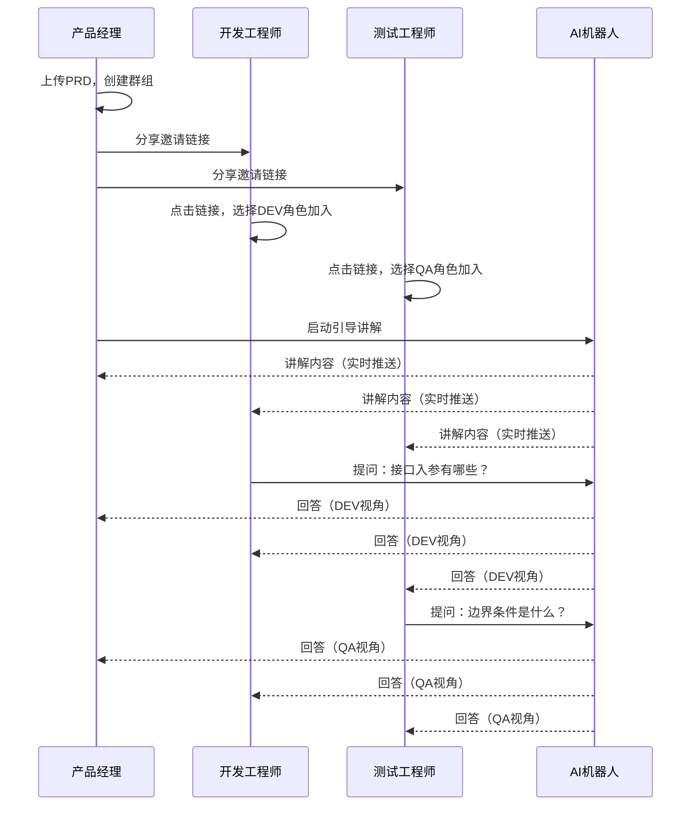

# PRD Agent 产品需求文档

**产品名称**：PRD Agent（PRD智能解读助手）  
**文档版本**：v1.0  
**产品负责人**：-  
**创建日期**：2024年12月10日  
**最后更新**：2024年12月10日

---

## 1. 产品概述

### 1.1 产品愿景

> **"文档即共识"** —— 任何角色在首次阅读时即可完整理解方案背景、核心流程与边界条件，无需依赖额外的口头讲解。

PRD Agent 是一款**专精于PRD理解**的智能Agent，用AI作为产品经理的"嘴替"，让"讲解"从依赖个人精力转变为**可扩展、可复用、可追溯**的系统能力。

### 1.2 问题背景

#### 1.2.1 现状分析

随着MD文档在产品设计中的普及，越来越多的产品经理开始使用MD文档替代传统的RP来描述产品方案。其初衷是提升编写效率与协作便捷性，但在实际落地过程中逐渐暴露出一系列结构性问题：

| 问题类型 | 问题描述 | 具体表现 |
|----------|----------|----------|
| **文档膨胀** | 越写越长、越写越散 | 文档内容不断堆叠，由"流程驱动"退化为"纯文字表述驱动"，大量描述性语言取代了结构化流程与关键决策点，导致文档从"可执行方案"逐步演变为"长篇说明文" |
| **理解偏差** | 信息可读性持续下降 | 研发与测试频繁反馈"看不懂""抓不住主流程""不清楚边界条件"，在实际评审和执行过程中产生严重理解偏差 |
| **沟通依赖** | 关键决策仅存在于口头沟通中 | 只能依赖与产品经理进行口头或私下沟通进行二次澄清，但这些补充信息无法沉淀为共享知识 |
| **恶性循环** | 文档不可执行导致的负向闭环 | 文档不可执行 -> 反复沟通补偿 -> 信息再次丢失 -> 文档继续膨胀 |

#### 1.2.2 信息衰减的深层原因

沟通依赖带来的核心问题：

1. **关键决策仅存在于个人认知中**：重要的业务决策和设计理由没有被记录，只存在于产品经理的脑海中
2. **口头沟通内容无法被复用**：每次有新成员加入或需要回顾时，都需要重新讲解
3. **信息在多轮传递中持续衰减与失真**：经过多次转述后，信息准确性大幅下降

#### 1.2.3 文本理解的天然效率上限

即便流程已经被完整、正确、无缺失地写入文档，"阅读理解"在效率上天然不如"口头讲解"。这一现象的根本原因：

1. **人类对口语化表达具有更高的注意力黏性与理解容忍度**
2. **对可反复追问、即时澄清、不确定性可即时消除的沟通方式具有天然偏好**
3. **文本即便内容完全等价，由于缺乏即时反馈机制，理解成本依然更高**

从认知机制层面看，人类对"语言交互式理解"的依赖几乎是写入基因的：即使产品经理只是对文档内容进行原样复述，并没有产出任何新增信息量，听众的理解速度与确定性依然显著高于纯阅读。

> **核心洞察**：文档的信息是完整的，但人类的"吸收路径"并非为纯文本而优化。产品经理的方案，本质上几乎不可能完全脱离"被讲解"这一环节。

#### 1.2.4 早期尝试与教训

在正式构建PRD Agent之前，我们做过一个早期的Agent尝试——「米多智库」项目，技术栈为RAG + 大模型。该项目目标是回答"所有问题"，但最终失败。复盘后总结出四个致命问题：

| 问题 | 描述 | 教训 |
|------|------|------|
| **提问太泛滥** | 什么问题都有，旧方案永远比新方案多，未知敌人永远比已知的多 | 用户问不到知识库最新、最擅长的领域去 |
| **问题不专业** | 部分提问超脱物理规律，期望用一句话解决战略级难题 | 开放性问题无法产生专业答案 |
| **RAG切分技术拉垮** | 每个平台有自己的黑盒切割法，关键词可能被裁成两半 | 检索时遇到关键信息缺失、排序错乱、时间优先级混乱 |
| **反馈全是负面** | 每一条反馈都在说系统做得不好 | 期望没有对齐，满意度无法提升 |

### 1.3 核心策略：四味药

吸取早期教训后，PRD Agent针对上述四个致命问题，分别制定了四个核心策略：

#### 策略一：面向资料——收窄知识边界

- **以前的问题**：知识库试图回答公司所有问题，从产品方案到客户投诉，从技术架构到财务报销。结果就是什么都能问，但什么都答不好
- **现在的策略**：只针对PRD（产品需求文档）中有明确参考价值的内容。不再大包大揽回答公司的全部问题，只回答"这份方案讲了什么、怎么做、边界在哪"
- **为什么能解决**：知识域收窄后，系统的置信度大幅提升。问一个具体方案的问题，答案就来自这份方案本身，而不是从各种文档里瞎拼凑

#### 策略二：面向群体——锁定专业用户

- **以前的问题**：面向全员开放，什么人都能来问。问题五花八门，系统疲于应付，最终谁都不满意
- **现在的策略**：只面向产研团队（产品经理、开发工程师、测试工程师）。提问的人本身就具备专业背景，问出来的问题和系统擅长回答的问题针尖对麦芒
- **为什么能解决**：产研人员问的是"这个接口怎么设计""这个状态流转的边界条件是什么"，而不是泛化的战略问题。问题专业了，答案自然也专业了

#### 策略三：面向问题——限定问题分类

- **以前的问题**：开放性问题满天飞，用户想用一句话解决战略级难题。系统既要能讲产品功能，又要能出落地方案，还要能预测市场趋势
- **现在的策略**：只针对具象问题，输出描述性语言和手把手指导。把系统定位成"限定品类的专卖店"，而非"什么都卖的百货商场"
- **为什么能解决**：当用户知道这个系统只能回答"方案里写了什么"，而不是"公司未来怎么发展"，他们的提问自然会收敛到系统能力边界内。期望对齐了，满意度就上来了

#### 策略四：面向技术——用Cache替代RAG

- **以前的问题**：RAG的切分技术太拉垮。一份完整的方案被切成碎片，关键词可能被裁成两半。检索时关键信息缺失、排序错乱、时间优先级混乱，拼出来的上下文支离破碎
- **现在的策略**：直接使用Cache技术，一次性将整份PRD全部装入上下文，不做任何截断
- **为什么能解决**：不切就不会切错。整份方案完整地放在模型面前，模型看到的就是产品经理写的原貌，不存在信息丢失和拼接失真的问题。代价是token消耗更高，但换来的是答案质量的根本性提升

> **核心思想**：这四个策略的底层逻辑是同一个——**做减法**。以前的思路是"我要做一个什么都懂的全能先生"，结果就是什么都懂一点、什么都不精通。这一次的思路是"我只做一个专科老师"，只教这一门课，只带这几个学生，但教得明白、带得扎实。**专精Agent，才是这一次能成的根本原因。**

### 1.4 解决方案

基于上述核心策略，构建一个智能PRD讲解助手：

- **聚焦单一文档**：仅针对当前加载的PRD文档，不做泛化回答。系统边界清晰，用户期望明确
- **角色适配讲解**：根据产品/开发/测试三种角色，提供差异化视角的讲解。不同角色关注点不同，回答风格相应调整
- **团队协作共享**：群组成员共享同一AI讲解会话，提问即时可见。避免重复沟通，信息透明同步
- **缺失检测提醒**：自动识别PRD未覆盖的问题，提醒产品经理补全。将隐性问题显性化，推动文档持续完善

---

## 2. 目标用户

### 2.1 用户画像

| 角色 | 技术背景 | 核心诉求 | 使用场景 | 使用频率 |
|------|----------|----------|----------|----------|
| **产品经理（PM）** | 中等，熟悉Markdown | 减少重复讲解的时间成本 | 上传PRD，让系统代为讲解 | 每个迭代周期多次 |
| **开发工程师（DEV）** | 高，关注技术实现 | 精准定位技术点，减少阅读时间 | 快速理解技术要求、状态流转、接口设计 | 需求评审、开发过程中 |
| **测试工程师（QA）** | 中高，关注边界条件 | 不遗漏测试场景，明确验收标准 | 快速识别测试点、边界、验收标准 | 测试设计、测试执行阶段 |
| **超级管理员（Admin）** | 高，系统运维 | 保障系统稳定，监控资源消耗 | 用户管理、大模型配置、日志监控 | 日常运维 |

### 2.2 用户旅程

```
产品经理                     开发/测试工程师
    │                              │
    ▼                              │
上传PRD文档                        │
    │                              │
    ▼                              │
创建讨论群组                       │
    │                              │
    ▼                              │
生成邀请链接 ──────────────────▶ 通过链接加入群组
    │                              │
    ▼                              ▼
启动引导讲解 ◀────────────────── 选择自己的角色
    │                              │
    ▼                              ▼
AI按步骤讲解 ◀────────────────── 随时提问
    │                              │
    ▼                              ▼
收到缺失提醒                   获得角色适配的解答
    │                              │
    ▼                              │
补充完善PRD                        │
```

---

## 3. 核心功能

### 3.1 功能架构

```
┌─────────────────────────────────────────────────────────────┐
│                      PRD Agent                               │
├─────────────────────────────────────────────────────────────┤
│  ┌──────────────┐  ┌──────────────┐  ┌──────────────┐       │
│  │  文档理解层   │  │  角色适配层   │  │  协作共享层   │       │
│  ├──────────────┤  ├──────────────┤  ├──────────────┤       │
│  │ • 文档上传    │  │ • PM视角     │  │ • 群组创建    │       │
│  │ • 结构解析    │  │ • DEV视角    │  │ • 邀请加入    │       │
│  │ • 内容理解    │  │ • QA视角     │  │ • 共享会话    │       │
│  │ • 多媒体支持  │  │ • 风格适配    │  │ • 消息同步    │       │
│  └──────────────┘  └──────────────┘  └──────────────┘       │
│                                                              │
│  ┌──────────────┐  ┌──────────────┐  ┌──────────────┐       │
│  │  交互模式层   │  │  质量保障层   │  │  系统管理层   │       │
│  ├──────────────┤  ├──────────────┤  ├──────────────┤       │
│  │ • 问答模式    │  │ • 缺失检测    │  │ • 用户管理    │       │
│  │ • 引导讲解    │  │ • 边界识别    │  │ • 模型配置    │       │
│  │ • 流式输出    │  │ • 补全建议    │  │ • 日志监控    │       │
│  │ • 上下文维护  │  │ • 状态追踪    │  │ • Token统计   │       │
│  └──────────────┘  └──────────────┘  └──────────────┘       │
└─────────────────────────────────────────────────────────────┘
```

### 3.2 功能清单

| 优先级 | 功能模块 | 功能点 | 描述 |
|:------:|----------|--------|------|
| P0 | 文档上传 | PRD文档上传 | 支持拖拽、选择、粘贴Markdown文档 |
| P0 | 文档上传 | 文档解析 | 解析标题层级、列表、表格，估算Token |
| P0 | 角色适配 | 角色选择 | PM/DEV/QA三种角色切换 |
| P0 | 角色适配 | 视角差异化 | 根据角色调整回答风格和关注点 |
| P0 | 智能问答 | 问答交互 | 自然语言提问，流式输出回答 |
| P0 | 智能问答 | 边界识别 | 识别无关问题，友好拒答 |
| P0 | 引导讲解 | 分步讲解 | 按预设大纲，分6步讲解PRD |
| P0 | 引导讲解 | 进度控制 | 支持上一步/下一步/跳转/中止 |
| P0 | 群组协作 | 群组创建 | PM创建群组并绑定PRD |
| P0 | 群组协作 | 邀请加入 | 生成邀请链接，成员通过链接加入 |
| P0 | 群组协作 | 共享会话 | 群组成员共享同一AI讲解会话 |
| P0 | 缺失检测 | 缺失识别 | AI识别PRD未覆盖的问题 |
| P0 | 缺失检测 | PM提醒 | 实时通知PM内容缺失点 |
| P0 | 用户管理 | 注册登录 | 用户名/密码+邀请码注册 |
| P0 | 用户管理 | 权限控制 | 四种角色的权限隔离 |
| P1 | 多媒体 | 截图上传 | 剪贴板粘贴/拖拽上传图片 |
| P1 | 多媒体 | 文档附件 | 上传PDF/TXT/DOCX作为补充 |
| P1 | 成员管理 | 群组管理 | 查看成员、移除、重新生成链接 |
| P1 | 缺失检测 | 补全建议 | AI建议补充方向 |
| P1 | 管理后台 | 用户管理 | 查看/创建/禁用用户 |
| P1 | 管理后台 | 模型配置 | 切换Claude/OpenAI，配置参数 |
| P1 | 管理后台 | Token统计 | 按用户/群组/时间维度统计用量 |
| P2 | 管理后台 | 日志监控 | LLM请求日志查看与导出 |
| P2 | 管理后台 | 系统告警 | 错误率/响应时间告警 |
| P2 | 客户端 | 版本更新 | 检测新版本并提示更新 |

---

## 4. 详细功能说明

### 4.1 文档上传与解析

**功能描述**：用户上传Markdown格式的PRD文档，系统解析并加载到AI上下文中。

**用户故事**：
> 作为产品经理，我希望能快速上传我的PRD文档，让AI能够理解并代我讲解。

**设计理念**：

文档上传是整个PRD Agent的起点。基于"用Cache替代RAG"的技术策略，系统采用全量上下文加载方式，将整份PRD完整装入AI上下文，不做任何切分。这样可以避免RAG切分导致的信息丢失和拼接失真，确保AI看到的是产品经理写的原貌。

**交互流程**：

```
用户操作              系统处理                      结果
   |                     |                          |
   v                     |                          |
拖拽/选择/粘贴  ──────>  格式校验                    |
   |                     |                          |
   |                     v                          |
   |              格式不支持? ──────> 提示错误，终止  |
   |                     |                          |
   |                     v                          |
   |              大小校验                           |
   |                     |                          |
   |                     v                          |
   |              超过10MB? ──────> 提示过大，终止   |
   |                     |                          |
   |                     v                          |
   |              解析文档结构                       |
   |                     |                          |
   |                     v                          |
   |              估算Token用量                      |
   |                     |                          |
   |                     v                          |
   |              加载到AI上下文                     |
   |                     |                          |
   |                     v                          |
   |              创建会话                           |
   |                     |                          |
   |                     v                          |
   └──────────────────> 进入对话界面
```

**文档解析细节**：

| 解析项 | 说明 | 用途 |
|--------|------|------|
| 标题层级 | 提取H1-H6标题结构 | 构建文档大纲，辅助引导讲解 |
| 列表内容 | 有序列表和无序列表 | 识别功能清单、流程步骤 |
| 表格数据 | Markdown表格解析 | 提取结构化信息如权限矩阵、功能清单 |
| 代码块 | 围栏代码块提取 | 保持代码格式，辅助技术问题解答 |
| Token估算 | 按约0.7汉字/Token估算 | 判断是否超出上下文限制 |

**上下文限制处理**：

| 文档规模 | Token估算 | 处理策略 |
|----------|-----------|----------|
| 10万字以内 | 约14万Token | 全量加载，正常使用 |
| 10万-50万字 | 14-70万Token | 全量加载，预警Token消耗较高 |
| 50万字以上 | 超70万Token | 提示接近上下文限制，建议拆分文档 |
| 超100万Token | - | 拒绝加载，提示超出系统限制 |

**数据不落盘原则**：

PRD内容仅存于会话缓存中，不持久化存储：
1. 文档上传后直接加载到内存/Redis缓存
2. 会话过期（30分钟无活动）后自动清除
3. 用户主动关闭会话时立即清除
4. 数据库只存储会话元数据，不存储PRD原文

**验收标准**：
- [ ] 支持拖拽.md文件上传
- [ ] 支持点击选择文件上传
- [ ] 支持Ctrl+V粘贴Markdown文本
- [ ] 超过10MB提示"文档过大"
- [ ] 非.md文件提示"格式不支持"
- [ ] 上传过程显示进度条
- [ ] 解析时间<1秒（10万字以内）
- [ ] 显示文档结构大纲和Token估算值

### 4.2 角色视角适配

**功能描述**：用户选择角色后，AI根据角色特点调整回答的关注点和风格。

**用户故事**：
> 作为开发工程师，我希望AI能从技术实现角度解读PRD，告诉我接口设计、状态流转等技术细节。

**设计理念**：

不同角色关注点天然不同——产品、研发、测试看问题的角度不同。传统讲解中，产品经理需要针对不同角色调整讲解侧重点。PRD Agent通过角色适配机制，自动根据提问者角色调整回答风格，使同一份PRD能为不同角色提供针对性的解读。

**角色差异对比**：

| 维度 | 产品经理（PM） | 开发（DEV） | 测试（QA） |
|------|---------------|-------------|------------|
| 关注重点 | 业务目标、用户价值、优先级 | 技术实现、接口设计、数据流转 | 边界条件、异常场景、验收标准 |
| 回答风格 | 业务语言，关注"为什么" | 技术语言，关注"怎么做" | 验证语言，关注"怎么验" |
| 信息提取优先级 | 背景、目标、价值主张 | 接口规格、状态机、数据模型 | 验收标准、边界值、异常分支 |
| 术语使用 | 业务术语为主 | 技术术语为主 | 测试术语为主 |

**同一问题的不同角色回答示例**：

问题："用户登录功能是怎么设计的？"

| 角色 | 回答侧重点 |
|------|----------|
| **PM视角** | "用户登录功能旨在解决XXX问题，核心价值是XXX。支持用户名密码登录，后续考虑增加第三方登录。这是P0优先级功能，在MVP阶段完成。" |
| **DEV视角** | "登录接口为POST /api/v1/auth/login，入参包括username和password，返回JWT Token。密码需MD5+盐值加密传输。Token有效期2小时，支持刷新。具体接口规格见第X章节。" |
| **QA视角** | "登录功能需验证：1)正确账号密码可登录成功；2)错误密码提示'密码错误'；3)账号不存在提示'账号不存在'；4)连续5次错误锁定15分钟；5)密码框支持显示/隐藏切换。验收标准见第X章节。" |

**角色切换规则**：

1. 用户加入群组时选择角色，此后该角色在会话中保持不变
2. 用户可随时通过界面切换角色
3. 切换角色后，后续回答风格随之改变
4. 群组内不同成员可选择不同角色
5. AI回答时根据提问者当前角色调整风格

**Prompt模板差异**：

系统通过不同的System Prompt实现角色适配：

```
[PM角色Prompt要点]
- 侧重业务价值和用户场景的解读
- 使用业务语言而非技术术语
- 强调功能优先级和迭代规划
- 关注"为什么这么做"

[DEV角色Prompt要点]
- 侧重技术实现和接口规格的解读
- 使用技术语言，可包含代码示例
- 强调数据模型和状态流转
- 关注"怎么实现"

[QA角色Prompt要点]
- 侧重测试点和验收标准的解读
- 使用测试语言，强调边界和异常
- 列举需要验证的场景
- 关注"怎么验证"
```

**验收标准**：
- [ ] 界面提供清晰的角色切换入口
- [ ] 切换角色后回答风格有明显差异
- [ ] 角色状态在整个会话中保持一致
- [ ] 默认角色为"产品经理"
- [ ] 同一问题在不同角色下回答侧重点不同

### 4.3 智能问答

**功能描述**：用户以自然语言提问，AI基于已加载的PRD内容进行回答。

**用户故事**：
> 作为测试工程师，我希望能随时提问关于PRD的疑问，快速得到准确的回答。

**设计理念**：

智能问答是PRD Agent的核心交互模式，体现了"专精Agent"的设计思想。系统定位为"限定品类的专卖店"，只回答与当前PRD相关的问题，不做泛化回答。这样的边界设定能够让用户期望对齐，从而提升回答质量和用户满意度。

**核心规则**：

| 规则 | 说明 | 示例 |
|------|------|------|
| **严格基于文档** | 回答必须基于已加载的PRD内容，使用Cache技术将整份PRD装入上下文 | 用户问"登录流程是什么"，AI从PRD中提取登录相关章节进行回答 |
| **明确告知缺失** | PRD中未提及的内容，明确告知"文档中未找到相关信息"，并触发缺失检测 | 用户问"退款流程是什么"但PRD未涉及，AI回答"文档中未找到退款流程相关信息" |
| **不编造内容** | 绝不编造文档中不存在的信息，宁可承认不知道也不瞎说 | 不会因为用户追问而编造PRD中没有的细节 |
| **边界拒答** | 对与PRD无关的问题（闲聊、通用知识）友好拒答 | 用户问"今天天气怎么样"，AI回答"我只能回答与当前PRD相关的问题" |

**边界拒答的问题类型**：

| 类型 | 示例 | 处理方式 |
|------|------|----------|
| 闲聊问题 | "你好""今天心情怎么样" | 友好回应并引导回PRD相关问题 |
| 通用知识 | "什么是微服务""HTTP状态码有哪些" | 说明只能回答PRD相关问题，建议查阅其他资料 |
| 其他方案 | "帮我写个排序算法""另一个项目怎么做" | 说明只能回答当前加载的PRD内容 |
| 预测未来 | "这个功能上线后效果会怎样" | 说明无法预测，只能描述PRD中定义的内容 |

**多轮对话上下文维护**：

1. 系统维护完整的对话历史，支持指代消解（如"它""这个功能"）
2. 用户可以基于前一个回答继续追问
3. 上下文窗口有限时，优先保留PRD原文和最近的对话轮次
4. 同一群组内所有成员的对话共享同一上下文

**验收标准**：
- [ ] 问答响应首字延迟<2秒
- [ ] 回答内容与PRD文档相关且准确
- [ ] PRD中不存在的信息不会被编造
- [ ] 多轮对话上下文连贯
- [ ] 流式输出平滑无卡顿
- [ ] 无关问题给出友好拒答并引导

### 4.4 引导讲解模式

**功能描述**：AI按预设的讲解大纲，分步骤主动讲解PRD内容。

**用户故事**：
> 作为新加入项目的开发工程师，我希望AI能主动带我系统性地了解这份PRD，而不是我漫无目的地提问。

**设计理念**：

基于"人类对语言交互式理解的依赖"这一洞察，引导讲解模式模拟产品经理口头讲解的过程。即使AI只是对文档内容进行结构化复述，用户的理解速度与确定性依然显著高于纯阅读。该模式解决了"文档信息完整，但人类吸收路径不适合纯文本"的根本问题。

**讲解大纲**：

| 步骤 | 产品视角 | 开发视角 | 测试视角 |
|:----:|----------|----------|----------|
| 1 | 项目背景与问题定义 | 技术方案概述 | 功能模块清单 |
| 2 | 核心用户与使用场景 | 核心数据模型 | 核心业务流程 |
| 3 | 解决方案概述 | 主流程与状态流转 | 边界条件与约束 |
| 4 | 核心功能清单 | 接口清单与规格 | 异常场景汇总 |
| 5 | 优先级与迭代规划 | 技术约束与依赖 | 验收标准明细 |
| 6 | 成功指标与验收标准 | 开发工作量要点 | 测试重点与风险 |

**操作控制**：
- **下一步**：继续讲解下一个步骤
- **上一步**：返回上一个步骤
- **跳转**：跳转到指定步骤（输入步骤编号）
- **停止**：退出引导讲解模式，回到自由问答

**讲解过程中的交互规则**：
1. 用户可在任意步骤中途提问，AI回答后继续当前步骤
2. 提问不会打断讲解流程，进度状态保持
3. 用户可随时切换角色，讲解大纲相应切换
4. 讲解内容基于当前加载的PRD，不编造文档中不存在的信息

**验收标准**：
- [ ] 三种角色均有完整的讲解大纲
- [ ] 每步讲解内容与PRD实际内容对应
- [ ] 讲解中可随时提问，不打断流程
- [ ] 可随时退出或切换角色
- [ ] 首字延迟<3秒

### 4.5 群组协作

**功能描述**：产品经理创建讨论组，团队成员通过邀请链接加入，共享AI讲解过程。

**用户故事**：
> 作为产品经理，我希望创建一个讨论组，让开发和测试都能加入，大家的问题和AI的回答互相可见，避免重复沟通。

**设计理念**：

群组协作解决了传统PRD讲解中"信息在多轮传递中持续衰减与失真"的问题。通过共享同一个AI会话：
1. 所有成员看到相同的问答内容，信息对齐
2. 一个人的问题解答对所有人可见，避免重复提问
3. 不同角色的视角互相补充，形成更全面的理解
4. 讨论过程可追溯，新成员可查看历史

**协作流程**：



**群组生命周期**：

| 阶段 | 操作 | 说明 |
|------|------|------|
| 创建 | PM上传PRD并创建群组 | 群组与PRD一对一绑定，PM自动成为群主 |
| 邀请 | 生成邀请链接并分享 | 链接可设置有效期，支持重新生成（旧链接失效） |
| 加入 | 成员通过链接加入 | 需选择角色（DEV/QA），加入后可查看历史消息 |
| 活跃 | 群组内进行问答交互 | 所有消息实时同步，会话共享同一上下文 |
| 管理 | 群主管理成员 | 可查看成员列表、移除成员、重新生成邀请链接 |
| 过期 | 会话超时自动过期 | 超过30分钟无活动，会话过期，PRD内容从缓存清除 |

**消息同步机制**：

1. 使用SSE（Server-Sent Events）实现实时推送
2. AI回答采用流式输出，所有成员同时看到打字机效果
3. 新成员加入时一次性加载历史消息
4. 网络断开重连后自动补齐缺失消息

**验收标准**：
- [ ] PM可成功创建群组并绑定PRD
- [ ] 创建后生成可分享的邀请链接
- [ ] DEV/QA可通过链接加入群组
- [ ] 加入时需选择自己的角色
- [ ] 所有成员实时看到彼此的提问与回答
- [ ] AI根据提问者角色调整回答风格
- [ ] 新加入成员可查看历史消息
- [ ] 非PM角色无法创建群组

### 4.6 内容缺失检测

**功能描述**：当用户提问涉及PRD未覆盖的内容时，AI自动识别并提醒产品经理补全。

**用户故事**：
> 作为产品经理，我希望知道开发和测试在哪些问题上觉得PRD不够清晰，这样我可以针对性地补充完善。

**设计理念**：

内容缺失检测是PRD Agent的核心价值之一。传统模式下，开发和测试在评审或开发过程中发现的PRD问题，往往通过口头沟通解决，这些信息无法沉淀复用。PRD Agent将这些"隐性问题"显性化，自动记录并提醒PM，推动文档持续完善，打破"文档不可执行 -> 反复沟通补偿 -> 信息再次丢失"的恶性循环。

**缺失检测触发条件**：

当AI在回答用户问题时，判断PRD中没有相关内容，会触发缺失检测。判断逻辑如下：

1. AI尝试从PRD上下文中检索相关信息
2. 如果找不到直接相关的内容，AI回答"文档中未找到相关信息"
3. 系统自动将该问题标记为"内容缺失"
4. 缺失记录推送给群主（PM）

**缺失类型**：

| 类型 | 说明 | 典型问题示例 | AI识别标志 |
|------|------|-------------|------------|
| 流程缺失 | 业务流程未完整描述 | "用户取消订单后的退款流程没有说明" | 涉及操作步骤、状态流转但文档中无对应描述 |
| 边界未定义 | 边界条件未明确 | "输入超过100字时如何处理没有定义" | 涉及数值限制、特殊情况但文档中无明确规定 |
| 异常未说明 | 异常场景未覆盖 | "接口超时的降级策略没有说明" | 涉及错误处理、异常分支但文档中未提及 |
| 数据格式不明确 | 数据格式未定义 | "日期字段的格式要求没有说明" | 涉及字段格式、数据类型但文档中未定义 |
| 业务规则不清晰 | 业务逻辑未明确 | "VIP用户和普通用户的权限区别是什么" | 涉及业务判断但文档中无明确规则 |
| 交互细节缺失 | UI/UX细节未说明 | "提交按钮点击后的loading状态如何显示" | 涉及交互细节但文档中未描述 |

**缺失记录数据结构**：

| 字段 | 类型 | 说明 |
|------|------|------|
| id | string | 缺失记录唯一标识 |
| groupId | string | 所属群组ID |
| question | string | 触发缺失检测的原始问题 |
| type | enum | 缺失类型（流程缺失/边界未定义/异常未说明/数据格式不明确/业务规则不清晰/交互细节缺失） |
| asker | object | 提问者信息（userId, nickname, role） |
| createdAt | datetime | 记录创建时间 |
| status | enum | 处理状态（pending/resolved/ignored） |
| resolvedAt | datetime | 处理时间（可选） |
| resolvedBy | string | 处理人ID（可选） |
| note | string | 处理备注（可选） |

**PM处理缺失的操作**：

| 操作 | 说明 | 状态变更 |
|------|------|----------|
| 标记已处理 | PM已在PRD中补充相关内容 | pending -> resolved |
| 标记暂不处理 | 该问题暂时不需要补充（如超出当前版本范围） | pending -> ignored |
| 添加备注 | 记录处理说明或补充信息 | 状态不变 |

**验收标准**：
- [ ] AI对PRD未覆盖的问题明确告知"文档中未找到相关信息"
- [ ] 缺失点被记录（问题、类型、提问者、时间）
- [ ] PM收到缺失内容的实时提醒
- [ ] PM可标记缺失为"已处理"或"暂不处理"
- [ ] 群组内可查看缺失问题汇总列表

### 4.7 多媒体消息

**功能描述**：支持在对话中上传截图、图片和文档附件。

**用户故事**：
> 作为开发工程师，我希望能截图上传原型图或流程图，让AI结合图片内容回答我的问题。

**支持格式**：
| 类型 | 格式 | 大小限制 |
|------|------|----------|
| 图片 | PNG, JPG, JPEG, GIF, WebP | 5MB |
| 文档 | PDF, TXT, MD, DOCX | 10MB |

**操作方式**：
- 点击附件按钮选择文件
- Ctrl+V 粘贴剪贴板截图
- 拖拽文件到输入区域

**验收标准**：
- [ ] 可通过Ctrl+V粘贴剪贴板截图
- [ ] 可拖拽图片/文档到输入区域
- [ ] 上传后显示缩略图预览
- [ ] 超过大小限制给出明确提示
- [ ] AI可识别并引用图片内容
- [ ] 附件在历史消息中可查看/下载

---

## 5. 用户界面设计

### 5.1 桌面客户端主界面

```
┌─────────────────────────────────────────────────────────────────┐
│  ┌──────┐  PRD Agent           [PM ▼]  [问答/引导]  [─][□][×]   │
│  │ Logo │                                                       │
├──┴──────┴───────────────────────────────────────────────────────┤
│ ┌────────┐ ┌──────────────────────────────────────────────────┐ │
│ │ 群组1  │ │                                                  │ │
│ │ 群组2  │ │   [DEV-张三] 这个接口的入参有哪些？              │ │
│ │ *群组3 │ │   [AI] 根据PRD文档，该接口入参包括...            │ │
│ │        │ │                                                  │ │
│ │ +加入  │ │   [QA-李四] 边界条件是什么？                     │ │
│ │        │ │   [AI] 边界条件包括...                           │ │
│ └────────┘ └──────────────────────────────────────────────────┘ │
├──────────────────────────────────────────────────────────────────┤
│  ┌──────────────────────────────────────────┐ [附件] [发送]     │
│  │ 请输入您的问题...                         │                   │
│  └──────────────────────────────────────────┘                   │
└──────────────────────────────────────────────────────────────────┘
```

**界面说明**：
- 左侧为群组列表，显示用户加入的所有群组，当前选中群组用*标记
- 右侧为会话区域，显示群组内所有成员的提问和AI的回答
- 每条消息显示发送者角色和昵称，如[DEV-张三]表示开发角色的张三
- 底部为输入区域，支持文字输入和附件上传

### 5.2 Web管理后台

```
┌─────────────────────────────────────────────────────────────────┐
│  PRD Agent 管理后台                          [Admin ▼] [退出]   │
├─────────┬───────────────────────────────────────────────────────┤
│ 仪表盘  │  仪表盘                                               │
│ 用户    │  ┌─────────┐ ┌─────────┐ ┌─────────┐ ┌─────────┐     │
│ 大模型  │  │ 在线用户 │ │ 活跃群组 │ │ 今日请求 │ │ Token消耗│     │
│ 日志    │  │   128   │ │   45    │ │  3,456  │ │  1.2M   │     │
│ 统计    │  └─────────┘ └─────────┘ └─────────┘ └─────────┘     │
│ 设置    │                                                      │
│         │  [请求趋势图表]                                        │
│         │                                                        │
└─────────┴────────────────────────────────────────────────────────┘
```

**功能模块说明**：
- **仪表盘**：系统整体运行状态概览，包括在线用户数、活跃群组数、今日请求量、Token消耗量
- **用户**：用户账号管理，支持查看、创建、禁用用户
- **大模型**：LLM服务配置，支持切换Claude/OpenAI，配置API Key和模型参数
- **日志**：LLM请求日志查看，支持按时间、用户、群组筛选和导出
- **统计**：Token用量统计，支持按用户/群组/时间维度查看
- **设置**：系统全局配置，包括会话超时时间、文档大小限制等

---

## 6. 非功能性需求

### 6.1 性能要求

| 指标 | 要求 |
|------|------|
| 客户端启动时间 | < 3秒 |
| 文档上传响应 | < 3秒（10万字以内） |
| 问答首字延迟 | < 2秒 |
| 引导讲解首字延迟 | < 3秒 |
| 流式输出间隔 | < 100ms |
| 并发会话数 | ≥ 100 |
| API可用性 | ≥ 99.5% |
| 客户端内存占用 | < 500MB |

### 6.2 安全要求

| 要求 | 说明 |
|------|------|
| 数据不持久化 | PRD内容仅存于会话缓存，会话结束后清除 |
| 传输加密 | 所有通信使用HTTPS（TLS 1.2+） |
| 会话隔离 | 不同用户/群组的数据完全隔离 |
| 敏感信息保护 | LLM API Key等敏感配置加密存储于数据库，通过Web管理后台配置，界面脱敏显示，日志脱敏 |

### 6.3 可用性要求

| 要求 | 说明 |
|------|------|
| 错误提示 | 所有错误给出用户可理解的中文提示 |
| 加载状态 | 长时间操作显示加载指示器 |
| 离线提示 | 网络断开时给出明确提示 |
| 快捷键支持 | Ctrl+V粘贴、Enter发送等 |

---

## 7. 技术约束

### 7.1 平台支持

| 平台 | 版本要求 |
|------|----------|
| Windows | 10 (1803+) / 11 |
| macOS | 11 (Big Sur)+ |
| Linux | Ubuntu 20.04+ / Fedora 35+ / Debian 11+ |

### 7.2 文档限制

| 限制 | 说明 |
|------|------|
| 格式 | 仅支持Markdown（.md） |
| 语言 | 首期仅支持中文PRD |
| 大小 | 单文档最大10MB |
| 长度 | 受LLM上下文限制（最大100万Token） |

### 7.3 LLM支持

| 服务商 | 模型 |
|--------|------|
| Anthropic | Claude 3.5 Sonnet, Claude 3 Opus |
| OpenAI | GPT-4 Turbo, GPT-4o |

---

## 8. 权限矩阵

| 功能 | PM | DEV | QA | Admin |
|------|:--:|:---:|:--:|:-----:|
| 上传PRD | Y | - | - | Y |
| 创建群组 | Y | - | - | Y |
| 加入群组 | Y | Y | Y | Y |
| 对话提问 | Y | Y | Y | Y |
| 查看缺失提醒 | Y | - | - | Y |
| 管理群组成员 | Y(群主) | - | - | Y |
| 访问Web后台 | - | - | - | Y |
| 用户管理 | - | - | - | Y |
| 系统配置 | - | - | - | Y |

**权限设计说明**：

1. **PM（产品经理）**：核心角色，拥有上传PRD和创建群组的权限。作为群主可管理群组成员，并能看到AI识别的内容缺失提醒
2. **DEV（开发工程师）**：只能通过邀请链接加入群组并参与问答，无法创建群组或上传文档
3. **QA（测试工程师）**：与DEV权限相同，只能参与已有群组的问答
4. **Admin（管理员）**：拥有全部权限，可通过Web后台管理用户、配置系统、查看日志统计

---

## 9. 迭代规划

### 9.1 MVP阶段（v1.0）

**目标**：验证核心价值，实现单人场景的PRD智能讲解

| 功能 | 优先级 |
|------|:------:|
| PRD文档上传与解析 | P0 |
| 角色视角选择（PM/DEV/QA） | P0 |
| 智能问答交互 | P0 |
| 引导讲解模式 | P0 |
| 用户注册登录 | P0 |

### 9.2 协作增强阶段（v1.5）

**目标**：支持团队协作，实现群组共享讲解

| 功能 | 优先级 |
|------|:------:|
| 群组创建与管理 | P0 |
| 邀请链接加入 | P0 |
| 共享会话同步 | P0 |
| 内容缺失检测 | P0 |
| 多媒体消息支持 | P1 |

### 9.3 运营管理阶段（v2.0）

**目标**：完善管理能力，支持规模化运营

| 功能 | 优先级 |
|------|:------:|
| Web管理后台 | P1 |
| 用户权限管理 | P1 |
| 大模型配置 | P1 |
| Token用量统计 | P1 |
| 日志监控告警 | P2 |

---

## 10. 成功指标

### 10.1 核心指标

| 指标 | 目标 | 说明 |
|------|------|------|
| 讲解准确率 | ≥ 90% | AI回答与PRD内容一致的比例 |
| 用户满意度 | ≥ 4.0/5.0 | 用户对回答质量的评分 |
| 首字响应时间 | < 2秒 | 用户发问到首字显示的时间 |
| 日活跃用户数 | 持续增长 | 每日使用系统的用户数 |

### 10.2 业务指标

| 指标 | 目标 | 说明 |
|------|------|------|
| 沟通时间减少 | ≥ 50% | 产品经理重复讲解时间的减少比例 |
| PRD理解效率 | 提升2倍 | 开发/测试理解PRD所需时间减少 |
| 缺失检出率 | ≥ 80% | 系统识别出的PRD缺失点比例 |

---

## 11. 风险与缓解

| 风险 | 影响 | 缓解措施 |
|------|------|----------|
| LLM API不可用 | 核心功能无法使用 | 多服务商切换、重试机制、降级提示 |
| 文档过大超限 | 无法完整加载 | 明确告知限制、分段讲解策略（后续迭代） |
| 回答不准确 | 用户信任度下降 | 严格基于文档回答、明确告知边界、用户反馈机制 |
| 数据泄露风险 | 合规问题 | 内容不落盘、传输加密、日志脱敏 |

---

## 附录A：名词解释

| 术语 | 解释 |
|------|------|
| PRD | Product Requirements Document，产品需求文档 |
| Agent | 智能体，具备特定能力的AI系统 |
| Token | 模型处理文本的最小单位，约0.7个汉字 |
| 流式输出 | 打字机效果，AI回答边生成边显示 |
| 群组 | 由PM创建的协作空间，绑定一份PRD |
| 内容缺失 | 用户提问涉及PRD未覆盖的内容 |

---

**文档结束**

> 本文档作为PRD Agent产品的需求基线，指导产品设计与开发实现。


