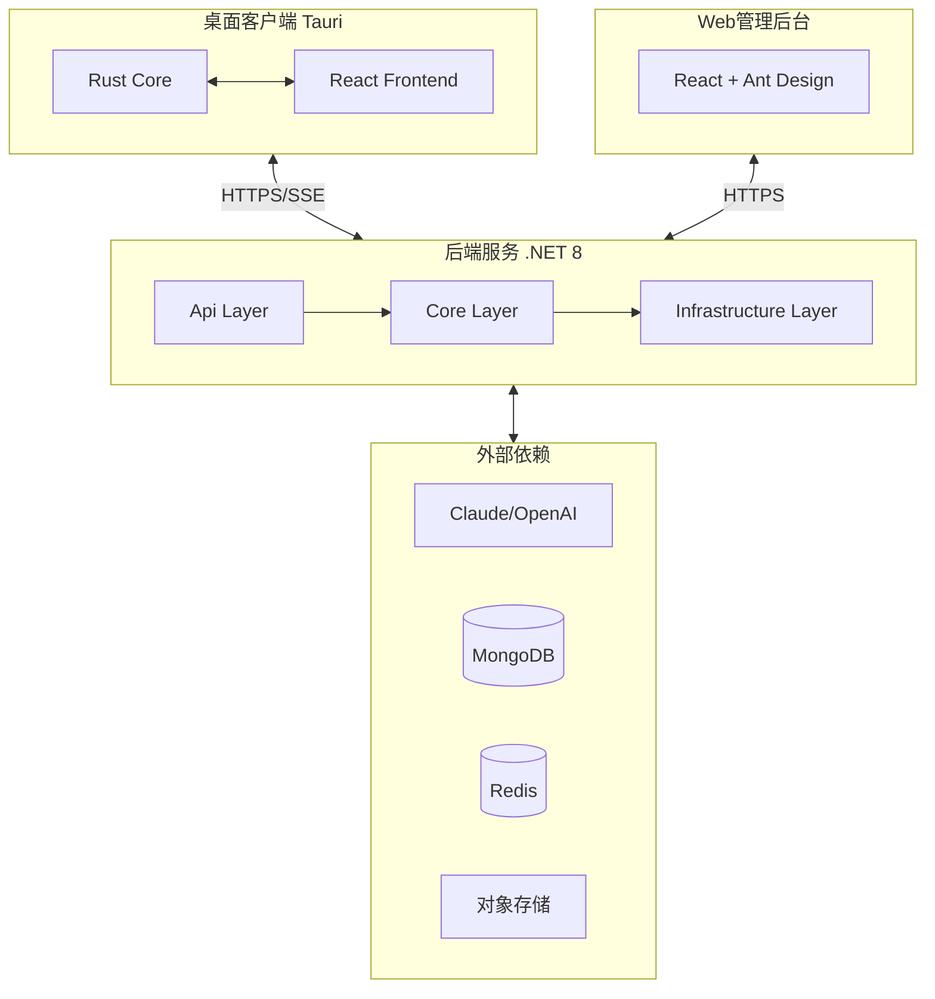
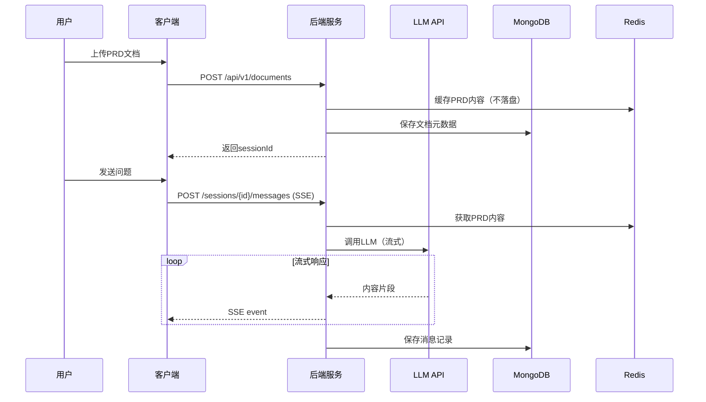

# PRD Agent 开发文档

**文档版本**：v1.0  
**创建日期**：2024年12月10日  
**适用版本**：PRD Agent v1.0+  
**目标读者**：开发工程师、架构师

---

## 目录

1. [文档概述](#1-文档概述)
2. [系统架构](#2-系统架构)
3. [开发环境搭建](#3-开发环境搭建)
4. [项目结构](#4-项目结构)
5. [后端服务开发指南](#5-后端服务开发指南)
6. [桌面客户端开发指南](#6-桌面客户端开发指南)
7. [Web管理后台开发指南](#7-web管理后台开发指南)
8. [开发规范](#8-开发规范)
9. [测试指南](#9-测试指南)
10. [构建与部署](#10-构建与部署)
11. [附录](#11-附录)

---

## 1. 文档概述

### 1.1 目的

本文档为 PRD Agent 项目的开发指南，帮助开发工程师快速上手项目开发，理解系统架构、开发规范和最佳实践。

### 1.2 读者定位

| 角色 | 关注重点 |
|------|----------|
| 后端开发 | 第3、4、5章：环境搭建、后端架构、API开发 |
| 前端开发 | 第3、4、6、7章：客户端/管理后台开发 |
| 全栈开发 | 全部章节 |
| DevOps | 第3、10章：环境配置、构建部署 |

### 1.3 相关文档

| 文档 | 说明 |
|------|------|
| 1.why.md | 项目背景与设计思路 |
| 2.srs.md | 软件需求规格说明书（技术规格） |
| 3.prd.md | 产品需求文档（功能需求） |

### 1.4 技术栈总览

| 端 | 技术栈 |
|----|--------|
| **桌面客户端** | Tauri 2.0 + Rust 1.70+ + React 18 + TypeScript 5 + Zustand + Tailwind CSS + Radix UI |
| **后端服务** | .NET 8 + ASP.NET Core + C# 12 + MongoDB 8.0+ + Redis + Serilog |
| **Web管理后台** | React 18 + TypeScript 5 + Vite + Ant Design 5 + Zustand |
| **外部服务** | Claude API / OpenAI API + 腾讯云COS/阿里云OSS |

---

## 2. 系统架构

### 2.1 架构总览



### 2.2 通信协议

| 通信路径 | 协议 | 说明 |
|----------|------|------|
| 客户端 ↔ 服务端 | HTTPS + SSE | REST API（基础路径 `/api/v1/`）+ 流式响应 |
| 管理后台 ↔ 服务端 | HTTPS | REST API（管理接口 `/api/v1/admin/`） |
| Rust Core ↔ React | Tauri IPC | invoke 命令 / emit 事件 |
| 服务端 ↔ LLM | HTTPS | 流式调用，超时60s，重试≤3次 |

### 2.3 数据流向



---

## 3. 开发环境搭建

### 3.1 后端服务环境

#### 必需软件

| 软件 | 版本要求 | 用途 |
|------|----------|------|
| .NET SDK | 8.0+ | 运行时与构建 |
| MongoDB | 8.0+ | 数据存储 |
| Redis | 7+ | 会话缓存 |
| Visual Studio / Rider / VS Code | 最新版 | IDE |

#### 环境配置步骤

1. **安装 .NET SDK** → 验证：`dotnet --version`
2. **启动 MongoDB** → 创建数据库 `prdagent`
3. **启动 Redis** → 默认端口 6379
4. **克隆项目** → `cd prd-api && dotnet restore`
5. **配置环境变量**（见附录11.1）
6. **启动服务** → `dotnet run --project src/PrdAgent.Api`
7. 服务地址：`http://localhost:5000`

### 3.2 桌面客户端环境

#### 必需软件

| 软件 | 版本要求 | 用途 |
|------|----------|------|
| Rust | 1.70+ | Tauri后端 |
| Node.js | 18+ | 前端构建 |
| Tauri CLI | 2.0+ | 桌面应用框架 |
| pnpm | 8+ | 包管理 |

#### 平台特定依赖

- **Windows**：WebView2 Runtime（Win10 1803+已内置）
- **macOS**：`xcode-select --install`
- **Linux**：`apt install libwebkit2gtk-4.1-dev build-essential libssl-dev libgtk-3-dev`

#### 环境配置步骤

1. **安装 Rust** → `rustup`
2. **安装 Tauri CLI** → `cargo install tauri-cli`
3. **安装依赖** → `cd prd-desktop && pnpm install`
4. **配置后端地址** → 环境变量 `VITE_API_BASE_URL`
5. **启动开发** → `pnpm tauri dev`

### 3.3 Web管理后台环境

1. **安装依赖** → `cd prd-admin && pnpm install`
2. **配置环境（可选）** → 新建 `.env.local`，设置 `VITE_API_BASE_URL=http://localhost:5000`
3. **启动开发** → `pnpm dev`
4. 服务地址：`http://localhost:8000`

---

## 4. 项目结构

### 4.1 后端服务结构

```
prd-api/
├── src/
│   ├── PrdAgent.Api/              # API层（入口）
│   │   ├── Controllers/           # 控制器
│   │   │   ├── AuthController     # 用户认证
│   │   │   ├── DocumentsController# 文档上传
│   │   │   ├── SessionsController # 会话管理
│   │   │   ├── MessagesController # 消息发送（SSE）
│   │   │   ├── GroupsController   # 群组管理
│   │   │   ├── GapsController     # 内容缺失
│   │   │   └── Admin/             # 管理后台API
│   │   ├── Middleware/            # 中间件（异常、认证、限流）
│   │   └── Models/                # 请求/响应DTO
│   │
│   ├── PrdAgent.Core/             # 核心业务层
│   │   ├── Services/              # 业务服务接口与实现
│   │   ├── Models/                # 领域模型
│   │   └── Interfaces/            # 抽象接口
│   │
│   └── PrdAgent.Infrastructure/   # 基础设施层
│       ├── LLM/                   # Claude/OpenAI客户端
│       ├── Cache/                 # Redis缓存管理
│       ├── Storage/               # 对象存储
│       ├── Database/              # MongoDB访问
│       ├── Prompts/Templates/     # 角色Prompt模板（pm.md/dev.md/qa.md）
│       └── Markdown/              # Markdown解析器
│
├── tests/                         # 测试项目
├── docker-compose.yml
└── Dockerfile
```

### 4.2 桌面客户端结构

```
prd-desktop/
├── src-tauri/                     # Rust后端
│   ├── src/
│   │   ├── main.rs                # 应用入口
│   │   ├── commands/              # Tauri命令（IPC）
│   │   ├── services/              # API客户端、SSE客户端
│   │   └── models/                # 数据模型
│   └── tauri.conf.json            # Tauri配置
│
├── src/                           # React前端
│   ├── components/                # UI组件
│   │   ├── Chat/                  # 对话组件
│   │   ├── Document/              # 文档上传
│   │   ├── Role/                  # 角色选择
│   │   ├── Guide/                 # 引导讲解
│   │   ├── Group/                 # 群组协作
│   │   └── Attachment/            # 附件上传
│   ├── hooks/                     # 自定义Hooks
│   ├── stores/                    # Zustand状态管理
│   ├── services/                  # Tauri命令封装
│   └── types/                     # TypeScript类型
│
├── package.json
└── tailwind.config.js
```

### 4.3 Web管理后台结构

```
prd-admin/
├── src/
│   ├── components/                # UI组件
│   │   ├── Layout/                # 布局组件
│   │   ├── Dashboard/             # 仪表盘组件
│   │   ├── Users/                 # 用户管理
│   │   ├── LLMConfig/             # 大模型配置
│   │   ├── Logs/                  # 日志查看
│   │   └── Stats/                 # Token统计
│   ├── pages/                     # 页面组件
│   ├── services/                  # API封装
│   ├── stores/                    # 状态管理
│   └── types/                     # 类型定义
└── package.json
```

---

## 5. 后端服务开发指南

### 5.1 分层架构

| 层级 | 职责 | 关键组件 |
|------|------|----------|
| **Api Layer** | HTTP请求处理、参数验证、响应格式化、认证授权 | Controllers、Middleware、DTOs |
| **Core Layer** | 业务逻辑、领域模型、服务接口定义 | Services、Models、Interfaces |
| **Infrastructure** | 外部服务集成、数据持久化、缓存实现 | LLMClient、MongoDB、Redis、OSS |

**依赖方向**：Api → Core → Infrastructure（单向依赖，Core层不依赖具体实现）

### 5.2 核心模块

| 模块 | 服务类 | 职责 |
|------|--------|------|
| 文档服务 | `DocumentService` | PRD解析、结构提取、Token估算 |
| 会话服务 | `SessionService` | 会话创建、状态管理、超时清理（30分钟） |
| 对话服务 | `ChatService` | Prompt构建、LLM调用、流式响应 |
| 引导服务 | `GuideService` | 按角色生成讲解大纲、分步讲解 |
| 群组服务 | `GroupService` | 群组CRUD、成员管理、邀请码生成 |
| 缺失检测 | `GapDetectionService` | 识别PRD未覆盖问题、记录缺失点 |
| 用户服务 | `UserService` | 注册登录、JWT签发、权限校验 |
| 配置服务 | `LLMConfigService` | 大模型配置CRUD、API Key加解密、配置热加载 |

### 5.3 LLM集成要点

**客户端封装**：
- 定义 `ILLMClient` 接口，实现 `ClaudeClient` 和 `OpenAIClient`
- 服务商配置通过 Web 管理后台设置，存储于 `llmconfigs` 集合
- 配置变更即时生效，无需重启服务

**Prompt管理**：
- 角色模板存放于 `Infrastructure/Prompts/Templates/`
- 支持热更新，无需重启服务

**流式响应**：
- 使用 SSE（Server-Sent Events）实时推送
- 事件类型：`start`（开始）→ `delta`（内容片段）→ `done`（完成）

**重试与降级**：
- 超时时间 60s
- 失败重试 ≤3 次，指数退避
- 服务不可用时返回友好提示

### 5.4 API开发规范

**统一响应格式**：

成功响应：
```json
{ "success": true, "data": { ... }, "error": null }
```

错误响应：
```json
{ "success": false, "data": null, "error": { "code": "ERROR_CODE", "message": "描述" } }
```

**SSE流式接口**：
- 请求头：`Accept: text/event-stream`
- 响应头：`Content-Type: text/event-stream`
- 事件格式：`event: message\ndata: {...}\n\n`

**幂等性**：
- 写接口支持 `Idempotency-Key` 请求头
- 相同 Key 的重复请求不产生重复资源

**服务器优先闭环（AI 操作强制约束）**：
- **定义**：从客户端发出“AI 指令”的那一刻开始，计算、调用、重试、落盘、回填必须在服务端闭环完成；客户端只负责发指令 + 订阅/渲染结果。
- **禁止**：将“生成完成后的保存/上传/回填”等关键链路放在前端内存/组件生命周期中；禁止依赖页面不跳转、浏览器不刷新、SSE 不断流才能完成落盘。
- **推荐模式（Run/Task 化）**：
  - `POST /.../runs`：创建任务并返回 `runId`（写接口必须支持 `Idempotency-Key`）
  - `GET /.../runs/{runId}`：查询任务状态与结果（用于刷新/重开恢复）
  - `GET /.../runs/{runId}/stream?afterSeq=...`：SSE 订阅进度（支持断线重连与续传）
  - `worker/background service`：后台 claim 队列执行（不得与某个 HTTP 连接绑定）
  - **产物落盘**：大内容落对象存储（如 COS/OSS），数据库仅存 URL/sha/mime/尺寸/大小/元数据；业务对象（会话/workspace 等）由服务端回填最终引用。
- **适用范围**：对话、文档解析、意图解析、图像生成、上传后的转码/提取、摘要/索引构建等所有“耗时/可失败/需落盘”的 AI 相关流程。
- **端侧允许**：仅 UI 渲染、输入体验、轻量本地偏好与缓存（不作为唯一真相、不影响服务端闭环）。

### 5.5 数据库设计

**MongoDB 集合**（全小写命名）：

| 集合 | 说明 | 关键字段 |
|------|------|----------|
| `users` | 用户 | userId, username, passwordHash, role, status |
| `groups` | 群组 | groupId, groupName, ownerId, prdDocumentId, inviteCode |
| `groupmembers` | 群组成员 | groupId, userId, memberRole, joinedAt |
| `messages` | 消息 | id, groupId, senderId, role, content, timestamp |
| `contentgaps` | 内容缺失 | gapId, groupId, question, gapType, status |
| `attachments` | 附件 | attachmentId, fileName, url, mimeType, size |
| `llmconfigs` | 大模型配置 | provider, apiKeyEncrypted, model, maxTokens, temperature, rateLimit, isActive |

**字段命名**：使用 camelCase

**注意**：PRD原始内容仅存Redis缓存，不落盘MongoDB

### 5.6 缓存策略

| 缓存项 | 存储位置 | 过期时间 | 说明 |
|--------|----------|----------|------|
| PRD内容 | Redis | 30分钟 | 会话活跃时刷新 |
| 会话状态 | Redis | 30分钟 | 包含角色、模式、引导步骤 |
| 对话历史 | Redis | 30分钟 | 用于上下文连贯 |
| JWT Token | 客户端 | 24小时 | 支持刷新 |

---

## 6. 桌面客户端开发指南

### 6.1 Tauri架构

**进程模型**：
- **Rust进程**：文件I/O、HTTP请求、SSE连接、本地缓存
- **WebView进程**：React UI渲染、用户交互

**通信机制**：
- **invoke**：React调用Rust命令，同步返回结果
- **emit/listen**：Rust向React推送事件（用于流式响应）

### 6.2 IPC命令清单

| 命令 | 参数 | 返回值 | 说明 |
|------|------|--------|------|
| `upload_document` | `file_path?`, `content?` | `UploadResult` | 上传PRD文档 |
| `send_message` | `session_id`, `content`, `role` | void | 发送消息（通过事件推送响应） |
| `switch_role` | `session_id`, `role` | `{ currentRole }` | 切换角色 |
| `start_guide` | `session_id`, `role` | void | 启动引导讲解 |
| `control_guide` | `session_id`, `action`, `step?` | `GuideStatus` | 控制引导（next/prev/goto/stop） |
| `create_group` | `prd_document_id`, `group_name?` | `Group` | 创建群组 |
| `join_group` | `invite_code`, `user_role` | `GroupInfo` | 加入群组 |

**命令存放位置**：`src-tauri/src/commands/`

### 6.3 事件清单

| 事件名 | 数据 | 说明 |
|--------|------|------|
| `message-chunk` | `{ type, content?, messageId? }` | 流式消息响应 |
| `guide-chunk` | `{ type, step?, content? }` | 引导讲解响应 |
| `group-message` | `{ message, sender }` | 群组新消息 |
| `error` | `{ code, message }` | 错误事件 |

### 6.4 React前端开发要点

**状态管理（Zustand）**：
- `sessionStore`：会话状态（sessionId、当前角色、模式）
- `messageStore`：消息列表、流式内容
- `groupStore`：群组列表、成员信息

**组件结构**：
- 使用 Radix UI 无障碍组件
- Tailwind CSS 样式
- 支持暗/亮主题切换

**SSE事件处理**：
- 通过 `listen` API 监听 Rust 推送的事件
- 实时更新消息内容（打字机效果）

**附件上传**：
- 支持 Ctrl+V 粘贴剪贴板截图
- 支持拖拽文件
- 图片限制 5MB，文档限制 10MB

---

## 7. Web管理后台开发指南

### 7.1 页面结构

| 页面 | 路由 | 功能 |
|------|------|------|
| 仪表盘 | `/dashboard` | 在线用户、活跃群组、今日请求、Token消耗、趋势图 |
| 用户管理 | `/users` | 用户列表、创建、编辑、禁用、重置密码 |
| 大模型配置 | `/model-manage` | 服务商切换、API Key配置（加密存储、界面脱敏）、模型参数、速率限制 |
| 请求日志 | `/llm-logs` | LLM请求日志查看、筛选、导出（仅对密钥/Token/密码等**密钥类字段**脱敏；展示用户问题与模型最终回答；不再保存 rawSse） |
| Token统计 | `/stats` | 按日/周/月、按用户/群组统计、成本估算 |
| 系统设置 | `/settings` | 系统参数、告警阈值配置 |

### 7.2 API对接要点

**认证**：
- 登录后获取 JWT Token
- 请求头携带 `Authorization: Bearer {token}`
- Token过期（401）自动跳转登录

**Admin API 路径**：`/api/v1/admin/`

**常用接口**：
- `GET /admin/users` - 用户列表（分页、筛选）
- `POST /admin/users` - 创建用户/生成邀请码
- `GET /admin/llm-configs` - 获取大模型配置列表（API Key脱敏显示）
- `POST /admin/llm-configs` - 创建大模型配置（API Key加密存储）
- `PUT /admin/llm-configs/{configId}` - 更新大模型配置（API Key加密存储）
- `GET /admin/stats/tokens` - Token统计
- `GET /admin/llm-logs` - LLM请求日志（列表/筛选）
- `GET /admin/llm-logs/{id}` - LLM请求日志（详情）

### 7.3 数据可视化

- 使用 ECharts 或 Recharts
- 仪表盘核心指标卡片
- 请求趋势折线图
- Token消耗柱状图/饼图

---

## 8. 开发规范

### 8.1 命名约定

| 位置 | 规则 | 示例 |
|------|------|------|
| C# 类/方法 | PascalCase | `UserService`, `GetUserAsync` |
| C# 变量 | camelCase | `userId`, `documentContent` |
| TypeScript 变量/函数 | camelCase | `handleSend`, `messageList` |
| React 组件 | PascalCase | `ChatContainer`, `MessageItem` |
| API路径 | kebab-case | `/api/v1/content-gaps` |
| MongoDB集合 | 全小写 | `users`, `groups`, `messages` |
| MongoDB字段 | camelCase | `userId`, `createdAt` |

### 8.2 Git工作流

**分支策略**：
- `main` - 生产分支
- `develop` - 开发分支
- `feature/xxx` - 功能分支
- `bugfix/xxx` - 修复分支
- `hotfix/xxx` - 紧急修复

**Commit规范**：`<type>(<scope>): <subject>`

| Type | 说明 |
|------|------|
| feat | 新功能 |
| fix | Bug修复 |
| docs | 文档更新 |
| refactor | 重构 |
| test | 测试 |
| chore | 构建/依赖 |

示例：`feat(chat): 添加流式消息输出`

### 8.3 Code Review检查点

- [ ] 代码符合命名规范
- [ ] 无硬编码敏感信息
- [ ] 错误处理完善
- [ ] 日志仅对密钥/Token/密码等**密钥类字段**脱敏；LLM请求日志用于排障可保留用户问题与模型最终回答（≤200k字符，超出截断并记录长度/哈希）
- [ ] `done/error/firstByte` 状态写入必须可靠（不得 DropWrite 丢失）；存在 `running` 超时 watchdog 纠错
- [ ] 有对应测试用例

---

## 9. 测试指南

### 9.1 后端测试

| 测试类型 | 框架 | 覆盖范围 |
|----------|------|----------|
| 单元测试 | xUnit + Moq | Service层业务逻辑 |
| 集成测试 | WebApplicationFactory | API端到端 |
| 性能测试 | BenchmarkDotNet | 关键路径性能 |

**运行命令**：
- 全部测试：`dotnet test`
- 覆盖率：`dotnet test --collect:"XPlat Code Coverage"`

### 9.2 前端测试

| 测试类型 | 框架 | 覆盖范围 |
|----------|------|----------|
| 组件测试 | Vitest + Testing Library | UI组件 |
| E2E测试 | Playwright（可选） | 关键流程 |

**运行命令**：
- 运行测试：`pnpm test`
- 覆盖率：`pnpm test --coverage`

### 9.3 测试重点

- 文档上传与解析
- 流式消息收发
- 角色切换后回答风格变化
- 群组创建与加入
- 会话超时处理
- 错误码返回正确性

---

## 10. 构建与部署

### 10.1 后端部署

**Docker构建**：
- 基础镜像：`mcr.microsoft.com/dotnet/aspnet:8.0`
- 构建镜像：`mcr.microsoft.com/dotnet/sdk:8.0`
- 暴露端口：80

**docker-compose服务**：
- `api` - 后端服务
- `mongodb` - 数据库
- `redis` - 缓存

**健康检查端点**：`GET /health`

### 10.2 客户端打包

| 平台 | 格式 | 命令 |
|------|------|------|
| Windows | MSI | `pnpm tauri build --target x86_64-pc-windows-msvc` |
| macOS Intel | DMG | `pnpm tauri build --target x86_64-apple-darwin` |
| macOS Apple Silicon | DMG | `pnpm tauri build --target aarch64-apple-darwin` |
| Linux | DEB/AppImage | `pnpm tauri build --target x86_64-unknown-linux-gnu` |

**产物位置**：`src-tauri/target/release/bundle/`

### 10.3 管理后台部署

**构建**：`pnpm build` → 产物在 `dist/`

**Nginx配置要点**：
- 前端路由：`try_files $uri $uri/ /index.html`
- API代理：`location /api/ { proxy_pass http://backend:5000; }`
- 静态资源缓存：1年

---

## 11. 附录

### 11.1 环境变量清单

| 变量名 | 必需 | 说明 |
|--------|:----:|------|
| `MongoDB__ConnectionString` | ✓ | MongoDB连接字符串 |
| `Redis__ConnectionString` | ✓ | Redis连接字符串 |
| `Jwt__Secret` | ✓ | JWT签名密钥（32位以上） |
| `Jwt__Issuer` | | JWT签发者 |
| `Session__TimeoutMinutes` | | 会话超时，默认30 |
| `Storage__Provider` | | 存储服务商（COS/OSS/S3） |
| `Storage__AccessKey` | 条件 | 存储访问密钥 |
| `Storage__SecretKey` | 条件 | 存储密钥 |
| `Storage__Bucket` | 条件 | 存储桶名称 |
| `Cors__AllowedOrigins` | | 允许的跨域来源 |

> **注**：LLM相关配置（服务商、API Key、模型版本、参数等）通过Web管理后台配置，加密存储于数据库`llmconfigs`集合，无需环境变量。

### 11.2 错误码速查表

| 错误码 | HTTP | 说明 | 处理建议 |
|--------|------|------|----------|
| INVALID_FORMAT | 400 | 格式不支持 | 仅支持.md文件 |
| CONTENT_EMPTY | 400 | 内容为空 | 确保文档有内容 |
| DOCUMENT_TOO_LARGE | 413 | 超10MB | 压缩或分割文档 |
| SESSION_NOT_FOUND | 404 | 会话不存在 | 重新上传文档 |
| SESSION_EXPIRED | 410 | 会话已过期 | 重新上传文档 |
| PERMISSION_DENIED | 403 | 无权限 | 检查用户角色 |
| INVALID_INVITE_CODE | 400 | 邀请码无效 | 联系群主 |
| GROUP_FULL | 400 | 群组已满 | 联系群主扩容 |
| RATE_LIMITED | 429 | 限流 | 稍后重试 |
| LLM_ERROR | 502 | LLM调用失败 | 检查API Key，稍后重试 |

### 11.3 角色权限矩阵

| 功能 | PM | DEV | QA | ADMIN |
|------|:--:|:---:|:--:|:-----:|
| 上传PRD | ✓ | | | ✓ |
| 创建群组 | ✓ | | | ✓ |
| 加入群组 | ✓ | ✓ | ✓ | ✓ |
| 对话提问 | ✓ | ✓ | ✓ | ✓ |
| 查看缺失提醒 | ✓ | | | ✓ |
| 管理群组成员 | ✓(群主) | | | ✓ |
| Web管理后台 | | | | ✓ |

### 11.4 性能指标

| 指标 | 要求 |
|------|------|
| 问答首字延迟 | < 2秒 |
| 文档上传响应 | < 3秒（10万字内） |
| 流式输出间隔 | < 100ms |
| 会话超时 | 30分钟 |
| LLM调用超时 | 60秒 |
| LLM重试次数 | ≤ 3次（指数退避） |

### 11.5 常见问题排查

| 问题 | 排查步骤 |
|------|----------|
| 客户端无法连接后端 | 1. 检查后端服务状态 `/health`<br>2. 检查API地址配置<br>3. 检查防火墙/代理 |
| LLM响应超时 | 1. 验证API Key有效性<br>2. 检查网络（可能需代理）<br>3. 检查账户余额 |
| 会话频繁过期 | 1. 检查Redis连接<br>2. 调整超时配置<br>3. 多实例需共享Redis |
| 流式响应卡顿 | 1. 检查网络质量<br>2. 实现断线重连<br>3. 优化长列表渲染 |

### 11.6 开发资源

| 资源 | 链接 |
|------|------|
| Tauri文档 | https://tauri.app/docs |
| ASP.NET Core | https://docs.microsoft.com/aspnet/core |
| MongoDB.Driver | https://mongodb.github.io/mongo-csharp-driver |
| Claude API | https://docs.anthropic.com |
| OpenAI API | https://platform.openai.com/docs |
| React | https://react.dev |
| Ant Design | https://ant.design |

---

**文档结束**

> 本文档为 PRD Agent 项目的开发指南，如有疑问请联系项目负责人。
