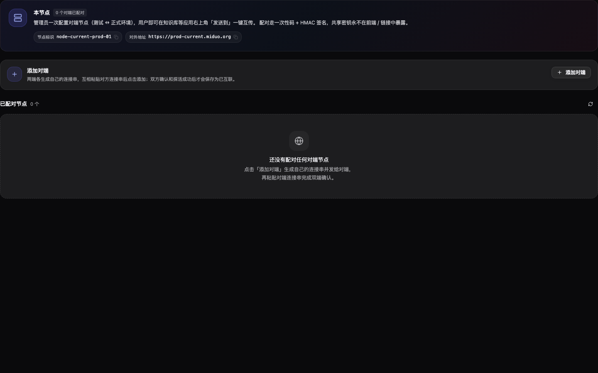
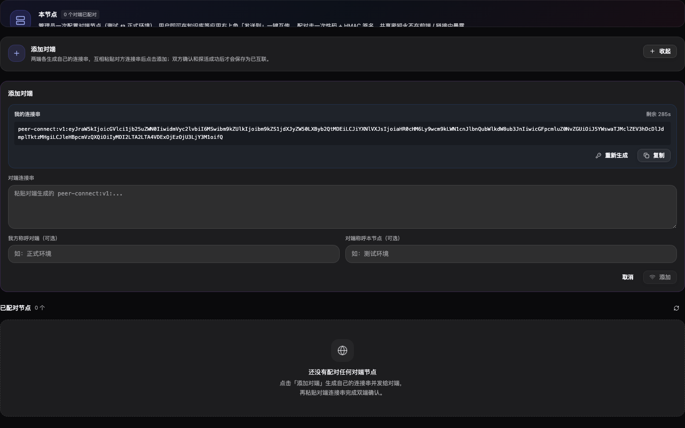
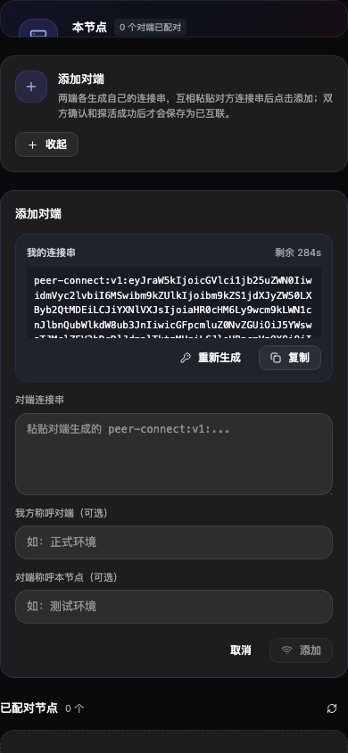

# prd-agent · 系统互联 · 添加对端统一连接串 · 修复 · 验收报告

> Verdict: 通过
> 本次系统互联改造已把入口收敛为一个「添加对端」流程，并把后端握手改为 prepare/confirm/ping 后再落库；视觉取证覆盖桌面初始态、桌面展开态和移动端展开态，未发现横向溢出。

| 项目 | 目标 | 分支 | commit | 预览 | 验收人 | 日期 | 缺陷 P0/P1/P2/P3 |
|---|---|---|---|---|---|---|---|
| prd-agent | 系统互联添加对端统一连接串流程 | main | ec1e42b61 | http://localhost:8001 | Codex | 2026-06-08 | 0/0/0/0 |

## 目标与价值
系统互联原界面把「邀请对端接入我」和「接入已知对端」拆成两个角色，和实际互联关系的对等性不一致。本次改造目标是把关系建立统一为「添加对端」，双方各生成并交换连接串，只有双端确认和探活成功后才保存为真正互联。

## 范围与不覆盖
本次覆盖系统互联设置页的入口、连接串展示、对端连接串录入校验，以及管理端握手落库策略。不覆盖真实双节点跨环境联调和数据库迁移脚本；后端已通过编译验证接口契约。

## 验收路径
本次视觉取证使用临时本地探针进入真实 React 组件，未读取登录凭据；取证后临时路由和 mock 已撤回。功能验证路径为：打开系统互联视图，观察初始入口，点击「添加对端」，点击「生成我的连接串」，切换到移动宽度复查布局。

## 完成标准 DoD
| 标准 | 结果 | 说明 |
|---|---|---|
| 单一添加入口 | 通过 | 初始态只出现一个「添加对端」主入口。 |
| 自己的地址和密钥合并为连接串 | 通过 | 展开态显示 peer-connect:v1 连接串，包含 nodeId、baseUrl、pairingCode、expiresAt。 |
| 对端连接失败不保存本端永久状态 | 通过 | 管理端改为先对端 prepare/confirm/ping，探活成功后才 upsert 本端 PeerNode。 |
| 双端同时成功才算互联 | 通过 | 接收端 confirm 后写入；发起端 ping 失败会请求 cancel，发起端不落库。 |
| 视觉无明显布局问题 | 通过 | 桌面和移动宽度 overflow 检查均为空。 |

## 自测路径
| 命令或检查 | 结果 |
|---|---|
| pnpm --prefix prd-admin tsc --noEmit | 通过 |
| dotnet build prd-api/PrdAgent.sln --no-restore | 通过，仅保留既有 MailKit NU1902 警告 |
| Chrome Headless 视觉截图与 DOM overflow 检查 | 通过，desktopOverflow=[]，mobileOverflow=[] |

## 需求一一对应表
| 用户诉求 | 状态 | 实现/证据/原因 |
|---|---|---|
| 观察图中样子，看看有几处问题 | 已落地 | 识别到角色拆分、信息重复、失败半状态风险、长串展示与移动适配风险；见图 01、02、03。 |
| 不用区分「邀请对端接入我」和「接入已知对端」，只保留一个按钮「添加对端」 | 已落地 | 前端入口收敛为一个「添加对端」卡片，展开后同时展示我的连接串和对端连接串录入区；见图 01、02。 |
| 双方各自生成地址和密钥串，互相放入对方字符串后添加即可完成互联 | 已落地 | 新增 peer-connect:v1 编解码、过期校验和对端解析预览；添加时从连接串提取 baseUrl 与 pairingCode。见图 02、03。 |
| 一端连接失败或任何非成功情况不存储任何状态，必须同时互联成功才算真正互联 | 已落地 | 后端新增 prepare/confirm/cancel 两阶段握手；发起端仅在对端确认且 HMAC ping 成功后保存本端 PeerNode，confirm 或 ping 失败会撤销对端 PeerNode 并清掉临时配对 claim。 |
| 其他补充 | 已落地 | 修复 StrictMode 下 isMountedRef 卸载守卫导致页面可能持续 loading 的问题；连接串解析增加版本、必填字段和过期校验。 |

## 验收用例
| # | Phase | 维度 | 操作 | 预期 | 实际 | 状态 | 严重级 | 证据图 |
|---|---|---|---|---|---|---|---|---|
| 1 | 验证 | 功能适合性 | 进入系统互联初始态 | 页面只有一个添加对端入口，空状态说明互换连接串 | 符合 | 通过 | 无 | 01 |
| 2 | 执行 | 可用性 | 展开添加对端并生成我的连接串 | 连接串在代码框内可读可复制，不再暴露两套角色流程 | 符合 | 通过 | 无 | 02 |
| 3 | 回归 | 兼容性 | 切换到 390px 移动宽度 | 表单纵向排列，长连接串不撑破页面 | 符合 | 通过 | 无 | 03 |
| 4 | 回归 | 可靠性 | 检查失败路径代码 | 非成功路径不写本端 PeerNode，尝试撤销对端确认 | 符合 | 通过 | 无 | 代码验证 |

## 硬约束与截图标准核查
| 项 | 结果 | 说明 |
|---|---|---|
| 页面核心区域入镜 | 通过 | 三张图均包含「本节点」「添加对端」和配对节点区域。 |
| 长文本不撑破布局 | 通过 | 连接串在代码框内换行/滚动，桌面和移动 overflow 检查为空。 |
| 移动宽度可操作 | 通过 | 输入框、复制、重新生成、取消和添加按钮均在移动视口内。 |
| 暗色主题一致性 | 通过 | 本页为暗色 only，未强制双主题。 |

## 缺陷清单
无未决 P0/P1/P2/P3 缺陷。剩余工程注意点：cancel 是网络失败后的尽力撤销；若发起端在 confirm 后进程崩溃且来不及发起 cancel，接收端可能短暂保留记录，后续可加后台清理 confirmed 但无法被发起端 ping 成功的握手。

## 证据与结论
### 1. 初始态只保留一个添加入口

### 2. 展开态生成 peer-connect 连接串

### 3. 移动宽度无横向溢出

最终结论：通过。用户提出的统一入口、连接串互换、失败不保存永久状态、补充稳定性问题均已处理，并完成桌面与移动视觉验收。

<!-- acceptance-meta
type: acceptance-report
standard: MAP-Acceptance-v2
report_id: acc-prd-agent-202606081911-系统互联添加对端统一连接串流程
date: 2026-06-08
reviewer: local
verdict: pass
tier: L1
target_ref: 系统互联添加对端统一连接串流程
preview_url: http://localhost:8001
branch: main
commit: ec1e42b61
-->
