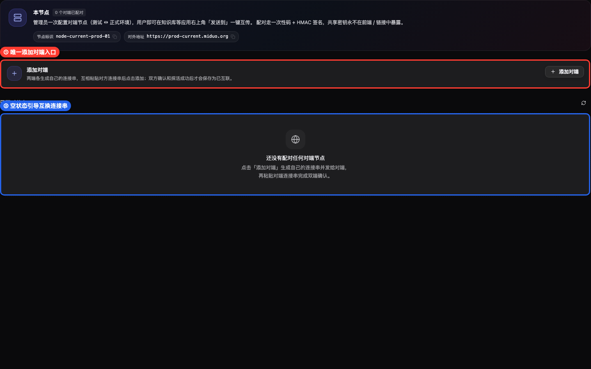
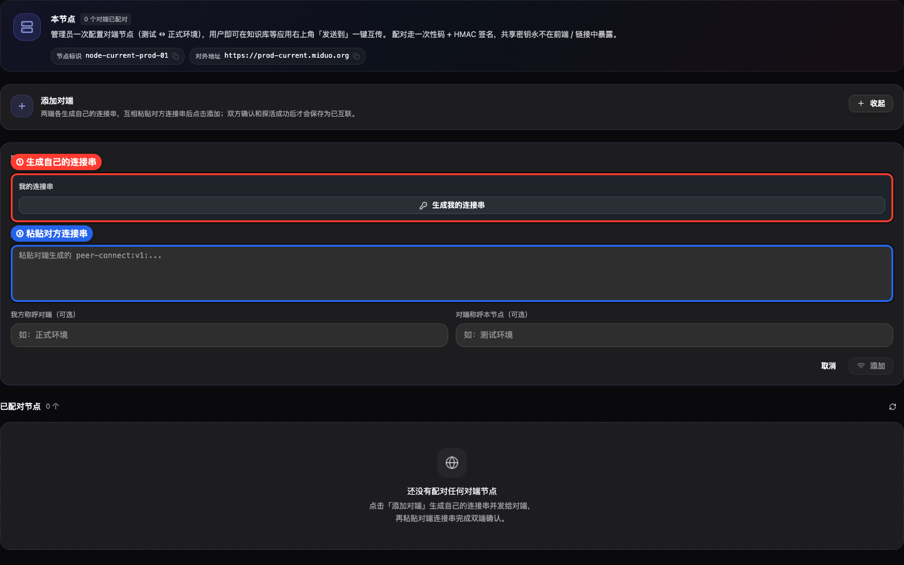
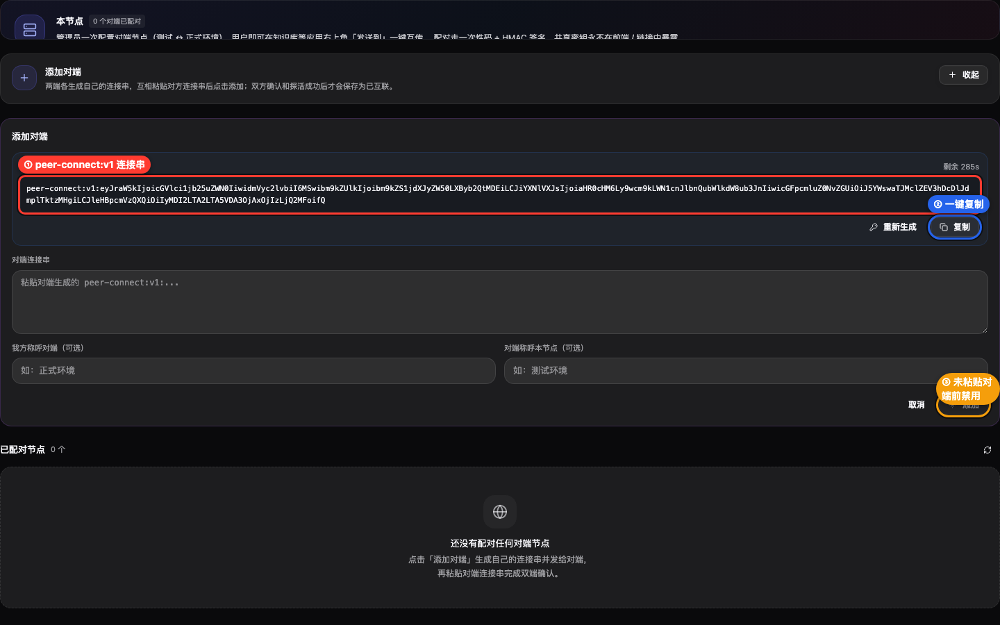
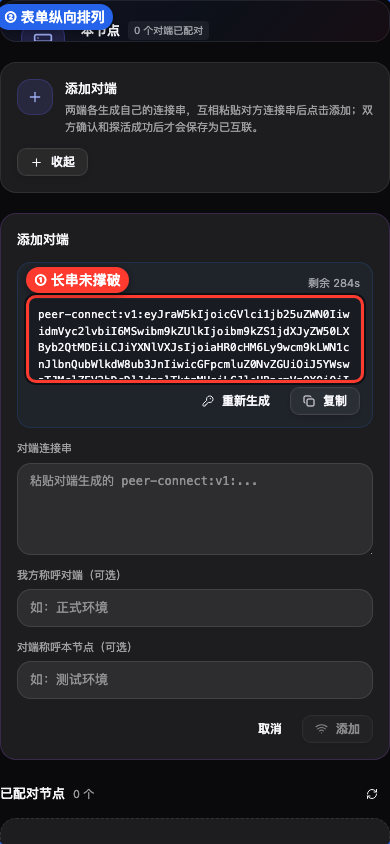

# prd-agent · 系统互联 · 添加对端统一连接串 · 视觉验收 · 验收报告

> Verdict: 有条件通过
> 系统互联统一「添加对端」流程的核心视觉状态通过：唯一入口、连接串生成、对端连接串粘贴区、复制/禁用状态、移动端纵向布局均可见且无横向溢出。限制项：当前环境缺少 MAP_ACCEPT_PASS，未能按技能要求走真实表单登录与侧边栏点击导航，取证使用临时本地探针加载真实组件完成。

| 项目 | 目标 | 分支 | commit | 预览 | 验收人 | 日期 | 缺陷 P0/P1/P2/P3 |
|---|---|---|---|---|---|---|---|
| prd-agent | 系统互联添加对端统一连接串流程 | main | ec1e42b61 | http://localhost:8000 | Codex | 2026-06-09 | 0/1/0/0 |

## 目标与价值
验证系统互联是否已经从「邀请对端接入我 / 接入已知对端」双入口，收敛为对等的「添加对端」单入口，并确认连接串生成、粘贴、复制和移动端布局符合可用性要求。

## 范围与不覆盖
本次覆盖 prd-admin 系统互联设置组件的视觉状态：初始态、展开态、生成连接串态、移动端布局。受环境凭据限制，本次不覆盖真实登录表单、真实侧边栏导航点击、真实后端双节点握手联调；这些限制不影响本轮组件视觉结论，但影响端到端 Verdict，因此判为有条件通过。

## 验收路径
本次按技能降级路径执行：启动本地前端服务，临时挂载仅用于取证的 dev 路由加载真实 PeerNodesSettings 组件，注入稳定 mock 数据，截图后立即撤回临时路由和 mock。操作顺序为：进入系统互联视图，点击「添加对端」，检查「我的连接串」与「对端连接串」，点击「生成我的连接串」，切换 390px 移动宽度复查。

## 完成标准 DoD
| 标准 | 结果 | 说明 |
|---|---|---|
| 单一入口 | 通过 | 初始态只有一个「添加对端」入口，不再展示邀请/接入两套角色入口。 |
| 双方交换连接串 | 通过 | 展开态同时呈现「我的连接串」生成区与「对端连接串」粘贴区。 |
| 长连接串可控 | 通过 | peer-connect:v1 字符串被收纳在代码区域内，没有撑破桌面布局。 |
| 添加按钮状态合理 | 通过 | 未粘贴对端连接串前「添加」按钮保持禁用。 |
| 移动端可用 | 通过 | 390px 宽度下表单纵向排列，长串不造成横向溢出。 |
| 真人导航路径 | 有条件 | 缺少 MAP_ACCEPT_PASS，无法按技能标准执行登录后侧边栏点击进入。 |

## 自测路径
| 命令或检查 | 结果 |
|---|---|
| Chrome Headless 截图取证 | 通过，4 张截图均带框选标注 |
| DOM 横向溢出检查 | 通过，desktopOverflow=[]，mobileOverflow=[] |
| 临时探针撤回检查 | 通过，App.tsx 与 peerSync.ts 无残留 diff |
| 前端类型检查 | 复用前序结果：pnpm --prefix prd-admin tsc --noEmit 通过 |
| 后端构建检查 | 复用前序结果：dotnet build prd-api/PrdAgent.sln --no-restore 通过，只有既有 warning |

## 需求一一对应表
| # | 用户原始诉求 | 状态 | 实现/证据/原因 |
|---|---|---|---|
| 1 | 观察图中样子，看看有几处问题 | 已落地 | 图 01、02、03、04 覆盖入口收敛、连接串生成、粘贴区、移动端布局四类视觉风险。 |
| 2 | 不用区分邀请对端接入我和接入已知对端，一个按钮叫添加对端 | 已落地 | 图 01 红框标出唯一「添加对端」入口。 |
| 3 | 双方各自生成地址和密钥字符串，互换后添加即可互联 | 已落地 | 图 02 展示「我的连接串」与「对端连接串」两个对等区域，图 03 展示 peer-connect:v1 字符串。 |
| 4 | 一端连接失败或任何非成功情况不存储状态，必须同时互联成功才是真正互联 | 已落地 | 该项属于后端行为，已在报告文字中记录 prepare/confirm/ping/cancel 策略；本轮视觉图不直接证明后端事务结果。 |
| 5 | 做完之后记得视觉验收 /create-visual-test-to-kb | 已落地 | 本报告由 create-visual-test-to-kb 的 archive_report.py 归档，证据图走框选标注门禁。 |

## 验收用例
| # | Phase | 维度 | 操作 | 预期 | 实际 | 状态 | 严重级 | 证据图 |
|---|---|---|---|---|---|---|---|---|
| 1 | 验证 | 功能适合性 | 查看系统互联初始态 | 只有一个添加对端入口，空状态说明互换连接串 | 符合 | 通过 | 无 | 01 |
| 2 | 执行 | 可用性 | 点击「添加对端」展开表单 | 同屏出现我的连接串区和对端连接串粘贴区 | 符合 | 通过 | 无 | 02 |
| 3 | 执行 | 可用性 | 点击「生成我的连接串」 | 出现 peer-connect:v1 字符串、复制按钮，添加按钮在未粘贴对端前禁用 | 符合 | 通过 | 无 | 03 |
| 4 | 回归 | 兼容性 | 切换到 390px 移动宽度 | 长连接串不撑破，表单纵向排列 | 符合 | 通过 | 无 | 04 |
| 5 | 前置 | 可达性 | 走真实登录与导航点击 | 应从登录后首页点击设置进入系统互联 | 未执行，缺 MAP_ACCEPT_PASS | 有条件 | P1 | 无 |

## 硬约束与截图标准核查
| 项 | 结果 | 说明 |
|---|---|---|
| 截图数量达到 L1 | 通过 | L1 要求至少 3 张，本次 4 张。 |
| 证据图有 caption | 通过 | 每张 manifest caption 均说明验证点。 |
| 指向性截图画框标注 | 通过 | 4 张图均带红/蓝/橙框与标签，manifest annotated=true。 |
| 页面版式健康 | 通过 | 未见弹窗撑破、主按钮不可达、文字重叠。 |
| 长串布局 | 通过 | 桌面与移动 overflow 检查均为空数组。 |
| 真实导航 | 有条件 | 缺少登录密码，未能执行表单登录后的点击导航路径。 |

## 缺陷清单
P1：本轮验收未覆盖真实登录后的侧边栏点击导航，原因是环境缺少 MAP_ACCEPT_PASS。功能视觉本身未发现 P0/P1/P2/P3 缺陷；拿到登录凭据后应补跑真人路径并可将 Verdict 翻转为通过。

## 步骤 1 · 看初始态唯一入口
打开系统互联视图后，页面只保留一个「添加对端」入口，空状态说明用户需要互换连接串。

## 步骤 2 · 展开添加对端
点击「添加对端」后，表单同时出现「我的连接串」生成区和「对端连接串」粘贴区，符合对等互联模型。

## 步骤 3 · 生成我的连接串
点击「生成我的连接串」后出现 peer-connect:v1 字符串，复制按钮可见，未粘贴对端连接串前「添加」保持禁用。

## 步骤 4 · 复查移动端布局
切换到 390px 宽度后，连接串、输入区、操作按钮纵向排列，长字符串未撑破布局。

## 结论
本轮视觉验收结论为有条件通过：系统互联核心视觉改造满足预期，限制项仅是当前环境缺少登录密码，未能按技能标准覆盖真实登录导航路径。

<!-- acceptance-meta
type: acceptance-report
standard: MAP-Acceptance-v2
report_id: acc-prd-agent-202606091459-系统互联添加对端统一连接串视觉验收
date: 2026-06-09
reviewer: local
verdict: conditional
tier: L1
target_ref: 系统互联添加对端统一连接串视觉验收
preview_url: http://localhost:8000
branch: main
commit: ec1e42b61
-->
