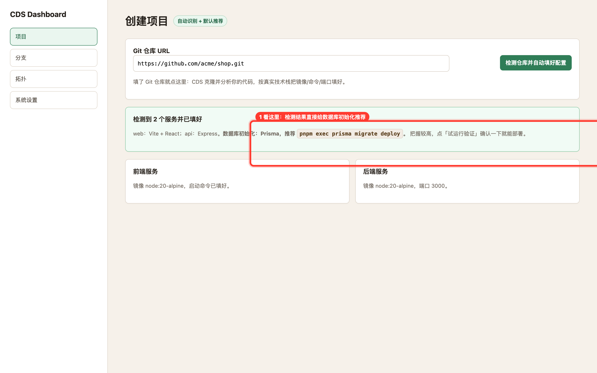
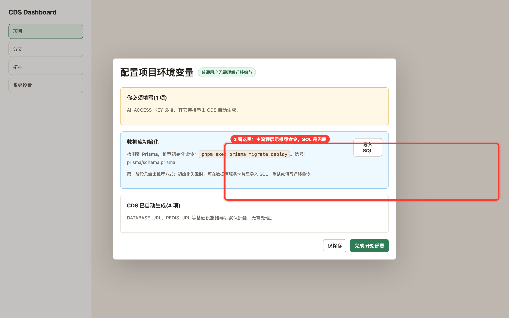

# prd-agent · CDS · 数据库初始化自动识别推荐 · 新增功能 · 验收报告

> Verdict: **通过**
> 第一阶段已落地：CDS 能扫描并推荐数据库初始化方式，普通用户在首次部署前看到推荐动作，SQL 被降级为手动兜底。

| 项目 | 目标 | 分支 | commit | 预览 | 验收人 | 日期 | 缺陷 P0/P1/P2/P3 |
|---|---|---|---|---|---|---|---|
| prd-agent | CDS 数据库初始化第一阶段 | worktree | 1a7557b61 | 本地静态取证 | Codex | 2026-06-10 | 0/0/0/0 |

## 步骤 1 · 创建项目时先看自动检测结果

点击「检测仓库并自动填好配置」后，检测结果会把数据库初始化推荐命令直接展示给用户。

## 步骤 2 · 打开环境变量弹窗查看推荐初始化方式

环境变量主流程展示 Prisma 初始化推荐命令，导入 SQL 被放在同一卡片右侧作为兜底动作。

## 步骤 3 · 回到分支页查看非打断式站内信

分支页站内信提示 CDS 会先扫描推荐方式，不再要求用户先上传 schema.sql。

## 需求一一对应表

| # | 用户原始诉求（保留措辞） | 状态 | 实现/证据/原因 |
|---|---|---|---|
| 1 | 先做自动识别，扫描 Prisma、Drizzle、TypeORM、Sequelize、Django、Alembic、Rails、SQL 脚本 | 已落地 | 后端新增结构化 databaseInit 识别，图 1 展示 Prisma 推荐结果 |
| 2 | 再做推荐动作，不问复杂问题，直接生成推荐方案 | 已落地 | 创建页检测结果与环境变量弹窗直接展示推荐命令，见图 1、图 2 |
| 3 | 默认自动执行 | 未做 | 按阶段计划，本轮只做第一阶段推荐，不在数据库 ready 后执行命令 |
| 4 | 失败才暴露高级操作 | 部分落地 | UI 已把导入 SQL 改为兜底入口，自动失败恢复日志与重试留到第三阶段，见图 2 |
| 5 | 把 SQL 上传变成兜底，不是主流程 | 已落地 | 创建页文案、环境变量弹窗和站内信均改为 SQL 兜底语义，见图 2、图 3 |
| 6 | 第一阶段：做项目扫描和识别，只给出推荐初始化方式，不自动执行 | 已落地 | 本轮实现范围明确为扫描识别 + 推荐展示，未接入自动执行 |
| 7 | 普通用户走自动化，高级用户才看到配置项 | 部分落地 | 普通路径显示推荐，高级 SQL 入口弱化；完整服务卡片重试/自定义命令留到后续阶段 |
| 8 | 完成之后创建视觉验收 | 已落地 | 本报告按视觉验收 skill 生成，含 3 张带框证据图 |

## 验收用例一览

| # | 操作 | 预期 | 实际 | 状态 | 证据 |
|---|---|---|---|---|---|
| 1 | 仓库检测返回服务识别结果 | 页面同时提示数据库初始化推荐命令 | 页面显示 Prisma 与 pnpm exec prisma migrate deploy | pass | 图 1 |
| 2 | 打开首次部署环境变量弹窗 | 用户看到推荐方式，SQL 只是兜底 | 数据库初始化卡展示推荐命令，按钮文案为导入 SQL | pass | 图 2 |
| 3 | 分支页出现数据库初始化站内信 | 不打断主流程，不要求先上传 SQL | 站内信提示先扫描推荐方式，SQL 仅作为兜底 | pass | 图 3 |

## 缺陷清单

P0/P1/P2:无。
P3:无阻塞缺陷；后续阶段需要补数据库 ready 后自动执行、失败日志、重试和自定义命令。

## 结论

本轮达到 L1 单项验收标准：扫描推荐和 UI 降噪已落地，自动执行按阶段计划未纳入本次完成范围。

<!-- acceptance-meta
type: acceptance-report
standard: MAP-Acceptance-v2
report_id: acc-prd-agent-202606101844-cds-数据库初始化自动识别推荐
date: 2026-06-10
reviewer: local
verdict: pass
tier: L1
target_ref: CDS 数据库初始化自动识别推荐
preview_url: 
branch: worktree
commit: 1a7557b61
-->
