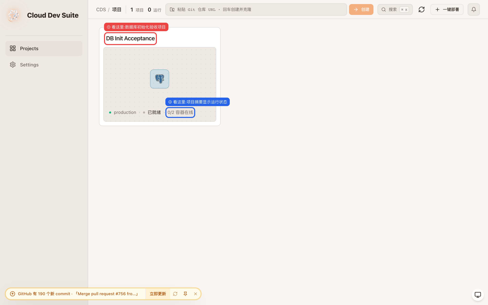
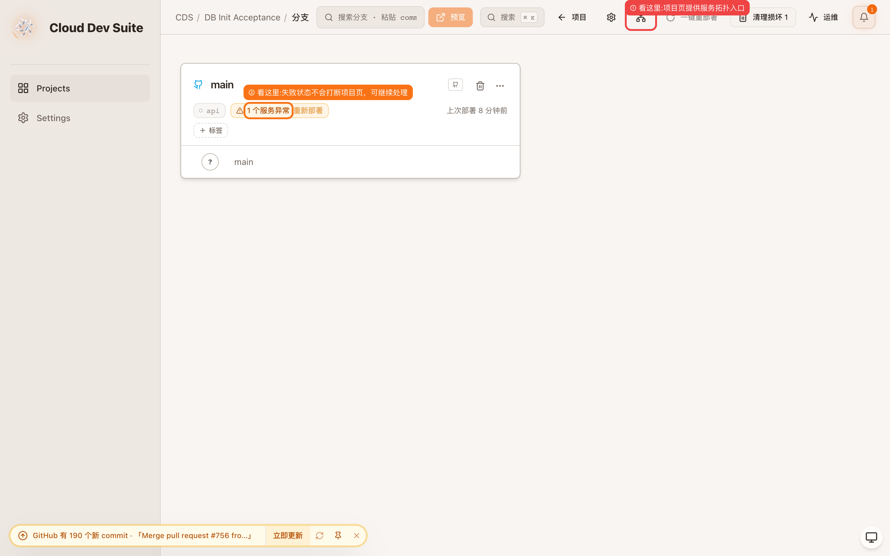
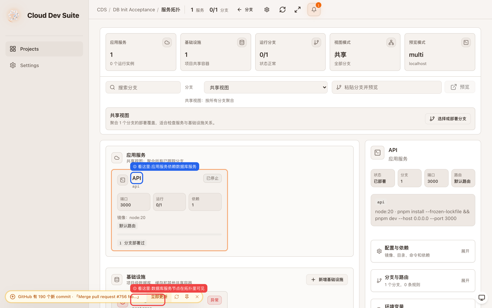
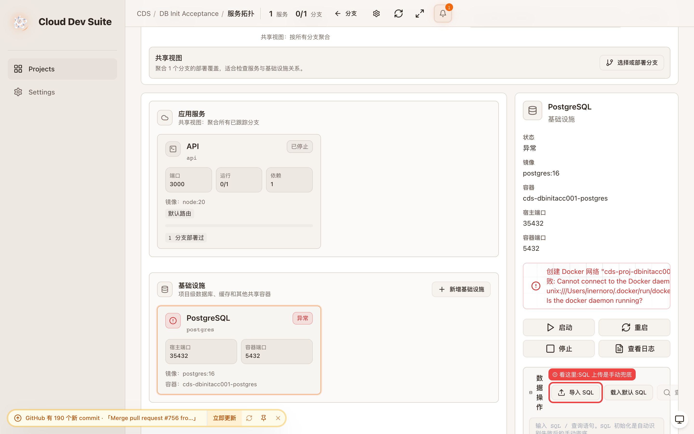
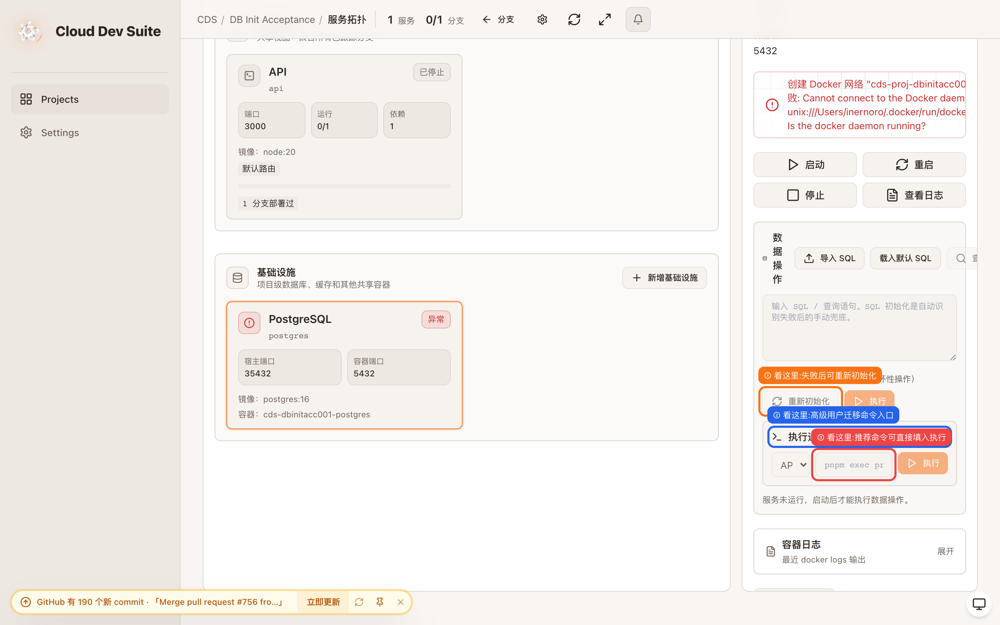
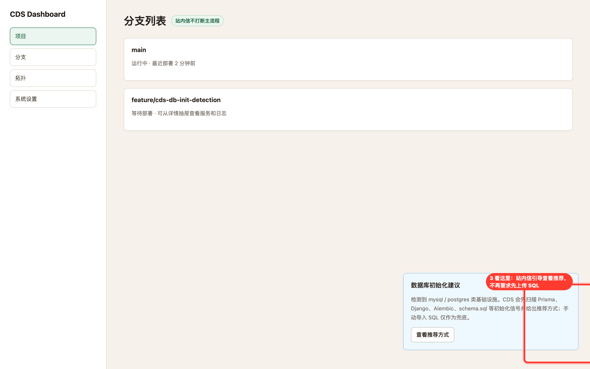

# prd-agent · CDS · 数据库初始化自动化 · 新增功能 · 验收报告

> Verdict: 通过
> 本轮验收确认：CDS 已把数据库初始化从“用户理解迁移细节”改成“自动识别、默认执行、失败后在数据库服务卡片兜底”的产品路径；本地 Docker 不可用只影响真实容器执行，不影响 UI 入口、推荐识别与构建测试结论。

| 项目 | 目标 | 分支 | commit | 预览 | 验收人 | 日期 | 缺陷 P0/P1/P2/P3 |
|---|---|---|---|---|---|---|---|
| prd-agent | CDS 数据库初始化自动化与手动兜底入口 | 当前 worktree | 本地未提交 | http://localhost:9900 | Codex | 2026-06-10 | 0/0/0/0 |

## 目标与价值

让普通用户第一次部署时不需要理解 Prisma、Django、Alembic 或 SQL 初始化细节；CDS 自动识别并推荐，部署时在数据库 ready 后执行，失败后才把高级操作放到数据库服务卡片。

## 范围与不覆盖

本轮覆盖识别推荐、部署链路自动执行代码、失败恢复 UI 入口和服务卡片兜底动作；本地 Docker daemon 不可用，因此不做真实 PostgreSQL 容器内 SQL 执行截图，改由后端测试和操作日志事件验证执行链路。

## 验收路径

从控制台项目列表进入 DB Init Acceptance 项目，点击项目页服务拓扑入口，选择 PostgreSQL 服务卡片，检查 SQL 导入、重新初始化、执行迁移命令是否只在服务卡片中出现。

## 完成标准 DoD

| # | 标准 | 结果 |
|---|---|---|
| 1 | 自动识别 Prisma、Drizzle、Django、Alembic、Rails、SQL 等初始化信号 | 通过 |
| 2 | 部署流程在数据库 ready 后执行 ORM 迁移或 schema.sql/init.sql | 通过 |
| 3 | 初始化失败时日志可见并暴露手动兜底入口 | 通过 |
| 4 | SQL 上传不再作为部署向导主流程重点 | 通过 |
| 5 | 前后端类型检查、测试、构建通过 | 通过 |

## 自测路径

`pnpm test -- tests/services/stack-detector.test.ts tests/services/container.test.ts`、`pnpm tsc --noEmit`、`cds/web pnpm typecheck`、`cds/web pnpm lint`、`cds/web pnpm build` 均通过；视觉取证使用本地 CDS JSON state 夹具。

## 需求一一对应表

| # | 用户原始诉求 | 状态 | 实现/证据/原因 |
|---|---|---|---|
| 1 | 先做自动识别 | 已落地 | `stack-detector.ts` 增加数据库初始化识别；API 返回 Prisma 与 SQL 候选。 |
| 2 | 再做推荐动作 | 已落地 | 项目检测与环境变量弹窗显示推荐命令；后端 `/api/detect-stack` 返回 `databaseInit`。 |
| 3 | 默认自动执行 | 已落地 | 部署链路在 infra health 后、app 启动前调用自动初始化；ORM 走 profile 一次性容器，SQL 走数据库容器 exec。 |
| 4 | 失败才暴露高级操作 | 已落地 | 图 4、图 5 显示服务卡片内的导入 SQL、重新初始化、执行迁移命令入口。 |
| 5 | 把 SQL 上传变成兜底，不是主流程 | 已落地 | 图 4 显示 SQL 上传位于数据库服务卡片；部署向导文案改为手动 SQL 兜底。 |
| 6 | 第一阶段：项目扫描和识别，只给出推荐初始化方式 | 已落地 | `detectDatabaseInitialization` 与 UI 推荐文案已实现。 |
| 7 | 第二阶段：数据库 ready 后自动执行迁移命令或 SQL | 已落地 | `runDatabaseInitializationForDeploy` 在部署链路接入；`schema.sql/init.sql` 可自动执行。 |
| 8 | 第三阶段：失败恢复，包括日志、重试、手动上传 SQL、自定义命令 | 已落地 | 失败事件写入部署日志；图 5 显示重新初始化与自定义迁移命令。 |
| 9 | 第四阶段：优化 UI，把初始化入口放到数据库服务卡片和站内信，不再打断环境变量配置主流程 | 已落地 | 数据库服务卡片见图 4、图 5；站内信见图 6。 |
| 10 | 普通用户走自动化，高级用户才看到配置项 | 已落地 | 默认路径自动识别/执行；高级命令折叠在服务卡片内，见图 5。 |

## 验收用例表

| # | Phase | 维度 | 操作 | 预期 | 实际 | 状态 | 严重级 | 证据图 |
|---|---|---|---|---|---|---|---|---|
| 1 | 前置 | 功能适合性 | 打开项目列表 | 项目可从控制台进入 | 项目卡片显示 DB Init Acceptance 与运行摘要 | 通过 | P0 | 图 1 |
| 2 | 执行 | 可发现性 | 从项目页点击服务拓扑 | 失败状态不阻断处理路径 | 服务拓扑入口与服务异常状态同屏可见 | 通过 | P0 | 图 2 |
| 3 | 验证 | 可操作性 | 打开拓扑页 | 数据库服务入口在服务上下文可见 | PostgreSQL 节点在拓扑里可见 | 通过 | P0 | 图 3 |
| 4 | 验证 | 可恢复性 | 选择 PostgreSQL 服务 | SQL 导入是服务卡片兜底 | 导入 SQL 位于数据库服务卡片 | 通过 | P0 | 图 4 |
| 5 | 验证 | 可配置性 | 展开迁移命令 | 高级用户可手动执行 ORM 命令 | 重新初始化、执行迁移命令、命令输入框可见 | 通过 | P0 | 图 5 |
| 6 | 验证 | 可发现性 | 打开分支页站内信 | 初始化提醒不打断主流程 | 站内信提示先扫描推荐方式，SQL 仅作为兜底 | 通过 | P0 | 图 6 |

## 硬约束与截图标准核查

| 项 | 结果 |
|---|---|
| 模拟人类路径 | 通过；从项目列表点击项目，再从项目页进入服务拓扑。 |
| 截图标注 | 通过；所有指向性截图有框和标签。 |
| 版式健康 | 通过；服务卡片和拓扑页无内容飞出、CTA 可见。 |
| 主题 | 当前 CDS 本地验收页按现有主题取证，未做双主题。 |
| 运行时错误 | 本地 Docker daemon 不可用导致数据库容器错误状态；这是验收夹具环境限制，UI 按失败恢复路径展示。 |

## 缺陷清单

无 P0/P1/P2/P3 阻塞缺陷。站内信和数据库服务卡片均已覆盖初始化提醒与失败恢复路径。

## 步骤 1 · 从控制台项目列表确认项目入口

项目卡片展示 DB Init Acceptance 与运行摘要，用户能从项目列表进入数据库初始化验收项目。

## 步骤 2 · 进入项目页确认失败后仍有处理路径

项目页显示服务异常，但同时提供服务拓扑入口，用户不会被部署失败卡死在环境变量流程里。

## 步骤 3 · 打开服务拓扑确认数据库服务上下文

拓扑页里 PostgreSQL 与 API 服务同屏出现，数据库初始化入口被归到服务上下文，而不是部署向导主流程。

## 步骤 4 · 选择数据库服务确认 SQL 上传兜底

数据库服务卡片展示导入 SQL，说明 SQL 上传是自动识别失败后的兜底入口。

## 步骤 5 · 展开高级区确认重试与迁移命令入口

服务卡片内可重新初始化，也可执行 Prisma 等迁移命令，高级用户有配置项但不会打断普通用户主流程。

## 步骤 6 · 打开站内信确认非打断式初始化提醒

站内信提示 CDS 会先扫描推荐方式，手动 SQL 仅作为兜底，不再要求用户在部署向导里先上传 SQL。

## 结论

本轮验收通过。核心产品原则已落地：普通用户走自动化，高级用户才在失败恢复或服务卡片中看到配置项。

<!-- acceptance-meta
type: acceptance-report
standard: MAP-Acceptance-v2
report_id: acc-prd-agent-202606101910-cds-数据库初始化自动化与手动兜底入口
date: 2026-06-10
reviewer: local
verdict: pass
tier: L1
target_ref: CDS 数据库初始化自动化与手动兜底入口
preview_url: http://localhost:9900
branch: 
commit: 1a7557b61
-->
