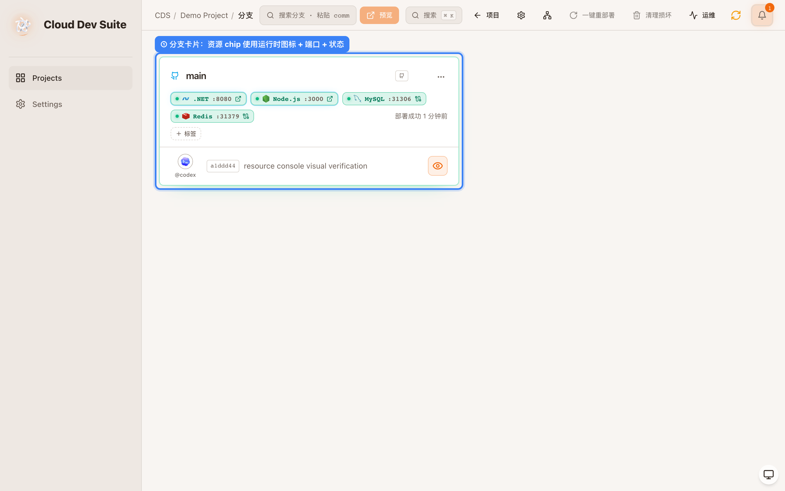
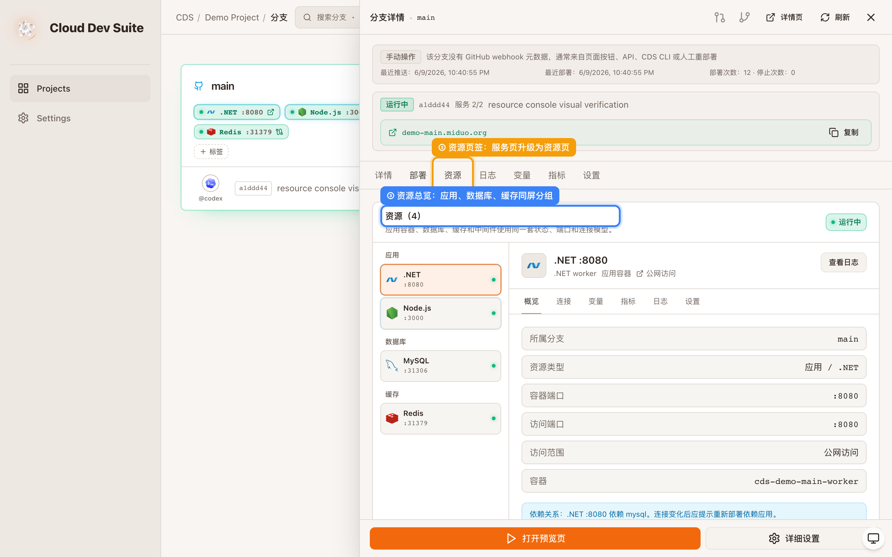
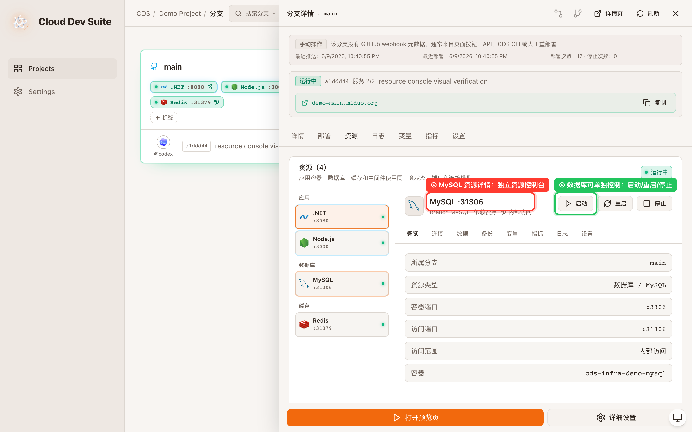
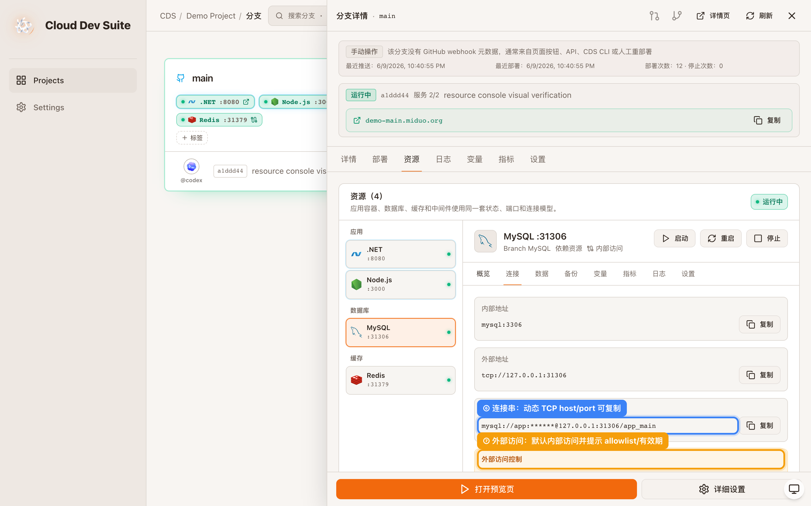
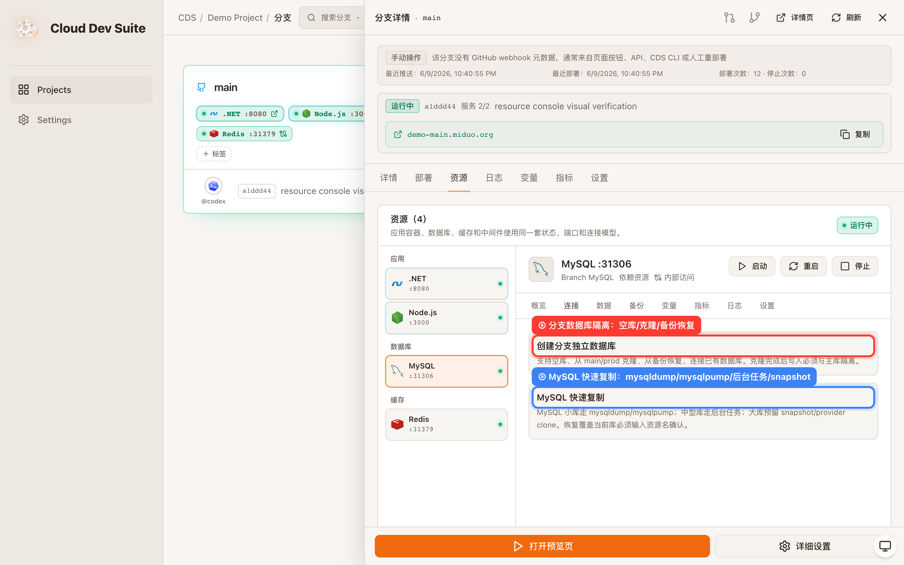

# prd-agent · CDS · 分支资源控制台升级 · 新增功能 · 验收报告

> Verdict: **有条件通过**
> 分支卡片资源 chip、资源页、数据库连接与克隆/备份入口已完成前端闭环并通过视觉验收；数据库克隆执行、审计日志、权限策略和公网访问持久化仍需后端继续落地。

| 项目 | 目标 | 分支 | commit | 预览 | 验收人 | 日期 | 缺陷 P0/P1/P2/P3 |
|---|---|---|---|---|---|---|---|
| prd-agent | CDS 分支资源控制台升级 | detached@d77485fd7 | d77485fd7 | 本地 Playwright mock: http://127.0.0.1:5173/branches/demo | Codex | 2026-06-09 | 0/0/0/4 |

## 步骤 1 · 打开分支列表并查看资源 chip

进入分支列表后，分支卡片直接展示 Node.js、.NET、Redis 等运行时图标、端口和状态，不再把 api/admin 作为主标签。

## 步骤 2 · 打开分支详情并切到「资源」页

点击分支卡片打开详情抽屉，再点「资源」页签，可以看到应用、数据库、缓存按统一 Resource 模型分组展示。

## 步骤 3 · 选择 MySQL 资源并验证单独控制入口

在资源列表选择 MySQL 后，右侧详情面板展示 MySQL :31306，并提供启动、重启、停止三个独立控制入口。

## 步骤 4 · 打开「连接」并验证动态连接信息

切到连接页后，面板展示内部地址、外部 TCP 地址、MySQL 连接串和复制按钮，同时提示数据库公网访问需要 allowlist、有效期和凭据记录。

## 步骤 5 · 打开「备份」并验证分支数据库隔离入口

切到备份页后，面板展示创建分支独立数据库、从 main/prod 克隆、从备份恢复、连接已有数据库，以及 MySQL 快速复制的实现策略入口。

## 需求一一对应表

| # | 用户原始诉求（保留措辞） | 状态 | 实现/证据/原因 |
|---|---|---|---|
| 1 | 把 api、admin、数据库、Redis 等全部统一为 Resource | 已落地 | 图 1-2：新增统一资源模型，应用容器和 infra 资源同屏展示。 |
| 2 | 分支卡片不要再展示 api/admin，改为 Node.js :3000、.NET :8080、MySQL :3306、Redis :6379 | 部分落地 | 图 1：运行时与端口已替代 api/admin；当前卡片展示最多 6 个资源，真实端口来自现有 hostPort。 |
| 3 | chip 使用技术图标、状态颜色、公网暴露额外效果 | 部分落地 | 图 1：技术图标和状态色已落地；外部访问角标对应用 preview 生效，数据库公网访问持久化字段仍待后端。 |
| 4 | 将原来的服务页升级为资源页，并按应用、数据库、缓存分组 | 已落地 | 图 2：抽屉页签显示「资源」，左侧按应用、数据库、缓存分组。 |
| 5 | 资源详情面板类似 Railway，包含概览、连接、数据、备份、变量、指标、日志、设置 | 已落地 | 图 3-5：数据库资源详情具备目标 tabs 和对应信息区。 |
| 6 | 支持分支单独创建数据库、空库、克隆 main/prod、备份恢复、已有连接 | 部分落地 | 图 5：前端入口和流程说明已落地；后端执行任务、状态和失败重试仍待实现。 |
| 7 | MySQL 快速复制，小库 mysqldump/mysqlpump，中型后台任务，大库 snapshot/provider clone | 部分落地 | 图 5：策略入口已明确；实际 mysqldump/mysqlpump 执行器和进度 API 未完成。 |
| 8 | 数据库连接管理，内部地址、环境变量、复制连接串、重置凭据、注入应用 | 部分落地 | 图 4：内部地址、外部地址、连接串和复制入口已落地；凭据重置和注入应用仍待后端。 |
| 9 | 所有资源默认内部访问，支持公网 URL/TCP、关闭公网、IP allowlist、临时有效期 | 部分落地 | 图 4：默认内部访问和公网访问提示已落地；持久化开关、allowlist、有效期 API 未完成。 |
| 10 | MySQL/Postgres、MongoDB、Redis 差异化数据面板 | 部分落地 | 图 3-5：面板会按数据库类型展示不同数据能力文案；真实数据浏览和只读查询 API 未完成。 |
| 11 | 备份与恢复，手动备份、从备份创建新库、恢复覆盖二次确认 | 部分落地 | 图 5：备份恢复入口已落地；备份列表、创建备份、覆盖恢复 API 未完成。 |
| 12 | 危险操作保护，二次确认和审计日志 | 部分落地 | 设置页有危险操作保护说明；真正的二次确认策略和审计写入仍需后端。 |
| 13 | 状态与视觉规范：绿色运行、黄色警告、红色异常、灰色停止、蓝色公网暴露 | 已落地 | 图 1-4：复用现有 statusClass/statusRailClass，公网应用 chip 有外链角标和高亮。 |
| 14 | 权限控制：成员、开发者、管理员、生产资源更高权限 | 部分落地 | 设置页说明已落地；角色判定和接口授权未完成。 |
| 15 | 审计日志：资源创建、删除、重启、外部访问、克隆、恢复、凭据重置 | 部分落地 | 设置页说明已落地；审计事件模型和写入 API 未完成。 |
| 16 | 依赖关系：应用声明依赖数据库/Redis，连接变化提示重部署 | 部分落地 | 概览页会显示 profile dependsOn；连接变化后的重部署提示和自动依赖拓扑仍待完善。 |

## 验收用例一览

| # | 操作 | 预期 | 实际 | 状态 | 证据 |
|---|---|---|---|---|---|
| 1 | 打开分支列表 | 分支卡片显示运行时 + 端口资源 chip | 出现 Node.js、.NET、Redis 等资源 chip | pass | 图 1 |
| 2 | 打开详情抽屉并点击资源 | 服务页升级为资源页，展示统一资源模型 | 出现资源（4）和应用/数据库/缓存分组 | pass | 图 2 |
| 3 | 选择 MySQL 资源 | MySQL 有独立详情面板和控制按钮 | 详情显示 MySQL :31306，含启动/重启/停止 | pass | 图 3 |
| 4 | 切到连接 tab | 展示内部地址、外部地址、连接串和复制入口 | MySQL 连接串与复制按钮可见 | pass | 图 4 |
| 5 | 切到备份 tab | 展示分支库隔离、克隆和 MySQL 快速复制入口 | 隔离/克隆/快速复制信息可见 | pass | 图 5 |
| 6 | 捕获前端运行时错误 | 无 console.error、无 pageerror | Playwright 结果 consoleErrors=[] | pass | tmp-visual/visual-check-result.json |

## 缺陷清单

P0/P1/P2:无。
P3:数据库克隆、备份恢复、权限、审计、公网访问策略目前仍是前端入口和说明，未形成真实后端闭环。

## 结论

本次可判定为有条件通过：用户可见的资源模型、分支卡片资源 chip、资源详情面板和数据库连接/克隆入口已经可用且视觉验收通过；完整目标尚未完成，后续必须补齐数据库克隆执行器、外部访问持久化、权限、审计和备份恢复 API 后才能升级为通过。

<!-- acceptance-meta
type: acceptance-report
standard: MAP-Acceptance-v2
report_id: acc-prd-agent-202606092242-cds-分支资源控制台升级
date: 2026-06-09
reviewer: local
verdict: conditional
tier: L2
target_ref: CDS 分支资源控制台升级
preview_url:
branch: detached@d77485fd7
commit: d77485fd7
-->
