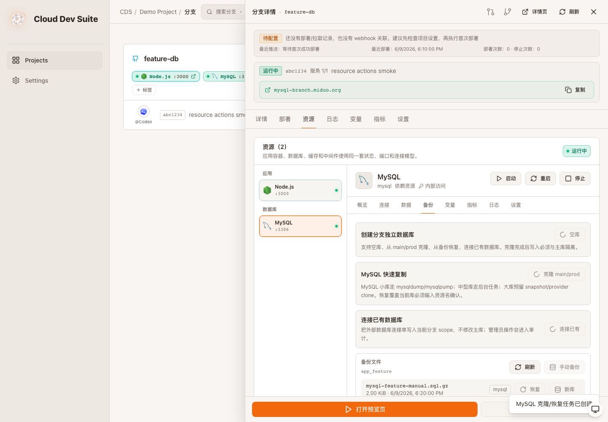
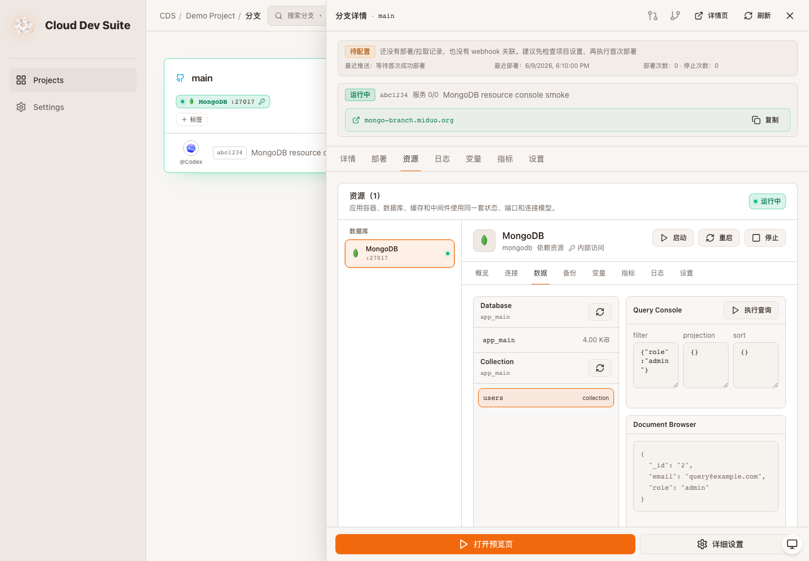
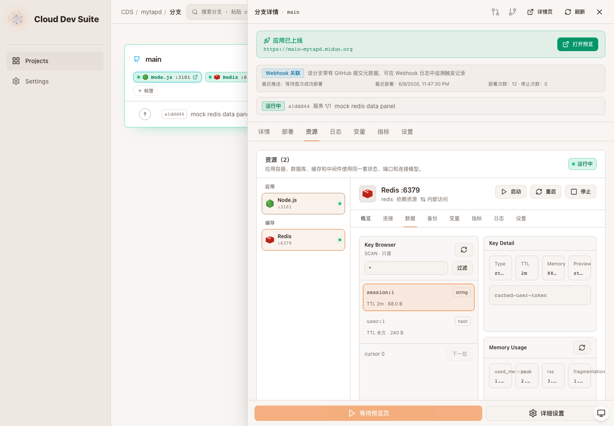
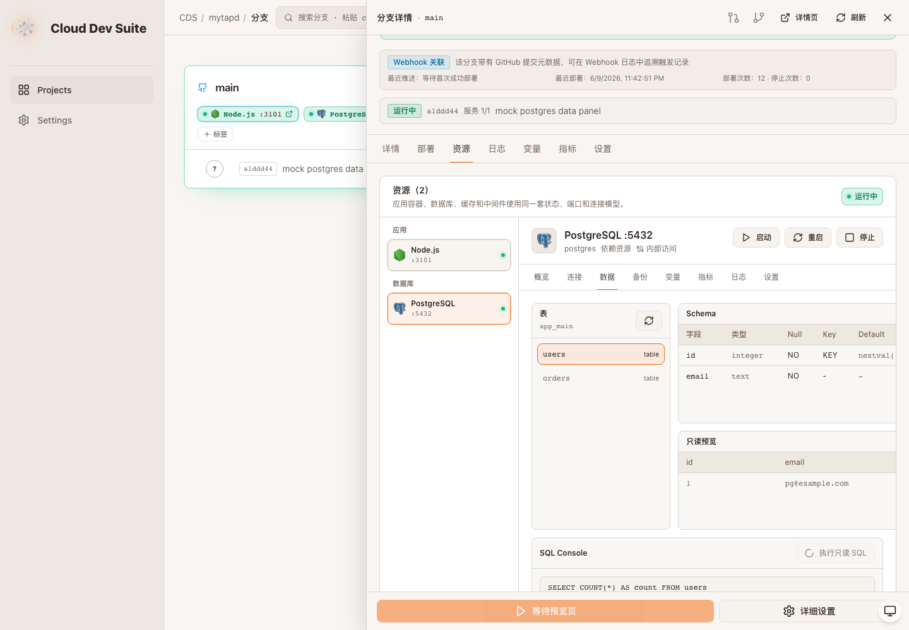

# prd-agent · CDS · 资源控制台权限与数据库面板补齐 · 验收报告

> Verdict: **有条件通过**
> 本轮补齐资源写操作权限门控、外部访问 TTL/allowlist、连接已有数据库、从备份创建新库，以及 MongoDB/Redis/PostgreSQL 数据面板 smoke。远端 CDS self-update 和线上知识库归档仍待执行。

| 项目 | 目标 | 分支 | commit | 预览 | 验收人 | 日期 | 缺陷 P0/P1/P2/P3 |
|---|---|---|---|---|---|---|---|
| prd-agent | CDS 分支资源控制台升级 | local worktree | 待提交 | 本地 Vite preview + Playwright mock | Codex | 2026-06-09 | 0/0/0/2 |

## 验收证据

### 1. 外部访问策略、从备份创建新库、连接已有数据库

证据文件：`tmp-visual/resource-policy-connect-smoke.json`

- `PUT /external-access` payload 包含 `ttlMinutes=45` 和两个 allowlist 项。
- `POST /clone-tasks` 支持 `mode=restore-backup`，携带 `backupName/backupId/targetDatabase`。
- `POST /clone-tasks` 支持 `mode=connect-existing`，携带 `connectionString/externalConnectionName`。
- `consoleErrors=[]`，`pageErrors=[]`。

### 2. MongoDB 数据面板

证据文件：`tmp-visual/resource-mongo-data-panel-smoke.json`

### 3. Redis 数据面板

证据文件：`tmp-visual/resource-redis-data-panel-smoke.json`

### 4. PostgreSQL 数据面板

证据文件：`tmp-visual/resource-postgres-data-panel-smoke.json`

## 需求一一对应表

| # | 目标 | 当前状态 | 证据 |
|---|---|---|---|
| 1-4 | 统一 Resource 模型、卡片 chip、资源页、详情面板 | 已落地 | 第一轮报告 + `cds/src/services/resources.ts` + `cds/web/src/lib/resources.tsx` |
| 5 | 分支数据库独立控制 | 部分落地 | MySQL 空库、clone-main、restore-backup 新库、connect-existing 已有后端路径；Postgres/Mongo 对应执行器仍是下一阶段 |
| 6 | MySQL 快速复制 | 已落地首版 | `mysqldump` 后台任务、进度、失败原因、完成后注入分支 env |
| 7 | 数据库连接管理 | 已落地首版 | 连接串复制、凭据重置、依赖应用注入、连接已有数据库 |
| 8 | 外部访问控制 | 已落地首版 | TTL + IP allowlist 表单；后端持久化 policy；长期/生产公网访问要求 admin |
| 9 | 数据库面板 | 已落地只读首版 | MySQL/Postgres/MongoDB/Redis smoke |
| 10 | 备份与恢复 | 部分落地 | MySQL 手动备份、覆盖恢复、新库恢复；其他数据库执行器待接入 |
| 11 | 危险操作保护 | 部分落地 | 恢复覆盖输入资源名；资源写操作权限门控；写 SQL 未开放 |
| 12 | 状态与视觉规范 | 已落地 | statusClass/statusRailClass + 公网 chip 高亮 |
| 13 | 权限控制 | 已落地首版 | member/developer/admin 角色门控；生产资源外部访问和恢复类操作要求 admin |
| 14 | 审计日志 | 已落地首版 | 外部访问、clone、backup、restore、凭据重置、连接注入写 activity log |
| 15 | 依赖关系 | 部分落地 | dependsOn/consumers 展示和连接注入；图形化依赖拓扑待后续 |

## 本地校验

| 命令/用例 | 结果 |
|---|---|
| `pnpm build` in `cds` | pass |
| `pnpm typecheck` in `cds/web` | pass |
| `pnpm build` in `cds/web` | pass |
| `git diff --check` | pass |
| `resource-policy-connect-smoke` | pass |
| `resource-mongo-data-panel-smoke` | pass |
| `resource-redis-data-panel-smoke` | pass |
| `resource-postgres-data-panel-smoke` | pass |

## 缺陷清单

P0/P1/P2: 无。

P3:

- PostgreSQL/MongoDB/Redis 的备份/恢复/克隆执行器还未接入，只读数据面板已完成。
- 远端 CDS self-update 与线上知识库归档尚未执行，本报告目前是本地验收知识库条目。

## 结论

本轮相较第一轮已经从“前端入口和说明”为主，推进到“关键后端闭环 + 可验证 payload + 只读数据库面板”阶段。完整目标仍未最终完成，因为远端 self-update、线上 KB 归档和非 MySQL 数据库写侧执行器还未完成。

<!-- acceptance-meta
type: acceptance-report
standard: MAP-Acceptance-v2
report_id: acc-prd-agent-202606092359-cds-resource-console-permission-and-db-panels
date: 2026-06-09
reviewer: local
verdict: conditional
tier: L2
target_ref: CDS 分支资源控制台升级
preview_url:
branch: local worktree
commit: pending
-->
