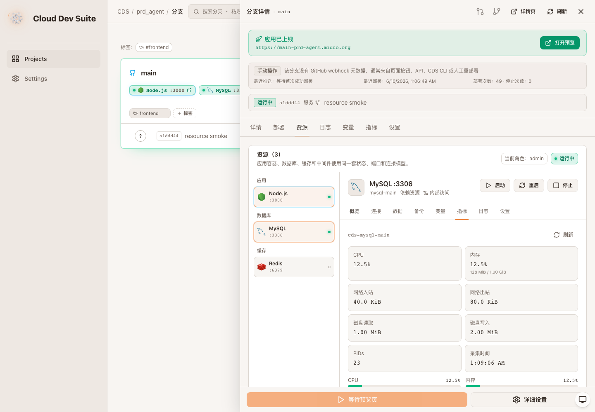
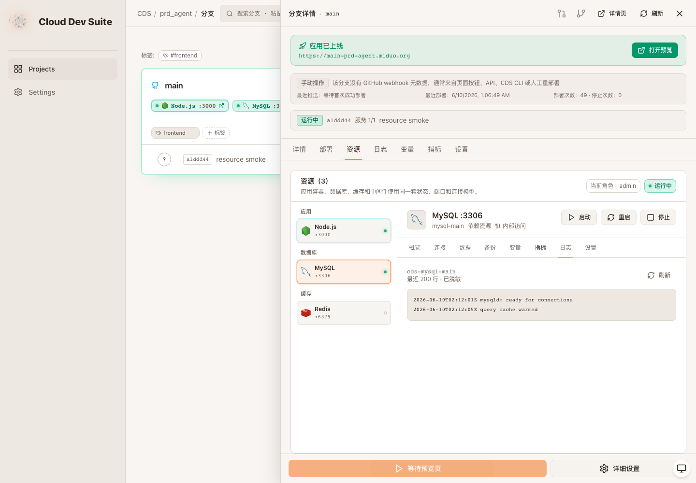

# CDS 资源控制台升级验收 - 资源指标与日志

- 项目：prd-agent / CDS
- 分支：codex/cds-resource-console-upgrade
- 验收时间：2026-06-10 01:09 Asia/Shanghai
- 验收结论：conditional
- 线上知识库：DocumentStore `1862375508054418a5e677d215be3fe6` / entry `af54cd27a8794a7b8a973a4f39b1de3b`

## 本轮变更

- 新增 `GET /api/branches/:id/resources/:resourceId/metrics`，按统一 Resource 解析应用/infra 容器并返回 docker stats 瞬时值。
- 新增 `GET /api/branches/:id/resources/:resourceId/logs?tail=200`，按资源容器读取日志并复用服务端 secret masking。
- 资源详情的“指标”tab 不再显示 `--` 占位，展示 CPU、内存、网络、磁盘 I/O、PIDs 和采集时间。
- 资源详情的“日志”tab 不再显示占位文案，展示容器日志、tail 行数、脱敏状态和手动刷新按钮。

## 需求一一对应表

| 目标项 | 本轮状态 | 证据 |
|---|---|---|
| 4 资源详情面板包含指标、日志 | 完成增强 | `ResourceMetricsPanel` / `ResourceLogsPanel` 接入真实 API |
| 8 资源级操作/观测 | 完成增强 | 资源级 metrics/logs API 按 resourceId 获取容器数据 |
| 12 状态与视觉规范 | 保持 | 停止资源显示无指标可读，运行资源展示实时数值 |
| 14 审计日志 | 无新增 | 本轮是只读观测，不额外写审计，避免日志刷新产生噪音 |

## 验收证据

## 验证命令

| 命令/检查 | 结果 |
|---|---|
| `pnpm --dir cds build` | pass |
| `pnpm --dir cds/web typecheck` | pass |
| `pnpm --dir cds/web build` | pass |
| `git diff --check` | pass |
| Playwright resource metrics/logs smoke | pass，0 console error |

## 剩余缺口

- 动态公网 TCP 端口目前仍主要是策略/地址模型，尚未证明真实网络层端口映射、反向代理或防火墙策略已自动创建。
- IP allowlist 已进入策略模型和 UI，但仍需补齐真实网络层 enforcement 验证。
- 精确 `/create-visual-test-to-kb` 技能在当前环境不可用，本轮继续使用本地验收报告、Playwright 截图和线上 DocumentStore 归档替代。
