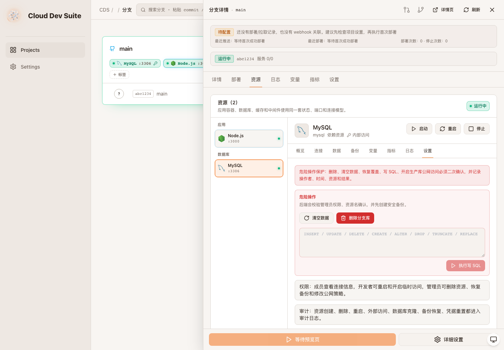

# CDS 资源控制台升级验收 - 多数据库备份与危险操作

- 项目：prd-agent / Cloud Dev Suite
- 分支：codex/cds-resource-console-upgrade
- 验收时间：2026-06-10 01:20 Asia/Shanghai
- 验收结论：conditional

## 本轮覆盖

- PostgreSQL/MongoDB/Redis 资源级备份列表、手动备份和恢复覆盖执行器接入。
- PostgreSQL/MongoDB 支持分支独立空库、clone-main、从备份创建新分支库，并注入分支级连接变量。
- PostgreSQL/MongoDB 支持凭据重置和连接变量注入依赖应用。
- 新增危险操作后端：`clear-data`、删除分支数据库、`query-write`。
- 危险操作统一要求 admin 权限、资源名确认、恢复前安全备份、破坏性操作记录和资源审计日志。
- 资源设置页新增清空数据、删除分支库、执行写 SQL 的最小可用 UI。
- 修复 MySQL clone-main 未检查 `mysqldump | mysql` 退出码的问题。

## 验证证据

- `pnpm --dir cds build`：通过。
- `pnpm --dir cds/web typecheck`：通过。
- `pnpm --dir cds/web build`：通过。
- `git diff --check`：通过。
- Playwright smoke：通过，MySQL 资源设置页可见危险操作、清空数据、删除分支库、执行写 SQL、审计记录，控制台无错误。

截图：

## 仍未完成

- 外部 TCP 端口的真实网络层动态开放和 IP allowlist enforcement 仍需结合现有 proxy/infra 执行器继续核验。
- 前端尚未基于真实登录用户角色隐藏/降级按钮；后端权限门控已实现。
- 指标和 infra 日志仍是占位展示。
- 精确 `/create-visual-test-to-kb` 技能在当前环境不可用，本轮仍使用本地验收报告和可归档截图作为替代证据。
