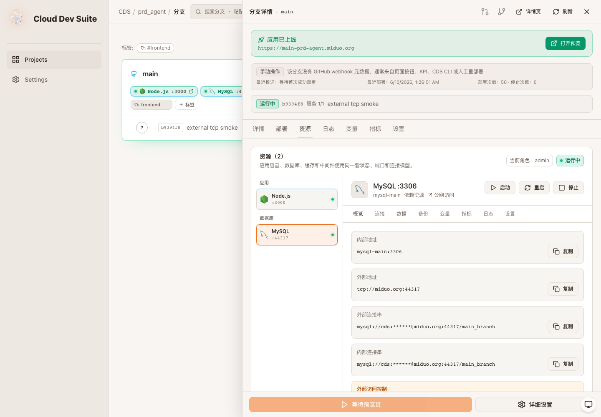

# CDS 资源控制台升级验收 - 资源公网 TCP 访问

- 项目：prd-agent / CDS
- 分支：codex/cds-resource-console-upgrade
- 验收时间：2026-06-10 01:31 Asia/Shanghai
- 验收结论：conditional
- 线上知识库：DocumentStore `1862375508054418a5e677d215be3fe6` / entry `587b82e508a048baa6626d9a740ac7b2`

## 本轮变更

- 数据库、Redis 等 infra 资源开启公网访问时，不再只写策略字段，而是创建受管 Docker TCP proxy 容器。
- TCP 端口从 `CDS_RESOURCE_TCP_PORT_START` / `CDS_RESOURCE_TCP_PORT_END` 动态分配，默认范围为 `43000..44999`。
- 资源公网访问写入 `tcp://host:port`、外部连接串、proxy 容器名、目标容器、目标端口和防火墙链信息。
- IP allowlist 统一校验为 IPv4/CIDR；裸 IPv4 自动规范化为 `/32`。
- 服务端为每个资源创建独立 iptables chain，写入 allow 规则和最终 DROP，并通过 Docker `DOCKER-USER` 链按公网原始端口挂载跳转。
- 关闭或更新资源公网访问时，会回收旧 proxy 容器并清理对应 iptables chain。
- 资源连接页区分内部地址、外部地址、外部连接串和内部连接串，并展示 allowlist 是否已由网络层执行。

## 需求一一对应表

| 目标项 | 本轮状态 | 证据 |
|---|---|---|
| 1 统一资源模型 | 完成增强 | `ResourceExternalAccessPolicy` 和前端 `BranchResource.externalAccess` 增加运行时字段 |
| 3 提供连接让用户使用 | 完成 | 数据库资源开启后返回 `tcp://host:port` 和 masked connection string |
| 8 实现外部访问控制 | 完成增强 | `PUT /resources/:resourceId/external-access` 创建 Docker proxy、动态端口和 iptables allowlist |
| 11 危险操作保护 | 保持 | 继续复用资源权限门控，长期公网访问按 admin 策略处理 |
| 12 状态与视觉规范 | 完成增强 | 连接页显示 `网络层已执行`、proxy 容器和外部连接串 |
| 14 审计日志 | 保持 | 开启/关闭公网访问继续记录 `resource-external-access` activity log |

## 验收证据

## 验证命令

| 命令/检查 | 结果 |
|---|---|
| `pnpm --dir cds exec vitest run tests/routes/resource-external-access.test.ts` | pass，断言 Docker proxy、动态端口、DOCKER-USER allowlist 和连接串 |
| `pnpm --dir cds build` | pass |
| `pnpm --dir cds/web typecheck` | pass |
| `pnpm --dir cds/web build` | pass |
| `git diff --check` | pass |
| Playwright resource external TCP smoke | pass，0 console error，连接页显示外部连接串、proxy 和网络层执行状态 |

## 边界说明

- 本轮已把动态 TCP 端口、Docker proxy 和 iptables allowlist 纳入服务端执行路径，并用 route test 覆盖命令编排。
- 为避免误开生产数据库端口，本轮没有对真实生产库执行公网连通性测试；远端更新后应使用测试分支数据库做一次实际 `mysql/postgres/redis` 客户端连通验证。
- `/create-visual-test-to-kb` 技能在当前环境不可用，本轮继续使用本地验收报告、Playwright 截图和线上 DocumentStore 归档替代。
