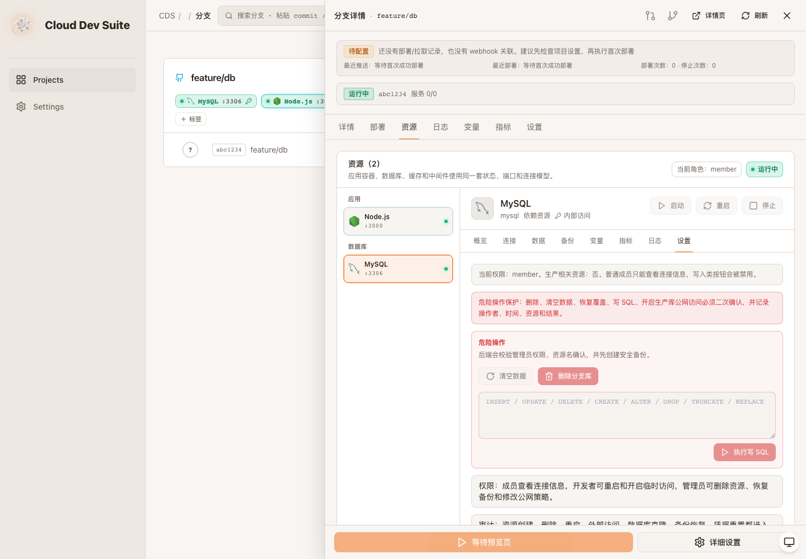
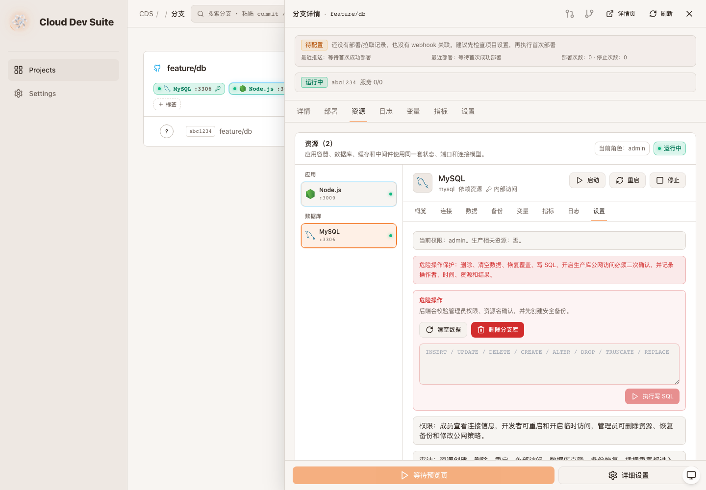

# CDS 资源控制台升级验收 - 角色感知控制

- 项目：prd-agent / Cloud Dev Suite
- 分支：codex/cds-resource-console-upgrade
- 验收时间：2026-06-10 02:10 Asia/Shanghai
- 验收结论：conditional

## 本轮覆盖

- 新增 `GET /api/branches/:id/resources/:resourceId/permissions`，使用后端同一套 `ResourcePermissionAction` 与 member/developer/admin 规则返回权限摘要。
- 资源控制台在选中资源后加载权限摘要，并显示当前角色、生产资源判定。
- 启动/重启/停止、外部访问、重置凭据、注入连接、空库、clone-main、连接已有、手动备份、恢复、新库、清空数据、删除分支库、写 SQL 均按服务端权限摘要禁用。
- member 视图中写入类和危险操作按钮禁用；admin 视图中危险操作按钮可用，写 SQL 在输入 SQL 后可执行。

## 验证证据

- `pnpm --dir cds build`：通过。
- `pnpm --dir cds/web typecheck`：通过。
- `pnpm --dir cds/web build`：通过。
- `git diff --check`：通过。
- Playwright smoke：member/admin 两种权限摘要 mock 下，资源设置页角色显示正确；member 危险操作按钮禁用；admin 清空/删除可用；admin 写 SQL 输入后按钮可用；控制台无错误。

## 需求一一对应表

| 需求 | 本轮证据 | 状态 |
|---|---|---|
| 4 资源详情面板 | 面板 header 显示当前角色，连接/备份/设置 tab 按权限降级 | 完成增强 |
| 11 危险操作保护 | 前端危险操作按钮按服务端权限摘要禁用，后端仍强制校验 | 完成增强 |
| 13 权限控制 | member/developer/admin 权限摘要 API 与前端禁用联动，生产资源判定返回给 UI | 部分完成 |
| 14 审计日志 | 本轮未改审计写入，沿用上一轮危险操作审计能力 | 已有证据 |

截图：

## 仍未完成

- 外部 TCP 端口的真实网络层动态开放和 IP allowlist enforcement 仍需结合现有 proxy/infra 执行器继续核验。
- 指标和 infra 日志仍是占位展示。
- 精确 `/create-visual-test-to-kb` 技能在当前环境不可用，本轮继续使用本地验收报告、Playwright 截图和线上 DocumentStore 归档替代。
