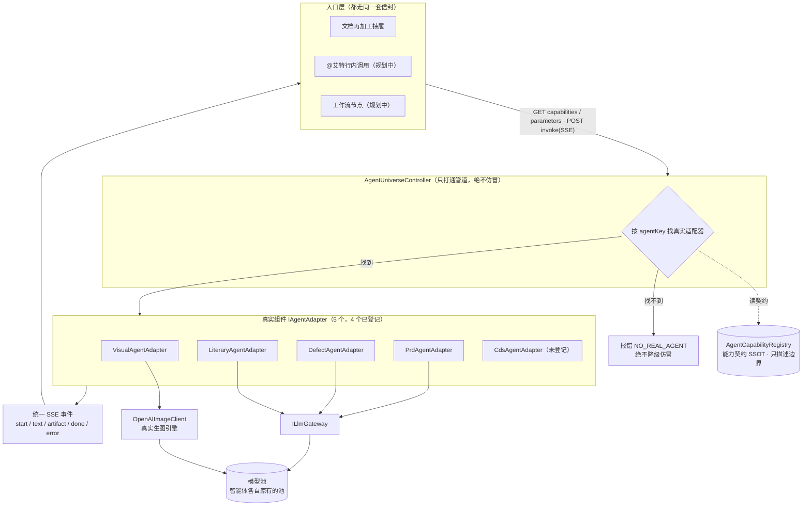

# 智能体宇宙 · 设计

> **版本**：v2.0 | **日期**：2026-06-02 | **状态**：已落地并预览域名实测通过（no-fake 路由 + 真实生图 + 真实参数选择器；4 个智能体已登记，扩展指南见 §5.2）
> **关联实现**：`prd-api/.../Models/AgentUniverse/AgentCapability.cs`、`AgentCapabilityRegistry.cs`、`prd-api/.../Controllers/Api/AgentUniverseController.cs`、`prd-admin/.../services/real/agentUniverse.ts`、`prd-admin/.../pages/document-store/ReprocessChatDrawer.tsx`
> **关联设计**：`.claude/rules/app-identity.md`（应用身份）、`.claude/rules/llm-gateway.md`（网关）、`debt.agent-universe.md`（债务台账）
> **一句话**：把"每个智能体各搞各的调用方式、再加工还把视觉创作降级成假聊天"升级为"一套能力契约 + 一套调用信封，让所有智能体像漫威宇宙那样按统一标准互通"。

---

## 1. 管理摘要

之前"再加工"有三个问题，根因都在"智能体没有契约、调用没有标准"：

1. **选了就发**：在文档对话里选一个智能体，没等用户说话就用默认指令自动发了一轮——用户莫名其妙。
2. **捏造智能体**：选"视觉创作"实际只走了一条通用文本聊天链路，喂一段"你是视觉设计师"的提示词，**根本不生图**，所以出不来画面/架构图，像换了层皮的聊天机器人。
3. **没有统一标准**：每个智能体的"输入是什么、输出是什么、怎么被调用"散落在各处，前端只能把所有东西当聊天处理，智能体之间也无法互相拼装。

本设计立两根支柱解决：

- **能力契约（Capability Contract）**：每个智能体声明四件事——接受什么输入、产出什么输出、以什么模式被调用、前端该渲染什么交互。后端是唯一权威源（SSOT），前端拉取后据此渲染，不再各自硬编码。契约**只描述边界，不携带业务行为**（提示词/模型一概不放）。
- **调用信封（Invocation Envelope）**：所有入口（再加工 / 未来的 @艾特 / 工作流节点）都走同一个 `invoke` 接口，**一律把请求交给该智能体的真实组件（`IAgentAdapter`）去跑业务**，产出统一为带类型的事件（文本 / 图片 / 完成 / 错误）。

> **最高原则：只打通管道，绝不仿冒智能体。** 业务逻辑必须由真实智能体承载，统一信封只做调度；找不到真实组件就明确报错（`NO_REAL_AGENT`），绝不复制一份提示词去假装某个智能体。否则用户一改业务配置，仿冒副本就漂移、产生异常。没有真实组件的能力宁可不暴露。

落地后："选了不再自动发"，"视觉创作真出图、可一键插进文档"，"每个智能体走自己的真实实现，改一处全同步"。

---

## 2. 产品定位：漫威宇宙式互通

把每个智能体想成漫威里的一个英雄：各有各的能力（钢铁侠会飞、奇异博士开传送门），但他们能并肩作战，靠的是**一套共同的世界规则**。本系统的"共同规则"就是能力契约 + 调用信封：

- 任何智能体只要登记了契约，就自动出现在所有支持"宇宙调用"的入口里；
- 任何入口只要会发调用信封、会读统一事件，就能驱动任意智能体；
- 一个智能体的输出（如文学创作产出的插图描述）可以成为另一个智能体的输入（视觉创作据此生图）——这就是"互相调用"的标准接口。

这套标准刻意**不抄竞品的多 Agent 框架**，而是把本系统已经存在的砖块（`IAgentAdapter` 适配器、LLM Gateway、Run/Worker、Artifact）用一层薄契约串起来。

---

## 3. 用户场景

### 场景 A：把文档配图（视觉创作）
用户在知识库打开一篇文档 → 点"再加工" → 选「视觉创作智能体」→ 输入框提示变成"描述你想要的画面" → 用户输入"赛博朋克城市夜景" → 点「生成图片」→ 抽屉里流式显示生成过程并最终展示图片 → 用户点「插入文档」把图片写回正文。

### 场景 B：把文档改写成故事（文学创作）
选「文学创作智能体」→ 提示变成"告诉我怎么改写这篇文档" → 输入"改写成第一人称散文" → 流式输出文本 → 「替换原文 / 追加末尾 / 另存为新文档」。

### 场景 C：从文档提取缺陷（缺陷管理）
选「缺陷管理智能体」→ 按钮变成「提取缺陷」→ 输出结构化的缺陷字段（标题 / 复现步骤 / 严重程度）→ 可写回或另存。

三个场景用的是**同一个抽屉、同一个调用信封**，差异完全由能力契约驱动。

---

## 4. 核心能力

### 4.1 能力契约字段

| 字段 | 含义 | 示例（视觉创作） |
|------|------|------------------|
| `agentKey` | 智能体标识 | `visual-agent` |
| `inputs` | 接受的输入类型 | `[text, image]` |
| `outputs` | 产出的输出类型 | `[image]` |
| `invokeMode` | 调用模式（决定后端路由） | `generation` |
| `interaction` | 交互形态（决定前端渲染） | `prompt-to-image` |
| `defaultAction` | 默认适配器动作 | `text2img` |
| `inputHint` / `actionLabel` | 输入提示 / 按钮文案 | "描述你想要的画面" / "生成图片" |

数据类型枚举：`text / document / image / audio / structured / video`。
调用模式枚举：`chat / generation / structured / transform`。
交互形态枚举：`chat-stream / prompt-to-image / article-to-illustrated / form-submit`。

### 4.2 调用路由（一律走真实适配器，绝不仿冒）

| invokeMode | 输入如何组装 | 后端路由 | 产出 |
|------------|--------------|----------|------|
| `generation` | text 即画面描述（prompt） | 真实 `IAgentAdapter`（`VisualAgentAdapter.text2img`） | 文本进度 + 真实图片 artifact |
| `chat` / `structured` | 用户指令 + 参考文档合成 | 真实 `IAgentAdapter`（literary/defect/prd 的对应 action） | 流式文本（缺陷为结构化）|

> **核心原则：只打通管道，绝不仿冒。** invoke 永远把请求交给该智能体的真实组件（adapter）去跑业务；找不到真实适配器就明确报错（`NO_REAL_AGENT`），**不降级成硬编码提示词的"假聊天"**。这样用户改了某个智能体的业务配置，本面板自动同步（系统里只有一处实现），不会漂移。

### 4.3 智能体清单与接入

**当前已登记（universe-ready，4 个，均有真实 `IAgentAdapter`）**：

| 智能体 | agentKey | 默认动作 | 模式 | 再加工面板 |
|--------|----------|----------|------|-----------|
| 视觉创作 | `visual-agent` | text2img | generation | 卡片可选 |
| 文学创作 | `literary-agent` | write_content | chat | 卡片可选 |
| 缺陷管理 | `defect-agent` | extract_defect | structured | 卡片可选 |
| PRD 解读 | `prd-agent` | analyze_prd | chat | 经 API（无卡片）|

**系统现有 5 个真实 `IAgentAdapter`**：上面 4 个 + `CdsAgentAdapter`（`cds-agent`，CDS 运维类，可按需登记，但不适合"文档再加工"语境）。

**可扩展池（接入成本分档）**：系统共 **9 个 appKey 级智能体**、**23 个百宝箱卡片智能体**。能否加入"宇宙"取决于**是否有真实 `IAgentAdapter`**：

- **零成本**：已有 adapter（如 `cds-agent`）→ 只在 `AgentCapabilityRegistry` 加一条契约即可。
- **一次性成本**：`video` / `report` / `review` / `pr-review` / `project-route` / `pa` / `pm` / 翻译 / 摘要 / 数据分析 等——它们有真实后端服务/Controller，但还没包成 `IAgentAdapter`。需先写一个适配器（**薄封装其真实服务，不是再抄一份提示词**），再登记契约。这是债务台账里待用户排优先级的分叉。

**绝不为了凑数登记没有真实组件的智能体**——宁可不暴露，也不伪装（§1 最高原则）。

---

## 5. 架构

### 5.1 分层架构图



文字版调用链：

```
前端入口 → GET capabilities/parameters（渲染选择器+参数）→ POST invoke(SSE)
   → Controller 按 agentKey 查契约 + 找真实 IAgentAdapter
   → 找到：adapter.StreamExecuteAsync（唯一路径）→ 真实引擎（生图 / 网关）→ 各自原有模型池
   → 找不到：NO_REAL_AGENT（绝不仿冒降级）
   → 统一 SSE 事件回传前端
```

关键点：契约是**唯一**新增的抽象层；适配器、网关、Artifact、模型池全是系统已有的砖块。控制器复用 `ai-toolbox` 应用身份与 `ai-toolbox.use` 权限（符合 `app-identity.md`）。

### 5.2 如何接入一个新智能体（扩展指南）

这是一个**开放平台**，加新智能体永远是同一套两步（无须改前端、无须改入口）：

1. **确保有真实组件**：该智能体必须有一个 `IAgentAdapter` 实现（`AgentKey` + `CanHandle(action)` + `StreamExecuteAsync`）。已有就跳过；没有就写一个**薄封装其真实服务/Controller** 的适配器——核心戒律：封装，不复制提示词。
2. **登记一条契约**：在 `AgentCapabilityRegistry.All` 加一条 `AgentCapability`（agentKey / 名称 / inputs / outputs / invokeMode / interaction / defaultAction / 提示文案）。

登记后自动生效的能力：
- 再加工面板自动出现该智能体（若同时在 `BUILTIN_TOOLS` 有卡片）；
- `capabilities` / `parameters` / `invoke` 三个接口自动支持它；
- 未来的 @艾特、工作流节点等任何"会发信封"的入口自动可驱动它。

可选：若该智能体**有真实可选项**（如视觉的尺寸/模型），在 `AgentParameters` 端点按其**自己原有的池/注册表**返回真实选项（有多个才给选择器，没的选就不给——不造假选项）。

### 5.3 通用/自定义智能体：零步接入（最常用）

百宝箱里**用户自建的通用智能体**（`ToolboxItem`，一条用户可编辑的 systemPrompt + 知识库）是最常用的一类，它们**不需要写适配器、不需要登记契约**——`invoke` 用 `agentKey = "custom:{itemId}"` 直接调用：实时从 `ToolboxItem` 读 systemPrompt（+ 知识库）跑真实网关 chat。

- **systemPrompt 每次实时读库 = 单一数据源**：用户改了智能体配置，下一次调用立即生效，零漂移；这不是仿冒——自定义 chat 智能体的"真实组件"本就是它的 prompt + 网关。
- **新建任意自定义智能体 → 立刻可用**：建好即出现在百宝箱列表 → 自动经同一 `invoke` 信封跑通，**零代码**。这正是统一管道的核心价值。
- 内置智能体仍只走真实适配器（找不到照样 `NO_REAL_AGENT`），与自定义路径并存、互不降级。

**验收（2026-06-02，HTTP + Playwright 双证据）**：API 新建一个自定义智能体 → `invoke custom:{id}` 实时流式产出（systemPrompt 生效）；浏览器登录预览域名 → 知识库 → 文档「再加工」→ 该自定义智能体与内置（视觉/文学/缺陷）并列于选择器（带"我的工具"标）→ 选中并发指令经统一信封跑通。

### 5.4 智能体专属出站动作 + 接力（巧思）

产出不只"写回文档"，每个智能体可声明 `outboundActions[]`——把结果送回它自己的原生系统；选中智能体时前端展示为「智能涌现」提示。

- **缺陷智能体「创建缺陷」**：抽取的结构化缺陷一键建入缺陷库（复用 `POST /api/defect-agent/defects`，标题后端归一）。
- **智能体接力（文学→视觉 配图，E9）**：文学产出旁「为这段配图」→ 前端编排两次 `invoke`：literary `generate_illustration`（构思插画描述）→ visual `text2img`（据描述生图）→ 图片可一键插文档。这是"一个智能体的输出成为另一个智能体的输入"的首个落地（§2 互通愿景）。

其余出站/接力波次（批量缺陷+指派、@艾特、出站预填、工作流节点等）见 `debt.agent-universe.md` §四。

## 6. 接口设计

### GET /api/agent-universe/capabilities
返回 `{ success, data: { capabilities: AgentCapability[] } }`。契约**只含边界字段**（I/O + 调用方式 + 交互），**不含任何提示词/模型**——业务行为全在真实适配器里。

### GET /api/agent-universe/agents/{agentKey}/parameters
返回 `{ success, data: { parameters: AgentParameter[] } }`。按该智能体**自己原有的池/注册表**列出真实可选项（如视觉的尺寸/模型）；只有"确实有多个可选项"时才返回对应参数（没的选就不给，不造假选项）。每个参数：`{ key, label, type, options:[{value,label}], default }`。

### POST /api/agent-universe/invoke （SSE）
请求体：
```json
{ "agentKey": "visual-agent", "text": "赛博朋克城市夜景",
  "documentContent": "可选，chat 模式作为输入上下文",
  "parameters": { "size": "1344x768" }, "history": [], "imageUrls": [] }
```
`parameters` 是面板选择的可选参数（如尺寸/模型），透传给真实适配器的 `Input`。

`agentKey` 取值：内置智能体用其 `agentKey`（如 `visual-agent`，路由到真实适配器）；**自定义百宝箱智能体用 `custom:{itemId}`**（实时读库 systemPrompt 跑真实网关，见 §5.3）。
SSE 事件：
| 事件 | data | 说明 |
|------|------|------|
| `start` | `{agentKey, invokeMode, model?, platform?}` | 开始（含模型可见性，对齐 `ai-model-visibility.md`）|
| `thinking` | `{content}` | 思考过程 |
| `text` | `{content}` | 文本增量 |
| `artifact` | `{kind, url, name, mimeType, content}` | 成果物（图片 url）|
| `done` | `{totalTokens?, ...}` | 完成 |
| `error` | `{message}` | 失败 |

## 7. 关联设计文档

- `.claude/rules/app-identity.md`：应用身份隔离（控制器硬编码 appKey）
- `.claude/rules/llm-gateway.md`：所有 LLM 调用必须过 Gateway
- `.claude/rules/compute-then-send.md`：生图适配器已遵循"先 resolve 后 send"
- `debt.agent-universe.md`：本期未还的工程债（见下）

## 8. 风险与边界

| 风险 | 说明 | 缓解 |
|------|------|------|
| 后端无本地 SDK 验证 | 开发环境无 dotnet | 走 CDS 自动部署编译验证（`cds-first-verification.md`）|
| 生图依赖模型池 | 视觉创作需 ImageGen 模型池可用 | 池不可用时适配器返回 error，前端展示失败 |
| 契约与适配器漂移 | generation 智能体若无对应适配器 | 控制器降级 chat + 告警日志；后续补注册表↔适配器一致性测试（见 debt）|
| 多入口尚未接入 | 当前仅再加工抽屉接入信封 | @艾特 / 工作流节点为后续波次（见 debt）|
