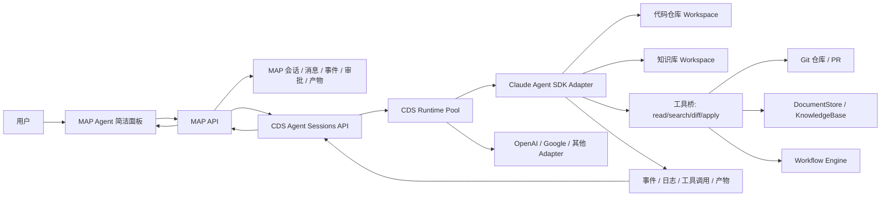
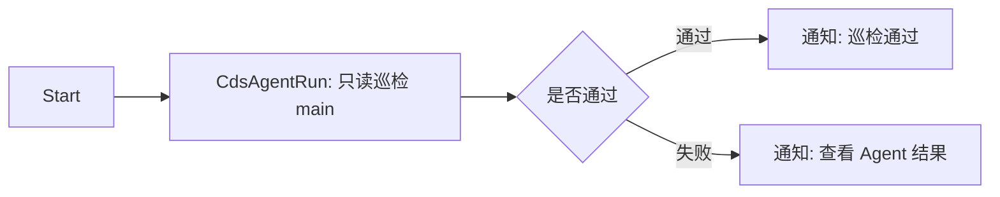
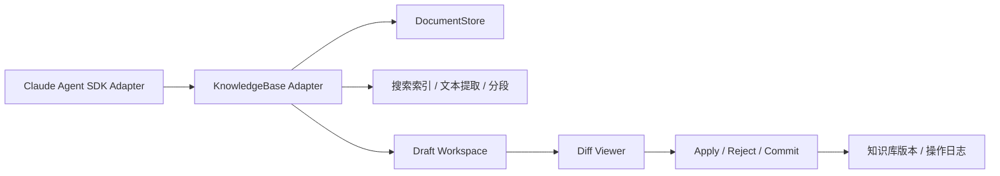

# CDS Agent 商业级架构与路线图

> **版本**：v2026-05-19  
> **状态**：active authority  
> **分支**：`codex/cds-agent-workbench-ui`  
> **读者**：产品、研发、运维、后续接手的 Agent  
> **定位**：这是 CDS Agent 当前唯一权威入口。架构、阶段、验收标准、当前进度、视觉测试和冒烟测试对勾都以本文为准。旧文档继续保留为背景资料和历史记录。

---

## 0. 一句话目标

保留 MAP/CDS 控制面，让 CDS 作为容器、分支、runtime、sandbox 的管理器，接管 Claude SDK Agent 这类智能体运行时；MAP 提供用户入口、会话、审批、可观测性和产物视图；自研 agent loop 收缩为官方 SDK adapter。用户最终应该能用一个简洁页面完成代码巡检、知识库搜索/重写/创建文档、工作流调度，并清楚看到运行状态、超时、日志、差异和验收结果。

---

## 1. 当前状态

| 项 | 结论 |
| --- | --- |
| 主架构 | MAP 只连 CDS；CDS 管理 runtime/container/sandbox；Claude Agent SDK 是 CDS-managed runtime |
| 当前已验收 | 官方 SDK 只读代码巡检闭环通过；默认 hardened-readonly profile 不暴露 Bash/Edit/Write |
| 当前证据 | one-cycle `commercialComplete=true`，7/7 gates pass，10 passed / 1 legacy skip / 0 failed，总耗时 161s |
| 当前分支 | `codex/cds-agent-workbench-ui` 已同步 `origin/main`，当前分支领先 main，未阻塞短期开发 |
| 当前最高优先级 | 简洁模式 Agent 面板可用：少点击、强可观测、可停止、可超时、可看差异和产物 |
| 当前不是主线 | SSH、remote host env、sidecar image registry 都只能作为 operator/debug fallback，不能作为普通用户路径 |
| 当前风险 | 只读巡检可用；写文件、知识库改写、PR、工作流审批还需要明确 writable profile、审批和差异应用机制 |

---

## 2. 产品原则

1. **用户入口要简单**：普通用户只看到任务输入框、目标选择、运行按钮、停止按钮、进度和结果。高级 runtime/profile/adapter 信息放到诊断抽屉。
2. **可观测性默认打开**：每一次运行必须有 `traceId`、`sessionId`、`cdsSessionId`、模型 profile、runtime、当前阶段、耗时、超时点、事件序号和产物。
3. **超时和停止必须可信**：UI 超时、MAP API 超时、CDS session 超时、SDK run interrupt、容器清理是同一条链路，不允许只在页面显示“已停止”但后台继续消耗。
4. **写操作必须可审查**：写代码、写知识库、创建文档、删除内容、批量改写都必须走 draft/diff/apply 或审批。
5. **官方能力优先**：Agent loop、上下文和模型工具调用优先使用官方 SDK；本系统只保留控制面、策略、审计、运行时调度、事件归一化和产品 UI。
6. **CDS 是 runtime 管理器**：CDS 可以管理 Claude SDK、未来 OpenAI Agents SDK、Google ADK 或其他运行时，但所有 adapter 必须先通过同一套事件、审批、取消、workspace、artifact 验收。

---

## 3. 能力边界

| 能力 | 当前可用 | 一期目标 | 二期目标 | 三期目标 |
| --- | --- | --- | --- | --- |
| 代码只读巡检 | 已通过 | 简洁面板一键运行 | 多仓库模板化巡检 | 组织级巡检和审计报表 |
| 写代码/PR | legacy 证明过可行，默认不开放 | 只在 writable profile 下开放 diff draft | PR 创建、测试、回滚链路 | 多分支并发和策略化修复 |
| Agent 简洁面板 | 基础页面已有，但信息不够聚焦 | 首页即任务台，3 步内跑起来 | 结果对比、复跑、模板 | 团队仪表盘和成本治理 |
| 可观测性 | 事件和 smoke 证据已存在 | 统一 timeline、logs、timeout、artifact | trace bundle 导出和回放 | 跨运行时 tracing 和成本归因 |
| 超时/停止 | S3 stop 已通过 | UI/CDS/SDK/容器统一状态 | 自动重试、故障分类 | SLA、队列和资源治理 |
| 工作流调度 | 通用工作流引擎已有 | 增加 `CdsAgentRun` 最小节点 | 审批暂停/恢复、artifact 传递 | 多 Agent DAG 和定时巡检 |
| 知识库搜索 | 文档空间基础搜索已有 | Agent 可读 DocumentStore/KnowledgeBase | diff 改写、创建文档、提交版本 | 类 Git 分支、回滚、知识库 PR |
| 多运行时 adapter | Claude Agent SDK 可用 | Claude SDK adapter 稳定产品化 | OpenAI/Google 等进入兼容矩阵 | 多厂商策略路由 |

---

## 4. 总体架构



### 4.1 控制面职责

| 层 | 负责什么 | 不负责什么 |
| --- | --- | --- |
| MAP UI | 用户交互、简洁模式、运行状态、审批、差异、产物、回放入口 | 不直接管理容器，不直接跑 SDK |
| MAP API | 会话、消息、事件镜像、审批策略、模型配置、工作流调用入口 | 不拥有 runtime pool |
| CDS | runtime/container/sandbox 管理、分支和 workspace 准备、运行时健康、cancel/cleanup | 不承担最终产品 UI |
| SDK adapter | 把官方 SDK 的 run/events/tools/cancel 映射到 CDS/MAP 事件合同 | 不自研 agent loop |
| KnowledgeBase adapter | 把文档空间封装成类 Git workspace，提供 read/search/diff/draft/apply | 不绕过审批直接批量改写 |

### 4.2 官方 SDK adapter 边界

| 能力 | 来源 | 处理原则 |
| --- | --- | --- |
| Agent turn loop | 官方 Claude Agent SDK | 默认使用官方，不继续扩展 legacy loop |
| 上下文与工具调用 | 官方 SDK | 通过 adapter 归一化事件 |
| 内置危险工具 | 官方 SDK 可能支持 | 默认禁用 Bash/Edit/Write，writable profile 才能打开 |
| 运行时调度 | CDS 自研控制面 | 必须保留 |
| 审批、审计、产物 | MAP/CDS 自研控制面 | 必须保留 |
| 知识库读写 | 本系统能力 | 封装成工具给 adapter 使用 |

---

## 5. 简洁模式 Agent 面板

### 5.1 目标体验

用户打开页面后，只需要完成：

1. 选择目标：`代码仓库`、`知识库`、`工作流`。
2. 输入任务：例如“审查 main 分支最近改动”或“搜索知识库里所有周报模板并重写一版”。
3. 点击运行，看到状态、日志、差异、结果和是否超时。

### 5.2 页面结构

```text
顶部：目标选择 + profile 简名 + 运行/停止 + 状态 pill
主体左侧：任务输入框 + 常用模板 + 最近运行
主体中间：执行 timeline + 当前步骤 + event stream
主体右侧：结果 / 差异 / 产物 / 诊断抽屉
底部：traceId、耗时、timeoutAt、工具统计、token/cost 预留位
```

### 5.3 必须显示的可观测字段

| 字段 | 用途 |
| --- | --- |
| `traceId` | 全链路排障 |
| `sessionId` / `cdsSessionId` | MAP/CDS 双侧定位 |
| `runtimeProfile` | 只读、可写、知识库、工作流等能力边界 |
| `provider` / `model` | 用户知道当前用的模型和供应商 |
| `workspaceRoot` / `targetRef` | 知道实际审查或改写的目标 |
| `status` | queued、running、waiting_approval、completed、failed、timed_out、stopped |
| `elapsedSeconds` / `timeoutAt` | 直接判断是否卡住 |
| `lastEventSeq` | 判断事件流是否断开 |
| `toolCounts` | Read/Search/Diff/Write/Approval 等工具统计 |
| `artifactCount` / `diffCount` | 结果是否产生可操作产物 |

### 5.4 超时机制

| 层 | 默认建议 | 行为 |
| --- | --- | --- |
| UI idle timeout | 30s 无新事件提示 | 页面提示“运行中但暂无新事件”，不直接杀任务 |
| MAP request timeout | 10s 内返回 accepted | 长任务必须异步化，不能卡 HTTP request |
| CDS session timeout | 15min 默认，可配置 | 超时触发 SDK interrupt 和 runtime cleanup |
| SDK turn timeout | 8-12min 默认 | 中断本次模型 run |
| Container hard TTL | 30-60min | 防泄漏清理 |
| Workflow node timeout | 节点级配置 | 超时进入 failed/timed_out 分支 |

---

## 6. 工作流最小调度

现有工作流引擎已经有 HTTP、延时、条件、格式转换、通知等胶囊节点。CDS Agent 一期只需要新增一个最小节点，不要一次性重做工作流系统。

### 6.1 新节点：`CdsAgentRun`

| 输入 | 说明 |
| --- | --- |
| `task` | 用户任务文本 |
| `targetType` | `repo`、`knowledgeBase`、`document` |
| `targetRef` | 仓库分支、知识库空间、文档 id 等 |
| `profileMode` | `readonly`、`writable`、`kb-readonly`、`kb-writable` |
| `timeoutSeconds` | 节点超时 |
| `approvalPolicy` | `none`、`manual`、`auto-readonly` |

| 输出 | 说明 |
| --- | --- |
| `status` | completed、failed、timed_out、waiting_approval |
| `sessionId` / `traceId` | 可点击跳转 Agent 面板 |
| `finalText` | 智能体最终回答 |
| `artifacts` | 报告、截图、日志、diff bundle |
| `diffSummary` | 改动摘要 |
| `eventsCursor` | 后续节点或页面继续读取事件 |

### 6.2 最简单调度流程



最小验收不是“功能很多”，而是：

1. 工作流能启动一个 CDS Agent session。
2. 节点状态能从 `queued -> running -> completed/failed/timed_out`。
3. 工作流页面能跳回 Agent 面板看完整事件和产物。
4. 超时能终止节点并传递失败状态。

---

## 7. 知识库接入

本系统的 DocumentStore/KnowledgeBase 是很重要的资产，不应该只被当成普通附件搜索。CDS Agent 需要把它当作类 Git workspace 来操作。

### 7.1 知识库 Workspace 模型



### 7.2 工具集

| 工具 | 只读默认开放 | writable 开放 | 说明 |
| --- | --- | --- | --- |
| `kb_list` | 是 | 是 | 列出知识库空间、目录、文档 |
| `kb_search` | 是 | 是 | 标题、摘要、全文、语义搜索预留 |
| `kb_read` | 是 | 是 | 读取文档内容和元数据 |
| `kb_diff` | 是 | 是 | 对草稿和原文做 diff |
| `kb_write_draft` | 否 | 是 | 只写草稿，不直接覆盖原文 |
| `kb_create_doc` | 否 | 是 | 创建新文档草稿 |
| `kb_rewrite_doc` | 否 | 是 | 改写已有文档草稿 |
| `kb_apply` | 否 | 审批后 | 应用差异到知识库 |
| `kb_commit` | 否 | 审批后 | 生成版本记录或知识库 commit |

### 7.3 像 Cursor 操作本地文件一样

目标交互：

1. 左侧看到知识库空间、目录和文档树。
2. 中间是 Agent 对话和执行 timeline。
3. 右侧是文档内容、草稿、diff、apply/reject。
4. 每次改写都生成 draft，不直接覆盖。
5. 工作流运行时能看到节点执行状态、当前文档、diff 数量和审批状态。

### 7.4 数据类型边界

| 类型 | 一期处理 |
| --- | --- |
| Markdown / 文本 / PRD | 直接读写和 diff |
| PDF / Word / 网页订阅 | 读取提取文本和元数据，改写输出为新文档草稿 |
| 图片 / 音视频 | 一期只读元数据、OCR/转写结果；不直接编辑原二进制 |
| 表格 | 一期按提取文本或结构化摘要处理；精细单元格写入放二期以后 |

---

## 8. 分期路线

### Phase 0：已完成基线

| Gate | 状态 | 证据 |
| --- | --- | --- |
| 官方 SDK adapter 边界 | done | A0 pass |
| CDS-managed runtime | done | R0 pass |
| provider-backed 只读运行 | done | S1 pass |
| 默认危险工具收口 | done | S2 pass |
| stop/cancel | done | S3 pass |
| 视觉验收 | done | V1 pass |
| 文档验收报告 | done | `doc/report.cds-agent-acceptance-visual-2026-05-19.pdf` |

### Phase 1：商业级最小可用，预计 5-7 个工作日

目标：让用户能稳定使用简洁面板完成代码只读巡检和知识库只读搜索，并能从工作流里调度一次 Agent。

| 编号 | 任务 | 预计 | 验收 |
| --- | --- | --- | --- |
| P1-1 | 简洁模式 Agent 面板信息架构 | 0.5d | 页面首屏只保留目标、任务、运行、停止、状态、结果 |
| P1-2 | timeline + event stream + diagnostic drawer | 1d | 能看到 traceId、状态、耗时、timeoutAt、lastEventSeq |
| P1-3 | 超时和停止状态统一 | 1d | UI/MAP/CDS/SDK 状态一致，超时有明确原因 |
| P1-4 | `CdsAgentRun` 工作流最小节点 | 1-1.5d | Start -> Agent -> Notify 最小调度可用 |
| P1-5 | KnowledgeBase 只读工具 | 1d | `kb_list/search/read` 可被 Agent 调用并显示引用来源 |
| P1-6 | 冒烟 + 视觉测试 + 使用指南 | 0.5-1d | smoke、截图、最小使用文档齐全 |

### Phase 2：可写协作，预计 1-2 周

目标：让 Agent 能对知识库和代码生成 draft/diff，并通过人工审批 apply。

| 编号 | 任务 | 验收 |
| --- | --- | --- |
| P2-1 | 可写协作安全边界设计 | 写入边界、审批点、回滚路径、工具白名单和验收 smoke 写入本文档 |
| P2-2 | 知识库 draft workspace | 改写只落草稿，不直接覆盖 |
| P2-3 | 知识库 diff/apply/reject | 页面可看差异并应用或拒绝 |
| P2-4 | 工作流 waiting_approval/pause/resume | 工作流能等人工审批后继续 |
| P2-5 | writable profile 策略 | 写工具只在明确 profile 和审批下开放 |
| P2-6 | artifact bundle 导出 | 一次运行可导出报告、事件、diff、截图 |

#### Phase 2 有限计划

Phase 2 的第一原则是 `diff-first`：Agent 不能直接覆盖知识库或代码，所有写入先变成 draft/diff，再由 MAP 审批和 apply。CDS 继续负责容器、分支、runtime；MAP 继续负责用户、权限、审批、事件、产物、审计和 UI。官方 SDK 继续负责 agent loop、工具调用和上下文，本仓库只补 adapter bridge 和 MAP 业务边界。

| 小节点 | 预计 | 交付物 | 验收方式 |
| --- | --- | --- | --- |
| P2-1 安全边界设计 | 0.5d | 本文档新增可写工具矩阵、审批策略、失败回滚、smoke 列表 | 文档 review + `git diff --check` |
| P2-2 KB draft workspace | 1-1.5d | `kb_draft_create/read/list/discard`；只新增草稿，不改原文 | 后端单测 + smoke：创建草稿后原 entry 不变 |
| P2-3 KB diff/apply/reject | 1-2d | draft diff、apply、reject、审计事件 | 单测 + UI 冒烟：能看 diff、拒绝、应用 |
| P2-4 工作流审批暂停 | 1-1.5d | workflow `waiting_approval`、pause/resume、审批结果回传 | 工作流单测 + smoke：Start -> Agent -> Approval -> Notify |
| P2-5 代码写入 profile | 1-2d | writable profile、工具白名单、危险工具 MAP approval | provider-gated smoke：写小文件、跑限定测试、生成 diff |
| P2-6 Phase 2 验收包 | 0.5-1d | Markdown/PDF 验收报告、视觉截图、使用指南 | smoke、单测、构建、视觉证据全部回写 §14 |

当同一小节点连续修正超过 3 次仍不通过时，必须暂停继续堆补丁，回到本节重新判断是否是架构边界、数据模型或验收口径错误。

#### Phase 2 可写工具矩阵

| 工具族 | Phase 1 状态 | Phase 2 目标 | 默认暴露 | 审批 |
| --- | --- | --- | --- | --- |
| `kb_list/search/read` | 已完成，只读 | 继续只读 | 是 | 不需要 |
| `kb_draft_*` | 已完成 | 创建、读取、列出、丢弃草稿 | 否，仅 writable 任务 | 创建可自动，discard 需要用户态权限 |
| `kb_diff` | 已完成 | 对比原文和草稿 | 是，只读可见 | 不需要写审批 |
| `kb_apply` | 已完成 | 将草稿应用到知识库 entry | 否 | 必须 MAP approval |
| `kb_reject` | 已完成 | 拒绝草稿，不修改正式知识库 | 否 | 需要 draft owner 权限 |
| `repo_write_file` | 已存在危险工具 | 仅 writable profile 可用 | 否 | 必须 MAP approval |
| `repo_run_command` | 已存在命令工具 | 限定测试/检查命令 | 否 | 非只读命令必须 MAP approval |
| `repo_create_pull_request` | 已存在危险工具 | 明确 PR profile 后开放 | 否 | 必须 MAP approval |

#### Phase 2 验收红线

- 不允许出现绕过 `InfraAgentSessionId` / 用户权限的 KB 写入。
- 不允许 `kb_apply` 在没有 MAP approval 事件时执行。
- 不允许默认只读 profile 暴露写工具。
- 不允许工作流 HTTP 请求长时间阻塞等待人工审批；必须事件化并可恢复。
- 不允许把 CDS runtime/host 配置变成普通用户路径。
- 不允许只靠远端部署验证；本地 smoke、单测和视觉证据必须先过。

#### P2-1 可实现契约

P2-1 只定义契约，不写业务代码。P2-2 开始实现时必须按这里落地，除非先回到本文档修正。

KnowledgeBase draft 数据模型建议新增独立集合 `knowledge_base_drafts`，不复用 `document_entries` 原表状态，避免草稿污染正式知识库：

| 字段 | 含义 | 规则 |
| --- | --- | --- |
| `id` | draft id | Guid/N 格式 |
| `sessionId` | InfraAgentSession id | 必填，用于追踪 Agent 运行来源 |
| `storeId` | 知识库空间 | 必填，创建时校验 owner/public；apply 时必须 owner |
| `entryId` | 原知识库 entry | 必填，draft 基于一个现有 entry |
| `baseDocumentId` | 原正文文档 id | 可空，文本类 entry 必填 |
| `baseContentHash` | 原内容 hash | 必填，用于 apply 前乐观并发校验 |
| `baseUpdatedAt` | 原 entry 更新时间 | 必填，用于发现原文已变更 |
| `titleDraft` | 草稿标题 | 可选 |
| `contentDraft` | 草稿正文 | 必填，草稿只存新内容，不覆盖原文 |
| `status` | `draft/applied/rejected/discarded` | 默认 `draft` |
| `createdBy` | 用户 id | 来自 session.UserId |
| `applyApprovalId` | MAP approval id | apply 成功时必填 |
| `createdAt/updatedAt/appliedAt` | 时间 | 审计字段 |

工具契约按两个阶段开放：

| 阶段 | 工具 | 作用 | 写入类型 | 审批 |
| --- | --- | --- | --- | --- |
| P2-2 | `kb_draft_create` | 基于 entry 创建草稿 | 只写 draft 集合 | 不需要 MAP 写审批，但需要 session 用户权限 |
| P2-2 | `kb_draft_read` | 读取草稿 | 只读 | 不需要 |
| P2-2 | `kb_draft_list` | 列出当前 session 或 entry 的草稿 | 只读 | 不需要 |
| P2-2 | `kb_draft_discard` | 丢弃草稿 | 只改 draft 状态 | 需要 draft owner 权限，不需要 MAP 写审批 |
| P2-3 | `kb_diff` | 对比原文和草稿 | 只读 | 不需要 |
| P2-3 | `kb_apply` | 将草稿应用到正式 entry | 写正式知识库 | 必须 MAP approval |
| P2-3 | `kb_reject` | 拒绝草稿 | 只改 draft 状态 | 需要 draft owner 权限，不需要 MAP 写审批 |

MAP approval 事件结构沿用现有 `/api/agent-tools/approvals/...`，但 `kb_apply` 必须写入可审计字段：

```json
{
  "approvalId": "kb-apply-<draftId>-<seq>",
  "toolName": "kb_apply",
  "risk": "write",
  "status": "waiting",
  "source": "map-tool-approval",
  "argsSummary": {
    "storeId": "<storeId>",
    "entryId": "<entryId>",
    "draftId": "<draftId>",
    "baseContentHash": "<hash>",
    "diffStat": { "added": 0, "removed": 0 }
  }
}
```

`kb_apply` 回滚和并发规则：

- apply 前重新读取 entry/doc，校验 `baseContentHash` 和 `baseUpdatedAt`；不一致则返回 `kb_apply_conflict`，不写正式库。
- apply 过程必须单向：先校验、再写正式文档、再更新 entry 索引、最后把 draft 标为 `applied`；任何一步失败，draft 保持 `draft` 或标为 `apply_failed`，不得删除。
- apply 成功事件必须包含 `draftId`、`entryId`、`approvalId`、`previousHash`、`newHash`。
- 回滚不在 P2-3 自动执行；P2-3 只保证有 previous hash 和 draft 内容可人工恢复。自动 rollback 放 Phase 3。

Phase 2 smoke 清单：

| 脚本 | 覆盖 |
| --- | --- |
| `scripts/smoke-cds-agent-kb-draft-workspace.sh` | 创建草稿、读取草稿、列出草稿、丢弃草稿；确认原 entry 不变 |
| `scripts/smoke-cds-agent-kb-diff-apply.sh` | diff/apply/reject 已注册；`kb_apply` 必须 MAP approval；只读 runtime 不暴露 apply/reject；简洁面板能展示 `unifiedDiff` |
| `scripts/smoke-cds-agent-workflow-approval.sh` | 工作流进入 `waiting_approval`，审批后 resume 到 Notify |
| `scripts/smoke-cds-agent-writable-profile.sh` | 默认只读 profile 不暴露写工具；writable profile 才暴露写工具 |

### Phase 3：规模化商业能力，预计 2-4 周起

目标：让 CDS Agent 成为团队级持续巡检、知识治理和自动化执行平台。

| 编号 | 任务 | 验收 |
| --- | --- | --- |
| P3-1 | 多运行时 adapter matrix | OpenAI/Google/其他 Agent 通过同一套 gate 后可路由 |
| P3-2 | 成本、token、SLA 面板 | 团队能看花费、失败率、超时率 |
| P3-3 | 定时巡检和批量知识治理 | Cron 工作流能稳定跑并产出报告 |
| P3-4 | 回放和复现 | 任意运行可从 trace bundle 复盘 |
| P3-5 | 权限和组织治理 | 仓库、知识库、profile、审批策略按团队隔离 |

---

## 9. 商业级验收门

| Gate | 名称 | 通过标准 |
| --- | --- | --- |
| G1 | 简洁可用 | 新用户 3 步内启动一次只读巡检 |
| G2 | 可观测 | 页面显示 trace、状态、事件、耗时、超时、产物 |
| G3 | 可停止 | stop 后 CDS/SDK/runtime 状态一致，不继续后台消耗 |
| G4 | 可超时 | 超时有事件、有状态、有原因、有清理 |
| G5 | 工作流可调度 | 一个最小工作流能启动 Agent 并拿到结果 |
| G6 | 知识库只读可用 | Agent 能搜索和读取知识库内容并引用来源 |
| G7 | 差异安全 | 任何写操作先生成 draft/diff，再审批 apply |
| G8 | 视觉验收 | 本地或远端截图证明首屏信息无错位、无遮挡、状态可读 |
| G9 | 冒烟验收 | smoke 可复跑，关键证据路径写入报告 |

---

## 10. 需要避免的旧坑

| 旧坑 | 新规则 |
| --- | --- |
| 把 sidecar runtime 混进业务分支列表 | shared runtime 是 CDS 系统能力，不是业务 branch service |
| 把 remote host/env/image 变成用户路径 | 只能作为 operator/debug fallback |
| 把 DeepSeek/cc-switch 误判为必须 Anthropic 原生认证 | Claude SDK 可以走 Anthropic-compatible upstream，原生 Anthropic 不是唯一主路径 |
| 页面只显示很多技术标签，用户看不懂进度 | 简洁模式只显示用户任务、状态、耗时、结果；诊断信息进抽屉 |
| 长任务卡住 HTTP request | MAP 请求只负责 accepted，长任务必须异步事件化 |
| 写操作直接落库 | 写操作必须 draft/diff/apply |
| 每次都靠部署验证 | 本地 smoke、单测、视觉测试先过，只有关键门才部署 |

---

## 11. 下一轮最小开发计划

当前不需要再调整总架构。下一轮只进入 Phase 1，按以下顺序执行：

| 顺序 | 任务 | 预计 | 是否需要用户 |
| --- | --- | --- | --- |
| 1 | 盘点现有 Agent 页面组件和事件 API | 0.5h | 不需要 |
| 2 | 做简洁模式页面信息架构和状态字段 | 1.5-2h | 不需要 |
| 3 | 接入 timeline、timeout、stop 统一展示 | 2-3h | 不需要 |
| 4 | 做本地视觉测试和 smoke | 1-1.5h | 不需要 |
| 5 | 设计并实现 `CdsAgentRun` 最小 workflow node | 0.5-1.5d | 不需要，除非现有 workflow API 缺关键扩展点 |
| 6 | 接入 KnowledgeBase 只读工具 | 1d | 不需要，除非知识库权限数据缺失 |

如果某个任务同一问题反复修正超过 3 次，必须暂停写代码，先在本文件追加“根因复盘”，再决定是否换实现路径。

---

## 12. 用户何时可以开始使用

| 使用场景 | 现在能否使用 | 说明 |
| --- | --- | --- |
| 只读代码巡检 | 可以试用 | 当前 hardened-readonly 闭环已通过，但面板还需要简洁化 |
| 让 Agent 改代码并提 PR | 不建议作为默认 | 需要 writable profile、审批、diff/PR gate |
| 工作流调度一次只读巡检 | Phase 1 后可用 | 需要 `CdsAgentRun` 节点 |
| 知识库搜索/读取 | Phase 1 后可用 | 需要 KB readonly tools 接到 Agent |
| 知识库重写/创建文档 | Phase 2 后可用 | 需要 draft/diff/apply |

---

## 13. 文档关系

| 文档 | 角色 |
| --- | --- |
| 本文 | 唯一权威入口，回答目标、架构、阶段、验收、进度和测试对勾 |
| `doc/status.cds-agent-current-progress.md` | 兼容旧链接的跳转页，不再维护独立进度 |
| `doc/plan.cds-agent-workbench.md` | 历史主战场，保留大量上下文 |
| `doc/design.cds-agent-runtime-architecture.md` | 旧 runtime 架构说明，后续应按本文校准 |
| `doc/guide.workflow-agent.md` | 通用工作流使用指南，后续补 `CdsAgentRun` 章节 |
| `doc/design.document-store.md` | 文档空间已实现基础能力 |
| `doc/design.multi-doc-knowledge.md` | 多文档知识库背景设计 |

---

## 14. 进度与验收 Checklist

这一节是当前唯一进度面板。看法如下：

- `[x]` 表示已经完成并有证据。
- `[ ]` 表示未完成或尚未验收。
- 阶段只看目标和验收标准；小节点只放在当前阶段。
- 视觉测试、冒烟测试、PDF/截图证据统一放在“测试对勾”里。

### 14.1 阶段总览

| 阶段 | 状态 | 阶段目标 | 可验收标准 |
| --- | --- | --- | --- |
| [x] Phase 0 基线闭环 | 完成 | 证明 CDS-managed Claude Agent SDK 只读任务能跑、能停、默认安全 | one-cycle pass；S1/S2/S3/V1 pass；危险工具默认不暴露 |
| [x] Phase 1 商业级最小可用 | 本地验收完成 | 用户能用简洁面板跑只读代码巡检、知识库只读搜索，并能从工作流调度一次 Agent | 3 步内启动；可观测字段齐全；stop/timeout 可见；`CdsAgentRun` 最小工作流通过；KB search/read 通过；Phase 1 验收包已生成 |
| [ ] Phase 2 可写协作 | 进行中，3/6 | Agent 能生成代码/知识库 draft/diff，并通过人工审批 apply | 写操作不直落库；diff 可审查；workflow 可暂停/恢复；artifact bundle 可导出 |
| [ ] Phase 3 规模化商业能力 | 未开始 | 团队级巡检、知识治理、多运行时和成本治理 | 多 adapter gate；定时巡检；SLA/成本面板；trace bundle 可回放 |

### 14.2 Phase 0 测试对勾

| 对勾 | 类型 | 验收项 | 证据 |
| --- | --- | --- | --- |
| [x] | 冒烟 | provider-backed one-cycle 通过 | `/tmp/cds-agent-cycle-hardened-current/cycle-summary.json`：`commercialComplete=true`，7/7 gates pass，10 pass / 1 legacy skip / 0 failed |
| [x] | 冒烟 | S1 只读仓库巡检通过 | `/tmp/cds-agent-s1-provider-hardened.json`：assistantMessages=1，dangerousApprovals=0，dangerousBuiltinTools=0 |
| [x] | 冒烟 | S2/S3 危险工具收口和 stop 通过 | `/tmp/cds-agent-controls-hardened.json`：hardened-readonly，dangerousApprovals=0，dangerousBuiltinTools=0，stopStatus=`stopped` |
| [x] | 视觉 | 远端工作台页面可达并截图验收 | `/tmp/cds-agent-workbench-visual.png`、`/tmp/cds-agent-cycle-hardened-current/workbench-visual.png` |
| [x] | 报告 | 视觉验收 PDF 已生成 | `doc/report.cds-agent-acceptance-visual-2026-05-19.pdf` |
| [x] | 单测 | Claude SDK sidecar 测试通过 | `pytest claude-sdk-sidecar/tests`：47/47 pass |
| [x] | 单测 | CDS runtime/profile 路由测试通过 | `npm --prefix cds test -- --run tests/routes/remote-hosts-instances.test.ts`：8/8 pass |
| [x] | 单测 | MAP session transport 测试通过 | `dotnet test ... --filter InfraAgentSessionServiceRuntimeAdapterTests --no-restore`：12/12 pass |
| [x] | 构建 | CDS build 通过 | `npm --prefix cds run build` pass |
| [x] | 文档 | 架构与进度合并为单一权威入口 | 本文档；`doc/status.cds-agent-current-progress.md` 降级为跳转页 |

### 14.3 Phase 1 当前进度

| 对勾 | 小节点 | 最终目标 | 验收标准 | 证据 |
| --- | --- | --- | --- | --- |
| [x] | P1-1 简洁模式 Agent 面板 | 首屏只保留目标、任务、运行、停止、状态、结果 | 用户不用理解 runtime/profile 细节也能启动只读巡检 | `prd-admin/src/pages/cds-agent/CdsAgentPage.tsx`：三步区 `1. 目标 / 2. 任务 / 3. 运行`；`/tmp/cds-agent-simple-panel-desktop.png` |
| [x] | P1-2 可观测 timeline | 一眼看到任务在哪一步、是否卡住、是否超时 | 页面显示 `traceId`、状态、耗时、`timeoutAt`、`lastEventSeq`、产物数量 | `scripts/smoke-cds-agent-simple-panel.sh` pass；`/tmp/cds-agent-simple-panel-mobile-quickrun.png` |
| [x] | P1-3 stop/timeout 统一 | 停止和超时不只是 UI 文案，而是 MAP/CDS/SDK/runtime 状态一致 | stop/timeout 状态在简洁面板可见；stop 继续复用现有 CDS/SDK cancel 链路 | `pnpm --prefix prd-admin tsc` pass；`pnpm --prefix prd-admin test -- src/pages/cds-agent/__tests__/cdsAgentReadiness.test.ts` pass |
| [x] | P1-4 `CdsAgentRun` 工作流节点 | 工作流能调度一次最简单的 Agent 任务 | Start -> Agent -> Notify 可跑通；节点能跳回 Agent 面板看结果 | `scripts/smoke-cds-agent-workflow-node.sh` pass；`dotnet test prd-api/tests/PrdAgent.Api.Tests/PrdAgent.Api.Tests.csproj --filter "FullyQualifiedName~WorkflowAgentTests\|FullyQualifiedName~CapsuleExecutorCdsAgentEventCursorTests"`：58/58 pass；`pnpm --prefix prd-admin tsc` pass；`pnpm --prefix prd-admin build` pass；视觉截图 `/tmp/cds-agent-workflow-p1-4-template-modal.png` |
| [x] | P1-5 KnowledgeBase 只读工具 | Agent 能搜索和读取知识库内容 | `kb_list/search/read` 可用；回答里能显示引用来源 | `prd-api/src/PrdAgent.Infrastructure/Services/AgentTools/Tools/KnowledgeBaseReadonlyTools.cs`；`scripts/smoke-cds-agent-kb-readonly-tools.sh` pass；`dotnet test prd-api/tests/PrdAgent.Api.Tests/PrdAgent.Api.Tests.csproj --filter "FullyQualifiedName~AgentToolsTests"`：8/8 pass |
| [x] | P1-6 Phase 1 验收包 | 本地先验收，再决定是否部署 | 冒烟、视觉截图、最小使用指南齐全 | `doc/report.cds-agent-phase1-acceptance-2026-05-19.md`；`doc/report.cds-agent-phase1-acceptance-2026-05-19.pdf`；smoke 三件套 pass；后端相关测试 72/72 pass；`pnpm --prefix prd-admin tsc` pass；前端单测 281/281 pass；`pnpm --prefix prd-admin build` pass；截图 `/tmp/cds-agent-simple-panel-desktop.png`、`/tmp/cds-agent-simple-panel-mobile-quickrun.png`、`/tmp/cds-agent-workflow-p1-4-template-modal.png` |

### 14.4 Phase 2 当前进度

| 对勾 | 小节点 | 最终目标 | 验收标准 | 证据 |
| --- | --- | --- | --- | --- |
| [x] | P2-1 可写协作安全边界设计 | 开写工具前先锁住 diff-first、安全审批和回滚边界 | 本文档包含可写工具矩阵、审批策略、失败回滚、smoke 列表；`git diff --check` pass | 本文 §8 `Phase 2 有限计划` / `P2-1 可实现契约`；`git diff --check` pass |
| [x] | P2-2 KnowledgeBase draft workspace | Agent 改写只落草稿，不覆盖原文 | `kb_draft_create/read/list/discard` 可用；原 entry 不变；草稿可丢弃 | `prd-api/src/PrdAgent.Core/Models/KnowledgeBaseDraft.cs`；`prd-api/src/PrdAgent.Infrastructure/Services/AgentTools/Tools/KnowledgeBaseDraftTools.cs`；`scripts/smoke-cds-agent-kb-draft-workspace.sh` pass；`scripts/smoke-cds-agent-simple-panel.sh` pass；`scripts/smoke-cds-agent-workflow-node.sh` pass；后端相关测试 22/22 pass；`pnpm --prefix prd-admin tsc` pass；前端单测 281/281 pass；`pnpm --prefix prd-admin build` pass |
| [x] | P2-3 KnowledgeBase diff/apply/reject | 用户可审查差异后应用或拒绝 | 页面可看 diff；`kb_apply` 必须有 MAP approval；reject 不改原文 | `kb_diff/apply/reject` 已注册；`kb_apply` 风险为 `write` 且必须带 MAP approval；apply 前校验 `baseContentHash/baseUpdatedAt`；`kb_reject` 只改草稿状态；只读 runtime 只暴露 `kb_diff` 不暴露 `kb_apply/kb_reject`；简洁面板可展示 `unifiedDiff` 为 `知识库 diff` 产物；`scripts/smoke-cds-agent-kb-diff-apply.sh` pass；`scripts/smoke-cds-agent-kb-draft-workspace.sh` pass；`scripts/smoke-cds-agent-simple-panel.sh` pass；后端相关测试 25/25 pass；`pnpm --prefix prd-admin tsc` pass；前端单测 281/281 pass；`pnpm --prefix prd-admin build` pass；`git diff --check` pass |
| [ ] | P2-4 工作流审批暂停/恢复 | 工作流遇到写入审批能暂停并继续 | `waiting_approval`、pause/resume、审批事件和运行详情可见 | 下一步 |
| [ ] | P2-5 代码 writable profile | 代码写入只在明确 profile 和审批下开放 | 默认只读 profile 不暴露写工具；writable profile 可写小文件、跑限定测试、生成 diff | 等待 P2-4 |
| [ ] | P2-6 Phase 2 验收包 | Phase 2 本地先验收，再决定是否部署 | smoke、单测、构建、视觉截图、Markdown/PDF 报告齐全 | 等待 P2-5 |

### 14.5 当前对话完成项

| 对勾 | 事项 | 结果 |
| --- | --- | --- |
| [x] | 确认单一权威文档策略 | 本文成为架构、进度、checklist、测试证据唯一入口 |
| [x] | 阶段按完成打勾 | `14.1 阶段总览` 已用 `[x]` / `[ ]` 表达 |
| [x] | 小节点放到底部 | `14.3 Phase 1 当前进度` 只列当前阶段小节点 |
| [x] | 视觉测试和冒烟测试对勾 | `14.2 Phase 0 测试对勾` 已集中列出证据 |
| [x] | 减少细碎步骤 | 阶段区只写最终目标和验收标准，不展开所有实现步骤 |
| [x] | 完成短期 P1-1/P1-2/P1-3 | 简洁面板已有 3 步运行区、可观测卡片、stop/timeout 状态和本地视觉/冒烟证据 |
| [x] | 完成 P1-4 工作流最小调度 | 已新增 `CDS Agent 只读代码巡检` 模板；后端 `cds-agent` 胶囊支持创建/复用 session，返回 `sessionId/traceId/status/finalText/artifacts/eventsCursor` 运行句柄；执行详情可从 `cds-agent-run` 产物跳回 `/cds-agent?sessionId=...` |
| [x] | 完成 P1-5 KnowledgeBase 只读工具 | 已注册 `kb_list`、`kb_search`、`kb_read`；工具从 `InfraAgentSessionId` 反查 session 用户，只允许读取自有或公开知识库；未注册任何 KB 写入工具 |
| [x] | 完成 P1-6 Phase 1 本地验收包 | 已生成 Markdown/PDF 验收报告；smoke、单测、构建、视觉截图路径已归档 |
| [x] | 完成 P2-1 可写协作安全边界设计 | 本文新增 Phase 2 有限计划、可写工具矩阵、验收红线、draft 数据模型、审批事件结构、回滚策略和 smoke 清单；当前不直接写可写工具 |
| [x] | 完成 P2-2 KnowledgeBase draft workspace | 新增独立 `knowledge_base_drafts` 草稿集合和 `kb_draft_create/read/list/discard` 工具；只写草稿集合，不覆盖正式知识库；简洁面板默认工具策略改为 `readonly-auto`，只读 runtime 不暴露 draft/write 工具 |
| [x] | 完成 P2-3 KnowledgeBase diff/apply/reject | 新增 `kb_diff`、`kb_apply`、`kb_reject`；diff 为只读工具并可在简洁面板形成 `知识库 diff` 产物；`kb_apply` 被 MAP 分类为 `write`，无 `approvalId` 或原文 hash/更新时间冲突时拒绝写正式知识库；`kb_reject` 只拒绝草稿，不改原文 |

### 14.6 下一次开发入口

Phase 2 已完成 P2-1/P2-2/P2-3。下一次开发入口是 `P2-4 工作流审批暂停/恢复`：让工作流在遇到 `kb_apply` 这类写入工具时进入 `waiting_approval`，把审批请求、`sessionId/traceId`、diff 产物和 resume 入口显示在工作流执行详情里；审批通过后继续到 Notify，拒绝或超时则走 failed/timed_out 分支。预计 1-1.5 个工作日，优先本地单测和 smoke，不做远端部署，除非需要验证真实工作流页面视觉证据。
