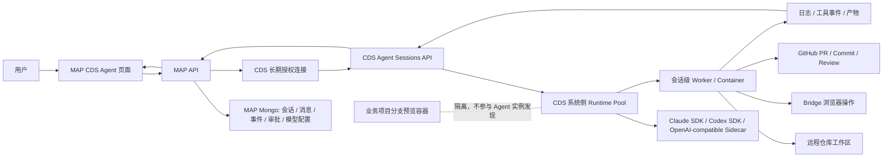
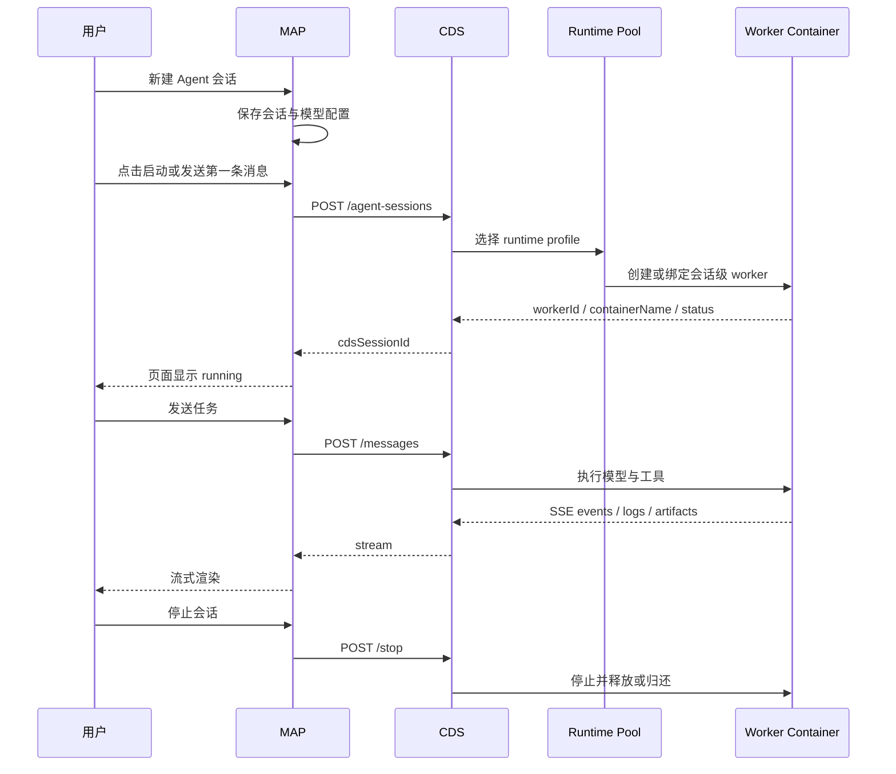

# CDS Agent 运行时架构 · 设计说明

| 字段 | 内容 |
|---|---|
| 版本 | v2026-05-15 |
| 状态 | active |
| 读者 | 想理解 CDS Agent 为什么这样设计、哪里已完成、哪里还欠账的人 |
| 关联 | `doc/report.cds-agent-workbench-2026-05-15.md`、`doc/guide.cds-agent-workbench-reproduce.md`、`doc/guide.cds-agent-next-agent-testing.md`、`doc/spec.cds-map-pairing-protocol.md` |

---

## 1. 先说人话

CDS Agent 不是“在 MAP 里直接跑一个本地 Claude Code”。它是：

1. MAP 负责用户体验：模型配置、会话、对话、审批、事件、日志、产物、PR 结果。
2. CDS 负责远程执行：授权、运行时入口、容器/worker 生命周期、日志、可释放资源。
3. shared sidecar pool 是 CDS 系统级能力，不属于任何业务项目分支。
4. 每次 Agent 会话应该随启随用：启动时创建或绑定一个 runtime worker，停止时释放或归还。

所以你的理解是对的：面向最终用户时，它应该像“远程使用 Claude Code / Codex”，而不是像“打开一个 CDS 分支预览项目”。

---

## 2. 四个容易混的东西

| 名称 | 属于谁 | 生命周期 | 是否应该出现在分支列表 | 用途 |
|---|---|---|---|---|
| MAP 会话 | MAP | 用户创建，长期保存记录 | 否 | 对话、审批、事件、产物、恢复 |
| CDS shared-service Project | CDS 系统侧 | 授权时创建，长期存在 | 否 | 承载 sidecar pool / runtime pool 的系统项目 |
| shared sidecar pool | CDS 系统侧 | 长期运行，按主机部署 | 否 | 提供 Claude SDK / Codex SDK / OpenAI-compatible 调度入口 |
| Agent runtime worker | CDS 系统侧 | 会话启动时创建或绑定，结束时释放 | 否 | 真正替用户跑任务、执行工具、产生日志 |
| 业务项目分支容器 | CDS 项目侧 | 分支预览按需启动 | 是 | `main`、`feature/*` 等网页/API 预览 |

这次你指出的 bug 是：shared-service 的实例发现和项目入口曾经混入了“业务项目分支容器”的展示路径，导致 sidecar pool 看起来像有 `main` 分支。这是不对的。

---

## 3. 目标架构图

关键边界：

- MAP 不应该关心 CDS 具体在哪台机器跑容器，只关心“会话是否 running、事件是否流回来、工具是否等审批”。
- CDS shared-service 不应该伪装成普通项目分支，它是系统能力。
- 分支预览容器服务于用户访问网页/API；Agent runtime 服务于远程执行任务。两者可以访问同一个仓库，但不是同一种资源。

---

## 4. 当前已经做到哪里

| 能力 | 当前状态 | 说明 |
|---|---|---|
| 系统级 CDS 授权 | 已完成 | 一次授权后生成长期 token，10 分钟只属于 pairing token，不属于 long token |
| MAP Agent 页面 | 已完成 | 支持会话、模型配置、事件、工具、日志、产物、远程浏览器入口 |
| OpenAI-compatible 模型 | 已完成 | 可以配置 baseUrl / model / API key |
| Claude SDK runtime | 已跑通 | A10 用真实模型完成了仓库巡检并创建 PR |
| 工具审批 | 已完成基础链路 | 危险工具可进入审批事件，结果可追踪 |
| 远程浏览器 Bridge | 已完成基础链路 | 可以通过 CDS 预览页面操作远程浏览器 |
| 自巡检 PR | 已完成一次 | PR #617 证明“远程 Agent 能读仓库、跑测试、提交 PR” |
| shared-service 与分支隔离 | 已修正一处 | 实例发现不再给 shared-service 混入分支服务；项目卡片不再跳分支列表 |

---

## 5. 刚修的 bug

### 现象

用户在 CDS 里看到 Claude SDK sidecar pool 像普通项目一样显示 `main` 分支或分支容器。

### 根因

`GET /api/projects/:id/instances` 对所有项目都做了两类聚合：

1. `ServiceDeployment`：系统级 shared-service 部署记录。
2. `BranchEntry.services`：业务项目分支里的运行服务。

这对普通项目还能解释为“显示这个项目的运行实例”，但对 `kind='shared-service'` 就错了。shared-service 不应该把分支服务拼进实例发现结果。

### 修正

1. `shared-service` 项目的 instance discovery 只返回系统级 `ServiceDeployment`。
2. `shared-service` 项目的项目统计不再汇总 branch preview，所以不会继续显示 `br=1 run=1` 这类分支语义。
3. CDS 项目列表里 shared-service 项目不再跳到 `/branches/:projectId`，而是跳到 `/cds-settings#remote-hosts`。

### 为什么这是正确方向

sidecar pool 是系统能力，不是业务项目分支。用户点击它时应该看到“远程主机、系统部署、运行实例、健康状态”，而不是看到 `main`、`feature/*` 这类应用预览分支。

---

## 6. 我原本的理解和现在的修正

我原本为了快速打通 MAP ↔ CDS，复用了 CDS 已经成熟的 Project 抽象，给 MAP 授权时自动创建了一个 `kind='shared-service'` 项目。这个选择让授权、实例发现、token 绑定、权限检查能很快落地。

问题是：Project 这个词在 CDS 老系统里默认等于“有 git 分支的应用项目”。当 shared-service 也叫 Project 时，UI 和聚合接口很容易把它塞回分支世界里。

现在应该把它明确拆开：

- 短期：继续复用 Project 存储，但凡是 `kind='shared-service'`，UI 和 API 都走系统服务语义。
- 中期：抽出 `RuntimePool` / `SystemService` 概念，不再让 sidecar pool 出现在项目列表主线里。
- 长期：CDS Agent session 直接绑定 runtime pool，不要求每个 MAP 连接都暴露一个看起来像应用项目的实体。

---

## 7. 动态容器应该长什么样

理想链路：

现在的实现还处于“能用的 MVP + 若干真实链路已经打通”阶段：A10 已证明远程执行与 PR 闭环可行，但 runtime worker 的资源隔离、长期清理、队列调度、成本展示还要继续补。

---

## 8. 已知问题清单

| 问题 | 影响 | 当前处理 | 后续动作 |
|---|---|---|---|
| shared-service 项目被 UI 当成普通分支项目 | 用户误以为 sidecar pool 有 `main` 分支 | 已修正项目入口、项目统计和实例发现混入问题 | 继续把 shared-service 从普通项目导航中拆出去 |
| runtime worker 还没有完整资源池模型 | 用户看不到“创建容器 / 复用容器 / 清理容器”的真实状态 | 页面展示 workerId / containerName / resource policy | 增加 Runtime Pool 页面和会话级容器状态 |
| sidecar 长期应该是 CDS 系统能力 | 若侵入业务项目 profile，会污染每个项目配置 | 当前已把 shared-service 作为系统项目 | 中期抽象为 SystemService，不再叫业务 Project |
| 长命令 callback 还不够完整 | 远程命令长时间运行时可观测性不足 | A10 已能看到工具事件和日志 | 补命令级 stdout/stderr 增量事件与取消 |
| PR #617 仍需后续收口 | 自巡检成果还没有进入主线 | 已记录 PR 链接和测试结果 | 下一个 Agent 应把 PR 从巡检产物转成可合并闭环 |
| 成本与 token 用量不够透明 | 用户不知道一次 Agent 任务花了多少 | 当前记录 model/baseUrl/runtime | 增加成本面板和模型调用账单事件 |
| 自动验收回放不足 | 现在验收依赖人工和截图 | 已有复现指南 | 建立可重放 E2E 脚本和视觉证据归档 |

---

## 9. 我希望你一眼看懂的判断规则

看到一个东西时，先问三个问题：

1. 它是不是用户业务项目的一条 git 分支？
   - 是：它属于 CDS 分支预览。
   - 否：继续看下一条。
2. 它是不是为了给所有 MAP Agent 提供执行能力？
   - 是：它属于 CDS 系统级 runtime / sidecar pool。
   - 否：继续看下一条。
3. 它是不是某一次对话启动后才出现，结束后应该释放？
   - 是：它属于 Agent session worker。
   - 否：它可能是配置、授权、日志、产物或历史记录。

这三条能把大部分混乱切开。

---

## 10. 接下来应该主动做什么

1. 把 CDS UI 的 shared-service 从“项目分支页”里彻底拆出去，单独做“系统服务 / Runtime Pool”视图。
2. 在 MAP CDS Agent 页面顶部加一张轻量拓扑卡：MAP 会话 → CDS runtime → worker → 工具 → PR。
3. 给每个会话补“容器生命周期时间线”：创建、启动、接收任务、工具审批、停止、清理。
4. 给文档和页面都标明“长期授权”和“一次性 pairing token”的区别，避免再以为只有 10 分钟。
5. 把已知问题固定成页面内可见的“限制与下一步”，不要只藏在计划文档里。
