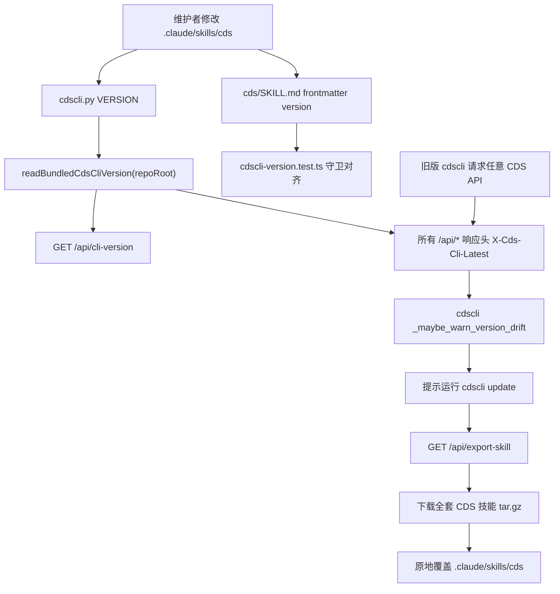

# CDS 技能版本与更新架构

## 目标

让 CDS 技能只有一个可判断的版本来源，让旧版 `cdscli` 能在日常 API 调用中发现自己落后，并把升级路径固定为 `cdscli update`。

## 当前架构



## 版本来源

- 权威源：`.claude/skills/cds/cli/cdscli.py` 的 `VERSION`。
- 展示源：`.claude/skills/cds/SKILL.md` frontmatter 的 `version`，必须与 `VERSION` 一致。
- 服务端读取：`cds/src/services/cdscli-version.ts`。
- 防漂移守卫：`cds/tests/services/cdscli-version.test.ts`。

## 更新路径

优先路径：

```bash
cdscli version
cdscli update
cdscli version
```

兜底路径：

1. 从 CDS Dashboard 下载技能包，或请求 `/api/export-skill`。
2. 覆盖项目内 `.claude/skills/`。
3. 保留 `~/.cdsrc`，无需重新初始化。

## 与 findmapskills 的边界

`findmapskills` 负责 PrdAgent 海鲜市场技能的搜索、上传、下载和订阅。CDS 技能默认不进入官方海鲜市场目录，因为它绑定 CDS 服务端、`cdscli` 和当前基础设施流程。

如果用户把 CDS 技能作为社区技能上传，`findmapskills` 可以搜到社区条目；官方 CDS 技能仍以 CDS Dashboard 和 `/api/export-skill` 作为主分发路径。
