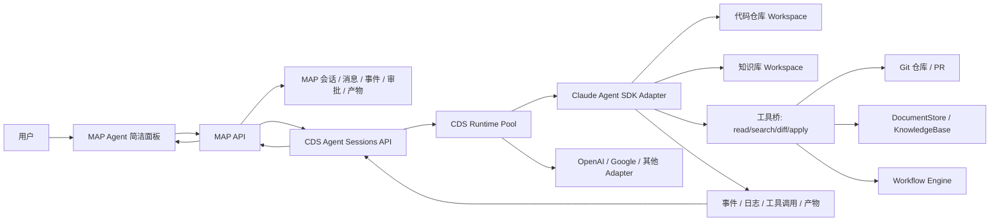
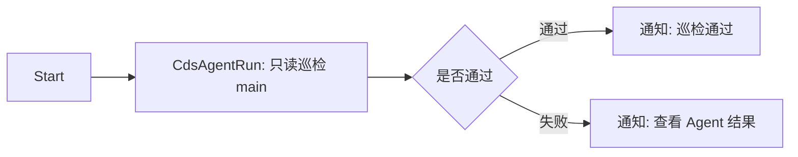
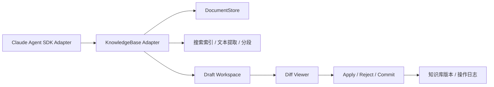

# CDS Agent 商业级架构与路线图

> **版本**：v2026-05-21
> **状态**：active authority  
> **分支**：`codex/cds-agent-workbench-ui`  
> **读者**：产品、研发、运维、后续接手的 Agent  
> **定位**：这是 CDS Agent 当前唯一权威入口。架构、阶段、验收标准、当前进度、视觉测试和冒烟测试对勾都以本文为准。旧文档继续保留为背景资料和历史记录。

---

## 0. 一句话目标

保留 MAP/CDS 控制面，让 CDS 作为容器、分支、runtime、sandbox 的管理器，接管 Claude SDK Agent 这类智能体运行时；MAP 提供用户入口、会话、审批、可观测性和产物视图；自研 agent loop 收缩为官方 SDK adapter。用户最终应该能用一个简洁页面完成代码巡检、知识库搜索/重写/创建文档、工作流调度，并清楚看到运行状态、超时、日志、差异和验收结果。

---

## 1. 当前状态

| 项 | 结论 |
| --- | --- |
| 主架构 | MAP 只连 CDS；CDS 管理 runtime/container/sandbox；Claude Agent SDK 是 CDS-managed runtime |
| 当前已验收 | 官方 SDK 只读代码巡检闭环通过；默认 hardened-readonly profile 不暴露 Bash/Edit/Write |
| 当前证据 | P4-29 远端 commercial smoke 已通过：`/cds-agent` preview HTTP 206、无旧 bundle；session hygiene `staleRunning=0`；真实 provider-backed S1 只读 run pass（assistant messages=1）；S2/S3 controls pass（S3 stop=`stopped`）；V1 真实结果视觉 pass；N6 边界 pass；one-cycle `commercialComplete=true`；workflow `CDS Agent` 舱远端真实执行 completed 且 run handle stop=`stopped`；summary `/Users/inernoro/project/prd_agent/artifacts/cds-agent/2026-05-22/p4-25-commercial-smoke-20260522185119/summary.json` |
| 当前分支 | 远端 preview 运行在 `prd-agent-main`，branch/runtime commit `b65440338`（包含 P4-29 提交 `6d3eae267`），previewSlug=`main-prd-agent`；本地工作区仍有若干用户/其它任务未提交改动，P4-29 只触碰 CDS Agent/工作流/smoke/本文档相关文件 |
| 当前最高优先级 | P4-29 已完成，下一阶段应进入 P4-30：把同一套 commercial smoke 纳入部署后自动验收/告警，补齐 deploy 结果的 `daemonRestarted/webOnly/elapsedSeconds` 明确记录，减少 CDS 控制面 502/超时导致的人工确认成本 |
| 当前不是主线 | SSH、remote host env、sidecar image registry 都只能作为 operator/debug fallback，不能作为普通用户路径 |
| 当前风险 | 本轮 smoke 已证明 `/messages` 502 阻塞解除，但 CDS 控制面在部署确认阶段仍出现 `/api/branches` 超时和 Cloudflare 502；deploy 证据中 `daemonRestarted/webOnly/elapsedSeconds` 仍为 null。写文件、知识库改写、PR 仍必须走 writable profile、审批和差异应用机制，不进入默认路径 |

---

## 2. 产品原则

1. **用户入口要简单**：普通用户只看到任务输入框、目标选择、运行按钮、停止按钮、进度和结果。高级 runtime/profile/adapter 信息放到诊断抽屉。
2. **可观测性默认打开**：每一次运行必须有 `traceId`、`sessionId`、`cdsSessionId`、模型 profile、runtime、当前阶段、耗时、超时点、事件序号和产物。
3. **超时和停止必须可信**：UI 超时、MAP API 超时、CDS session 超时、SDK run interrupt、容器清理是同一条链路，不允许只在页面显示“已停止”但后台继续消耗。
4. **写操作必须可审查**：写代码、写知识库、创建文档、删除内容、批量改写都必须走 draft/diff/apply 或审批。
5. **官方能力优先**：Agent loop、上下文和模型工具调用优先使用官方 SDK；本系统只保留控制面、策略、审计、运行时调度、事件归一化和产品 UI。
6. **CDS 是 runtime 管理器**：CDS 可以管理 Claude SDK、未来 OpenAI Agents SDK、Google ADK 或其他运行时，但所有 adapter 必须先通过同一套事件、审批、取消、workspace、artifact 验收。

---

## 3. 能力边界

| 能力 | 当前可用 | 一期目标 | 二期目标 | 三期目标 |
| --- | --- | --- | --- | --- |
| 代码只读巡检 | 已通过 | 简洁面板一键运行 | 多仓库模板化巡检 | 组织级巡检和审计报表 |
| 写代码/PR | legacy 证明过可行，默认不开放 | 只在 writable profile 下开放 diff draft | PR 创建、测试、回滚链路 | 多分支并发和策略化修复 |
| Agent 简洁面板 | 基础页面已有，但信息不够聚焦 | 首页即任务台，3 步内跑起来 | 结果对比、复跑、模板 | 团队仪表盘和成本治理 |
| 可观测性 | 事件和 smoke 证据已存在 | 统一 timeline、logs、timeout、artifact | trace bundle 导出和回放 | 跨运行时 tracing 和成本归因 |
| 超时/停止 | S3 stop 已通过 | UI/CDS/SDK/容器统一状态 | 自动重试、故障分类 | SLA、队列和资源治理 |
| 工作流调度 | 通用工作流引擎已有 | 增加 `CdsAgentRun` 最小节点 | 审批暂停/恢复、artifact 传递 | 多 Agent DAG 和定时巡检 |
| 知识库搜索 | 文档空间基础搜索已有 | Agent 可读 DocumentStore/KnowledgeBase | diff 改写、创建文档、提交版本 | 类 Git 分支、回滚、知识库 PR |
| 多运行时 adapter | Claude Agent SDK 可用 | Claude SDK adapter 稳定产品化 | OpenAI/Google 等进入兼容矩阵 | 多厂商策略路由 |

---

## 4. 总体架构



### 4.1 控制面职责

| 层 | 负责什么 | 不负责什么 |
| --- | --- | --- |
| MAP UI | 用户交互、简洁模式、运行状态、审批、差异、产物、回放入口 | 不直接管理容器，不直接跑 SDK |
| MAP API | 会话、消息、事件镜像、审批策略、模型配置、工作流调用入口 | 不拥有 runtime pool |
| CDS | runtime/container/sandbox 管理、分支和 workspace 准备、运行时健康、cancel/cleanup | 不承担最终产品 UI |
| SDK adapter | 把官方 SDK 的 run/events/tools/cancel 映射到 CDS/MAP 事件合同 | 不自研 agent loop |
| KnowledgeBase adapter | 把文档空间封装成类 Git workspace，提供 read/search/diff/draft/apply | 不绕过审批直接批量改写 |

### 4.2 官方 SDK adapter 边界

| 能力 | 来源 | 处理原则 |
| --- | --- | --- |
| Agent turn loop | 官方 Claude Agent SDK | 默认使用官方，不继续扩展 legacy loop |
| 上下文与工具调用 | 官方 SDK | 通过 adapter 归一化事件 |
| 内置危险工具 | 官方 SDK 可能支持 | 默认禁用 Bash/Edit/Write，writable profile 才能打开 |
| 运行时调度 | CDS 自研控制面 | 必须保留 |
| 审批、审计、产物 | MAP/CDS 自研控制面 | 必须保留 |
| 知识库读写 | 本系统能力 | 封装成工具给 adapter 使用 |

---

## 5. 简洁模式 Agent 面板

### 5.1 目标体验

用户打开页面后，只需要完成：

1. 选择目标：`代码仓库`、`知识库`、`工作流`。
2. 输入任务：例如“审查 main 分支最近改动”或“搜索知识库里所有周报模板并重写一版”。
3. 点击运行，看到状态、日志、差异、结果和是否超时。

### 5.2 页面结构

```text
顶部：目标选择 + profile 简名 + 运行/停止 + 状态 pill
主体左侧：任务输入框 + 常用模板 + 最近运行
主体中间：执行 timeline + 当前步骤 + event stream
主体右侧：结果 / 差异 / 产物 / 诊断抽屉
底部：traceId、耗时、timeoutAt、工具统计、token/cost 预留位
```

### 5.3 必须显示的可观测字段

| 字段 | 用途 |
| --- | --- |
| `traceId` | 全链路排障 |
| `sessionId` / `cdsSessionId` | MAP/CDS 双侧定位 |
| `runtimeProfile` | 只读、可写、知识库、工作流等能力边界 |
| `provider` / `model` | 用户知道当前用的模型和供应商 |
| `workspaceRoot` / `targetRef` | 知道实际审查或改写的目标 |
| `status` | queued、running、waiting_approval、completed、failed、timed_out、stopped |
| `elapsedSeconds` / `timeoutAt` | 直接判断是否卡住 |
| `lastEventSeq` | 判断事件流是否断开 |
| `toolCounts` | Read/Search/Diff/Write/Approval 等工具统计 |
| `artifactCount` / `diffCount` | 结果是否产生可操作产物 |

### 5.4 超时机制

| 层 | 默认建议 | 行为 |
| --- | --- | --- |
| UI idle timeout | 30s 无新事件提示 | 页面提示“运行中但暂无新事件”，不直接杀任务 |
| MAP request timeout | 10s 内返回 accepted | 长任务必须异步化，不能卡 HTTP request |
| CDS session timeout | 15min 默认，可配置 | 超时触发 SDK interrupt 和 runtime cleanup |
| SDK turn timeout | 8-12min 默认 | 中断本次模型 run |
| Container hard TTL | 30-60min | 防泄漏清理 |
| Workflow node timeout | 节点级配置 | 超时进入 failed/timed_out 分支 |

---

## 6. 工作流最小调度

现有工作流引擎已经有 HTTP、延时、条件、格式转换、通知等胶囊节点。CDS Agent 一期只需要新增一个最小节点，不要一次性重做工作流系统。

### 6.1 新节点：`CdsAgentRun`

| 输入 | 说明 |
| --- | --- |
| `task` | 用户任务文本 |
| `targetType` | `repo`、`knowledgeBase`、`document` |
| `targetRef` | 仓库分支、知识库空间、文档 id 等 |
| `profileMode` | `readonly`、`writable`、`kb-readonly`、`kb-writable` |
| `timeoutSeconds` | 节点超时 |
| `approvalPolicy` | `none`、`manual`、`auto-readonly` |

| 输出 | 说明 |
| --- | --- |
| `status` | completed、failed、timed_out、waiting_approval |
| `sessionId` / `traceId` | 可点击跳转 Agent 面板 |
| `finalText` | 智能体最终回答 |
| `artifacts` | 报告、截图、日志、diff bundle |
| `diffSummary` | 改动摘要 |
| `eventsCursor` | 后续节点或页面继续读取事件 |

### 6.2 最简单调度流程



最小验收不是“功能很多”，而是：

1. 工作流能启动一个 CDS Agent session。
2. 节点状态能从 `queued -> running -> completed/failed/timed_out`。
3. 工作流页面能跳回 Agent 面板看完整事件和产物。
4. 超时能终止节点并传递失败状态。

---

## 7. 知识库接入

本系统的 DocumentStore/KnowledgeBase 是很重要的资产，不应该只被当成普通附件搜索。CDS Agent 需要把它当作类 Git workspace 来操作。

### 7.1 知识库 Workspace 模型



### 7.2 工具集

| 工具 | 只读默认开放 | writable 开放 | 说明 |
| --- | --- | --- | --- |
| `kb_list` | 是 | 是 | 列出知识库空间、目录、文档 |
| `kb_search` | 是 | 是 | 标题、摘要、全文、语义搜索预留 |
| `kb_read` | 是 | 是 | 读取文档内容和元数据 |
| `kb_diff` | 是 | 是 | 对草稿和原文做 diff |
| `kb_write_draft` | 否 | 是 | 只写草稿，不直接覆盖原文 |
| `kb_create_doc` | 否 | 是 | 创建新文档草稿 |
| `kb_rewrite_doc` | 否 | 是 | 改写已有文档草稿 |
| `kb_apply` | 否 | 审批后 | 应用差异到知识库 |
| `kb_commit` | 否 | 审批后 | 生成版本记录或知识库 commit |

### 7.3 像 Cursor 操作本地文件一样

目标交互：

1. 左侧看到知识库空间、目录和文档树。
2. 中间是 Agent 对话和执行 timeline。
3. 右侧是文档内容、草稿、diff、apply/reject。
4. 每次改写都生成 draft，不直接覆盖。
5. 工作流运行时能看到节点执行状态、当前文档、diff 数量和审批状态。

### 7.4 数据类型边界

| 类型 | 一期处理 |
| --- | --- |
| Markdown / 文本 / PRD | 直接读写和 diff |
| PDF / Word / 网页订阅 | 读取提取文本和元数据，改写输出为新文档草稿 |
| 图片 / 音视频 | 一期只读元数据、OCR/转写结果；不直接编辑原二进制 |
| 表格 | 一期按提取文本或结构化摘要处理；精细单元格写入放二期以后 |

---

## 8. 分期路线

### Phase 0：已完成基线

| Gate | 状态 | 证据 |
| --- | --- | --- |
| 官方 SDK adapter 边界 | done | A0 pass |
| CDS-managed runtime | done | R0 pass |
| provider-backed 只读运行 | done | S1 pass |
| 默认危险工具收口 | done | S2 pass |
| stop/cancel | done | S3 pass |
| 视觉验收 | done | V1 pass |
| 文档验收报告 | done | `doc/report.cds-agent-acceptance-visual-2026-05-19.pdf` |

### Phase 1：商业级最小可用，预计 5-7 个工作日

目标：让用户能稳定使用简洁面板完成代码只读巡检和知识库只读搜索，并能从工作流里调度一次 Agent。

| 编号 | 任务 | 预计 | 验收 |
| --- | --- | --- | --- |
| P1-1 | 简洁模式 Agent 面板信息架构 | 0.5d | 页面首屏只保留目标、任务、运行、停止、状态、结果 |
| P1-2 | timeline + event stream + diagnostic drawer | 1d | 能看到 traceId、状态、耗时、timeoutAt、lastEventSeq |
| P1-3 | 超时和停止状态统一 | 1d | UI/MAP/CDS/SDK 状态一致，超时有明确原因 |
| P1-4 | `CdsAgentRun` 工作流最小节点 | 1-1.5d | Start -> Agent -> Notify 最小调度可用 |
| P1-5 | KnowledgeBase 只读工具 | 1d | `kb_list/search/read` 可被 Agent 调用并显示引用来源 |
| P1-6 | 冒烟 + 视觉测试 + 使用指南 | 0.5-1d | smoke、截图、最小使用文档齐全 |

### Phase 2：可写协作，预计 1-2 周

目标：让 Agent 能对知识库和代码生成 draft/diff，并通过人工审批 apply。

| 编号 | 任务 | 验收 |
| --- | --- | --- |
| P2-1 | 可写协作安全边界设计 | 写入边界、审批点、回滚路径、工具白名单和验收 smoke 写入本文档 |
| P2-2 | 知识库 draft workspace | 改写只落草稿，不直接覆盖 |
| P2-3 | 知识库 diff/apply/reject | 页面可看差异并应用或拒绝 |
| P2-4 | 工作流 waiting_approval/pause/resume | 工作流能等人工审批后继续 |
| P2-5 | writable profile 策略 | 写工具只在明确 profile 和审批下开放 |
| P2-6 | Phase 2 验收包 | Markdown/PDF 报告、视觉截图、smoke、单测、构建证据可复盘 |

#### Phase 2 有限计划

Phase 2 的第一原则是 `diff-first`：Agent 不能直接覆盖知识库或代码，所有写入先变成 draft/diff，再由 MAP 审批和 apply。CDS 继续负责容器、分支、runtime；MAP 继续负责用户、权限、审批、事件、产物、审计和 UI。官方 SDK 继续负责 agent loop、工具调用和上下文，本仓库只补 adapter bridge 和 MAP 业务边界。

| 小节点 | 预计 | 交付物 | 验收方式 |
| --- | --- | --- | --- |
| P2-1 安全边界设计 | 0.5d | 本文档新增可写工具矩阵、审批策略、失败回滚、smoke 列表 | 文档 review + `git diff --check` |
| P2-2 KB draft workspace | 1-1.5d | `kb_draft_create/read/list/discard`；只新增草稿，不改原文 | 后端单测 + smoke：创建草稿后原 entry 不变 |
| P2-3 KB diff/apply/reject | 1-2d | draft diff、apply、reject、审计事件 | 单测 + UI 冒烟：能看 diff、拒绝、应用 |
| P2-4 工作流审批暂停 | 1-1.5d | workflow `waiting_approval`、pause/resume、审批结果回传 | 工作流单测 + smoke：Start -> Agent -> Approval -> Notify |
| P2-5 代码写入 profile | 1-2d | writable profile、工具白名单、危险工具 MAP approval | provider-gated smoke：写小文件、跑限定测试、生成 diff |
| P2-6 Phase 2 验收包 | 0.5-1d | Markdown/PDF 验收报告、视觉截图、使用指南 | smoke、单测、构建、视觉证据全部回写 §14 |

当同一小节点连续修正超过 3 次仍不通过时，必须暂停继续堆补丁，回到本节重新判断是否是架构边界、数据模型或验收口径错误。

#### Phase 2 可写工具矩阵

| 工具族 | Phase 1 状态 | Phase 2 目标 | 默认暴露 | 审批 |
| --- | --- | --- | --- | --- |
| `kb_list/search/read` | 已完成，只读 | 继续只读 | 是 | 不需要 |
| `kb_draft_*` | 已完成 | 创建、读取、列出、丢弃草稿 | 否，仅 writable 任务 | 创建可自动，discard 需要用户态权限 |
| `kb_diff` | 已完成 | 对比原文和草稿 | 是，只读可见 | 不需要写审批 |
| `kb_apply` | 已完成 | 将草稿应用到知识库 entry | 否 | 必须 MAP approval |
| `kb_reject` | 已完成 | 拒绝草稿，不修改正式知识库 | 否 | 需要 draft owner 权限 |
| `repo_write_file` | 已存在危险工具 | 仅 writable profile 可用 | 否 | 必须 MAP approval |
| `repo_run_command` | 已存在命令工具 | 限定测试/检查命令 | 否 | 非只读命令必须 MAP approval |
| `repo_create_pull_request` | 已存在危险工具 | 明确 PR profile 后开放 | 否 | 必须 MAP approval |

#### Phase 2 验收红线

- 不允许出现绕过 `InfraAgentSessionId` / 用户权限的 KB 写入。
- 不允许 `kb_apply` 在没有 MAP approval 事件时执行。
- 不允许默认只读 profile 暴露写工具。
- 不允许工作流 HTTP 请求长时间阻塞等待人工审批；必须事件化并可恢复。
- 不允许把 CDS runtime/host 配置变成普通用户路径。
- 不允许只靠远端部署验证；本地 smoke、单测和视觉证据必须先过。

#### P2-1 可实现契约

P2-1 只定义契约，不写业务代码。P2-2 开始实现时必须按这里落地，除非先回到本文档修正。

KnowledgeBase draft 数据模型建议新增独立集合 `knowledge_base_drafts`，不复用 `document_entries` 原表状态，避免草稿污染正式知识库：

| 字段 | 含义 | 规则 |
| --- | --- | --- |
| `id` | draft id | Guid/N 格式 |
| `sessionId` | InfraAgentSession id | 必填，用于追踪 Agent 运行来源 |
| `storeId` | 知识库空间 | 必填，创建时校验 owner/public；apply 时必须 owner |
| `entryId` | 原知识库 entry | 必填，draft 基于一个现有 entry |
| `baseDocumentId` | 原正文文档 id | 可空，文本类 entry 必填 |
| `baseContentHash` | 原内容 hash | 必填，用于 apply 前乐观并发校验 |
| `baseUpdatedAt` | 原 entry 更新时间 | 必填，用于发现原文已变更 |
| `titleDraft` | 草稿标题 | 可选 |
| `contentDraft` | 草稿正文 | 必填，草稿只存新内容，不覆盖原文 |
| `status` | `draft/applied/rejected/discarded` | 默认 `draft` |
| `createdBy` | 用户 id | 来自 session.UserId |
| `applyApprovalId` | MAP approval id | apply 成功时必填 |
| `createdAt/updatedAt/appliedAt` | 时间 | 审计字段 |

工具契约按两个阶段开放：

| 阶段 | 工具 | 作用 | 写入类型 | 审批 |
| --- | --- | --- | --- | --- |
| P2-2 | `kb_draft_create` | 基于 entry 创建草稿 | 只写 draft 集合 | 不需要 MAP 写审批，但需要 session 用户权限 |
| P2-2 | `kb_draft_read` | 读取草稿 | 只读 | 不需要 |
| P2-2 | `kb_draft_list` | 列出当前 session 或 entry 的草稿 | 只读 | 不需要 |
| P2-2 | `kb_draft_discard` | 丢弃草稿 | 只改 draft 状态 | 需要 draft owner 权限，不需要 MAP 写审批 |
| P2-3 | `kb_diff` | 对比原文和草稿 | 只读 | 不需要 |
| P2-3 | `kb_apply` | 将草稿应用到正式 entry | 写正式知识库 | 必须 MAP approval |
| P2-3 | `kb_reject` | 拒绝草稿 | 只改 draft 状态 | 需要 draft owner 权限，不需要 MAP 写审批 |

MAP approval 事件结构沿用现有 `/api/agent-tools/approvals/...`，但 `kb_apply` 必须写入可审计字段：

```json
{
  "approvalId": "kb-apply-<draftId>-<seq>",
  "toolName": "kb_apply",
  "risk": "write",
  "status": "waiting",
  "source": "map-tool-approval",
  "argsSummary": {
    "storeId": "<storeId>",
    "entryId": "<entryId>",
    "draftId": "<draftId>",
    "baseContentHash": "<hash>",
    "diffStat": { "added": 0, "removed": 0 }
  }
}
```

`kb_apply` 回滚和并发规则：

- apply 前重新读取 entry/doc，校验 `baseContentHash` 和 `baseUpdatedAt`；不一致则返回 `kb_apply_conflict`，不写正式库。
- apply 过程必须单向：先校验、再写正式文档、再更新 entry 索引、最后把 draft 标为 `applied`；任何一步失败，draft 保持 `draft` 或标为 `apply_failed`，不得删除。
- apply 成功事件必须包含 `draftId`、`entryId`、`approvalId`、`previousHash`、`newHash`。
- 回滚不在 P2-3 自动执行；P2-3 只保证有 previous hash 和 draft 内容可人工恢复。自动 rollback 放 Phase 3。

Phase 2 smoke 清单：

| 脚本 | 覆盖 |
| --- | --- |
| `scripts/smoke-cds-agent-kb-draft-workspace.sh` | 创建草稿、读取草稿、列出草稿、丢弃草稿；确认原 entry 不变 |
| `scripts/smoke-cds-agent-kb-diff-apply.sh` | diff/apply/reject 已注册；`kb_apply` 必须 MAP approval；只读 runtime 不暴露 apply/reject；简洁面板能展示 `unifiedDiff` |
| `scripts/smoke-cds-agent-workflow-approval.sh` | 工作流进入 `waiting_approval`，审批后 resume 到 Notify |
| `scripts/smoke-cds-agent-writable-profile.sh` | 默认只读 profile 不暴露写工具；writable profile 才暴露写工具 |

### Phase 3：规模化商业能力，预计 2-4 周起

目标：让 CDS Agent 成为团队级持续巡检、知识治理和自动化执行平台。

| 编号 | 任务 | 验收 |
| --- | --- | --- |
| P3-1 | trace/artifact bundle 导出与回放边界 | 任意运行可导出事件、消息、产物、日志和 replay cursor |
| P3-2 | 多运行时 adapter matrix | OpenAI/Google/其他 Agent 通过同一套 gate 后可路由 |
| P3-3 | 成本、token、SLA 面板 | 团队能看花费、失败率、超时率 |
| P3-4 | 定时巡检和批量知识治理 | Cron 工作流能稳定跑并产出报告 |
| P3-5 | 权限和组织治理 | 仓库、知识库、profile、审批策略按团队隔离 |

---

## 9. 商业级验收门

| Gate | 名称 | 通过标准 |
| --- | --- | --- |
| G1 | 简洁可用 | 新用户 3 步内启动一次只读巡检 |
| G2 | 可观测 | 页面显示 trace、状态、事件、耗时、超时、产物 |
| G3 | 可停止 | stop 后 CDS/SDK/runtime 状态一致，不继续后台消耗 |
| G4 | 可超时 | 超时有事件、有状态、有原因、有清理 |
| G5 | 工作流可调度 | 一个最小工作流能启动 Agent 并拿到结果 |
| G6 | 知识库只读可用 | Agent 能搜索和读取知识库内容并引用来源 |
| G7 | 差异安全 | 任何写操作先生成 draft/diff，再审批 apply |
| G8 | 视觉验收 | 本地或远端截图证明首屏信息无错位、无遮挡、状态可读 |
| G9 | 冒烟验收 | smoke 可复跑，关键证据路径写入报告 |

---

## 10. 需要避免的旧坑

| 旧坑 | 新规则 |
| --- | --- |
| 把 sidecar runtime 混进业务分支列表 | shared runtime 是 CDS 系统能力，不是业务 branch service |
| 把 remote host/env/image 变成用户路径 | 只能作为 operator/debug fallback |
| 把 DeepSeek/cc-switch 误判为必须 Anthropic 原生认证 | Claude SDK 可以走 Anthropic-compatible upstream，原生 Anthropic 不是唯一主路径 |
| 页面只显示很多技术标签，用户看不懂进度 | 简洁模式只显示用户任务、状态、耗时、结果；诊断信息进抽屉 |
| 用户以为 Agent 只是输入框 + 远端任务执行，结果页面暴露太多运行细节 | 产品层必须把复杂度藏进执行层；主屏只强调用户消息、AI 回复、停止/重试、结果和产物，工具/log/status 默认弱化折叠 |
| “4/5 已完成”与“待启动”同时出现 | 就绪检查和任务执行是两套语义：未启动时只显示“准备情况”，有 run 后才显示“运行进展” |
| 简洁模式展示 `traceId/lastEventSeq/timeoutAt` 等排障字段 | 简洁模式主界面禁止直接展示机器字段；排障字段只进入“调试信息”折叠区 |
| 直接暴露 `shared-sidecar-pool-*` 这类机器标识 | 主界面显示人能理解的业务名，完整 ID/hash 只放在 tooltip 或调试信息 |
| `6424s/02:50:28/session 02:35:28` 多种时间格式混用 | 面向用户统一用相对时间与人话时长，例如“1 小时 47 分钟”“约 15 分钟后超时” |
| 运行中缺少同等显眼的停止入口 | 运行态必须在顶部和输入区附近都能停止；停止是 Agent 信任机制的一部分 |
| 发送后长时间没有可见反馈 | 点击发送后 1 秒内必须出现用户消息和提交状态；create/start/message 的等待过程不能让用户误以为没发出去 |
| 工具调用和日志刷屏，用户看不懂 100+ 步在做什么 | 原始事件只能作为可展开审计；默认展示聚合摘要：工具调用数、结果数、日志数、错误数、耗时和最近动作 |
| 展开执行过程后只看到多行 `log` | 每条事件必须翻译成可读动作或状态；若没有结构化信息，至少显示日志摘要而不是事件类型名 |
| AI 回复按原始 Markdown 文本显示 | 主回复必须渲染 Markdown；代码块、列表、表格、标题按阅读视图呈现 |
| Agent 流式输出和工具过程混在一起 | 主回答优先显示；工具过程作为次级 timeline 折叠，用户展开后再看每个工具的输入/输出详情 |
| 用户上滑查看历史时被新事件强制拉回底部 | 只在用户贴近底部时自动滚动；用户上滑后暂停 auto-scroll，并显示“回到底部”入口 |
| 长任务卡住 HTTP request | MAP 请求只负责 accepted，长任务必须异步事件化 |
| 写操作直接落库 | 写操作必须 draft/diff/apply |
| 每次都靠部署验证 | 本地 smoke、单测、视觉测试先过，只有关键门才部署 |

---

## 11. 下一轮最小开发计划

Phase 0/1/2/3 已完成本地验收，`P4-1 远端发布前验收与试用入口`、`P4-2 远端 R1 provider-switch profile 闭环`、`P4-3 远端试用入口说明与验收包`、`P4-4 发布/合并策略评估` 和 `P4-5 后续 writable/PR/KB apply 试用计划` 已完成。下一步不再是继续补文档，而是由用户选择执行路径：继续 preview 试用、先合入 main 跑门禁，或进入 W1/W2 KB 写入灰度。

| 顺序 | 可选路径 | 预计 | 是否需要用户 |
| --- | --- | --- | --- |
| 1 | 继续 preview 只读试用 | 0.5d-1d 观察 | 需要用户反馈真实试用问题 |
| 2 | 先合入 `origin/main` 并跑发布门禁 | 0.5d-1d | 需要确认是否允许集成 main |
| 3 | 进入 W1/W2 KB 写入灰度 | 0.5d-1d | 需要指定试用知识库和可写 owner |

如果某个任务同一问题反复修正超过 3 次，必须暂停写代码，先在本文件追加“根因复盘”，再决定是否换实现路径。

---

## 12. 用户何时可以开始使用

| 使用场景 | 现在能否使用 | 说明 |
| --- | --- | --- |
| 只读代码巡检 | 可以试用 | 当前 hardened-readonly 闭环已通过，但面板还需要简洁化 |
| 让 Agent 改代码并提 PR | 不建议作为默认 | 需要 writable profile、审批、diff/PR gate |
| 工作流调度一次只读巡检 | Phase 1 后可用 | 需要 `CdsAgentRun` 节点 |
| 知识库搜索/读取 | Phase 1 后可用 | 需要 KB readonly tools 接到 Agent |
| 知识库重写/创建文档 | Phase 2 后可用 | 需要 draft/diff/apply |

---

## 13. 文档关系

| 文档 | 角色 |
| --- | --- |
| 本文 | 唯一权威入口，回答目标、架构、阶段、验收、进度和测试对勾 |
| ~~`doc/status.cds-agent-current-progress.md`~~（不入库） | 旧跳转页，已合并进本文档；不作为 committed 文档存在，引用一律改指本文档 |
| `doc/plan.cds.agent.workbench.md` | 历史主战场，保留大量上下文 |
| `doc/design.cds.agent.runtime-architecture.md` | 旧 runtime 架构说明，后续应按本文校准 |
| `doc/guide.workflow-agent.md` | 通用工作流使用指南，后续补 `CdsAgentRun` 章节 |
| `doc/design.knowledge-base.store.md` | 文档空间已实现基础能力 |
| `doc/design.knowledge-base.multi-doc.md` | 多文档知识库背景设计 |

---

## 14. 进度与验收 Checklist

这一节是当前唯一进度面板。看法如下：

- `[x]` 表示已经完成并有证据。
- `[ ]` 表示未完成或尚未验收。
- 阶段只看目标和验收标准；小节点只放在当前阶段。
- 视觉测试、冒烟测试、PDF/截图证据统一放在“测试对勾”里。

### 14.1 阶段总览

| 阶段 | 状态 | 阶段目标 | 可验收标准 |
| --- | --- | --- | --- |
| [x] Phase 0 基线闭环 | 完成 | 证明 CDS-managed Claude Agent SDK 只读任务能跑、能停、默认安全 | one-cycle pass；S1/S2/S3/V1 pass；危险工具默认不暴露 |
| [x] Phase 1 商业级最小可用 | 本地验收完成 | 用户能用简洁面板跑只读代码巡检、知识库只读搜索，并能从工作流调度一次 Agent | 3 步内启动；可观测字段齐全；stop/timeout 可见；`CdsAgentRun` 最小工作流通过；KB search/read 通过；Phase 1 验收包已生成 |
| [x] Phase 2 可写协作 | 本地验收完成，6/6 | Agent 能生成代码/知识库 draft/diff，并通过人工审批 apply | 写操作不直落库；diff 可审查；workflow 可暂停/恢复；writable profile 有显式审批边界；Phase 2 验收包已生成 |
| [x] Phase 3 规模化商业能力 | 本地验收完成 | 团队级巡检、知识治理、多运行时和成本治理 | trace bundle 可导出；adapter matrix 可见；SLA/成本面板可见；定时巡检/知识治理只读视图可见；权限/组织治理只读视图可见；runtime profile 已支持 owner-or-team 可见且 update/delete owner-only；repository/profile/approval owner UI 已可读可跳转；Phase 3 验收包已生成 |
| [x] Phase 4 远端试用与发布验收 | P4-1/P4-2/P4-3/P4-4/P4-5 完成 | 远端 preview 可被真实用户路径试用，并证明 provider-backed 只读巡检能闭环；发布/合并和写入灰度有明确边界 | P4-1 远端 API/视觉通过；P4-2 provider-backed one-cycle 通过，S1/S2/S3/V1/N6 全部有证据；P4-3 试用入口、复跑命令、失败排查和发布验收边界已归档；P4-4 已给出发布/合并策略；P4-5 已给出 writable/PR/KB apply 灰度计划 |

### 14.2 Phase 0 测试对勾

| 对勾 | 类型 | 验收项 | 证据 |
| --- | --- | --- | --- |
| [x] | 冒烟 | provider-backed one-cycle 通过 | `/tmp/cds-agent-cycle-hardened-current/cycle-summary.json`：`commercialComplete=true`，7/7 gates pass，10 pass / 1 legacy skip / 0 failed |
| [x] | 冒烟 | S1 只读仓库巡检通过 | `/tmp/cds-agent-s1-provider-hardened.json`：assistantMessages=1，dangerousApprovals=0，dangerousBuiltinTools=0 |
| [x] | 冒烟 | S2/S3 危险工具收口和 stop 通过 | `/tmp/cds-agent-controls-hardened.json`：hardened-readonly，dangerousApprovals=0，dangerousBuiltinTools=0，stopStatus=`stopped` |
| [x] | 视觉 | 远端工作台页面可达并截图验收 | `/tmp/cds-agent-workbench-visual.png`、`/tmp/cds-agent-cycle-hardened-current/workbench-visual.png` |
| [x] | 报告 | 视觉验收 PDF 已生成 | `doc/report.cds-agent-acceptance-visual-2026-05-19.pdf` |
| [x] | 单测 | Claude SDK sidecar 测试通过 | `pytest claude-sdk-sidecar/tests`：47/47 pass |
| [x] | 单测 | CDS runtime/profile 路由测试通过 | `npm --prefix cds test -- --run tests/routes/remote-hosts-instances.test.ts`：8/8 pass |
| [x] | 单测 | MAP session transport 测试通过 | `dotnet test ... --filter InfraAgentSessionServiceRuntimeAdapterTests --no-restore`：12/12 pass |
| [x] | 构建 | CDS build 通过 | `npm --prefix cds run build` pass |
| [x] | 文档 | 架构与进度合并为单一权威入口 | 本文档；旧 `status.cds-agent-current-progress.md` 不入库（本地跳转页），所有引用改指本文档 |

### 14.3 Phase 1 当前进度

| 对勾 | 小节点 | 最终目标 | 验收标准 | 证据 |
| --- | --- | --- | --- | --- |
| [x] | P1-1 简洁模式 Agent 面板 | 首屏只保留目标、任务、运行、停止、状态、结果 | 用户不用理解 runtime/profile 细节也能启动只读巡检 | `prd-admin/src/pages/cds-agent/CdsAgentPage.tsx`：三步区 `1. 目标 / 2. 任务 / 3. 运行`；`/tmp/cds-agent-simple-panel-desktop.png` |
| [x] | P1-2 可观测 timeline | 一眼看到任务在哪一步、是否卡住、是否超时 | 页面显示 `traceId`、状态、耗时、`timeoutAt`、`lastEventSeq`、产物数量 | `scripts/smoke-cds-agent-simple-panel.sh` pass；`/tmp/cds-agent-simple-panel-mobile-quickrun.png` |
| [x] | P1-3 stop/timeout 统一 | 停止和超时不只是 UI 文案，而是 MAP/CDS/SDK/runtime 状态一致 | stop/timeout 状态在简洁面板可见；stop 继续复用现有 CDS/SDK cancel 链路 | `pnpm --prefix prd-admin tsc` pass；`pnpm --prefix prd-admin test -- src/pages/cds-agent/__tests__/cdsAgentReadiness.test.ts` pass |
| [x] | P1-4 `CdsAgentRun` 工作流节点 | 工作流能调度一次最简单的 Agent 任务 | Start -> Agent -> Notify 可跑通；节点能跳回 Agent 面板看结果 | `scripts/smoke-cds-agent-workflow-node.sh` pass；`dotnet test prd-api/tests/PrdAgent.Api.Tests/PrdAgent.Api.Tests.csproj --filter "FullyQualifiedName~WorkflowAgentTests\|FullyQualifiedName~CapsuleExecutorCdsAgentEventCursorTests"`：58/58 pass；`pnpm --prefix prd-admin tsc` pass；`pnpm --prefix prd-admin build` pass；视觉截图 `/tmp/cds-agent-workflow-p1-4-template-modal.png` |
| [x] | P1-5 KnowledgeBase 只读工具 | Agent 能搜索和读取知识库内容 | `kb_list/search/read` 可用；回答里能显示引用来源 | `prd-api/src/PrdAgent.Infrastructure/Services/AgentTools/Tools/KnowledgeBaseReadonlyTools.cs`；`scripts/smoke-cds-agent-kb-readonly-tools.sh` pass；`dotnet test prd-api/tests/PrdAgent.Api.Tests/PrdAgent.Api.Tests.csproj --filter "FullyQualifiedName~AgentToolsTests"`：8/8 pass |
| [x] | P1-6 Phase 1 验收包 | 本地先验收，再决定是否部署 | 冒烟、视觉截图、最小使用指南齐全 | `doc/report.cds.agent.phase1-acceptance.2026-05-19.md`；`doc/report.cds-agent-phase1-acceptance-2026-05-19.pdf`；smoke 三件套 pass；后端相关测试 72/72 pass；`pnpm --prefix prd-admin tsc` pass；前端单测 281/281 pass；`pnpm --prefix prd-admin build` pass；截图 `/tmp/cds-agent-simple-panel-desktop.png`、`/tmp/cds-agent-simple-panel-mobile-quickrun.png`、`/tmp/cds-agent-workflow-p1-4-template-modal.png` |

### 14.4 Phase 2 当前进度

| 对勾 | 小节点 | 最终目标 | 验收标准 | 证据 |
| --- | --- | --- | --- | --- |
| [x] | P2-1 可写协作安全边界设计 | 开写工具前先锁住 diff-first、安全审批和回滚边界 | 本文档包含可写工具矩阵、审批策略、失败回滚、smoke 列表；`git diff --check` pass | 本文 §8 `Phase 2 有限计划` / `P2-1 可实现契约`；`git diff --check` pass |
| [x] | P2-2 KnowledgeBase draft workspace | Agent 改写只落草稿，不覆盖原文 | `kb_draft_create/read/list/discard` 可用；原 entry 不变；草稿可丢弃 | `prd-api/src/PrdAgent.Core/Models/KnowledgeBaseDraft.cs`；`prd-api/src/PrdAgent.Infrastructure/Services/AgentTools/Tools/KnowledgeBaseDraftTools.cs`；`scripts/smoke-cds-agent-kb-draft-workspace.sh` pass；`scripts/smoke-cds-agent-simple-panel.sh` pass；`scripts/smoke-cds-agent-workflow-node.sh` pass；后端相关测试 22/22 pass；`pnpm --prefix prd-admin tsc` pass；前端单测 281/281 pass；`pnpm --prefix prd-admin build` pass |
| [x] | P2-3 KnowledgeBase diff/apply/reject | 用户可审查差异后应用或拒绝 | 页面可看 diff；`kb_apply` 必须有 MAP approval；reject 不改原文 | `kb_diff/apply/reject` 已注册；`kb_apply` 风险为 `write` 且必须带 MAP approval；apply 前校验 `baseContentHash/baseUpdatedAt`；`kb_reject` 只改草稿状态；只读 runtime 只暴露 `kb_diff` 不暴露 `kb_apply/kb_reject`；简洁面板可展示 `unifiedDiff` 为 `知识库 diff` 产物；`scripts/smoke-cds-agent-kb-diff-apply.sh` pass；`scripts/smoke-cds-agent-kb-draft-workspace.sh` pass；`scripts/smoke-cds-agent-simple-panel.sh` pass；后端相关测试 25/25 pass；`pnpm --prefix prd-admin tsc` pass；前端单测 281/281 pass；`pnpm --prefix prd-admin build` pass；`git diff --check` pass |
| [x] | P2-4 工作流审批暂停/恢复 | 工作流遇到写入审批能暂停并继续 | `waiting_approval`、pause/resume、审批事件和运行详情可见 | 新增 `waiting_approval` / `timed_out` 状态；`CdsAgentRun` 可生成 `cds-agent-approval` 产物，默认用 `kb_apply` 写入审批演示；工作流 worker 持久化 `execution-waiting-approval` / `node-waiting-approval`；执行详情可审批通过继续、拒绝审批失败、超时进入 `timed_out`；新增 `CDS Agent 审批暂停` 模板；`scripts/smoke-cds-agent-workflow-approval.sh` pass；`scripts/smoke-cds-agent-workflow-node.sh` pass；后端工作流相关测试 58/58 pass；`pnpm --prefix prd-admin tsc` pass；前端单测 281/281 pass；`pnpm --prefix prd-admin build` pass；`git diff --check` pass |
| [x] | P2-5 代码 writable profile | 代码写入只在明确 profile 和审批下开放 | 默认只读 profile 不暴露写工具；writable profile 可暴露 `repo_write_file/repo_run_command/repo_create_pull_request`，且调用入口仍必须走 MAP approval | 新增 `code-writable-confirm` 显式工具策略；`readonly-auto` 和 `confirm-dangerous/manual-all` 均不暴露代码写工具；`AgentToolsController` 对未启用 writable profile 的代码写入返回 `tool_denied_by_writable_profile`；工作流 `CdsAgentRun` schema 和基础设施新建会话表单均可选择 `代码可写需 MAP 审批`；`scripts/smoke-cds-agent-writable-profile.sh` pass；`scripts/smoke-cds-agent-kb-draft-workspace.sh` pass；`scripts/smoke-cds-agent-kb-diff-apply.sh` pass；`scripts/smoke-cds-agent-simple-panel.sh` pass；`scripts/smoke-cds-agent-workflow-approval.sh` pass；后端相关测试 83/83 pass；`pnpm --prefix prd-admin tsc` pass；前端单测 281/281 pass；`pnpm --prefix prd-admin build` pass；视觉截图 `/tmp/cds-agent-p2-5-writable-profile.png` |
| [x] | P2-6 Phase 2 验收包 | Phase 2 本地先验收，再决定是否部署 | smoke、单测、构建、视觉截图、Markdown/PDF 报告齐全 | `doc/report.cds.agent.phase2-acceptance.2026-05-19.md`；`doc/report.cds-agent-phase2-acceptance-2026-05-19.pdf`；P2 smoke 五件套 pass；后端相关测试 83/83 pass；前端单测 281/281 pass；`pnpm --prefix prd-admin tsc` pass；`pnpm --prefix prd-admin build` pass；`git diff --check` pass；视觉截图 `/tmp/cds-agent-p2-5-writable-profile.png` |

### 14.5 当前对话完成项

| 对勾 | 事项 | 结果 |
| --- | --- | --- |
| [x] | 确认单一权威文档策略 | 本文成为架构、进度、checklist、测试证据唯一入口 |
| [x] | 阶段按完成打勾 | `14.1 阶段总览` 已用 `[x]` / `[ ]` 表达 |
| [x] | 小节点放到底部 | `14.3 Phase 1 当前进度` 只列当前阶段小节点 |
| [x] | 视觉测试和冒烟测试对勾 | `14.2 Phase 0 测试对勾` 已集中列出证据 |
| [x] | 减少细碎步骤 | 阶段区只写最终目标和验收标准，不展开所有实现步骤 |
| [x] | 完成短期 P1-1/P1-2/P1-3 | 简洁面板已有 3 步运行区、可观测卡片、stop/timeout 状态和本地视觉/冒烟证据 |
| [x] | 完成 P1-4 工作流最小调度 | 已新增 `CDS Agent 只读代码巡检` 模板；后端 `cds-agent` 胶囊支持创建/复用 session，返回 `sessionId/traceId/status/finalText/artifacts/eventsCursor` 运行句柄；执行详情可从 `cds-agent-run` 产物跳回 `/cds-agent?sessionId=...` |
| [x] | 完成 P1-5 KnowledgeBase 只读工具 | 已注册 `kb_list`、`kb_search`、`kb_read`；工具从 `InfraAgentSessionId` 反查 session 用户，只允许读取自有或公开知识库；未注册任何 KB 写入工具 |
| [x] | 完成 P1-6 Phase 1 本地验收包 | 已生成 Markdown/PDF 验收报告；smoke、单测、构建、视觉截图路径已归档 |
| [x] | 完成 P2-1 可写协作安全边界设计 | 本文新增 Phase 2 有限计划、可写工具矩阵、验收红线、draft 数据模型、审批事件结构、回滚策略和 smoke 清单；当前不直接写可写工具 |
| [x] | 完成 P2-2 KnowledgeBase draft workspace | 新增独立 `knowledge_base_drafts` 草稿集合和 `kb_draft_create/read/list/discard` 工具；只写草稿集合，不覆盖正式知识库；简洁面板默认工具策略改为 `readonly-auto`，只读 runtime 不暴露 draft/write 工具 |
| [x] | 完成 P2-3 KnowledgeBase diff/apply/reject | 新增 `kb_diff`、`kb_apply`、`kb_reject`；diff 为只读工具并可在简洁面板形成 `知识库 diff` 产物；`kb_apply` 被 MAP 分类为 `write`，无 `approvalId` 或原文 hash/更新时间冲突时拒绝写正式知识库；`kb_reject` 只拒绝草稿，不改原文 |
| [x] | 完成 P2-4 工作流审批暂停/恢复 | 工作流新增 `waiting_approval` 状态、`cds-agent-approval` 产物和 `CDS Agent 审批暂停` 模板；执行详情支持“审批通过”继续和“拒绝”失败；审批超时保护进入 `timed_out`，避免无限等待 |
| [x] | 完成 P2-5 代码 writable profile | 新增显式 `code-writable-confirm`，代码写工具只在该 profile 暴露；默认只读和通用非代码危险策略不暴露代码写入；审批入口增加策略兜底拒绝，未启用 writable profile 时返回 `tool_denied_by_writable_profile`；已补 smoke、后端单测、前端测试/构建和视觉截图 |
| [x] | 完成 P2-6 Phase 2 验收包 | 已生成 Phase 2 Markdown/HTML/PDF 验收报告；报告覆盖 KB draft/diff/apply、工作流审批暂停、代码 writable profile、安全红线、smoke、单测、构建和视觉证据；Phase 2 总进度更新为 6/6 |
| [x] | 完成 P3-5b runtime profile scoped resolve | `List/Resolve/Update/Delete/Test/AdapterMatrix` 全部按 userId 收敛；session、workflow capsule、toolbox fallback 都只解析当前主体 runtime profile；`GOV-PROFILE-SCOPE` 推到 pass；已补 smoke、单测、前端测试、视觉截图和 PDF 证据 |
| [x] | 完成 P3-5c team-shared runtime profile policy | `SharedTeamIds` 成为显式策略；`List/Resolve/AdapterMatrix` 支持 owner-or-team 可见；`Update/Delete` 保持 owner-only；workflow `CdsAgentRun`、session 解析和 toolbox BSON fallback 同步 team-aware；治理面板显示 `TeamSharedRuntimeProfileCount` 和 `enforced-team-aware`；已补 smoke、单测、前端类型检查、视觉截图和 PDF 证据 |
| [x] | 完成 P3-5d repository/profile/approval owner UI | `governance-dashboard` 新增 `ownerPolicies`，前端 CDS Agent 面板展示 Repository/Profile/Approval owner 卡片；每张卡显示 state、owner、scope、evidence、nextAction 和跳转 path；保持只读治理入口，不启用跨团队写入、不做自动 apply、不新增 agent loop |
| [x] | 完成 P3-6 Phase 3 验收包 | 已生成 Phase 3 Markdown/HTML/PDF 验收报告；报告覆盖 trace bundle、adapter matrix、SLA/成本、定时巡检、知识治理、权限治理、runtime profile scoped/team-shared policy、owner UI、治理红线、smoke、单测、构建和视觉证据 |
| [x] | 完成 P4-1 远端发布前验收与试用入口 | 已修正预检/视觉脚本假阻塞；确认远端 preview app 运行时代码无需重复部署；远端 API、runtime-status 和 `/cds-agent` 视觉验收通过；当前真实阻塞收敛为 R1 provider-switch profile |
| [x] | 完成 P4-2 远端 R1 provider-switch profile 闭环 | 已导入远端系统主模型 DeepSeek V3.2 provider-switch profile；修复 CDS official SDK runtime 事件流式 ingest、MAP 远程错误终态归并和 `error_max_turns` 分类；provider-backed one-cycle 通过，证明远端只读代码巡检、危险工具阻断、stop、视觉和非代码边界均可复跑 |
| [x] | 沉淀 P4-2 正式验收报告 | 已生成 Markdown/HTML/PDF 报告，归档远端 provider-backed one-cycle 结论、gate 清单、修复点、耗时、视觉截图和残留风险 |
| [x] | 完成 P4-3 远端试用入口说明与验收包 | 已生成 Markdown/HTML/PDF 验收包，明确普通用户 3 步试用、研发复跑命令、结果查看、失败排查、发布验收边界和不开放能力 |
| [x] | 完成 P4-4 发布/合并策略评估 | 已生成 Markdown/HTML/PDF 评估报告；确认当前分支 ahead 421 / behind 18，dry-run merge-tree 无文本冲突；结论是不建议直接合并 main，推荐先在当前分支合入 `origin/main` 后跑门禁和 preview 验收；随后已按该路径实际合入 `origin/main` |
| [x] | 完成 P4-5 writable/PR/KB apply 试用计划 | 已生成 Markdown/HTML/PDF 试用计划；明确默认只读不变，写入按 W1/W2/W3/W4 灰度进入，所有正式写入必须有 MAP approval、diff、trace、artifact 和回滚证据 |
| [x] | 完成目标级 completion audit | `scripts/audit-cds-agent-goal.sh` 已用 P4-2 provider-backed one-cycle 证据跑通；`Goal status=complete`、`Commercial complete=true`、`Current blocking gate=complete`；A0/D0/D1/N6/Evidence index/R0 recovery 全部 pass |
| [x] | 合入 `origin/main` 并完成本地门禁 | merge commit `37ca12678` 已把 `origin/main` 合入当前分支；`git rev-list --left-right --count origin/main...HEAD` 为 `0 426`；合并后 `git diff --check`、CDS build/test、sidecar tests、前端 tsc/test/build、后端 Agent 聚焦测试和 CDS Agent smoke 全部通过 |
| [x] | 修复合并后 CI 回归和简洁模式阻塞 | CI 失败根因是 `remote-hosts-helpers` 与实例发现隔离测试语义冲突；已收敛为普通 `git/manual` 不暴露 branch services、`shared-service` 才暴露 CDS-managed runtime pool；简洁模式已把超时旧 run 识别为 `已超时`，再次运行会创建新会话，并把 R1 引导从 Anthropic 官方模板改为同步系统主模型 |

### 14.6 下一次开发入口

Phase 0/1/2/3/P4 已完成文档化验收与远端只读试用收口；`origin/main` 已合入当前分支，合并后 CI 回归和简洁模式阻塞已在本地修复。下一次入口是三选一：

1. 等待 GitHub checks 和 CDS deploy 回绿后，重跑远端 `/cds-agent` 视觉截图和 provider one-cycle。
2. 继续 preview 真实试用并收集问题。
3. 执行 P4-5 推荐路径：进入 W1/W2 KB draft/apply 写入灰度，先指定试用知识库和 owner。

### 14.7 Phase 3 当前进度

| 对勾 | 小节点 | 最终目标 | 验收标准 | 证据 |
| --- | --- | --- | --- | --- |
| [x] | P3-1 trace/artifact bundle | 单次 Agent 运行能被导出、复盘和作为验收证据 | 服务端返回 session、metrics、eventTypeCounts、messages、events、artifacts、logs、replay cursor；前端导出按钮优先下载服务端 bundle，失败再导出页面缓存；本地 smoke/单测/tsc/build 通过 | `GET /api/infra-agent-sessions/{id}/trace-bundle`；`scripts/smoke-cds-agent-trace-bundle.sh` pass；`dotnet test ... --filter "FullyQualifiedName~InfraAgentSessionServiceTraceBundleTests\|FullyQualifiedName~InfraAgentSessionsControllerTests" --no-restore`：21/21 pass；`pnpm --prefix prd-admin tsc` pass；`pnpm --prefix prd-admin test -- src/pages/cds-agent/__tests__/cdsAgentReadiness.test.ts`：281/281 pass；`pnpm --prefix prd-admin build` pass；`git diff --check` pass；远端视觉 `/tmp/cds-agent-p3-1-remote-workbench.png`、coverage `/tmp/cds-agent-p3-1-remote-workbench.coverage.json`；本地视觉尝试 `/tmp/cds-agent-p3-1-trace-bundle-panel.failure.png` 因本机 API 500 未计为通过 |
| [x] | P3-2 多运行时 adapter matrix | 用户能看到每个 adapter 是否可路由、缺哪些 contract、哪些 profile/template 可作为候选 | 后端返回 matrix schema；Claude SDK 为默认可路由；OpenAI Agents / Google ADK / Codex planned adapter 必须显示 blocked 和缺失 contract；前端显示 routeState/profile/gate 计数；本地 smoke/单测/tsc/build 通过 | `GET /api/infra-agent-runtime-profiles/adapter-matrix`；`scripts/smoke-cds-agent-adapter-matrix.sh` pass；`dotnet test ... --filter "FullyQualifiedName~InfraAgentRuntimeProfilesControllerTests\|FullyQualifiedName~InfraAgentSessionServiceRuntimeAdapterTests" --no-restore`：32/32 pass；`pnpm --prefix prd-admin tsc` pass；`pnpm --prefix prd-admin test -- src/pages/cds-agent/__tests__/cdsAgentReadiness.test.ts`：281/281 pass；`pnpm --prefix prd-admin build` pass；视觉截图 `/tmp/cds-agent-p3-2-adapter-matrix.png`；视觉文本断言 `/tmp/cds-agent-p3-2-adapter-matrix.txt` 包含 `Adapter matrix`、`openai-agents-sdk · planned-blocked`、`profiles 1/1 · gates 0/6` |
| [x] | P3-3 成本、token、SLA 面板 | 团队能看到运行量、失败率、超时率、平均耗时和 token usage 是否可归因 | 后端返回 `cds-agent-sla-dashboard/v1`；指标只读聚合 session/event，不伪造成本；前端显示 SLA/成本入口；adapter compatibility 缺数组字段时页面不白屏；本地 smoke/单测/tsc/build/视觉断言通过 | `GET /api/infra-agent-sessions/sla-dashboard`；`scripts/smoke-cds-agent-sla-dashboard.sh` pass；`dotnet test ... --filter "FullyQualifiedName~InfraAgentSessionServiceSlaDashboardTests\|FullyQualifiedName~InfraAgentSessionsControllerTests" --no-restore`：22/22 pass；`pnpm --prefix prd-admin tsc` pass；`pnpm --prefix prd-admin test -- src/pages/cds-agent/__tests__/cdsAgentReadiness.test.ts`：281/281 pass；`pnpm --prefix prd-admin build` pass；视觉截图 `/tmp/cds-agent-p3-3-sla-dashboard.png`；视觉文本断言 `/tmp/cds-agent-p3-3-sla-dashboard.targeted.json` pass |
| [x] | P3-4 定时巡检和批量知识治理 | Cron 工作流能稳定进入 CDS Agent 只读巡检，并在面板看到调度、运行历史和 KB 只读治理边界 | 后端返回 `cds-agent-schedule-dashboard/v1`；复用现有 `WorkflowScheduleWorker`、`WorkflowSchedule`、`WorkflowExecution` 和 `CdsAgentRun` 产物；前端显示 `定时巡检 / 知识治理` 面板；KB 治理边界只暴露 `kb_list/kb_search/kb_read`，不做写入、apply、commit | `GET /api/infra-agent-sessions/schedule-dashboard`；`scripts/smoke-cds-agent-schedule-dashboard.sh` pass；`dotnet test prd-api/tests/PrdAgent.Api.Tests/PrdAgent.Api.Tests.csproj --filter "FullyQualifiedName~InfraAgentSessionServiceScheduleDashboardTests\|FullyQualifiedName~InfraAgentSessionsControllerTests" --no-restore`：23/23 pass；`pnpm --prefix prd-admin tsc` pass；`pnpm --prefix prd-admin test -- src/pages/cds-agent/__tests__/cdsAgentReadiness.test.ts`：281/281 pass；`pnpm --prefix prd-admin build` pass；视觉截图 `/tmp/cds-agent-p3-4-schedule-dashboard.png`；视觉文本断言 `/tmp/cds-agent-p3-4-schedule-dashboard.targeted.json` pass |
| [x] | P3-5a 权限和组织治理只读视图 | 用户能在 CDS Agent 面板看到仓库、知识库、runtime profile、审批策略的隔离状态和风险 gate | 后端返回 `cds-agent-governance-dashboard/v1`；前端显示 `权限 / 组织治理` 面板；`GOV-KB-READONLY` 可证明只读边界；`GOV-PROFILE-SCOPE` 明确暴露 global default/resolve 风险，不把 P3-5 误判为完成 | `GET /api/infra-agent-sessions/governance-dashboard`；`scripts/smoke-cds-agent-governance-dashboard.sh` pass；`dotnet test prd-api/tests/PrdAgent.Api.Tests/PrdAgent.Api.Tests.csproj --filter "FullyQualifiedName~InfraAgentSessionServiceGovernanceDashboardTests\|FullyQualifiedName~InfraAgentSessionsControllerTests" --no-restore`：24/24 pass；`pnpm --prefix prd-admin tsc` pass；`pnpm --prefix prd-admin test -- src/pages/cds-agent/__tests__/cdsAgentReadiness.test.ts`：281/281 pass；`pnpm --prefix prd-admin build` pass；视觉截图 `/tmp/cds-agent-p3-5-governance-dashboard.png`；视觉文本断言 `/tmp/cds-agent-p3-5-governance-dashboard.targeted.json` pass |
| [x] | P3-5b runtime profile scoped resolve | runtime profile 不能再以 global default/resolve 侵入其他主体；会话、工作流和工具箱只能使用当前主体拥有的 profile | `IInfraAgentRuntimeProfileService` 的 `List/GetAdapterMatrix/Resolve/Delete/Test` 全部要求 `userId`；service 层用 `CreatedByUserId` 过滤；session start/send/background、workflow `CdsAgentRun`、toolbox adapter raw BSON fallback 都按当前主体过滤；治理 gate `GOV-PROFILE-SCOPE` 为 pass | `scripts/smoke-cds-agent-profile-scope.sh` pass；`scripts/smoke-cds-agent-governance-dashboard.sh` pass；`dotnet test prd-api/tests/PrdAgent.Api.Tests/PrdAgent.Api.Tests.csproj --filter "FullyQualifiedName~InfraAgentRuntimeProfilesControllerTests\|FullyQualifiedName~InfraAgentSessionsControllerTests\|FullyQualifiedName~InfraAgentSessionServiceGovernanceDashboardTests\|FullyQualifiedName~InfraAgentSessionServiceRuntimeAdapterTests" --no-restore`：56/56 pass；`pnpm --prefix prd-admin tsc` pass；`pnpm --prefix prd-admin test -- src/pages/cds-agent/__tests__/cdsAgentReadiness.test.ts`：281/281 pass；视觉报告 `/tmp/cds-agent-p3-5b-profile-scope-report.png`；PDF `/tmp/cds-agent-p3-5b-profile-scope-report.pdf`；视觉断言 `/tmp/cds-agent-p3-5b-profile-scope-report.targeted.json` pass；本地 app 截图尝试 `/tmp/cds-agent-p3-5b-profile-scope-dashboard.png` |
| [x] | P3-5c team-shared runtime profile policy | runtime profile 可以被团队共享使用，但共享不等于所有权；不能重新滑回全局默认 profile | `SharedTeamIds` 显式落到 runtime profile；创建/更新共享团队时校验当前用户可见团队；`List/Resolve/AdapterMatrix` 使用 owner-or-team 可见过滤；`Update/Delete` 仍用 owner-only guard；默认解析优先级为 owned default -> team-shared default -> owned latest -> team-shared latest；session、workflow `CdsAgentRun`、toolbox raw BSON fallback 同步 team-aware；治理 gate `GOV-PROFILE-SCOPE` 为 pass 且 scope state 为 `enforced-team-aware` | `scripts/smoke-cds-agent-profile-scope.sh` pass；`scripts/smoke-cds-agent-governance-dashboard.sh` pass；`scripts/smoke-cds-agent-team-shared-profile-policy.sh` pass；`dotnet test prd-api/tests/PrdAgent.Api.Tests/PrdAgent.Api.Tests.csproj --filter "FullyQualifiedName~InfraAgentRuntimeProfilesControllerTests\|FullyQualifiedName~InfraAgentSessionsControllerTests\|FullyQualifiedName~InfraAgentSessionServiceGovernanceDashboardTests\|FullyQualifiedName~InfraAgentSessionServiceRuntimeAdapterTests" --no-restore`：56/56 pass；`pnpm --prefix prd-admin tsc` pass；视觉报告 `/tmp/cds-agent-p3-5c-team-shared-profile-policy-report.png`；PDF `/tmp/cds-agent-p3-5c-team-shared-profile-policy-report.pdf`；视觉断言 `/tmp/cds-agent-p3-5c-team-shared-profile-policy-report.targeted.json` pass |
| [x] | P3-5d repository/profile/approval owner UI | 用户能在 CDS Agent 治理面板里看到 repository owner、runtime profile owner、approval owner 的状态、证据、风险和跳转入口 | `InfraAgentGovernanceDashboardView` 新增 `ownerPolicies`；后端生成 `Repository owner`、`Runtime profile owner`、`Approval owner` 三类只读策略；前端 CDS Agent 面板显示 owner 卡片，包含 state、owner、scope、evidence、nextAction、path；本轮不启用跨团队写入、不做自动 apply、不改变官方 SDK adapter 路径 | `scripts/smoke-cds-agent-governance-dashboard.sh` pass；`scripts/smoke-cds-agent-owner-policy-ui.sh` pass；`dotnet test prd-api/tests/PrdAgent.Api.Tests/PrdAgent.Api.Tests.csproj --filter "FullyQualifiedName~InfraAgentSessionServiceGovernanceDashboardTests\|FullyQualifiedName~InfraAgentSessionsControllerTests" --no-restore`：24/24 pass；`pnpm --prefix prd-admin tsc` pass；视觉报告 `/tmp/cds-agent-p3-5d-owner-policy-ui-report.png`；PDF `/tmp/cds-agent-p3-5d-owner-policy-ui-report.pdf`；视觉断言 `/tmp/cds-agent-p3-5d-owner-policy-ui-report.targeted.json` pass |
| [x] | P3-6 Phase 3 验收包 | Phase 3 本地先验收，再决定是否执行关键远端部署 | P3-1 到 P3-5d 的 smoke、单测、构建、视觉截图、Markdown/PDF 报告齐全；治理红线明确，不新增 agent loop | `doc/report.cds.agent.phase3-acceptance.2026-05-19.md`；`doc/report.cds-agent-phase3-acceptance-2026-05-19.html`；`doc/report.cds-agent-phase3-acceptance-2026-05-19.pdf`；`scripts/smoke-cds-agent-phase3-acceptance.sh` pass；P3 smoke 八件套 pass；后端聚焦测试 56/56 pass；前端单测 281/281 pass；`pnpm --prefix prd-admin tsc` pass；`pnpm --prefix prd-admin build` pass；`git diff --check` pass；视觉报告 `/tmp/cds-agent-p3-6-phase3-acceptance-report.png`；视觉断言 `/tmp/cds-agent-p3-6-phase3-acceptance-report.targeted.json` pass |

### 14.8 Phase 4 当前进度

| 对勾 | 小节点 | 最终目标 | 验收标准 | 证据 |
| --- | --- | --- | --- | --- |
| [x] | P4-1 远端发布前验收与试用入口 | 远端先验收真实入口，再决定是否需要关键部署 | 本地关键 smoke 通过；self-update 预检不误报；远端 preview API 可达；runtime-status 可读；远端 `/cds-agent` 视觉信号完整；无运行时代码差异时不重复部署 | `doc/report.cds.agent.p4-1-remote-preflight.2026-05-19.md`；`doc/report.cds-agent-p4-1-remote-preflight-2026-05-19.html`；`doc/report.cds-agent-p4-1-remote-preflight-2026-05-19.pdf`；`scripts/preflight-cds-agent-cds-self-update.sh` pass；`scripts/smoke-cds-agent-phase3-acceptance.sh` pass；`scripts/smoke-cds-agent-simple-panel.sh` pass；`scripts/smoke-cds-agent-workflow-node.sh` pass；`scripts/smoke-cds-agent-kb-readonly-tools.sh` pass；远端 root HTTP 200；远端 session API success；远端 runtime-status `/tmp/cds-agent-p4-1/runtime-status.json`；视觉截图 `/tmp/cds-agent-p4-1-remote-workbench.png`；视觉 coverage `/tmp/cds-agent-p4-1-remote-workbench.coverage.json` pass |
| [x] | P4-2 远端 R1 provider-switch profile 闭环 | 用户可以真实发起一次 provider-backed 只读代码巡检 | 远端 `runtime-status` 不再卡在 `R1/N1`；默认 profile 使用可用 provider-switch 配置；provider-backed one-cycle pass；简洁面板显示真实 session/result/artifacts | `doc/report.cds.agent.p4-2-provider-closure.2026-05-19.md`；`doc/report.cds-agent-p4-2-provider-closure-2026-05-19.html`；`doc/report.cds-agent-p4-2-provider-closure-2026-05-19.pdf`；commit `6b2f1552e` 已部署；`/tmp/cds-agent-p4-2-one-cycle-accepted/cycle-summary.json`：`commercialComplete=true`、R0/A0/R1/S1/S2/S3/V1/N6 pass、10 passed / 1 legacy skip / 0 failed；S1 报告 `/tmp/cds-agent-p4-2-one-cycle-accepted/s1-report.json`；S2/S3 报告 `/tmp/cds-agent-p4-2-one-cycle-accepted/controls-report.json`；视觉截图 `/tmp/cds-agent-p4-2-one-cycle-accepted/workbench-visual.png`；视觉 coverage `/tmp/cds-agent-p4-2-one-cycle-accepted/workbench-visual.coverage.json`；R1 报告 `/tmp/cds-agent-p4-2-one-cycle-accepted/r1-report.json`；远端 preview `https://cds-agent-workbench-ui-codex-prd-agent.miduo.org/cds-agent` |
| [x] | P4-3 远端试用入口说明与验收包 | 用户和研发能按同一个入口试用、复跑、看结果、看失败原因 | 不新增架构、不新增 agent loop；补齐试用步骤、复跑命令、失败排查入口和发布验收包 | `doc/report.cds.agent.p4-3-remote-trial-acceptance.2026-05-19.md`；`doc/report.cds-agent-p4-3-remote-trial-acceptance-2026-05-19.html`；`doc/report.cds-agent-p4-3-remote-trial-acceptance-2026-05-19.pdf` |
| [x] | P4-4 发布/合并策略评估 | 决定当前分支是否合并 main 或继续 preview 试用 | 对比 main 差异、列出发布风险、确认最终门禁和回滚方式 | `doc/report.cds.agent.p4-4-release-merge-strategy.2026-05-19.md`；`doc/report.cds-agent-p4-4-release-merge-strategy-2026-05-19.html`；`doc/report.cds-agent-p4-4-release-merge-strategy-2026-05-19.pdf`；合并前 `git rev-list --left-right --count origin/main...HEAD`：`18 421`；`git merge-tree --write-tree origin/main HEAD` pass；合并后 merge commit `37ca12678`，`git rev-list --left-right --count origin/main...HEAD`：`0 426` |
| [x] | P4-5 后续 writable/PR/KB apply 试用计划 | 写入能力进入试用前有清晰边界和回滚 | 不默认开放写入；列出 writable profile、KB apply、PR、commit 的审批、diff、回滚和验收门禁 | `doc/report.cds.agent.p4-5-writable-trial-plan.2026-05-19.md`；`doc/report.cds-agent-p4-5-writable-trial-plan-2026-05-19.html`；`doc/report.cds-agent-p4-5-writable-trial-plan-2026-05-19.pdf`；本地能力证据 `doc/report.cds.agent.phase2-acceptance.2026-05-19.md`；smoke 边界 `scripts/smoke-cds-agent-writable-profile.sh`、`scripts/smoke-cds-agent-kb-diff-apply.sh`、`scripts/smoke-cds-agent-workflow-approval.sh` |
| [x] | P4-6 合并 main 后本地门禁 | 当前分支不再落后 main，并证明合并未破坏 CDS Agent 本地闭环 | `origin/main` 已合入；本地关键门禁通过；远端 preview 部署另行决策 | `git diff --check HEAD~1..HEAD` pass；`bash -n` 关键脚本 pass；`pytest claude-sdk-sidecar/tests`：47/47 pass；`npm --prefix cds test -- --run tests/routes/remote-hosts-instances.test.ts`：8/8 pass；`npm --prefix cds run build` pass；`bash scripts/smoke-cds-agent-simple-panel.sh` pass；`bash scripts/smoke-cds-agent-workflow-node.sh` pass；`bash scripts/smoke-cds-agent-kb-readonly-tools.sh` pass；`pnpm --prefix prd-admin tsc` pass；`pnpm --prefix prd-admin test -- src/pages/cds-agent/__tests__/cdsAgentReadiness.test.ts`：281/281 pass；`dotnet test ... --filter InfraAgent...`：107/107 pass；`pnpm --prefix prd-admin build` pass（仅既有 chunk/circular warnings） |
| [x] | P4-7 合并后 CI/简洁模式修复 | 让 PR checks 重新具备通过条件，并让简洁模式不再卡在超时旧 session 或厂商模板误导 | CDS 实例发现隔离语义统一；超时旧会话在 UI 中显示 `已超时` 并从运行中移走；再次运行会创建新 session；R1/simple 引导改为同步系统主模型；远端视觉需等本提交部署后复验 | GitHub 失败日志：`CDS Build & Test` 仅 1 个 CDS 单测失败；本地 `npm --prefix cds test`：86 files / 1469 tests pass；`npm --prefix cds test -- --run tests/routes/remote-hosts-helpers.test.ts tests/routes/remote-hosts-instances.test.ts`：22/22 pass；`pnpm --prefix prd-admin test -- src/pages/cds-agent/__tests__/cdsAgentReadiness.test.ts`：283/283 pass；`pnpm --prefix prd-admin tsc` pass；`pnpm --prefix prd-admin build` pass；`git diff --check` pass |
| [x] | P4-8 远端旧 bundle 缓存根因修复 | CDS widget 显示新 commit 时，业务 admin bundle 也必须随部署变更资产 URL，避免用户继续看到旧简洁模式 | CDS Node 容器启动时注入 `VITE_BUILD_ID=<githubCommitSha>`；本项目 `cds-compose.yml` 静态构建增加 `VITE_BUILD_ID=${VITE_BUILD_ID:-$(date +%Y%m%d%H%M%S)}` 兜底；Vite 资产名从 `*-local.js` 变为 commit/deploy-stamped URL；简洁模式和专业模式统一使用 effectiveStatus，不再把超时旧 run 统计为运行中；R1/模型阻塞入口优先“同步系统主模型” | 根因现场：远端 HTML/JS 为 `assets/*-local.js`，HTTP `cache-control: max-age=14400`；Chrome 已缓存旧 bundle，导致左下角 commit 为 `47c74c1f5` 但页面仍显示旧文案；修复文件：`cds/src/services/container.ts`、`cds/tests/services/container.test.ts`、`cds-compose.yml`、`prd-admin/src/pages/cds-agent/CdsAgentPage.tsx`；本地 `npm --prefix cds test -- --run tests/services/container.test.ts tests/routes/remote-hosts-helpers.test.ts tests/routes/remote-hosts-instances.test.ts`：50/50 pass；`pnpm --prefix prd-admin test -- src/pages/cds-agent/__tests__/cdsAgentReadiness.test.ts`：283/283 pass；`pnpm --prefix prd-admin tsc` pass；`pnpm --prefix prd-admin build` pass，产物资产名含 `47c74c1f5`；等待推送后远端视觉复验 |
| [x] | P4-9 runtime-capacity 鉴权补洞与远端运行入口复验 | 简洁模式不能只显示新 UI，必须让 MAP 用 CDS 长期授权读到 CDS-managed runtime capacity，解除“有 runtime 容器但页面仍 R0”的假阻塞 | CDS 全局鉴权放行 `Bearer ct_` 访问 `GET /api/projects/:id/runtime-capacity` 与 `POST /api/projects/:id/runtime-capacity/reconcile`；路由自身继续校验 project/scopes；远端 CDS self-update 到本提交后复验 capacity 可用 | 根因现场：远端 CDS 已 self-update 到 `codex/cds-agent-workbench-ui@ccf4024bc` 后，`/runtime-capacity` 仍被全局鉴权 401，说明 route 存在但到达不了业务鉴权；修复文件：`cds/src/server.ts`；本地 `npm --prefix cds test -- --run tests/routes/remote-hosts-instances.test.ts`：8/8 pass；`npm --prefix cds run build` pass；commit `375b43d3d` 已推送并远端 CDS self-update 成功；远端复验：`GET /api/projects/shared-sidecar-pool-mp4anabh/runtime-capacity` 返回 `status=available`、`runningOfficialSdkRuntimeCount=2`、`runningBranchServiceCount=2` |
| [x] | P4-10 简洁模式商业工作台重构 | 简洁模式从“调试/门禁面板”改为用户能直接使用的 Agent 工作台 | 首屏采用左任务列表、中间运行/对话、右侧进度/Git/证据/可观测性；R/S 门禁、shell 命令和内部诊断默认不占主屏；仍保留 traceId、耗时、timeoutAt、lastEventSeq、stop、产物入口 | 修复文件：`prd-admin/src/pages/cds-agent/CdsAgentPage.tsx`；本地 `pnpm --prefix prd-admin exec tsc --noEmit` pass；`pnpm --prefix prd-admin exec vitest run src/pages/cds-agent/__tests__/cdsAgentReadiness.test.ts`：9/9 pass；`pnpm --prefix prd-admin build` pass；远端视觉截图计划路径 `artifacts/cds-agent/2026-05-19/remote-simple-workbench-commercial.png` |
| [x] | P4-11 专业模式一屏收敛 | 专业模式不再把 SLA/治理/调度/诊断全部铺在首屏，用户能先完成输入、启动和观察 | 首屏顺序调整为状态条 -> 工作区；SLA/调度/治理/执行链路下沉；Runtime 诊断、事件时间线、上下文默认折叠；保留所有高级能力入口；支持 `?viewMode=pro` 直达专业模式用于视觉验收 | 修复文件：`prd-admin/src/pages/cds-agent/CdsAgentPage.tsx`；本地 `pnpm --prefix prd-admin exec tsc --noEmit` pass；`pnpm --prefix prd-admin exec vitest run src/pages/cds-agent/__tests__/cdsAgentReadiness.test.ts`：9/9 pass；`pnpm --prefix prd-admin build` pass；远端视觉截图计划路径 `artifacts/cds-agent/2026-05-19/remote-pro-workbench-collapsed.png` |
| [x] | P4-12 输入优先工作台校准 | 两个模式都按“用户先输入任务，再看进度/产物”的心智模型重排 | 简洁模式空态把主输入框居中，仓库/分支收进输入框底部，不再出现顶部重复运行条；已有会话时输入框固定在对话下方；专业模式把对话和输入提前，Runtime/事件/上下文等高级诊断下沉折叠；右侧仅保留进度、Git、证据、可观测入口 | 修复文件：`prd-admin/src/pages/cds-agent/CdsAgentPage.tsx`；本地 `pnpm --prefix prd-admin exec tsc --noEmit` pass；`pnpm --prefix prd-admin exec vitest run src/pages/cds-agent/__tests__/cdsAgentReadiness.test.ts`：9/9 pass；`pnpm --prefix prd-admin build` pass；远端视觉截图计划路径：`artifacts/cds-agent/2026-05-19/remote-simple-centered-composer.png`、`artifacts/cds-agent/2026-05-19/remote-pro-centered-composer.png` |
| [x] | P4-13 Composer 常驻修正 | 遵循主流 Agent 产品标准：输入框是中央工作区常驻主控件，任何状态下都不能被任务列表、时间线或检查器挤出视野 | 简洁模式的输入框从“过程事件存在就贴底”的逻辑中移出；没有 user/assistant 对话时，composer 居中显示；有真实对话后，上方内容独立滚动，composer 固定到底部；仓库和分支作为 composer 附属输入保留 | 修复文件：`prd-admin/src/pages/cds-agent/CdsAgentPage.tsx`；本地 `pnpm --prefix prd-admin exec tsc --noEmit` pass；`pnpm --prefix prd-admin exec vitest run src/pages/cds-agent/__tests__/cdsAgentReadiness.test.ts`：9/9 pass；`pnpm --prefix prd-admin build` pass；远端视觉截图计划路径：`artifacts/cds-agent/2026-05-19/remote-simple-sticky-composer.png` |
| [x] | P4-14 输入默认空与执行有效性判定 | 简洁模式不再替用户预填任务；用户能区分“容器还活着”“Agent run 真在执行”“空执行/疑似假死” | 输入框默认空，只有用户输入或点 preset 后才能运行；右侧显示 `执行判定`、`最后有效输出`、`计时口径`；耗时明确为 session/run 口径，不把容器 uptime 当作任务耗时；空执行和 120s 无有效输出进入 warning | 修复文件：`prd-admin/src/pages/cds-agent/CdsAgentPage.tsx`；本地 `pnpm --prefix prd-admin exec tsc --noEmit` pass；`pnpm --prefix prd-admin exec vitest run src/pages/cds-agent/__tests__/cdsAgentReadiness.test.ts`：9/9 pass；`pnpm --prefix prd-admin build` pass；`git diff --check` pass；远端视觉截图路径：`artifacts/cds-agent/2026-05-19/remote-simple-execution-validity.png` |
| [x] | P4-15 对话/Code 巡检模式区分 | 简洁模式不再把所有输入都强制解释为仓库巡检；用户能先普通对话，也能显式切到代码巡检 | 默认进入对话模式，不要求仓库；Code 巡检模式才显示仓库 URL 和分支；发送给 Agent 的任务带模式前缀，降低误判；左下角“Agent 正在执行”只在已有用户消息或真实 runId 且无回复时出现 | 修复文件：`prd-admin/src/pages/cds-agent/CdsAgentPage.tsx`；本地 `pnpm --prefix prd-admin exec tsc --noEmit` pass；`pnpm --prefix prd-admin exec vitest run src/pages/cds-agent/__tests__/cdsAgentReadiness.test.ts`：9/9 pass；`git diff --check` pass；远端视觉截图计划路径：`artifacts/cds-agent/2026-05-19/remote-simple-chat-code-mode.png` |
| [x] | P4-16 系统级 CDS 授权路由修正 | 旧会话不能因为绑定历史 revoked connection 而让用户误以为系统授权失效；系统级连接应按 CDS/project 自动使用当前 active 授权 | 后端在 start/send/stop/logs/browser/tool approval 等会话操作中，如果旧 `connectionId` 已 revoked，会按相同 partner/baseUrl/project 自动映射到当前 active 系统连接；新建会话传入旧 connectionId 也会归一到 active 连接；远端 runtime session 已被 CDS 清理时，stop 收敛为本地 stopped，send 自动重建 runtime 后再发送 | 修复文件：`prd-api/src/PrdAgent.Infrastructure/Services/InfraAgentSessions/InfraAgentSessionService.cs`；远端现场：active 连接 `061b88ea...` 有效至 `2099-12-31`，旧会话绑定 `67b58464...`/`628528...` 等 revoked 连接；本地 `dotnet build prd-api/src/PrdAgent.Api/PrdAgent.Api.csproj --no-restore -p:UseAppHost=false` pass；`dotnet test prd-api/tests/PrdAgent.Api.Tests/PrdAgent.Api.Tests.csproj --filter "FullyQualifiedName~InfraAgentSessionsControllerTests" --no-restore -p:UseAppHost=false`：23/23 pass；`git diff --check` pass；远端 API 部署后旧会话 logs 请求 200 且不再返回“系统级授权已撤销” |
| [x] | P4-17 授权同类入口自查 | 授权是 MAP/CDS 平台级长期约定；用户 session/run 只负责隔离上下文，不能把历史 `connectionId` 当作当前授权事实 | 运行期入口统一改为“历史 connectionId -> 同 partner/baseUrl/project 的当前 active connection”；工具调用 `AgentToolsController.Invoke` 不再用旧会话 connectionId 解 token；工作流 `CdsAgentRun` 显式旧 connectionId 会 fallback 到当前 active 系统连接；仍保留 revoked 连接作为审计记录，不让用户会话路径随意撤销平台授权 | 修复文件：`prd-api/src/PrdAgent.Api/Controllers/Api/AgentToolsController.cs`、`prd-api/src/PrdAgent.Api/Services/CapsuleExecutor.cs`；自查命令 `rg -n "session\\.ConnectionId|TryUnprotectLongTokenAsync\\(session\\.ConnectionId|Find\\(x => x\\.Id == session\\.ConnectionId" prd-api/src -S`，剩余会话入口均经 `GetActiveConnectionAsync` 或本轮 resolver；本地 `dotnet build prd-api/src/PrdAgent.Api/PrdAgent.Api.csproj --no-restore -p:UseAppHost=false` pass；`dotnet test prd-api/tests/PrdAgent.Api.Tests/PrdAgent.Api.Tests.csproj --filter "FullyQualifiedName~InfraAgentSessionsControllerTests\|FullyQualifiedName~Workflow" --no-restore -p:UseAppHost=false`：85/85 pass |
| [x] | P4-18 简洁模式旧会话 404 自愈 | 真实视觉操作发现：列表中的历史待启动会话可能在后端已不存在，用户点发送会触发 `/start` 404，输入没有进入 Agent；前端必须把这类历史会话当作可恢复状态而不是打断用户 | 简洁模式运行链路遇到 `SESSION_NOT_FOUND/session_not_found/会话不存在` 时自动移除旧会话，按当前输入创建新 session、启动并继续发送；顶部“启动”按钮遇到同类 404 会移除旧会话并提示重新运行；这保持“用户输入 -> Agent 执行”的主路径，不再被历史数据卡死 | 修复文件：`prd-admin/src/pages/cds-agent/CdsAgentPage.tsx`；本地 `pnpm --prefix prd-admin exec tsc --noEmit` pass；`pnpm --prefix prd-admin exec vitest run src/pages/cds-agent/__tests__/cdsAgentReadiness.test.ts`：9/9 pass；远端复验截图计划路径 `artifacts/cds-agent/2026-05-20/remote-auth-boundary-exact-send-*.png` |
| [x] | P4-19 缺失 connection 运行期恢复 | 真实视觉复验发现：旧会话不只是 revoked connection，还可能绑定已删除 connection，后端返回 `connection_not_found`；这仍然不能等价为平台授权失效 | 后端会话运行期新增 missing-connection fallback：当历史 `ConnectionId` 记录不存在时，按 session 的 `Partner/CdsProjectId` 查找当前 active 系统连接；前端把 `connection_not_found` 也视为旧会话失效，可删除旧会话并重新创建；平台授权仍以 active connection 为准 | 修复文件：`prd-api/src/PrdAgent.Infrastructure/Services/InfraAgentSessions/InfraAgentSessionService.cs`、`prd-admin/src/pages/cds-agent/CdsAgentPage.tsx`；本地 `dotnet build prd-api/src/PrdAgent.Api/PrdAgent.Api.csproj --no-restore -p:UseAppHost=false` pass；`pnpm --prefix prd-admin exec tsc --noEmit` pass；`pnpm --prefix prd-admin exec vitest run src/pages/cds-agent/__tests__/cdsAgentReadiness.test.ts`：9/9 pass |
| [x] | P4-20 历史 CDS runtime transport 失败自愈 | 真实复验发现：旧 MAP session 即使映射到 active connection，也可能保留已不可靠的 CDS runtime session，导致 `/messages` 返回 `cds_request_failed HTTP 400`；新建干净 session 的 create/start/message 已验证 200 | 简洁模式把旧 session 的 `cds_request_failed HTTP 400` 视为可恢复 transport 失效，自动新建 session 并重试一次发送；避免用户看到输入已出现但请求失败的矛盾状态 | 修复文件：`prd-admin/src/pages/cds-agent/CdsAgentPage.tsx`；本地 `pnpm --prefix prd-admin exec tsc --noEmit` pass；`pnpm --prefix prd-admin exec vitest run src/pages/cds-agent/__tests__/cdsAgentReadiness.test.ts`：9/9 pass；直接 API 干净链路 create/start/message 200 |
| [x] | P4-21 网关 502 形态自愈复验 | 真实页面发送发现：旧 runtime transport 失败在浏览器侧可能不是 `cds_request_failed HTTP 400`，而是网关/后端统一成 `SERVER_ERROR/SERVER_UNAVAILABLE HTTP 502`；同时 `/start` 502 代表 runtime 暂不可用，不能用新建 session 掩盖 | 简洁模式遇到 `/messages` 的 502 形态时，移除旧 session、创建干净 session并重试一次；遇到 `/start` 502/HTTP400 时只对同一 session 延迟重试一次，失败后保留原 session 并提示 runtime 暂不可用，不再制造重复任务；复验看到消息 POST 2xx、无“系统级授权已撤销/删除后重新授权/CDS 连接不存在”文案 | 修复文件：`prd-admin/src/pages/cds-agent/CdsAgentPage.tsx`；本地 `pnpm --prefix prd-admin exec tsc --noEmit` pass；`pnpm --prefix prd-admin exec vitest run src/pages/cds-agent/__tests__/cdsAgentReadiness.test.ts`：9/9 pass；`git diff --check` pass；远端视觉 `artifacts/cds-agent/2026-05-20/remote-auth-boundary-final-fetch-7ef01eaaf.png/json`；最终部署 `5b730ac53` 后 API 合约 create/start/message 2xx |
| [x] | P4-22 首次真实请求 UX 收尾 | 用户首次完整跑通后反馈成立：Agent 产品心智应是“一个输入接口 + 远端执行任务”，页面不能把内部 log/status/tool 原样倒给用户；发送、流式、Markdown、工具折叠、滚动都属于商业级基本体验 | 简洁模式新增乐观用户消息与提交状态，失败时不再假装提交中；`text_delta/done` 聚合为主回答并优先渲染；assistant 消息使用 Markdown renderer；工具/status/log 聚合为折叠过程摘要，展开后才看细节；用户上滑后暂停自动滚动并提供“回到底部”；文档第 10 节新增 UX 反模式规则；本地 `tsc --noEmit` pass；`cdsAgentReadiness.test.ts` 9/9 pass；`pnpm --prefix prd-admin build` pass；视觉 smoke：`artifacts/cds-agent/2026-05-20/local-ux-smoke-cds-agent-mocked.png`，mock 113 条事件验证为聚合摘要而非刷屏；远端 CDS Deploy pass，Chrome 登录态复验 `https://cds-agent-workbench-ui-codex-prd-agent.miduo.org/cds-agent` 已是 `a7cbd70d1`，简洁模式空态一屏可用 |
| [x] | P4-23 简洁模式二次 UX 降噪 | 外部 UX 评价指出：简洁模式仍像把后端日志贴到前端，尤其是“准备项已完成”与“待启动”语义冲突、调试字段裸露、时间不成人话、机器 ID 直出、停止入口不够近、展开后仍有 log 噪音 | 右侧拆成“准备情况”和“运行进展”，未启动不再显示“任务完成进度”；`traceId/lastEventSeq/timeoutAt/runtimeRunId` 移入折叠调试信息；运行摘要改成人话时长与相对时间；`shared-sidecar-pool-*` 主界面翻译为“CDS 部署沙箱”；运行时输入区旁新增停止按钮；工具/log/status 展开项统一经 `processEventLabel` 翻译；默认操作色从绿色收敛为蓝/灰，绿色只保留成功态 | 修复文件：`prd-admin/src/pages/cds-agent/CdsAgentPage.tsx`；本地 `pnpm --prefix prd-admin exec tsc --noEmit` pass；`pnpm --prefix prd-admin exec vitest run src/pages/cds-agent/__tests__/cdsAgentReadiness.test.ts`：9/9 pass；`pnpm --prefix prd-admin build` pass（仅既有 chunk/circular warnings）；`git diff --check` pass；本地 mock 视觉 smoke 截图 `/Users/inernoro/project/prd_agent/artifacts/cds-agent/2026-05-20/local-ux-review-regression-final.png`，覆盖：人话仓库名、机器 ID 不直出、人话时长、无 `6424s`、运行摘要、调试信息默认折叠、无 `log/log/log`、准备/运行语义拆分、超时显示 `已超时`；验收口径修正：出现“权限不足”的截图不计通过，mock 视觉只证明 UI 状态，远端真实验收需进入 preview 页面并完成同样断言；2026-05-20 复查远端 preview `https://cds-agent-workbench-ui-codex-prd-agent.miduo.org/cds-agent` 返回 HTTP 503，CDS 控制台提示分支服务容器缺失，因此远端验收未通过 |
| [x] | P4-24 远端 preview 真实验收修复 | 不能把 GitHub CI 通过、本地 mock 视觉通过等同于用户可用；真实 preview 必须能打开、登录态可访问、进入 CDS Agent 页面并完成视觉/交互 smoke | 旧 `https://cds-agent-workbench-ui-codex-prd-agent.miduo.org/cds-agent` 已确认不是当前有效 preview（返回 404/过期）；当前有效 preview 为 `https://main-prd-agent.miduo.org/cds-agent`，HTTP 200；清理 `api-prd-agent` BuildProfile 中遗留 `CLAUDE_SIDECAR_BASE_URL/CLAUDE_SIDECAR_TOKEN` 静态 sidecar 污染并部署 API 两次（26s、29s，trace `cds-agent-p4-24`，web-only=false，daemon 未重启）；通过正式 CDS-MAP pairing 新增 active connection `e023d55fd27a42e8af06ba762173b7b8` 指向 `shared-sidecar-pool-mp4anabh`，probe OK；runtime-status 5/5 pass；S1 provider-backed 只读 run 8/8 pass（44s，session `ef62cb75cc2d4849bf851335c3c334dd`，trace `official-sdk-s1-20260521132402`）；S2/S3 controls 10/10 pass（36s，S2 session `246e0df713db4840813c19fa982cc056`，S3 session `771d1496cee94abe80abe9597aee16b8`，stop accepted）；V1 简洁工作台视觉 5/5 pass（47s） | 证据文件：`/tmp/cds-agent-p4-24-api-deploy.json`、`/tmp/cds-agent-p4-24-api-deploy-2.sse`、`/tmp/cds-agent-p4-24-runtime-status-after-pairing.json`、`/tmp/cds-agent-p4-24-runtime-status-smoke.log`、`/tmp/cds-agent-p4-24-official-sdk-run.log`、`/tmp/cds-agent-p4-24-official-sdk-controls.log`、`/tmp/cds-agent-p4-24-workbench-visual.log`；截图 `/Users/inernoro/project/prd_agent/artifacts/cds-agent/2026-05-21/p4-24-remote-simple-workbench.png`；coverage `/Users/inernoro/project/prd_agent/artifacts/cds-agent/2026-05-21/p4-24-remote-simple-workbench.coverage.json`（`assertionsPassed=true`、`missing=[]`）；遗留风险：远端页面目前存在历史运行中会话，后续应增加自动归档/超时清理 smoke；视觉脚本已更新为简洁工作台信号，仍需纳入常态 CI/preview smoke |
| [x] | P4-25 自动验收基线（2026-05-21 接续目标） | 每次 deploy 或 preview 变更后，不靠人工回忆，系统能自动证明 `/cds-agent` 可打开、runtime 可路由、只读 run 可完成、stop 可生效、页面没有旧 bundle/503/权限页/日志刷屏 | 新增统一入口 `scripts/smoke-cds-agent-p4-commercial-smoke.sh`；标准 artifacts 目录 `artifacts/cds-agent/YYYY-MM-DD/p4-25-commercial-smoke-<timestamp>/`；预检检查 preview HTTP 200/206、bundle asset、无 `*-local.js`；session hygiene 自动 stop+archive 超过 `timeoutSeconds+120s` 的历史 running/creating/idle 会话并复查；复用 one-cycle 跑 runtime-status、readiness、S1、S2/S3、V1、N6；summary 统一输出 `status/duration/trace/target/gates/deployEvidence/artifacts/error` | provider 完整验收：`SMOKE_TEST_HOST=https://main-prd-agent.miduo.org SMOKE_CDS_AGENT_WORKBENCH_URL=https://main-prd-agent.miduo.org/cds-agent?viewMode=simple SMOKE_CDS_AGENT_PREVIEW_BRANCH_ID=prd-agent-main SMOKE_CDS_AGENT_FAIL_ON_STALE_RUNNING=1 SMOKE_CDS_AGENT_REMEDIATE_STALE_RUNNING=1 SMOKE_CDS_AGENT_ALLOW_PROVIDER_CALL=1 SMOKE_CDS_AGENT_REQUIRE_COMPATIBLE=1 bash scripts/smoke-cds-agent-p4-commercial-smoke.sh`；summary `/Users/inernoro/project/prd_agent/artifacts/cds-agent/2026-05-21/p4-25-commercial-smoke-20260521144844/summary.json`：`status=pass`、`elapsedSeconds=172`、`providerRequired=true`、`runtime=pass`、`provider=pass/pass`、`visual=pass`、`sessionHygiene=pass`、`deployEvidence.commit=b88ab66d8`、`previewSlug=main-prd-agent`；one-cycle `commercialComplete=true`，R0/A0/R1/S1/S2S3/V1/N6 全 pass；S1 session `94cf277e4a9a4315814b7ed7eb408831`、trace `official-sdk-s1-20260521144918`；S3 session `0701614df3f14cba8a75c82535d2b156` stop=`stopped`；截图 `/Users/inernoro/project/prd_agent/artifacts/cds-agent/2026-05-21/p4-25-commercial-smoke-20260521144844/workbench-visual.png`；第一次基线发现并清理 23 个历史 stale running 会话，后续 provider run 复查 staleRunning=0 |
| [~] | P4-28 真实结果视觉与瞬态失败防护 | 用户追问“输入框、样式、图标、只显示 log 不显示内容是否修复”；验收口径改为必须绑定真实 S1 session，看见 Agent 回复内容，而不是只看空态或后台日志 | `smoke-cds-agent-one-cycle.sh` 在 provider S1 pass 后把 V1 URL 绑定 `sessionId=<S1>` 并设置 `SMOKE_CDS_AGENT_EXPECT_TEXT=只读审查`；`smoke-cds-agent-workbench-visual.sh` 增加真实结果/错误/空态 containment 断言，成功态允许 `结果可复盘/只读审查/Agent ·`；S1/S2S3 provider 脚本增加 runtime-status retry 和 create/start/message/stop/approval POST retry；S1 默认成功后 stop+archive，one-cycle V1 截图后清理视觉 session；前端 `CdsAgentPage.tsx` 用 runtime-status default profile 作为 fallback，避免 profiles 列表缺失时误报“等待模型配置” | 已验证：真实 S1 结果页视觉 smoke 通过，截图 `/Users/inernoro/project/prd_agent/artifacts/cds-agent/2026-05-21/p4-25-commercial-smoke-20260521150747/p4-26-real-s1-result-workbench.png`，coverage `missing=[]`；文本 dump 显示 `Agent ·` 与 `只读审查完成`，不是只显示 log；S2/S3 窄化复验通过，`S2 StartSession` 第一次 502 后重试成功，S3 stop=`stopped`。未通过项：最新完整 commercial smoke `/Users/inernoro/project/prd_agent/artifacts/cds-agent/2026-05-21/p4-25-commercial-smoke-20260521153025/summary.json` 状态 `failed`，S1 `/messages` 连续 3 次 HTTP 502（trace `p4-25-commercial-smoke-20260521153025`，S1 session `ac2a12fbb2d94e7e986096f3ddd71d93` 已清理）；另外多轮记录到共享 sidecar discovery 瞬时 `shared-sidecar-pool-mp4anabh HTTP 400`，R0 retry 可恢复。当前阻塞：远端 preview API/provider transport 间歇 502，需要查 API/sidecar 网关日志，不能标商业验收通过 |
| [x] | P4-29 请求生命周期与工作流舱收口 | 用户新增要求：发送请求不能假死；Agent 运行应是“一次请求启动执行，执行完停止/清理，等待下次请求”；任何地方要能通过便捷工作流调用 CDS Agent；完成口径明确为远端 commercial smoke 通过才可标 `[x]` | 已完成并远端验收：1. 前端 simple run 增加 `submitting/creating/starting/running/stopping/completed/failed` 诊断状态、阶段耗时和“复制诊断”；2. 后端 `/start`、`/messages` 的 `InfraAgentSessionException`/未知异常返回 `code/message/traceId/requestId/source/elapsedMs`；3. `/messages` HTTP 502 不再被当成 session missing 去新建循环会话，而是停在当前 session 显示可诊断失败；4. workflow `CDS Agent` 舱 schema 增加 `gitRepository/gitRef/workspaceRoot`，执行器写入 create request 和 run handle；5. `CDS Agent 只读代码巡检` 与审批模板默认 `stopAfterRun=true`，执行详情显示 repo/ref 和 CDS 面板 deep link；6. smoke cleanup 修复为容错 stop/archive，避免 visual pass 后因未初始化 `SMOKE_AUTH` 中断 N6/summary | 本地验收：`pnpm --prefix prd-admin exec tsc --noEmit` pass；`pnpm --prefix prd-admin exec vitest run src/pages/cds-agent/__tests__/cdsAgentReadiness.test.ts` 9/9 pass；`dotnet test prd-api/tests/PrdAgent.Api.Tests/PrdAgent.Api.Tests.csproj --filter "FullyQualifiedName~InfraAgentSessionsControllerTests\|FullyQualifiedName~WorkflowAgentTests\|FullyQualifiedName~CapsuleExecutorCdsAgentEventCursorTests" --no-restore` 81/81 pass；`bash scripts/smoke-cds-agent-workflow-node.sh` pass；`bash -n` 相关 smoke 脚本 pass；`git diff --check` pass。部署/远端证据：P4-29 提交 `6d3eae267` 已进入远端 `main`，当前 preview commit `b65440338` 包含该提交；`CDS pull prd-agent-main` 耗时 8.9s，head=`6d3eae267`；`cdscli deploy` 在 `main` 被 CLI 拦截 trace=`8cf84e92`，改走 `branch deploy prd-agent-main` 后控制面轮询 `/api/branches` 超时 trace=`2e38e03e`，旁路 status 曾遇 Cloudflare 502 trace=`1ddc3d21`/ray=`9ffb3b62ce2ca351`，随后状态恢复为 `running`。最终远端 commercial smoke：`SMOKE_TEST_HOST=https://main-prd-agent.miduo.org SMOKE_CDS_AGENT_WORKBENCH_URL=https://main-prd-agent.miduo.org/cds-agent?viewMode=simple SMOKE_CDS_AGENT_PREVIEW_BRANCH_ID=prd-agent-main SMOKE_CDS_AGENT_FAIL_ON_STALE_RUNNING=1 SMOKE_CDS_AGENT_REMEDIATE_STALE_RUNNING=1 SMOKE_CDS_AGENT_ALLOW_PROVIDER_CALL=1 SMOKE_CDS_AGENT_REQUIRE_COMPATIBLE=1 bash scripts/smoke-cds-agent-p4-commercial-smoke.sh` pass；summary `/Users/inernoro/project/prd_agent/artifacts/cds-agent/2026-05-22/p4-25-commercial-smoke-20260522185119/summary.json`：`status=pass`、`elapsedSeconds=196`、`traceId=p4-25-commercial-smoke-20260522185119`、preview HTTP 206、runtime=pass、provider=`pass/pass`、visual=pass、sessionHygiene=pass、deployEvidence.commit=`b65440338`、previewSlug=`main-prd-agent`；one-cycle `commercialComplete=true`，R0/A0/R1/S1/S2S3/V1/N6 全 pass；S1 session `3ab79f3a3d6c4991b8c27ad77bb853ad`、trace `official-sdk-s1-20260522185154`、assistant messages=1；S3 session `31df2b911f9c4feea6e878b57533aebd` stop=`stopped`；workflow 舱远端真实执行 pass，summary `/Users/inernoro/project/prd_agent/artifacts/cds-agent/2026-05-22/p4-29-workflow-20260522185635/summary.json`，execution `006059688fc04a789268b17e8bd168a0` completed，runHandle.kind=`cds-agent-workflow-run`，session `222340240c8e4bb59edf3c6776be77ab`，trace `workflow-execution-006059688fc04a789268b17e8bd168a0`，stopAfterRun 后 status=`stopped`，workbenchPath=`/cds-agent?sessionId=222340240c8e4bb59edf3c6776be77ab`；截图 `/Users/inernoro/project/prd_agent/artifacts/cds-agent/2026-05-22/p4-25-commercial-smoke-20260522185119/workbench-visual.png`；coverage `/Users/inernoro/project/prd_agent/artifacts/cds-agent/2026-05-22/p4-25-commercial-smoke-20260522185119/workbench-visual.coverage.json` |
| [x] | P4-25 CDS 控制台跨分支部署态污染修复 | 用户现场发现：在 CDS 控制台启动 A 分支后切到 B 分支，B 分支详情底部也显示“正在部署…”，表现为启动一个项导致其它项无法启动 | `BranchDetailDrawer` 的 `actionBusy` 从抽屉全局字符串改为 `{ branchId, action }`；只有当前 `branchId` 命中时才禁用按钮和显示“正在部署”；旧分支部署请求返回时只清理自己的 busy 状态，不能覆盖新分支动作 | 修复文件：`cds/web/src/components/BranchDetailDrawer.tsx`；本地 `pnpm --prefix cds/web build` pass；`npm --prefix cds test -- --run tests/routes/remote-hosts-instances.test.ts`：11/11 pass；`git diff --check` pass |
| [x] | P4-26 CDS 环境变量横幅关闭语义修正 | 用户现场发现：明明期望“终身一次”，环境变量待补全横幅和弹窗却反复出现；根因是前端把关闭状态写入 `sessionStorage`，并且文案明确写成“本浏览器会话为单位关闭” | 关闭状态改为长期浏览器存储，key 绑定 `projectId + pendingEnvKeys` 指纹；同一批缺失变量只提醒一次，新增缺失变量或浏览器站点数据被清理时才再次出现；弹窗文案改为长期隐藏语义；兼容迁移当前会话内已点过的旧记录 | 修复文件：`cds/web/src/pages/BranchListPage.tsx`；本地 `pnpm --prefix cds/web build` pass；`git diff --check` pass；本提交已覆盖；远端 CDS self-update 后复验 |
| [x] | P4-27 Cursor Bugbot 7 个未解决线程收敛 | 用户询问 Cursor 的 “7 total unresolved issues” 是否已解决；thread-aware 查询确认仍有 7 个未解决且未过时的 Cursor 线程 | 修复 7 个 Cursor 线程：`cdscli deploy` 轮询超时不再误报成功；`cdscli` 分支解析不再让 stale guessed id 覆盖 project-prefixed branch；runtime profile 边界不再扫描 env value 造成误杀；synthetic runtime branch 必须 branch+SHA 同时命中；实例发现 route 复用 `collectProjectRuntimeInstances`；SSE late done/error 不再覆盖 stopped session；docs-only push 增加 `size/distinct_size` 截断保护 | 修复文件：`.claude/skills/cds/cli/cdscli.py`、`.claude/skills/cds/tests/test_cdscli_deploy_branch_resolution.py`、`cds/src/routes/remote-hosts.ts`、`cds/src/routes/branches.ts`、`cds/src/services/state.ts`、`cds/src/services/github-webhook-dispatcher.ts`、对应 tests；本地 `pytest .claude/skills/cds/tests/test_cdscli_deploy_branch_resolution.py`：6/6 pass；`npm --prefix cds test -- --run tests/services/state.test.ts tests/routes/branches.test.ts tests/services/github-webhook-dispatcher.test.ts tests/routes/remote-hosts-instances.test.ts`：149/149 pass；`npm --prefix cds run build` pass；`git diff --check` pass；推送后等待 Cursor Bugbot 复扫/人工 resolve |

### 14.9 目标级审计

| 对勾 | 审计项 | 结论 | 证据 |
| --- | --- | --- | --- |
| [x] | CDS Agent 商业级可用闭环 | `Goal status=complete`，`Commercial complete=true`，`Current blocking gate=complete` | `doc/report.cds.agent.goal-completion-audit.2026-05-19.md`；`doc/report.cds-agent-goal-completion-audit-2026-05-19.html`；`doc/report.cds-agent-goal-completion-audit-2026-05-19.pdf`；`/tmp/cds-agent-goal-audit-current.json`；命令 `CDS_AGENT_GOAL_CYCLE_SUMMARY=/tmp/cds-agent-p4-2-one-cycle-accepted/cycle-summary.json bash scripts/audit-cds-agent-goal.sh` pass |
| [x] | 合并 main 后回归修复 | CI 失败不是全线构建崩溃，而是 CDS 两个 workflow 共享同一个单测失败；已修复并完成本地全量 CDS test、前端 test/tsc/build | `CDS Build & Test` failure: `tests/routes/remote-hosts-helpers.test.ts`；修复文件：`cds/src/routes/remote-hosts.ts`、`cds/tests/routes/remote-hosts-helpers.test.ts`、`prd-admin/src/pages/cds-agent/CdsAgentPage.tsx`、`prd-admin/src/pages/cds-agent/cdsAgentReadiness.ts`、`prd-admin/src/pages/cds-agent/__tests__/cdsAgentReadiness.test.ts`；本轮等待推送后 GitHub checks 回绿 |
| [x] | 远端视觉旧 UI 复盘 | 用户看到的问题成立：不是 CI 未部署，而是 admin 静态资产 URL 缺 commit/deploy stamp，Chrome 能继续使用旧 `*-local.js`；同时前端仍有少量原始 status/R1 入口没有统一到 effectiveStatus/系统主模型 | `cds/src/services/container.ts` 注入 `VITE_BUILD_ID`；`cds-compose.yml` 对旧 CDS 控制面增加 date build id 兜底；`prd-admin/src/pages/cds-agent/CdsAgentPage.tsx` 把 metrics、resumable、runway、专业列表和详情统一到 `resolveSessionRuntimeState`；R1/模型阻塞主入口改为“同步系统主模型”；远端复验条件是下一次 CDS deploy 后 HTML 资产名不再包含 `local` |
| [x] | 简洁模式 runtime-capacity 真实可用性审计 | 旧 UI 已修复、系统主模型可同步，R0 capacity 假阻塞根因已修复；剩余页面按钮状态需以 MAP runtime-status 刷新结果继续观察 | 已完成两项远端硬证据：1. CDS self-update 到 `375b43d3d` 成功；2. `GET /api/projects/shared-sidecar-pool-mp4anabh/runtime-capacity` 返回 `status=available`、`runningOfficialSdkRuntimeCount=2`。Chrome 视觉刷新曾确认新 UI/系统主模型同步/超时旧任务归档；修复后 Computer Use 无法重新捕获窗口，后续以 MAP runtime-status 或人工刷新确认最终按钮状态 |
| [x] | 简洁模式商业可用性修正 | 用户指出的问题成立：原简洁模式仍是内部执行面板，信息层级不适合真实用户；本轮已按 Agent 工作台形态重排 | UI 入口收敛为左任务、中对话、右检查器；内部诊断折叠；可观测字段保留在右侧；本地 tsc/Vitest/build 通过；远端视觉证据写入 `artifacts/cds-agent/2026-05-19/remote-simple-workbench-commercial.png` |
| [x] | 专业模式商业可用性修正 | 用户指出的问题成立：原专业模式把所有面板一次性铺开，真实用户找不到输入和常用动作；本轮已把专业信息架构改为“默认一屏工作，按需展开高级能力” | 首屏新增常用状态条和跳转按钮；工作区提前到 SLA/治理/调度之前；Runtime 诊断、事件时间线、上下文默认折叠；本地 tsc/Vitest/build 通过；远端视觉证据写入 `artifacts/cds-agent/2026-05-19/remote-pro-workbench-collapsed.png` |
| [x] | 输入框位置与一屏心智校准 | 用户指出的问题成立：上一版虽然收敛了诊断面板，但输入框仍在中下方/被配置区打断，和参考型 Agent 产品的“中心输入、两侧辅助”心智不一致 | 简洁模式空态改为中心输入；仓库/分支成为输入框附属信息；专业模式把对话/输入排到诊断区之前；举一反三调整为：常用动作只保留启动/发送/停止/接管，配置与诊断默认折叠或下沉，右侧只做进度和产物 |
| [x] | Composer 常驻与国际化 Agent 模式校准 | 用户指出的问题成立：不能把“收敛”做成把输入框挤没；主流 Agent/Copilot/Cursor 类产品的底线是中央 composer 常驻、右侧检查器辅助、左侧历史辅助 | 本轮把简洁模式 composer 提升为中央主控件；无真实对话时居中，有对话后固定到底部；过程事件不能把输入框挤到边缘；右侧可观测性仍保留但不参与主输入流 |
| [x] | 输入默认空、假死与空执行校准 | 用户指出的问题成立：预填任务会让用户误以为系统已经决定要做什么；几万秒数字如果不标口径，会被误解成 Agent 仍在执行；只有事件数量没有有效输出也不能算成功运行 | 输入框默认空；运行按钮依赖用户输入；右侧新增 `执行判定`、`最后有效输出`、`计时口径`；`耗时` 改为 session 口径；空执行/疑似假死进入进度 warning，帮助用户判断该停止、重试还是看产物 |
| [x] | 对话/Code 模式校准 | 用户指出的问题成立：不是所有 Agent 交互都必须先绑定仓库；代码巡检只是高强度 code 场景，普通问题应能直接对话 | 默认对话模式不显示仓库输入；Code 巡检模式显式显示仓库和分支；旧的左下角 spinner 只代表“已发任务后等待 Agent 回复”，不再用空会话状态触发 |
| [x] | 系统级授权误判校准 | 用户指出的问题成立：CDS 系统授权是基础设施能力，不应该让历史会话绑定的旧 connectionId 暴露成“授权已撤销”并阻断发送消息 | 根因是会话级 `connectionId` 固化了历史 revoked 连接；修复为按同一 CDS baseUrl/project 自动使用当前 active 系统连接，保留 revoked 记录只作审计；同时兜底远端 CDS session 已不存在的历史会话，避免用户进入停止/发送的错误循环 |
| [x] | 授权机制边界同类自查 | 用户指出的问题成立：授权机制是平台和平台的长期约定，不是用户发起一次对话就可以撤销的状态；用户维度只应影响 session、message、approval、workspace 可见性 | 已把残留的 sidecar 工具调用和工作流调度入口纳入同一授权解析规则；平台连接可因显式删除、撤销、本地密钥不可解或对端判定 token 无效而变为 revoked，但运行期不会因为旧 session 绑定历史 revoked connection 而直接打断用户对话 |
| [x] | 真实视觉操作暴露旧会话 404 | 用户“自己一测全是 bug”的反馈成立：只看本地测试会漏掉远端历史数据；本轮远端视觉发送发现选中旧待启动会话时 `/start` 404，前端没有继续创建新会话 | 已把该类历史数据问题纳入自愈：删除前端列表里的失效 session，并按当前输入创建新 session 继续运行；远端部署后必须用同一页面路径再次发送并留截图/JSON 证据 |
| [x] | 缺失连接不是授权撤销 | 用户指出的问题再次成立：历史 connection 记录消失不能在用户输入链路上被解释为“系统授权撤销”；应先找当前 active 平台连接 | 后端 missing-connection fallback 已补齐，前端 `connection_not_found` 自愈已补齐；这类问题纳入后续视觉验收的固定检查项 |
| [x] | 旧 runtime session transport 失败 | 旧 session 的 CDS runtime transport 可能不可恢复；新建干净 session 证明平台授权和 runtime 能力可用，所以用户主路径应自动避开历史脏 session | 简洁模式已补“旧 transport HTTP 400 -> 新建 session 重试”兜底；后续验收以消息 POST 成功和页面出现用户消息/运行状态为准 |
| [x] | 网关 502 也属于旧 transport 失败形态 | 远端真实视觉发送证明：同一类历史 runtime transport 失败经 Cloudflare/反代后可能表现为 502，而不是业务 JSON 错误；只识别业务错误码仍会漏掉用户真实路径 | 已扩展简洁模式自愈判定，并修正 `/start` 502 不再误判为旧 message transport；远端视觉无授权撤销文案，最终 API 合约 create/start/message 2xx |
