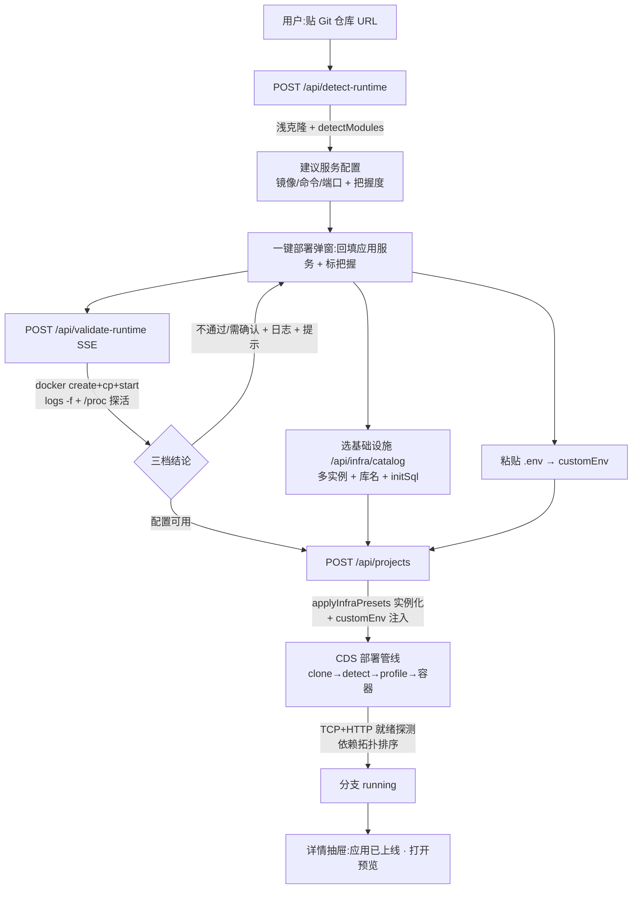

# CDS 绝对可视化一键部署 · 设计

> **版本**：v1.0 | **日期**：2026-06-02 | **状态**：核心已落地并经独立子智能体视觉验收（Verdict 通过，无 P0/P1）
> **关联实现**：`cds/web/src/pages/ProjectListPage.tsx`（一键部署弹窗）、`cds/src/services/infra-catalog.ts`（基建注册表 SSOT）、`cds/src/routes/projects.ts`（detect-runtime / validate-runtime / infra 实例化 / customEnv）、`cds/web/src/components/deployment/RuntimeValidateButton.tsx`、`cds/web/src/components/BranchDetailDrawer.tsx`（应用已上线横幅）
> **关联设计**：`design.cds.railway-onboarding-flow.md`（一键部署向导基线）、`design.cds.onboarding.md`、`design.cds.ai-compose.md`（AI 备选路径）、`spec.cds.compose-contract.md`（compose 契约 SSOT）
> **关联文档**：`plan.cds.visual-deploy.md`（计划看板）、`report.cds.visual-deploy.md`（完整报告）、`debt.cds.visual-deploy.md`（已知边界与待补）、`guide.cds.one-click-deploy.md`（使用教程）
> **一句话**：把"纯前端点点点部署任意前后端 + 数据库 + 消息队列"从"填一堆猜测的默认、第一次大概率点红、部署完不知道去哪看"升级成"贴仓库→检测填好真实配置(带把握度)→一次性容器试运行验证→不行就改→部署→应用已上线一键打开"的可信闭环。

---

## 1. 管理摘要

CDS 已有 Railway 式一键部署向导（运行时预设 + 栈检测 + 基建预设 + SSE 部署事件）。本轮把它从"能用但反感"打磨到"商业级不反感"，核心是**把每一处"猜测"变成"可验证的事实"，把每一步"空白等待"变成"看得见、改得动"**：

1. **基建不再漂移**：12 个预设（含 Kafka/NATS/ES/MinIO）收敛到一个后端注册表 SSOT，前端选择器与拓扑选择器都读它；新增基建 = 注册表加一条。
2. **配置不再瞎猜**：贴 Git 仓库 → 一键检测真实技术栈，把镜像/命令/端口按检测结果填好，并标注**把握度**（高/中/低）+ 识别依据；没把握就劝先验证。
3. **能当场试错**：「试运行验证」用一次性容器在真实仓库上跑配置，流式日志 + 端口探活，给出 通过/需确认/不通过 三档结论 + 失败根因提示；不行就地改命令/镜像再试。
4. **同类型多数据库**：一个项目可挂多个同类型库，第 2+ 个实例独立容器 + 独立连接串（`DATABASE_URL_2`），首个实例零改动向后兼容。
5. **少绕路**：项目环境变量就地粘贴 `.env` 文本（不必准备文件）；连接串自动注入。
6. **上线高光**：分支 running 时详情抽屉顶部醒目"应用已上线 · 打开预览"。

整条链路由独立子智能体在 `cds.miduo.org` 真实环境跑通并视觉验收，结论：**商业级可用，无 P0/P1**。

---

## 2. 用户场景（一条主线）

> 「我有个前后端项目 + 要个数据库，想点几下就跑起来，别让我猜、别让我准备一堆文件、错了告诉我哪错了。」

```
1. 贴 Git 仓库 URL
2. 点「检测仓库并自动填好配置」
   → CDS 克隆 + 分析：识别出 Express(Node) / Flask(Python) / 多模块 monorepo…
   → 把每个服务的镜像/命令/端口填好，标「把握 高/中/低」
3. 选基础设施（按类别分组：数据库/缓存/消息队列/搜索/对象存储）
   → 数据库可设库名 + 初始化 SQL；同类型可「再加一个」（独立连接串）
4. 就地粘贴项目环境变量（.env 文本，不必准备文件）
5. 点「试运行验证」
   → 一次性容器跑：克隆 → 拉镜像 → 跑命令 → 端口探活
   → 绿「配置可用」/ 红「不通过 + 退出码 + 日志 + 修复提示」
   → 不行就改命令/镜像，再点一次
6. 创建 → CDS 连续完成 clone/detect/profile/部署
7. 分支 running → 详情抽屉顶部「应用已上线 · https://<branch>.<domain>」一键打开
```

每一步都不让用户对着空白发呆，也不让他面对一个大概率错的猜测。

---

## 3. 核心能力

| 能力 | 实现 | 价值 |
|---|---|---|
| 基建注册表 SSOT | `infra-catalog.ts`（12 预设 + 分类 + 连接变量名 + supportsDbName/initSql 标记） | 新增基建一处搞定，三处漂移消除 |
| 检测回填 | `POST /api/detect-runtime`（克隆 → `detectModules` → 建议配置 + confidence/signals） | 不再猜，按真实代码填 |
| 把握度透明 | detect 返回 confidence/signals；前端「把握 高/中/低」+ 不确定劝验证 | 不静默填错让用户盲信 |
| 试运行验证 | `POST /api/validate-runtime`（SSE：docker cp 装载代码 → 跑 → /proc 探活 → 三档结论 + 智能提示） | 部署前当场见真章 |
| 同类型多数据库 | `applyInfraPresets` 实例化（首个零改动，第 2+ 个 `-N` 容器 + `_N` 连接串、host 改写） | 一个项目多个同类型库 |
| 库名 + 初始化 SQL | 目录 build() 支持 dbName；InfraService 存 dbName/initSql；数据面板「载入初始化 SQL」 | 数据库初始化友好 |
| 项目环境变量粘贴 | 创建弹窗就地粘贴 `.env` 文本（KEY=VALUE，容忍 #/export/引号），创建时一并写入 | 少绕路，不必准备文件 |
| 应用已上线高光 | 分支列表端点带 previewUrl；详情抽屉 running 时绿色横幅 + 一键打开 | 部署后的上线时刻 |
| 弹窗版式护栏 | shadcn DialogContent cap 90vh + 内层滚动；验收 harness 自动检测 modal 撑破 | 内容再多也不飞出视口 |

---

## 4. 架构

### 4.1 闭环数据流



### 4.2 组件分层

| 层 | 组件 | 职责 |
|---|---|---|
| 前端弹窗 | `ProjectListPage.tsx` 一键部署弹窗 | 检测按钮 + 动态应用服务（增删/角色/auto 默认）+ 基建分组选择器 + 多实例/库名/initSql + env 粘贴 |
| 前端组件 | `RuntimeValidateButton.tsx` / `InfraDataPanel.tsx` / `BranchDetailDrawer.tsx` | 试运行流式验证 / 数据面板 / 应用已上线横幅 |
| 后端检测 | `detect-runtime` + `stack-detector.ts` | 克隆 + 栈识别（monorepo 感知）+ 置信度 |
| 后端验证 | `validate-runtime` | 一次性容器 dry-run（docker cp 装载、/proc 探活、智能提示、跑完销毁）|
| 后端基建 | `infra-catalog.ts` + `applyInfraPresets`（projects.ts） | 注册表 SSOT + 实例化 + 连接串生成（`instanceConnectionEnv` 纯函数）|
| 后端部署 | 既有部署管线 + `deploy-infra-resolver` + `topo-sort` + `container.ts` 就绪探测 | clone/detect/profile/容器编排/健康门控 |

### 4.3 关键设计决策

- **算/发分离 + 加法式实例化**：多数据库首个实例**字节级不变**（`postgres`/`DATABASE_URL`），只有第 2+ 个走 `postgres-2`/`DATABASE_URL_2` + host 改写——存量项目零影响。
- **docker cp 而非 bind-mount**：容器化 CDS 用宿主 docker socket 时 `-v 主机路径` 挂的是宿主空目录；改用 `docker create + docker cp + docker start` 由 CLI 直接传文件（dogfood 实测发现的致命 bug）。
- **/proc/net/tcp 探活**：不依赖镜像里有 wget/curl（slim/distroless 常没有，否则起来的服务被误判失败）。
- **检测优先 + 可编辑兜底**（`anti-detour.md`）：有仓库就检测回填，没仓库才给可编辑默认；后端运行时默认 `auto`，不写死 Node 命令。

---

## 5. 接口

| 端点 | 用途 | 形态 |
|---|---|---|
| `GET /api/infra/catalog` | 脱敏基建目录（12 预设 + supportsDbName/initSql）| JSON |
| `POST /api/detect-runtime` | `{gitRepoUrl,gitRef}` → `{services:[{runtime,image,command,port,confidence,signals,stack,...}],moduleCount}` | JSON |
| `POST /api/validate-runtime` | `{gitRepoUrl,gitRef,image,command,port}` → SSE（step/log/result）| SSE |
| `POST /api/projects` | 创建：`infraPresets` + `infraConfigs`(库名/initSql) + `infraExtra`(多实例) + `customEnv` + `onboardingServices`(N 个) | JSON |
| `POST /api/projects/:id/infra-presets` | 拓扑页新增基建（含 infraConfigs/infraExtra）| JSON |
| `POST /api/infra/:id/query\|init-sql` + `GET /api/infra/:id/schema` | 数据面板查询/初始化/结构 | JSON |
| `GET /api/branches?project=` | 分支列表，每条带 `previewUrl`（SSOT slug + host）| JSON |

---

## 6. 风险与边界

完整已知边界、待补项与 backlog 见 **`debt.cds.visual-deploy.md`**。要点：同类型多实例当前仅对数据库开放；initSql 自动随就绪执行仍为一键手动；AI 生成 compose 仅设计（`design.cds.ai-compose.md`）；实时部署阶段流/就绪计数/HTTPS 校验/一键回滚为低边际 backlog。
