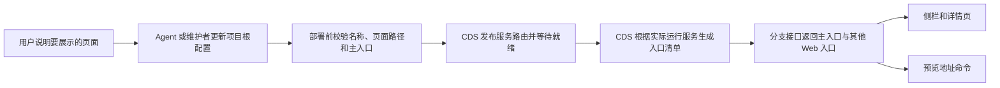

# CDS 多 Web 入口治理 · 设计

> **版本**：v1.0 | **日期**：2026-08-11 | **状态**：已落地

**一句话**：把用户页面、网络路由和机器探活拆成三份独立事实，并用一份项目配置生成唯一、去重且可命名的多页面入口清单。
**谁该读**：负责 CDS 产品、项目接入、部署配置或智能体规则的人；遇到入口重复、名称错误或健康地址混入时的排查者。
**读完能做什么**：解释多入口为什么会出错，判断正确的配置归属，并按同一套规则审查 CDS 页面、接口和智能体行为。

---

## 一、管理摘要

CDS 的“入口”只表示用户可以打开并操作的 Web 页面。它不等于一个容器、不等于一条网络路由，也不等于部署时使用的健康检查地址。

这套设计确立五个长期原则：

1. 一个真实页面只展示一次，主页面不会因为同时拥有命名路由而重复出现。
2. 页面名称来自项目明确声明，不根据服务名或健康检查自动生成“网关健康”等含混名称。
3. 健康检查只服务于机器判断，不得进入用户入口清单。
4. 项目根配置是长期事实源；用户只需说明想展示哪些页面，由 Agent 维护配置并完成校验和部署。
5. CDS 页面、完整详情页和命令行消费同一份结构化入口数据，不各自猜测地址。

因此，多入口项目的数量由“实际声明并发布的用户页面”决定。四个页面就应稳定显示四个入口，而不是因为主页面、命名路由或健康地址被重复计数而显示五个或更多。

## 二、产品定位

多 Web 入口治理解决的是“一个项目部署了多个可独立访问的页面时，CDS 应该向用户展示什么”。它不负责决定服务是否健康，也不替代路由发布。

| 概念 | 回答的问题 | 面向谁 | 是否展示给用户 |
|---|---|---|---|
| Web 入口 | 用户打开后能做什么 | 用户、产品、测试 | 是 |
| 网络路由 | 请求应该转发到哪个服务 | CDS、运维 | 通常不直接展示 |
| 健康检查 | 服务是否已经可以接流量 | CDS、容器编排 | 否 |
| 服务 | 哪个运行单元承载能力 | 研发、运维 | 在运行与资源页面展示 |

这四个概念可以有关联，但不能互相代替。一个 API 服务可以有路由和健康检查，却没有任何用户页面；一个 Web 服务也可以同时拥有主域名路由和命名子域，但仍然只代表一个入口。

## 三、用户场景

| 场景 | 用户期望 | 系统行为 |
|---|---|---|
| 单页面项目 | 看到一个主入口 | 根路径 Web 服务自动成为主入口 |
| 多页面项目 | 看到与产品定义一致的多个名称 | 主入口在前，其余独立页面各显示一次 |
| API 或健康服务 | 不在“应用已上线”中出现 | 有路由也不自动成为 Web 入口 |
| 修改名称或落地页 | 只说清目标，不寻找多处后台配置 | Agent 维护项目根配置、校验并重新部署 |
| 旧版本升级 | 不再看到旧健康链接 | 新结构优先，旧字段只做短期兼容并过滤探活地址 |

## 四、核心能力

### 4.1 显式命名

入口名称是“这个页面存在于用户入口清单”的唯一凭据。没有用户定义名称的服务，即使发布了子域，也只是一条可访问路由，不会被包装成产品入口。

### 4.2 页面路径与探活路径隔离

页面路径必须是同一站点内的可操作页面。包含健康、就绪、存活等探活语义的路径会被拒绝。探活地址继续用于部署判断，但不会传给入口展示层。

### 4.3 主入口唯一

系统先采用项目明确指定的主入口；没有明确指定时，承载根路径的已命名 Web 服务成为自然主入口。多个服务同时自称主入口属于配置错误，应在部署前被拦截。

### 4.4 确定性去重

主入口一旦选定，就不会再以命名子域重复加入列表。同一命名子域只保留一条有效入口，排序不依赖配置文件的偶然读取顺序。

### 4.5 多消费端一致

分支列表侧栏、完整详情页和命令行都使用后端生成的结构化入口清单。展示层只负责排版和旧数据兼容，不再根据服务状态自行推导“健康入口”。

## 五、架构与数据流

这条链路只有一个配置源和一个运行时事实源：

- 项目根配置回答“希望展示什么”。
- CDS 当前分支状态回答“实际上发布了什么”。
- 接口把两者结合成入口清单。
- 页面和 Agent 只消费结果，不自行拼域名或从健康检查猜页面。

配置修改后必须重新部署，旧分支不会仅因配置已保存就自动获得新的运行时入口。页面需要同时显示“配置已保存”和“是否已经部署生效”的区别，避免把旧运行状态误认为配置未修改。

## 六、关键契约

| 配置语义 | 作用 | 关键约束 |
|---|---|---|
| `cds.path-prefix` | 声明服务在主域名上的路由前缀 | 根路径通常决定自然主入口 |
| `cds.subdomain` | 为服务发布独立命名路由 | 只发布路由，不自动进入入口清单 |
| `cds.web-entry-name` | 定义用户看到的页面名称 | 是入口存在的唯一显式凭据 |
| `cds.web-entry-path` | 定义用户点击后到达的页面 | 必须是站内页面，禁止探活路径 |
| `cds.web-entry-primary` | 在路由歧义时指定唯一主入口 | 可选；不得有多个 |
| `cds.readiness-path` | 判断服务是否准备好接流量 | 只给机器使用，不得作为 Web 入口 |

入口数据对外按“主入口加其他入口”表达，并同时提供完整的公开地址列表。公开地址只能来自 CDS 当前状态；根域、分支名和子域公式都不是调用方自行生成地址的授权。

## 七、主入口与去重规则

系统按以下顺序收敛结果：

1. 只保留明确命名且页面路径合法的 Web 服务。
2. 明确指定的主入口优先；否则选择承载根路径的 Web 服务。
3. 主入口只进入列表一次，即使它还拥有命名子域。
4. 其他入口必须同时具备独立路由、用户名称、页面路径和可发布状态。
5. 相同命名子域只保留一个，已被其他分支或自定义域占用的地址不展示。
6. 最终结果由 CDS 返回，展示层不得追加健康地址、内部域名或推算地址。

这套顺序直接避免三类常见错误：同一页面被算两次、API 被当成页面、健康探针被当成用户入口。

## 八、配置归属与维护责任

项目根的 compose 配置是长期配置源。CDS 项目设置保存的是应用后的运行配置，不应发展成另一份无人同步的事实源。

默认维护方式是：用户用自然语言描述页面名称和落地位置，Agent 负责更新配置、运行校验、提交变更、导入 CDS 并重新部署。用户不需要理解 nginx、分支覆盖、探活配置或地址公式。

人工修改时也只修改项目根配置。若因紧急情况从 CDS 页面直接调整，必须把同样的变更同步回项目根，否则下一次导入或重新接入会覆盖现场修复。

## 九、兼容与迁移

新接口以 Web 入口结构为准。旧客户端曾使用带“网关”语义的字段读取入口，为保证升级不中断，服务端在一个过渡周期内返回同内容的兼容字段；客户端只有在新字段缺失时才读取旧字段，并继续过滤健康检查地址。

兼容字段不能成为新的事实源，也不能继续扩大使用范围。完成一个发布周期后，应根据客户端版本覆盖情况移除兼容层。

## 十、风险、回滚与验收

| 风险 | 用户现象 | 处理 |
|---|---|---|
| 配置已保存但未重新部署 | 页面仍显示旧入口 | 重新部署目标分支并等待全部服务就绪 |
| 多个主入口 | 主入口选择不稳定 | 部署前校验失败，只保留一个主入口 |
| 页面路径误填探活地址 | 点击后只看到健康结果 | 拒绝配置，把探活路径留在健康字段 |
| 只改 CDS 页面未同步项目根 | 下次导入后改动丢失 | 以项目根配置回写并重新导入 |
| 展示层仍读取旧字段 | 名称或数量漂移 | 新字段优先，旧字段只作受限兼容 |

完成验收必须同时满足：入口数量与产品定义一致、名称由用户定义、主入口不重复、没有健康地址、每个页面公网可打开、实际脚本和样式资源可加载、侧栏与详情页显示一致。桌面端侧栏应保留项目上下文，使用约三分之二屏宽；小屏设备可使用全屏布局。

回滚时恢复上一版项目配置并重新部署即可。入口治理不改变服务数据、环境变量或健康检查机制，因此不需要数据迁移。

## 十一、关联文档

- [cds-compose 契约](./spec.cds.compose-contract.md)：完整字段与部署前校验规则。
- [CDS 项目接入与配置收敛](./design.cds.onboarding.md)：项目配置如何生成、审核和应用。
- [CDS 多 Web 入口配置与验收](./guide.cds.web-entry.md)：人和 Agent 的实际操作步骤。
- [CDS 部署验收](./guide.cds.deploy-acceptance.md)：部署完成后的通用验收要求。
- [CDS 技能版本与更新架构](./design.cds.skill-version-update.md)：技能规则如何随版本发布。
- `changelogs/2026-08-10_cds-web-entry-review.md`（简单预览与完整详情页入口地址/展示契约修复、Web 服务名结构化角色识别）

## 十二、实现来源

- `cds/src/services/web-entry.ts`
- `cds/src/services/compose-parser.ts`
- `cds/src/routes/branches.ts`
- `cds/web/src/lib/previewUrl.ts`
- `cds/web/src/components/BranchDetailDrawer.tsx`
- `cds/web/src/pages/BranchDetailPage.tsx`
- `.claude/skills/cds/SKILL.md`
- `.claude/skills/cds/cli/cdscli.py`
