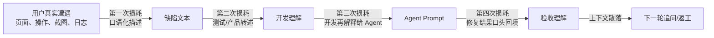
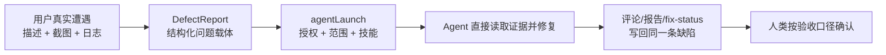
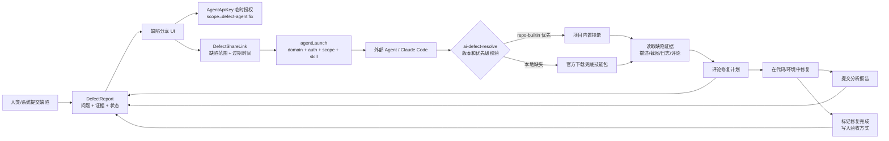
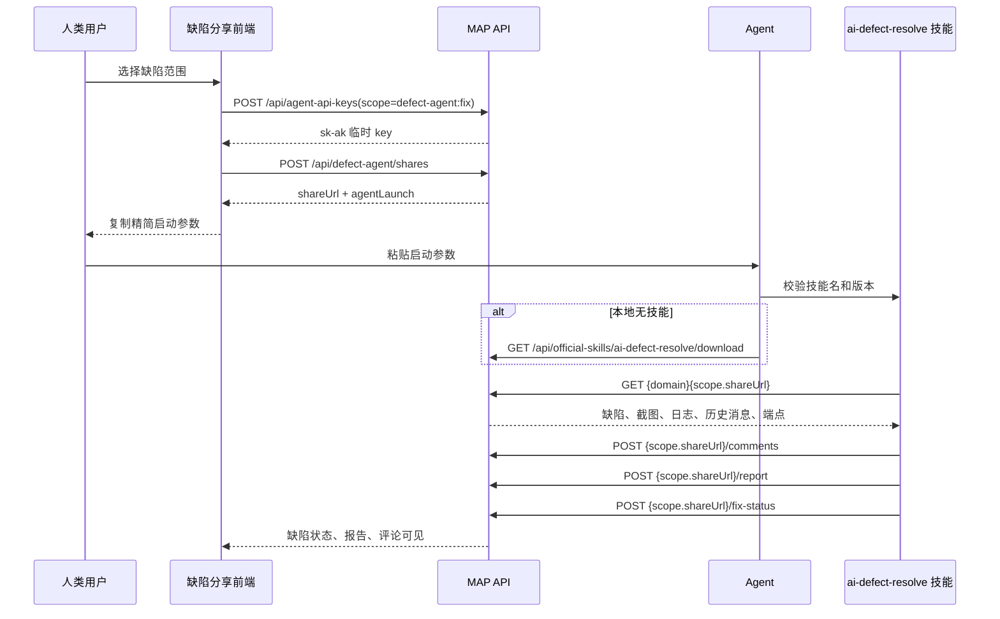

# 缺陷分享与 Agent 技能修复架构

> **版本**：v1.0 | **日期**：2026-05-21 | **状态**：已实现基础闭环，分享中心接入待后续阶段

---

## 管理摘要

- **核心问题不是“怎么把 bug 发给 AI”**：真正的问题是信息损耗。传统缺陷修复链路里，用户看到的问题被转写成描述，开发再二次理解，修复后再口头解释，验收时又重新还原上下文；每一次换手都在丢失信息。
- **缺陷是什么**：缺陷不是一段抱怨文本，而是系统内沉淀的“低损耗问题载体”：谁遇到、在哪遇到、看到什么证据、期望什么结果、当前状态如何、谁有权处理、怎样算修好。
- **为什么 Agent 需要知道缺陷**：Agent 要修复问题，不能只拿一句描述；它需要直接读取缺陷的原始上下文包，包括用户描述、截图、日志、历史评论、影响范围、授权边界和验收口径。否则 Agent 只是多一个转述者，会继续放大损耗。
- **Agent 如何直接操作和解决**：系统通过受控开放接口把缺陷变成 Agent 可执行任务。Agent 读取原始证据，评论计划，提交分析报告，在代码仓库或运行环境中修复，再把修复说明和验收方式写回同一条缺陷。
- **本架构的目的**：减少“报告人 → 产品/测试 → 开发 → Agent → 验收人”之间的翻译层级，让缺陷从产生、理解、修复到验收尽量沿着同一条信息链流动。提速只是结果，保真才是根本。
- **当前实现边界**：本阶段先完成缺陷到 Agent 的任务启动契约和技能执行协议；分享中心接入、细粒度能力 token、自动派单调度属于后续治理层。

---

## 1. 缺陷模型

缺陷在本系统里是 Agent 可以执行的最小问题单元，至少包含四层信息：

| 层级 | 内容 | Agent 用途 |
|---|---|---|
| 事实层 | 标题、描述、复现步骤、实际结果、期望结果 | 判断问题是否可复现、是否能修 |
| 证据层 | 截图、日志、接口请求、历史评论 | 定位根因，避免只凭自然语言猜测 |
| 协作层 | 报告人、处理人、评论、未读、状态 | 在正确位置评论计划、进展、验收方式 |
| 控制层 | 分享范围、授权 key、过期时间、允许动作 | 限制 Agent 只处理被授权的问题 |

这也是为什么缺陷必须从系统 API 暴露给 Agent：它不是“把 bug 文案复制给 AI”，而是把问题、证据、权限和验收标准打包成可执行任务。

---

## 2. 信息损耗视角

传统缺陷修复链路的信息损耗通常发生在这些位置：



这套架构要做的是把链路压短：



关键不是让 Agent 更快写代码，而是减少中间翻译：

| 传统做法 | 信息损耗 | 本架构的对应机制 |
|---|---|---|
| 人把截图/日志手工描述给 Agent | 证据被摘要，细节丢失 | Agent 从分享 API 直接读取截图、日志、历史评论 |
| 每次重新写 prompt | 修复规则靠临时记忆 | 规则固化到 `ai-defect-resolve` 技能 |
| 不同 Agent 用不同工作流 | 执行口径漂移 | 分享包声明技能名、最低版本和优先级 |
| 修复完成后口头说明 | 验收信息散落 | 评论、报告、修复状态写回缺陷 |
| 分享整个缺陷列表或给全局 key | 权限边界模糊 | `scope` 限定缺陷范围，key 由分享页一键签发 |
| Agent 猜测主站或复用环境 key | 读错站点、读错权限、泄露边界 | auth 缺失时先问主站，或触发分享链接让用户一键获取 |

因此，`agentLaunch` 不是提示词优化，而是信息损耗控制点：它把“Agent 应该去哪里读事实、凭什么权限操作、按哪个技能执行、处理哪些缺陷”固定下来，避免每一轮对话重新解释。

---

## 3. 设计原则

1. **缺陷是任务契约**：缺陷分享的目标不是转发文本，而是创建一份 Agent 可执行、系统可审计的问题契约。
2. **分享只传启动参数**：分享内容只保留 `domain`、`auth`、`scope` 三类关键参数。
3. **证据由系统提供**：截图、日志、历史消息通过分享 API 拉取，避免人类手工拼接上下文。
4. **规则进技能**：修复流程、评论时机、安全边界、验收要求都在 `ai-defect-resolve` 技能中维护。
5. **项目内置优先**：当前仓库内置技能优先级最高，不允许托管技能或市场技能静默覆盖。
6. **版本可校验**：分享包声明 `skill.minVersion`，Agent 执行前必须确认本地技能版本满足要求。
7. **授权可收敛**：当前先使用分享页一键签发的临时 AgentApiKey；后续接入分享中心时，应保留相同 `agentLaunch` 契约。
8. **禁止猜 key**：如果 `auth` 没有明确 key，Agent 必须询问主站或引导用户打开分享链接一键获取，不能尝试本机环境变量或历史凭据。

---

## 4. 总体架构



---

## 5. 核心数据契约

`agentLaunch` 是新契约的唯一推荐入口。旧 `agentInstructions` 仅为历史兼容保留。

```json
{
  "version": "1.0",
  "domain": "https://main-prd-agent.miduo.org",
  "auth": {
    "type": "api-key",
    "header": "Authorization",
    "scheme": "Bearer",
    "env": "PRD_AGENT_API_KEY",
    "fallbackHeader": "X-AI-Access-Key",
    "obtainUrl": "/api/defect-agent/share/view/xxx",
    "requiredScope": "defect-agent:fix"
  },
  "scope": {
    "shareToken": "xxx",
    "shareUrl": "/api/defect-agent/share/view/xxx",
    "type": "single | selected | project",
    "defectIds": ["optional"],
    "projectId": "optional",
    "expiresAt": "2026-05-22T00:00:00Z"
  },
  "skill": {
    "name": "ai-defect-resolve",
    "minVersion": "1.1.0",
    "priority": ["repo-builtin", "user-installed", "official-download", "hosted-marketplace"],
    "downloadUrl": "https://.../api/official-skills/ai-defect-resolve/download"
  }
}
```

### 字段说明

| 字段 | 含义 | 变更要求 |
|---|---|---|
| `domain` | MAP/PrdAgent 主域名 | 改 URL 解析规则时必须同步本文档 |
| `auth` | Agent 调接口的认证方式，以及缺失 key 时的一键获取入口 | 改 Header、scope、key 类型时必须同步本文档 |
| `scope` | 本次授权覆盖的缺陷范围 | 新增范围类型时必须同步本文档和技能 |
| `skill` | 指定技能、最低版本、下载入口和优先级 | 改技能名、版本策略、下载端点时必须同步本文档 |

---

## 6. 调用流程



---

## 7. 权限与安全边界

### 当前阶段

- 分享范围由 `DefectShareLink` 控制。
- 写操作由 `AgentApiKey` 控制，scope 固定为 `defect-agent:fix`。
- 临时 key 明文只在创建时显示一次。
- 分享链接有过期时间，可撤销。
- Agent 只能操作分享范围内的缺陷；后端会校验 `defectId` 是否属于该分享。

### 后续分享中心接入点

分享中心接入时不应破坏 `agentLaunch`。只需要把 `auth` 从“临时 AgentApiKey”替换为“分享中心签发的短期能力 token”，并补充更细粒度能力：

| 能力 | 说明 |
|---|---|
| `read` | 读取缺陷、截图、日志、历史消息 |
| `comment` | 写入 AI 评论 |
| `report` | 提交分析报告 |
| `fix-status` | 标记修复完成 |

---

## 8. 技能版本与优先级

`ai-defect-resolve` 技能当前版本：`1.1.0`。

优先级固定为：

```text
repo-builtin > user-installed > official-download > hosted-marketplace
```

含义：

1. 当前仓库内置 `.claude/skills/ai-defect-resolve/SKILL.md` 时，必须使用它。
2. 用户本地安装技能可作为无仓库内置时的第二选择。
3. 官方下载包只用于“没有技能”的兜底安装。
4. 托管/市场技能不得覆盖本项目内置技能，避免 API 契约和项目规则漂移。

---

## 9. 文件与职责

| 文件 | 职责 |
|---|---|
| `prd-api/src/PrdAgent.Api/Controllers/Api/DefectAgentController.cs` | 创建分享、读取分享、返回 `agentLaunch`、处理评论/报告/fix-status |
| `prd-api/src/PrdAgent.Api/Controllers/Api/OfficialSkills/OfficialSkillsController.cs` | 官方技能 zip 下载入口 |
| `prd-api/src/PrdAgent.Api/Controllers/Api/OfficialSkills/OfficialSkillTemplates.cs` | 官方 `ai-defect-resolve` 兜底技能模板 |
| `prd-admin/src/pages/defect-agent/components/ShareDefectDialog.tsx` | 单缺陷/项目/已选分享弹窗，复制精简启动参数 |
| `prd-admin/src/pages/defect-agent/components/SharesListPanel.tsx` | 批量分享管理，创建临时 key 和受控分享 |
| `prd-admin/src/services/contracts/defectAgent.ts` | `DefectAgentLaunch` 前端契约 |
| `.claude/skills/ai-defect-resolve/SKILL.md` | 项目内置技能，维护修复流程和安全规则 |

---

## 10. 文档同步规则

当以下任一内容改变时，必须同步更新本文档：

1. `agentLaunch` 字段新增、删除、改名或语义变化。
2. 缺陷分享开放 API 路径变化。
3. `defect-agent:fix` scope 或认证 Header 变化。
4. `ai-defect-resolve` 技能名、版本、优先级或下载入口变化。
5. 分享范围新增类型，例如 folder、team、query-result。
6. 分享中心接入后授权能力模型变化。

同步要求：

- 更新本文档架构图和数据契约。
- 更新 `doc/index.yml` 标题映射。
- 更新对应 changelog 碎片。
- 如果变更影响技能行为，同步 bump `.claude/skills/ai-defect-resolve/SKILL.md` 版本。
