# 知识库引用网络（双链 + 反向链接 + 宇宙图）

> **版本**：v1.0 | **日期**：2026-06-11 | **状态**：已落地（MVP）

> **关联文档**：`design.document-store.md`（知识库整体架构，本设计是其扩展层）·  `debt.knowledge-base-mention-network.md`（已知边界与遗留事项）· `rule.frontend-architecture.md`（注册表模式 + SSOT 原则） · `rule.data-audit.md`（实体引用涟漪审计原则）

## 一、管理摘要（30 秒看懂）

**问题**：当前知识库每篇文档都是孤岛，写完丢那儿，无人记得它和别的文档有什么关联，知识网络无法浮现。

**方案**：引入 Obsidian 风格的双向链接（wiki-link，`[[文档标题]]` 语法），系统自动维护一张「引用账本」，反向查就是「谁引用了我」，全图可视化就是「宇宙图」。

**差异化**：账本不绑定知识库文档，是**全系统通用**的 mention 基础设施。未来任何实体（缺陷、PR、周报、工作流、涌现节点…）只需在 mention 注册表登记一行，自动具备双链 + 反向链接 + 宇宙图节点能力。**Obsidian 只能链笔记，我们能链一切。**

**当前阶段（MVP，2026-06-11 上线）**：仅 document → document 闭环。验证用户写 `[[]]` 的习惯 + 反向链接面板的爽感 + 宇宙图的可视化价值。后续按用户反馈和优先级，扩展跨实体引用、AI 自动补链、宇宙图按团队分色、时间轴回放。

## 二、产品定位

| 视角 | 现状 | MVP 上线后 |
|---|---|---|
| 写作者 | 写完即结束，多篇文档间无关联感 | 边写边 @ 其他文档，整个知识库变成网 |
| 读者 | 单篇阅读，看不到上下文 | 文档底部「被 N 篇引用」带高亮上下文，跨文档阅读流畅 |
| 管理者 | 看不到知识库的整体结构 | 宇宙图一眼看出核心节点、孤岛文档、主题聚集 |
| 平台运营 | 只能链笔记的工具 | 跨实体引用网络（缺陷 ↔ PR ↔ 文档 ↔ 周报） |

## 三、用户场景

### 场景 A：边写边链
小张写《Obsidian 调研报告》时，提到「知识库」，输入 `[[知识库设计文档]]`，保存后这个词变成蓝色可点的链接，指向那篇文档。

### 场景 B：发现「我有多重要」
小李三周前写过《知识库设计文档》，今天打开看到底部「被 5 篇文档引用过」面板：周报、Q2 规划、Obsidian 调研都引用了它，每条卡片带引用句子的高亮。他立刻意识到这篇是核心文档，值得继续完善。

### 场景 C：宇宙图发现
小王打开「知识宇宙图」，看到 200 篇文档自动聚成几个星团：左上是产品规划相关、右下是技术调研相关、中间一个超大节点是《知识库设计文档》—— 它被很多文档引用。他发现一片孤岛区域是「未归类的草稿」，提醒自己去整理。

## 四、核心能力

### 4.1 双链语法

- `[[标题]]` — 引用同库内一篇标题为「标题」的文档
- `[[标题|别名]]` — 同上但显示别名（MVP 解析但未必用到，预留）
- 跨库 / 跨实体引用 — **不在 MVP 范围**，未来通过 `[[type:id|显示名]]` 扩展

### 4.2 反向链接面板

文档详情页底部展示：
- **被以下 N 篇文档引用**（折叠面板，每条卡片：源标题 + 引用上下文高亮 anchor + 源更新时间）
- **本文档引用了 M 篇**（折叠 chip 列表，点击跳转）

### 4.3 宇宙图（Graph View）

- 节点 = 文档，节点大小 = 总连接数（被引用 + 引用）开平方再放大
- 边 = 引用关系
- 颜色 = 按 category 哈希取色
- 交互：滚轮缩放、拖动平移、悬停看预览、单击聚焦、双击进入文档
- 设置面板（左上齿轮）：`Filters` / `Groups` / `Display` / `Forces` 四组，Forces 四个滑块实时调物理参数（Obsidian 同款）

### 4.4 未在 MVP 中实现（v2 候选）

- 编辑器 `[[` 自动补全下拉
- 编辑器 `@` 输入触发同款下拉
- 悬停 wikilink 浮出预览卡
- AI 推荐链接气泡（保存时检测可能引用但未标注的文档）
- 服务端自动补链（AI 生成文本中的标题自动包 `[[]]`）
- 跨实体引用（缺陷 ↔ PR ↔ 文档）
- 别名（aka）配置
- 改名时自动更新所有引用
- 宇宙图：按团队分色、时间轴回放、AI 推荐虚线连接

## 五、架构图

```mermaid
flowchart LR
  subgraph 前端 [前端 prd-admin]
    EDIT[编辑器<br/>用户写 &#91;&#91;xxx&#93;&#93;]
    VIEW[MarkdownViewer<br/>preprocessWikilinks]
    BL[BacklinksPanel<br/>反向链接面板]
    UNI[UniverseGraphPage<br/>宇宙图 Canvas]
  end

  subgraph 后端 [后端 prd-api]
    UPSAVE[UpdateEntryContent]
    PARSER[WikiLinkParser<br/>正则解析]
    SVC[MentionService<br/>保存即重算]
    CTRL[MentionsController<br/>GET 端点]
  end

  subgraph Mongo
    ENTRY[(document_entries<br/>正文 + ContentIndex)]
    MEN[(mentions<br/>fromType/fromId<br/>toType/toId<br/>anchorText/context)]
  end

  EDIT -- 保存 --> UPSAVE
  UPSAVE -- 解析正文 --> PARSER
  PARSER -- 匹配项 --> SVC
  SVC -- 同库按标题查 entryId --> ENTRY
  SVC -- 先删后写 --> MEN

  VIEW -- 渲染 wiki:链接 --> 用户
  BL -- GET /documents/:id/links --> CTRL
  UNI -- GET /stores/:id/graph --> CTRL
  CTRL -- 查询 --> MEN
  CTRL -- 关联实体 --> ENTRY
```



## 六、数据设计

### 6.1 `mentions` 集合

```typescript
{
  _id: string,               // GUID(N)
  fromType: "document",      // MVP 仅 document；预留 "defect" / "pr" / ...
  fromId: string,            // DocumentEntry.Id
  toType: "document",
  toId: string,              // DocumentEntry.Id
  anchorText: string,        // [[xxx]] 中的 xxx
  context: string,           // 前后约 60 字符上下文（反向链接展示用）
  scopeId: string?,          // 作用域 ID（MVP = StoreId，用于查全图）
  isAutoDetected: boolean,   // false = 用户 [[]] 显式；true = AI 自动补
  createdAt: ISODate,
}
```

**索引建议**（后续 DBA 手动建，遵循 `no-auto-index` 规则）：
- `{ scopeId: 1 }`（宇宙图全图查询）
- `{ toType: 1, toId: 1 }`（反向链接查询）
- `{ fromType: 1, fromId: 1 }`（保存时先删自己旧记录）

### 6.2 写入时机

`DocumentStoreController.UpdateEntryContent` → `MentionService.ResyncDocumentMentionsAsync`：
1. 删除以本条目为 from 的所有旧 mentions
2. 跑 `WikiLinkParser.Parse` 提取所有 `[[xxx]]`
3. 同库内按标题查 entryId（一次 IN 查询，不区分大小写）
4. 去重 (fromId, toId) 对，避免重复正文里多次引用造成账本膨胀
5. 跳过自引用（自己 `[[自己的标题]]`）
6. 批量 InsertMany

### 6.3 删除时机

`DocumentStoreController.DeleteEntry` 的级联清理新增一段：调 `MentionService.CascadeDeleteAsync`，清掉以被删 entry 为 from 或 to 的所有引用。

## 七、API 接口

| 方法 | 路径 | 用途 |
|---|---|---|
| GET | `/api/mentions/documents/:entryId/links` | 反向链接 + 出链（含源标题/摘要/上下文） |
| GET | `/api/mentions/stores/:storeId/graph` | 宇宙图全图数据（nodes + edges） |
| GET | `/api/mentions/stores/:storeId/suggest?q=xxx` | 编辑器自动补全（按标题模糊匹配，v2 用） |

权限：通过 `[AdminController("document-store", DocumentStoreRead)]` 复用知识库权限，访问控制在控制器内逐条 store 校验 OwnerId / IsPublic / SharedTeamIds。

## 八、关键设计决策

### 8.1 为什么用「保存时先删后写」？

mention 是正文的**纯派生数据**，没有「保留用户编辑」的需求。每次正文变化重新解析一遍即可，账本永远是最新的。

### 8.2 为什么账本存 ID 而非标题？

改名场景：用户把《知识库设计文档》改成《知识库 v2 设计》，所有指向它的 wikilink 都还能正常工作 —— 因为账本里存的是文档 ID，标题只是显示文本。未来加 alias 字段时也是同理。

### 8.3 为什么不在编辑器里立刻解析 wikilink？

正文是 SSOT，wikilink 是派生关系。**保存时一次性解析**比「实时维护」简单太多，避免编辑过程中账本反复抖动。

### 8.4 为什么用 `wikilink:` 自定义 href 协议而非 markdown 扩展？

MarkdownViewer 已经走 `react-markdown` + `rehypeRaw` + `rehypeSanitize` 管线，扩展 remark 插件涉及 3 层链路改动。先把 `[[xxx]]` 预处理成 `[xxx](wikilink:xxx)` 走标准链接，配合 `components.a` 自定义渲染，**零改动 sanitize 管线**且行为可预期。

### 8.5 为什么用全局 CustomEvent 而非 prop drilling？

DocBrowser 是 3000+ 行的共享组件，给它加 `onWikilinkClick` 需要改 3 处调用方（DocumentStorePage / LibraryShareViewPage / WeeklyReportsTab）。用 `document.dispatchEvent` 派发，消费方在 useEffect 监听，零侵入。

## 九、扩展性（通用 Mention 网络）

未来加新实体的步骤（**一行登记换全套能力**）：

1. 在 `MentionEntityType` 加常量（如 `Defect = "defect"`）
2. 写一个 `IMentionResolver` 实现（查标题、查摘要、生成跳转 URL）
3. 在 `MentionsController` 里注册到 resolver 字典
4. 前端在 `MentionEntityRegistry` 加一行（如何渲染预览卡、跳哪个路由）

之后**该实体自动获得**：
- 编辑器里被 @ 搜到
- 文档底部反向链接面板出现引用它的卡片
- 宇宙图里多一类节点（自动上色）
- AI 推荐链接的目标候选

## 十、风险与限制

### 10.1 同库标题撞名
MVP 取第一个匹配（按创建时间最早）。理论上可能链错，但同库内文档标题撞名概率很低；用户改名一次即可。v2 通过 `[[标题|id]]` 强锚定解决。

### 10.2 性能
- 单文档保存：解析正则 O(N) + 一次 MongoDB IN 查询 + 一次 DeleteMany + 一次 InsertMany。文档量 10000 内 < 100ms。
- 宇宙图：当前一次性返回全库节点 + 边。10000 节点以上需要分批/聚合，**v2 解决**。
- 反向链接查询：当前 O(K) K = 引用数。需要在 `{toType, toId}` 上建索引，**手动让 DBA 加**（rule `no-auto-index`）。

### 10.3 多人协作冲突
两人同时编辑同一文档时，最后 save 的版本决定账本内容。这与正文编辑的冲突语义一致，不引入新的冲突维度。

### 10.4 跨库引用未支持
MVP 仅同库内匹配。跨库引用需要 v2 设计跨库标题解析协议（带库 ID 前缀，如 `[[storeA::标题]]`）。

## 十一、验收

完整验收报告（含 19 张取证截图）已归档：
`prd-agent · 知识库 · 引用网络-双链反向链接宇宙图 · 新增功能 · 验收报告`（commit `d61a4b2`，2026-06-11 通过，14 条用例全 pass）。

核心断言（已全部验证）：

- [x] 在文档 A 写 `[[B]]`，保存后 B 文档底部「被引用」面板出现 A
- [x] B 文档底部「本文档引用了」面板隐藏（B 没引用 A 时不出现）
- [x] 删除 A 文档，B 文档底部「被引用」面板自动不再列出 A（级联清理生效）
- [x] 打开宇宙图，看到 A 和 B 之间一条边，hover 显示预览卡，双击进入文档
- [x] 拖动 Forces 滑块，整张图可见实时重排
- [x] 移动端 `prd-desktop` 不受影响（未集成不报错）
