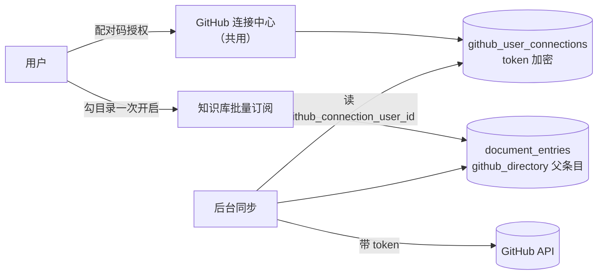

# 知识库 GitHub 目录同步 · 设计

> **版本**：v1.1 | **日期**：2026-09-10 | **状态**：已落地并通过 L2 复测（私有仓 53 篇实拉成功，缺陷 0/0/0/0）

**一句话**：任何登录用户用自己的 GitHub 账号连一次，系统就把他有权限的仓库目录全扫出来、默认勾好所有 doc/docs 目录，勾完即可开启每日同步。
**谁该读**：做知识库订阅、GitHub 集成、或要复用 per-user GitHub 连接的工程师。
**读完能做什么**：说清「连接—选仓库—勾目录—开启同步」四步各由谁负责，以及默认勾选的判据是什么。

---

## 1. 管理摘要

- **解决的问题**：此前把 GitHub 目录接进知识库，用户得自己去 GitHub 找到目录、复制 `tree/分支/路径` 形式的地址、粘回订阅框，一次只能加一个目录；而且同步是**匿名**请求 GitHub，私有仓根本拉不到，公开仓也共用 60 次/小时的匿名额度。
- **核心方案**：复用已有的「每个用户连自己的 GitHub 账号」能力，把它抽成一处**共用的连接入口**（连接状态、仓库、分支、目录扫描），任何应用都能用；知识库在它之上提供四步向导与一次开启多个目录的订阅；后台同步按条目上盖的连接身份带用户 token 请求 GitHub。
- **默认口径**：递归扫出仓库里**所有** doc / docs 目录（不是只认根目录），默认勾选；用户可自由改。
- **已知边界**：见 §6，均已记入 [debt.knowledge-base.md](./debt.knowledge-base.md)。

## 2. 背景与现状

知识库早有「GitHub 目录订阅」：一个 `github_directory` 父条目记着 owner/repo/path/branch，后台同步每天拉一次该目录下的 Markdown，按 GitHub 的文件 SHA 增量更新、远端删了本地也删。能力在，入口不在——

- 入口是一个「粘贴 GitHub 地址」输入框，用户要离开产品去 GitHub 找地址（违反 `minimal-user-input`：系统查得到的值不该摆输入框）；
- 一次一个目录，一个仓库有五处文档就得重复五遍；
- 请求不带任何凭据：私有仓 404，公开仓吃匿名限额。

而「用户连自己的 GitHub 账号」这件事其实早就做过了（配对码授权 + 加密存储的连接记录），只是被 pr-review / project-route-agent / tech-doc-format-agent 各抄了一份入口，知识库没份。

## 3. 用户怎么走

| 步 | 用户做什么 | 系统做什么 |
|---|---|---|
| 1 连接 | 点「连接 GitHub 并勾选目录」，在 GitHub 页面粘贴配对码 | Device Flow 发码、轮询、落库；已连接则直接跳过这一步 |
| 2 选仓库 | 搜一下、点一个仓库，需要时换分支 | 列出他有权限的仓库（含私有）与分支，默认选仓库默认分支 |
| 3 勾目录 | 看一眼，改他想改的 | 一次 Git Trees 调用扫全仓，折成目录树；**所有 doc/docs 目录已预勾**，每行显示该目录有几篇 Markdown |
| 4 开启 | 点「开启同步」 | 批量建订阅条目；后台每两分钟扫一批（每批有条数上限），目录多时排队陆续开始首次拉取，之后每天一次 |

全程用户只提供两件系统无从得知的事：**哪个仓库**、**要不要改默认勾选**。

## 4. 默认勾选的判据

判据是纯函数（`GitHubDocDirectoryPlanner`），三条缺一不可：

1. 路径上任意一段命中忽略名单（`node_modules` / `dist` / `bin` / `vendor` …）或以 `.` 开头 → 不勾；
2. 路径上存在名为 `doc` 或 `docs` 的目录段（它自己或某个祖先）→ 命中；
3. 且该目录**直属**至少一篇 `.md`。

第 3 条是被同步引擎的形状逼出来的：同步是**单层**拉取，不递归。只勾一个空壳 `doc/`（下面全是子目录）会同步出 0 个文件，看起来像坏了；所以真正该勾的是 `doc/guide` 这种直接装着文档的目录。

判据写成纯函数而不是散在 Controller 里，是为了能被单元测试直接打红——「默认同步所有 doc 目录」是用户口径的核心，它退化成「只勾根目录」时必须在 CI 变红，而不是等人打开页面才发现。

## 5. 数据与调用流

关键字段：父条目 metadata 里新增 `github_connection_user_id`，同步时据此解出该用户的 token。没有这个字段的存量条目照旧走匿名路径，行为不变。

**去重键从 download_url 换成仓库内路径**：私有仓的 `download_url` 每次列目录都带一个新的临时 token 查询串，拿它当键会让同一个文件每轮同步都被判成「新增 + 删除」，本地历史版本一并没掉。存量条目（早期没写 `github_path`）仍用 SourceUrl 兜底，升级当天不会全量重建。

## 5.5 一条用血换来的设计原则：降级不许静默

首轮验收判 fail，三个 P1 里最难查的那个长这样：私有仓订阅完等了 312 秒，0 篇文档，
后台只有一句 `GitHub API 返回 NotFound`。

根因不在 GitHub，在这段「体贴」的兜底：同步 worker 解不出用户 token 时（连接被断开、
token 失效、密文解不开），**悄悄退回匿名请求**再试一次。

它在公开仓上永远不会暴露——匿名本来就读得到。而 GitHub 对**无权访问的私有仓返回的是
404 而不是 403**，于是私有仓用户拿到的是一个和「目录根本不存在」完全无法区分的错误，
既看不出是授权问题，也不知道该去点哪里。**一个静默的降级，把可诊断的失败变成了不可诊断的失败。**

现在的规矩：条目上盖过连接身份，就必须带授权跑；解不出 token 直接停下，把「授权已断开，
请重新连接」写进同步错误。只有从未盖过连接身份的历史条目才允许匿名。判据抽成纯函数
（`GitHubSyncCredentialPolicy`）并附单测，改回去会在 CI 红。

配套的两条同源教训：
- **错误文案要分流到「下一步做什么」**：404 必须说清是「匿名访问私有仓」还是「这个账号没权限」，
  否则原样吐 `Not Found` 等于没说。
- **失败必须在用户看得见的地方留痕**：目录条目图标沿用订阅源的状态配色，卡片摊开原因并给「重试同步」。
  此前后台失败在文件树里和正常条目长得一模一样。

## 5.6 删除的判据：见到什么做什么，删必须有凭据

同步要让知识库跟上远端，包括远端删掉的东西也要跟着消失。但「删」是不可逆的（连历史版本一起没），
所以它和「增 / 改」适用两条不同的规矩：**新增与更新见到什么做什么，删除必须有完整清单撑腰。**

「远端已经没有了」有两种长相，都要认：

- 目录还在、但一篇 Markdown 都不剩；
- **目录本身不存在了**——Git 里没有空目录，删光最后一个文件目录就没了，这反而是最常见的一种。

第二种的麻烦在于，上游对「无权访问的私有仓」「改名的仓库」「被删的分支」给的是同一个答复。
所以动手删之前先确认仓库与分支这一层还够得着，确认不了就按失败处理——绝不拿一次权限变动去换
一次数据清空。

还有一种「看起来像空」不能当真：上游一次最多回一千条目录项，超了就截断且不明说。
判断清单完不完整看**过滤前**的原始条数——过滤后的「零篇」既可能是真没有 Markdown，
也可能是 Markdown 全被挤出了窗口，这两件事只有原始条数分得开。清单可能不完整时，
整个删除环节让路，只做新增与更新；而且那一轮不会装作没事：条目会红着并说清
「这个目录太大、本轮没处理删除、把目录拆细」，否则「远端删了而这边没动」会被一个绿色的
成功状态盖住，用户无从知道差在哪。

## 5.7 断开与连接状态：说出口的话必须有根

断开是**先去 GitHub 收回授权，再删本地**。顺序不能反：先删本地就再也拿不到那把令牌。
收回的是整份授权而不只是当前这把令牌——只作废一把的话，应用依旧列在用户的「已授权应用」里，
与「断开」这个承诺对不上。收回失败不阻断本地删除，但要如实说 GitHub 那边没撤掉、去哪儿手动移除；
上游回「查无此项」时只算**未确认**（可能用户早已自行移除，也可能本站的应用凭据换过、旧令牌仍然
有效），不能报成已收回。删除本身钉在进函数时捕获的那一条上——收回要打一次 GitHub，这期间用户
可能在别处重新连上，按用户删就会删掉刚接好的那条。

连接状态不只看库里有没有记录：用户在 GitHub 那边撤销授权后记录还在，界面若照旧显示「已连接」，
就会让人一点仓库才撞见报错。所以连着的时候会真问一次 GitHub，答案分三种——还能用、已失效、
没问出结论。第三种一律按「还能用」**放行**，否则一次网络抖动就会把正常连接挡在门外；
但放行不等于可以**断言**它有效：界面上那句「它现在仍然有效」只在真的问出「还能用」时才说。
**门禁宁可放宽，说给用户听的话宁可少说一句，两把尺子不互相借用。**

这类措辞（标题栏怎么称呼这条连接、换账号时说什么、失效时给什么提示、断开之后报什么）统一从
同一处判据出，不散落在各个组件里——散开的代价是同一屏上两句话互相打架。同理，凡是「有几种
互不相同的后果」的结果一律用有限枚举而不是布尔：断开那一侧就有三种（删了 / 本来就没有 /
被替换因而保留），压成布尔就要靠界面去猜是哪一种，猜错就会对着用户说反话。

## 6. 已知边界

- 首次同步要等一个 worker 扫描周期后才开始；实测私有仓 53 篇从开启到全部可读约 379 秒。目录条目上已有「立即同步」，可手动催一次。
- 单次批量最多 50 个目录；超大仓库的目录清单在服务端截断（默认 1500 个，优先保留推荐目录及其祖先），界面会提示截断。
- 每篇文档要打 2 次 GitHub API（内容 + 最近提交时间），没有节流与退避，大目录容易撞频率上限；撞上时会明确报出原因并可重试，但不会自动退避重排。
- 同步仍只认 `.md` / 单层目录，未做递归同步；要覆盖子目录就把子目录也勾上。
- 远端删掉文档时，同步只删条目与它的历史版本；知识库里正式的删除入口清得更干净（评论、双链、
  浏览记录、正文与附件等）。这是既有差异，整目录删除会把它放大（见 debt 的 K-20）。
- `github_directory` 父条目的 `IsFolder` / 子条目 `ParentId` 结构问题是历史债务（见 [debt.knowledge-base.md](./debt.knowledge-base.md)），本次未动，新旧条目形状保持一致。
- 老的三处 Device Flow 端点（pr-review / project-route-agent / tech-doc-format-agent）仍在，前端未迁；它们与新连接中心读写同一张表，连一次处处可用。
- 申请的授权范围是「仓库」那一整档。按 GitHub 的定义它包含私有仓代码的**读写**，比"读文档目录"
  需要的大得多，而传统 OAuth 应用无法再细分（只读公开仓的那一档读不了私有仓）。要真正做到最小权限，
  只能改用 GitHub App 形态按仓库授权、只给「内容：只读」—— 那是独立工程（见 debt 的 K-19）。
- 令牌不做续期。GitHub 有两种应用形态，一种签发的用户令牌不过期（那这条不成立），另一种可以开启
  「用户令牌会过期」，开了之后几小时就要重连一次（K-17）。失效本身不会静默错乱：同步会失败并说明
  原因，连接状态也会标成已失效。
- 仓库搜索是在当前这一页里过滤，名下仓库很多时想找的那个可能要翻几页（K-18）。

## 7. 实现来源

给要跳去看代码的人；只读这篇文档的人可以整块跳过。

| 位置 | 文件 |
|------|------|
| 共用连接中心 | `prd-api/src/PrdAgent.Api/Controllers/Api/GitHubConnectController.cs`、`prd-api/src/PrdAgent.Infrastructure/GitHub/GitHubUserConnectionService.cs` |
| 默认预勾判据 | `prd-api/src/PrdAgent.Infrastructure/GitHub/GitHubDocDirectoryPlanner.cs` |
| 凭据与盖章判据 | `prd-api/src/PrdAgent.Api/Services/GitHubSyncCredentialPolicy.cs` |
| 同步引擎与调度 | `prd-api/src/PrdAgent.Api/Services/GitHubDirectorySyncService.cs`、`DocumentSyncWorker.cs`、`DocumentSyncSchedule.cs` |
| 批量订阅端点 | `prd-api/src/PrdAgent.Api/Controllers/Api/DocumentStoreController.cs` |
| 向导与选择逻辑 | `prd-admin/src/pages/document-store/GitHubSyncWizard.tsx`、`githubDirectorySelection.ts`、`githubConnectionState.ts` |

## 8. 相关

- [design.knowledge-base.store.md](./design.knowledge-base.store.md)：文档空间主设计
- [design.knowledge-base.store-sync.md](./design.knowledge-base.store-sync.md)：知识库跨环境同步（另一件事：库与库之间）
- [debt.knowledge-base.md](./debt.knowledge-base.md)：债务台账
