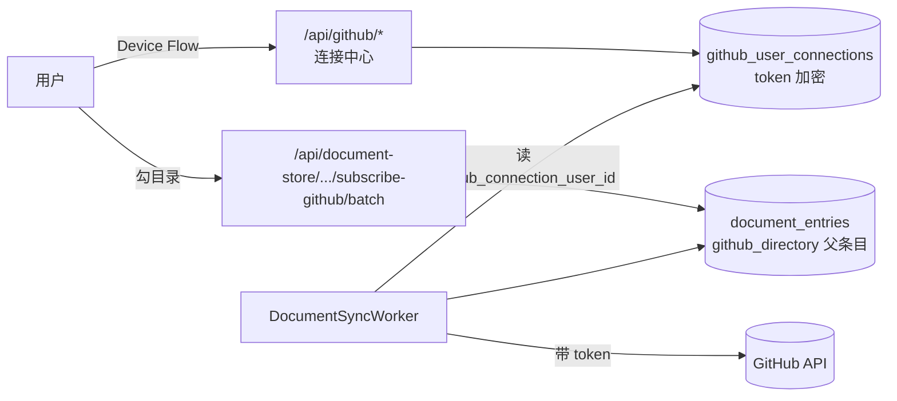

# 知识库 GitHub 目录同步 · 设计

> **版本**：v1.0 | **日期**：2026-09-09 | **状态**：已落地（待真视觉验收）

**一句话**：任何登录用户用自己的 GitHub 账号连一次，系统就把他有权限的仓库目录全扫出来、默认勾好所有 doc/docs 目录，勾完即可开启每日同步。
**谁该读**：做知识库订阅、GitHub 集成、或要复用 per-user GitHub 连接的工程师。
**读完能做什么**：说清「连接—选仓库—勾目录—开启同步」四步各由谁负责，以及默认勾选的判据是什么。

---

## 1. 管理摘要

- **解决的问题**：此前把 GitHub 目录接进知识库，用户得自己去 GitHub 找到目录、复制 `tree/分支/路径` 形式的地址、粘回订阅框，一次只能加一个目录；而且同步是**匿名**请求 GitHub，私有仓根本拉不到，公开仓也共用 60 次/小时的匿名额度。
- **核心方案**：复用已有的 per-user GitHub Device Flow 连接，新增一条共用的连接中心 `/api/github/*`（连接状态、仓库、分支、目录扫描），知识库侧提供四步向导与批量订阅端点；同步 worker 按条目上盖的连接身份带 token 请求。
- **默认口径**：递归扫出仓库里**所有** doc / docs 目录（不是只认根目录），默认勾选；用户可自由改。
- **已知边界**：见 §6，均已记入 [debt.knowledge-base.md](./debt.knowledge-base.md)。

## 2. 背景与现状

知识库早有「GitHub 目录订阅」：一个 `github_directory` 父条目记着 owner/repo/path/branch，`DocumentSyncWorker` 每天拉一次该目录下的 `.md`，按 SHA 增量更新、远端删了本地也删。能力在，入口不在——

- 入口是一个「粘贴 GitHub 地址」输入框，用户要离开产品去 GitHub 找地址（违反 `minimal-user-input`：系统查得到的值不该摆输入框）；
- 一次一个目录，一个仓库有五处文档就得重复五遍；
- 请求不带任何凭据：私有仓 404，公开仓吃匿名限额。

而 GitHub 登录能力其实早就有了（`GitHubOAuthService` 的 Device Flow + 加密存储的 `GitHubUserConnection`），只是被 pr-review / project-route-agent / tech-doc-format-agent 各抄了一份端点，知识库没份。

## 3. 用户怎么走

| 步 | 用户做什么 | 系统做什么 |
|---|---|---|
| 1 连接 | 点「连接 GitHub 并勾选目录」，在 GitHub 页面粘贴配对码 | Device Flow 发码、轮询、落库；已连接则直接跳过这一步 |
| 2 选仓库 | 搜一下、点一个仓库，需要时换分支 | 列出他有权限的仓库（含私有）与分支，默认选仓库默认分支 |
| 3 勾目录 | 看一眼，改他想改的 | 一次 Git Trees 调用扫全仓，折成目录树；**所有 doc/docs 目录已预勾**，每行显示该目录有几篇 Markdown |
| 4 开启 | 点「开启同步」 | 批量建订阅条目，2 分钟内开始首次拉取，之后每天一次 |

全程用户只提供两件系统无从得知的事：**哪个仓库**、**要不要改默认勾选**。

## 4. 默认勾选的判据

判据是纯函数（`GitHubDocDirectoryPlanner`），三条缺一不可：

1. 路径上任意一段命中忽略名单（`node_modules` / `dist` / `bin` / `vendor` …）或以 `.` 开头 → 不勾；
2. 路径上存在名为 `doc` 或 `docs` 的目录段（它自己或某个祖先）→ 命中；
3. 且该目录**直属**至少一篇 `.md`。

第 3 条是被同步引擎的形状逼出来的：同步是**单层**拉取，不递归。只勾一个空壳 `doc/`（下面全是子目录）会同步出 0 个文件，看起来像坏了；所以真正该勾的是 `doc/guide` 这种直接装着文档的目录。

判据写成纯函数而不是散在 Controller 里，是为了能被单元测试直接打红——「默认同步所有 doc 目录」是用户口径的核心，它退化成「只勾根目录」时必须在 CI 变红，而不是等人打开页面才发现。

## 5. 数据与调用流

关键字段：父条目 metadata 里新增 `github_connection_user_id`，同步时据此解出该用户的 token。没有这个字段的存量条目照旧走匿名路径，行为不变。

**去重键从 download_url 换成仓库内路径**：私有仓的 `download_url` 每次列目录都带一个新的临时 token 查询串，拿它当键会让同一个文件每轮同步都被判成「新增 + 删除」，本地历史版本一并没掉。存量条目（早期没写 `github_path`）仍用 SourceUrl 兜底，升级当天不会全量重建。

## 6. 已知边界

- 首次同步最长要等一个 worker 扫描周期（2 分钟），不是点完立刻出文档；界面已明说，但没有「立即同步」按钮直连本次批量创建的条目。
- 单次批量最多 50 个目录；超大仓库的目录清单在服务端截断（默认 600 个，优先保留推荐目录及其祖先），界面会提示截断。
- 同步仍只认 `.md` / 单层目录，未做递归同步；要覆盖子目录就把子目录也勾上。
- `github_directory` 父条目的 `IsFolder` / 子条目 `ParentId` 结构问题是历史债务（见 [debt.knowledge-base.md](./debt.knowledge-base.md)），本次未动，新旧条目形状保持一致。
- 老的三处 Device Flow 端点（pr-review / project-route-agent / tech-doc-format-agent）仍在，前端未迁；它们与新连接中心读写同一张表，连一次处处可用。

## 7. 相关

- [design.knowledge-base.store.md](./design.knowledge-base.store.md)：文档空间主设计
- [design.knowledge-base.store-sync.md](./design.knowledge-base.store-sync.md)：知识库跨环境同步（另一件事：库与库之间）
- [debt.knowledge-base.md](./debt.knowledge-base.md)：债务台账
