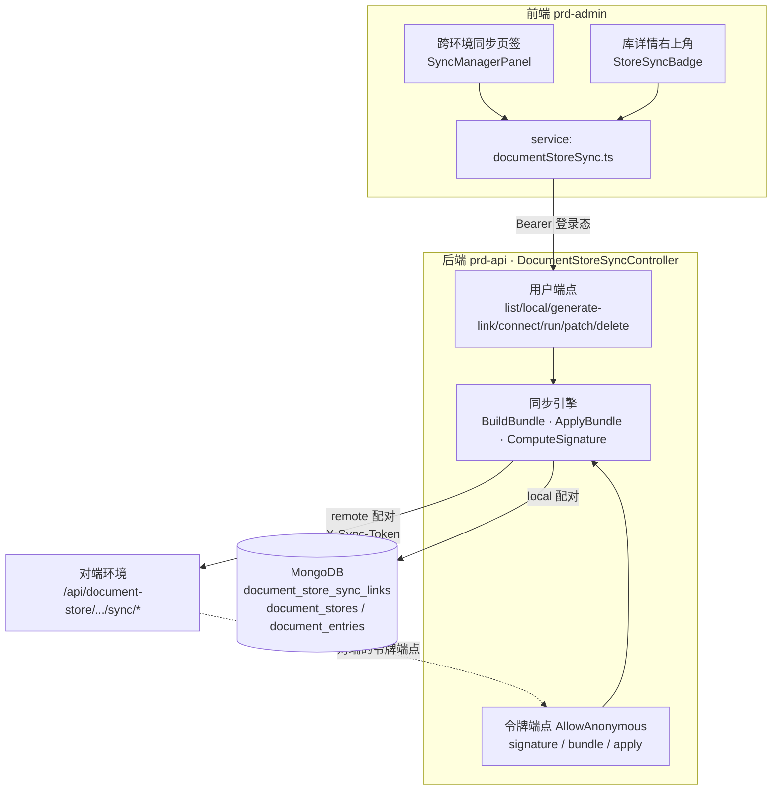
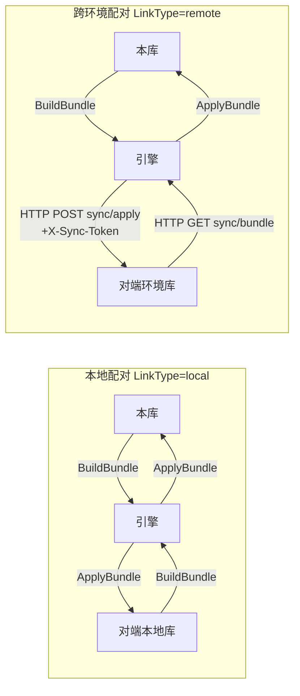
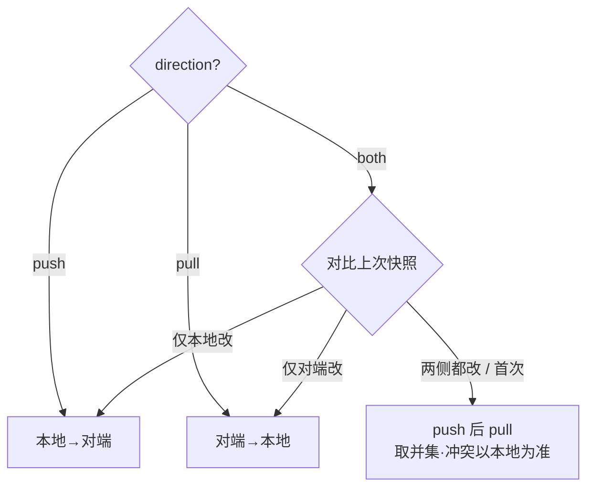

# 知识库跨环境同步 · 设计

> **版本**：v1.0 | **日期**：2026-06-04 | **状态**：已落地（本地库↔库经预览域名端到端验收通过 commit 30ea7b2；跨环境 remote 路径已部署，待双环境真实验收）
> **关联实现**：`prd-api/.../Controllers/Api/DocumentStoreSyncController.cs`、`prd-api/.../Models/DocumentStoreSyncLink.cs`、`prd-admin/.../pages/document-store/SyncManagerPanel.tsx`、`prd-admin/.../services/real/documentStoreSync.ts`
> **关联设计**：`design.knowledge-base.store.md`（知识库主设计）、`design.acceptance.kb.md` §5.C（前身：export/import + kb_sync.py CLI，本设计将其泛化为通用 UI 能力）、`debt.knowledge-base.store-sync.md`（已知边界与还款台账）
> **一句话**：把"知识库内容只能困在单个环境里"升级为"任一知识库都能和另一处的库（跨环境，或本环境另一个库）建立永久配对、一键双向同步、改了显示待同步、同步完显示对勾"。

---

## 1. 管理摘要

用户有两套部署（比如测试环境和正式环境），同一个知识库的内容要在两边保持一致；过去只能靠开发跑 `kb_sync.py` 命令行脚本搬一次，普通用户碰不到、也不知道哪边新哪边旧。

本设计把同步做成**用户可自助的界面能力**，三块构成：

1. **配对（Link）**：一方在知识库里点「生成连接链接」拿到一个**永久令牌链接**，另一方在「跨环境同步」页签粘贴即建立配对。也支持**本环境两个库直接配对**（无需令牌、无需网络），方便本地整理。
2. **同步（Sync）**：每条配对可设**单向（推/拉）或双向**；点「立即同步」按血缘幂等 upsert，重复同步不产生重复条目，内容没变直接跳过。
3. **状态（Status）**：用"上次同步的两侧签名快照"判定**哪一侧改了**——改了显示「待同步」，同步完显示「已同步」对勾；知识库详情右上角常驻同步徽章，一眼知道这个库在不在同步中。

四条设计底线，读者只需记住：

- **单库粒度**：一条配对只绑两个具体的库，令牌只授权那一个库，绝不触碰账号或其他库。
- **不丢数据**：双向冲突时按"哪侧改了"决定方向；真冲突（两侧都改）以本地为准且保留两侧各自的新增（取并集），永不删除对端条目。
- **令牌永不过期**：per-store 令牌无 TTL，杜绝"用着用着令牌过期同步突然失败"，撤销靠手动。
- **复用既有形态**：bundle 数据结构沿用 `design.acceptance.kb.md §5.C` 的 export/import，发送阶段不重算。

---

## 2. 背景与现状

知识库（文档空间）的内容此前**只活在单个环境的 MongoDB 里**：

- `design.acceptance.kb.md §5.C` 落地过 `GET /stores/{id}/export` + `POST /stores/import` 两个端点 + `kb_sync.py` 命令行，但那是**给运维/脚本用的一次性搬运**，且 import 只按 `metadata.reportId` 去重——普通文档没有 reportId，重复同步会**重复插入**。
- 没有界面入口、没有"哪边新"的判断、没有持续配对关系、没有方向控制。用户原话："我记得加过不同环境同步知识库，怎么没看到？"——因为它从来不是用户能看见的功能。

所以现状的缺口是：**有底层搬运能力，没有用户能用的同步产品**。本设计补齐这一层，并把 import 的幂等从"只认 reportId"升级为"认血缘 ID，任何文档都能重复安全同步"。

---

## 3. 产品定位与用户场景

**定位**：知识库的"内容复制 / 多环境一致性"能力，单库粒度，用户自助。

| 场景 | 用户怎么走 |
|------|-----------|
| 测试环境的知识库要搬到正式环境 | 正式环境点「生成连接链接」→ 把 skblink 发到测试环境 → 测试环境「启动链接」粘贴 → 选方向 → 立即同步 |
| 本环境两个库想合并 / 镜像 | 「启动链接」→ 选「本环境两个库」→ 选 A、B、方向 → 立即同步（无需令牌） |
| 想知道某个库是不是同步中、是否有未同步改动 | 进库详情看右上角徽章：已同步（绿勾）/ 待同步（琥珀）/ 同步出错（红） |
| 不想再同步了 | 配对列表点「撤销」；跨环境令牌可在库里「撤销令牌」让所有连入失效 |

**非目标**：不是账号级备份、不是实时协同、不搬附件二进制、不传播删除（见 §11）。

---

## 4. 核心能力

| 能力 | 说明 |
|------|------|
| 令牌链接配对 | 一方生成永久令牌链接，另一方粘贴即连。单边持令牌即可双向驱动。 |
| 本地库↔库配对 | 同环境两个库直接配对，走 DB 直读写，无网络、无令牌。 |
| 方向可设 | push（本地→对端）/ pull（对端→本地）/ both（双向）。 |
| 幂等 upsert | 血缘 ID 匹配既有条目更新而非重建；内容未变跳过。 |
| 改动检测 | 两侧签名快照对比，判定哪侧改了 → 待同步 / 已同步。 |
| 详情徽章 | 库详情右上角常驻同步状态徽章（本地配对两侧都显示）。 |

---

## 5. 架构

### 5.1 组件全景

发送阶段不重算（对齐 `compute-then-send` 规则）：计算"用哪个库、走 DB 还是 HTTP"在 RunSync 里定，BuildBundle/ApplyBundle 只搬数据。

### 5.2 两类配对的数据流

本地配对和跨环境配对**共用同一个引擎**，区别只在"对端 bundle 从哪来 / 往哪去"：

**关键洞察**：持令牌的一方（粘贴链接方）既能 BuildBundle 本地 + POST 到对端（推），也能 GET 对端 bundle + ApplyBundle 本地（拉）。所以**单边一个令牌就能双向驱动**，对端只需被动暴露令牌端点。

### 5.3 双向同步决策（不丢数据的核心）

无脑 pull+push 会用旧内容覆盖刚编辑的一侧。所以 both 方向先用"上次同步的签名快照"判断哪侧改了：

---

## 6. 数据设计

### 6.1 配对记录 `document_store_sync_links`（DocumentStoreSyncLink）

一条记录 = 一个"本库 ↔ 对端库"的持续同步关系，由发起方（持令牌/建配对者）拥有。

| 字段 | 含义 |
|------|------|
| `OwnerId` | 配对拥有者（仅 owner 可管理 / 触发） |
| `LocalStoreId` | 本地库 |
| `LinkType` | `local`（同环境两库）/ `remote`（跨环境 HTTP） |
| `Direction` | `push` / `pull` / `both` |
| `RemoteStoreId` | 对端库 ID（local 时是同环境另一库；remote 时是对端环境的库） |
| `RemoteBaseUrl` / `RemoteToken` | remote 专用：对端地址 + 永久令牌 |
| `LastSyncedAt` / `LastLocalSignature` / `LastRemoteSignature` | 上次同步成功后两侧的签名快照（改动检测依据） |
| `Status` / `LastResult` | never / synced / pending / error + 结果摘要 |

### 6.2 令牌与血缘（复用既有集合）

- **令牌**：存在 `DocumentStore.SyncToken`（每库一个，永久，可手动清空）。不新建集合。
- **血缘 ID**：存在 `DocumentEntry.Metadata["syncLineageId"]`（缺省回退条目自身 Id）。这是幂等 upsert 的匹配键——同一文档在两侧共享同一血缘，重复同步按它更新而非重建。不改 schema。

---

## 7. 接口设计

用户端点需登录（Bearer），令牌端点 `AllowAnonymous` + `X-Sync-Token` 校验（供对端环境调用）。

| 端点 | 方法 | 鉴权 | 用途 |
|------|------|------|------|
| `sync/links` | GET | 登录 | 「跨环境同步」页签：列出我的全部配对 |
| `stores/{id}/sync` | GET | 登录 | 某库的配对 + 实时状态（含本地配对反向命中，供徽章） |
| `stores/{id}/sync/local` | POST | 登录 | 建本地配对（选另一个本地库 + 方向） |
| `stores/{id}/sync/generate-link` | POST | 登录·owner | 确保 SyncToken 存在，返回编码后的 skblink 链接 |
| `stores/{id}/sync/connect` | POST | 登录 | 粘贴对方链接，探测可达后建 remote 配对 |
| `sync/{linkId}/run` | POST | 登录·owner | 触发一次同步（按方向） |
| `sync/{linkId}` | PATCH/DELETE | 登录·owner | 改方向 / 撤销配对 |
| `stores/{id}/sync/revoke-token` | POST | 登录·owner | 撤销本库令牌，所有连入失效 |
| `stores/{id}/sync/signature` | GET | 令牌 | 对端取本库签名（廉价，改动检测用） |
| `stores/{id}/sync/bundle` | GET | 令牌 | 对端拉本库 bundle（对端 pull） |
| `stores/{id}/sync/apply` | POST | 令牌 | 对端推 bundle 进本库（对端 push） |

bundle 形态沿用 `design.acceptance.kb.md §5.C`：`{version, store{...}, entries[{lineageId, parentLineageId, isFolder, title, content, metadata...}]}`。

---

## 8. 同步算法要点

1. **BuildBundle**：读本库所有条目，文本类带正文，每条算血缘 ID + 父血缘。
2. **ApplyBundle（幂等 upsert）**：按血缘索引既有条目；文件夹 parent-first 多趟建；文件类——血缘命中且内容 hash 相同则跳过（不 bump UpdatedAt，避免假"待同步"），不同则复写正文 + 元信息，未命中则新建并打血缘。
3. **ComputeSignature（廉价改动检测）**：对全库条目取 `血缘|UpdatedAt|标题|是否文件夹` 排序后 SHA256，**不加载正文**。改动检测只比签名快照，不比内容。
4. **方向判定**：见 §5.3。状态判定按方向——push 只看本地改动、pull 只看对端、both 看任一侧（避免 pull-only 链接因本地编辑误报待同步后被覆盖）。

---

## 9. 安全设计

- **最小授权**：跨环境用 per-store `SyncToken`（只放行那一个库），而非全量 `document-store:write` 密钥（会暴露用户所有库）。
- **令牌永久但可撤销**：无 TTL（满足"不允许过期"硬约束），撤销靠「撤销令牌 / 撤销配对」手动操作；令牌泄露 = 对端可读写该单库，需用户保管链接。
- **SSRF 防护**：remote 配对的对端地址过 `ISafeOutboundUrlValidator`，私网地址被拒。
- **所有权校验**：管理 / 触发端点仅 owner；本地配对要求两库都对当前用户可写。

---

## 10. 关联文档

- `design.knowledge-base.store.md` —— 知识库（文档空间）主设计，本特性是其子能力。
- `design.acceptance.kb.md` §5.C —— 前身 export/import 端点 + `kb_sync.py` CLI；本设计复用其 bundle 形态，并将"运维一次性搬运"泛化为"用户自助的持续配对同步"，且把幂等从 reportId 升级为血缘 ID。
- `debt.knowledge-base.store-sync.md` —— 本特性的已知边界与还款台账（删除传播 / 附件 / 异步化 / 条目级合并 / 教程补步）。
- 规则：`compute-then-send.md`（算/发两阶段）、`no-rootless-tree.md`（令牌只授权真实存在的单库）、`server-authority.md`（同步为服务端权威动作）。

---

## 11. 风险与已知边界

详见 `debt.knowledge-base.store-sync.md`，要点：

| 边界 | 说明 | 缓解 / 后续 |
|------|------|------------|
| 不传播删除 | 只新增/更新，永不删对端条目 | 保证不丢数据；后续可加软删除开关 |
| 只搬文本正文 | 二进制附件（PDF/图片）标 skipped | 后续接附件存储跨环境复制 |
| 双向冲突本地优先 | 两侧都改的真冲突以本地为准 | 用户已确认"不自动合并冲突"；后续可做条目级冲突可视化 |
| 库级改动检测 | 签名是整库粒度 | 两侧各改不同条目会走冲突分支而非各自合并；后续可条目级 |
| 同步阻塞调用 | run 端点同步执行（含跨环境 HTTP），大库慢 | 后续改 Run/Worker 异步 + 进度 SSE |
| 跨环境需网络互通 | 两环境要能互相 HTTP 访问 | 本地配对无此要求 |
