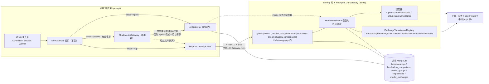
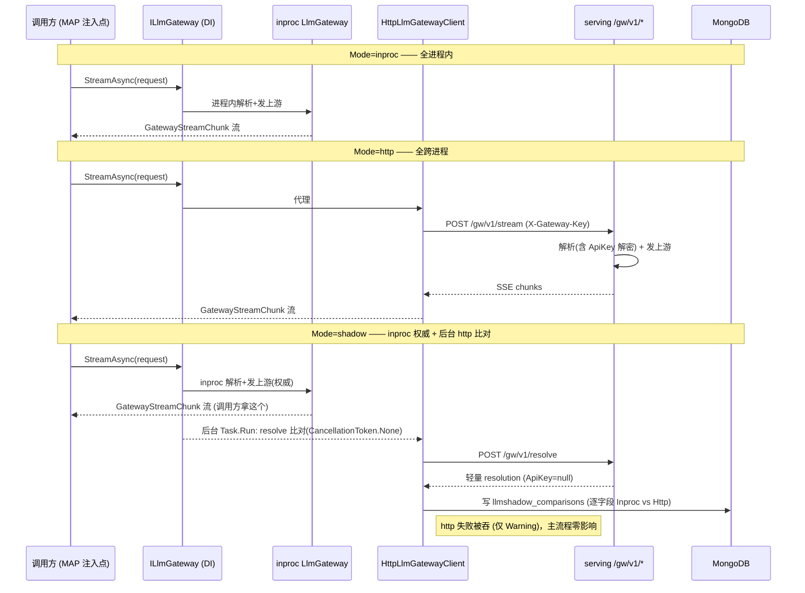
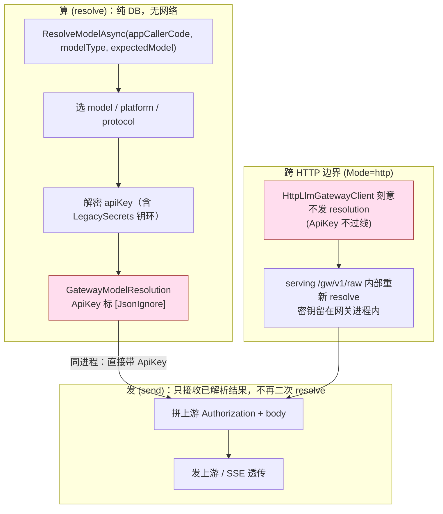
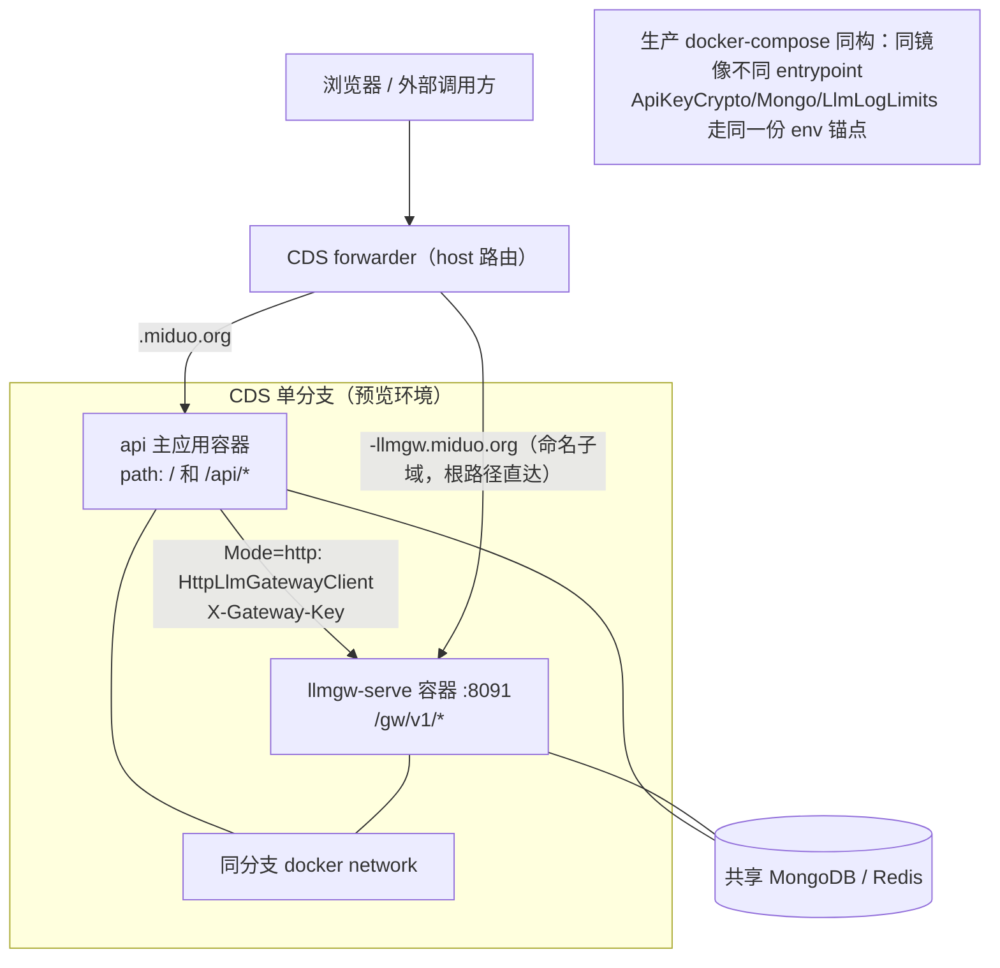
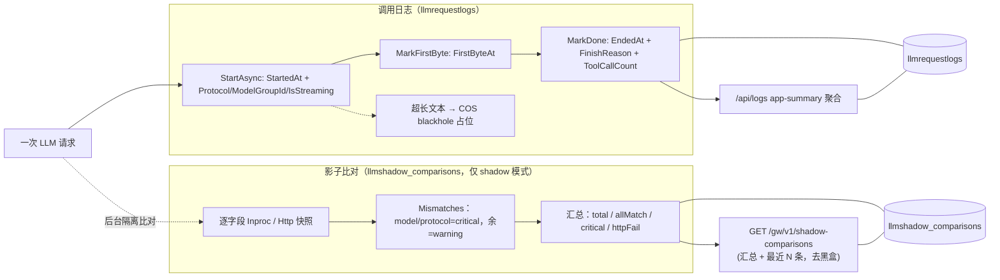

# LLM 网关物理独立设计 · 设计

> 类型: design | 状态: 开发中（阶段 0-2 影子模式 + CDS 命名子域已实现、预览真机跑通 serving resolve；灰度翻 http 待生产拍板）| owner: inernoro | 更新: 2026-06-30
> 来源: 多智能体工作流(5 路勘察 → 综合 → 2 路对抗评审 → 终稿)，两评审均判 needs-revision 并已吸收
> 关联: .claude/rules/compute-then-send.md / cross-project-isolation.md / server-authority.md / llm-gateway.md / agent-runtime-sdk-boundary.md

## 范围修订（用户确认 2026-06-27，优先级高于下文 §2.3）

用户明确：要做一个**统一的 AI 大模型网关**，把「调用 + 日志 + 分配(调度) + 模型池」整体隔离成独立服务，便于监测和改进（"在项目中不好改进"）。决策：

1. **做真跨进程（阶段 0-3 全做）**，不止步于同进程 MVP。
2. **图片链(ImageGen)纳入本初始**：`IImageGenGateway`/`OpenAIImageClient` 不再是永久非目标，而是**阶段 4 第二波**迁入同一网关——终态是覆盖 chat/text + image + 直连链的**统一网关**。安全顺序仍是先把 `ILlmGateway` 核心链跨进程跑稳(0-3)，再并入图片与直连链(4)，控制爆炸半径。
3. 直连 `new ClaudeClient/new OpenAIClient` 的 6+ 处，中期改道走网关后并入(阶段 4 同批或紧随)。

下文 §2.3 把 image/直连链列为"本期非目标"是 MVP 口径；按本修订它们是**本初始的后续阶段**，不是排除项。

All reviewer claims confirmed against the codebase: `ModelPoolHealthProbeService` is a separate BackgroundService that also writes HealthStatus (line 356) and emits `IsHealthProbe` logs; `IImageGenGateway`/`OpenAIImageClient` is a parallel image-gen chain; and `new ClaudeClient`/`new OpenAIClient` are constructed directly in ~6 places (ModelLab, Arena, Program.cs DI, ModelDomainService), each taking `ctxAccessor` and a platform `apiKey` — meaning those chains keep decrypting keys inside prd-api.

I have enough verified ground truth to produce the final vetted design.

---

# LLM 网关物理独立设计（vetted v2）

> 一句话结论：**值得做，但不是现在一把梭，而是先做"接口契约固化 + 网关项目抽离（同进程双形态）"这两个零行为变化的阶段，把承重墙裂缝在不拆进程的前提下焊死，再决定要不要真正跨进程。** 真正的物理独立收益（独立扩缩容、阻塞隔离）只对 `ILlmGateway` 这一条链成立，而系统里还有 ImageGen、ILLMClient 两条并行直连链没被覆盖——在它们归属拍板前，"平台密钥不出 prd-api"这类强声明无法成立。最小可行第一阶段（MVP）= **阶段 0 + 阶段 1**：把 5 个网关方法、ModelResolver、健康写、日志写整体收进一个独立 .NET 项目，prd-api 仍进程内 `new`，零跨进程成本、git revert 即回滚。它本身就交付"调度/日志/健康单点归属收敛"的真实价值，且为后续真正拆进程铺好可序列化契约。

---

## 1. 管理摘要

**做什么**：把 prd-api 进程内的 `LlmGateway`（1879 行）抽成一个独立的 .NET 8 服务（`prdagent-llmgw`，独立项目、可独立容器/进程），专司"模型调度 + 上游 HTTP 转发 + 流式透传 + 调用日志写入 + 健康状态写入"。prd-api 通过实现现有 `ILlmGateway` 接口的轻量 HTTP 代理调用它，**走 `GatewayLLMClient` 的调用方零改动**。

**为什么**：当前 `LlmGateway.cs` 把模型调度、密钥解密、健康管理、日志旁路、COS 上传、Exchange 中继全塞在一个类里，与业务进程共命运——一次长流式调用占用 prd-api 的线程/连接，日志写库阻塞拖慢业务，网关无法独立扩缩容/灰度。

**代价与边界修正（吸收评审）**：这次拆分有四处**承重墙级**的真实成本，v1 要么误判要么遗漏，本版逐一修正：

1. **resolve 归属是承重墙，不是细节**。`OpenApiController`、`ImageGenController` 等 raw 调用方今天先在 prd-api 侧 `ResolveModelAsync`（为了"消耗配额前判成功"和 badge 预解析），再把含已解密 `ApiKey` 的 `GatewayModelResolution` 传给 `SendRawWithResolutionAsync`。但 `GatewayResponse.cs` 把 `ApiKey/ExchangeAuthScheme/ExchangeTransformerConfig` 标了 `[JsonIgnore]`——过 HTTP 后网关收到的 resolution 必然 `ApiKey=null`，只能在发送阶段二次 Resolve，**这正是 `compute-then-send.md` 删掉 `ExpectedModelRespectingResolver` 才根治的"选 A 给 B"反模式**。本版强制规定：**resolve 全部在网关侧发生**，prd-api 拿一个不含 ApiKey 的轻量 `/gw/resolve` 只做配额闸门与 badge（见 §3.3）。

2. **健康状态从来不是单点写**。代码里 `model_groups.Models[].HealthStatus` 至少有两个独立写入方：`ModelResolver.RecordSuccess/FailureAsync`（gateway 栈内）和 `ModelPoolHealthProbeService`（独立 BackgroundService，`ModelPoolHealthProbeService.cs:356` 写 `HealthStatus=Healthy`）。v1"单点写入、根除双写"的核心正确性论据是错的。本版把**探活服务一并迁入网关**，并把 `RecordFailureAsync` 的 read-modify-write 改为原子 CAS（见 §3.2 / §7）。

3. **日志队列是进程内 static Channel，灰度混跑会制造孤儿 running 记录**。`LlmLogQueue.Queue` 是 `static readonly Channel`，`MarkDone/MarkFirstByte` 必须投递到与 `StartAsync InsertOne` 同一进程的 reader；两个 `Watchdog` 同扫一个集合会互杀对方在途的长流式请求（>300s reasoning 模型）。本版把灰度策略从"按 AppCallerCode 在两进程混跑"改为"**日志写 100% 由网关承接、prd-api 侧 Watchdog 在 http 模式关闭**"（见 §4 / §6）。

4. **物理独立只覆盖 `ILlmGateway` 一条链**。系统里还有 `IImageGenGateway`/`OpenAIImageClient`（生图主流程，视觉创作走它）和直接 `new ClaudeClient/new OpenAIClient`（ModelLab/Arena/Program.cs DI/ModelDomainService 共 6+ 处，各自读 `ctxAccessor` + 持平台 `apiKey`）两条**并行直连链**。它们拆分后仍在 prd-api 进程内解密密钥、直连上游。本版**撤回 v1"明文密钥永不出 prd-api"的过宽声明**，改为"明文密钥永不过 prd-api↔网关的 HTTP 边界"，并把这两条链显式列为**本期非目标 + 已登记债务**（见 §2.3 / §3.4）。

**另一处事实修正**：v1 §8 开放问题 4 把"`ApiKeyCrypto:Secret` 解耦"列为待办前置——但代码里它**已落地**（`Program.cs:673` 读独立配置项，`PlatformKeyIntegrityWorker` 已自动重加密存量密文、`LegacySecrets` 钥环兜底）。真正要做的只是"确认网关容器注入同一份 `ApiKeyCrypto:Secret` + `LegacySecrets`"，不是去做解耦。

---

## 架构图（actual 实现态）

> 本节为已落地实现态的五张全景图，给没参与开发的读者一个"网关从 MAP 剥离"的整体心智。
> 与下文 §3-§8 的"设计/规划口径"对照阅读：影子（shadow）模式、CDS 命名子域、影子读端点都已落地，
> 实现细节与设计文本的差异（端点是 `/gw/v1/*` 而非 `/gw/*`、serving 端口 8091、鉴权头 `X-Gateway-Key`、
> 配置键 `LlmGateway:ServeBaseUrl` / `LlmGwServe:ApiKey`、新增 `client-stream` 与 `shadow-comparisons` 端点）
> 以本节与源码为准。三态由 `LlmGateway:Mode`（`inproc` | `http` | `shadow`）+ `HttpAppCallerAllowlist` 灰度白名单驱动。

### 图 1：组件 / 拓扑（MAP ↔ serving 网关 ↔ 上游）

MAP 进程内约 48 个 LLM 调用注入点全部依赖**不变的** `ILlmGateway` 接口，DI 按 `Mode` 注入三种实现之一。`inproc` 直接用进程内 `LlmGateway`；`http` 走 `HttpLlmGatewayClient` 跨进程打 serving 的 `/gw/v1/*`；`shadow`（或仅配了白名单）走 `ShadowLlmGateway` 路由器（白名单命中走 http 权威、否则 inproc 权威 + 后台影子比对）。serving 进程内是同一套 `ModelResolver`/模型池/适配器/转换器实现（同代码迁过去，不重写）。MAP 与 serving **共享同一个 MongoDB**，serving 独占写日志/影子/模型池配置集合。



### 图 2：三态时序（inproc / http / shadow 同一调用的路径对比）

同一个调用在三种 Mode 下分叉。`inproc` 全程进程内。`http` 全程跨进程到 serving。`shadow` 是关键：**caller 永远拿 inproc 的权威结果**，serving 的 http 调用只在后台 `Task.Run` 里做 resolve 比对并落 `llmshadow_comparisons`；http 失败被 `try/catch` 吞掉（仅 Warning），主流程零影响。这正是"灰度翻 http 前先攒一致性证据、又不冒险、不二次打大模型"的设计。



### 图 3：compute-then-send（算 / 发两阶段，ApiKey 不过线）

resolve 阶段是纯 DB 查询（选 model/platform/protocol/apiKey），send 阶段只接收已解析结果发上游。跨 HTTP 边界时，`GatewayModelResolution.ApiKey` 标了 `[JsonIgnore]` 不过线——所以 `HttpLlmGatewayClient.SendRawWithResolutionAsync` 刻意**不**把 resolution 发给 serving，而是 serving 在 `/gw/v1/raw` 内部**重新 resolve 一次**（含 ApiKey 解密），把密钥牢牢留在网关进程内。serving 一侧 resolve→send 顺序执行、不存在跨兄弟调用的二次覆盖，因此不复活"选 A 给 B"。



### 图 4：部署（CDS 单分支多容器 + 主应用域名 + 命名子域）

一个预览分支起两个容器：api 主应用 + `llmgw-serve:8091`。主应用走 `<slug>.miduo.org`（path `/` 和 `/api/*` 都打 api）。serving 通过 BuildProfile 声明 `subdomain` 拿到**命名子域** `<slug>-llmgw.miduo.org`，forwarder 把该 host 根路径直达 serving 容器（不埋在主应用 `/gw/v1` 路径下）——见 `forwarder-route-publisher.ts` 的命名子域路由（`<previewSlug>-<sub>.<root>`）。生产 docker-compose 同构：api + llmgw 两个 service，同镜像不同 entrypoint，共享 env 锚点防配置漂移。



### 图 5：数据流 + 观测（落 llmrequestlogs + 影子落 llmshadow_comparisons + 读端点）

一次正常请求由 serving（或 inproc）写 `llmrequestlogs`：`StartAsync` 落 StartedAt + 调度元信息，流式首字回填 `FirstByteAt`，结束写 `EndedAt`/FinishReason/ToolCallCount，超大文本走 COS blackhole 占位；`/api/logs` 的 app-summary 在这之上聚合。影子比对另落 `llmshadow_comparisons`：每条带逐字段 `Inproc`/`Http` 快照 + `Mismatches`（model/protocol 漂移=critical），读端点 `/gw/v1/shadow-comparisons` 给汇总（total/allMatch/critical/httpFail）+ 最近 N 条，是灰度翻 http 前"去黑盒"的观测窗口。



---

## 2. 目标与非目标

### 2.1 物理独立的程度（明确边界）

| 维度 | 目标 |
|------|------|
| 进程 | 独立可执行项目 `PrdAgent.LlmGateway`（独立 `Program.cs`）。阶段 0/1 prd-api 仍进程内 `new`；阶段 2+ 才真正跨进程 |
| 容器 | 独立容器 `llmgw`，**同一 Git commit / 同一镜像、不同 entrypoint**（杜绝版本漂移） |
| 部署单元 | 独立 compose service，可独立重启/扩缩容 |
| 数据 | 网关**自连同一个 MongoDB**（同连接串、同库），独占 `llmplatforms / llmmodels / model_groups / model_exchanges / llm_app_callers / llmrequestlogs` 这 6 个集合的**写**；读侧 prd-api 仍可查（同库零改动，见 §4.2） |
| 网络 | 仅在 `prdagent-network` 内监听（如 8090），**不对公网暴露** |
| 覆盖范围 | **仅 `ILlmGateway` 链**。`IImageGenGateway`、直连 `ILLMClient` 链本期不迁（见 §2.3） |

### 2.2 目标

- `ILlmGateway` 的 5 能力（`ResolveModelAsync / SendAsync / StreamAsync / SendRawWithResolutionAsync / GetAvailablePoolsAsync`）迁到独立服务。
- 走 `GatewayLLMClient` 的调用方代码保持接口不变，靠注入 HTTP 代理透明切换。
- 调用日志字段完整性不退化——承接刚修好的 Protocol/FinishReason/IsStreaming/ToolCallCount（下称"C′ 修复"），且**网关单进程闭环写**。
- 健康状态写收敛为**网关侧单一真相源 + 原子 CAS**：`RecordFailureAsync`、`ModelPoolHealthProbeService` 都在网关，阈值逻辑（5→Unavailable / 3→Degraded）只在网关一处。

### 2.3 非目标（本次不做，且显式承认其后果）

- **不**迁 `IImageGenGateway`/`OpenAIImageClient`（生图链）。后果：生图主流程仍在 prd-api 进程内、仍在 prd-api 侧解密密钥。登记 `debt.llm-gateway-isolation.md`，作为"网关物理独立第二波"候选。
- **不**迁直接 `new ClaudeClient/new OpenAIClient` 的 6+ 处直连（ModelLab/Arena/Program.cs/ModelDomainService）。后果同上。**建议中期把这些直连改道走 `ILlmGateway`**，否则物理独立永远是半张皮。
- **不**拆成多语言微服务，仍是 .NET 8。
- **不**改 `ModelResolver` 的 4 层调度算法和阈值（原样整体搬，不重写、不拆分）。
- **不**让前端直连网关（明确排除，是 §3.5 userId 信任模型成立的前提）。
- **不**引入 gRPC/MQ 作为 MVP 传输（HTTP/1.1 + chunked SSE 起步）。
- **不**拆 `OpenApiController`、`IOpenApiUsageService`（限流配额）、`LlmLogsController`（日志查询页）——留 prd-api。
- **不**动 `model_exchanges` 的 Transformer 算法，连同 `ExchangeTransformerRegistry` 一起搬进网关。

---

## 3. 边界设计

### 3.1 对外 API 契约（网关暴露给 prd-api）

```
POST /gw/resolve     → 预解析（无网络、不含 ApiKey），对应 ResolveModelAsync
POST /gw/send        → 非流式，对应 SendAsync
POST /gw/stream      → 流式（SSE，带单调 seq），对应 StreamAsync
POST /gw/raw         → 原始 HTTP/multipart/Exchange 中继，对应 SendRawWithResolutionAsync
GET  /gw/pools       → 可用池，对应 GetAvailablePoolsAsync
GET  /gw/healthz     → 容器健康检查
```

#### 请求体统一信封

复用**已存在的** `GatewayRequest.Context`（`GatewayRequestContext`，`GatewayRequest.cs:118`）。无需新发明 DTO——gateway 内部本就只读 `request.Context?.UserId`（不回填 AsyncLocal）。

```jsonc
// POST /gw/stream
{
  "request": { /* 原 GatewayRequest，含已就位的 Context 字段 */
    "appCallerCode": "visual-agent.chat::chat",
    "modelType": "chat",
    "expectedModel": "anthropic/claude-sonnet-4-6",
    "messages": [...],
    "requestBody": { "temperature": 0.7, "include_reasoning": true },
    "includeThinking": true,
    "context": {
      "requestId": "a1b2...", "userId": "u_123", "sessionId": "s_456",
      "groupId": null, "viewRole": null, "documentHash": null,
      "systemPromptRedacted": null, "requestType": "chat"
    }
  }
}
```

#### `/gw/raw` 大负载：引用而非内联（吸收评审）

`GatewayRawRequest.MultipartFiles` 的实际类型是 `Dictionary<string,(string FileName, byte[] Content, string MimeType)>`，调用方（`VideoToDocRunWorker`、`TranscriptRunWorker`、`SubtitleGenerationProcessor`）传的是整段音/视频字节（ASR 输入，数 MB~数十 MB）。**禁止 base64 内联进 JSON**（膨胀约 33%、整体两次进内存）。改为：

- prd-api 先把字节存进**共享对象存储/COS** 拿到引用 key，`/gw/raw` 只传 `{ refKey, fileName, mimeType }`；
- 网关从同一 COS 拉字节，在进程内拼 multipart 发上游。
- 小负载（<256KB，如纯文本 messages）仍走内联，避免一次 COS 往返。
- ValueTuple 不直接序列化，契约里用具名 DTO `MultipartFileRef { RefKey, FileName, MimeType }`。

#### 响应

- `/gw/send`：`200 application/json` = 现有 `GatewayResponse`（`Model/Platform/Usage/ToolCalls/FinishReason`），且**回传网关生成的 `logId`**。
- `/gw/stream`：`200 text/event-stream`，逐块转发 `GatewayStreamChunk` 的 JSON，**每个事件带单调 `seq`**（用于断线续传，见 §3.6）：
  ```
  event: chunk
  data: {"seq":1,"type":"Start","logId":"...","resolution":{"model":"...","platform":"OpenRouter"}}

  event: chunk
  data: {"seq":2,"type":"Thinking","content":"..."}

  event: chunk
  data: {"seq":3,"type":"Text","content":"..."}

  event: chunk
  data: {"seq":9,"type":"Done","finishReason":"stop","toolCalls":[...]}

  : keepalive    ← 每 10s 心跳
  ```
- `/gw/raw`：见 §3.7（Exchange 异步轮询的连接语义已修正，不再声称"省掉长连接"）。

#### prd-api 侧代理实现

新增 `HttpLlmGatewayClient : ILlmGateway`（Infrastructure 层），DI 注册替换 `LlmGateway`。`StreamAsync` 内部用 `HttpClient` + `HttpCompletionOption.ResponseHeadersRead` 逐行读 SSE 反序列化为 `GatewayStreamChunk` yield。`CreateClient()` 返回的 `GatewayLLMClient` 内部也持这个 HTTP 代理。

### 3.2 网关连不连 Mongo（决策：连）+ 健康写收敛

**决策：网关自连同一个 MongoDB**，独占 6 个集合的写。理由同 v1（调度 4 层依赖实时查全套配置；拆"prd-api 预查传配置"会引入二次解析风险）。

**健康写收敛（修正 v1 的事实错误）**：
- `ModelResolver.RecordSuccess/FailureAsync` **和** `ModelPoolHealthProbeService` **一并迁入网关**——这是迁移清单的硬性补项，v1 漏了后者。
- `RecordFailureAsync` 当前是 read-modify-write（先 `Find` 再算 `newFailures` 再 `UpdateOne`），跨进程/多实例并发会丢更新、阈值被探活 reset 覆盖。**改为原子操作**：用 `$inc` 递增 `ConsecutiveFailures` + 条件 `UpdateOne`（filter 带期望版本号/当前状态）一步算出 `HealthStatus`，或 `findAndModify`。验收必须断言：**两路并发对同一模型打失败，`ConsecutiveFailures` 精确递增不丢**。
- 探活服务迁网关后，其探活 LLM 请求由**网关自发**（仍打 `IsHealthProbe=true` 日志，落网关侧）。

### 3.3 resolve 归属（承重墙，本版核心修正）

**规则：resolve 只在网关侧发生。prd-api 不再调 `ResolveModelAsync` 后直接 send/stream。**

- `/gw/resolve` 返回**轻量 resolution**：`{ model, platform, success, reason, modelGroupId, isFallback }`——**不含 `ApiKey`**（维持 `[JsonIgnore]`）。
- `OpenApiController`"先判 success 再占配额"：调 `/gw/resolve` 拿 `success/reason` 做配额闸门 + badge；真正的 send 走 `/gw/send|stream`，网关**内部再拿一次含 ApiKey 的完整 resolution**，一次到位发上游。
  - 这不违反 `compute-then-send.md`：发送侧确实"接收已解析结果不再二次 resolve"的精神被保留在**网关进程内**（resolve→send 在网关一侧顺序执行，不存在跨兄弟调用的二次覆盖）；prd-api 侧那次 `/gw/resolve` 是纯配额/可视化用途，不参与发送。
  - 代价：网关对同一请求会 resolve 两次（prd-api 配额闸一次、send 一次）。两次都是无网络的配置查询（毫秒级），可接受；若要省，可让 `/gw/resolve` 返回一个短 TTL 的 `resolutionToken`，`/gw/send` 带 token 复用缓存结果——列为优化项，非 MVP。
- `ImageGenController` 的预解析 badge 同理走 `/gw/resolve`。

### 3.4 平台密钥安全过界（声明已收窄）

**原则：明文密钥永不过 prd-api↔网关的 HTTP 边界。**（注意：不再声称"永不出 prd-api"——见 §2.3，ImageGen/ILLMClient 直连链仍在 prd-api 解密。）

- 网关持有同一份 `ApiKeyCrypto:Secret` + `ApiKeyCrypto:LegacySecrets`（**已是独立配置项，无需解耦**），自己读 `llmplatforms.ApiKeyEncrypted` / `model_exchanges.TargetApiKeyEncrypted` 解密，直接拼上游 `Authorization` 发出去。
- `GatewayModelResolution.ApiKey` 维持 `[JsonIgnore]`；`/gw/resolve` 返回的轻量 resolution 本就不含它。
- **密钥/配置同步是阻塞前置（不是开放问题）**：网关与 prd-api 必须逐项对齐 `ApiKeyCrypto:Secret`、`Mongo:ConnectionString`、`LlmLogLimits`（截断阈值）。任一不一致即 `cross-project-isolation.md` 通道 2 类事故（解密失败→模型池静默 401，或同一 /logs 页截断阈值不一致）。`PlatformKeyIntegrityWorker` 须在**网关侧也跑**自检。

### 3.5 鉴权方案

1. **prd-api → 网关**（M2M）：`X-Gw-Auth: <token>`（环境变量注入），网络层靠 Docker 网络隔离 + 网关不暴露公网兜底。MVP 不强制 mTLS（开放问题）。
2. **UserId 信任**：网关不独立校验 JWT，信任 `context.userId`（请求已过 prd-api 的 `AdminPermissionMiddleware` / `AuthenticationSchemes=ApiKey`）。前提：网关端口对前端不可达（已满足）。
   - OpenApiController 外部流量：先过 prd-api ApiKey 鉴权 + `IOpenApiUsageService` 限流，再以 prd-api 身份调网关，`context.userId` = key 绑定的 user。限流配额逻辑全留 prd-api。
   - **CDS 预览环境的 userId 串户是准入阻塞项，不是 debt（吸收评审）**：同项目多分支共享 `cds-proj-${id}` 网络，`llmgw` 别名 round-robin 会让 A 分支 prd-api 连到 B 分支 llmgw，带着 A 的 userId 串户、健康状态串池。处置：**预览环境在分支前缀别名做掉之前，强制 `LlmGateway__Mode=inproc` 兜底**（生产/独立部署才开 http）。这条直接关系观测数据租户正确性，不允许挂在债务台账上。

### 3.6 / 3.7 见 §3 续（流式续传 + Exchange 连接语义）——并入下方

**§3.6 网关→prd-api 这一跳的断线语义（v1 遗漏，吸收评审）**

注意：v1 §2.2 说网关"承接 afterSeq 断线续传"是**误判**——`ILlmGateway` 从来只 `yield IAsyncEnumerable<GatewayStreamChunk>`，afterSeq/Run-Worker 续传在 per-feature 控制器（`PrReviewController.StreamLlmWithHeartbeatAsync`、`ChatService` Run-Worker），不在网关。新增"网关→prd-api"这一跳后：

- 按 `server-authority.md`，prd-api 这条 HTTP 断开**不取消网关任务**（网关用 `CancellationToken.None` 跑完上游、落库、写健康）。
- 为让 prd-api 重连能 catch-up：`/gw/stream` 事件带单调 `seq`，网关侧维护**短时 replay buffer**（如最近 N 条 / 最近 T 秒，进程内内存即可），prd-api 重连带 `?afterSeq=` 续传。
- 兜底：即便 replay buffer 已淘汰，用户侧的 afterSeq 续传仍能从**已落库的 `llmrequestlogs` / Run 记录**恢复最终结果，不单纯依赖这条 HTTP。
- MVP 可先实现"不续传 + 文档化"：prd-api 断开即放弃本次 HTTP 结果，但网关跑完落库，用户侧 Run-Worker 从库恢复。replay buffer 列为紧随其后的增强。

**§3.7 Exchange 异步轮询的连接语义（修正 v1 不实收益声明）**

`model_exchanges` 异步 Exchange（`LlmGateway.cs` 内 `while(pollAttempt<Max){ await Task.Delay(...) }`，豆包 ASR 可轮询数分钟）迁网关后：

- **撤回 v1"不让 prd-api 持长连接轮询"的收益声明**——一次同步 `/gw/raw` 要等网关轮询数分钟，prd-api 那条 `HttpClient` 连接照样被占满数分钟，只是从"轮询循环"换成"等响应"，**没省掉长连接**。
- 真正的处置二选一（拍板项，见决策清单）：
  - **A（MVP，简单）**：`/gw/raw` 同步阻塞等网关轮询完成；prd-api 侧 `HttpClient` 超时设为大于上游最大轮询时长；明确 `CancellationToken` **不**随 prd-api HTTP 超时传播打断网关轮询（网关用 `CancellationToken.None` 跑）。收益仅"轮询的 CPU/内存在网关进程"，不省连接。
  - **B（推荐中期）**：`/gw/raw` 改 submit→`202 + jobId`，prd-api 短轮询 `/gw/raw/status/:jobId` 或经 SSE 拿结果。真正释放 prd-api 长连接，但要建 job 状态存储。

### 3.8 上下文跨进程（修正 v1 "零额外工作" 的低估）

- **AppCallerCode/ModelType/expectedModel/Context**：本就在 `GatewayRequest` 里，随 `request` 过界，零额外工作。
- **真实缺口（吸收评审）**：代码里约 109 处 `new GatewayRequest`，只有约 44 处设了 `.Context`——即今天就有约 65 个直连调用方 `UserId=null`。这些直连调用方**不经 `GatewayLLMClient`**（只有 `GatewayLLMClient.cs:94` 那条链读 AsyncLocal），代理无从在它们身上读 scope。处置：
  - 统一要求所有 LLM 调用方**经 `GatewayLLMClient` 或在代理层统一补 Context**（一次性重构，非零改动）；
  - **顺带核对这 65 处今天的 `UserId` 是否本就为空**——若本就为空且功能正常，说明访问控制并不强依赖它，则 §3.5"网关信任 context.userId 做访问控制"的前提需重新论证（可能这些是内部 orchestration / 健康探针，本就豁免）。
  - 这把 v1 §3.3 标的"零额外工作"修正为"一项明确的调用方收口重构"，纳入阶段 1 工作量。

---

## 4. 观测性（日志由谁写、写哪、字段不丢）

**决策：日志由网关写**（`llmrequestlogs` 写归网关），且**日志写 100% 在网关一进程闭环**（吸收评审：static Channel 不能跨进程，灰度不得在两进程混跑日志）。

### 4.1 写入链路（迁移后）

```
网关 SendAsync/StreamAsync
  → LlmRequestLogWriter.StartAsync()  [网关内, InsertOne, 生成 logId]
       写: Protocol / ResolutionReason / ModelResolutionType / ModelGroupId
           / IsStreaming / IsExchange / ExchangeId / IsHealthProbe
  → 执行上游 HTTP / SSE
  → MarkFirstByte   [网关内 static Channel + Background reader]
  → MarkDone: FinishReason / ResponseToolCalls / ToolCallCount   ← C′ 字段
  → MarkError
```

- `LlmRequestLogWriter / LlmRequestLogBackground / LlmLogQueue（无界 Channel + 重试 100/300/1000/2000/5000ms）/ LlmRequestLogWatchdog`**整体迁入网关**。
- **硬约束（吸收评审）**：`MarkDone/MarkFirstByte` 的队列投递必须与 `StartAsync InsertOne` **同进程**。因此灰度期**禁止**"按 AppCallerCode 在 prd-api inproc 与网关 http 混跑日志"：
  - 灰度统一为 **网关 100% 承接日志写**（inproc 模式也调网关 writer，或灰度期 prd-api 不写日志只透传 logId）；
  - **同一时间只允许一个 Watchdog 运行**（网关侧），prd-api 侧 Watchdog 在 http 模式关闭——否则两个 Watchdog 同扫一个集合，会把对方在途的 >300s 长流式误标 TIMEOUT/failed。
- **logId 单点生成**：网关生成 Guid，经 `/gw/send` 响应 + `Start` chunk 回传。prd-api 不预生成，根除"两端各生一份"。
- **COS 长文本上传**（`ProcessJsonStringValuesForCosAsync`，超 1024 字符 →`[TEXT_COS:...]`，base64 图 →`[BASE64_IMAGE:...]`）：写侧 `IAssetStorage` + `AppDomainPaths.DomainLogs` **迁网关**，COS 失败降级截断（原行为）。

### 4.2 读取链路（留 prd-api）

- `LlmLogsController`（`/api/logs/llm`、`model-stats`、`timeseries`、`sessions`、replay-curl）留 prd-api。因读写连同一库同一集合，读侧零改动。
- `AppCallerRegistrationService`（显示名）留 prd-api。
- **COS 读写归属裁决（修正 v1 的"双持有洁癖折中"含糊）**：写在网关（§4.1）。replay-curl 的 COS 反查走**网关只读恢复接口**（如 `GET /gw/cos/:key`），prd-api 不持 COS 写、不双持 `AppDomainPaths.DomainLogs` 写命名空间——单一写归属，避免两进程对同一 COS 路径双写。MVP 若嫌多一跳，可让 prd-api 持**只读** `IAssetStorage`（只读不写），明确"写永远在网关"。二选一在实施时按 COS SDK 是否支持纯读句柄定。

### 4.3 字段完整性保证（C′，落成可执行断言）

阶段 3 硬门禁，逐字段断言（吸收评审，加强为"与 inproc 基线逐字段相等 + 无孤儿"）：

- 跑一次真实流式 + 一次 tool_calls + 一次 Exchange，断言对应 `llmrequestlogs` 记录的 `Protocol`、`IsStreaming`、`FinishReason`、`ToolCallCount`/`ResponseToolCalls`、`firstByteAt`、`ResolutionReason`、`ModelResolutionType`、`ModelGroupId` **全部非空，且与 inproc 基线逐字段相等**。
- **补一条"灰度混跑不产生孤儿 running"断言**：跑 N 个并发请求后扫 `status=running` 数应为 0（验证 logId 投递与 InsertOne 同进程、Watchdog 不互杀）。

---

## 5. 部署

### 5.1 docker-compose（生产）

```yaml
llmgw:
  image: ghcr.io/inernoro/prdagent-server:latest   # 同镜像, 不同 entrypoint
  command: ["dotnet", "PrdAgent.LlmGateway.dll"]
  environment:
    - ASPNETCORE_URLS=http://+:8090
    - Mongo__ConnectionString=${MONGO_CONN}          # 自连同一库
    - ApiKeyCrypto__Secret=${APIKEY_CRYPTO_SECRET}   # 已是独立配置项, 须与 api 一致
    - ApiKeyCrypto__LegacySecrets=${APIKEY_CRYPTO_LEGACY}  # 钥环须与 api 一致
    - GwAuth__Token=${GW_AUTH_TOKEN}
    - LlmLogLimits__RequestBodyMaxChars=${LOG_REQ_MAX}    # 须与 api 一致, 防 /logs 截断不一致
  depends_on: [mongodb, redis]
  networks: [prdagent-network]
  read_only: true
  tmpfs: [/tmp]
  # 不映射 ports —— 仅内网

api:
  environment:
    - LlmGateway__BaseUrl=http://llmgw:8090
    - LlmGateway__AuthToken=${GW_AUTH_TOKEN}
    - LlmGateway__Mode=http        # 生产 http; 预览环境强制 inproc (见 §3.5)
  depends_on: [mongodb, redis, llmgw]
```

- 启动顺序 `mongodb/redis → llmgw → api`；`HttpLlmGatewayClient` 带超时+熔断+重试（启动期网关未就绪优雅降级/快速失败带告警）。
- **配置漂移防线**：同镜像同 commit 防版本漂移，但**不防配置漂移**——`ApiKeyCrypto:Secret`/`LegacySecrets`/`Mongo`/`LlmLogLimits` 必须逐项对齐，建议用同一份 env 文件 / compose `&shared-llm-env` 锚点注入两个 service，杜绝手抄不一致。nginx 不变（外部流量仍进 api，llmgw 不对外）。

### 5.2 CDS compose（预览）

- `cds-compose.yml` 新增 `llmgw` 为应用 service。
- **命名子域已落地**：serving 通过 BuildProfile 的 `subdomain` 拿到 `<previewSlug>-llmgw.<root>` 命名子域，forwarder 把该 host 根路径直达 serving 容器（**已实现**，见 `cds/src/services/forwarder-route-publisher.ts` 的命名子域路由分支 `<previewSlug>-<sub>.<root>`）。这让"可被别人调用"的网关有区别于主应用域名的入口，而不是埋在主应用 `/gw/v1` 路径下。
- **DNS 串台是准入阻塞（§3.5），非 debt**：预览环境在"分支前缀别名"治理落地前，`LlmGateway__Mode=inproc` 强制兜底；治理落地后才允许 http。这条同时防 userId 串户与 `GW_AUTH_TOKEN` 被同 commit 邻分支照单全收。
- 资源开销：每分支多约 +150MB 内存（http 模式时；inproc 兜底则无额外容器）。

### 5.3 服务间通信

- prd-api ↔ llmgw：HTTP/1.1（含 chunked SSE），内网无 TLS（靠网络隔离）。
- SSE 透传：llmgw 侧 `Content-Type: text/event-stream` + 不缓冲；api 与 llmgw 之间无 nginx，Kestrel 默认即可。

---

## 6. 分阶段迁移方案（每阶段标注"可独立上线"判据 + 回滚点）

**安全顺序：先抽接口契约 → 再搬实现（同进程双形态）→ 最后切流量。**

### 阶段 0：接口契约固化（进程内，零行为变化）

- 确认 `GatewayRequest`/`GatewayResponse`/`GatewayStreamChunk`/`GatewayRawRequest`/`GatewayModelResolution` 全部可干净 JSON 序列化（敏感字段 `[JsonIgnore]` 已就位）。
- 为 `/gw/raw` 定义具名 `MultipartFileRef` DTO（替 ValueTuple+byte[]，§3.1）。
- 为 `/gw/stream` 在 `GatewayStreamChunk` 加 `seq` 字段（§3.6）。
- **核对**：约 65 个未设 `.Context` 的调用方今天 `UserId` 是否本就为空（§3.8），决定收口范围。
- **可独立上线判据**：是。纯类型/契约调整，运行时行为不变，全部走进程内 AsyncLocal。
- **回滚点**：`git revert`，无数据/部署变更。

### 阶段 1（MVP 终点）：抽出网关项目（同进程双形态）+ 归属收敛

- 新建 `PrdAgent.LlmGateway` 可执行项目，**移入**：`LlmGateway.cs`、`ModelResolver.cs`（含健康写，改原子 CAS）、`ModelPoolHealthProbeService.cs`（补迁，v1 漏项）、`GatewayLLMClient.cs`、`ExchangeTransformerRegistry`、`LlmRequestLogWriter/Background/Watchdog`、`ApiKeyCryptoKeyRing` 写路径。
- prd-api 仍**进程内直接 new**，不走 HTTP。
- 收口调用方 Context（§3.8）：统一经 `GatewayLLMClient` 或代理层补 Context。
- **此阶段已交付真实价值**：调度/健康/日志写单点归属收敛、健康写改原子 CAS（消除丢更新）、探活与失败写同源——即便永不跨进程也值得。
- **可独立上线判据**：是。代码归属变了，运行时仍单进程，行为不变（健康写从 read-modify-write 改 CAS 需回归断言并发计数）。
- **回滚点**：`git revert`。

### 阶段 2：HTTP 代理 + 网关进程就绪（影子模式）—— 已落地

> 实现态对照（与本节规划口径的差异以代码为准）：serving 端口为 **8091**；端点为 **`/gw/v1/*` 共 8 个**（`healthz/resolve/send/stream/raw/pools/client-stream/shadow-comparisons`，比规划的 6 个多了 `client-stream` 与影子读端点）；鉴权头是 **`X-Gateway-Key`**；配置键是 **`LlmGateway:ServeBaseUrl`** + **`LlmGwServe:ApiKey`**；feature flag 实为 **`LlmGateway:Mode=inproc|http|shadow`** 三态 + **`LlmGateway:HttpAppCallerAllowlist`** 灰度白名单 + **`LlmGateway:ShadowFullSamplePercent`** 采样比例。

- 网关 `PrdAgent.LlmGateway` 项目 + `GatewayHttpEndpoints.MapGatewayServingEndpoints` 8 端点已就绪，独立容器自连同一 Mongo（**已实现**）。
- prd-api 已有 `HttpLlmGatewayClient : ILlmGateway`（同时实现 Infrastructure + Core 两个接口），DI 按 `Mode` 分支注入（**已实现**，`Program.cs:212-252`）。
- 影子验证已落地为 `ShadowLlmGateway`（**已实现**）：默认只比**解析**（DB-only、零额外大模型成本），白名单逐个入口灰度翻 http，比对结果落 `llmshadow_comparisons`，读端点 `/gw/v1/shadow-comparisons` 给汇总（total/allMatch/critical/httpFail）+ 最近 N 条。
- **关键约束（吸收评审）**：影子期日志写**统一由网关承接**（http 路径写网关；inproc 路径要么也调网关 writer、要么 prd-api 不写只透传），prd-api 侧 Watchdog 在任一 caller 走 http 时即关闭——避免双 Watchdog 互杀长请求 / 孤儿 running。
- **可独立上线判据**：是。flag 默认 inproc，网关容器空跑待命。
- **回滚点**：flag 切回 `inproc`，无需重新部署 prd-api。

### 阶段 3：流量切换

- `LlmGateway__Mode=http` 对全部调用方生效，prd-api 不再进程内执行网关逻辑。
- 健康写、日志写**只在网关侧**；prd-api 侧 Watchdog 关闭、健康写路径关闭。
- **修正 v1 的灰度自相矛盾（吸收评审）**：v1"按 AppCallerCode 灰度"与"阶段 3 关闭 prd-api 健康/日志写"冲突——只要还有一个 caller 走 inproc，prd-api 侧就得继续写，必然双写/双 Watchdog。**本版收敛策略**：灰度的是**流量路径**，但**健康写与日志写从阶段 2 起就统一由网关单点承担**（inproc 路径也不在 prd-api 侧写健康/日志，只透传给网关 writer）。这样无论灰度到几成，健康/日志永远单点，无双写窗口。
- 硬门禁：§4.3 字段一致性 + 无孤儿 running 断言 + OpenApiController SSE OpenAI 兼容输出端到端通 + Exchange 中继（按 §3.7 选定的 A/B 方案）通。
- **可独立上线判据**：是（前提：阶段 2 影子充分、门禁全绿）。
- **回滚点**：flag 切回 `inproc`（网关代码仍在 prd-api 进程内保留一份，直到阶段 4）。

### 阶段 4：清理

- 删 prd-api 内 inproc 路径，只留 `HttpLlmGatewayClient`；prd-api 不再引用 `ModelResolver`/`ApiKeyCryptoKeyRing` 写路径。
- 更新 `cross-project-isolation.md` 通道清单 + `codebase-snapshot.md` + `debt.llm-gateway-isolation.md`（登记 ImageGen/ILLMClient 两条未迁链）。
- **可独立上线判据**：是。
- **回滚点**：成本高（需恢复 inproc 代码），故阶段 3 必须充分灰度后才进入。

---

## 7. 风险矩阵（MECE 六维，已吸收评审）

| 维度 | 风险 | 概率/影响 | 缓解 |
|------|------|-----------|------|
| **正确性** | 健康状态写**本就是双写**（`RecordFailureAsync` + `ModelPoolHealthProbeService`），跨进程后升级为双进程双写，read-modify-write 丢更新、阈值被覆盖 | 高/高 | 探活服务**一并迁网关**（补迁漏项）；`RecordFailureAsync` 改 `$inc`+条件 update 原子 CAS；验收断言并发失败计数精确递增不丢 |
| 正确性 | 日志 static Channel 不跨进程；灰度混跑致 MarkDone 投错队列→孤儿 running→被对方 Watchdog 误标 TIMEOUT（>300s reasoning 模型受害） | 高/高 | 日志写 100% 网关承接；同时只一个 Watchdog（网关）；prd-api http 模式关 Watchdog；断言并发后 running=0 |
| 正确性 | resolve 跨进程致 `ApiKey=null`、发送阶段二次 resolve 复活"选 A 给 B" | 高/高 | resolve 只在网关侧；prd-api 走不含 ApiKey 的 `/gw/resolve` 仅做配额/badge；send 在网关内顺序 resolve→send 一侧闭环 |
| 正确性 | C′ 观测字段跨进程遗漏 | 中/高 | 日志整体迁网关一进程闭环；§4.3 逐字段相等断言作门禁 |
| 正确性 | `expectedModel` 4 层回退分散致选模不一致 | 低/高 | 算法整体搬入网关，不拆不重写；prd-api 不留调度分支 |
| **兼容** | 网关与 api 版本漂移 | 中/中 | 同 commit 同镜像不同 entrypoint |
| 兼容 | **配置漂移**（密钥/Mongo/LlmLogLimits 不一致→静默 401 / 截断阈值不一致） | 中/高 | 同一份 env 锚点注入两 service；`PlatformKeyIntegrityWorker` 网关侧也跑 |
| 兼容 | 约 65 个未设 Context 的调用方 UserId 丢失 | 中/高 | 阶段 1 收口：统一经 GatewayLLMClient 或代理补 Context；并核对今天是否本就为空 |
| **性能** | 跨进程 HTTP+JSON 增延迟 | 低/中 | 内网 <1ms；首字主导项是上游（秒级）；流式 `ResponseHeadersRead` 不缓冲 |
| 性能 | raw 大负载若 base64 内联→内存翻倍/延迟 | 中/中 | 改 COS 引用传递（§3.1），不内联 |
| 性能 | Exchange 轮询数分钟占 prd-api 长连接（v1 误称"省掉"） | 中/中 | 撤回收益声明；MVP 同步阻塞+大超时（A）或 submit+jobId 异步（B，推荐） |
| **安全** | 明文密钥过 HTTP 边界 | 高/高 | 解密在网关进程内；`ApiKey` `[JsonIgnore]`；`/gw/resolve` 不返回 key |
| 安全 | 声明"密钥永不出 prd-api"过宽（ImageGen/ILLMClient 仍在 prd-api 解密） | 中/中 | 收窄声明为"永不过 HTTP 边界"；两条链列非目标 + 登记债务 |
| 安全 | 网关信任 `context.userId` 被伪造 | 中/高 | 网关不暴露公网；`X-Gw-Auth`；前端直连排除 |
| **运维** | CDS 多分支 llmgw DNS 串台→userId/健康串户（v1 当 debt） | 高/高 | **提升为预览准入阻塞**：分支前缀别名落地前预览强制 inproc 兜底 |
| 运维 | 网关不可用致 LLM 雪崩 | 中/高 | 代理超时+熔断+重试；`/gw/healthz`+depends_on；阶段 2 影子先稳 |
| 运维 | 网关→prd-api 这一跳断线无续传（v1 误称网关"承接 afterSeq"） | 中/中 | `/gw/stream` 带 seq + 网关短时 replay buffer + `?afterSeq=`；兜底从已落库 Run 记录恢复 |
| **体验** | 切换期用户感知变慢/卡顿 | 低/中 | 按路径灰度先切非关键；心跳文案分级（0-15/15-40/40s+）保留 |
| 体验 | 模型可见性 badge（Start chunk 的 Resolution）丢失 | 中/中 | `/gw/stream` Start chunk 必带 `resolution{model,platform}`；前端读取逻辑不变（ai-model-visibility 规则） |

---

## 8. 决策清单（必须由用户拍板）

| # | 开放问题 | 推荐选项 | 理由 |
|---|---------|---------|------|
| 1 | **MVP 终点定在哪？** | **阶段 1（同进程双形态）即 MVP**，验证收益后再决定是否进阶段 2-4 真正跨进程 | 阶段 1 零跨进程成本、git revert 可回滚，已交付"调度/健康/日志单点归属 + 健康写原子化"的真实价值；真正拆进程的收益只对 ILlmGateway 一条链成立，先看值不值再投入 |
| 2 | **ImageGen / ILLMClient 两条并行直连链怎么处理？** | 本期**划为非目标 + 登记债务**，中期把直连改道走 `ILlmGateway` 再纳入第二波 | 一并迁工作量远超"15 文件"且要重估；不迁则必须接受"这两条链仍在 prd-api 解密密钥"，并撤回 v1 过宽安全声明 |
| 3 | **resolve 归属** | **resolve 只在网关侧**，prd-api 走不含 ApiKey 的 `/gw/resolve` 做配额/badge | 唯一同时守住 §3.4（key 不过界）与 compute-then-send（不二次覆盖）的方案；否则两条都破 |
| 4 | **Exchange 异步轮询的连接方案** | MVP 选 A（同步阻塞+大超时），中期升 B（submit+jobId 异步） | A 改动最小但不省 prd-api 连接（已诚实标注）；B 真正释放连接但要建 job 状态存储 |
| 5 | **raw 大负载传输** | **COS 引用传递**，不 base64 内联 | 避免几十 MB base64 过 JSON 的内存翻倍；复用已有 IAssetStorage；需定 COS 在两进程读写归属（建议写在网关、prd-api 只读恢复接口） |
| 6 | **传输协议** | HTTP/1.1 + chunked SSE 起步，gRPC 列后续 | 与现有 nginx/HttpClient 生态一致、改动最小；gRPC 引入 proto 维护+调试成本 |
| 7 | **镜像形态** | 同镜像不同 entrypoint | 杜绝版本漂移、CI 简单；配置漂移用同一份 env 锚点防 |
| 8 | **预览环境网关隔离** | 分支前缀别名落地前，预览**强制 inproc 兜底** | DNS 串台直接破坏观测租户正确性，不能挂债务台账；inproc 兜底零隔离风险 |
| 9 | **mTLS** | MVP 不做，仅 Docker 网络隔离 + M2M token | 单机/同网络足够；跨宿主/swarm 再补，避免过早增运维复杂度 |
| 10 | **`ApiKeyCrypto:Secret` 解耦** | **无需做——已落地**，只需确认网关容器注入同一份 Secret+LegacySecrets，并让 `PlatformKeyIntegrityWorker` 网关侧也跑 | 代码已实现（Program.cs:673 + PlatformKeyIntegrityWorker 自动迁移）；v1 把已完成项列为前置是事实过时 |

---

**关键文件落点清单**（实施对照）：
- 新建：`prd-api/src/PrdAgent.LlmGateway/`（Program.cs + Controllers/GwController.cs）、`Infrastructure/LlmGateway/HttpLlmGatewayClient.cs`、契约 DTO `MultipartFileRef`、`GatewayStreamChunk.Seq`、`doc/debt.llm-gateway-isolation.md`
- 迁移（prd-api→网关项目）：`LlmGateway.cs`、`ModelResolver.cs`（健康写改原子 CAS）、**`ModelPool/ModelPoolHealthProbeService.cs`（v1 漏项，补迁）**、`GatewayLLMClient.cs`、`ExchangeTransformerRegistry.cs`、`LlmRequestLogWriter.cs`、`LlmRequestLogBackground.cs`、`LlmRequestLogWatchdog.cs`、`ApiKeyCryptoKeyRing.cs`（写路径）
- 保留 prd-api：`OpenApiController.cs`、`LlmLogsController.cs`、`IOpenApiUsageService`、`AppCallerRegistrationService`、`AdminPermissionMiddleware.cs`、`PlatformKeyIntegrityWorker.cs`（网关侧也部署一份）
- **本期非目标、登记债务**：`ImageGen/ImageGenGateway.cs`、`LLM/OpenAIImageClient.cs`、`LLM/OpenAIClient.cs`、`LLM/ClaudeClient.cs` 及其 6+ 处直连构造点（ModelLabController、ArenaRunWorker、Program.cs DI、ModelDomainService）
- 配置：`docker-compose.yml`、`cds-compose.yml`、`Program.cs`(prd-api DI 切换 + feature flag)；密钥/Mongo/LlmLogLimits 用同一份 env 锚点注入两 service
- 集合归属（网关独占写）：`llmplatforms`、`llmmodels`、`model_groups`、`model_exchanges`、`llm_app_callers`、`llmrequestlogs`