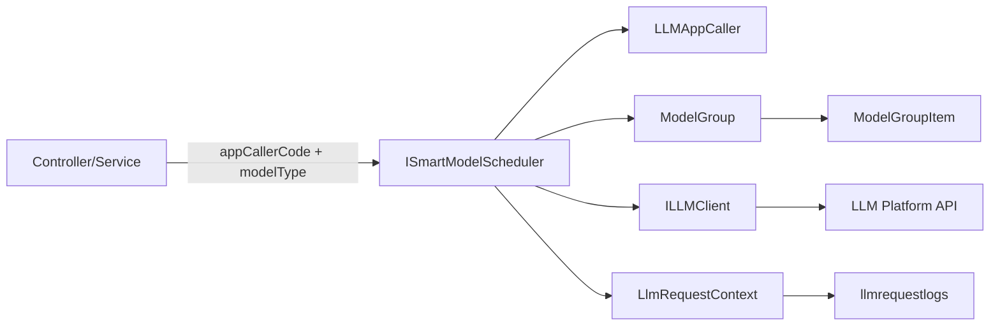
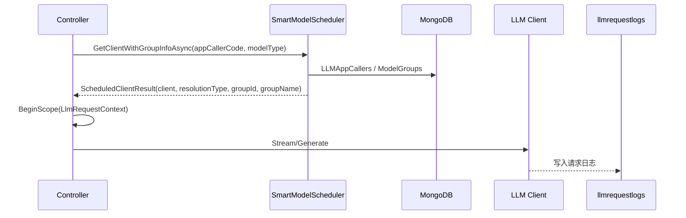

# 大模型池设计（三级调度/三级链路）

## 1. 目标与边界

### 1.1 目标
- 所有 LLM 请求统一走**三级调度/三级链路**：专属模型池 → 默认模型池 → 直连单模型。
- 模型选择可观测：每次请求写入 `LlmRequestContext`，落库到 `llmrequestlogs`，可追踪 `ModelResolutionType/ModelGroupId/ModelGroupName`。
- 允许按应用调用者维度（`appCallerCode`）隔离模型池配置与策略。

### 1.2 非目标
- 不在本文档定义具体 Prompt 内容。
- 不讨论单一模型的 API 细节（仅描述调度与池化机制）。

---

## 2. 核心概念

### 2.1 模型池（ModelGroup）
- 代表“同类型模型集合”的配置单元，包含多个 `(platformId, modelId)`。
- 支持优先级与健康状态，用于故障降级与恢复。
- 可标记为“默认池”或“专属池”。

关键字段（见 `PrdAgent.Core/Models/ModelGroup.cs`）：
- `ModelType`：chat/intent/vision/image-gen 等
- `IsDefaultForType`：是否默认池
- `Models[]`：池内模型列表

### 2.2 应用调用者（LLMAppCaller）
- 以 `appCallerCode` 为业务唯一入口标识（如 `admin.prompts.optimize`）。
- 通过 `ModelRequirements` 指定某模型类型（如 chat/intent）的模型池绑定。
- 支持“自动注册”：首次调用自动创建默认需求并走默认池。

关键字段（见 `PrdAgent.Core/Models/LLMAppCaller.cs`）：
- `AppCode`
- `ModelRequirements[]`（含 `ModelType`、`ModelGroupIds`）

### 2.3 三级调度/三级链路
1) **专属模型池**：若 `appCallerCode + modelType` 绑定了模型池列表，则优先使用  
2) **默认模型池**：若未绑定专属池，则使用该模型类型的默认池  
3) **直连单模型**：仅作为兜底；用于历史兼容或显式直连场景

模型解析类型（`ModelResolutionType`）：
- `DedicatedPool`
- `DefaultPool`
- `DirectModel`

---

## 3. 设计原则

1) **业务唯一入口**：任何业务调用必须通过 `ISmartModelScheduler` 获取客户端。  
2) **可观测**：所有 LLM 调用必须写 `LlmRequestContext`，且字段完整。  
3) **隔离**：模型池以 `appCallerCode` 维度隔离，避免跨业务混用。  
4) **可降级**：池内模型健康状态驱动降级与恢复。  

---

## 4. 调度流程（代码级）

核心调度器：`PrdAgent.Infrastructure/LLM/SmartModelScheduler.cs`

关键逻辑：
- `GetOrCreateAppCallerAsync`：保证 `appCallerCode` 入口可用  
- `AddDefaultRequirementAsync`：未配置需求时补默认需求  
- `GetModelGroupFromRequirementAsync`：按专属→默认→兜底解析池  
- `SelectBestModelFromGroup`：选池内最佳模型  
- `CreateClientForModelAsync`：生成具体 LLM Client  

解析类型判定（节选）：
```csharp
// SmartModelScheduler.GetClientWithGroupInfoAsync
var isLegacy = group.Id.StartsWith("legacy-", StringComparison.OrdinalIgnoreCase);
var resolutionType = isLegacy
    ? ModelResolutionType.DirectModel
    : (group.IsDefaultForType ? ModelResolutionType.DefaultPool : ModelResolutionType.DedicatedPool);
```

---

## 5. 代码图（架构）



---

## 6. 代码图（调用序列）



---

## 7. 日志与审计

要求（强制）：
- `RequestType`
- `RequestPurpose`
- `ModelResolutionType`
- `ModelGroupId`
- `ModelGroupName`

数据落库：`llmrequestlogs`  
查询入口：`/api/logs/llm`

---

## 8. 例外与约束

### 8.1 例外
- **ModelLab**：允许直接选择模型用于测试，不走调度，但必须写日志且 `ModelResolutionType=DirectModel`。

### 8.2 禁止事项
- 禁止在业务侧直接 new LLM Client  
- 禁止跳过 `ISmartModelScheduler`  

---

## 9. 相关代码索引

- 调度器：`prd-api/src/PrdAgent.Infrastructure/LLM/SmartModelScheduler.cs`
- 模型池：`prd-api/src/PrdAgent.Core/Models/ModelGroup.cs`
- 应用调用者：`prd-api/src/PrdAgent.Core/Models/LLMAppCaller.cs`
- 日志模型：`prd-api/src/PrdAgent.Core/Models/LlmRequestLog.cs`
- 管理接口：
  - `api/mds/model-groups`
  - `api/open-platform/app-callers`
  - `api/logs/llm`

---

## 10. 与三级调度/三级链路的关系

本设计即“三级调度/三级链路”的落地实现：
- 专属池：绑定到 `LLMAppCaller.ModelRequirements.ModelGroupIds`
- 默认池：`ModelGroup.IsDefaultForType = true`
- 直连：仅用于兜底或明确指定（如 ModelLab）
