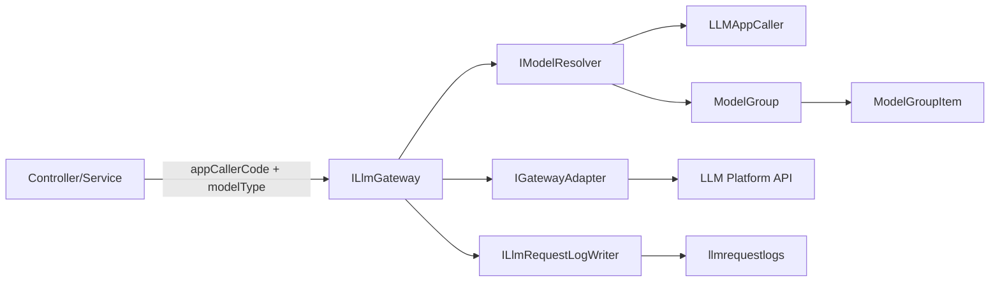
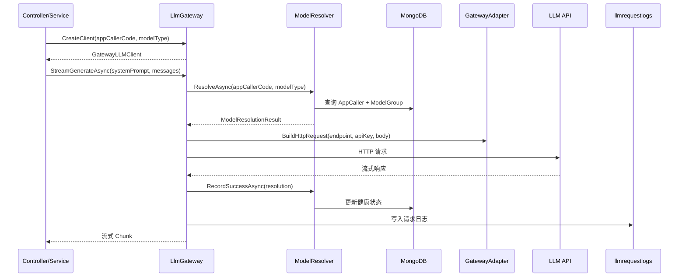
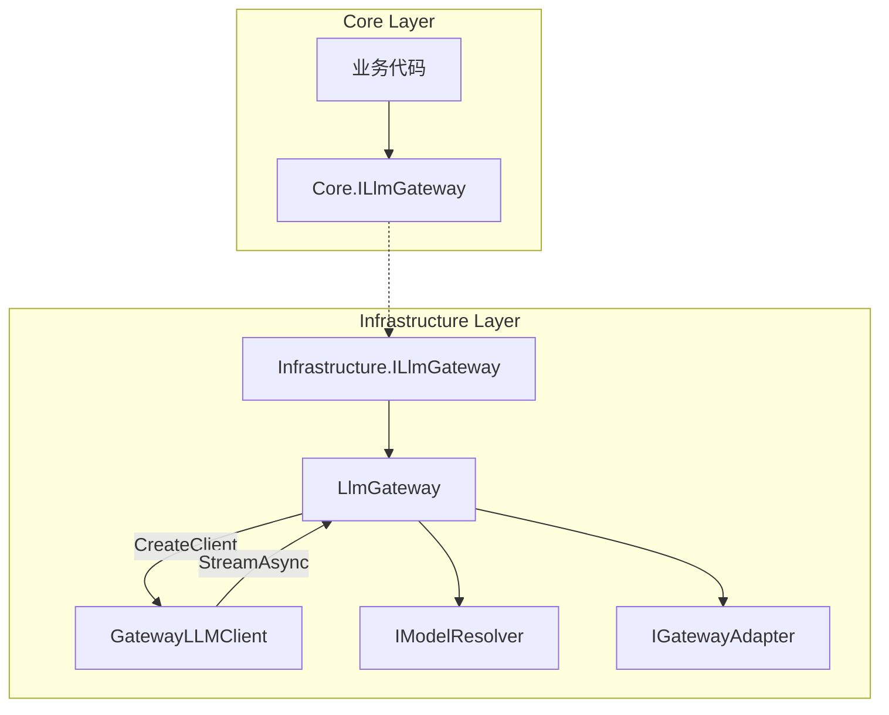

# 大模型池设计（三级调度/三级链路）

## 1. 目标与边界

### 1.1 目标
- 所有 LLM 请求统一走**三级调度/三级链路**：专属模型池 → 默认模型池 → 传统配置（Legacy）。
- 模型选择可观测：每次请求写入 `LlmRequestContext`，落库到 `llmrequestlogs`，可追踪 `ModelResolutionType/ModelGroupId/ModelGroupName`。
- 允许按应用调用者维度（`appCallerCode`）隔离模型池配置与策略。

### 1.2 非目标
- 不在本文档定义具体 Prompt 内容。
- 不讨论单一模型的 API 细节（仅描述调度与池化机制）。

---

## 2. 核心概念

### 2.1 模型池（ModelGroup）
- 代表"同类型模型集合"的配置单元，包含多个 `(platformId, modelId)`。
- 支持优先级与健康状态，用于故障降级与恢复。
- 可标记为"默认池"或"专属池"。

关键字段（见 `PrdAgent.Core/Models/ModelGroup.cs`）：
- `ModelType`：chat/intent/vision/generation 等
- `IsDefaultForType`：是否默认池
- `Models[]`：池内模型列表

### 2.2 应用调用者（LLMAppCaller）
- 以 `appCallerCode` 为业务唯一入口标识（如 `admin.prompts.optimize`）。
- 通过 `ModelRequirements` 指定某模型类型（如 chat/intent）的模型池绑定。
- 支持"自动注册"：首次调用自动创建默认需求并走默认池。

关键字段（见 `PrdAgent.Core/Models/LLMAppCaller.cs`）：
- `AppCode`
- `ModelRequirements[]`（含 `ModelType`、`ModelGroupIds`）

### 2.3 三级调度/三级链路
1) **专属模型池（DedicatedPool）**：若 `appCallerCode + modelType` 绑定了模型池列表，则优先使用
2) **默认模型池（DefaultPool）**：若未绑定专属池，则使用该模型类型的默认池
3) **传统配置（Legacy）**：使用 IsMain/IsVision/IsImageGen/IsIntent 标记的模型

模型解析类型（`ModelResolutionType`）：
- `DedicatedPool`
- `DefaultPool`
- `Legacy`
- `DirectModel`（仅 ModelLab 等测试场景）

---

## 3. 设计原则

1) **业务唯一入口**：任何业务调用必须通过 `ILlmGateway` 获取客户端。
2) **可观测**：所有 LLM 调用必须写 `LlmRequestContext`，且字段完整。
3) **隔离**：模型池以 `appCallerCode` 维度隔离，避免跨业务混用。
4) **可降级**：池内模型健康状态驱动降级与恢复。

---

## 4. 架构概述

### 4.1 核心组件

| 组件 | 职责 | 位置 |
|------|------|------|
| **ILlmGateway** | 统一守门员接口（Core 层） | `PrdAgent.Core/Interfaces/LlmGateway/ILlmGateway.cs` |
| **LlmGateway** | Gateway 核心实现 | `PrdAgent.Infrastructure/LlmGateway/LlmGateway.cs` |
| **IModelResolver** | 模型解析接口 | `PrdAgent.Infrastructure/LlmGateway/ModelResolver.cs` |
| **GatewayLLMClient** | ILLMClient 实现（委托到 Gateway） | `PrdAgent.Infrastructure/LlmGateway/GatewayLLMClient.cs` |
| **IGatewayAdapter** | 平台适配器接口 | `PrdAgent.Infrastructure/LlmGateway/Adapters/` |

### 4.2 两种调用方式

```csharp
// 方式一：CreateClient（推荐，用于流式场景）
var client = _gateway.CreateClient(appCallerCode, modelType);
await foreach (var chunk in client.StreamGenerateAsync(systemPrompt, messages, ct))
{
    // 处理流式响应
}

// 方式二：SendAsync/StreamAsync（直接调用，需要手动构造 GatewayRequest）
var request = new GatewayRequest
{
    AppCallerCode = "my-app::chat",
    ModelType = "chat",
    RequestBody = new JsonObject { ... }
};
var response = await _gateway.SendAsync(request, ct);
```

---

## 5. 调度流程

### 5.1 核心调度器：ModelResolver

关键逻辑：
- `ResolveAsync`：按三级链路解析模型
- `RecordSuccessAsync`：记录成功，恢复健康状态
- `RecordFailureAsync`：记录失败，触发降权

### 5.2 解析优先级

```
1. DedicatedPool: AppCaller.ModelRequirements.ModelGroupIds 绑定的专属池
       ↓ (未绑定或所有模型不可用)
2. DefaultPool: ModelGroup.IsDefaultForType = true 的默认池
       ↓ (无默认池或所有模型不可用)
3. Legacy: LLMModel.IsMain/IsVision/IsImageGen/IsIntent 标记的传统模型
       ↓ (无可用模型)
4. NotFound: 返回错误
```

### 5.3 健康状态管理

模型健康状态（`ModelHealthStatus`）：
- `Healthy`：健康，优先选择
- `Degraded`：降权，仅在无健康模型时使用
- `Unavailable`：不可用，跳过

状态转换规则：
- 连续失败 3 次 → 降权（Degraded）
- 连续失败 5 次 → 不可用（Unavailable）
- 成功 1 次 → 恢复健康（Healthy）

---

## 6. 架构图

### 6.1 组件关系



### 6.2 调用序列



### 6.3 CreateClient 流程



---

## 7. 日志与审计

### 7.1 必需字段

| 字段 | 说明 |
|------|------|
| `RequestType` | 请求类型（chat/vision/generation/intent） |
| `RequestPurpose` | AppCallerCode（用于过滤特定应用的日志） |
| `ModelResolutionType` | 调度来源（DedicatedPool/DefaultPool/Legacy/DirectModel） |
| `ModelGroupId` | 使用的模型池 ID |
| `ModelGroupName` | 使用的模型池名称 |
| `Model` | 实际使用的模型名称 |

### 7.2 数据存储

数据落库：`llmrequestlogs`
查询入口：`/api/logs/llm`

---

## 8. 例外与约束

### 8.1 例外
- **ModelLab**：允许直接选择模型用于测试，不走调度，但必须写日志且 `ModelResolutionType=DirectModel`。

### 8.2 禁止事项
- 禁止在业务侧直接 new LLM Client
- 禁止绕过 `ILlmGateway` 直接调用底层 HTTP 客户端

---

## 9. 代码索引

### 9.1 核心接口与实现

| 文件 | 用途 |
|------|------|
| `Core/Interfaces/LlmGateway/ILlmGateway.cs` | Core 层 Gateway 接口 |
| `Infrastructure/LlmGateway/ILlmGateway.cs` | Infrastructure 层 Gateway 接口 |
| `Infrastructure/LlmGateway/LlmGateway.cs` | Gateway 核心实现 |
| `Infrastructure/LlmGateway/GatewayLLMClient.cs` | ILLMClient 实现 |
| `Infrastructure/LlmGateway/ModelResolver.cs` | 模型解析器 |
| `Infrastructure/LlmGateway/GatewayRequest.cs` | 请求模型 |
| `Infrastructure/LlmGateway/GatewayResponse.cs` | 响应模型 |

### 9.2 适配器

| 文件 | 平台 |
|------|------|
| `Adapters/OpenAIGatewayAdapter.cs` | OpenAI 兼容平台 |
| `Adapters/ClaudeGatewayAdapter.cs` | Anthropic Claude |

### 9.3 管理接口

| API | 用途 |
|-----|------|
| `/api/mds/model-groups` | 模型池管理 |
| `/api/open-platform/app-callers` | 应用调用者管理 |
| `/api/logs/llm` | LLM 请求日志查询 |

---

## 10. 单元测试

### 10.1 测试文件索引

| 测试文件 | 覆盖范围 |
|----------|----------|
| `LlmGatewayTests.cs` | Gateway CreateClient、接口注册 |
| `ModelResolverTests.cs` | 三级调度逻辑、健康状态管理 |
| `ModelPoolSchedulingTests.cs` | 模型池选择、优先级、健康状态 |
| `LlmSchedulingPolicyTests.cs` | 调度策略 |
| `LlmSchedulingIntegrationTests.cs` | 端到端集成测试 |

### 10.2 运行测试

```bash
# 运行所有 Gateway 相关测试
dotnet test --filter "FullyQualifiedName~LlmGateway|FullyQualifiedName~ModelResolver|FullyQualifiedName~ModelPoolScheduling"

# 运行集成测试（需要真实环境）
dotnet test --filter "Category=Integration"
```

---

## 11. 迁移说明

### 11.1 从 SmartModelScheduler 迁移

**之前（已废弃）**：
```csharp
// 不要这样做
private readonly ISmartModelScheduler _scheduler;

var result = await _scheduler.GetClientWithGroupInfoAsync(appCallerCode, modelType);
var client = result.Client;
```

**现在（推荐）**：
```csharp
// 正确做法
private readonly ILlmGateway _gateway;

var client = _gateway.CreateClient(appCallerCode, modelType);
await foreach (var chunk in client.StreamGenerateAsync(systemPrompt, messages, ct))
{
    // 处理响应
}
```

### 11.2 DI 注册

```csharp
// Program.cs
builder.Services.AddScoped<Infrastructure.LlmGateway.ILlmGateway, LlmGateway>();
builder.Services.AddScoped<Core.Interfaces.LlmGateway.ILlmGateway>(sp =>
    (Core.Interfaces.LlmGateway.ILlmGateway)sp.GetRequiredService<Infrastructure.LlmGateway.ILlmGateway>());
```

---

## 12. 与三级调度/三级链路的关系

本设计即"三级调度/三级链路"的落地实现：
- **专属池**：绑定到 `LLMAppCaller.ModelRequirements.ModelGroupIds`
- **默认池**：`ModelGroup.IsDefaultForType = true`
- **传统配置**：`LLMModel.IsMain/IsVision/IsImageGen/IsIntent` 标记
- **直连**：仅用于 ModelLab 等测试场景
