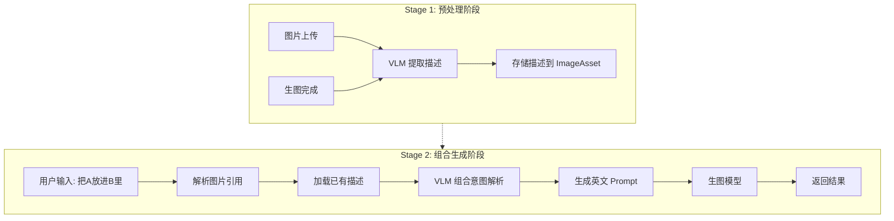
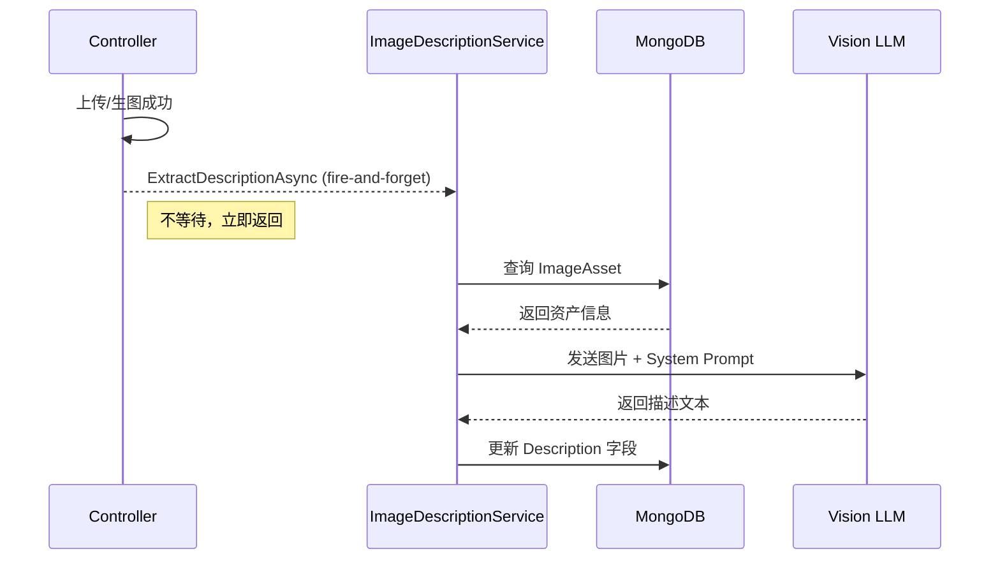
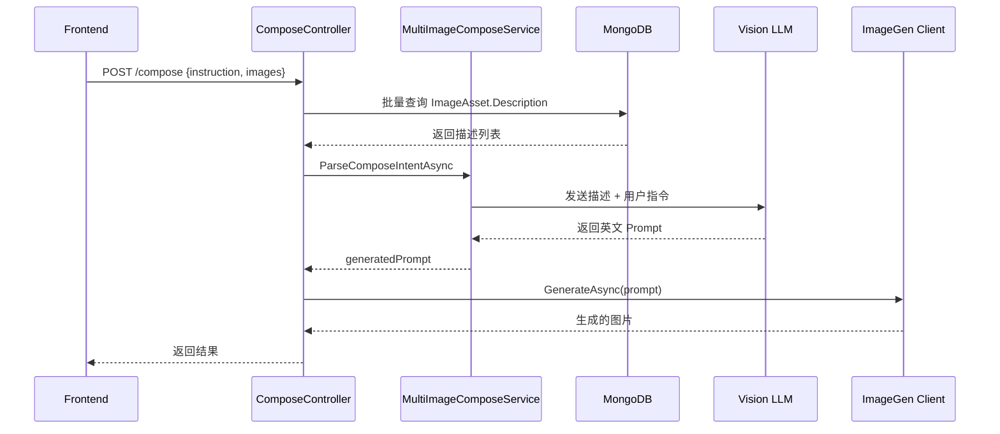

# 多图组合生成设计 (Multi-Image Compose)

## 1. 目标与边界

### 1.1 目标

- 支持用户通过自然语言描述多张图片的组合关系（如"把@大象放进@房间"）
- 系统自动理解意图并生成目标图片
- 通过预提取图片描述 + 实时组合解析的两阶段架构实现高效处理
- 解决"语序变化导致理解错误"的问题（如"把A放进B" vs "B里面有A"）

### 1.2 非目标

- 不支持视频组合
- 不支持实时图片编辑（如 Inpainting）
- 不在本文档定义具体生图模型参数细节

---

## 2. 核心架构：两阶段 VLM 流水线



### 2.1 Stage 1: 异步预处理

**触发时机**：
- 图片上传成功后
- 生图完成后

**处理流程**：
1. 调用 Vision LLM（如 GPT-4o、Claude 3.5 Sonnet）
2. 提取图片的核心视觉描述（主体、背景、风格）
3. 存储到 `ImageAsset.Description` 字段

**特点**：
- Fire-and-forget 异步执行，不阻塞主流程
- 失败不影响上传/生图的成功响应

### 2.2 Stage 2: 实时组合生成

**触发时机**：
- 用户发起多图组合请求

**处理流程**：
1. 解析用户指令中的图片引用
2. 批量加载已有的图片描述
3. 调用 VLM 进行语义理解，生成英文 Prompt
4. 调用生图模型生成结果

**特点**：
- 复用 Stage 1 的预处理结果，减少 VLM 调用
- 仅需一次 VLM 调用完成意图解析

---

## 3. 数据模型变更

### 3.1 ImageAsset 新增字段

**文件**: `prd-api/src/PrdAgent.Core/Models/ImageAsset.cs`

| 字段 | 类型 | 说明 |
|------|------|------|
| `Description` | `string?` | VLM 生成的图片描述（最大 500 字符） |
| `DescriptionExtractedAt` | `DateTime?` | 描述提取时间 |
| `DescriptionModelId` | `string?` | 提取时使用的模型标识 |

### 3.2 数据库索引

无需新增索引，现有 `(OwnerUserId, Sha256)` 唯一索引已满足查询需求。

---

## 4. appCallerCode 定义

遵循 `doc/rule.app-feature-definition.md` 规范：

| appCallerCode | modelType | 用途 |
|--------------|-----------|------|
| `visual-agent.image.describe::vision` | vision | 图片描述提取（上传/生成后异步调用） |
| `visual-agent.compose::vision` | vision | 多图组合意图解析（实时调用） |
| `visual-agent.compose::generation` | generation | 组合生成 |

**注册位置**: `prd-api/src/PrdAgent.Core/Models/AppCallerRegistry.cs`

```csharp
public static class VisualAgent
{
    public static class Image
    {
        public const string Describe = "visual-agent.image.describe::vision";
        // ...existing...
    }
    
    public static class Compose
    {
        public const string Intent = "visual-agent.compose::vision";
        public const string Generation = "visual-agent.compose::generation";
    }
}
```

---

## 5. 服务层设计

### 5.1 IImageDescriptionService

**文件**: `prd-api/src/PrdAgent.Infrastructure/Services/VisualAgent/ImageDescriptionService.cs`

**职责**：
- 调用 VLM 提取单张图片的视觉描述
- 异步执行，不阻塞上传流程
- 结果回写到 `ImageAsset.Description`

**接口定义**：
```csharp
public interface IImageDescriptionService
{
    /// <summary>
    /// 异步提取图片描述（Fire-and-forget，不阻塞调用方）
    /// </summary>
    Task ExtractDescriptionAsync(string assetId, CancellationToken ct = default);
}
```

**System Prompt**：
```text
你是图片描述专家。请用简洁的中文描述这张图片的核心内容。
要求：
- 描述主体对象（是什么、颜色、姿态、特征）
- 描述环境/背景（场景、光线、氛围）
- 80-150字，不超过200字
- 不要以"这张图片"开头，直接描述
```

### 5.2 IMultiImageComposeService

**文件**: `prd-api/src/PrdAgent.Infrastructure/Services/VisualAgent/MultiImageComposeService.cs`

**职责**：
- 解析用户输入中的图片引用
- 加载对应图片的 Description
- 调用 VLM 生成最终 Prompt

**接口定义**：
```csharp
public interface IMultiImageComposeService
{
    /// <summary>
    /// 解析多图组合请求，返回生成的英文 Prompt
    /// </summary>
    Task<string> ParseComposeIntentAsync(
        string userInstruction,
        List<ImageReference> images,
        CancellationToken ct);
}

public class ImageReference
{
    public int Index { get; set; }
    public string AssetId { get; set; } = string.Empty;
    public string? Name { get; set; }
}
```

**通用 System Prompt**（解决"乱序"问题的关键）：
```text
# Role
你是 AI 绘画指令编译器。

# Input
你将收到：
1. 一组图片描述，格式为 [Image N]: 描述内容
2. 用户的组合指令，会引用 [Image N]

# Task
1. 语义解析：分析用户指令的逻辑关系（谁是主体、谁是背景、是否风格迁移）
   - 不管语序如何（"把A放进B" 或 "B里面有A"），都要正确理解
2. 生成一段详细的英文 Prompt，描述融合后的最终画面

# Output
只输出英文 Prompt，不要任何解释。
```

---

## 6. API 接口规范

### 6.1 组合生成接口

**路由**: `POST /api/visual-agent/image-gen/compose`

**请求体**:
```json
{
  "instruction": "把 [IMAGE_1] 放进 [IMAGE_2] 里",
  "images": [
    { "index": 1, "assetId": "abc123", "name": "大象.png" },
    { "index": 2, "assetId": "def456", "name": "房间.jpg" }
  ],
  "size": "1024x1024",
  "modelId": "nano-banana-pro",
  "platformId": "...",
  "configModelId": "..."
}
```

**响应**:
```json
{
  "success": true,
  "data": {
    "generatedPrompt": "A realistic photo of a large African elephant...",
    "images": [{ "base64": "...", "url": "..." }]
  }
}
```

**错误码**:
| 错误码 | HTTP | 说明 |
|--------|------|------|
| `CONTENT_EMPTY` | 400 | instruction 为空 |
| `INVALID_FORMAT` | 400 | images 格式不正确 |
| `ASSET_NOT_FOUND` | 404 | 引用的图片资产不存在 |
| `LLM_ERROR` | 502 | VLM/生图模型调用失败 |

### 6.2 手动触发描述提取

**路由**: `POST /api/visual-agent/image-master/assets/{id}/describe`

**响应**:
```json
{
  "success": true,
  "data": {
    "description": "一只灰色的非洲大象...",
    "extractedAt": "2026-01-30T10:00:00Z",
    "modelId": "gpt-4o"
  }
}
```

---

## 7. 调用时序图

### 7.1 Stage 1: 描述提取



### 7.2 Stage 2: 组合生成



---

## 8. 调用时机汇总

| 场景 | 触发点 | 实现方式 | appCallerCode |
|------|--------|---------|---------------|
| 图片上传 | `UploadAsset` 成功后 | Fire-and-forget | `visual-agent.image.describe::vision` |
| 生图完成 | `ImageGenRunWorker` 成功后 | Fire-and-forget | `visual-agent.image.describe::vision` |
| 手动触发 | `/assets/{id}/describe` | 同步等待 | `visual-agent.image.describe::vision` |
| 组合生成 | `/compose` | 同步等待 | `visual-agent.compose::vision` + `generation` |

---

## 9. 相关代码索引

| 模块 | 文件路径 |
|------|---------|
| 数据模型 | `prd-api/src/PrdAgent.Core/Models/ImageAsset.cs` |
| AppCaller 注册 | `prd-api/src/PrdAgent.Core/Models/AppCallerRegistry.cs` |
| 描述提取服务 | `prd-api/src/PrdAgent.Infrastructure/Services/VisualAgent/ImageDescriptionService.cs` |
| 组合解析服务 | `prd-api/src/PrdAgent.Infrastructure/Services/VisualAgent/MultiImageComposeService.cs` |
| Compose 接口 | `prd-api/src/PrdAgent.Api/Controllers/Api/ImageGenController.cs` |
| 上传触发 | `prd-api/src/PrdAgent.Api/Controllers/Api/ImageMasterController.cs` |
| DI 注册 | `prd-api/src/PrdAgent.Api/Program.cs` |

---

## 10. 与三级调度的关系

本功能遵循 `doc/design.model-pool.md` 定义的三级调度机制：

1. **专属模型池**：可为 `visual-agent.compose::vision` 配置专属 Vision 模型池
2. **默认模型池**：未配置时回退到 `vision` 类型的默认池
3. **直连单模型**：仅作为兜底

日志要求：
- 所有 VLM/生图调用必须写入 `LlmRequestContext`
- 记录 `ModelResolutionType`、`ModelGroupId`、`ModelGroupName`
