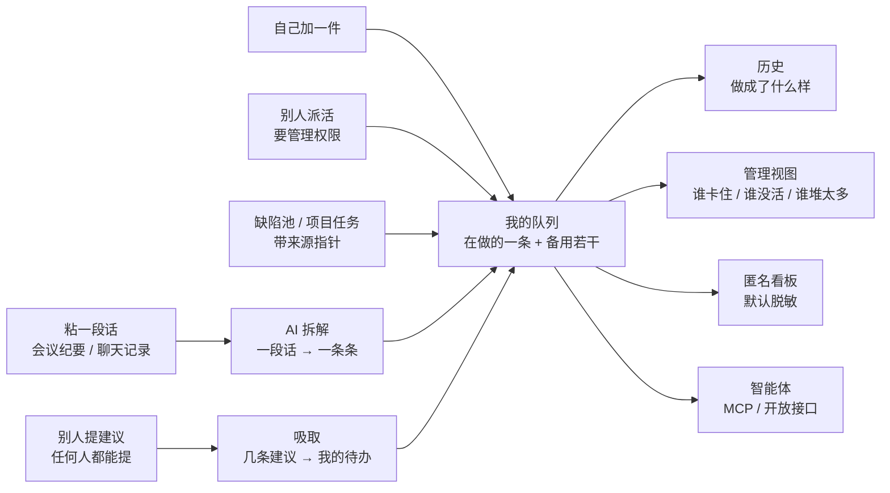
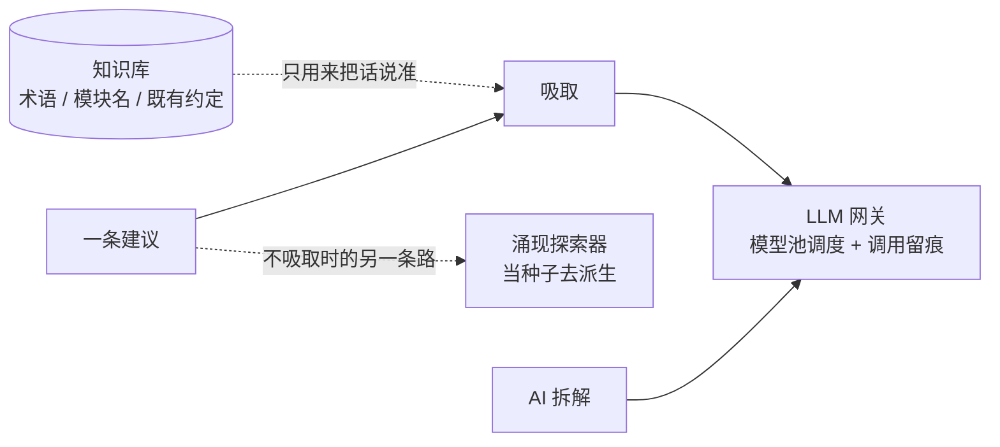
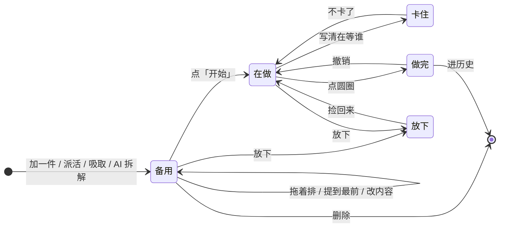
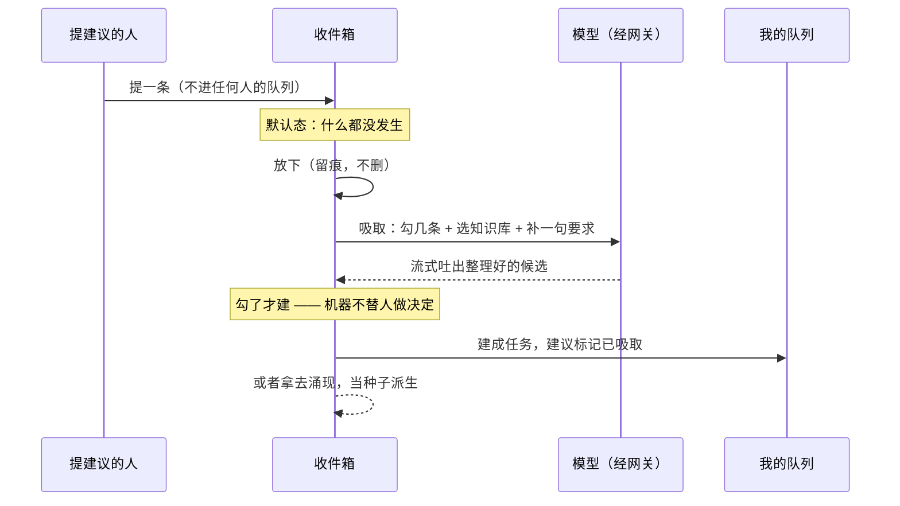

# 活动任务清单 · 设计

**一句话**：一个列表，一条一条做完 —— 我在做什么、接下来做什么、做成了什么样；管理视图看同一个列表，外加谁堆了多少；活的来源有三种：自己加、别人派、别人建议后我自己吸取。
**谁该读**：要接手这个功能的开发、要判断它该不该长出更多功能的产品、要用它管人的团队负责人。
**读完能做什么**：说清它为什么独立于 pm-agent 存在、它和知识库/涌现/网关/智能体怎么联动、三种视角各解决谁的问题、匿名开放到什么粒度，以及哪些边界是刻意不做的。

版本：v6（2026-09-16）

---

## 为什么做

团队里问来问去的问题高度稳定，来回只有三个：你现在在做什么、做完接着做什么、上周你到底干了啥。
过去这三个问题靠 IM 问答解决，问一次答一次，问完就散；答案不沉淀，下次还得再问。

仓库里已经有四类任务实体，但没有一类能回答这三个问题：

| 已有 | 维度 | 为什么答不了 |
|---|---|---|
| `PmTask` | 项目 | 必须挂 ProjectId。真实占用里大量事情不属于任何项目（等灰度环境、帮同事看个 bug、临时插队），强塞会逼出一堆假项目反过来污染看板 |
| `PaTask` | 个人待办 | 四象限是给自己排优先级的，不面向汇报 |
| `ChannelTask` | 外部渠道 | 那是 Agent 执行的指令任务，不是人的工作 |
| `TaskNode` / `TaskTree` | 结构分解 | 讲的是任务怎么拆，不讲谁此刻在干 |

所以新增的是**人维度**的第五类，而且刻意不做成看板 —— 再加一块看板只会多一个没人维护的地方。

## 核心主张

**就是一个列表。** 每行一个圆圈（照「提醒事项」的心智）：空心是待做，实心那条是我在做的。
做完的沉到下面。没有卡片套卡片，没有分区仪表盘 —— 复杂了别人看不懂，也写不明白。

**圆圈永远只有一个意思：做完了。** 不管点的是哪一行，不管这条是不是「正在做」。
曾经有一版给它派了两个活（正在做的那行点了是结案、备用行点了是切换当前任务），
同一个符号两种后果，误触一下改掉两条任务的状态还没法反悔 —— 提醒事项的全部可学性
就建立在「圆圈只有一个意思」上，这个便宜占不得。切换当前任务在行尾单列一个「开始」。

**结案不是打勾，但也不该挡在完成前面。** 点圆圈立刻就完成：行划掉、下一件顶上来，不等网络。
那句「做成了什么样」改成完成之后底下升起来的一条，可写可不写，旁边永远有「撤销」。
先弹一张问卷再放行会把一天几次的动作从一下变成三下加打字，那句话反而活不下来。
写与不写的差别是：不写，一周后翻回来只有一串对号；写了，那句才是别人要看的、
写周报要抄的、下个人接手要读的。

**管理视图看的是同一个列表。** 一人一行，卡住的、没活的自动排最上面，每人后面一个堆积量。
不另做「需要你出手」区块 —— 那会让同一个人在一屏里出现两次。

**堆积量是负载，不是绩效。** 只给数字，两端标色（空了要派活 / 堆太多要分担），中间的人不标。
刻意没有完成率、准时率、人均产出 —— 那些一出现，下面的人就开始为数字干活。


**此刻正在做同时只允许一条。** 这是产品观点不是技术限制：多线程等于没有焦点，看的人一眼要看到的就是那一件。
对应看板方法里的 WIP=1。切换任务时上一条自动结算时长、退回备用队首，累计投入不丢。

**备用任务不是 backlog，是粮草余量。** 市面上同类产品（Range、Geekbot、Status Hero）的备用区都是无限长的待办列表，
没有一个会主动说出「这个人做完手上这件就没活了」。这里它有档位：充足 / 偏少 / 见底，见底是红灯。

**零表单。** 用户只输入系统猜不到的两件事：做完了、我卡住了在等谁。其余（时长、顺序、结论句）系统自己算。
标记卡住必须写清在等谁 —— 只说「卡住了」别人没法接手，这个必填是有意的。

**员工看得见自己汇报出去长什么样。** 任务台右上角常驻一句「别人此刻看到的你」，由操作自动生成。
这条闭环是准确性的动力来源：人愿意维护自己会被看见的东西，不愿意填表。

## 两端不是一套界面放大缩小

同一套功能在桌面和手机上必须长得不一样，这是苹果做同一个 App 时的默认前提，不是锦上添花：

| | 桌面（指针精确 + 宽屏） | 手机 |
|---|---|---|
| 结构 | 左侧一条 source list 切换三个视图 | 单栏 + 顶部一条分段控件 |
| 行高 | 压到 38px，一屏装得下两倍的行 | 56px，圆圈视觉仍是 22px 但命中区撑到 44px |
| 行上的操作 | 悬停或键盘聚焦才出来，平时行是干净的 | 常驻（没有悬停这回事） |
| 浮层 | 贴着顶边落下，按钮右对齐、次要在左 | 从底边升起，顶部一条 grabber，导航栏左取消右完成 |
| 日期 | 自绘月历网格 | 同上（快捷胶囊在前，月历要点开才出来） |

两条容易踩的：悬停规则必须关在「有悬停能力」的条件里，否则手机上点过一次圆圈它会一直
放大着不回去；浮层在手机上不能垂直居中，键盘一弹就把它顶走。

## 新人怎么上手

不做逐步高亮的产品导览 —— 苹果第一方 App 一个都没有。它做的是三件别的事：
一次性的一屏介绍、示例数据、以及让界面自己教（圆圈、加号本来就是自解释的）。

这里只用第一件：首次进入弹一次三行的介绍，讲完就再也不出现。三行里只有一件是界面自己
说不清的 —— 结案要留一句「做成了什么样」；圆圈和「加一件」不在那儿讲，点一下就懂了。

空态同理只报状态不教操作：「没有任务」四个字，因为「加一件」那一行就在它下面两厘米处。

## 它不是一个孤岛：一次联动

这个功能单独看只是「一个列表」，但它真正的价值在于**它接到了系统里已有的哪些东西**。
一条活从冒出来到被做掉，横穿了六个原本各自为政的部件：



智能体那条线是**双向**的：它既在右边读队列，也能从左边写进来（加自己的活、给别人提建议），
但**不能结案**。上图为了少画几条交叉线只画了读的那一半，写的那一半见下面第三条。

AI 的两步各自接了什么：



三条值得单独说的联动线：

**一、AI 的两步都走网关，不自己连模型。** 拆解和吸取都经 LLM 网关，
于是模型池调度、健康切换、调用留痕、成本归集全都是现成的，
这个功能不需要自己维护任何一样。代价是它必须按网关的规矩报上
「谁在调、为了什么调」（调用者编码 + 请求上下文），漏了就会在鉴权层直接失败。

**二、知识库只进不出。** 吸取时引用知识库是为了让整理出来的话对得上既有术语和模块名，
**不是**让模型从知识库里发明新任务。这条边界写进了提示词，也写进了本文档 ——
一旦松掉，吸取就会开始凭空造活，而人无从分辨哪条是他提的、哪条是机器想的。

**三、智能体是双向的，但不对称。** 它能读队列、能往队列里写、能提建议，
**不能结案** —— 那句「做成了什么样」是人对结果的认领，让机器代签，
这个字段当天就会退化成「已完成」。所以读写不对称是有意的，不是没做完。

## 一条活的一生（状态机）



图上没画出来、但界面上确实发生的三件事：

- **点圆圈之后下一件自动顶上来** —— 结案和接下一件是同一个动作，不是两步。
- **删除与放下的分界是「投入过时间没有」**：没投入过的可以真删，投入过的只能放下、留痕。
  两条都能撤销；真删那条的撤销是按原来的标题、时间和**位置**重建，所以 id 会换一个。
- **切到「在做」时，原来在做的那条退回备用队首**，累计投入不丢 —— 所以切来切去没有损失。


两条不变量，界面和接口都按它走：

- **同时只有一条在做**（看板方法里的 WIP=1）。多线程等于没有焦点，看的人一眼要看到的就是那一件。
- **卡住必须说清在等谁**。只说「卡住了」别人没法接手，这个必填是有意的。

## 一条建议的一生

建议和任务是两条独立的生命线，它们只在「吸取」那一刻交汇：



## 权限与作用域

两档权限，与后台权限位同名；开放接口签发凭据时已取过交集：

| | 读自己 / 加自己的活 | 提建议 | 读全员 | 派活 | 结案 |
|---|---|---|---|---|---|
| `active-tasks.use` | 是 | 是 | 否 | 否 | 是（人本人） |
| `active-tasks.manage` | 是 | 是 | 是 | 是 | 是（人本人） |
| 智能体（任一档） | 读 + 写队列 | 是 | 按档 | 按档 | **否** |

跨实例同步时，任务与建议属于可同步的业务数据；**对外开放开关和个人偏好不同步** ——
前者复制过去等于替目标站把匿名看板打开了，后者引用的知识库在目标站根本不存在。

## 什么时候要（可选）

任务可以带一个时间，**但它是「截止」不是「预估耗时」**。这个区分是刻意的：
预估一旦存在，下一步必然长出估准度和超期判定，那是考核；截止只回答一件事 ——
这件事排在什么时候之前做完，帮做事的人自己排序。过期不报警、不算准时率，只在那一行淡淡标一下。

输入照提醒事项那套：**今天 / 明天 / 本周末 / 自定**四个快捷，点「自定」才出日历。
大多数任务根本不该有时间要求，所以默认是「不设时间」。

再往上一层是那句「简洁但不简单」：标题里写「明天交周报」「周五之前把网关比对跑完」，
时间会被自己认出来，标题只留下要做的事。规则解析，不走大模型 ——
这一步必须即时、可预期、不烧 token；认不出来就认不出来，猜错比不猜更烦人。

认出来之后**不偷改输入框**，而是在下面显示一条「认出「明天」—— 加进去时标题会变成「交周报」」，
旁边一个「不用」。人看得见机器做了什么才敢信它；一旦人自己点过胶囊，就不再自动认。

## 三种视角

| 视角 | 谁看 | 解决什么 | 权限 |
|---|---|---|---|
| 我的任务台 | 员工自己 | 维护此刻 / 备用 / 看自己的镜像句 | `active-tasks.use` |
| 团队此刻 | 团队负责人 | 不读进度条，直接拿到「需要你出手的几件」；委派任务 | `active-tasks.manage` |
| 走过的路 | 员工 + 负责人 | 历史流水、估准度、时间漏在哪 | `use`（看他人需 `manage`） |
| 公开看板 | 匿名访客 | 对外展示团队状态 | 无需登录，粒度可配 |

团队视角刻意不列全员进度让人自己读结论：节奏正常的人从待办清单里自动消失。
出手清单只有三类，按严重度排序：卡住超阈值（催一句）、备用见底（派活）、投入超预估一倍（问一句）。

## 建议和派活是两码事

这是这个功能里最该说清的一条区分。

| | 派活 | 建议 |
|---|---|---|
| 谁能做 | 要管理权限 | 任何人 |
| 提了之后 | 直接进对方队列，带着派活人的名字 | **什么都不会发生**，躺在对方收件箱里 |
| 决定权在谁 | 派的人 | 收的人 |
| 要花力气的是谁 | 收的人（要把它做掉，或者跟人解释为什么不做） | 收的人（要把它吸取成任务），但默认态是零成本 |

为什么不做成「派活但可以拒绝」：那仍然默认对方替你排了队，拒绝反而要花力气。
建议的默认态是「什么都没发生」，吸取才是那个要花力气的动作 ——
力气花在「我决定要做」这一侧，才是对的。

**吸取**是一次整理，不是一次搬运：几条零散的、别人用自己语气说出来的话，
拧成一条条「我要做什么」。所以它要过一次模型，而且要能引用知识库
（术语、模块名、既有约定得对得上），也要能让人补一句自己的要求
（「都拆成半天能做完的」）。上次引用了哪几个知识库记在服务端，换台电脑还在。

吸取出来的东西**不直接入库**：逐条勾选、可改标题，确认了才建。
机器替人做决定的地方越少，人越敢用它。

一条建议也可以不吸取，而是**拿去涌现** —— 它当种子建一棵涌现树，用来派生更多可能。
适合那种「他说的这个方向有点意思，但还不知道该做成什么」的建议。

## 一段话进来，AI 拆成一条条

手上真正的输入从来不是「一行一件」，是一段会议纪要、一段聊天记录。
按换行切的老路子遇到「周五前把登录页改完，另外顺手看一下张三那个 bug」只能切出一条。

所以有两条导入路径，各管各的：**按行切**（规则、即时、不烧 token，贴一份已经是清单的东西）
和 **AI 拆**（一整段自由文本，识别出几件事、认出每件的截止时间）。
AI 那条是流式的：候选一条条冒出来，等待期屏幕上是产物本身在长，不是一个转圈。

两个必须防住的地方：模型不知道今天几号（所以随提示词带一张往后两周的日期对照表），
模型偶尔吐出过去的日期（所以收回来的日期必须落在「今天之后 180 天内」，
否则宁可不要 —— 一个过去的日期会让任务刚建出来就是逾期红的，比没有时间更糟）。

## 下半屏：我们欠着什么

任务台上半屏是「我现在要做什么」，下半屏是「我们欠着什么」。两者的差别是**时态**，
不是重要性 —— 所以它们该在同一屏里，而不是分成两个功能。

### 为什么要接

`doc/` 下 45 份债务台账，每一条都缺三样东西：**没有人**（谁认领了看不出来）、
**没有状态**（「补的条件」写着，到底触没触发没人知道）、**只有写它的那个 Agent 看得见**
（它躺在 git 里，不在任何人每天会打开的那一屏）。

写台账这件事本身是对的 —— 交付时声明的已知边界必须固化下来，否则下一个人会重新踩一遍。
问题是台账写完就沉底了。接进任务台补的正是沉底之后那一段。

### 谁是 SSOT：正文归仓库，归属与状态归任务台

这是这个功能唯一需要想清楚的事，定错了就会变成两本打架的账。

| | 正文（是什么 / 现状 / 补的条件） | 归属与状态（归谁 / 什么状态 / 转成了哪条任务） |
|---|---|---|
| SSOT | 仓库里的债务台账 | 任务台 |
| 理由 | 它引用文件路径、判据、事故日期，跟代码同生共死；改代码的那个人顺手改它才对，`git diff` 是它天然的审阅面 | 没人会为了改一个状态去提一个 commit，放 Markdown 里必然过期 |
| 谁能写 | 同步端点（整体覆盖） | 认领 / 转换 / 放回 / 了结四个端点 |
| 另一侧能不能写 | 任务台不回写正文 —— 界面上也刻意不给正文编辑框 | 同步端点一律不碰归属与状态，所以反复跑不会抹掉认领记录 |

**不做双向同步**，理由与本文档「已知边界」里第 6 条同款：两边都能写正文，就是同一件事两份判据，
必然漂移。单向推 + 一个反向链接就够了。

### 稳定标识：`{模块}#{编号}`

如 `platform.active-tasks#15` —— 台账文件名去掉 `debt.` 前缀和 `.md`，加表格里那个 `#`。

用编号不用标题做标识：标题会被改写（措辞优化、补充说明），编号不会 ——
台账里新增一条是追加一个新号，不是给旧行重新编号。

一条被真实数据逼出来的约束：**一份台账只收一张主表**。[debt.cds.md](./debt.cds.md) 一份里有十九张
以 `#` 打头的编号表，每张都从 1 开始编；全收的话 `cds#1` 会被十几行争抢，同步时静默互相覆盖，
而且那十几张里多数根本不是待办（文件清单、坑的对照表、状态表）。所以判据是「第一列是 `#`
且标题列叫 债务/项/事项/欠什么/缺口」，命中第一张就收，其余跳过并报出来。

### 一条债务的一生

```
债务台账里写下一条
        ↓  同步脚本（人或 Agent 改完文档顺手跑）
        ↓  map_debt_sync
任务台下半屏「欠着的」· open（还没人管）
        ↓  认领
     claimed（归我，但还没动手）
        ↓  转成我的活
     converted ── 建出一条任务进队列（sourceRefType=debt，带着 Key）
        ↓  补完了
     closed（任务台这侧认为它了了；正文里那条删不删，看仓库）
```

两个方向都点得通：任务上带着债务的 Key，债务上记着 `ConvertedTaskIds`。

### 为什么默认折起来

它是「欠着的」不是「今天要做的」。天天摊开在队列底下，两周之内就会变成没人再看的背景噪音 ——
那正是它在 `doc/` 里的处境，搬一次位置没有意义。折起来，标题栏给一句结论
（「你认领了 3 条，另有 5 条还没人管」），要看的时候点开。

## 委派

在面板上直接派活，默认进对方的**备用队列**而不是打断他手上那件 —— 打断要是有意识的动作，不是默认行为。
派出去的任务带委派人身份，对方在自己的任务台上看得见是谁派的，团队视图里也看得见。

这条替代了「在 IM 里布置任务」：IM 里派的活散在聊天记录里，没有状态、没有去向、没人知道排在第几位。

## 匿名开放

默认**脱敏**：访客看得到谁在忙、谁卡住、谁没活、今天投入多久，看不到任务标题正文、备注、在等谁 ——
任务标题常带项目代号和缺陷细节。管理员可以逐档放开（脱敏 / 全文 / 仅头条结论），也可以整个关掉，
关掉后公开地址直接 404，不泄露「这里本来有个面板」。

脱敏不是把标题清空（前端会渲染成空行），而是保留首字与长度感、其余打码。

## 历史刻意保留难看的东西

放下的方案也留在历史里，和做成的那些排在一起。粉饰过的历史没人会回来看第二次。
已经投入过时间的任务不允许删除，只能走「放下」并留痕。

这一屏曾经有「他估得准吗」和「时间漏在哪」两块分析，**v2 删掉了**：那两块在衡量人，
不在帮人沟通，摆在界面上就会把这个东西变成 KPI 看板。现在它只做一件事 ——
一条一条列出做成了什么样。

## 时间怎么算

投入与空转分开记：卡住期间不计入投入。切任务、标记卡住、解除卡住、落终态四个时刻各结算一次，
累计值落库，当前这一轮由起点实时算。前端拿到起点后本地续走秒表，不轮询 —— 用本地时间差而不是服务端时间差，
避开客户端时钟偏差。

## 刻意不做的

- **不做 IM 集成**。面板本身就是布置任务的地方；只留一个「把聊天里那段话贴进来切成任务」的轻入口，纯规则切分，不走大模型。
- **智能体能填不能结案**。任务台开放给 MCP（读自己 / 加一件 / 读全员 / 派活四个工具），
  但结案要填「做成了什么样」，那是人对结果的认领 —— 让机器代签，这个字段当天就会退化成
  「已完成」，历史也就白留了。同理智能体不能替人标记卡住：在等谁是人的判断。
- **不做工时审批**。这是汇报卡不是考勤系统，时长是给人看的参照不是结算依据。
- **不和 PmTask 双向同步**。来源可以指过去（SourceRefType / SourceRefId），但状态不回写，避免两套状态机互相打架。
- **不做实时推送**。团队视图 60 秒静默刷新即可；这一屏的信息半衰期是分钟级，不值得为它建一条 SSE。

## 已知边界

| 边界 | 说明 |
|---|---|
| 计时靠人工切换 | 忘了点「完成」会一直计时。没有自动检测，也不打算做 —— 自动猜错比不猜更糟 |
| 「在岗」= 有在途记录 | 没汇报的人进「还没汇报的人」分组，不代表他没干活 |
| 团队视图不分页 | 按团队人数量级设计，几百人以内没问题，再大要改成分页 |
| 匿名看板无独立限流 | 走全局限流。真要对外长期开放需要单独评估 |
| 估准度样本可能很少 | 填预估是选填的，多数人不填就算不出结论，页面会如实说「算不出」而不是编一个 |

这些边界同步记在 [活动任务清单 · 技术债务台账](./debt.platform.active-tasks.md)。
