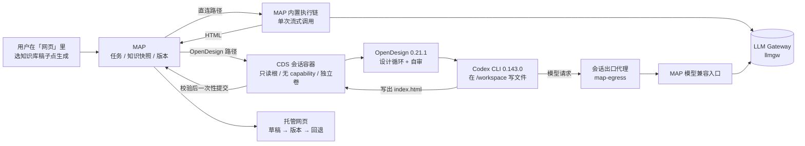
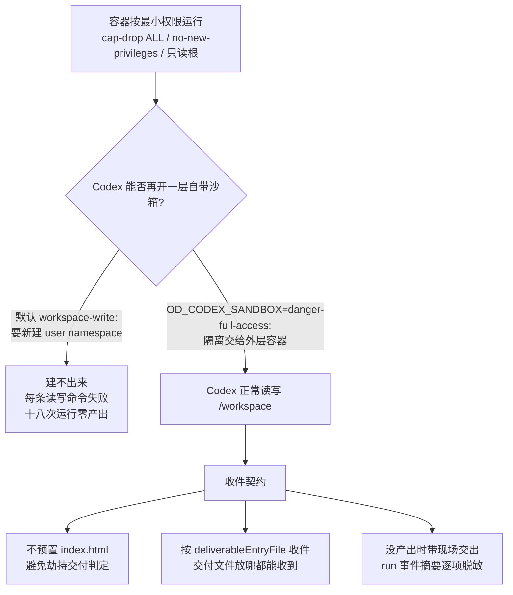
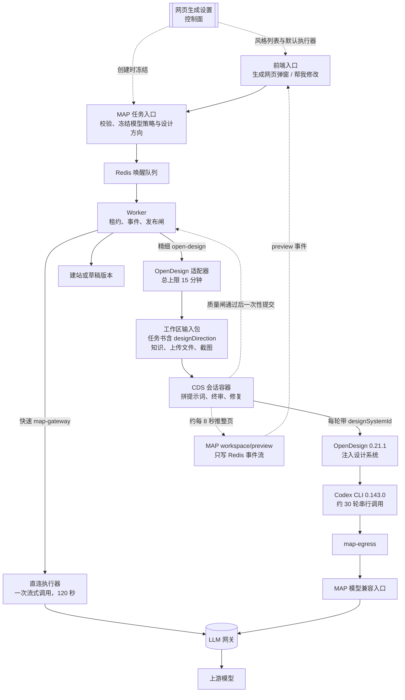

# 知识驱动设计生成体系 · 设计

> **版本**：v3.6 | **日期**：2026-09-23 | **状态**：OpenDesign 链路已首次端到端跑通（样本 1 份）；编辑路径与稳定性样本待补

**一句话**：MAP 管住知识、模型、任务和版本，CDS 管住隔离工作区，OpenDesign（无头设计执行器）只在工作区内完成设计。
**谁该读**：维护知识库、网页托管、HTML PPT、LLM Gateway、CDS Agent 运行时的产品与研发人员。
**读完能做什么**：解释 OpenDesign 在系统中的准确角色、四个 MVP 如何共用内核、对象存储文件如何参与设计，以及新 Provider 如何低成本接入。

---

## 管理摘要

OpenDesign 在本体系中不是第二套 MAP，也不是用户直接登录的业务系统，而是一个无头设计 Provider。它接收已经准备好的普通文件工作区，在隔离容器中调用自己的设计循环和 Codex CLI Agent，完成后把网页写回同一个工作区。MAP 始终是业务事实源，CDS 始终是执行与隔离事实源。

这次接入采用“会话工作区加一次原子提交”，而不是在 MAP、CDS、OpenDesign 之间反复传单个文件。知识源文件仍由 MAP 按权限从对象存储读取；MAP 把本次任务所需内容封装为不可变输入包，CDS 下载并校验后物化进会话专属 Docker 命名卷，OpenDesign 只读写这个卷。结束时 CDS 只提交一份带哈希的结果包。这样既保留对象存储的可靠性，又避免实现一套复杂的双向文件同步协议。导出暂存目录仍需由 CDS 与 Docker 宿主共同可见，不能把私有临时目录当成共享路径。

模型主动权也在 MAP。OpenDesign 不保存上游模型配置，只收到本次运行的兼容地址、逻辑模型名和随机占位密钥；真实模型票据只存在于 CDS 会话出口代理的私有临时环境文件中，由代理剥离外部执行器伪造的认证头后注入。所有请求仍经过项目 LLM Gateway，按 MAP 的调用方、用户、任务、配额和模型池记录。

## 完整调用链

```text
网页托管生成   知识库生成   HTML PPT   已托管网页“帮我修改”
      |             |           |                 |
      +-------------+-----------+-----------------+
                            |
                            v
                MAP 统一设计任务与知识快照
            权限、来源、阶段、取消、恢复、版本事实
                            |
                   Provider 能力选择
                  /                     \
                 v                       v
       MAP 内置执行链             OpenDesign 候选执行链
                                         |
                    MAP 生成不可变工作区输入包
                      对象存储保存 + 内容哈希
                                         |
                         短期工作区下载票据
                                         |
                                         v
                         CDS Workspace Session
             独立容器、内部网络、限额工作卷、资源上限、期限
                                         |
                          下载校验后物化 /workspace
                                         |
                                         v
                        OpenDesign + Codex CLI Agent
                     读取知识文件并修改共享工作区
                              |              |
                              |              v
                              |      MAP 模型兼容入口
                              |              |
                              |              v
                              |         项目 LLM Gateway
                              |              |
                              +--------------+
                                         |
                              写出最终 index.html
                                         |
                                         v
                  CDS 路径白名单、哈希、大小与清单校验
                                         |
                          一次性向 MAP 原子提交结果包
                                         |
                                         v
                   对象存储产物 -> 草稿 -> 发布版本 -> 回退
```

阶段事件走独立的可续接通道。用户会看到工作区准备、容器启动、OpenDesign 导入、设计运行、结果校验和提交；运行阶段至少每三秒更新已用时。MAP 内置执行链会在完整安全 HTML 闭合后即时刷新隔离预览；OpenDesign 候选首版只展示阶段与用时，不把尚未闭合的临时页面当作可执行预览。最终页面只以校验后的工作区提交为准。

## 架构图解（2026-09-21 实测跑通版）

上面的文字链路是设计意图；这一节是**真实跑通那一次**的样子，外加两条路径的实测对比。图里每条边都在一次成功的运行里被真实走过。

### 两条路径



两条路径共用同一个入口、同一份知识快照、同一个网关和同一套版本体系，区别只在「谁来写这张网页」。

### 让 OpenDesign 路径真正跑通的三条契约



根因只有一个：Codex 在 Linux 上默认给自己套一层 bubblewrap 沙箱，而会话容器已经按最小权限锁死，里面建不出第二层。外层容器本身就是隔离边界，所以让 Codex 不再套这一层；隔离强度没有降低（容器参数由守卫测试锁住，出现 `--privileged` 或 `--cap-add` 即红）。另外两条收件契约与失败取证在查根因的过程中加上，现已保留为正式契约。

### 实测对比（同一篇稿子、同一条指令）

| 指标 | OpenDesign + Codex | 直连 |
|---|---|---|
| 耗时 | 约 9 分钟 | 约 50 秒 |
| 模型调用 | 34 次（生成 + 自审 + 修复） | 1 次 |
| 输入 / 输出 token | 约 173 万 / 2.0 万 | 网关未分项记录 |
| 页面结构 | 5 个章节、2 张对比表、1 个可展开块、9 个站内锚点 | 4 个章节、0 张表、4 个站内锚点 |
| 占位残留 / 空链接 | 0 / 0 | 0 / 0 |

取舍：OpenDesign 版结构更像设计稿，但慢约 10 倍、输入 token 高两个数量级（每轮自审都带着完整上下文）。适合「一次做好、会被反复看」的页面；要快速出稿或成本敏感时走直连。当前只有 1 份成功样本，稳定性与编辑路径尚未验证，见 [debt.platform.open-design.md](debt.platform.open-design.md)。

## 强链路控制（2026-09-23 按代码基线 58f8205d5 核对）

这一节回答三个问题：一次网页生成从点击到入库经过哪几跳；每一跳由谁决定提示词、风格、模型、执行器、自查强度、超时和配额；出了问题拿什么去哪里查。结论先行：

- 两条路径共用入口、队列、Worker、网关和版本体系，只在执行器处分叉。
- 「网页生成设置」是控制面：默认执行器（内置 OpenDesign）、风格预设（内置 8 套，对应 OpenDesign 设计系统）、创作 / 修改 / 自查三段提示词、自查强度，管理员可改。每次运行把当时的设置冻结进运行记录和任务书，并带 12 位提示词指纹，之后改设置不影响已创建的运行。
- 仍写死在代码里的：平台契约（设置页只读展示）、修复上限 4 次、精细路径 15 分钟总时限。
- 贯穿全链路的唯一主键是 runId：MAP 运行记录、CDS 会话（追踪号即 runId）、网关请求日志三处都能按它对上。
- 部署是否生效（2026-09-23 预览环境实测）：MAP 与前端已生效——默认执行器 open-design、风格与提示词指纹冻结进运行记录、旧版 CDS 正常接收新任务书；CDS 侧三项（把设计系统传给 OpenDesign、按自查强度编排终审、实时预览推送）要等共享 CDS 切到本分支后才能实测。

### 链路总览



| 路径 | 耗时 | 模型调用 | 边写边看 | 设置里生效的 | 修改限制 |
|---|---|---|---|---|---|
| 快速（map-gateway） | 约 50–73 秒 | 1 次 | 正文流式 | 风格名与说明 | 单个无脚本 HTML，不收截图 |
| 精细（open-design，内置默认） | 生成约 9–12 分钟，修改约 5 分钟 | 32–34 次串行 | 约每 8 秒整页推送 | 设计系统、三段提示词、自查强度 | 整包校验，放行脚本与多文件，可附截图 |

### 每一跳控制什么

| 跳 | 它决定什么 | 能控制的 | 能观测到的 | 出问题先查 |
|---|---|---|---|---|
| 网页生成设置 | 默认执行器、风格、三段提示词、自查强度 | 管理员在设置抽屉里改，提示词可恢复默认 | 当前提示词版本、修改人与时间 | 风格停用或不存在时创建直接报错 |
| 前端入口 | 执行器、风格、上传文件、截图 | 用户每次选 | 事件流含 preview；运行信息显示风格 | 预览空白时看 CDS 的预览推送事件 |
| MAP 任务入口 | 冻结模型策略与设计方向；来源至少一种 | MAP 配置里的模型策略 | runId、运行记录、evidence 接口 | 截图只收精细路径；快速修改只收单 HTML |
| Worker | 进度、阶段文案、发布闸 | 取消 | 进度 18 → 86 → 88 → 100 | 输入超约 24 万字符；终态错误未送达 |
| 直连执行器 | 提示词、温度、120 秒超时 | 模型策略 | model 事件、网关 1 条日志 | 按 runId 查网关日志 |
| OpenDesign 适配器与输入包 | 15 分钟总上限、任务书内容、25 分钟票据 | CDS 连接 | 输入哈希、调用计数 | 截图读取失败会让本次运行失败并点名 |
| CDS 会话容器 | 提示词拼装、终审轮数、修复上限、预览推送 | 镜像、会话资源策略 | 阶段码（含终审 pass、修复 attempt、预览推送） | 设计方向格式不对报 workspace_package_invalid |
| OpenDesign 与 Codex | 设计循环、注入设计系统、调几次模型 | 无产品开关 | 网关里同一 runId 的一串调用 | 风格没差别时先核对运行记录里的设计系统编号 |
| 模型兼容入口与网关 | 实际模型、审计归属、Key 门禁 | 代理时限、网关模型池 | 按 runId 过滤的请求日志与汇总 | 上游 429 / 5xx、额度 |

### 控制点矩阵

| 控制项 | 在哪一层决定 | 谁能改 | 何时生效 | 事后追溯 | 部署是否生效 |
|---|---|---|---|---|---|
| 执行器 | 前端选，默认值来自设置；不可用时前端回落到可用执行器 | 用户；管理员改默认 | 下次打开弹窗 | 运行记录执行器字段 | 见上方部署结论 |
| 风格 / 设计系统 | 设置里的风格预设；生成时用户选，修改固定默认风格；OpenDesign 按设计系统注入设计规范（镜像内已核实） | 管理员维护，用户选 | 下一次运行 | 运行记录风格与设计系统编号 | 见上方部署结论 |
| 创作 / 修改 / 自查提示词 | 设置；接在平台规则之后，只作用于精细路径 | 管理员 | 下一次运行 | 提示词指纹 | 见上方部署结论 |
| 平台契约 | CDS 平台规则 + 质量闸 + 发布闸；设置页只读 | 研发 | 发版后 | 契约版本号（不计入指纹） | 见上方部署结论 |
| 自查强度 | 设置；关闭跳过模型终审但保留发布闸与修复回路，轻量一轮终审，严格再加一轮视觉复查 | 管理员 | 下一次运行 | 运行记录 reviewMode、终审 pass | 见上方部署结论 |
| 输入来源 | 知识引用与上传文件至少一种；修改可附截图（仅精细路径） | 用户 | 本次运行 | 运行记录上传与截图清单 | 见上方部署结论 |
| 模型 | MAP 配置，创建时冻结；网关解析真实上游 | 运维、网关管理员 | 新运行 / 下一次调用 | 策略快照、网关日志 | 本轮未改动 |
| 超时 | 直连 120 秒；精细总 15 分钟；会话 900 秒；代理 900 / 90 秒；票据 25 分钟 | 研发与运维分管 | 下一次运行 | 超时错误码与失败文案 | 本轮未改动 |
| 修复次数 | CDS 常量 4 次，任何自查强度下都在 | 研发 | 发版后 | 阶段事件、网关调用条数 | 本轮未改动 |
| 调用额度 | 单次运行不设上限，只计数；复用网关 Key 门禁 | 网关管理员 | 即时 | 调用计数、网关日志 | 本轮未改动 |
| 隔离 | 容器最小权限、只经代理出网、队列作用域、票据绑定 runId；预览用工作区凭证、只写 Redis | 研发 | 发版后 | CDS 会话日志、evidence 接口 | 见上方部署结论（预览部分） |

### 单次运行怎么追

以第二个样本（总 12 分 05 秒、32 次调用，相当于自查强度轻量）为形状：准备工作区约 2.5 分钟，32 轮模型调用串行约 8 分钟（写页面那一轮约 76 秒），其余约 1.5 分钟为推算。该样本早于本轮实现，严格与关闭两档还没有实测样本。


进度是按阶段和已运行时长估的，不是真实完成比例。三处对账：

| 在哪看 | 用什么对上 | 看什么 |
|---|---|---|
| MAP 运行记录 | 运行记录编号 = runId | 状态、执行器、模型策略、风格、设计系统、自查强度、提示词指纹、调用计数；evidence 接口一次拼好另外两处 |
| CDS 事件 | MAP 会话记录的追踪号 = runId，指向 CDS 会话号 | 阶段码序列、错误码、会话日志 |
| 网关日志 | 请求日志的 RunId = runId | 逐条开始时间、耗时、输入 token、状态；条数应等于 MAP 调用计数 |

实时预览只写 Redis 事件流、保留 24 小时，不入库，不作为事后对账依据。

### 已知缺口

| 缺口 | 影响 | 状态 |
|---|---|---|
| 本轮落地的设置、风格、提示词、自查强度与实时预览尚未在预览环境验证 | 只能说代码已提交，不能说已生效 | 见上方部署结论 |
| 平台契约的说明文本与 CDS 执行版是两份 | 改契约时可能只改一边 | 靠人工同步 |
| 设置只记最后一次修改人，没有历史与回滚 | 改坏提示词只能手工恢复默认 | 未排期 |
| 精细路径拿不到实际模型 | 前端无法显示这次用的是哪个模型 | 已记台账 |
| 终态错误偶发送不到 MAP | 用户等满 15 分钟看到的是超时 | 已记台账，未定案 |
| 单次运行没有 token 预算，修复次数与总时限不可配 | 成本与时长只能事后看 | 用户决策 / 未排期 |

## 三方边界

| 系统 | 持有的事实 | 明确不持有 |
|------|------------|------------|
| MAP | 用户权限、知识快照、Provider 选择、模型配置、任务、进度、草稿、版本、发布与回退 | Docker 生命周期、外部 Agent 内部状态 |
| CDS Remote Agent | 工作区、会话容器、资源限制、短期凭据注入、运行事件、结果校验、停止与清理 | 业务知识权限、模型长期密钥、网页版本事实 |
| OpenDesign | 设计循环、工具调用、工作区文件修改 | MAP 登录、对象存储凭据、知识库接口、发布权限、长期模型配置 |

这意味着隔离容器应继续归 CDS，未来甚至可以拆成独立 Remote Agent 底座项目。MAP 只依赖稳定的会话、工作区和事件合同，不需要理解 Docker 或 OpenDesign 的内部目录。

## 对象存储与共享工作区

对象存储是跨系统交付和审计层，工作区是本次运行的操作层，两者并不冲突。

1. MAP 在用户权限范围内读取所选知识，固定正文与内容摘要。
2. MAP 生成任务说明、知识文件和可选的当前网页，并保存为内容寻址的输入包。
3. CDS 用短期票据下载输入包，逐文件验证路径、大小和哈希，再物化为普通目录。
4. CDS 通过受控复制把文件放入会话专属限额工作卷，OpenDesign 直接读写该卷，不需要理解对象存储。工作卷、运行时目录、临时目录和模板目录同时受字节与 inode 硬上限约束。
5. CDS 只收集白名单内文件，生成权威产物清单，再用原下载通道的一次性权限提交结果。
6. MAP 校验任务、基线版本、文件哈希和产物清单后保存结果包，后续发布和回退仍走原有网页版本体系。

输入与结果都可独立校验；同一任务第二次提交相同结果视为幂等，提交不同结果会被拒绝。结果复制前还会在容器内检查节点数、文件数、总字节、目录深度、特殊文件和路径白名单。工作区不是长期共享盘，会话停止、超时或失败后必须删除容器、内部网络、工作卷、暂存目录和短期凭据；异常清理会进入有界重试，CDS 重启时再按受管标签回收遗留资源。

## MAP 权威 LLM Gateway

OpenDesign 只能被动使用 MAP 下发的模型信息：

- 模型地址指向本次任务的 MAP 兼容入口，不指向真实上游。
- 对外模型名固定为 MAP 管理的逻辑名称；实际模型池由 MAP 配置决定。
- OpenDesign 主容器只拿随机占位密钥；真实模型票据只交给会话出口代理，只对一个任务有效并在短时间后失效。
- 不增加任务累计或单次运行的模型调用次数上限；按用户决策复用 Key 侧门禁，保留真实调用计数，不修改或绕过 Key 配置。
- MAP 给每次调用补充调用方、用户和任务归属，LLM Gateway 继续承担模型选择、审计、计量和错误治理。
- CDS 只在内存中持有工作区传输票据；OpenDesign 容器拿不到对象存储、结果提交或真实模型票据。
- OpenDesign 所见模型地址是会话内限域代理；代理只允许既定 MAP 模型路径、禁止重定向与协议升级，并拒绝私网、回环、链路本地和元数据地址。代理删除来路认证头后注入 MAP 票据。
- 设计执行链不再另设固定输出长度：MAP 原生请求不额外注入输出 token 上限，OpenDesign 的输出参数交由既有 LLM Gateway 校验与模型能力策略处理。单结果协议仍保留，不增加批量候选输出；这与消费预算分开治理。

因此模型切换、限额和审计只改 MAP，不需要进入 OpenDesign 配置页重复维护。

明确模型与自动调度由两侧消费同一份 MAP 设计配置，实际效果比较还需从网关日志核对模型及平台一致。当前 MAP 内置执行接口尚不能表达显式模型池语义；配置显式池时，该执行器会在调用前明确拒绝，而不是悄悄改用默认模型。OpenDesign 保留显式池支持，扩展内置接口前不能宣称两侧所有选模模式等价。

## 会话级隔离

OpenDesign 只有在以下事实同时成立时才可选择：Docker 可用、固定版本镜像已安装、镜像内存在兼容的 Codex CLI、每会话资源限制可强制、运行时健康检查通过。

每次会话使用独立的容器名、限额工作卷和内部网络；容器根文件系统只读，不授予 Linux capability，不开放宿主端口，并限制 CPU、内存、进程数、日志大小和最长存活时间。四个可写挂载点都设置字节与 inode 硬上限，节点不能通过真实探针证明限额生效时 Provider 保持不可用。会话网络本身没有通用出口，OpenDesign 只能经会话代理访问 MAP 指定的单一模型入口，不能探测宿主、云元数据或其他内部服务。隔离或代理建立失败时任务直接失败，不降级到开放网络。

任何一项不成立时，Provider 目录会显示具体原因并拒绝创建会话。这就是“具备真实会话级资源隔离前保持禁用”的含义：不是藏一个开关，而是运行节点不能证明隔离事实时，产品上根本不可选。

## 部署方式

CDS 使用自有衍生运行镜像：固定 OpenDesign 0.21.1，并补入固定 Codex CLI 0.143.0（早期版本曾用 OpenCode，已替换）。测试运行配置固定到镜像摘要；源码已经附第三方来源与许可证责任说明，但当前测试摘要早于该说明，只有下一次衍生镜像构建后才能宣称它已进入分发物。正式发行还必须补齐许可证全文、模板逐项归属、基础镜像和依赖锁定、软件物料清单与来源证明。CDS 启动时会在后台准备缺失镜像，准备期间仍显示不可选；安装完成并通过探针后才会把 OpenDesign 标为可用。

OpenDesign 不作为 MAP 常驻服务，也不暴露独立公网入口。每次任务由 CDS 动态创建短生命周期容器，任务结束即清理。这能保持上游项目更新简单：升级时只替换衍生镜像的两个固定版本，先在 CDS 验证合同，再逐步放量；MAP 的四个业务入口和版本系统无需跟随重写。

工作区暂存默认复用 CDS 构建缓存所在的数据根，并继续按实例与会话隔离；运维显式指定的工作区路径优先。该路径必须在 CDS 服务和 Docker 宿主中指向同一目录。systemd 私有临时目录保护保持开启；若控制面本身容器化，也必须验证共享路径映射，不能仅凭容器健康认定导出可用。

## 插件式扩展

Provider 插件合同分为能力和适配器两部分。能力回答“能否做某类产物”，适配器回答“如何运行”。调度按能力匹配，不按 OpenDesign、ClosedDesign、Codex 或 Claude 的名字写业务分支。

| 合同维度 | 作用 | 接入新 Provider 时必须证明 |
|----------|------|----------------------------|
| 能力 | 生成或修改哪些产物、允许哪些入口 | 真实支持，不用模型名冒充能力 |
| 执行归属 | MAP 内部或 CDS Remote Agent | 谁负责运行、停止和恢复 |
| 隔离要求 | 进程内、共享运行时或会话容器 | 所需资源策略已在真实节点强制 |
| 模型协议 | 是否接受 MAP 兼容入口 | 不引入第二套模型配置源 |
| 工作区协议 | 输入、输出、基线与提交方式 | 能验证路径、哈希、大小和版本 |
| 事件协议 | 阶段、思考、进度、完成和失败 | 可续接、可取消、长任务持续变化 |
| 许可与部署 | 外部代码、模板与 Agent 来源 | 版本、许可证和升级责任明确 |

未来接入 ClosedDesign 时，四个产品入口、知识快照、任务、版本和发布都不变，只新增 Provider 定义、运行适配和部署证据。Codex 或 Claude 也遵循相同规则；本期不复制其智能体实现，只有在 CDS 真正部署后才加入候选。

## CDS Agent 可借鉴的部分

CDS Agent 借鉴 OpenDesign 的运行时结构，而不是复制其界面或智能体：

- 用薄适配器接 Agent，让任务、工作区和事件合同保持稳定。
- 把守护进程、Agent CLI、模型能力和可交付物分别作为可探测事实。
- 让长任务用可恢复事件表达进度，最终以产物提交而非对话文本为准。
- 把工作区变成 Agent 间协作的公共边界，减少供应商专有消息格式。

MAP/CDS 是多租户服务端，仍必须保留自己的授权、审批、配额、审计和容器隔离，不能照搬本地单用户工具的信任模型。

## 四个 MVP 的投射

| 入口 | 用户输入 | 统一动作 | 最终产物 |
|------|----------|----------|----------|
| 网页托管知识生成 | 知识条目与两句话 | 快照知识、创建任务、选择执行器、保存结果 | 新托管网页与首个版本 |
| 知识库智能生成 | 当前文档与目标类型 | 自动带入来源并进入网页或 HTML PPT 流程 | 可编辑网页或幻灯片 |
| HTML PPT | 知识、主题、页数与要求 | 保留成熟大纲与页面生成，统一记录来源和任务 | 可编辑幻灯片并可发布为网页 |
| 网页帮我修改 | 现有站点、知识与修改要求 | 基于当前版本建立工作区，生成草稿后显式发布 | 新版本、历史预览与回退版本 |

首版 OpenDesign 候选主要投射网页生成和网页修改；HTML PPT 继续使用已有成熟链路。网页修改首版只接受声明式、自包含的单页 HTML；含脚本、表单、外链资源或 ZIP 多文件资产的站点会在创建任务前明确拒绝，不会消耗知识解析和模型调用。统一发生在知识来源、任务身份、Provider 合同和发布回写层，不为追求形式统一而降低现有能力。

## 交互演进

**终极目标（2026-09-24 用户定）**：任何资料——Markdown、知识库文档、会议纪要、通话记录、录音文件、别的 Agent 做好的 HTML——都能在 MAP 里变成给客户看的网页或演示稿，并且发布出去，全程不离开 MAP，手机上也能做完。一条龙控制在 10 分钟左右：引用知识、操作简单、一键发布。

据此确定的交互方向（原型待用户确认）：

- **一个对话 + 一个预览**：点「生成网页」直接进工作台，左边对话，右边预览，不再分步点选。
- **资料是加法不是二选一**：输入框旁一个加号，知识库、上传文件、录音（自动转写）、粘贴会议纪要、截图可以混着放。
- **预览先于生成**：还没生成时右边就是所选风格的真实样张，标题先换成用户的资料；风格用真实缩略图挑，用户可以用一张截图或一个网址做自己的风格。
- **生成与修改是同一个对话**：做好后在同一处继续说想改哪里，先出草稿，线上不变，线上版与草稿可切换对比，确认后再覆盖。
- **发布是一个按钮**：得到链接与二维码，客户免登录可看，改版后同一链接自动更新。
- **入口跟着资料走**：知识库文档页、录音转写页、周报等处都放同一个「做成网页」按钮，点了带着资料进同一个工作台。

当前首版已提供持续阶段和用时变化、取消、超时、失败原因、最终草稿与版本恢复。下一阶段可在不改变最终提交合同的前提下增加工作区只读快照，让用户在 OpenDesign 运行时看到临时页面生长，并把自然语言微调、框选区域修改和版本差异都落在同一任务上。

临时预览永远不是发布事实。只有 CDS 校验完成且 MAP 接受原子提交后，页面才成为可发布草稿；这样即使网络中断、OpenDesign 崩溃或模型输出半截文件，也不会污染正式版本。

## 主要风险与控制

| 风险 | 控制 |
|------|------|
| 上游版本或 Agent CLI 不兼容 | 双版本固定、能力探针、CDS 灰度、合同测试 |
| 知识或长期凭据泄露 | 最小知识快照、短期分权票据、容器不持有对象存储权限、会话清理 |
| 多处模型配置漂移 | MAP 单一配置源，OpenDesign 只消费运行参数 |
| 半成品被当成正式网页 | 工作区预览与 MAP 原子提交分离，版本发布仍需显式动作 |
| 容器退出后资源残留 | 停止、超时、取消与失败均进入清理；失败保留真实资源句柄并由有界重试与启动回收共同收敛 |
| Agent 借模型接口横向访问 | 内部网络加单目标限域代理，DNS 结果与路径双校验，任何隔离失败均关闭执行 |
| 生成 HTML 主动联网或逃逸 | 提交前拒绝外部资源、网络 API、框架嵌入与动态导入，并注入严格内容安全策略 |
| 进程崩溃留下幽灵站点或草稿 | 任务租约、提交中状态、持久清理计划与精确来源栅栏共同恢复；用户已发布或分享的站点不得被补偿删除 |
| Provider 名称侵入业务代码 | 能力目录和适配器分离，四个入口只依赖通用合同 |
| 视觉效果不及成熟 AI 产品 | 冻结相同输入做匿名对照，由独立 Agent 严厉评分并保留失败项 |

## 发布验收

1. 四个入口能说明来源、目标、阶段、真实执行器和最终版本。
2. OpenDesign 未安装、缺少 Codex CLI 或隔离失败时不可选择，并显示可恢复原因。
3. 同一冻结输入在 MAP 基线和 OpenDesign 候选中使用相同知识与简报，核对实际模型及平台一致；如有差异必须单列，不能归因于执行器效果。调用只受已有 Key 门禁约束。
4. 模型请求全部出现在项目 LLM Gateway 审计中，OpenDesign 无独立上游配置。
5. 输入、结果、清单和版本按分层哈希核对：整包结果哈希、清单文件哈希、清单内入口文件哈希和发布后页面字节哈希不得混为同一数值；重放、跨任务提交、越界文件和超限均被拒绝。
6. 取消、超时、失败和正常结束都不留下可运行容器、独立网络、工作区或短期凭据。
7. 真实 CDS 预览完成网页生成、知识库直达、HTML PPT、网页微调与版本回退。
8. 首批部署后通过独立对抗审查、匿名视觉评分和实施前密封的最终盲验。

## 关联文档

- [实施计划](./plan.platform.design-generation.md)
- [网页托管与分享](./design.web-hosting.md)
- [生成快照](./design.platform.generation-snapshot.md)
- [CDS Agent 运行时架构](./design.cds.agent.runtime-architecture.md)
- [MD 转网页 PPT 债务台账](./debt.md-to-ppt.md)
