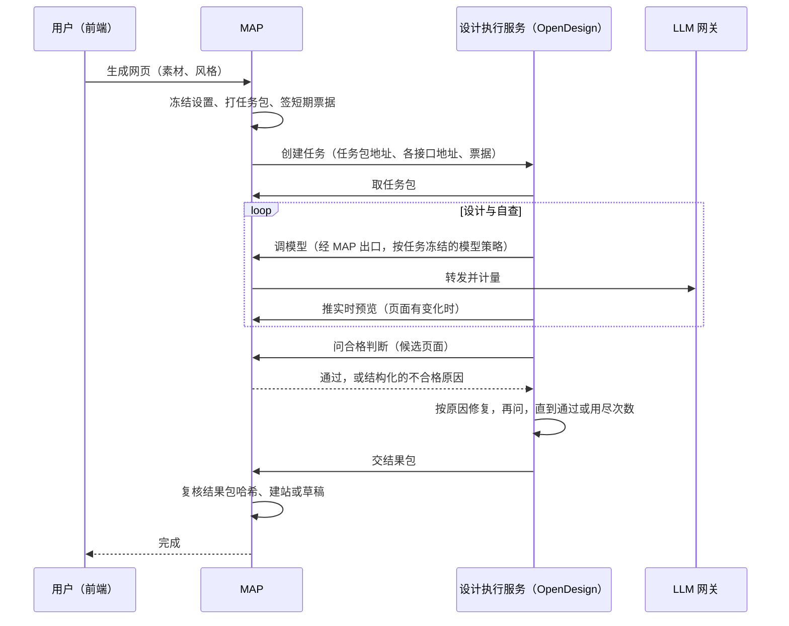

# 设计执行服务独立部署 · 设计

> **版本**：v0.1 | **日期**：2026-09-23 | **状态**：待确认

**一句话**：OpenDesign（设计网页的执行引擎）从 CDS 里搬出来，成为和 LLM 网关同级的独立服务；MAP 按一份公开协议调用它，以后的其它设计引擎照同一协议接入，CDS 只把它当普通服务部署。
**谁该读**：决定设计生成架构的负责人；实现 OpenDesign 服务、MAP 适配器、部署配置的研发。
**读完能做什么**：知道每个部件归谁、MAP 与执行服务之间传什么、分支预览与生产怎么部署，以及需要拍板的两件事。

---

## 一、管理摘要

现状的问题：「起容器、拼提示词、把风格传给 OpenDesign、自查几轮、推实时预览、判页面合不合格」这些设计执行逻辑写在 CDS 自己的服务代码里（约 2800 行）。后果有三：

1. 改一句提示词或一个自查规则，要重启全公司共用的那台 CDS 才能生效，分支预览没法独立验证；
2. 页面合格判断有两份（CDS 一份、MAP 一份），曾让一次 13 分钟的生成在最后一步被另一份判据作废；
3. OpenDesign 被当成了 CDS 的一部分，将来接第二种设计执行器只能继续往 CDS 里塞。

目标形态：OpenDesign 是一个**独立服务**，有自己的镜像、自己的部署条目、自己的版本；MAP 按一份**设计执行协议**调用它。CDS 在分支预览里把它当普通服务起一个容器，在生产里把它当普通服务发布——CDS 不知道它是做设计的。

## 二、每个部件归谁

| 部件 | 负责什么 | 不负责什么 |
|---|---|---|
| MAP | 用户、权限、任务、风格与提示词设置（冻结进任务书）、知识与附件打包、模型出口与计量、**唯一的页面合格判断**、版本与发布 | 不关心执行器内部怎么设计页面 |
| 设计执行服务（OpenDesign，将来还有其它） | 接任务 → 读任务书 → 驱动自己的设计引擎 → 自查与修复 → 推实时预览 → 交回结果包 | 不存用户数据、不发布、不直接连上游模型 |
| 公共传输（MAP 提供的一组对外接口） | 取任务包、调模型、推预览、问合格判断、交结果，全部凭本次任务的短期票据 | — |
| CDS | 分支预览里把执行服务当普通服务部署；生产发布时同样当普通服务发布 | 不含任何设计执行逻辑，不认识任务书 |

「公共传输」就是今天 MAP 已经有的 `/api/design-artifacts/runtime/{runId}/…` 那组接口，加上一个「合格判断」。任何执行服务都走它，不经过 CDS。

## 三、一次生成怎么流动

要点：

- **合格判断只有一处，在 MAP**。执行服务的修复回路按 MAP 给的原因去改，页面到了最后一步不会再被另一套判据推翻。
- MAP 与执行服务之间只有一份协议（任务、事件、取消、能力）。接 CloseDesign 就是再部署一个实现同一协议的服务，MAP 设置里多一个可选执行器。
- 执行服务拿不到上游模型的地址和密钥，只能经 MAP 出口；调用次数与费用照旧由网关 Key 门禁控制。

## 四、设计执行协议（MAP ↔ 执行服务）

| 方向 | 动作 | 内容 |
|---|---|---|
| MAP → 服务 | 查能力 | 引擎名与版本、支持的设计系统清单、是否健康、当前排队数 |
| MAP → 服务 | 创建任务 | 任务编号、任务包地址、模型出口地址、预览 / 合格判断 / 结果提交地址、短期票据、超时 |
| MAP → 服务 | 读事件 | 阶段、已运行时长、第几轮自查或修复；支持断线从上次序号续读 |
| MAP → 服务 | 取消 | 停止任务并清理工作目录 |
| 服务 → MAP | 公共传输 | 取任务包、调模型、推预览、问合格判断、交结果（均为现有接口，合格判断为新增） |

任务书（brief/task.json）继续用现在的格式，其中风格、设计系统、三段提示词、自查强度已经由 MAP 冻结，执行服务只读不改。

## 五、怎么部署

| 环境 | 做法 |
|---|---|
| 分支预览 | 像 `llmgw-serve` 一样：每次提交构建一个 OpenDesign 服务镜像，在部署清单里声明一个服务，MAP 通过服务名访问它。每条分支有自己的一份，改提示词、改引擎、改自查规则，推一下这条分支就能验，不碰共享 CDS |
| 生产 | 作为独立服务进入发布清单，与 MAP、网关分别发布、分别回滚 |
| 第二种执行器 | 再加一个服务条目，MAP 的执行器列表里登记它的地址 |

## 六、需要拍板的两件事

**1. 同一个服务里，不同用户的任务怎么隔离**

| 做法 | 隔离强度 | 代价 |
|---|---|---|
| A. 每个服务实例同一时间只跑一个任务，跑完清空工作目录；要并发就多开实例（推荐起步） | 任务之间不共存，彼此读不到文件与票据 | 并发数等于实例数，排队时用户看到排队位置 |
| B. 服务为每个任务再起一个隔离容器 | 最强，和现在一样 | 服务需要操作 docker，等于把 CDS 现在做的事搬进服务，部署与安全审查都重 |

建议先 A，并在界面上如实显示排队位置；真到并发不够再评估 B。

**2. 出网限制**

现在 CDS 给 OpenDesign 容器配了只能访问 MAP 的出口代理。独立服务按普通服务部署时，默认能访问外网。建议：服务内部把引擎的模型地址固定为 MAP 出口、关闭联网搜索（现在已是这样），网络层的白名单交给生产部署配置；分支预览接受「能出网但不带任何密钥」的状态，并记入台账。

## 七、迁移步骤

| 阶段 | 内容 | 验收 |
|---|---|---|
| 1 | 新建 OpenDesign 服务：把 CDS 里的设计执行逻辑（任务书、提示词、自查与修复、预览、结果打包）原样搬进去，实现第四节的协议；分支镜像与部署清单各加一条 | 分支预览里起得来，查能力返回健康 |
| 2 | MAP 新增「按协议调用执行服务」的适配器；新增合格判断接口，执行服务的修复回路改问 MAP | 在分支预览里真人走通一次生成与一次截图修改，并看到实时预览与风格效果 |
| 3 | MAP 默认切到新适配器，旧的经 CDS 会话路径保留一个版本作回退 | 连续数次生成成功，两道判据不再出现分歧 |
| 4 | 从 CDS 删除设计执行代码，CDS 只剩通用部署能力 | CDS 中搜不到任务书、提示词、设计系统相关代码 |

## 八、风险

- 第 1 阶段搬迁的是一段经过十几轮修复的代码，搬迁时只改归属、不改行为，行为变化留到第 2 阶段单独做，便于对比。
- 起步方案 A 下并发受实例数限制，高峰期会排队。
- 在旧路径删除前，两条路径并存，事件与进度文案要保持一致，避免用户看到两种说法。

## 九、关联文档

- [design.platform.design-generation.md](./design.platform.design-generation.md)：设计生成体系主文档（含强链路控制一节）
- [spec.platform.design-generation.settings.md](./spec.platform.design-generation.settings.md)：网页生成设置与风格预设
- [debt.platform.open-design.md](./debt.platform.open-design.md)：OpenDesign 台账（含两道判据分歧的记录）
