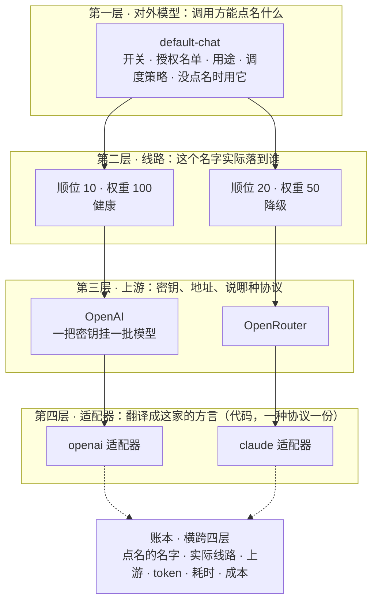
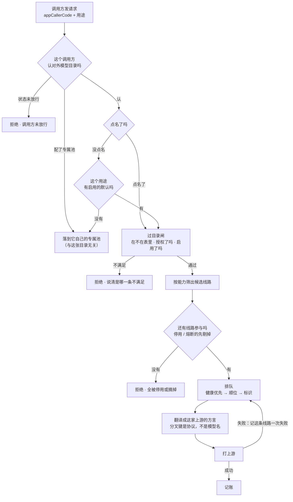

# 网关模型架构：一个名字、一条路、一份账 · 设计

> **版本**：v1.0 | **日期**：2026-09-14 | **状态**：四层已定，页面收敛已落地，异构上游三个槽在做

**一句话**：调用方点名的那个名字就是唯一的对外单位，模型池不再是一种单独的对象；四层各回答一个问题，账本横跨四层。
**谁该读**：要改模型调度、接新上游、或者被问「这次调用到底落到谁身上」的人。
**读完能做什么**：知道一个改动该落在哪一层、什么情况下允许改代码、以及怎么自己验证一次调用的去向。

---

## 1. 为什么要收敛

这套东西不是一次设计出来的，是被问题推出来的。按发生顺序：

1. **起初只有模型**。自己提供什么模型就对外什么模型，一张全局表，一个开关控制某个模型对外可不可见。
2. **开源模型开始不稳**，同一个能力挂多个上游，于是有了模型池和六七个调度策略。当时做了一个判断：
   **「那就默认都走模型池，一个池调度它下面所有模型，上游调度全部隐藏。」**
3. **异构上游冒出来**（fal.ai、AWS、Azure，OpenRouter 还有专属字段），不太奇葩的就用 if/else 追加；
   而种类层出不穷——单图、多图、分层……与此同时调用方只想用一种方式调。
4. **模型白名单**用来避免调用方穿透到任意上游模型。
5. **日志与价格**用来避免滥用。

第 2 条那个判断**是对的，只是没贯彻到底**。既然一切都走池，「池」就不必再是一种单独的对象——
它就是模型本身。可它被留成了和「模型」并排的第二个入口，于是后来每加一层治理就多一个平级入口：
模型白名单、模型池、Provider、模型、Exchange，五条导航回答同一件事的不同侧面，谁也说不清该去哪儿改。

**核心结论：挂 1 条线路它看着像「一个模型」，挂 5 条它看着像「一个池」——同一个东西。**

---

## 2. 四层，各回答一个问题

| 层 | 回答的问题 | 承载什么 |
|---|---|---|
| **对外模型** | 调用方能点名什么 | 公开名、启用开关、授权名单、用途、调度策略、「没点名时用它」标记 |
| **线路** | 这个名字实际落到谁身上 | 指向哪个上游的哪个模型、顺位、权重、健康与熔断状态 |
| **上游** | 密钥、地址、说哪种协议 | 一把密钥挂一批模型 |
| **适配器** | 怎么把统一请求翻译成这家的方言 | 代码，一种协议一份 |

横跨四层的是**账本**：每次调用记下点名的名字、实际落到的线路、上游、token、耗时、成本。



挂 1 条线路它看着像「一个模型」，挂 5 条它看着像「一个池」——图上是同一个方框。

**问错层就是设计坏了。**「这个名字能不能被调」问第一层；「这次落到谁」问第二层；
「密钥对不对」问第三层；「怎么把话说给它听」问第四层。这四个问题此前分散在五个入口里。

**白名单不是第六个对象**：第一层那张表本身就是白名单。名字在表里才能被点名，不在就拒。
一张表同时回答「能选什么」和「不能选什么」，不会漂移。

**上游为什么不并进模型页**：密钥与地址是一对多，一把密钥挂一批模型。并进去就要重复配 N 次，
轮换漏一遍就是静默 401（2026-06-12 踩过，事故台账见文末「实现来源」里的跨项目隔离规则）。
所以它降一级进「配置」区，但不消失。

---

## 3. 一次调用怎么走

1. **调用方发请求**。按用途发，形状统一。可以点名一个对外模型，也可以不点名。
2. **过目录闸**。名字在不在对外目录里、授权给这个调用方了吗、启用了吗。不满足当场拒绝并说清是哪一条。
3. **按能力筛出候选**。这个名字下所有线路，留下这次请求需要的能力都有的那些。
4. **挑一条**。先剔掉不参与的（停用 / 熔断），再按这个名字配的策略挑。
5. **翻译成它的方言**。按线路所属上游的协议交给对应适配器。
   **这是全链路唯一允许按上游分叉的地方，且分叉键是协议，不是模型名。**
6. **打上游**。失败就记这条线路一次失败，回第 4 步换下一条。
7. **记账**。



图上每个菱形都是一个「会拐走」的地方——**这条链路的难点从来不是谁调用谁，是在哪一步拐走**，
所以这里画的是判定流程图而不是时序图：六个出口套六层 alt 框，没人看得下去。

**这七步里没有一步需要知道「这是模型还是模型池」。** 如果将来某个改动让人必须先回答这个问题
才能往下写，说明那两个概念又长回来了。

**图与现状的两处差距**（不写出来就是拿设计图冒充实现）：第一个菱形右边那条「配了专属池」
的岔路，今天在代码里还留着一份调用方名单的例外（见第 5 节末）；「按能力筛出候选」这一步
今天是按名字上的能力并集算的，还没有真的落到每条线路上（见第 8 节第 1 条）。

### 不点名那条路

调用方只给 `appCallerCode`、不点名模型，是**主路径而不是边角情况**——多数业务调用方并不关心
用了哪个模型。

这条路是**两层**，顺序不能反：

1. **有没有模型认领了这个调用方**（对外模型上的「对这些调用方而言我是默认」）。
2. 没有，才回落到**这个用途**标了「没点名时用它」的那个模型。

第一层是模型池那个「按调用方兜底」能力的落点。少了它，把最后一个走池的调用方切过来时，
它会掉到全局默认上——换了模型，那不是断流是换药（2026-09-15 盘线上数据时才看出这个缺口：
`document-store.transcribe-summary::chat` 用的是自己池里的 gpt-4.1-mini，而 chat 的全局默认
是 gpt-3.5-turbo）。

「认领」与「授权」刻意是两个字段：授权回答「能不能点名我」，认领回答「不点名时是不是我」。
挤进一个字段的话，想给某人当默认就必须把别人挡在外面。同一用途下一个调用方最多被一个模型
认领，由写入侧保证——先摘别人再置自己，顺序反了会有一瞬两个模型都认领同一个人。

两层都查不到，或查到的那个自己停用 / 没有能接的线路，这类请求一律失败。

这条路的代价是调用方看不见自己用到了谁，所以控制台的**调用全貌**必须单独回答它（见第 6 节）。

---

## 4. 异构上游：把两条轴拆开

`if/else` 层出不穷，根因不是写得不够仔细，是**两件不同的事被写在同一段代码里判**：

```
if  上游是 fal.ai           → 换鉴权头和轮询响应      ← 协议
else if 上游是 openrouter   → 多塞两个专属字段        ← 专属字段
else if 模型名含 nano-banana → 参数换一种排法         ← 能力
else if 是多图 / 是单图     → 再换 / 又一种           ← 能力
```

能力这条轴本来就是层出不穷的，而它被写进了代码——代码分叉跟着模型数涨，那就没有尽头。

拆成三个槽：

| 槽 | 性质 | 放哪 |
|---|---|---|
| **协议** | 有限、涨得慢（openai / claude / fal / bedrock / vertex） | 适配器，**唯一允许改代码**的轴 |
| **能力** | 无限、层出不穷（文生图 / 图生图 / 多图 / 图层 / 思考 / 工具调用） | 线路上的**数据**，一张有限枚举表 |
| **专属字段** | 只有那一家认（`include_reasoning`） | 线路上的**透传槽**，原样送达，网关不理解也不该理解 |

**判据：接一个新模型不该改代码；接一个新协议才允许改代码。**
可以随时量：过去半年改适配器的次数应该约等于新接的协议数，而不是新接的模型数。两者开始接近，
说明能力又漏回代码里了。

**统一契约的代价说在前面**：上游某个独有特性如果没进能力枚举、也没走透传槽，调用方就用不到它。
这是有意的——统一契约的价值就来自不给例外开口子。真要用，走扩表那条路。

**有一类东西不该出现在模型列表里**：图片分层、去背景、放大需要先有一张图、不吃提示词、
没有尺寸概念。判据是「选了它之后能像别的模型一样直接用吗」——不能就是**动作**，
入口是选中对象后的按钮，不进模型目录的可选清单（详见 `capability-is-not-model.md`）。

---

## 5. 判据只许有一份

这套架构里最容易坏、坏了又最难发现的，是**同一个判断被写了几遍然后各自漂移**。
「这次会落到哪条线路」在 2026-09-14 之前有三份：运行时解析器一份、控制台前端一份
（`enabled && healthStatus === 0`）、面板要用的还得再来一份。
前端那份比运行时**严**——运行时照样会用降级线路，只是排在健康的后面，
于是全部降级时页面显示「没有主」，而实际一直有一条在承接。

现在收敛成：

- **权威定义一份**，放在主系统核心库里，运行时解析器直接调它。
- **控制台一份镜像**——控制台服务按既定架构不引用主系统的程序集，所以只能各存一份。
- **两者由一条行为对照测试钉死**：拿同一组输入喂进去，逐条比对结果。
  对照的是行为不是源码——扫源码只能证明那几行字面量还在，证明不了两边算出同一个答案。
  排序权重改了、跳过条件多了一项、tie-break 换了字段，源码扫描全都看不出来，行为对照会红。
- **前端零份**：排队名次由服务端下发。

判据本身刻意保持极小，只有两条：哪些线路不参与（停用 / 熔断），参与的怎么排队
（健康优先 → 顺位 → 标识 tie-break；按权重时在此基础上旋转一次）。

半开试探不在纯函数里：它要抢租约、要写库。面板也因此**不把它当成确定的下一跳**。

### 判据要有主语

2026-09-15 的对抗审查抓到一句**没有主语的话**：面板说「只给 appCallerCode、不点名模型时会落到它」，
而这个判断只看模型自己（是不是该用途的默认、启用了没、有没有能接的线路），全程不问「谁在调」。

运行时并不是这么走的：调用方一旦配了专属池，对外模型这一档**整个被跳过**，不点名的请求落在
它自己的池上。冒烟之所以全绿，是因为只跑了一个调用方，而它恰好不是这种——**一个样本判绿了
一句全称命题**。所以「这个调用方认不认对外模型目录」也收进了共享判据，面板改成逐个调用方给结论，
冒烟改成逐个调用方去对。

这里还留着一处债：即便配了专属池也仍然认对外模型目录的那几个调用方，今天是一份**写在代码里的
名单**。它至少只有一份、且被行为对照钉住，但正解是让它变成调用方记录上的一个字段——那属于第 8 节。

---

## 6. 调用全貌：让人看得见，而不是相信

一个人看着某个模型时，最想确认而配置项答不出的那件事是：**现在发一个请求，会落到谁。**

控制台模型页每一行有一颗「调用全貌」按钮，展开是六步推演，每步是**当前真实状态**：
第一屏一句结论（会落到谁 / 按权重怎么分 / 为什么调不通），然后是不点名那条路、目录闸、
候选线路逐条（顺位、权重、健康、跳过原因、单价）、协议适配器、近 30 天账本。

「不点名那条路」那一格**逐个调用方**给结论，不给一句笼统的总结：谁会落到它、谁走自己的专属池、
谁状态未放行。理由见第 5 节末——那句话必须有主语。

三条硬约束：

1. **结论在第一屏**。把一屏数字丢给人自己算「所以会落到谁」，这一屏就白做了。
2. **按权重分配时不许指名道姓**。运行时的落点由请求本身派生，说「会落到 A」就是编的，只能给比例。
3. **缺价如实说「未计价」，不补零**。把算不出钱的当零成本加进去，会让这一屏看起来很省钱。

验收方式不是「看它渲染出来了」，是**推演与实打对照**：面板说会落到 X，
拿真实接入密钥打一次（点名一次、不点名一次），看实际落到的是不是 X。不一致就是判据漂移。

---

## 6.5 减枝：判据份数是唯一的主角

同一个判断存几份，就有几处会各自漂移。「健康优先 → 顺位」这一句在 2026-09-15 之前有**五份**：
权威、控制台镜像、解析器里一个无人调用的 `SelectBestModel`、池成员重试候选的排序、
以及测试里一份「模拟 ModelResolver 逻辑」的私有拷贝（于是那 13 条用例断言的是它自己，
生产代码改了照样绿）。现在收到**两份**——权威 + 控制台镜像，其余全部改为调权威那份。

收敛时保住了一件事：池成员的 Id 传的是**补零下标**，权威判据最后一级 tie-break 按序数序排，
补零下标的序数序就是原数组顺序。同顺位同健康的成员谁先谁后与改之前一模一样——
**这一刀是减枝不是改行为**。

顺带砍掉的死枝：`ResolutionType == "DefaultPool"`（六个取值里根本没有它，这行比较从写下那天起
永远为假）、它喂的那个恒为 false 且无人消费的 DTO 字段、以及 `NeedsModelConfigFallback`。

### 有三条我决定现在不砍

它们看着都该砍，但都挂在同一根主干上——**线上流量还在走池**。不先断流，砍下面任何一条都不
减少复杂度，只是少了看它的地方。

| 枝 | 为什么现在不砍 |
|---|---|
| 入参 5 → 3 | 真问题不是「三个参数」，是 `expectedModel` 一个字段承载三种语义（对外模型名 / 池身份 / 被改写成 pinnedModelId）。包成一个 record 是化妆；其中「池身份」那一种断流后自动没了 |
| 代码里写死的三个调用方名字 | 它们是「配了专属池但仍认对外模型目录」的例外。搬成数据要加字段、加界面、做迁移——那是加东西不是减东西。池没了，这份名单整个不存在 |
| 六种解析结果 → 两种 | 它是写给日志和看板的**输出标签**，不是分支条件。收敛会打断既有口径，换来的只是「枚举少了四个」，那不是整洁，是把可诊断性剪掉了。真正该禁的是拿它做分支——已由守卫钉住 |

顺序固定为**断流 → 删路 → 删壳**，理由与删除清单同源，见看板。

---

## 7. 明确不做

- 不动对外契约：调用方现在按什么名字请求，之后还是那个名字。
- 不动 Mongo 集合名：旧集合原地保留，回退就是把默认标记关掉。
- 不把上游并进模型页（理由见第 2 节末）。
- 不为了「统一」而抹掉不同上游的真实价格差：价格挂线路，不挂名字。

---

## 8. 还差什么

按顺序：

1. **能力下沉到线路并真的参与筛选**。今天能力挂在名字上、按并集算，可能挑中一条做不了这件事的线路。
2. **开透传槽**，把上游专属字段从适配器代码里搬出来。
3. **生图那条统一契约**。chat 已经是一种形状，生图还在按模型名分叉。
4. **删掉旧那套**（池的解析分支、池的熔断实现、死壳 dispatcher、池页面）。不可回退，要单独批准。

前三件都能独立发、独立退。进度看板见 [plan.platform.llm-gateway.model-consolidation.md](./plan.platform.llm-gateway.model-consolidation.md)。

---

## 实现来源

| 这一层 | 落在哪 |
|---|---|
| 挑选判据（权威） | `prd-api/src/PrdAgent.Core/LlmGateway/GatewayRouteSelection.cs` |
| 挑选判据（控制台镜像） | `llmgw/console-api/LogicalModels/CallTracePlanner.cs` |
| 两者的行为对照 | `prd-api/tests/PrdAgent.Tests/GatewayCallTraceMirrorTests.cs` |
| 运行时解析 | `prd-api/src/PrdAgent.Infrastructure/LlmGateway/ModelResolver.cs` |
| 调用全貌端点 | `llmgw/console-api/Program.cs` 的 `/gw/logical-models/{id}/call-trace` |
| 调用全貌面板 | `llmgw/web/src/components/CallTracePanel.tsx` |
| 能力契约 | `prd-api/src/PrdAgent.Core/Models/GatewayCapabilityContract.cs` |
| 能力不等于模型（规则） | `.claude/rules/capability-is-not-model.md` |
| 减枝守卫（标签字面量 / 判据份数） | `prd-api/tests/PrdAgent.Tests/GatewayResolutionLabelGuardTests.cs` |
| 判据与接线纪律（规则） | `.claude/rules/predicate-and-wiring-discipline.md` |
| 跨项目隔离事故台账（规则） | `.claude/rules/cross-project-isolation.md` |

---

## 相关

- 看板与验收证据：[plan.platform.llm-gateway.model-consolidation.md](./plan.platform.llm-gateway.model-consolidation.md)
- 物理拓扑与剥离边界：[design.platform.llm-gateway.physical-isolation.md](./design.platform.llm-gateway.physical-isolation.md)
- 工程债务台账：[debt.platform.llm-gateway.md](./debt.platform.llm-gateway.md)
