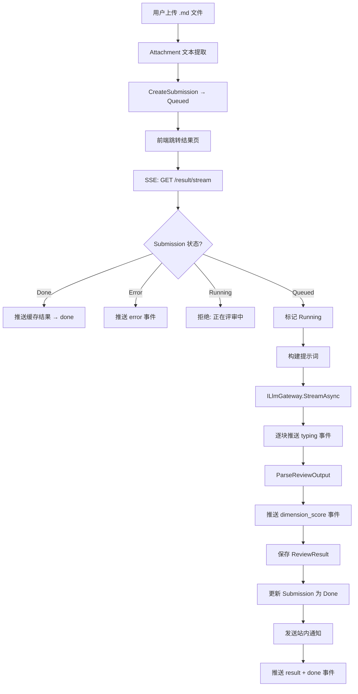

# 产品评审员技术设计文档

> **类型**：design | **模块**：review-agent | **最后更新**：2026-03-29
> **状态**：已实现 | **对应功能**：产品评审员 Agent（ReviewAgent）

---

## 1. 概览

产品评审员（ReviewAgent）是一个 AI 驱动的产品方案评审系统，支持将 Markdown 格式的方案文件提交给 LLM 进行多维度评分，并通过 SSE 实时向前端推送评审进度和结果。



---

## 2. 系统架构

### 2.1 应用身份

```
AppKey: review-agent
Controller: ReviewAgentController
Route: /api/review-agent
AppCallerCode: review-agent.review::chat
```

### 2.2 层次结构

```
prd-admin (React)
    └── ReviewAgentPage / ReviewAgentResultPage / ReviewAgentDimensionsModal
            ↓ HTTP + SSE
prd-api (ASP.NET)
    └── ReviewAgentController
            ├── MongoDbContext (review_submissions / review_results / review_dimension_configs)
            └── ILlmGateway → 默认 Chat 模型
```

### 2.3 数据库集合

| 集合 | 模型 | 说明 |
|------|------|------|
| `review_submissions` | `ReviewSubmission` | 提交记录，含状态机字段 |
| `review_results` | `ReviewResult` | 评审结果，含各维度分 |
| `review_dimension_configs` | `ReviewDimensionConfig` | 维度配置，空时用默认值 |

---

## 3. 数据模型

### 3.1 ReviewSubmission

```csharp
class ReviewSubmission {
    string Id              // Guid (36字符，去掉"-")
    string SubmitterId     // 提交人 UserId
    string SubmitterName   // 提交人展示名（快照）
    string Title           // 方案标题
    string AttachmentId    // 关联附件 Id
    string FileName        // 原始文件名（快照）
    string? ExtractedContent // 从附件提取的 Markdown 文本
    string Status          // Queued / Running / Done / Error
    string? ResultId       // 完成后关联 ReviewResult.Id
    bool? IsPassed         // null=旧数据, true=通过, false=未通过（快照）
    string? ErrorMessage
    DateTime SubmittedAt
    DateTime? StartedAt
    DateTime? CompletedAt
}
```

**IsPassed 语义说明**：

| 值 | 含义 | 产生方式 |
|----|------|---------|
| `null` | 旧数据（未写入快照） | 历史记录的兼容态 |
| `true` | 显式通过（≥80分） | 评审完成后写入 |
| `false` | 显式未通过（<80分） | 评审完成后写入 |

前端和 API 列表筛选的 `passed` 条件为 `IsPassed == true OR IsPassed == null`，`notPassed` 仅匹配 `IsPassed == false`。

**懒修复**：`GetSubmission` 读取时若 `Status == Done && IsPassed == null`，自动从 ReviewResult 回填并持久化，避免历史数据在筛选时行为不一致。

### 3.2 ReviewResult

```csharp
class ReviewResult {
    string Id
    string SubmissionId         // → ReviewSubmission.Id
    List<ReviewDimensionScore> DimensionScores
    int TotalScore              // Sum of DimensionScores.Score
    bool IsPassed               // TotalScore >= 80
    string Summary              // AI 总结评语
    string FullMarkdown         // LLM 原始输出（调试用）
    string? ParseError          // null = 解析成功
    DateTime ScoredAt
}

class ReviewDimensionScore {
    string Key        // 维度标识（如 "template_compliance"）
    string Name       // 维度名称快照
    int Score         // 实得分
    int MaxScore      // 满分
    string Comment    // AI 评语
}
```

### 3.3 ReviewDimensionConfig

```csharp
class ReviewDimensionConfig {
    string Id
    string Key          // 维度唯一标识，snake_case
    string Name         // 展示名称
    int MaxScore        // 满分（1-100）
    string Description  // 评分要点（写入 LLM 系统提示词）
    int OrderIndex      // 排序
    bool IsActive       // 是否参与评分
    DateTime UpdatedAt
    string? UpdatedBy
}
```

数据库为空时，`GetDimensions` 和 `RunReviewAsync` 均自动回退到 `DefaultReviewDimensions.All`（7维度，合计100分）。

---

## 4. 状态机

```
                  ┌──────────┐
     提交         │          │
  ───────────→   │  Queued  │
                  │          │
                  └────┬─────┘
                       │ SSE 连接（首次）
                       ▼
                  ┌──────────┐
                  │          │
                  │ Running  │  ← 并发 SSE 连接拒绝
                  │          │
                  └────┬─────┘
              ┌────────┴────────┐
              │ 评审完成         │ LLM/网关失败
              ▼                 ▼
         ┌──────────┐     ┌──────────┐
         │          │     │          │
         │   Done   │     │  Error   │
         │          │     │          │
         └──────────┘     └────┬─────┘
                               │ Rerun（用户主动）
                               └────→ Queued（循环）
```

**并发保护**：SSE Handler 在进入 Running 状态前检查 `Status == Running`，直接返回 `error` 事件，防止同一 Submission 被两个连接同时触发 LLM 调用。

**Rerun 流程**：
1. 删除旧 ReviewResult
2. 将 Submission 重置（Unset: ResultId / IsPassed / CompletedAt / StartedAt / ErrorMessage，Set Status → Queued）
3. 前端重新建立 SSE 连接触发评审

---

## 5. API 设计

### 5.1 端点列表

| 方法 | 路径 | 权限 | 说明 |
|------|------|------|------|
| `GET` | `/api/review-agent/dimensions` | use | 获取维度配置（空→默认值） |
| `PUT` | `/api/review-agent/dimensions` | manage | 更新维度配置（全量替换） |
| `POST` | `/api/review-agent/submissions` | use | 创建提交 |
| `GET` | `/api/review-agent/submissions` | use | 我的提交列表 |
| `GET` | `/api/review-agent/submissions/all` | view-all | 全部提交列表 |
| `GET` | `/api/review-agent/submitters` | view-all | 曾提交过的用户列表 |
| `GET` | `/api/review-agent/submissions/{id}` | use | 单条提交详情 + 结果 |
| `POST` | `/api/review-agent/submissions/{id}/rerun` | use | 重新评审 |
| `GET` | `/api/review-agent/submissions/{id}/result/stream` | use | SSE 评审流 |

### 5.2 UpdateDimensions 验证规则

```
1. dimensions 不能为空
2. 每个维度 MaxScore > 0
3. 启用维度（IsActive=true）的总分 >= 80（否则任何方案都无法通过）
```

全量替换策略：`DeleteMany` + `InsertMany`，使用 `CancellationToken.None`（服务器权威性设计）。

### 5.3 SSE 事件协议

| 事件名 | Payload | 说明 |
|--------|---------|------|
| `phase` | `{ phase, message }` | 阶段变化（preparing/analyzing/scoring/completed） |
| `typing` | `{ text }` | LLM 流式输出片段 |
| `dimension_score` | `ReviewDimensionScore` | 单维度评分（最终解析后推送） |
| `result` | `{ totalScore, isPassed, summary }` | 汇总结果 |
| `done` | `{}` | 流结束 |
| `error` | `{ message }` | 错误（包含并发拒绝、权限不足等） |

---

## 6. LLM 集成设计

### 6.1 提示词架构

系统提示词（System Prompt）动态构建，分三部分：

```
[1] 角色定义（静态）
    "你是一位严格的资深产品评审专家..."

[2] 评审原则（静态，5条强制规则）
    - 严格评分，宁可严格不宽松（80分以上才算通过）
    - 必须有证据支撑（引用原文）
    - 拒绝虚高分（内容缺失应给0-60%得分率）
    - 评语要具体（指出具体缺失，不泛泛而谈）
    - 分级参考（90%+/75-90%/60-75%/<60%）

[3] 评审维度（动态，来自数据库或默认值）
    ### {Name}（满分 {MaxScore} 分）
    {Description}
    ...（循环所有启用维度）

[4] 输出格式要求（JSON schema，含实例）
    - dimensions[]: key / score / comment（≤100字）
    - summary（≤150字，先不足后优点）
```

用户提示词（User Prompt）：

```
请严格评审以下产品方案《{Title}》...
---
{ExtractedContent}
---
注意：评审要严格，对内容不足...必须扣分，comment 中要指出具体问题。
```

**关键参数**：`temperature=0.3`（降低随机性），`max_tokens=4000`。

### 6.2 LLM 输出解析（双策略）

```
LLM 输出（FullMarkdown）
        │
        ▼
  策略1: JSON 解析
  TryExtractJsonBlock → 提取 ```json...``` 或 {...}
  JsonDocument.Parse（允许尾逗号和注释）
  解析 dimensions[] 和 summary
        │
        │ 失败或 scores.Count == 0
        ▼
  策略2: 正则兜底
  TryParseWithRegex → 逐行匹配 key/score/comment 模式
        │
        │ 仍然失败
        ▼
  全维度补0（Comment = "解析失败"），ParseError 写入原因
```

**防过分**：解析时对 `score` 做 `Math.Clamp(score, 0, dimConfig.MaxScore)`，防止 LLM 输出超过满分的值。

---

## 7. 权限模型

| 常量 | 值 | 能力 |
|------|-----|------|
| `ReviewAgentUse` | `review-agent.use` | 所有登录用户默认拥有（Controller 级） |
| `ReviewAgentViewAll` | `review-agent.view-all` | 查看全部提交记录 + 提交人列表 |
| `ReviewAgentManage` | `review-agent.manage` | 修改评审维度配置 |

权限检查方式：从 JWT Claims 中取 `permissions` 字段列表，检查 `Contains(permission) || Contains(Super)`。

所有操作的数据隔离：`GetSubmission` / `StreamReviewResult` / `RerunSubmission` 均验证 `SubmitterId == userId || HasViewAllPermission()`。

---

## 8. 前端架构

### 8.1 页面组件树

```
ReviewAgentPage
├── Tab（全部/已通过/未通过/失败）
├── 搜索输入
├── 提交列表（ReviewSubmission[]）
├── [manage 权限] 「维度配置」按钮
│       └── ReviewAgentDimensionsModal
│               ├── 维度列表（可拖序、启用/禁用）
│               ├── 每行：名称输入 + 分值输入 + 展开/折叠
│               └── 展开内容：Description textarea
└── [view-all 权限] 「全部提交」入口 → ReviewAgentAllPage

ReviewAgentResultPage
├── 提交信息卡（标题、文件名、时间）
├── 总分/状态 区域
├── [streaming] SsePhaseBar + SseTypingBlock
├── 分项评分列表（accordion）
│       └── 展开内容：AI 评语 + 明细要求（dimConfigs 来源）
├── AI 总结评语
├── [parseError] RawOutputDebug（原始输出调试）
└── 底部：[Error] 重新评审按钮 + 提交人展示
```

### 8.2 SSE Hook 集成

`useSseStream<ReviewDimensionScore>` 处理：
- `dimension_score` → `onItem` → 追加/更新 `dimensionScores`，自动展开对应维度
- `result` → `onEvent.result` → 更新 `totalScore / isPassed / summary`
- `done` → `onDone` → 关闭流，调用 `loadData()` 刷新完整数据

自动触发条件：`submission.status == 'Queued' || 'Running'` 时，`useEffect` 自动调用 `sse.start()`。

### 8.3 维度配置 Modal 状态管理

```
dims: EditableDim[]         // 本地编辑态
expandedKeys: Set<string>   // accordion 展开状态
totalScore: number          // 派生值，实时计算启用维度分值之和
```

Modal 关闭时 `expandedKeys` 重置为空集，避免重新打开时遗留展开状态。

新增维度时自动展开 Description textarea（引导填写评分标准）。

---

## 9. 容错与边界处理

### 9.1 文件内容校验

`CreateSubmission` 时验证 `attachment.ExtractedText` 非空，提前在 HTTP 层拒绝（400），避免空内容方案进入 LLM 队列后 30 秒才发现错误。

### 9.2 并发 SSE 保护

同一 Submission 在 `Running` 状态期间收到第二个 SSE 连接，直接返回 `error` 事件（"该方案正在评审中，请勿重复连接"），不触发新的 LLM 调用。

### 9.3 客户端断开不中断服务器

所有写 SSE 的语句均捕获 `ObjectDisposedException` / `OperationCanceledException`，断开时跳过写入但继续执行 LLM 流处理、保存结果和发送通知。LLM 调用使用 `CancellationToken.None`。

### 9.4 解析失败降级

LLM 输出解析失败时：
- 已解析到的维度保留实际分
- 未解析到的维度补 0 分，Comment = "解析失败"
- `ParseError` 字段记录失败原因，`FullMarkdown` 保存原始输出
- 前端 `RawOutputDebug` 组件展示诊断信息
- 功能继续完成：状态变 Done，通知正常发送

### 9.5 维度配置兼容

数据库无维度配置时自动使用 `DefaultReviewDimensions.All`（7维度，100分）。`GetDimensions` 和 `RunReviewAsync` 均独立回退，保证前端显示与评审实际使用的维度一致。

---

## 10. 默认评审维度

| # | Key | 名称 | 满分 | 评分重点 |
|---|-----|------|------|---------|
| 1 | `template_compliance` | 文档规范完整性 | 20 | 章节完整性（文档头/目的/背景/用户/实现思路） |
| 2 | `consistency` | 内在自洽性 | 20 | 目的→问题→诉求→方案的逻辑闭环 |
| 3 | `problem_quality` | 问题陈述质量 | 15 | 现状具体性、根因指向、需求可验证 |
| 4 | `user_value` | 用户价值清晰度 | 15 | 商业目标与用户角色诉求 |
| 5 | `feasibility` | 实现思路可行性 | 15 | 结构归母明确、设计思路合理、无明显风险盲点 |
| 6 | `testability` | 需求可测试性 | 10 | 完成标准可验证、可推导验收用例 |
| 7 | `expression` | 表达规范性 | 5 | 简洁无冗余、格式规范、术语统一 |

合计 100 分，通过线 80 分（固定，不随维度配置变化）。

---

## 11. 通知集成

评审完成后（无论通过与否）向提交人推送站内通知：

```
Title:   方案《{submission.Title}》评审完成
Message: 得分 {totalScore} 分，{已通过|未通过}。点击查看详细评审报告。
Level:   success（通过）/ warning（未通过）
ActionUrl: /review-agent/submissions/{submissionId}
ActionKind: navigate
```

通知在 `RunReviewAsync` 内 `CancellationToken.None` 写入，客户端断开不影响发送。

---

## 12. 扩展性设计

### 12.1 维度全量替换

`UpdateDimensions` 采用 DeleteMany + InsertMany 替代 upsert，优点：
- 删除被移除的维度无需追踪 Id
- 避免旧维度残留

历史 `ReviewResult.DimensionScores` 快照了 Key/Name/Score/MaxScore，不受维度配置变更影响。

### 12.2 维度 Description 与提示词解耦

`Description` 字段直接写入系统提示词，修改维度明细要求无需改代码，立即对新提交生效。历史评审结果中已存储 `FullMarkdown`（原始输出），可追溯当时使用的评分标准。

### 12.3 AppCallerCode 绑定

`AppCallerCode = "review-agent.review::chat"` 允许在 LLM Gateway 为该用途单独分配模型组，与其他应用的模型调度隔离。

---

*文档路径：`doc/design.review-agent.md` | 如有问题请反馈至系统管理员*
