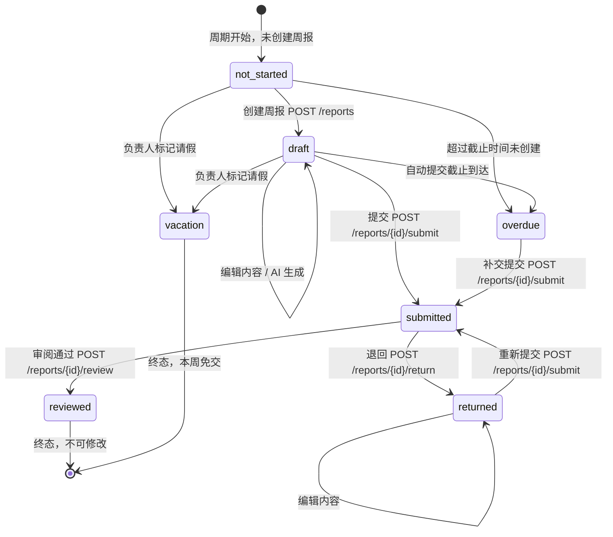

# 周报管理 Agent (Report Agent) -- Diataxis 框架文档

> **版本**：v3.0 | **最后更新**：2026-03-17 | **appKey**：`report-agent` | **基础路由**：`/api/report-agent`
>
> 本文档遵循 Diataxis 框架，分为教程、操作指南、参考、解释四大象限。
> 前端包含 3 个主标签页：周报、团队、设置。

---

## 目录

- [第一部分：教程（Tutorial）](#第一部分教程tutorial)
- [第二部分：操作指南（How-to Guides）](#第二部分操作指南how-to-guides)
- [第三部分：参考（Reference）](#第三部分参考reference)
- [第四部分：解释（Explanation）](#第四部分解释explanation)

---

# 第一部分：教程（Tutorial）

> 面向初次使用者，按步骤引导完成完整的周报工作流。

## 从零开始：创建团队并生成第一份周报

### 前提条件

- 拥有系统账号并具备 `report-agent.use` 权限
- 如需管理团队，需额外持有 `report-agent.team.manage` 权限
- 如需管理模板，需额外持有 `report-agent.template.manage` 权限

### Step 1：创建团队

进入周报管理的「团队」标签页，点击「创建团队」。填写以下信息：

| 字段 | 示例 | 说明 |
|------|------|------|
| 团队名称 | 前端研发组 | 简短易识别 |
| 团队描述 | 负责管理后台与桌面客户端开发 | 可选 |
| 周报可见性 | `all_members` | 成员可互相查看周报 |

创建成功后，系统自动将你设为团队负责人（Leader 角色），并作为第一个成员加入团队。

对应 API：`POST /api/report-agent/teams`

### Step 2：添加成员

在团队详情页中点击「添加成员」。每个成员需指定：

- **用户**：从系统用户列表中搜索选择
- **角色**：`leader`（负责人）、`deputy`（副负责人）或 `member`（普通成员）
- **岗位名称**：如「前端工程师」「产品经理」，用于模板匹配

负责人和副负责人拥有审阅周报、查看团队面板、生成团队汇总等管理权限。

对应 API：`POST /api/report-agent/teams/{id}/members`

### Step 3：选择模板

系统预置了三个模板，通过「初始化系统模板」功能一键生成：

| 模板 Key | 名称 | 适用角色 | 板块数 |
|----------|------|----------|--------|
| `dev-general` | 研发通用 | 开发工程师 | 6 个板块 |
| `product-general` | 产品通用 | 产品经理 | 5 个板块 |
| `minimal` | 极简模式 | 所有岗位 | 2 个板块 |

以「研发通用」模板为例，包含以下板块：代码产出（auto-stats）、任务产出（auto-stats）、本周完成（auto-list）、日常工作（auto-list）、下周计划（manual-list）、备注（free-text）。

也可以在「设置」标签页中创建自定义模板。

对应 API：`POST /api/report-agent/templates/seed`

### Step 4：配置数据源（Git 仓库）

数据源是 AI 自动生成周报的核心输入。进入团队设置中的「数据源」区域：

1. 点击「添加数据源」
2. 填写仓库地址（如 `https://github.com/org/repo.git`）
3. 填写访问令牌（系统通过 AES-256 加密存储，使用 `ApiKeyCrypto`）
4. 设置分支过滤（如 `main,develop,release/*`），逗号分隔
5. 设置轮询间隔（默认 60 分钟）
6. 点击「测试连接」验证配置是否正确
7. 保存后点击「立即同步」触发首次数据拉取
8. 在用户映射表中，将 Git 提交者邮箱/姓名映射到系统用户 ID

对应 API：`POST /api/report-agent/data-sources`、`POST /api/report-agent/data-sources/{id}/test`

### Step 5：记录日志

在「周报」标签页中使用每日打点功能，随时记录工作内容：

- **工作内容**：简要描述，如「完成登录模块的代码审查」
- **分类**：从 6 种分类中选择（development、meeting、communication、documentation、testing、other）
- **标签**（可选）：自定义标签，如「需求评审」「代码复查」
- **耗时**（可选）：以分钟为单位

每天只能有一条日志记录（按 `UserId + Date` 唯一索引），当天多次操作会合并条目到同一条记录中。

对应 API：`POST /api/report-agent/daily-logs`

### Step 6：生成周报（AI 自动填充）

在周报列表中点击「创建周报」：

1. 选择所属团队和模板
2. 系统自动计算当前 ISO 周数，也支持手动指定 `weekYear` 和 `weekNumber`（用于补填往期周报）
3. 点击创建后，模板章节被深拷贝快照到周报中
4. 点击「AI 生成」按钮，系统执行以下流程：
   - 采集该周期内的 Git 提交记录（团队数据源）
   - 收集个人数据源的活动数据（GitHub/GitLab/语雀）
   - 汇总本周的每日打点日志
   - 调用 LLM Gateway（`report-agent.generate::chat`）将原始数据整理为结构化周报内容
   - 解析 JSON 响应并填充各板块
5. AI 生成的结果以草稿形式保存，所有内容均可自由编辑修改

对应 API：`POST /api/report-agent/reports`、`POST /api/report-agent/reports/{id}/generate`

### Step 7：提交审阅

确认内容无误后，点击「提交」按钮：

- 周报状态从 `draft` 变为 `submitted`
- 系统自动通知团队负责人有新的待审阅周报
- 如果全员已提交，系统额外发送「全员已提交」通知
- 负责人审阅通过后状态变为 `reviewed`（终态）
- 如果内容需修改，负责人可退回（`returned`），附带退回原因，成员修改后可重新提交

对应 API：`POST /api/report-agent/reports/{id}/submit`

至此，你已完成从团队创建到周报提交的完整流程。

---

# 第二部分：操作指南（How-to Guides）

> 面向已有基础的使用者，针对具体任务提供操作步骤。

## 1. 如何配置多平台身份映射

身份映射将外部平台的用户标识关联到系统用户，使数据采集时能正确归属每个人的贡献。

**团队成员级别**（负责人操作）：

为每个成员配置各平台的身份标识：

```
PUT /api/report-agent/teams/{teamId}/members/{userId}/identity-mappings

{
  "identityMappings": {
    "github": "zhangsan-gh",
    "gitlab": "zhangsan@company.com",
    "tapd": "张三",
    "yuque": "zhangsan"
  }
}
```

`identityMappings` 是一个字典，key 为平台名称（github / gitlab / tapd / yuque），value 为该平台上的用户标识。系统采集数据时根据这些映射将外部活动归属到对应的系统用户。

**团队数据源级别**：

在数据源配置中通过 `UserMapping` 字段映射 Git 提交者身份：

```json
{
  "userMapping": {
    "zhangsan@example.com": "user-id-001",
    "Zhang San": "user-id-001"
  }
}
```

key 为 Git 提交者的邮箱或姓名，value 为系统用户 ID。

**个人数据源级别**（成员自行操作）：

通过「我的数据源」绑定个人平台账号，无需额外映射（数据直接归属当前用户）。

## 2. 如何自定义周报模板

模板定义了周报的板块结构。每个模板包含多个「板块」（Section），每个板块有四种类型可选。

**创建自定义模板**：

```
POST /api/report-agent/templates

{
  "name": "全栈工程师周报",
  "description": "适用于全栈开发工程师",
  "teamId": "team-id-001（可选，绑定特定团队）",
  "jobTitle": "全栈工程师（可选，绑定特定岗位）",
  "sections": [
    {
      "title": "代码产出",
      "description": "本周代码提交和 PR 统计",
      "inputType": "key-value",
      "sectionType": "auto-stats",
      "dataSources": ["github", "gitlab"],
      "isRequired": false,
      "sortOrder": 0
    },
    {
      "title": "本周完成",
      "description": "AI 基于采集数据归纳的主要工作项",
      "inputType": "bullet-list",
      "sectionType": "auto-list",
      "dataSources": ["github", "tapd", "daily-log"],
      "isRequired": true,
      "sortOrder": 1,
      "maxItems": 10
    },
    {
      "title": "下周计划",
      "description": "下周主要工作安排",
      "inputType": "bullet-list",
      "sectionType": "manual-list",
      "isRequired": true,
      "sortOrder": 2,
      "maxItems": 8
    },
    {
      "title": "备注",
      "description": "其他需要说明的事项",
      "inputType": "rich-text",
      "sectionType": "free-text",
      "isRequired": false,
      "sortOrder": 3
    }
  ]
}
```

**板块类型选择指南**：

| 场景 | 推荐 sectionType | 说明 |
|------|-------------------|------|
| 展示提交数、PR 数等统计 | `auto-stats` | 只读数字卡片，数据来自指定数据源 |
| AI 归纳本周工作内容 | `auto-list` | AI 生成后可编辑 |
| 需要成员手动填写 | `manual-list` | 如「下周计划」「风险事项」 |
| 自由文本补充 | `free-text` | 如「备注」「总结反思」 |

## 3. 如何设置自动提交计划

团队可配置自动提交截止时间，超时未提交的周报会被标记为逾期（`overdue`）。

**配置方式**：

更新团队信息时设置 `autoSubmitSchedule` 字段：

```
PUT /api/report-agent/teams/{id}

{
  "name": "前端研发组",
  "autoSubmitSchedule": "friday-18:00"
}
```

格式为 `{dayOfWeek}-{HH:mm}`，时区为 UTC+8。

| 配置值 | 含义 |
|--------|------|
| `friday-18:00` | 每周五 18:00 截止 |
| `saturday-12:00` | 每周六 12:00 截止 |
| `null` | 不启用自动提交 |

后台 Worker（`ReportAutoGenerateWorker`）在指定时间检查状态：对仍处于 `draft` 的周报执行自动提交，对 `not-started` 的成员创建逾期记录。

## 4. 如何处理退回的周报

负责人退回周报时附带退回原因，成员修改后重新提交。

**退回操作**（负责人/副负责人执行）：

```
POST /api/report-agent/reports/{id}/return

{
  "reason": "请补充本周参与的需求评审细节和跨团队协作内容"
}
```

前提条件：周报必须处于 `submitted` 状态。

**被退回后的处理流程**：

1. 成员收到退回通知，查看 `returnReason` 中的退回原因
2. 修改周报内容：`PUT /api/report-agent/reports/{id}`（`returned` 状态下允许编辑）
3. 重新提交：`POST /api/report-agent/reports/{id}/submit`
4. 提交时系统自动清除退回记录（`returnReason`、`returnedBy`、`returnedByName`、`returnedAt` 全部置空）

`returned` 状态可直接提交，无需先回到 `draft`。

## 5. 如何生成团队总结报告

团队负责人基于全员已提交的周报，由 AI 生成团队维度的汇总报告。

**操作步骤**：

1. 确保本周大部分成员已提交周报（`submitted` 或 `reviewed` 状态）
2. 调用团队汇总生成接口：

```
POST /api/report-agent/teams/{id}/summary/generate

{
  "weekYear": 2026,
  "weekNumber": 12
}
```

3. `TeamSummaryService` 读取所有已提交的周报，发送至 LLM 聚合生成汇总，包含以下段落：
   - 本周亮点
   - 关键指标
   - 风险与阻塞
   - 下周重点

4. 查看已生成的汇总：

```
GET /api/report-agent/teams/{id}/summary?weekYear=2026&weekNumber=12
```

汇总报告记录参与汇总的周报 ID 列表（`sourceReportIds`）、团队总人数（`memberCount`）和已提交人数（`submittedCount`）。

## 6. 如何导出周报为 Markdown

**导出个人周报**：

```
GET /api/report-agent/reports/{id}/export/markdown
```

返回文件名格式：`周报_{用户名}_{年}W{周数}.md`（如 `周报_张三_2026W12.md`）。

内容包含完整的板块结构，每个条目标注数据来源（如 `[github]`、`[daily-log]`）。

**导出团队汇总**：

```
GET /api/report-agent/teams/{teamId}/summary/export/markdown?weekYear=2026&weekNumber=12
```

返回文件名格式：`团队汇总_{团队名}_{年}W{周数}.md`。

两个接口均返回 `Content-Type: text/markdown; charset=utf-8`，浏览器直接触发文件下载。

权限要求：个人周报需为本人或团队负责人；团队汇总需为团队负责人/副负责人或持有 `view.all` 权限。

---

# 第三部分：参考（Reference）

> 面向开发者和集成者，提供完整的技术细节。

## 完整 API 端点列表

基础路径：`/api/report-agent`，所有端点需认证（`[Authorize]`），最低权限 `report-agent.use`。

### 团队管理

| 方法 | 路径 | 说明 | 权限 |
|------|------|------|------|
| GET | `/teams` | 列出用户相关团队 | `use`（`view.all` 可见全部） |
| GET | `/teams/{id}` | 获取团队详情（含成员列表） | `use` |
| POST | `/teams` | 创建团队 | `team.manage` |
| PUT | `/teams/{id}` | 更新团队信息 | Leader/Deputy |
| DELETE | `/teams/{id}` | 删除团队 | Leader |
| POST | `/teams/{id}/members` | 添加成员 | Leader/Deputy |
| DELETE | `/teams/{id}/members/{userId}` | 移除成员 | Leader/Deputy |
| PUT | `/teams/{id}/members/{userId}` | 更新成员角色/岗位 | Leader/Deputy |
| PUT | `/teams/{id}/members/{userId}/identity-mappings` | 设置身份映射 | Leader/Deputy |
| GET | `/teams/{id}/dashboard` | 团队面板：成员状态概览 | Leader/Deputy |
| GET | `/teams/{id}/workflow` | 获取数据采集工作流 | Leader/Deputy |
| POST | `/teams/{id}/workflow/run` | 触发数据采集工作流 | Leader/Deputy |
| POST | `/teams/{teamId}/members/{userId}/vacation` | 标记成员请假 | Leader/Deputy |
| DELETE | `/teams/{teamId}/members/{userId}/vacation` | 取消请假标记 | Leader/Deputy |

### 模板管理

| 方法 | 路径 | 说明 | 权限 |
|------|------|------|------|
| GET | `/templates` | 列出所有模板 | `use` |
| GET | `/templates/{id}` | 获取模板详情 | `use` |
| POST | `/templates` | 创建自定义模板 | `template.manage` |
| PUT | `/templates/{id}` | 更新模板 | `template.manage` |
| DELETE | `/templates/{id}` | 删除模板（系统模板受保护） | `template.manage` |
| POST | `/templates/seed` | 初始化系统预置模板 | `template.manage` |

### 周报管理

| 方法 | 路径 | 说明 | 权限 |
|------|------|------|------|
| GET | `/reports` | 列出周报（支持 teamId/userId/weekYear/weekNumber/status 过滤） | `use` |
| GET | `/reports/{id}` | 获取周报详情 | `use`（可见性规则） |
| POST | `/reports` | 创建周报（模板快照） | `use` + 团队成员 |
| PUT | `/reports/{id}` | 更新周报内容 | 本人 + draft/returned/overdue |
| DELETE | `/reports/{id}` | 删除周报 | 本人 + draft |
| POST | `/reports/{id}/submit` | 提交周报 | 本人 |
| POST | `/reports/{id}/review` | 审阅通过 | Leader/Deputy |
| POST | `/reports/{id}/return` | 退回周报（附原因） | Leader/Deputy |
| POST | `/reports/{id}/generate` | AI 生成周报内容 | 本人 |
| GET | `/reports/{id}/plan-comparison` | 计划对比（上周计划 vs 本周完成） | `use` |
| GET | `/reports/{id}/export/markdown` | 导出为 Markdown | 本人/Leader |

### 评论

| 方法 | 路径 | 说明 | 权限 |
|------|------|------|------|
| GET | `/reports/{id}/comments` | 获取评论列表 | `use` |
| POST | `/reports/{id}/comments` | 添加评论（支持段落级、支持回复） | `use` |
| DELETE | `/reports/{reportId}/comments/{commentId}` | 删除评论 | 评论作者 |

### 每日打点

| 方法 | 路径 | 说明 | 权限 |
|------|------|------|------|
| POST | `/daily-logs` | 记录/更新每日打点（按 userId+date 去重） | `use` |
| GET | `/daily-logs` | 列出指定日期范围的打点 | `use` |
| GET | `/daily-logs/{date}` | 获取指定日期打点 | `use` |
| DELETE | `/daily-logs/{date}` | 删除指定日期打点 | `use` |

### 个人数据源

| 方法 | 路径 | 说明 | 权限 |
|------|------|------|------|
| GET | `/my/sources` | 列出个人数据源 | `use` |
| POST | `/my/sources` | 添加个人数据源 | `use` |
| PUT | `/my/sources/{id}` | 更新个人数据源 | `use` |
| DELETE | `/my/sources/{id}` | 删除个人数据源 | `use` |
| POST | `/my/sources/{id}/test` | 测试连接 | `use` |
| POST | `/my/sources/{id}/sync` | 手动同步 | `use` |
| GET | `/my/stats` | 获取个人本周统计数据 | `use` |

### 团队数据源

| 方法 | 路径 | 说明 | 权限 |
|------|------|------|------|
| GET | `/data-sources` | 列出团队数据源 | `datasource.manage` |
| POST | `/data-sources` | 添加团队数据源 | `datasource.manage` |
| PUT | `/data-sources/{id}` | 更新团队数据源 | `datasource.manage` |
| DELETE | `/data-sources/{id}` | 删除团队数据源 | `datasource.manage` |
| POST | `/data-sources/{id}/test` | 测试连接 | `datasource.manage` |
| POST | `/data-sources/{id}/sync` | 手动同步 | `datasource.manage` |
| GET | `/data-sources/{id}/commits` | 查看同步的提交记录 | `datasource.manage` |

### 趋势与汇总

| 方法 | 路径 | 说明 | 权限 |
|------|------|------|------|
| GET | `/trends/personal` | 个人周报趋势（12 周） | `use` |
| GET | `/trends/team/{teamId}` | 团队周报趋势（12 周） | Leader/Deputy |
| POST | `/teams/{id}/summary/generate` | 生成团队汇总 | Leader/Deputy |
| GET | `/teams/{id}/summary` | 查看团队汇总 | Leader/Deputy |
| GET | `/teams/{teamId}/summary/export/markdown` | 导出团队汇总 | Leader/Deputy |

### 其他

| 方法 | 路径 | 说明 | 权限 |
|------|------|------|------|
| GET | `/users` | 列出系统用户（用于成员选择器） | `use` |
| GET | `/activity` | 获取平台活动数据 | `use` |

## 数据模型关系图

```
+---------------------+       1:N       +------------------------+
|    ReportTeam       |<--------------->|   ReportTeamMember     |
|---------------------|                 |------------------------|
| Id                  |                 | Id                     |
| Name                |                 | TeamId           (FK)  |
| LeaderUserId        |                 | UserId                 |
| ParentTeamId        |                 | Role (leader/deputy/   |
| ReportVisibility    |                 |       member)          |
| AutoSubmitSchedule  |                 | JobTitle               |
| CustomDailyLogTags  |                 | IdentityMappings {}    |
+---------------------+                 +------------------------+
    |         |         |                         |
    | 1:N     | 1:N     | 1:N                    | 1:N (UserId)
    v         |         v                         v
+-----------------+  |  +------------------+   +-----------------+
| ReportDataSource|  |  | WeeklyReport     |   | PersonalSource  |
|-----------------|  |  |------------------|   |-----------------|
| Id              |  |  | Id               |   | Id              |
| TeamId    (FK)  |  |  | UserId           |   | UserId    (FK)  |
| SourceType      |  |  | TeamId     (FK)  |   | SourceType      |
| Name            |  |  | TemplateId (FK)  |   | DisplayName     |
| RepoUrl         |  |  | WeekYear         |   | Config {}       |
| EncryptedToken  |  |  | WeekNumber       |   | EncryptedToken  |
| BranchFilter    |  |  | Status           |   | LastSyncStatus  |
| UserMapping {}  |  |  | Sections []      |   +-----------------+
| PollInterval    |  |  | StatsSnapshot {} |
+-----------------+  |  | SubmittedAt      |
    |                |  | ReviewedAt       |
    | 1:N            |  | ReturnReason     |
    v                |  +------------------+
+-----------------+  |       |         |
| ReportCommit   |  |       | 1:N     | N:1 (TeamId+周)
|-----------------|  |       v         v
| Id              |  |  +-----------------+  +-----------------+
| DataSourceId(FK)|  |  | ReportComment   |  | TeamSummary     |
| CommitHash      |  |  |-----------------|  |-----------------|
| AuthorName      |  |  | Id              |  | Id              |
| AuthorEmail     |  |  | ReportId  (FK)  |  | TeamId    (FK)  |
| Message         |  |  | SectionIndex    |  | WeekYear        |
| BranchName      |  |  | ParentCommentId |  | WeekNumber      |
| Timestamp       |  |  | AuthorUserId    |  | Sections []     |
+-----------------+  |  | Content         |  | SourceReportIds |
                     |  +-----------------+  | MemberCount     |
                     v                       | SubmittedCount  |
              +-----------------+            +-----------------+
              | ReportTemplate  |
              |-----------------|
              | Id              |   +-----------------+
              | Name            |   | ReportDailyLog  |
              | Sections []     |   |-----------------|
              | TeamId    (FK)  |   | Id              |
              | JobTitle        |   | UserId          |
              | IsDefault       |   | Date (unique:   |
              | IsSystem        |   |   UserId+Date)  |
              | TemplateKey     |   | Items []        |
              +-----------------+   |  - Content      |
                  |                 |  - Category     |
                  | snapshot        |  - Tags []      |
                  v                 |  - Duration     |
              (深拷贝到             +-----------------+
               WeeklyReport.
               Sections[].
               TemplateSection)
```

## 状态机图



**完整状态列表**（`WeeklyReportStatus`）：

| 状态 | Key | 说明 | 可编辑 |
|------|-----|------|--------|
| 未开始 | `not-started` | 虚拟状态，周报未创建 | -- |
| 草稿 | `draft` | 创建后默认状态 | 可编辑 |
| 已提交 | `submitted` | 等待负责人审阅 | 不可编辑 |
| 已审阅 | `reviewed` | 负责人已确认，终态 | 不可编辑 |
| 已退回 | `returned` | 被退回修改 | 可编辑 |
| 逾期 | `overdue` | 超过截止时间未提交 | 可编辑 |
| 请假 | `vacation` | 本周免交，终态 | -- |
| 已查看 | `viewed` | v2.0 简化流程中负责人已查看 | 不可编辑 |

**合法状态转换**：

| 当前状态 | 目标状态 | 触发操作 | 操作者 |
|----------|----------|----------|--------|
| `not-started` | `draft` | 创建周报 | 成员 |
| `draft` | `submitted` | 提交 | 成员（本人） |
| `draft` | `overdue` | 超时 | 系统自动 |
| `submitted` | `reviewed` | 审阅通过 | Leader/Deputy |
| `submitted` | `returned` | 退回 | Leader/Deputy |
| `returned` | `submitted` | 重新提交 | 成员（本人） |
| `overdue` | `submitted` | 补交 | 成员（本人） |
| `not-started`/`draft` | `vacation` | 标记请假 | Leader/Deputy |

## 权限列表

| 权限标识 | 显示名 | 说明 |
|----------|--------|------|
| `report-agent.use` | 周报 Agent | 基础使用权限，访问所有端点的最低要求 |
| `report-agent.view.all` | 周报-查看全部 | 查看所有团队和所有周报，不受团队归属限制 |
| `report-agent.team.manage` | 周报-团队管理 | 创建团队、管理成员 |
| `report-agent.template.manage` | 周报-模板管理 | 创建和编辑周报模板 |
| `report-agent.datasource.manage` | 周报-数据源管理 | 配置团队级 Git/SVN 仓库连接 |

说明：持有 `super` 权限可绕过所有检查。团队内的 Leader/Deputy 角色对本团队拥有管理操作权限（审阅、退回、查看面板等），无需额外全局权限。

## 模板板块类型参考表

| SectionType | 名称 | 行为描述 | 关联数据源 | 用户可编辑 |
|-------------|------|----------|------------|------------|
| `auto-stats` | 自动统计 | 数字卡片展示（如提交数、PR 数） | github/gitlab/tapd/yuque | 只读 |
| `auto-list` | 自动列表 | AI 基于采集数据生成的条目列表 | github/tapd/daily-log 等 | 生成后可编辑 |
| `manual-list` | 手动列表 | 用户手动填写条目 | 无 | 必须手动输入 |
| `free-text` | 自由文本 | 富文本段落输入 | 无 | 必须手动输入 |

**输入类型**（`InputType`，控制条目渲染格式）：

| InputType | 说明 | 典型用途 |
|-----------|------|----------|
| `bullet-list` | 项目符号列表 | 工作条目、计划列表 |
| `rich-text` | 富文本编辑器 | 备注、总结 |
| `key-value` | 键值对 | 统计数字展示 |
| `progress-table` | 进度表格 | 任务进度追踪 |

## 日志分类参考

| Category 值 | 中文名 | 典型场景 |
|-------------|--------|----------|
| `development` | 开发 | 编码、调试、代码审查、Bug 修复 |
| `meeting` | 会议 | 站会、需求评审、技术方案评审、规划会 |
| `communication` | 沟通 | 跨团队协调、客户沟通、产品对接 |
| `documentation` | 文档 | 编写技术文档、更新产品文档、API 文档 |
| `testing` | 测试 | 单元测试、集成测试、手动测试、性能测试 |
| `other` | 其他 | 培训学习、环境搭建等不属于以上分类的工作 |

## 后端服务文件路径列表

| 文件 | 职责 |
|------|------|
| `Controllers/Api/ReportAgentController.cs` | 所有 API 端点入口，appKey 硬编码为 `report-agent` |
| `Services/ReportAgent/ReportGenerationService.cs` | AI 周报生成引擎：数据采集 -> Prompt 构建 -> LLM 调用 -> 解析保存 |
| `Services/ReportAgent/TeamSummaryService.cs` | 团队汇总 AI 生成服务 |
| `Services/ReportAgent/MapActivityCollector.cs` | 平台活动数据采集与聚合 |
| `Services/ReportAgent/GitHubConnector.cs` | GitHub API 连接器 |
| `Services/ReportAgent/SvnConnector.cs` | SVN 仓库连接器 |
| `Services/ReportAgent/ICodeSourceConnector.cs` | 代码源连接器接口定义 |
| `Services/ReportAgent/GitSyncWorker.cs` | Git 仓库后台定时同步 Worker |
| `Services/ReportAgent/ReportAutoGenerateWorker.cs` | 自动生成/自动提交后台 Worker |
| `Services/ReportAgent/PersonalSourceService.cs` | 个人数据源 CRUD、连接测试、同步、统计聚合 |
| `Services/ReportAgent/PersonalSourceConnectors.cs` | 个人数据源各平台连接器实现 |
| `Services/ReportAgent/ReportNotificationService.cs` | 通知服务（提交/审阅/退回/全员提交） |
| `Services/ReportAgent/ArtifactStatsParser.cs` | 工作流 Artifact 统计数据解析器 |
| `Services/ReportAgent/WorkflowExecutionService.cs` | 数据采集工作流执行服务 |

模型文件（`PrdAgent.Core/Models/`）：

| 文件 | 包含类 |
|------|--------|
| `ReportTeam.cs` | `ReportTeam`、`ReportTeamMember`、`ReportTeamRole`、`ReportVisibilityMode` |
| `ReportTemplate.cs` | `ReportTemplate`、`ReportTemplateSection`、`ReportInputType`、`ReportSectionType`、`SystemTemplates` |
| `WeeklyReport.cs` | `WeeklyReport`、`WeeklyReportSection`、`WeeklyReportItem`、`WeeklyReportStatus` |
| `ReportDailyLog.cs` | `ReportDailyLog`、`DailyLogItem`、`DailyLogCategory` |
| `ReportDataSource.cs` | `ReportDataSource`、`DataSourceType` |
| `ReportCommit.cs` | `ReportCommit` |
| `ReportComment.cs` | `ReportComment` |
| `ReportCollectedStats.cs` | `TeamCollectedStats`、`SourceStats`、`StatsDetail`、`MemberCollectedStats` |
| `PersonalSource.cs` | `PersonalSource`、`PersonalSourceConfig`、`PersonalSourceType`、`PersonalSourceSyncStatus` |
| `TeamSummary.cs` | `TeamSummary`、`TeamSummarySection` |

## MongoDB 集合

| 集合名 | 对应模型 | 说明 |
|--------|----------|------|
| `report_teams` | `ReportTeam` | 团队定义 |
| `report_team_members` | `ReportTeamMember` | 团队成员 |
| `report_templates` | `ReportTemplate` | 周报模板 |
| `report_weekly_reports` | `WeeklyReport` | 周报（唯一索引：userId+teamId+weekYear+weekNumber） |
| `report_daily_logs` | `ReportDailyLog` | 每日打点（唯一索引：userId+date） |
| `report_data_sources` | `ReportDataSource` | 团队数据源配置 |
| `report_commits` | `ReportCommit` | 同步的提交记录 |
| `report_comments` | `ReportComment` | 段落级评论 |
| `report_team_summaries` | `TeamSummary` | 团队汇总报告 |

---

# 第四部分：解释（Explanation）

> 面向需要理解设计动机的读者。解释「为什么这样设计」而非「如何操作」。

## 1. 两级数据源架构：为什么同时需要团队数据源和个人数据源？

周报 Agent 的数据采集分为两个层级：团队数据源（`ReportDataSource`，由管理员配置）和个人数据源（`PersonalSource`，由成员自行绑定）。这个看似冗余的双层设计解决了一个现实中的组织难题。

**团队数据源覆盖核心共享仓库**。管理员配置一次团队的主代码仓库和 TAPD 项目空间，通过 `UserMapping` 字典将 Git 提交者映射到系统用户，全员自动受益。优势是管理集中、配置一致，但它无法覆盖成员在其他平台上的个人贡献。

**个人数据源补充团队未覆盖的平台**。一个前端工程师可能同时在公司 GitLab 上提交代码（团队数据源覆盖），又在个人 GitHub 上维护开源项目（需要个人数据源补充）。产品经理可能在语雀上有个人文档空间，这些贡献如果不采集就会在周报中「消失」。

如果只保留团队数据源，管理员需要为每个成员的每个私人平台都配置连接，既增加管理负担，又涉及隐私问题（成员需要将个人平台令牌交给管理员）。如果只保留个人数据源，公共仓库需要每个成员各自配置一遍，既浪费又容易出错。

核心原则：**团队数据源提供基线覆盖，个人数据源提供补充覆盖**。`ReportGenerationService` 在 AI 生成时同时采集两级数据源并合并去重，确保不遗漏也不重复。个人数据源的令牌由成员自己管理（同样 AES-256 加密），仅归属当前用户，无需额外身份映射。

## 2. 模板快照设计：为什么创建周报时深拷贝模板而非运行时引用？

创建周报时，模板章节通过深拷贝写入 `WeeklyReport.Sections[].TemplateSection`，而非存储 `TemplateId` 后运行时关联查询。

这个设计解决的核心问题是**时间维度的数据一致性**。模板是一个「活」的配置，管理员可能随时调整章节标题、增删板块、修改必填要求。如果周报只存储模板引用，已经创建并填写了内容的周报会在模板修改后出现结构错乱：旧周报的内容对应的章节标题可能已改变，甚至章节本身已被删除。

快照设计保证每份周报是**自包含**的。即使原始模板被删除，历史周报仍然完整可读。这在审计场景中尤为重要：你需要知道当时的周报要求是什么，而不是现在的模板要求是什么。

同时，模板可以自由演进而不需要版本管理或迁移逻辑。第 12 周使用 6 板块模板创建的周报，不会因为第 13 周管理员将模板改为 4 板块而受影响。计划对比功能（`plan-comparison`）依赖连续两周的章节结构匹配，快照设计保证了这种匹配的可靠性。

代价是存储冗余：每份周报完整包含模板章节定义。但模板章节数据量很小（通常不超过 10 个章节，每个章节只有 title/description/inputType 等少量字段），这个冗余完全可以接受。

## 3. Reviewed 终态设计：为什么审阅后不能再修改？

周报一旦进入 `reviewed` 状态，就不再允许任何内容修改。这是一个有意为之的设计约束。

**审计追踪的需要**。负责人审阅意味着对内容的确认和认可。如果审阅后仍允许修改，审阅行为本身失去意义：负责人确认的内容可能与最终留存的内容不同。在涉及绩效考核或项目复盘时，这种不一致会造成争议。

**下游数据一致性**。团队汇总（`TeamSummary`）基于已提交/已审阅的周报生成。如果审阅后的周报仍可修改，已生成的汇总内容就会与源数据不一致。`sourceReportIds` 记录了参与汇总的周报 ID，保证了审计链条的完整性。

**行为引导**。终态设计迫使参与者在提交前仔细检查内容。如果随时可改，用户倾向于先提交草稿再慢慢修改，给负责人带来额外的审阅负担。退回机制（`returned`）是正式的反馈通道：负责人通过退回附带具体修改建议，成员修改后重新提交，形成闭环。

如果确实需要在审阅后补充说明（如发现事实性错误），正确做法是通过评论（`ReportComment`）进行补充，评论按段落索引（`sectionIndex`）关联到具体板块，并支持回复线程，保留完整的讨论记录。

## 4. ISO 周数选择：为什么用 ISO 8601 周数而非自然月？

系统使用 `System.Globalization.ISOWeek` 计算周数，遵循 ISO 8601 标准。

**跨年处理的正确性**。自然年的 12 月 31 日可能属于下一年的第 1 周，1 月 1 日可能属于上一年的最后一周。ISO 8601 通过 `weekYear` 概念解决这个问题：`weekYear` 可能与日历年不同，但保证每周有唯一标识。周报的唯一键是 `(userId, teamId, weekYear, weekNumber)` 而非日期范围，正是基于这个考虑。例如 2025 年 12 月 29 日（周一）属于 2026 年第 1 周，其 `weekYear` 为 2026 而非 2025。

**周一起始对齐**。ISO 8601 规定每周从周一开始，符合中国的工作习惯。`ISOWeek.ToDateTime(weekYear, weekNumber, DayOfWeek.Monday)` 精确计算每周开始时间，用于确定 `PeriodStart`（周一）和 `PeriodEnd`（周日）。

**国际化兼容**。如果系统未来需要支持多语言或多时区团队，ISO 周数是跨文化的通用标准。不同国家的团队可以用相同的 `(weekYear, weekNumber)` 引用同一个报告周期，避免因地区差异导致的周数不一致。

**为什么不用自然月？** 月度报告的粒度对周报场景太粗。一个月跨 4-5 个工作周，无法反映每周的工作节奏和迭代进度。月份边界切分不均匀（28-31 天），不利于做趋势对比。周是最小的完整工作单元，ISO 周数提供了标准化编号，使得 12 周趋势图（`/trends/personal`、`/trends/team/{teamId}`）中每个数据点具有严格可比性。

## 5. 确认式提交哲学：为什么 submitted 和 reviewed 是分开的？

状态机中 `submitted` 和 `reviewed` 是两个独立状态，中间还支持 `returned` 退回。这个三步流程比自动提交多了两次显式确认。

**为什么不自动提交？** AI 生成的内容不一定准确。它可能错误地归纳了某个功能的名称，遗漏了重要的非代码工作，或者将两个不相关的提交合并成了一个描述。成员需要机会审查和修正 AI 的输出，然后主动确认「这是我本周的工作总结」。`submitted` 状态代表的是成员对内容的认可，而非系统的自动操作。

**为什么提交后不直接算审阅完成？** 负责人的审阅不仅是形式上的签收，更是管理上的信息同步。通过阅读每个成员的周报，负责人了解团队的实际进展、潜在风险和资源瓶颈。`reviewed` 标记的是「负责人已阅读并确认」，这个动作有实际的管理意义。将 `submitted` 等同于 `reviewed` 会让审阅变成自动化流程，失去管理价值。

**退回机制的价值**。`returned` 状态提供了反馈通道。如果周报内容过于笼统或遗漏关键信息，负责人可以退回并附上具体修改建议（`returnReason`）。成员修改后重新提交，形成闭环的质量保证流程。提交时系统自动清除退回记录，确保状态干净。

**自动提交作为兜底**。`autoSubmitSchedule` 配置的自动提交是兜底手段而非主流程。它确保即使成员忘记主动提交，周报也不会永远停留在草稿状态。但核心哲学始终是：**周报不是被动的数据采集，而是主动的工作复盘**。AI 降低的是撰写成本，而非确认责任。

## 核心设计模式总结

| 模式 | 实现方式 | 设计动机 |
|------|----------|----------|
| 基于周的数据隔离 | `WeekYear + WeekNumber` 唯一键 | 保证每周一份报告，正确处理跨年、支持补填 |
| 服务器权威性 | LLM 调用使用 `CancellationToken.None` | 客户端断开不中断 AI 生成任务 |
| 多平台身份映射 | `IdentityMappings` + `UserMapping` | 将外部平台用户标识统一归属到系统用户 |
| 严格状态机 | 状态转换仅在 Controller 中执行，带前置条件校验 | 防止非法状态流转，保证数据一致性 |
| 模板快照不可变 | 创建时深拷贝到 `WeeklyReportSection.TemplateSection` | 历史周报不受后续模板修改影响 |
| 两级数据源 | 团队 `ReportDataSource` + 个人 `PersonalSource` | 平衡集中管理效率与个人灵活性 |
| 冗余字段 | `UserName`/`TeamName`/`AvatarFileName` 等写入时冗余存储 | 减少跨集合关联查询，提升读取性能 |
| 加密存储 | 令牌通过 `ApiKeyCrypto` AES-256 加密 | 敏感凭据不明文存储 |
