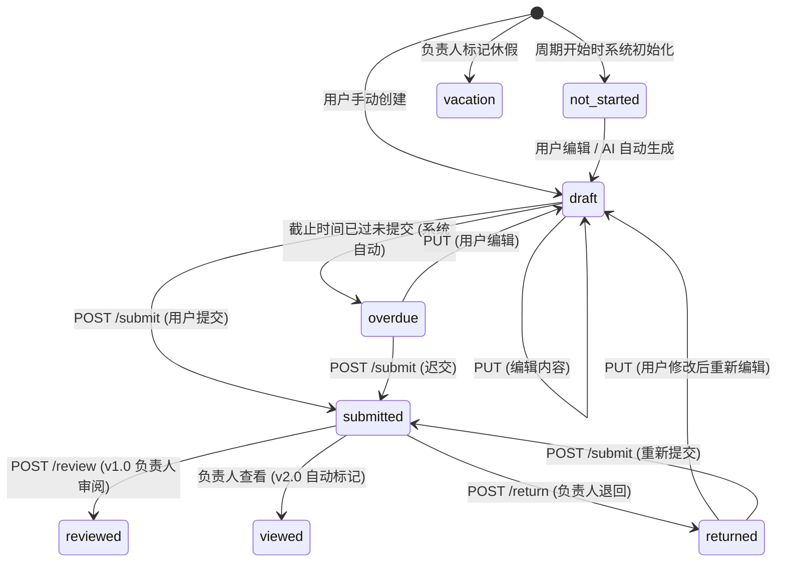

# 周报管理 Agent (Report Agent) 技术规格文档

> **文档版本**: 2.0
> **最后更新**: 2026-03-17
> **应用标识**: `report-agent`
> **路由前缀**: `api/report-agent/`
> **状态**: 已实现 (Phase 1-4)

---

## 目录

1. [概述](#1-概述)
2. [系统架构](#2-系统架构)
3. [数据模型](#3-数据模型)
4. [API 端点](#4-api-端点)
5. [状态机](#5-状态机)
6. [后台服务](#6-后台服务)
7. [AI 生成引擎](#7-ai-生成引擎)
8. [数据源连接器](#8-数据源连接器)
9. [模板系统](#9-模板系统)
10. [团队汇总](#10-团队汇总)
11. [通知机制](#11-通知机制)
12. [安全设计](#12-安全设计)
13. [性能与设计约束](#13-性能与设计约束)

---

## 1. 概述

周报管理 Agent 是 PRD Agent 平台下的独立应用模块,负责团队周报的全生命周期管理。该模块以 `report-agent` 为应用标识,通过独立的 Controller 层硬编码 `appKey`,遵循应用身份隔离原则。

### 1.1 核心能力

- **团队与成员管理**: 层级结构、三种角色(leader/deputy/member)、多平台身份映射
- **周报模板配置**: 3 个系统预置模板 + 自定义模板,v2.0 引入 4 种板块类型
- **每日打点记录**: 日志式工作记录,6 种内置分类,支持自定义标签
- **数据源集成**: 团队级 Git/SVN 仓库同步 + 个人级 GitHub/GitLab/语雀绑定
- **AI 周报生成**: 采集数据 -> 构建 Prompt -> LLM 生成 -> 解析保存草稿
- **审阅工作流**: 提交、审阅/查看、退回、段落级评论
- **团队汇总**: AI 聚合成员周报为 5 段式管理摘要
- **趋势分析**: 个人与团队维度的多周统计趋势

### 1.2 技术栈

| 层级 | 技术选型 |
|------|----------|
| 后端框架 | .NET 8, C# 12 |
| 数据库 | MongoDB (9 个集合) |
| AI 调用 | ILlmGateway (统一网关) |
| 令牌加密 | AES-256 (ApiKeyCrypto) |
| 认证 | JWT Bearer ([Authorize]) |
| 后台任务 | BackgroundService |
| 周期计算 | System.Globalization.ISOWeek |

### 1.3 版本演进

| 版本 | 核心变更 |
|------|----------|
| v1.0 | 基础周报 CRUD、模板系统、Git 同步、AI 生成、审阅流程 |
| v2.0 | 板块类型(auto-stats/auto-list/manual-list/free-text)、工作流集成、统计快照、个人数据源、身份映射、简化状态流(Viewed) |

---

## 2. 系统架构

### 2.1 整体架构图

```
+-------------------------------------------------------------------+
|                        prd-admin (React 18)                       |
|                    前端管理界面 (Vite + Zustand + Radix UI)        |
+-------------------------------|-----------------------------------+
                                | HTTP/REST (JWT Bearer)
                                v
+-------------------------------------------------------------------+
|                    ReportAgentController                           |
|                  [Route("api/report-agent")]                       |
|                  appKey = "report-agent" (硬编码)                  |
|                  [AdminController] 最低权限: ReportAgentUse        |
+-----+------+------+------+------+------+------+------+------+----+
      |      |      |      |      |      |      |      |      |
      v      v      v      v      v      v      v      v      v
+--------+ +--------+ +--------+ +--------+ +----------+ +--------+
| Report | | Report | | Weekly | | Report | | Personal | | Team   |
| Team   | | Templa | | Report | | Daily  | | Source   | | Summary|
| (内联) | | te(内联)| | (内联) | | Log    | | Service  | | Service|
+--------+ +--------+ +---+----+ +(内联) + +----------+ +---+----+
                           |                                  |
                           v                                  v
                   +---------------+                 +---------------+
                   | ReportGenera  |                 | ILlmGateway   |
                   | tionService   |---------------->| (统一网关)     |
                   +-------+-------+                 +---------------+
                           |
             +-------------+-------------+
             |                           |
             v                           v
+------------------------+   +------------------------+
| MapActivityCollector   |   | IWorkflowExecution     |
| (平台活动采集)          |   | Service (工作流集成)   |
+------------------------+   +------------------------+
             |
             v
+-------------------------------------------------------------------+
| ReportAutoGenerateWorker (BackgroundService)                       |
| - 每 15 分钟检查                                                   |
| - 周五 16:00 自动生成草稿                                          |
| - 截止提醒 + 逾期标记                                              |
| - 按团队配置自动提交                                                |
+-------------------------------------------------------------------+
             |
             v
+-------------------------------------------------------------------+
|                      MongoDB (9 个集合)                            |
|  report_teams | report_team_members | report_templates             |
|  weekly_reports | report_daily_logs | report_data_sources          |
|  report_commits | report_comments | report_team_summaries          |
+-------------------------------------------------------------------+
```

### 2.2 服务依赖关系

```
ReportAgentController
  +-- ReportGenerationService          # AI 周报生成
  |     +-- ILlmGateway                # LLM 统一调用
  |     +-- MapActivityCollector       # 平台活动采集
  |     +-- PersonalSourceService      # 个人数据源
  |     +-- IWorkflowExecutionService  # 工作流执行 (v2.0)
  +-- ReportNotificationService        # 通知服务 (7 种事件)
  +-- TeamSummaryService               # 团队汇总 AI 生成
  |     +-- ILlmGateway
  +-- PersonalSourceService            # 个人数据源 CRUD
  +-- MongoDbContext                   # 数据库访问
  +-- MapActivityCollector             # 活动数据采集

ReportAutoGenerateWorker (BackgroundService)
  +-- ReportGenerationService
  +-- ReportNotificationService
  +-- MongoDbContext
```

### 2.3 核心设计原则

| 原则 | 实现方式 |
|------|----------|
| 应用身份隔离 | Controller 硬编码 `appKey = "report-agent"` |
| 服务器权威性 | 所有 LLM/DB 操作使用 `CancellationToken.None` |
| LLM 网关统一 | 所有 AI 调用通过 `ILlmGateway`,禁止直接调用底层客户端 |
| 前端无业务状态 | 前端仅发送指令和展示结果,不维护业务中间态 |
| 数据冗余展示 | 用户名、团队名等高频读取字段在写入时冗余存储 |

---

## 3. 数据模型

### 3.1 MongoDB 集合总览

| 集合名 | 模型类 | 唯一索引 | 说明 |
|--------|--------|----------|------|
| `report_teams` | ReportTeam | Id | 团队定义,含层级与可见性配置 |
| `report_team_members` | ReportTeamMember | TeamId + UserId | 成员关系,含角色与身份映射 |
| `report_templates` | ReportTemplate | Id; TemplateKey(稀疏) | 模板定义,含章节结构 |
| `weekly_reports` | WeeklyReport | UserId + TeamId + WeekYear + WeekNumber | 个人周报 |
| `report_daily_logs` | ReportDailyLog | UserId + Date | 每日打点记录 |
| `report_data_sources` | ReportDataSource | Id | 团队级数据源配置 |
| `report_commits` | ReportCommit | DataSourceId + CommitHash | 同步的代码提交缓存 |
| `report_comments` | ReportComment | Id | 段落级周报评论(支持回复) |
| `report_team_summaries` | TeamSummary | TeamId + WeekYear + WeekNumber | AI 生成的团队汇总 |

### 3.2 ReportTeam (周报团队)

| 字段 | 类型 | 必填 | 默认值 | 说明 |
|------|------|------|--------|------|
| Id | string | 是 | Guid (32 位无连字符) | 主键 |
| Name | string | 是 | - | 团队名称 |
| ParentTeamId | string? | 否 | null | 上级团队 ID,null 为顶级团队 |
| LeaderUserId | string | 是 | - | 负责人 UserId |
| LeaderName | string? | 否 | - | 负责人名称(冗余) |
| Description | string? | 否 | null | 团队描述 |
| DataCollectionWorkflowId | string? | 否 | null | 数据采集工作流 ID (v2.0) |
| WorkflowTemplateKey | string? | 否 | null | 预置工作流模板 key |
| ReportVisibility | string | 是 | `all_members` | 周报可见性模式 |
| AutoSubmitSchedule | string? | 否 | null | 自动提交时间 (UTC+8) |
| CustomDailyLogTags | List\<string\> | 是 | [] | 团队自定义打点标签 |
| CreatedAt | DateTime | 是 | UTC Now | 创建时间 |
| UpdatedAt | DateTime | 是 | UTC Now | 更新时间 |

**ReportVisibility 可选值**:

| 值 | 说明 |
|----|------|
| `all_members` | 团队成员可互相查看周报(默认) |
| `leaders_only` | 仅负责人和副负责人可查看成员周报 |

**AutoSubmitSchedule 格式**: `{dayOfWeek}-{HH:mm}`,例如 `friday-18:00` 表示每周五 18:00 (UTC+8) 自动提交。

### 3.3 ReportTeamMember (团队成员)

| 字段 | 类型 | 必填 | 默认值 | 说明 |
|------|------|------|--------|------|
| Id | string | 是 | Guid | 主键 |
| TeamId | string | 是 | - | 所属团队 ID |
| UserId | string | 是 | - | 用户 ID |
| UserName | string? | 否 | - | 用户名称(冗余) |
| AvatarFileName | string? | 否 | - | 头像文件名(冗余) |
| Role | string | 是 | `member` | 角色 |
| JobTitle | string? | 否 | null | 岗位名称 |
| IdentityMappings | Dictionary\<string, string\> | 是 | {} | 多平台身份映射 (v2.0) |
| JoinedAt | DateTime | 是 | UTC Now | 加入时间 |

**角色常量** (ReportTeamRole):

| 值 | 说明 | 权限范围 |
|----|------|----------|
| `member` | 普通成员 | 填写/提交自己的周报 |
| `leader` | 负责人 | 管理团队、审阅周报、生成汇总 |
| `deputy` | 副负责人 | 与负责人相同的查看和审阅权限 |

**IdentityMappings 示例**:

```json
{
  "github": "zhangsan-dev",
  "tapd": "zhangsan@company.com",
  "gitlab": "zhangsan",
  "yuque": "zhangsan-yuque"
}
```

用途: v2.0 工作流采集数据时,按身份映射将团队级统计拆分到个人维度。

### 3.4 ReportTemplate (周报模板)

| 字段 | 类型 | 必填 | 默认值 | 说明 |
|------|------|------|--------|------|
| Id | string | 是 | Guid | 主键 |
| Name | string | 是 | - | 模板名称 |
| Description | string? | 否 | null | 模板描述 |
| Sections | List\<ReportTemplateSection\> | 是 | [] | 章节定义列表 |
| TeamId | string? | 否 | null | 绑定团队,null 为通用模板 |
| JobTitle | string? | 否 | null | 绑定岗位,null 为不限 |
| IsDefault | bool | 是 | false | 是否为默认模板 |
| IsSystem | bool | 是 | false | 是否为系统预置(不可删除) |
| TemplateKey | string? | 否 | null | 系统模板唯一标识 |
| CreatedBy | string | 是 | - | 创建人 UserId |
| CreatedAt | DateTime | 是 | UTC Now | 创建时间 |
| UpdatedAt | DateTime | 是 | UTC Now | 更新时间 |

**ReportTemplateSection (章节定义)**:

| 字段 | 类型 | 必填 | 默认值 | 说明 |
|------|------|------|--------|------|
| Title | string | 是 | - | 章节标题 |
| Description | string? | 否 | null | 填写提示/描述 |
| InputType | string | 是 | `bullet-list` | 输入类型 (v1.0) |
| SectionType | string? | 否 | null | 板块类型 (v2.0) |
| IsRequired | bool | 是 | true | 是否必填 |
| SortOrder | int | 是 | 0 | 排序序号 |
| DataSourceHint | string? | 否 | null | 数据源提示 |
| MaxItems | int? | 否 | null | 最大条目数限制 |
| DataSources | List\<string\>? | 否 | null | 关联数据源类型 (v2.0) |

**输入类型** (ReportInputType, v1.0):

| 值 | 说明 |
|----|------|
| `bullet-list` | 列表项 |
| `rich-text` | 富文本 |
| `key-value` | 键值对 |
| `progress-table` | 进度表格 |

**板块类型** (ReportSectionType, v2.0):

| 值 | 说明 | 编辑性 | AI 行为 |
|----|------|--------|---------|
| `auto-stats` | 自动统计,数字卡片展示 | 只读 | 输出键值对统计数据 |
| `auto-list` | AI 基于采集数据生成的条目 | 可编辑 | 将原始数据归纳为有意义的条目 |
| `manual-list` | 用户手动填写 | 必须手动 | 输出空数组 |
| `free-text` | 自由文本段落 | 手动输入 | 输出空数组 |

### 3.5 WeeklyReport (周报)

| 字段 | 类型 | 必填 | 默认值 | 说明 |
|------|------|------|--------|------|
| Id | string | 是 | Guid | 主键 |
| UserId | string | 是 | - | 报告人 UserId |
| UserName | string? | 否 | - | 报告人名称(冗余) |
| AvatarFileName | string? | 否 | - | 报告人头像(冗余) |
| TeamId | string | 是 | - | 所属团队 ID |
| TeamName | string? | 否 | - | 团队名称(冗余) |
| TemplateId | string | 是 | - | 使用的模板 ID |
| WeekYear | int | 是 | - | ISO 周年 |
| WeekNumber | int | 是 | - | ISO 周数 (1-53) |
| PeriodStart | DateTime | 是 | - | 周期开始(周一) |
| PeriodEnd | DateTime | 是 | - | 周期结束(周日) |
| Status | string | 是 | `draft` | 状态(见第 5 节状态机) |
| Sections | List\<WeeklyReportSection\> | 是 | [] | 周报内容章节 |
| SubmittedAt | DateTime? | 否 | null | 提交时间 |
| ReviewedAt | DateTime? | 否 | null | 审阅时间 |
| ReviewedBy | string? | 否 | null | 审阅人 UserId |
| ReviewedByName | string? | 否 | null | 审阅人名称(冗余) |
| ReturnReason | string? | 否 | null | 退回原因 |
| ReturnedBy | string? | 否 | null | 退回人 UserId |
| ReturnedByName | string? | 否 | null | 退回人名称(冗余) |
| ReturnedAt | DateTime? | 否 | null | 退回时间 |
| AutoGeneratedAt | DateTime? | 否 | null | AI 自动生成时间 |
| WorkflowExecutionId | string? | 否 | null | 关联工作流执行 ID (v2.0) |
| StatsSnapshot | Dictionary\<string, object\>? | 否 | null | 提交时统计快照 (v2.0) |
| CreatedAt | DateTime | 是 | UTC Now | 创建时间 |
| UpdatedAt | DateTime | 是 | UTC Now | 更新时间 |

**WeeklyReportSection (周报章节)**:

| 字段 | 类型 | 说明 |
|------|------|------|
| TemplateSection | ReportTemplateSection | 模板章节快照(创建时深拷贝,后续模板修改不影响) |
| Items | List\<WeeklyReportItem\> | 章节内容条目 |

**WeeklyReportItem (周报条目)**:

| 字段 | 类型 | 默认值 | 说明 |
|------|------|--------|------|
| Content | string | "" | 内容文本 |
| Source | string | `manual` | 数据来源: `manual` / `git` / `jira` / `daily_log` / `system_activity` / `ai` |
| SourceRef | string? | null | 来源引用(commit hash、issue ID 等) |

### 3.6 ReportDailyLog (每日打点)

**唯一约束**: `UserId + Date`(每用户每天一条记录)

| 字段 | 类型 | 必填 | 默认值 | 说明 |
|------|------|------|--------|------|
| Id | string | 是 | Guid | 主键 |
| UserId | string | 是 | - | 用户 ID |
| UserName | string? | 否 | - | 用户名称(冗余) |
| Date | DateTime | 是 | - | 日期 |
| Items | List\<DailyLogItem\> | 是 | [] | 打点条目列表 |
| CreatedAt | DateTime | 是 | UTC Now | 创建时间 |
| UpdatedAt | DateTime | 是 | UTC Now | 更新时间 |

**DailyLogItem (打点条目)**:

| 字段 | 类型 | 默认值 | 说明 |
|------|------|--------|------|
| Content | string | "" | 工作内容描述 |
| Category | string | `other` | 分类 |
| Tags | List\<string\> | [] | 自定义标签 |
| DurationMinutes | int? | null | 耗时(分钟) |
| CreatedAt | DateTime? | null | 条目创建时间 |

**内置分类** (DailyLogCategory):

| 值 | 中文名 |
|----|--------|
| `development` | 开发 |
| `meeting` | 会议 |
| `communication` | 沟通 |
| `documentation` | 文档 |
| `testing` | 测试 |
| `other` | 其他 |

### 3.7 ReportDataSource (团队数据源)

| 字段 | 类型 | 必填 | 默认值 | 说明 |
|------|------|------|--------|------|
| Id | string | 是 | Guid | 主键 |
| TeamId | string | 是 | - | 关联团队 ID |
| SourceType | string | 是 | `git` | 类型: `git` / `svn` |
| Name | string | 是 | - | 显示名称 |
| RepoUrl | string | 是 | - | 仓库地址 |
| EncryptedAccessToken | string? | 否 | null | 访问令牌(AES-256 加密) |
| BranchFilter | string? | 否 | null | 分支过滤(逗号分隔,如 `main,develop,release/*`) |
| UserMapping | Dictionary\<string, string\> | 是 | {} | 用户映射(git author -> userId) |
| PollIntervalMinutes | int | 是 | 60 | 轮询间隔(分钟) |
| Enabled | bool | 是 | true | 是否启用 |
| LastSyncAt | DateTime? | 否 | null | 最后同步时间 |
| LastSyncError | string? | 否 | null | 最后同步错误 |
| CreatedBy | string | 是 | - | 创建人 UserId |
| CreatedAt | DateTime | 是 | UTC Now | 创建时间 |
| UpdatedAt | DateTime | 是 | UTC Now | 更新时间 |

### 3.8 ReportCommit (代码提交缓存)

**唯一约束**: `DataSourceId + CommitHash`

| 字段 | 类型 | 必填 | 默认值 | 说明 |
|------|------|------|--------|------|
| Id | string | 是 | Guid | 主键 |
| DataSourceId | string | 是 | - | 所属数据源 ID |
| MappedUserId | string? | 否 | null | 映射的系统用户 ID |
| AuthorName | string | 是 | - | Git 提交者名称 |
| AuthorEmail | string | 是 | - | Git 提交者邮箱 |
| CommitHash | string | 是 | - | Commit Hash |
| Message | string | 是 | - | 提交消息 |
| CommittedAt | DateTime | 是 | - | 提交时间 |
| Branch | string? | 否 | null | 分支名称 |
| Additions | int | 是 | 0 | 新增行数 |
| Deletions | int | 是 | 0 | 删除行数 |
| FilesChanged | int | 是 | 0 | 变更文件数 |
| SyncedAt | DateTime | 是 | UTC Now | 同步入库时间 |

### 3.9 ReportComment (周报评论)

| 字段 | 类型 | 必填 | 默认值 | 说明 |
|------|------|------|--------|------|
| Id | string | 是 | Guid | 主键 |
| ReportId | string | 是 | - | 关联周报 ID |
| SectionIndex | int | 是 | - | 段落索引(0-based) |
| SectionTitleSnapshot | string | 是 | - | 段落标题快照(创建时记录,不随模板变动) |
| ParentCommentId | string? | 否 | null | 父评论 ID(null 为顶级评论) |
| AuthorUserId | string | 是 | - | 评论作者 UserId |
| AuthorDisplayName | string | 是 | - | 评论作者名称(冗余) |
| Content | string | 是 | - | 评论内容 |
| CreatedAt | DateTime | 是 | UTC Now | 创建时间 |
| UpdatedAt | DateTime? | 否 | null | 更新时间 |

### 3.10 TeamSummary (团队汇总)

| 字段 | 类型 | 必填 | 默认值 | 说明 |
|------|------|------|--------|------|
| Id | string | 是 | Guid | 主键 |
| TeamId | string | 是 | - | 团队 ID |
| TeamName | string | 是 | - | 团队名称(冗余) |
| WeekYear | int | 是 | - | ISO 周年 |
| WeekNumber | int | 是 | - | ISO 周数 |
| PeriodStart | DateTime | 是 | - | 周期开始日期 |
| PeriodEnd | DateTime | 是 | - | 周期结束日期 |
| Sections | List\<TeamSummarySection\> | 是 | [] | 汇总内容段落 |
| SourceReportIds | List\<string\> | 是 | [] | 参与汇总的周报 ID 列表 |
| MemberCount | int | 是 | 0 | 团队总人数 |
| SubmittedCount | int | 是 | 0 | 已提交人数 |
| GeneratedBy | string? | 否 | null | 生成者 UserId |
| GeneratedByName | string? | 否 | null | 生成者名称(冗余) |
| GeneratedAt | DateTime | 是 | UTC Now | 生成时间 |
| UpdatedAt | DateTime | 是 | UTC Now | 更新时间 |

**TeamSummarySection**: `Title`(string) + `Items`(List\<string\>)。AI 生成固定 5 个段落: 本周亮点、关键指标、进行中任务、风险与阻塞、下周重点。

### 3.11 PersonalSource (个人数据源, v2.0)

| 字段 | 类型 | 必填 | 默认值 | 说明 |
|------|------|------|--------|------|
| Id | string | 是 | Guid | 主键 |
| UserId | string | 是 | - | 用户 ID |
| SourceType | string | 是 | `github` | 类型: `github` / `gitlab` / `yuque` |
| DisplayName | string | 是 | - | 显示名称(如"我的 GitHub") |
| Config | PersonalSourceConfig | 是 | {} | 类型相关配置 |
| EncryptedToken | string? | 否 | null | 访问令牌(AES-256 加密) |
| Enabled | bool | 是 | true | 是否启用 |
| LastSyncAt | DateTime? | 否 | null | 上次同步时间 |
| LastSyncStatus | string | 是 | `never` | 同步状态: `success` / `failed` / `never` |
| LastSyncError | string? | 否 | null | 同步错误信息 |
| CreatedAt | DateTime | 是 | UTC Now | 创建时间 |
| UpdatedAt | DateTime | 是 | UTC Now | 更新时间 |

**PersonalSourceConfig**:

| 字段 | 类型 | 说明 |
|------|------|------|
| RepoUrl | string? | 仓库地址(Git 类) |
| Username | string? | 用户名(commit 匹配) |
| SpaceId | string? | 空间 ID(语雀) |
| ApiEndpoint | string? | 自定义 API 端点 |

### 3.12 ReportCollectedStats (采集统计数据)

非持久化中间模型,用于 AI 生成流程中的数据传递。

**SourceStats (单数据源统计)**:

| 字段 | 类型 | 说明 |
|------|------|------|
| SourceType | string | 数据源类型: `github` / `tapd` / `yuque` / `gitlab` / `daily_log` |
| CollectedAt | DateTime? | 采集时间 |
| Summary | Dictionary\<string, int\> | 汇总计数,如 `{"commits": 23, "prs_merged": 3}` |
| Details | List\<StatsDetail\> | 明细条目(含 Id/Title/Type/Status/Assignee/Timestamp) |

**MemberCollectedStats**: 单成员维度统计,提供 `ToSnapshot()` 方法将各数据源的 Summary 合并为 `Dictionary<string, object>`,写入 `WeeklyReport.StatsSnapshot`。

---

## 4. API 端点

基础路由: `/api/report-agent`

所有端点要求 `[Authorize]`,Controller 级别通过 `[AdminController("report-agent", AdminPermissionCatalog.ReportAgentUse)]` 强制最低权限。

### 4.1 团队管理 (12 个端点)

| 方法 | 路径 | 说明 | 权限要求 |
|------|------|------|----------|
| GET | `/teams` | 列出用户相关团队 | 基础权限; `ReportAgentViewAll` 查看全部 |
| POST | `/teams` | 创建团队(自动将负责人添加为成员) | `ReportAgentTeamManage` |
| GET | `/teams/{id}` | 获取团队详情(含成员列表) | 团队成员 |
| PUT | `/teams/{id}` | 更新团队信息 | `ReportAgentTeamManage` |
| DELETE | `/teams/{id}` | 删除团队(存在周报时拒绝) | `ReportAgentTeamManage` |
| POST | `/teams/{id}/members` | 添加成员 | 团队 leader/deputy |
| PUT | `/teams/{id}/members/{userId}` | 更新成员角色/岗位 | 团队 leader/deputy |
| DELETE | `/teams/{id}/members/{userId}` | 移除成员 | 团队 leader/deputy |
| PUT | `/teams/{id}/members/{userId}/identity-mappings` | 更新身份映射 | leader/deputy 或本人 |
| GET | `/teams/{id}/dashboard` | 团队仪表盘(提交率、成员状态) | 团队成员 |
| GET | `/teams/{id}/workflow` | 获取工作流配置状态 | 团队 leader/deputy |
| POST | `/teams/{id}/workflow/run` | 触发数据采集工作流 | 团队 leader/deputy |

### 4.2 模板管理 (6 个端点)

| 方法 | 路径 | 说明 | 权限要求 |
|------|------|------|----------|
| GET | `/templates` | 列出模板(支持 teamId 筛选) | 登录用户 |
| POST | `/templates` | 创建自定义模板 | 登录用户 |
| GET | `/templates/{id}` | 获取模板详情 | 登录用户 |
| PUT | `/templates/{id}` | 更新模板 | 创建人或管理员 |
| DELETE | `/templates/{id}` | 删除模板(系统模板不可删) | 创建人或管理员 |
| POST | `/templates/seed` | 初始化系统预置模板 | 管理员 |

### 4.3 周报管理 (11 个端点)

| 方法 | 路径 | 说明 | 权限要求 |
|------|------|------|----------|
| GET | `/reports` | 列出周报(支持 teamId/weekYear/weekNumber/userId 筛选) | 团队成员(受可见性控制) |
| POST | `/reports` | 创建周报 | 团队成员(本人) |
| GET | `/reports/{id}` | 获取周报详情 | 本人或 leader/deputy |
| PUT | `/reports/{id}` | 更新周报内容 | 本人(draft/returned 状态) |
| DELETE | `/reports/{id}` | 删除周报 | 本人(draft 状态) |
| POST | `/reports/{id}/submit` | 提交周报 | 本人 |
| POST | `/reports/{id}/review` | 审阅/批准周报 | 团队 leader/deputy |
| POST | `/reports/{id}/return` | 退回周报(附退回原因) | 团队 leader/deputy |
| POST | `/reports/{id}/generate` | AI 生成周报草稿 | 本人 |
| GET | `/reports/{id}/plan-comparison` | 获取计划对比(上周计划 vs 本周完成) | 本人或 leader/deputy |
| GET | `/reports/{id}/export/markdown` | 导出为 Markdown | 本人或 leader/deputy |

### 4.4 每日打点 (4 个端点)

| 方法 | 路径 | 说明 | 权限要求 |
|------|------|------|----------|
| POST | `/daily-logs` | 创建/追加打点记录 | 本人 |
| GET | `/daily-logs` | 列出打点(支持日期范围) | 本人 |
| GET | `/daily-logs/{date}` | 获取指定日期打点 | 本人 |
| DELETE | `/daily-logs/{date}` | 删除指定日期打点 | 本人 |

### 4.5 团队数据源 (7 个端点)

| 方法 | 路径 | 说明 | 权限要求 |
|------|------|------|----------|
| GET | `/data-sources` | 列出数据源(按 teamId) | 团队 leader/deputy |
| POST | `/data-sources` | 创建数据源 | 团队 leader/deputy |
| PUT | `/data-sources/{id}` | 更新数据源配置 | 团队 leader/deputy |
| DELETE | `/data-sources/{id}` | 删除数据源 | 团队 leader/deputy |
| POST | `/data-sources/{id}/test` | 测试连接 | 团队 leader/deputy |
| POST | `/data-sources/{id}/sync` | 手动触发同步 | 团队 leader/deputy |
| GET | `/data-sources/{id}/commits` | 查看同步的提交记录 | 团队 leader/deputy |

### 4.6 个人数据源 (7 个端点, v2.0)

| 方法 | 路径 | 说明 | 权限要求 |
|------|------|------|----------|
| GET | `/my/sources` | 列出个人数据源 | 本人 |
| POST | `/my/sources` | 创建个人数据源 | 本人 |
| PUT | `/my/sources/{id}` | 更新个人数据源 | 本人 |
| DELETE | `/my/sources/{id}` | 删除个人数据源 | 本人 |
| POST | `/my/sources/{id}/test` | 测试连接 | 本人 |
| POST | `/my/sources/{id}/sync` | 手动触发同步 | 本人 |
| GET | `/my/sources/stats` | 获取个人采集统计汇总 | 本人 |

### 4.7 评论 (3 个端点)

| 方法 | 路径 | 说明 | 权限要求 |
|------|------|------|----------|
| GET | `/reports/{id}/comments` | 获取周报评论列表 | 周报可见范围内 |
| POST | `/reports/{id}/comments` | 发表评论(支持回复,指定 SectionIndex 和 ParentCommentId) | 周报可见范围内 |
| DELETE | `/reports/{id}/comments/{commentId}` | 删除评论 | 评论作者 |

### 4.8 团队汇总 (3 个端点)

| 方法 | 路径 | 说明 | 权限要求 |
|------|------|------|----------|
| POST | `/teams/{id}/summary/generate` | AI 生成团队周报汇总 | 团队 leader/deputy |
| GET | `/teams/{id}/summary` | 获取团队汇总(按 weekYear/weekNumber) | 团队 leader/deputy |
| GET | `/teams/{id}/summary/export/markdown` | 导出汇总为 Markdown | 团队 leader/deputy |

### 4.9 趋势分析 (2 个端点)

| 方法 | 路径 | 说明 | 权限要求 |
|------|------|------|----------|
| GET | `/trends/personal` | 个人多周趋势数据 | 本人 |
| GET | `/trends/team/{teamId}` | 团队趋势统计 | 团队 leader/deputy |

---

## 5. 状态机

### 5.1 周报状态流转图



### 5.2 状态常量

| 状态值 | 中文名 | 可编辑 | 可提交 | 说明 |
|--------|--------|--------|--------|------|
| `not-started` | 未开始 | 是 | 否(需先有内容) | 周期内尚未创建周报 |
| `draft` | 草稿 | 是 | 是 | 已创建或 AI 生成,编辑中 |
| `submitted` | 已提交 | 否 | - | 已提交,待审阅 |
| `reviewed` | 已审阅 | 否 | - | v1.0 终态,负责人审阅通过 |
| `returned` | 已退回 | 是 | 是 | 负责人退回,需修改 |
| `overdue` | 逾期 | 是 | 是 | 系统自动标记,超过截止时间 |
| `vacation` | 休假 | 否 | - | 负责人标记,不计入统计 |
| `viewed` | 已查看 | 否 | - | v2.0 简化终态,负责人已查看 |

### 5.3 v2.0 简化状态流

v2.0 引入简化状态流,去除显式审阅动作:

```
Draft --> Submitted --> Viewed
```

负责人打开已提交的周报时自动标记为 `viewed`,无需手动点击审阅按钮。v1.0 的 `reviewed`/`returned` 流程仍可用,由团队配置决定。

---

## 6. 后台服务

### 6.1 ReportAutoGenerateWorker

**类型**: `BackgroundService` (ASP.NET Core 托管服务)

**检查间隔**: 每 15 分钟

**时区**: UTC+8 (Asia/Shanghai)

**三项职责**:

```
每 15 分钟循环执行:

1. CheckAndGenerateAsync() — 自动生成草稿
   触发条件: 周五 16:00 (UTC+8) 之后
   去重机制: _lastTriggeredWeek + _lastTriggeredYear (同一周仅触发一次)
   执行流程:
     a. 遍历所有团队
     b. 查找本周尚未创建周报的成员
     c. 为每个成员选择适用模板 (团队+岗位 > 团队通用 > 系统默认)
     d. 调用 ReportGenerationService.GenerateAsync()
     e. 发送 NotifyDraftGeneratedAsync 通知

2. CheckDeadlineAndOverdueAsync() — 截止提醒与逾期标记
   截止提醒: 向未提交成员发送通知
   逾期标记: 将超时的 draft/not-started 周报状态改为 overdue
   去重机制: _lastDeadlineReminderWeek + _lastDeadlineReminderYear

3. CheckAutoSubmitAsync() — 自动提交
   触发条件: 团队配置了 AutoSubmitSchedule
   时间窗口: 计划时间到计划时间 + 15 分钟
   去重机制: HashSet<string> _autoSubmittedKeys ("teamId:weekYear-weekNumber")
   执行逻辑: 将有内容的 draft 周报自动提交
```

**服务器权威性**: Worker 中所有 LLM 调用和数据库写操作使用 `CancellationToken.None`,与 HTTP 连接完全解耦。单个成员生成失败不阻塞其他成员,异常被捕获并记录日志。

---

## 7. AI 生成引擎

### 7.1 ReportGenerationService

**核心流程**:

```
1. 加载模板
   |
2. 计算 ISO 周期 (Monday 00:00 ~ Sunday 23:59:59)
   |
3. 采集数据 (CancellationToken.None)
   +-- MapActivityCollector: 平台内活动 (PRD 对话、缺陷管理等)
   +-- PersonalSourceService: 个人绑定的 GitHub/GitLab/语雀 (v2.0)
   +-- IWorkflowExecutionService: 工作流产物解析 (v2.0)
   |
4. 构建 Prompt
   +-- System Prompt: 通用写作规则
   +-- User Prompt: 模板结构 + 原始数据
   |
5. 调用 ILlmGateway (非流式, CancellationToken.None)
   +-- AppCallerCode: "report-agent.generate::chat"
   |
6. 解析 LLM 输出
   +-- 支持三种格式: 纯 JSON / Markdown 代码块包裹 / 提取首尾大括号
   +-- 解析失败时回退为空模板章节
   |
7. 保存为 draft 状态的 WeeklyReport
```

**System Prompt 核心规则**:

1. 将多个零散 Git 提交归纳为有意义的功能/任务描述
2. 使用业务语言而非技术细节("完成用户登录模块开发"而非"merge branch feat/login")
3. 突出成果和影响,而非过程
4. 每条不超过 50 字
5. 严格按照模板板块结构输出
6. 不输出"本周无数据"或"暂无记录",数据量少时合并到相关段落
7. 使用具体数字而非模糊描述
8. 输出合法 JSON 格式,不包含 Markdown 代码块标记

**生成数据量控制**: Prompt 中包含最多 50 条 commit 和每个数据源最多 30 条明细,防止超出 LLM 上下文限制。

### 7.2 v2.0 生成管线

v2.0 在 v1.0 基础上增加了工作流集成和多数据源融合:

```
1. 触发团队数据采集工作流 (DataCollectionWorkflowId)
2. 等待工作流执行完成 (5 分钟超时)
3. 解析工作流产物 (ArtifactStatsParser)
4. 按身份映射拆分团队统计到个人维度
5. 合并: 团队统计 + 个人数据源统计 + v1.0 系统活动
6. 按 SectionType 构建差异化 Prompt 指令
7. 调用 LLM 并解析,写入 StatsSnapshot
```

### 7.3 LLM 调用配置

| AppCallerCode | 用途 | 温度 |
|---------------|------|------|
| `report-agent.generate::chat` | 生成个人周报草稿 | 0.3 |
| `report-agent.polish::chat` | 润色用户手写内容 | 0.3 |
| `report-agent.aggregate::chat` | 聚合团队成员周报为管理摘要 | 0.3 |

---

## 8. 数据源连接器

### 8.1 团队级连接器

| 连接器 | 传输方式 | 采集内容 |
|--------|----------|----------|
| GitHub | REST API | 提交记录(含 diff 统计) |
| SVN | CLI 轮询 | 修订日志 |

核心接口: `ICodeSourceConnector`

- `TestConnectionAsync()`: 验证凭证和仓库访问权限
- `SyncAsync()`: 从 `LastSyncAt` 开始拉取新提交,通过 `UserMapping` 映射作者,写入 `report_commits`

### 8.2 个人级连接器 (v2.0)

| 连接器 | 采集内容 |
|--------|----------|
| GitHub | 提交、PR、Code Review |
| GitLab | 提交、Merge Request |
| 语雀 (Yuque) | 文档创建/更新 |

核心接口: `IPersonalSourceConnector`

- `TestConnectionAsync()`: 验证令牌有效性
- `CollectStatsAsync(from, to)`: 返回指定时间范围内的 `SourceStats`

### 8.3 身份映射机制

`ReportTeamMember.IdentityMappings` 字典用于两个场景:

1. **团队数据源**: `ReportDataSource.UserMapping` 将 git author email/name 映射为系统 userId,用于 `ReportCommit.MappedUserId`
2. **v2.0 统计拆分**: `ArtifactStatsParser.SplitByMember()` 根据成员的身份映射,将团队级工作流产物统计拆分到个人维度

---

## 9. 模板系统

### 9.1 系统预置模板

| TemplateKey | 名称 | 适用角色 | 章节构成 |
|-------------|------|----------|----------|
| `dev-general` | 研发通用 | 开发工程师 | 代码产出(auto-stats)、任务产出(auto-stats)、本周完成(auto-list)、日常工作(auto-list)、下周计划(manual-list)、备注(free-text) |
| `product-general` | 产品通用 | 产品经理 | 需求推进(auto-stats)、文档产出(auto-stats)、本周完成(auto-list)、日常工作(auto-list)、下周计划(manual-list) |
| `minimal` | 极简模式 | 通用 | 本周产出(auto-stats)、备注(free-text) |

### 9.2 模板选择优先级

为成员生成周报时,按以下顺序选择模板:

1. 团队绑定 + 岗位绑定的模板(TeamId + JobTitle 匹配)
2. 团队绑定的通用模板(TeamId 匹配,无岗位限制)
3. 系统默认模板(IsDefault = true)

### 9.3 模板快照机制

周报创建时,模板章节定义被深拷贝到 `WeeklyReportSection.TemplateSection`。后续对模板的修改不影响已创建的周报,保证历史数据一致性。

---

## 10. 团队汇总

### 10.1 TeamSummaryService

**功能**: 将团队成员的个人周报聚合为管理级摘要。

**生成流程**:

1. 查询指定团队和周期内所有 `submitted` / `reviewed` / `viewed` 状态的周报
2. 将所有成员的周报内容组装为 LLM 输入
3. 调用 `ILlmGateway`(AppCallerCode: `report-agent.aggregate::chat`)
4. 解析 JSON 输出为 5 个固定段落
5. Upsert 到 `report_team_summaries`(按 TeamId + WeekYear + WeekNumber 唯一)
6. 记录 SourceReportIds、MemberCount、SubmittedCount 用于溯源

### 10.2 输出段落结构

| 段落 | 说明 |
|------|------|
| 本周亮点 | 按主题归类的团队整体成果 |
| 关键指标 | 数字化统计(完成任务数、代码提交量等) |
| 进行中任务 | 标注进度和预计完成时间 |
| 风险与阻塞 | 标注相关人员 |
| 下周重点 | 具体可执行的计划 |

---

## 11. 通知机制

### 11.1 ReportNotificationService

复用平台 `AdminNotification` 模型,存储于 `admin_notifications` 集合,`source` 字段固定为 `"report-agent"`。

| 通知事件 | 方法 | 接收人 | 触发时机 |
|----------|------|--------|----------|
| AI 草稿已生成 | `NotifyDraftGeneratedAsync` | 周报所有者 | Worker 自动生成完成后 |
| 截止提醒 | `NotifyDeadlineApproachingAsync` | 未提交成员 | 截止时间临近 |
| 周报已提交 | (提交流程内) | 团队 leader | 成员提交周报时 |
| 周报已审阅 | (审阅流程内) | 周报所有者 | leader 审阅通过时 |
| 周报已退回 | (退回流程内) | 周报所有者 | leader 退回周报时 |
| 新评论 | (评论流程内) | 周报所有者 | 收到新评论时 |
| 团队汇总已生成 | (汇总流程内) | 团队成员 | leader 生成汇总时 |

### 11.2 幂等机制

通知使用 `UpsertNotification` 模式,相同 key 的通知更新而非重复创建。key 格式示例:

- `report-agent:draft:{reportId}`
- `report-agent:deadline:{userId}:{weekYear}-{weekNumber}`

---

## 12. 安全设计

### 12.1 认证与权限

**系统级权限** (AdminPermissionCatalog):

| 权限常量 | 说明 |
|----------|------|
| `ReportAgentUse` | 基础访问权限(Controller 级别强制) |
| `ReportAgentTeamManage` | 团队创建/修改/删除 |
| `ReportAgentViewAll` | 查看所有团队数据(跳过成员过滤) |
| `Super` | 超级管理员(隐含所有权限) |

**团队级角色权限**:

| 操作 | member | leader/deputy |
|------|--------|---------------|
| 查看自己的周报 | 可以 | 可以 |
| 查看他人周报 | 取决于 ReportVisibility | 可以 |
| 编辑/提交自己的周报 | 可以 | 可以 |
| 审阅/退回他人周报 | 不可以 | 可以 |
| 管理团队成员 | 不可以 | 可以 |
| 配置数据源 | 不可以 | 可以 |
| 生成团队汇总 | 不可以 | 可以 |
| 标记成员休假 | 不可以 | 可以 |

### 12.2 权限校验辅助方法

```
IsTeamLeaderOrDeputy(teamId, userId)  判断是否为团队 leader 或 deputy
IsTeamMember(teamId, userId)          判断是否为团队成员
HasPermission(perm)                   判断是否拥有指定系统权限(含 Super 继承)
```

### 12.3 令牌加密

团队数据源 `EncryptedAccessToken` 和个人数据源 `EncryptedToken` 均采用 AES-256 加密:

- **加密密钥**: `Security:ApiKeyCryptoSecret` 配置项
- **加密工具**: `ApiKeyCrypto.Encrypt()` / `ApiKeyCrypto.Decrypt()`
- **安全约束**: 令牌在 API 响应中不返回明文;创建/更新时加密存储,同步/测试连接时解密使用

### 12.4 数据隔离

- **所有者校验**: 周报更新/删除操作验证 `report.UserId == currentUserId`
- **团队成员校验**: 创建周报时验证用户为团队成员
- **可见性控制**: `ReportVisibility` 为 `leaders_only` 时,普通成员仅能查看自己的周报
- **防重复**: MongoDB 唯一索引 (UserId + TeamId + WeekYear + WeekNumber) 防止重复创建,捕获 `MongoWriteException.DuplicateKey`
- **级联删除保护**: 存在周报的团队不允许删除

### 12.5 服务器权威性

遵循 `server-authority` 设计模式:

- 所有 LLM 调用使用 `CancellationToken.None`,不传递 `HttpContext.RequestAborted`
- 所有数据库写操作使用 `CancellationToken.None`
- 客户端被动断开(如关闭浏览器)不取消正在进行的服务器任务
- 后台 Worker 通过 `BackgroundService` 与 HTTP 请求生命周期解耦

---

## 13. 性能与设计约束

### 13.1 数据冗余策略

用户名、团队名、头像文件名等高频读取字段在写入时冗余存储,避免读取列表时的关联查询。冗余字段在对应的更新操作中同步刷新。

### 13.2 ISO 周计算

所有周数计算使用 `System.Globalization.ISOWeek`:

- `ISOWeek.GetYear(date)`: 获取 ISO 周年(跨年周的年份可能与日历年不同)
- `ISOWeek.GetWeekOfYear(date)`: 获取 ISO 周数 (1-53)
- `ISOWeek.ToDateTime(weekYear, weekNumber, DayOfWeek.Monday)`: 指定周的周一日期
- 周期范围: 周一 00:00:00 至周日 23:59:59

### 13.3 并发与容错

- v2.0 生成管线按成员顺序执行,避免 LLM 网关过载
- 单个成员生成失败被捕获并记录日志,不阻塞其他成员
- 自动提交使用时间窗口检查(计划时间 ~ 计划时间 + 15 分钟),而非精确时间匹配

### 13.4 MongoDB 建议索引

| 集合 | 索引 | 用途 |
|------|------|------|
| `report_teams` | LeaderUserId | 按负责人查询 |
| `report_team_members` | TeamId + UserId (唯一) | 成员去重 |
| `report_team_members` | UserId | 按用户查询所属团队 |
| `report_templates` | TeamId | 按团队筛选模板 |
| `report_templates` | TemplateKey (唯一,稀疏) | 系统模板查找 |
| `weekly_reports` | TeamId + WeekYear + WeekNumber | 按团队周期查询 |
| `weekly_reports` | UserId + WeekYear + WeekNumber | 按用户周期查询 |
| `report_daily_logs` | UserId + Date (唯一) | 一天一条约束 |
| `report_data_sources` | TeamId | 按团队查询数据源 |
| `report_commits` | DataSourceId + CommitHash (唯一) | 提交去重 |
| `report_commits` | MappedUserId + CommittedAt | 按用户时间范围查询 |
| `report_comments` | ReportId | 按周报查询评论 |
| `report_team_summaries` | TeamId + WeekYear + WeekNumber | 按团队周期查询汇总 |
