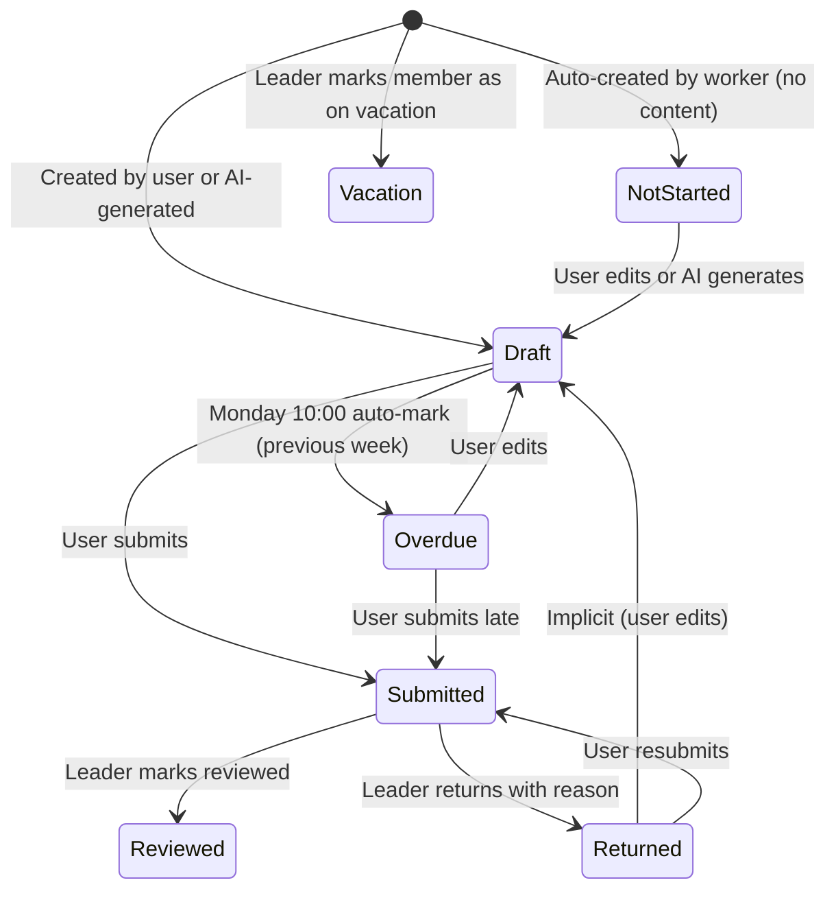

# Report Agent (Weekly Report Management) Technical Specification

**Author**: System
**Date**: 2026-03-16
**Status**: Approved
**Module**: `report-agent`
**Route Prefix**: `api/report-agent/`

---

## Table of Contents

1. [Overview](#overview)
2. [Goals and Non-Goals](#goals-and-non-goals)
3. [High-Level Architecture](#high-level-architecture)
4. [Data Models](#data-models)
5. [API Design](#api-design)
6. [State Machine](#state-machine)
7. [AI Integration](#ai-integration)
8. [Data Source Connectors](#data-source-connectors)
9. [Background Workers](#background-workers)
10. [Permission Model](#permission-model)
11. [Template System](#template-system)
12. [Team Summary Aggregation](#team-summary-aggregation)
13. [Notification System](#notification-system)
14. [Security Considerations](#security-considerations)
15. [Performance Considerations](#performance-considerations)

---

## Overview

Report Agent is a weekly report management system that automates the collection of work activity data, generates AI-powered report drafts, and provides a structured workflow for report submission, review, and team aggregation. It operates as an independent application within the PRD Agent platform, identified by appKey `report-agent`.

The system supports two generation pipelines:
- **v1.0**: Per-user generation using team data sources (Git commits) and system activity collection.
- **v2.0**: Team-wide generation via workflow execution, artifact parsing, personal data source connectors, and per-member splitting.

---

## Goals and Non-Goals

### Goals

- Automate weekly report creation by collecting data from Git, SVN, and internal system activity.
- Provide AI-generated draft reports that users can review and edit before submission.
- Support structured templates with multiple input types for different team roles.
- Enable team leaders to review, return, and aggregate individual reports into team summaries.
- Provide vacation and overdue tracking with automated notifications.

### Non-Goals

- Real-time project management or task tracking (the system consumes external data, it does not manage tasks).
- Integration with email-based report distribution (reports are consumed within the admin UI).
- Multi-language report generation (all output is in Chinese).

---

## High-Level Architecture

```
+-------------------+     +----------------------+     +------------------+
|   React Admin UI  |---->| ReportAgentController|---->| MongoDB (8 coll) |
| (Zustand + Radix) |     | (59 endpoints)       |     +------------------+
+-------------------+     +----------+-----------+
                                     |
                          +----------+-----------+
                          |                      |
                +---------v--------+   +---------v---------+
                | ReportGeneration |   | TeamSummaryService |
                | Service          |   | (AI aggregation)   |
                +--------+---------+   +-------------------+
                         |
              +----------+----------+
              |          |          |
     +--------v--+  +---v----+  +--v---------+
     | MapActivity|  |ILlm   |  | Personal   |
     | Collector  |  |Gateway |  | SourceSvc  |
     +------------+  +--------+  +------------+
              |
     +--------v-----------+
     | ReportAutoGenerate  |
     | Worker (Background) |
     +-----------+---------+
                 |
     +-----------v-----------+
     | GitSyncWorker         |
     | (commit polling)      |
     +-----------------------+
```

### Component Responsibilities

| Component | Responsibility |
|-----------|---------------|
| `ReportAgentController` | 59 HTTP endpoints; hardcoded `appKey = "report-agent"` per app-identity rule |
| `ReportGenerationService` | Orchestrates data collection, prompt construction, LLM calls, and report upsert |
| `TeamSummaryService` | Aggregates submitted member reports into a 5-section management summary via LLM |
| `MapActivityCollector` | Collects system-internal activity (PRD sessions, defects, visual sessions, etc.) |
| `PersonalSourceService` | Manages per-user data source connectors (GitHub, GitLab, Yuque) |
| `ReportAutoGenerateWorker` | BackgroundService: auto-generates drafts (Friday 16:00 UTC+8), marks overdue, auto-submits |
| `GitSyncWorker` | Polls team-level Git/SVN data sources on configured intervals |
| `ReportNotificationService` | Creates `AdminNotification` records for deadlines, overdue, and review events |

---

## Data Models

### MongoDB Collections (8)

| Collection | Model Class | Unique Index | Description |
|------------|-------------|-------------|-------------|
| `report_teams` | `ReportTeam` | `Id` | Team definitions with hierarchy and visibility settings |
| `report_team_members` | `ReportTeamMember` | `TeamId + UserId` | Membership with role, job title, and identity mappings |
| `report_templates` | `ReportTemplate` | `Id`; `TemplateKey` (system) | Template definitions with section schemas |
| `report_weekly_reports` | `WeeklyReport` | `UserId + TeamId + WeekYear + WeekNumber` | Individual weekly reports |
| `report_daily_logs` | `ReportDailyLog` | `UserId + Date` | Per-day work log entries |
| `report_data_sources` | `ReportDataSource` | `Id` | Team-level Git/SVN repository configurations |
| `report_commits` | `ReportCommit` | `DataSourceId + CommitHash` | Cached commit records from synced repositories |
| `report_comments` | `ReportComment` | `Id` | Section-level threaded comments on reports |
| `report_team_summaries` | `TeamSummary` | `TeamId + WeekYear + WeekNumber` | AI-generated team aggregation summaries |

### ReportTeam

```
ReportTeam
├── Id: string (GUID)
├── Name: string
├── ParentTeamId: string? (hierarchy support)
├── LeaderUserId: string
├── LeaderName: string? (denormalized)
├── Description: string?
├── DataCollectionWorkflowId: string? (v2.0 workflow binding)
├── WorkflowTemplateKey: string? ("dev-team" | "product-team" | "minimal")
├── ReportVisibility: string ("all_members" | "leaders_only")
├── AutoSubmitSchedule: string? (e.g., "friday-18:00", UTC+8)
├── CustomDailyLogTags: List<string>
├── CreatedAt: DateTime
└── UpdatedAt: DateTime
```

### ReportTeamMember

```
ReportTeamMember
├── Id: string (GUID)
├── TeamId: string
├── UserId: string
├── UserName: string? (denormalized)
├── AvatarFileName: string? (denormalized)
├── Role: string ("member" | "leader" | "deputy")
├── JobTitle: string?
├── IdentityMappings: Dictionary<string, string>
│   (keys: "github" | "tapd" | "yuque" | "gitlab" → platform username)
└── JoinedAt: DateTime
```

### WeeklyReport

```
WeeklyReport
├── Id: string (GUID)
├── UserId: string
├── UserName: string? (denormalized)
├── AvatarFileName: string? (denormalized)
├── TeamId: string
├── TeamName: string? (denormalized)
├── TemplateId: string
├── WeekYear: int (ISO week year)
├── WeekNumber: int (ISO 1-53)
├── PeriodStart: DateTime (Monday)
├── PeriodEnd: DateTime (Sunday)
├── Status: string (state machine, see below)
├── Sections: List<WeeklyReportSection>
│   ├── TemplateSection: ReportTemplateSection (snapshot at creation)
│   └── Items: List<WeeklyReportItem>
│       ├── Content: string
│       ├── Source: string ("manual" | "git" | "daily_log" | "system_activity" | "ai")
│       └── SourceRef: string? (commit hash, issue ID, etc.)
├── SubmittedAt: DateTime?
├── ReviewedAt: DateTime?
├── ReviewedBy: string?
├── ReviewedByName: string?
├── ReturnReason: string?
├── ReturnedBy: string?
├── ReturnedByName: string?
├── ReturnedAt: DateTime?
├── AutoGeneratedAt: DateTime?
├── WorkflowExecutionId: string? (v2.0)
├── StatsSnapshot: Dictionary<string, object>? (v2.0)
├── CreatedAt: DateTime
└── UpdatedAt: DateTime
```

### ReportTemplate

```
ReportTemplate
├── Id: string (GUID)
├── Name: string
├── Description: string?
├── Sections: List<ReportTemplateSection>
│   ├── Title: string
│   ├── Description: string?
│   ├── InputType: string ("bullet-list" | "rich-text" | "key-value" | "progress-table")
│   ├── SectionType: string? ("auto-stats" | "auto-list" | "manual-list" | "free-text")
│   ├── IsRequired: bool
│   ├── SortOrder: int
│   ├── DataSourceHint: string?
│   ├── MaxItems: int?
│   └── DataSources: List<string>? (["github", "tapd", "yuque", ...])
├── TeamId: string? (null = global template)
├── JobTitle: string? (null = all roles)
├── IsDefault: bool
├── IsSystem: bool
├── TemplateKey: string? ("dev-general" | "product-general" | "minimal")
├── CreatedBy: string
├── CreatedAt: DateTime
└── UpdatedAt: DateTime
```

### ReportDataSource

```
ReportDataSource
├── Id: string (GUID)
├── TeamId: string
├── SourceType: string ("git" | "svn")
├── Name: string
├── RepoUrl: string
├── EncryptedAccessToken: string? (AES-256 via ApiKeyCrypto)
├── BranchFilter: string? (comma-separated, e.g., "main,develop,release/*")
├── UserMapping: Dictionary<string, string> (git author email → MAP userId)
├── PollIntervalMinutes: int (default: 60)
├── Enabled: bool
├── LastSyncAt: DateTime?
├── LastSyncError: string?
├── CreatedBy: string
├── CreatedAt: DateTime
└── UpdatedAt: DateTime
```

### ReportDailyLog

```
ReportDailyLog
├── Id: string (GUID)
├── UserId: string
├── UserName: string? (denormalized)
├── Date: DateTime (one record per user per day)
├── Items: List<DailyLogItem>
│   ├── Content: string
│   ├── Category: string ("development" | "meeting" | "communication" |
│   │                      "documentation" | "testing" | "other")
│   ├── Tags: List<string> (custom tags)
│   ├── DurationMinutes: int?
│   └── CreatedAt: DateTime?
├── CreatedAt: DateTime
└── UpdatedAt: DateTime
```

### ReportComment

```
ReportComment
├── Id: string (GUID)
├── ReportId: string
├── SectionIndex: int (0-based)
├── SectionTitleSnapshot: string (frozen at creation)
├── ParentCommentId: string? (null = top-level)
├── AuthorUserId: string
├── AuthorDisplayName: string (denormalized)
├── Content: string
├── CreatedAt: DateTime
└── UpdatedAt: DateTime?
```

### TeamSummary

```
TeamSummary
├── Id: string (GUID)
├── TeamId: string
├── TeamName: string (denormalized)
├── WeekYear: int
├── WeekNumber: int
├── PeriodStart: DateTime
├── PeriodEnd: DateTime
├── Sections: List<TeamSummarySection>
│   ├── Title: string ("本周亮点" | "关键指标" | "进行中任务" | "风险与阻塞" | "下周重点")
│   └── Items: List<string>
├── SourceReportIds: List<string>
├── MemberCount: int
├── SubmittedCount: int
├── GeneratedBy: string?
├── GeneratedByName: string?
├── GeneratedAt: DateTime
└── UpdatedAt: DateTime
```

---

## API Design

All endpoints are prefixed with `api/report-agent/` and require JWT authentication. The controller-level attribute `[AdminController("report-agent", AdminPermissionCatalog.ReportAgentUse)]` enforces the base permission.

### Team Management (7 endpoints)

| Method | Path | Permission | Description |
|--------|------|-----------|-------------|
| GET | `teams` | Base (or ViewAll for all teams) | List teams the current user belongs to |
| GET | `teams/{id}` | Base | Get team details with member list |
| POST | `teams` | `ReportAgentTeamManage` | Create a team (auto-adds leader as member) |
| PUT | `teams/{id}` | `ReportAgentTeamManage` | Update team settings |
| DELETE | `teams/{id}` | `ReportAgentTeamManage` | Delete team (blocked if reports exist) |
| POST | `teams/{id}/members` | `ReportAgentTeamManage` | Add team member |
| DELETE | `teams/{id}/members/{userId}` | `ReportAgentTeamManage` | Remove team member |
| PUT | `teams/{id}/members/{userId}` | `ReportAgentTeamManage` | Update member role/job title/mappings |
| PUT | `teams/{id}/members/{userId}/identity-mappings` | `ReportAgentTeamManage` | Update multi-platform identity mappings |

### Workflow (2 endpoints)

| Method | Path | Permission | Description |
|--------|------|-----------|-------------|
| GET | `teams/{id}/workflow` | Leader/Deputy | Get team data collection workflow status |
| POST | `teams/{id}/workflow/run` | Leader/Deputy | Trigger workflow execution |

### User Search (1 endpoint)

| Method | Path | Description |
|--------|------|-------------|
| GET | `users` | Search users by keyword (for adding members) |

### Template Management (5 endpoints)

| Method | Path | Permission | Description |
|--------|------|-----------|-------------|
| GET | `templates` | Base | List templates (filtered by teamId/global) |
| GET | `templates/{id}` | Base | Get template details |
| POST | `templates` | `ReportAgentTemplateManage` | Create custom template |
| PUT | `templates/{id}` | `ReportAgentTemplateManage` | Update template |
| DELETE | `templates/{id}` | `ReportAgentTemplateManage` | Delete template (system templates protected) |
| POST | `templates/seed` | `ReportAgentTemplateManage` | Seed system preset templates |

### Report CRUD (6 endpoints)

| Method | Path | Permission | Description |
|--------|------|-----------|-------------|
| GET | `reports` | Base | List reports (filtered by teamId, weekYear, weekNumber, userId) |
| GET | `reports/{id}` | Base | Get report details |
| POST | `reports` | Base (team member) | Create a new report for current week |
| PUT | `reports/{id}` | Owner only | Update report content (draft/returned/overdue only) |
| DELETE | `reports/{id}` | Owner only | Delete report (draft only) |
| POST | `reports/{id}/generate` | Owner only | Trigger AI generation for existing report |

### Report Workflow (3 endpoints)

| Method | Path | Permission | Description |
|--------|------|-----------|-------------|
| POST | `reports/{id}/submit` | Owner | Submit report (Draft/Returned/Overdue -> Submitted) |
| POST | `reports/{id}/review` | Leader/Deputy | Mark as reviewed (Submitted -> Reviewed) |
| POST | `reports/{id}/return` | Leader/Deputy | Return with reason (Submitted -> Returned) |

### Dashboard (1 endpoint)

| Method | Path | Description |
|--------|------|-------------|
| GET | `teams/{id}/dashboard` | Team dashboard with submission rates, member status, trends |

### Daily Logs (4 endpoints)

| Method | Path | Description |
|--------|------|-------------|
| POST | `daily-logs` | Create or update today's daily log |
| GET | `daily-logs` | List daily logs for date range |
| GET | `daily-logs/{date}` | Get specific day's log |
| DELETE | `daily-logs/{date}` | Delete specific day's log |

### Personal Data Sources (5 endpoints)

| Method | Path | Description |
|--------|------|-------------|
| GET | `my/sources` | List current user's personal data sources |
| POST | `my/sources` | Add personal data source (GitHub/GitLab/Yuque token) |
| PUT | `my/sources/{id}` | Update personal data source |
| DELETE | `my/sources/{id}` | Remove personal data source |
| POST | `my/sources/{id}/test` | Test connection |
| POST | `my/sources/{id}/sync` | Manual sync trigger |

### Team Data Sources (6 endpoints)

| Method | Path | Permission | Description |
|--------|------|-----------|-------------|
| GET | `data-sources` | `ReportAgentDataSourceManage` | List team data sources |
| POST | `data-sources` | `ReportAgentDataSourceManage` | Add team data source |
| PUT | `data-sources/{id}` | `ReportAgentDataSourceManage` | Update data source config |
| DELETE | `data-sources/{id}` | `ReportAgentDataSourceManage` | Remove data source |
| POST | `data-sources/{id}/test` | `ReportAgentDataSourceManage` | Test connection |
| POST | `data-sources/{id}/sync` | `ReportAgentDataSourceManage` | Manual sync |
| GET | `data-sources/{id}/commits` | `ReportAgentDataSourceManage` | View synced commits |

### Comments (3 endpoints)

| Method | Path | Description |
|--------|------|-------------|
| GET | `reports/{id}/comments` | List comments (section-level, threaded) |
| POST | `reports/{id}/comments` | Add comment (supports ParentCommentId for replies) |
| DELETE | `reports/{reportId}/comments/{commentId}` | Delete own comment |

### Analytics and Trends (3 endpoints)

| Method | Path | Description |
|--------|------|-------------|
| GET | `trends/personal` | Personal multi-week trend data |
| GET | `trends/team/{teamId}` | Team-level trend analytics |
| GET | `reports/{id}/plan-comparison` | Compare current week's results vs last week's plan |

### Export (2 endpoints)

| Method | Path | Description |
|--------|------|-------------|
| GET | `reports/{id}/export/markdown` | Export individual report as Markdown |
| GET | `teams/{teamId}/summary/export/markdown` | Export team summary as Markdown |

### Team Summary (2 endpoints)

| Method | Path | Permission | Description |
|--------|------|-----------|-------------|
| POST | `teams/{id}/summary/generate` | Leader/Deputy | Trigger AI team summary generation |
| GET | `teams/{id}/summary` | Leader/Deputy | Get team summary for a given week |

### Activity (1 endpoint)

| Method | Path | Description |
|--------|------|-------------|
| GET | `activity` | Recent activity feed |

### Vacation (2 endpoints)

| Method | Path | Permission | Description |
|--------|------|-----------|-------------|
| POST | `teams/{teamId}/members/{userId}/vacation` | Leader/Deputy | Mark member as on vacation for a week |
| DELETE | `teams/{teamId}/members/{userId}/vacation` | Leader/Deputy | Cancel vacation marking |

### Personal Stats (1 endpoint)

| Method | Path | Description |
|--------|------|-------------|
| GET | `my/stats` | Current user's weekly stats overview |

---

## State Machine

The `WeeklyReport.Status` field follows this state machine:



### Status Values

| Status | Code | Editable | Submittable |
|--------|------|----------|-------------|
| Not Started | `not-started` | Yes | No (must have content first) |
| Draft | `draft` | Yes | Yes |
| Submitted | `submitted` | No | N/A |
| Reviewed | `reviewed` | No | N/A |
| Returned | `returned` | Yes | Yes |
| Overdue | `overdue` | Yes | Yes |
| Vacation | `vacation` | No | N/A |
| Viewed | `viewed` | No | N/A (v2.0 simplified) |

### v2.0 Simplified Flow

For teams using the v2.0 workflow: `Draft -> Submitted -> Viewed` (no explicit review/return cycle).

---

## AI Integration

All LLM calls go through `ILlmGateway` as required by project rules. Three AppCallerCodes are registered:

| AppCallerCode | Purpose | Temperature | Max Tokens |
|---------------|---------|-------------|------------|
| `report-agent.generate::chat` | Generate report draft from collected data | 0.3 | 4096 |
| `report-agent.polish::chat` | Polish user-written report content | 0.3 | 4096 |
| `report-agent.aggregate::chat` | Aggregate team reports into management summary | 0.3 | 4096 |

### Generation Pipeline (v1.0)

1. Load the applicable template (team+jobTitle -> team generic -> system default).
2. Compute ISO week period (Monday-Sunday).
3. Collect activity data via `MapActivityCollector` (commits, daily logs, system activity).
4. Build a structured prompt containing template structure and raw data.
5. Call LLM with `CancellationToken.None` (server authority rule).
6. Parse JSON response into `WeeklyReportSection` list.
7. Upsert the report (create or update existing draft).
8. Fallback: if LLM fails or JSON parsing fails, create empty sections from template.

### Generation Pipeline (v2.0)

1. Trigger team data collection workflow (if `DataCollectionWorkflowId` is set).
2. Wait for workflow completion (5-minute timeout).
3. Parse workflow artifacts via `ArtifactStatsParser`.
4. Split team stats by member using identity mappings.
5. For each member: merge team stats + personal source stats + v1.0 system activity.
6. Build v2.0 prompt with section-type-aware instructions.
7. Call LLM and parse. Upsert per-member reports.

### Prompt Design

The system prompt instructs the AI to:
- Consolidate scattered Git commits into meaningful feature descriptions.
- Use business language rather than technical details.
- Limit each item to 50 characters.
- Never output "no data" messages; merge sparse data into related sections.
- Output strict JSON format matching the template section count.

The user prompt includes:
- Template structure with section metadata (input type, section type, required, max items).
- Raw data: Git commits (up to 50), daily log entries, system activity counters.
- Section-type-specific instructions (auto-stats outputs key-value, manual-list outputs empty array).

### JSON Response Parsing

The parser handles three formats:
1. Raw JSON starting with `{`.
2. JSON wrapped in markdown code blocks (`` ```json ... ``` ``).
3. JSON extracted by finding the first `{` and last `}`.

If parsing fails, the system falls back to empty template sections.

---

## Data Source Connectors

### Team-Level Connectors

| Connector | Class | Transport | Description |
|-----------|-------|-----------|-------------|
| GitHub | `GitHubConnector` | REST API + webhook | Syncs commits with diff stats |
| SVN | `SvnConnector` | CLI polling | Syncs revision logs |

Both implement `ICodeSourceConnector`:
- `TestConnectionAsync()`: Validates credentials and repository access.
- `SyncAsync()`: Fetches new commits since `LastSyncAt`, maps authors via `UserMapping`, and inserts into `report_commits`.

Access tokens are stored encrypted via AES-256 (`EncryptedAccessToken` field, `ApiKeyCrypto` utility).

### Personal-Level Connectors (v2.0)

| Connector | Class | Data Collected |
|-----------|-------|---------------|
| GitHub | `PersonalGitHubConnector` | Commits, PRs, reviews |
| GitLab | `PersonalGitLabConnector` | Commits, merge requests |
| Yuque | `PersonalYuqueConnector` | Documents created/updated |

All implement `IPersonalSourceConnector`:
- `TestConnectionAsync()`: Validates token.
- `CollectStatsAsync(from, to)`: Returns `SourceStats` with summary counts and detail items.

### User Identity Mapping

The `ReportTeamMember.IdentityMappings` dictionary maps platform usernames to system user IDs. This is used in two places:
1. **Team data sources**: `ReportDataSource.UserMapping` maps git author email to MAP userId for commit attribution.
2. **v2.0 stats splitting**: `ArtifactStatsParser.SplitByMember()` distributes team-level stats to individual members based on their identity mappings.

---

## Background Workers

### ReportAutoGenerateWorker

A `BackgroundService` that runs on 15-minute check intervals with three responsibilities:

**1. Auto-Generate Drafts (Friday 16:00 UTC+8)**
- Iterates all teams and members.
- Skips members who already have a report for the current week.
- Finds the applicable template (team+jobTitle -> team generic -> system default).
- Calls `ReportGenerationService.GenerateAsync()` with `CancellationToken.None`.
- Creates an `AdminNotification` for each generated report.
- Deduplicates by tracking `_lastTriggeredWeek` and `_lastTriggeredYear`.

**2. Deadline Reminders and Overdue Marking**
- **Friday 10:00 or 15:00 UTC+8**: Sends deadline approaching notifications to members without submitted reports.
- **Monday 10:00 UTC+8**: Marks previous week's `Draft` and `NotStarted` reports as `Overdue`. Notifies the member and their team leader.

**3. Auto-Submit (configurable per team)**
- Teams can set `AutoSubmitSchedule` (e.g., `"friday-18:00"`).
- Within a 15-minute window of the scheduled time, auto-submits all draft reports that have content.
- Deduplicates via in-memory `_autoSubmittedKeys` set.

### GitSyncWorker

Polls enabled `ReportDataSource` entries on their configured `PollIntervalMinutes`. Creates `GitHubConnector` or `SvnConnector` instances and calls `SyncAsync()`.

---

## Permission Model

### System Permissions (5)

| Permission | Constant | Description |
|------------|----------|-------------|
| `report-agent.use` | `ReportAgentUse` | Base access to report features (controller-level) |
| `report-agent.template.manage` | `ReportAgentTemplateManage` | Create/edit/delete report templates |
| `report-agent.team.manage` | `ReportAgentTeamManage` | Manage teams, members, and data sources |
| `report-agent.view.all` | `ReportAgentViewAll` | View all teams' reports (admin override) |
| `report-agent.datasource.manage` | `ReportAgentDataSourceManage` | Configure Git/SVN repository connections |

### Team Roles (3)

| Role | Code | Capabilities |
|------|------|-------------|
| Leader | `leader` | Review/return reports, generate team summaries, manage vacation, view all member reports |
| Deputy | `deputy` | Same as leader (both checked via `IsTeamLeaderOrDeputy()`) |
| Member | `member` | Create/edit/submit own reports, view own and (depending on visibility) others' reports |

### Visibility Control

The `ReportTeam.ReportVisibility` field controls cross-member report access:
- `all_members`: All team members can view each other's reports.
- `leaders_only`: Only leaders and deputies can view member reports; members can only see their own.

---

## Template System

### System Preset Templates (3)

| Template Key | Name | Target Role | Sections |
|-------------|------|-------------|----------|
| `dev-general` | Research & Development General | Developers | Code Output (auto-stats), Task Output (auto-stats), Completed This Week (auto-list), Daily Work (auto-list), Next Week Plan (manual-list), Notes (free-text) |
| `product-general` | Product General | Product Managers | Requirement Progress (auto-stats), Document Output (auto-stats), Completed This Week (auto-list), Daily Work (auto-list), Next Week Plan (manual-list) |
| `minimal` | Minimal Mode | Any | This Week Output (auto-stats), Notes (free-text) |

### Section Types (v2.0)

| Section Type | Behavior | AI Handling |
|-------------|----------|-------------|
| `auto-stats` | Read-only statistical cards | Outputs key-value pairs from collected data |
| `auto-list` | AI-generated items, user-editable | AI consolidates raw data into meaningful items |
| `manual-list` | User fills in manually | AI outputs empty items array |
| `free-text` | Free-form text input | AI outputs empty items array |

### Input Types (v1.0)

| Input Type | UI Rendering |
|-----------|-------------|
| `bullet-list` | Ordered/unordered list of text items |
| `rich-text` | Rich text editor (paragraphs, formatting) |
| `key-value` | Key-value pair table (metric name + value) |
| `progress-table` | Progress tracking table (task, status, percentage) |

### Template Resolution Order

When generating a report for a member, the system selects a template in this order:
1. Team-specific + job-title-specific template.
2. Team-specific generic template (no job title filter).
3. System default template (`IsDefault = true`).

---

## Team Summary Aggregation

The `TeamSummaryService` generates a management-level summary from individual submitted reports:

1. Collects all `Submitted` or `Reviewed` reports for the team/week.
2. Builds a prompt with all members' report content.
3. Calls LLM with `report-agent.aggregate::chat`.
4. Parses response into 5 fixed sections:
   - Highlights of the Week
   - Key Metrics
   - In-Progress Tasks
   - Risks and Blockers
   - Next Week Focus
5. Upserts into `report_team_summaries` (unique on `TeamId + WeekYear + WeekNumber`).
6. Records `SourceReportIds`, `MemberCount`, and `SubmittedCount` for traceability.

---

## Notification System

The `ReportNotificationService` creates `AdminNotification` records (consumed by the platform notification system) for key events:

| Event | Recipient | Timing |
|-------|-----------|--------|
| Draft auto-generated | Report owner | Friday 16:00+ |
| Deadline approaching | Members without submitted reports | Friday 10:00/15:00 |
| Report overdue | Member + team leader | Monday 10:00+ |
| Report submitted | Team leader | On submit |
| Report reviewed | Report owner | On review |
| Report returned | Report owner | On return |

All notifications use idempotent keys (e.g., `report-auto-gen:{userId}:{weekYear}-W{weekNumber}`) to prevent duplicates.

---

## Security Considerations

- **Access token encryption**: Data source access tokens are stored using AES-256 encryption via `ApiKeyCrypto`. Tokens are never exposed in API responses.
- **Owner-only editing**: Report update and delete operations verify `report.UserId == currentUserId`.
- **Team membership validation**: Report creation verifies the user is a team member via `IsTeamMember()`.
- **Leader-only operations**: Review, return, summary generation, and vacation management verify `IsTeamLeaderOrDeputy()`.
- **Duplicate prevention**: Unique MongoDB indexes on (UserId, TeamId, WeekYear, WeekNumber) prevent duplicate reports. `MongoWriteException` with `DuplicateKey` is caught and handled gracefully.
- **Cascade deletion protection**: Teams with existing reports cannot be deleted.

---

## Performance Considerations

- **CancellationToken.None**: All LLM calls and database writes use `CancellationToken.None` per the server authority rule. Client disconnection does not cancel in-progress generation.
- **Concurrent report generation**: The v2.0 pipeline generates reports sequentially per member within a team to avoid overwhelming the LLM gateway. Failures for individual members are caught and logged without blocking others.
- **Commit pagination**: The generation prompt includes at most 50 commits and 30 detail items per data source to stay within LLM context limits.
- **Denormalization**: User names, team names, and avatar filenames are denormalized on write to avoid joins during read-heavy operations (report listing, dashboard).
- **Background worker interval**: The 15-minute check interval balances responsiveness with resource usage. Auto-submit uses a time window check (scheduled time to scheduled time + 15 minutes) rather than exact matching.
- **ISO week calculation**: All week computations use `System.Globalization.ISOWeek` for correct handling of year boundaries (week 52/53 edge cases).
