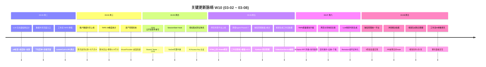

# 2026-W10 (03-02 ~ 03-08) · 周报

> **总计 312 次提交 | 406 个文件变更 | +55,797 行 / -12,748 行 | 44 个 PR 合并 (#163 ~ #206)**
>
> **贡献者**：Claude (263 commits), InerNoro (41 commits), Cursor Agent (6 commits), inernoro (2 commits)

**本周趋势**：延续 W09 的高密度交付节奏，本周聚焦于三大主线并行推进：(1) 工作流引擎深度迭代——TAPD 质量报告从 LLM 生成切换为确定性 ScriptExecutor + ECharts 可视化；(2) Cloud Development Suite (CDS) 从 Branch Tester 全面重写为云端开发套件；(3) 网页托管平台从书签收藏重构为完整的 HTML/ZIP 上传 + 分享体系。同时完成了缺陷管理统一平台 5 阶段全面实现、多文档知识库、账户数据共享、视频 Agent 场景代码生成等多个重要功能，W09 提出的 6 个优先方向中 4 个得到实质推进。

---

## 关键更新脉络

---

## 一、已合并 Pull Requests (#163 ~ #206)

| PR | 标题 | 分类 |
|----|------|------|
| #163 | 生成 W09 周报 | 📝 文档 |
| #164 | 落地页科技风配色重设计 + 主按钮微交互动效 | 🎨 UI/UX |
| #165 | 工作流 TAPD 采集器增强（customCurl + Cookie 校验 + cURL 调试） | ⚙️ 工作流 |
| #166 | 技能管理重设计 + 技能系统规则文档 | 🎨 UI/UX |
| #167 | 统一实验室 (Workshop Lab) 样式 | 🎨 UI/UX |
| #168 | 修复图片生成后尺寸调整 + modelId URL 编码 | 🐛 Bug 修复 |
| #169 | 系统通知附件 + TAPD common_get_info 完整数据 | ⚙️ 工作流 |
| #170 | 修复 TAPD 工作流空内容问题（自定义字段/URL） | 🐛 Bug 修复 |
| #173 | 修复视觉创作图片生成完成后不显示问题 | 🐛 Bug 修复 |
| #174 | 竞技场附件增强（单输入 + 多类型附件 + 完成按钮） | 🔄 更新 |
| #175 | 权限指纹缓存失效机制 | 🔐 权限 |
| #176 | 服务器权威性设计文档 + 文档目录扁平化 | 📝 文档 |
| #177 | RequestPurpose → AppCallerCode 全链路重命名 + 用户信息注入日志 | 🏗️ 架构 |
| #178 | 修复落地页背景亮度，提升内容可读性 | 🎨 UI/UX |
| #179 | Agent 权限体系补齐（竞技场独立权限 + 内置角色补全） | 🔐 权限 |
| #180 | 模型类型扩展（TTS/视频生成/音频生成）+ ModelTypePicker 浮动弹出 | 🧠 AI 能力 |
| #181 | LLM 日志面板重设计 + 工件芯片 + 下载文件名修复 | 🎨 UI/UX |
| #182 | TAPD 缺陷采集模板调整（28 维度精确统计 + Markdown 直出） | ⚙️ 工作流 |
| #183 | 修复 TAPD 统计 JS 脚本换行符转义 | 🐛 Bug 修复 |
| #184 | 资产管理系统（IAssetProvider + 桌面画廊 + 后端统计面板） | ✨ 新功能 |
| #185 | 账户数据共享（深拷贝 + 黑洞漩涡动效 + 引导页） | ✨ 新功能 |
| #186 | 默认用户头像兜底（nohead.png 替代拼接） | 🐛 Bug 修复 |
| #187 | 授权集成测试重写（AI Access Key 认证 + 技能/聊天 authz 测试） | 🔧 DevOps |
| #188 | CDS 动态端口预览 + 通配符域名 + 移动端响应式 + 部署脚本 | ✨ 新功能 |
| #189 | 开发环境搭建脚本 + dev-setup 技能合并 | 🔧 DevOps |
| #190 | CDS 环境变量面板 + Cookie 分支切换 + 快速启动 + 缓存挂载 | ✨ 新功能 |
| #191 | 修复全平台 /models API 获取（平台级认证） | 🐛 Bug 修复 |
| #192 | 优化头像加载（请求去重 + 懒加载 160+ 模型头像） | ⚡ 性能 |
| #193 | Branch Tester → CDS 目录重命名 | 🏗️ 架构 |
| #194 | 网页托管平台（IHostedSiteService + iframe 预览 + 一键分享 + 权限隔离） | ✨ 新功能 |
| #195 | PRD Agent 多文档知识库（渐进式披露 + Token 预算 + 数据关系审计规则） | ✨ 新功能 |
| #196 | 工作流 ScriptExecutor 文件类型适配 + 通知预览修复 | ⚙️ 工作流 |
| #197 | 修复 ZIP 上传空文件崩溃 | 🐛 Bug 修复 |
| #198 | 修复变体类型 + 测试 Fake 接口实现 | 🐛 Bug 修复 |
| #199 | 分享页面重设计 + 玻璃卡片透明度优化 | 🎨 UI/UX |
| #200 | 分享页面改进（用户名显示、自保存阻止、日志查看） | 🔄 更新 |
| #201 | TAPD 质量报告升级（ECharts + PPT 风格 + 多月趋势 + 自动生成标签） | ⚙️ 工作流 |
| #202 | 视频 Agent 场景代码生成 + TTS 语音合成 + 每日限额 + 竞态修复 | ✨ 新功能 |
| #203 | 周报 Agent Phase 5-7（工作流数据管线 + 模板系统 + v2.0 UI 全面重设计） | ✨ 新功能 |
| #204 | 工作流 AI 辅助参数填充（聊天面板交互） | ✨ 新功能 |
| #205 | 统一缺陷管理平台（5 阶段全面实现 + 项目管理 + Kanban + 统计仪表盘） | ✨ 新功能 |
| #206 | 冲突解决技能（PR 前预合并 main 分支 + 三级冲突分类） | ✨ 新功能 |

---

## 二、本周完成

### 1. 工作流引擎深度迭代

**项目目的**：构建通用工作流引擎，支持可视化编排节点、定时或手动触发、自动执行端到端流程（数据采集 → LLM 分析 → 代码统计 → 多格式渲染），替代团队每月手动从 TAPD 等平台拉取数据、清洗、分析、生成质量会议总结的重复劳动。

**系统架构**：WorkflowRunWorker 后台 BFS 遍历 DAG → CapsuleExecutor 四类舱（触发/处理/流程控制/输出）→ SSE 实时推送（< 400ms 节点进度）→ 断线 afterSeq 续传。本周新增 ScriptExecutor 舱（Jint JS 引擎替代 LLM 生成）和 AI 参数填充（聊天面板交互式配置胶囊参数）。

**解决的问题**：
- TAPD 数据采集从依赖浏览器 Cookie 手动复制升级为 customCurl 模式 + 一键复制 cURL 调试
- 质量报告从 LLM 不确定性生成切换为 ScriptExecutor + ECharts 确定性渲染，结果可控可复现
- 28 维度精确统计（P0/P1 明细 + 挂起/临时解决列表）替代粗粒度汇总
- 胶囊参数配置从手动填写升级为 AI 对话辅助，降低使用门槛
- CDN 资源服务器端内联，解决内网无法加载外部 JS/CSS 资源

**完成度**：✅ 已完成。TAPD 采集器 customCurl 模式、ScriptExecutor Jint 引擎、ECharts PPT 风格报告、AI 参数填充、多月趋势看板均已上线。

**MAP 系统价值**：工作流引擎是 MAP 的"自动化流水线"层，从单个 Agent（对话/画图/视频）升级为多 Agent 编排系统。本周的 ScriptExecutor 让工作流具备了确定性数据处理能力（不依赖 LLM），AI 参数填充让非技术人员也能配置复杂工作流，两者结合使工作流从"开发者工具"进化为"全职能自助平台"。

> 参考文档：`design.workflow-engine.md`、`design.workflow-control-flow-sse.md`

涉及 PR：#165, #169, #170, #182, #183, #196, #201, #204

---

### 2. Cloud Development Suite (CDS)

**项目目的**：提供多分支并行验收管理工具，开发者/测试/产品可一键启动任意 Git 分支的完整预览环境，无需本地搭建，解决多分支并行开发时频繁重启服务、切换数据库、停机切换的问题。

**系统架构**：Node.js TypeScript 服务 + Express API → Git worktree 隔离分支 → 动态创建 Docker 容器 → Nginx 热切换 upstream → Cookie 驱动分支切换（`/_switch/` URL）。每个分支独立 MongoDB 数据库，状态 JSON 持久化。本周从简单的 Branch Tester 全面重写，新增动态端口预览、通配符域名自动分配、快速启动配置、环境变量面板、NuGet/npm 缓存挂载。

**解决的问题**：
- 多分支验收需频繁重启服务、手动切换数据库 → 一键切换 + 秒级回滚
- 新人/测试/产品无法自行搭建开发环境 → Docker 快速启动（.NET / Node.js 预置配置）
- Web sandbox 环境下 NuGet 代理不可达 → SessionStart Hook + 代理中继

**完成度**：⚠️ 架构重写完成，核心功能已实现（动态端口/Cookie 切换/环境变量/快速启动），但尚未经过实际多用户使用验证。

**MAP 系统价值**：CDS 是 MAP 的 CI/CD 基础设施层，支撑多分支特性并行开发验证、一键发布与秒级回滚。随着 MAP 功能模块持续增长（当前 15+ Agent），特性分支数量同步增长，CDS 确保每个特性分支都有独立可验收的预览环境，是 MAP 从单人开发走向团队协作的关键工具链。

> 参考文档：`design.cds.md`

涉及 PR：#188, #189, #190, #193

---

### 3. 网页托管平台

**项目目的**：轻量级静态网站托管平台，用户上传 HTML/ZIP 文件 → 系统自动解压并托管到 COS 对象存储 → 生成可访问的公开 URL + 分享链接。同时为工作流、视频 Agent 等后端模块提供程序化创建网页的能力（直接注入 `IHostedSiteService`，无需走 HTTP）。

**系统架构**：`WebPagesController`（薄壳）→ `IHostedSiteService`（领域服务层）→ MongoDB（`hosted_sites` + `web_page_share_links`）+ COS 对象存储（`web-hosting/sites/{siteId}/`）。每个站点独立目录，HTML 绝对路径自动改写为相对路径，确保子目录资源正常加载。ZIP 上传安全防护：路径遍历检测、可执行文件过滤、大小限制。

**解决的问题**：
- 用户无法便捷部署和展示静态网页 → 一键上传 + 自动托管
- 工作流/视频 Agent 生成的 HTML 报告无处承载 → 领域服务直接调用
- 分享需求缺乏权限控制 → 密码保护 + 过期时间 + 撤销
- 内网环境外部资源不可达 → CDN 资源服务器端内联

**完成度**：✅ v1.0 已完成。16 个 API 端点（上传、CRUD、分享、匿名访问）+ 2 个前端页面（管理页 + 匿名分享页）+ iframe 实时预览 + 安全防护齐全。

**MAP 系统价值**：网页托管是 MAP 的"内容承载层"，接收各类 Agent 的输出结果（TAPD 质量报告、视频预览页、工作流报告）并托管为可分享的链接。`IHostedSiteService` 领域服务模式让任何模块无需了解 COS/HTTP 细节即可创建托管内容，是 MAP 从"生成内容"到"分发内容"的关键桥梁。

> 参考文档：`design.web-hosting.md`、`plan.web-hosting.md`

涉及 PR：#194, #199, #200, #201

---

### 4. 缺陷管理统一平台

**项目目的**：将缺陷管理从简单的个人对话式工具升级为跨团队、跨项目的统一平台，支持项目维度管理、工单全生命周期流转、超时催办、统计分析和 Webhook 外部通知，实现"降低提交门槛、加速处理流程、减少信息丢失、数据驱动决策"。

**系统架构**：三层架构——React 前端（列表页 + 详情页 + 对话式提交面板 + Kanban 看板 + 统计仪表盘）→ .NET 后端（`DefectAgentController` + 多个 Service/Worker）→ MongoDB（9 个核心集合）。对话式提交：用户自然语言描述 → AI 结构化提取 → 自动缺失字段检查。工单 10 状态流转：draft → submitted → assigned → processing → verifying → closed。SSE 断线 afterSeq 续传。

**解决的问题**：
- 缺陷提交冗长 → 对话式 + AI 自动提取，无复杂表单
- 跨项目管理困难 → 新增 DefectProject + TeamId 维度 + 项目/团队筛选
- 处理流程不透明 → 状态驱动 + 消息协作 + 版本历史 + Kanban 看板
- 管理决策缺数据 → 统计仪表盘（概览、按人、趋势、排行榜）
- 超时无人跟进 → DefectEscalationWorker（blocker 2h、critical 4h 分级催办）

**完成度**：✅ 5 阶段全部完成——Phase 1 项目维度 + Phase 2 待验收状态 + Phase 3 超时催办 + Phase 4 统计看板 + Phase 5 Webhook 通知。25 个测试用例覆盖。

**MAP 系统价值**：缺陷管理 Agent 是 PRD Agent 的配套质量闭环——PRD 文档 → 功能开发 → 测试缺陷反馈 → 修复迭代。结构化缺陷数据可对接周报 Agent 统计（共享 `report_teams` 集合），缺陷趋势指标支撑产品决策，Webhook 通知连接企业微信/钉钉/飞书等外部协作工具。

> 参考文档：`plan.unified-defect-management.md`、`spec.defect-agent.md`、`design.defect-agent.md`

涉及 PR：#205

---

### 5. PRD Agent 多文档知识库

**项目目的**：扩展 PRD Agent 从单文档模式（Session 绑定一个 DocumentId）到多文档模式（Session 支持多个 DocumentIds），让 AI 在对话中能同时参考产品文档、技术方案、设计规范、参考资料等多份文档，给出更全面的回答。核心理念："主文档是锚，辅助文档是上下文"。

**系统架构**：Session 新增 `DocumentIds[]` + `DocumentMetas[]`（记录每个文档的类型：product/technical/design/reference）。Token 预算制：总 100K 分配为文档 60K + 历史 30K + 当前 10K。分级注入策略：按文档类型优先级分配预算，超预算文档降级为摘要（目录 + 前文）。动态历史窗口：从固定 20 条改为 30K Token 预算制，自动裁剪早期消息。

**解决的问题**：
- AI 对话时只能看一份文档，上下文不足 → 多文档同时参考
- 多文档 Token 超限 → 预算制 + 渐进式披露 + 摘要降级
- 旧 Session 兼容性 → 向后兼容单文档模式，零迁移成本

**完成度**：⚠️ Phase 1-2 已完成（多文档模型 + Token 预算 + 前端 UI）。Phase 3（按需检索/RAG + embedding 基础设施）规划中，未启动。

**MAP 系统价值**：多文档知识库直接提升 PRD Agent 的核心能力——理解产品方案。在 MAP 的愿景中，PRD Agent 要替代"口头串讲"实现"文档即共识"，多文档支持让 AI 能同时对照需求文档、技术方案、竞品分析来回答问题，是从"单点理解"到"全局理解"的关键升级。后续 RAG 集成将进一步解锁长文档场景。

> 参考文档：`design.multi-doc-knowledge.md`、`plan.multi-document.md`

涉及 PR：#195

---

### 6. 账户数据共享

**项目目的**：支持员工离职交接、团队协作、跨账户迁移场景，实现工作数据（提示词、工作区、参考图等）的深拷贝转移，解决离职员工无法交接数据、新人缺乏历史资产的问题。

**系统架构**：DataTransfer 状态机（pending → processing → completed/rejected）+ DataTransferItem（可共享类型：workspace、literary-prompt、ref-image）。前端使用 BlackHoleVortex 背景动效 + 卡片缩略图 + 跳转链接的交互设计，首次使用引导页降低学习成本。

**解决的问题**：
- 员工离职时优质配置（精心调试的提示词、工作区布局）随账号失效 → 深拷贝迁移
- 新成员需从零配置 → 一键继承历史资产

**完成度**：✅ 已完成。选择用户 → 选择数据类别 → 深拷贝迁移全链路可用。

**MAP 系统价值**：提升用户留存率 + 降低组织迁移成本。MAP 平台上积累的提示词、工作区配置、参考图库是团队的"隐性知识资产"，数据共享确保这些资产不因人员流动而丢失。

> 参考文档：`design.account-data-sharing.md`

涉及 PR：#185

---

### 7. 视频 Agent 增强 — 场景代码生成 + TTS + 每日限额

**项目目的**：用 LLM 为每个视频分镜动态生成定制化 Remotion 组件，替代硬编码 8 种模板，实现"千镜千面"。同时接入 TTS 语音合成为视频添加旁白，并在视觉创作工作区增加每日限额体验入口。

**系统架构**：
- **场景代码生成**：脚本生成完成 → 所有分镜 CodeStatus=running → Worker 轮询路径 7 处理 → LLM 生成 TSX → 存盘 → Remotion 构建。3 层回退容错：生成代码 → 硬编码组件 → ConceptScene 通用兜底。try/catch 隔离单个文件编译错误。
- **TTS**：LLM Gateway → 火山引擎 → 音频字节 → COS 上传 → Remotion Audio 组件。
- **每日限额**：`VisualAgentVideoController`（appKey=visual-agent），MongoDB 当日计数查询（低频操作无需 Redis）。
- **视频生成胶囊**：抽取 `IVideoGenService` 领域服务，供 Controller + 工作流胶囊复用。

**解决的问题**：
- 视频模板僵化、视觉重复度高 → LLM 生成定制化 Remotion 组件
- 视频无旁白 → TTS 语音合成
- 视觉创作缺乏视频生成入口 → 工作区内嵌入口 + 每日 1 次体验

**完成度**：✅ 场景代码生成 v1.0 已完成。TTS 语音合成已接入。每日限额方案设计完成。`IVideoGenService` 已抽取。

**MAP 系统价值**：视频 Agent 是 MAP 的"内容输出放大器"——将文章、PRD 等文本内容转化为可传播的视频教程。场景代码生成解锁了 LLM 代码生成能力在视频领域的应用，`IVideoGenService` 领域服务让视频生成可被工作流编排，形成"文章 → 分镜 → LLM 代码 → Remotion 渲染 → COS 托管"的全自动管线。

> 参考文档：`design.video-scene-codegen.md`、`plan.video-tts-and-scene-upgrade.md`、`plan.visual-agent-video-gen-daily-limit.md`

涉及 PR：#180, #202

---

### 8. 资产管理系统

**项目目的**：统一管理散落在各 Agent 模块（文档、图片、工件、附件）中的数字资产，提供跨模块的统一浏览和检索入口。

**系统架构**：`IAssetProvider` 被动资产披露接口，各模块实现该接口注册自身资产。管理后台 assets 页支持缩略图展示 + Tab 统计计数 + 摘要/来源字段。桌面端新增资产画廊页 + 侧边栏「我的资产」入口。后端统计面板提供分类统计数据。

**解决的问题**：
- 数字资产散落在各模块，无统一查看入口 → 统一资产浏览
- 资产统计缺失 → 后端分类统计 + Tab 计数

**完成度**：✅ 已完成。IAssetProvider 接口 + 管理后台 + 桌面端画廊均已上线。

**MAP 系统价值**：资产管理是 MAP 的"数据沉淀层"。随着用户使用各 Agent 产出越来越多内容（图片、文档、视频、网页），统一的资产管理确保这些产出可被检索、复用和管理，是 MAP 从"生产工具"向"知识管理平台"演进的基础设施。

涉及 PR：#184

---

### 9. 权限与测试体系加固

**项目目的**：完善 RBAC 权限体系闭环，确保每次部署后前端权限缓存自动失效；将集成测试从模拟 JWT 升级为真实 API 认证，提升测试可信度。

**系统架构**：
- **权限指纹**：后端生成权限配置哈希 → 前端缓存时记录哈希 → 部署更新权限后哈希变化 → 前端检测到不一致自动清除缓存。
- **AppCallerCode 重命名**：将 `RequestPurpose` 全链路重命名为 `AppCallerCode`，语义更清晰（`{app-key}.{feature}::{model-type}`）。
- **授权集成测试**：从手工构造 JWT 改为通过真实 `/api/v1/auth/login` API 获取 Token，覆盖技能执行和聊天 Run 的 authz 路径。

**解决的问题**：
- 部署后前端菜单权限不刷新 → 权限指纹自动失效
- 竞技场缺独立权限 → 补齐 `arena.use` / `arena.manage`
- 测试 Mock JWT 与真实行为不一致 → AI Access Key 真实认证

**完成度**：✅ 已完成。

**MAP 系统价值**：MAP 当前有 60+ 权限项、15+ Agent 模块，权限矩阵复杂度持续增长。权限指纹确保部署一致性，授权集成测试确保每个 Agent 的权限边界不被意外突破，是 MAP 多 Agent 架构的安全基石。

涉及 PR：#175, #177, #179, #187

---

### 10. 周报 Agent Phase 5-7

**项目目的**：从"回忆式写作"转变为"确认式提交"——自动采集工作痕迹（Git/SVN + MAP 系统活动 + 每日打点）→ AI 生成 → 领导汇总，实现周报全流程自动化。

**系统架构**：
- **Phase 5**：Workflow as Data Pipeline，周报数据从工作流 Artifact 自动采集 + 成员身份映射。
- **Phase 6**：V2.0 生成引擎支持 4 种板块类型（auto-stats / auto-list / manual-list / free-text）。
- **Phase 7**：v2.0 UI 全面重设计——富卡片 + 可视化层次 + 日志面板（聊天式输入 + 时间线 + 热力图侧边栏 + 彩色圆点时间戳）。

**解决的问题**：
- 周报写作成本高 → AI 自动采集 + 生成
- 重要工作遗漏 → 多数据源自动汇总
- 团队汇总耗时 → 一键生成团队周报

**完成度**：✅ Phase 1-7 全部完成（2026-03-07）。

**MAP 系统价值**：周报 Agent 是 MAP 的"组织管理层"，驱动员工活跃度可视化，为总裁面板供应数据，强化团队管理闭环。与缺陷管理 Agent 共享 `report_teams` 集合，缺陷数据可对接周报统计，形成"开发 → 缺陷 → 周报 → 决策"的完整信息流。

> 参考文档：`plan.report-agent-impl.md`、`spec.report-agent.md`

涉及 PR：#203

---

### 11. 技能系统增强

**项目目的**：扩展 AI 技能矩阵，将重复性的开发流程（merge 冲突解决、代码追踪、风险评估）封装为可复用的技能，覆盖从设计到上线的全生命周期质量保障。

**主要技能**：
- **conflict-resolution**：PR 前预合并 main 分支，三级冲突分类（安全/半安全/高风险），禁止丢弃代码 (#206)
- **flow-trace**：全链路数据流与控制流追踪，大白话输出路径图 (#195)
- **risk-matrix**：MECE 六维度风险评估（正确性/兼容性/性能/安全/运维/体验）(#195)
- **技能管理重设计**：UI 改版 + 技能系统规则文档 (#166)

**完成度**：✅ 已完成。

**MAP 系统价值**：技能系统是 MAP 的"AI 能力扩展层"。每个技能封装了特定领域的专家知识（如 conflict-resolution 封装了 Git 合并最佳实践），让 AI 助手从通用对话升级为领域专家。质量保障技能链（risk → trace → verify → smoke → handoff → weekly）覆盖完整开发生命周期。

涉及 PR：#166, #195, #206

---

### 12. UI/UX 统一性改进

- 落地页科技风配色重设计 + 主按钮微交互动效（sweep + bounce + focus pulse）(#164)
- 实验室样式统一至 Lab Design System (#167)
- 落地页背景亮度调整，提升内容可读性 (#178)
- 默认头像兜底方案 nohead.png，解决拼接不存在 URL (#186)
- 模型头像请求去重 + loading guard，消除 API call storm (#192)
- 玻璃卡片透明度优化，改善文字可读性 (#199)
- LLM 日志面板重设计——pill 标签 + 进度条 + 工件芯片 + 动效，关键指标替代原始 prompt/response dump (#181)
- 竞技场附件增强——单输入 + 多类型附件 + 突出完成按钮 (#174)

### 13. Bug 修复集合

- 视觉创作图片生成完成后不显示——刷新页面无法恢复图片 (#173)
- 图片尺寸调整 modelId 作为 URL path 时特殊字符编码问题 (#168)
- ZIP 上传空文件导致服务端崩溃 (#197)
- 全平台 /models API 认证修复——每个平台使用平台级认证 (#191)
- 分享链接密码验证逻辑 + 分享页面交互 (#199)
- Worker 轮询查询使用 `CancellationToken.None` 避免误触兜底错误标记 (#202)
- 批量渲染竞态条件修复 (#202)
- 测试 Fake 接口缺少新增 interface member (#198)

---

## 三、本周数据

### 每日提交分布

| 日期 | 提交数 | 重点方向 |
|------|--------|----------|
| 03-02 (周一) | 0 | — |
| 03-03 (周二) | 19 | LLM 日志面板重设计、数据共享入口、下载文件名修复 |
| 03-04 (周三) | 83 | 账户数据共享、TAPD 28 维度统计、默认头像、资产管理、多文档设计 |
| 03-05 (周四) | 41 | CDS 云开发套件重写、SessionStart Hook、授权集成测试 |
| 03-06 (周五) | 55 | 网页托管平台、周报 Agent Phase5-7、缺陷管理看板、视频生成胶囊 |
| 03-07 (周六) | 72 | TAPD 质量报告升级、网页分享完善、场景代码生成、缺陷统一平台 |
| 03-08 (周日) | 42 | 工作流 AI 参数填充、视频每日限额、冲突解决技能 |

### 提交类型分布

| 类型 | 数量 | 占比 |
|------|------|------|
| fix (Bug 修复) | 105 | 33.7% |
| feat (新功能) | 98 | 31.4% |
| docs (文档) | 24 | 7.7% |
| refactor (重构) | 20 | 6.4% |
| Merge PR | 44 | 14.1% |
| chore (杂项) | 9 | 2.9% |
| merge (非 PR 合并) | 6 | 1.9% |
| 其他 (test/revert/perf/redesign/中文) | 6 | 1.9% |

---

## 四、与上周 (W09) 对比

| 指标 | W09 | W10 | 变化 |
|------|-----|-----|------|
| 提交数 | 229 | 312 | +36% |
| 合并 PR 数 | 35 | 44 | +9 |
| 文件变更 | 304 | 406 | +34% |
| 净增行数 | +35,776 | +43,049 | +20% |

### W09 方向落地情况

| W09 建议方向 | W10 实际进展 |
|-------------|-------------|
| P0 工作流分支合并 + 稳定化 | ✅ #165 合并到主线 + TAPD 采集器全面加固 + ScriptExecutor 实装 + AI 参数填充 |
| P0 竞技场 + 视频 Agent QA | ✅ 竞技场附件增强 (#174) + 视频 Agent 场景代码生成 + TTS 语音合成 + 每日限额 |
| P1 周报 Agent Phase 4 | ✅ 超额完成：Phase 5-7 一次性落地（工作流管线 + 模板系统 + v2.0 UI） |
| P1 知识库 MVP | ⚠️ 多文档管理 UI + 渐进式披露 + Token 预算 (#195)，但向量索引/RAG 未启动 |
| P2 移动端 QA | ❌ 本周未涉及移动端工作（连续三周） |
| P2 Surface System 收尾 | ⚠️ 玻璃卡片透明度优化 + 背景亮度调整，但未做系统性收尾验证 |

---

## 五、下周优先级建议

| 优先级 | 方向 | 建议动作 |
|--------|------|----------|
| P0 | 知识库 RAG 集成 | 多文档 UI 已就绪，补全向量索引 + 文档上传 + 对话引用，连续两周半成品 |
| P0 | CDS 稳定性验证 | 重写完成但未经实际使用验证，补充自动化测试 + 异常场景处理 |
| P1 | 工作流模板固化 | ScriptExecutor + ECharts 模式固化为可复用模板框架，沉淀 TAPD 最佳实践 |
| P1 | 缺陷管理 Webhook | 对接飞书/企微 Webhook，关键缺陷自动推送（5 阶段已全面实现，缺通知出口） |
| P2 | 移动端 QA | 连续三周未涉及，技术债务持续积累 |
| P2 | 网页托管迭代 | 增加版本管理、访问统计，打磨分享体验 |
