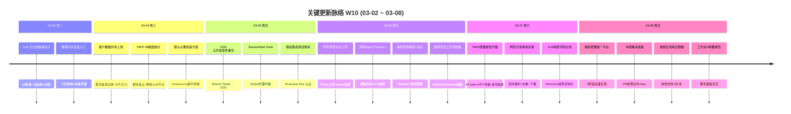

# 周报 2026-W10 (2026-03-02 ~ 2026-03-08)

> **总计 310 次提交 | 403 个文件变更 | +55,071 行 / -12,729 行 | 40 个 PR 合并 (#166 ~ #206)**
>
> **贡献者**：Claude (261 commits), InerNoro (41 commits), Cursor Agent (6 commits), inernoro (2 commits)

**本周趋势**：本周是高产出的基础设施与功能完善周。三大主线并行推进：(1) Cloud Development Suite (CDS) 从 Branch Tester 全面重写为云端开发套件；(2) 网页托管平台从书签收藏重构为完整的 HTML/ZIP 上传 + 分享体系；(3) TAPD 质量报告从 LLM 生成切换为确定性 ScriptExecutor + ECharts 可视化。同时完成了多文档知识库、缺陷管理统一平台、工作流 AI 参数填充等多个重要功能。

---

## 关键更新脉络

---

## 一、已合并 Pull Requests (#166 ~ #206)

| PR | 标题 | 分类 |
|----|------|------|
| #166 | 技能管理重设计 + 技能系统规则文档 | 🎨 UI/UX |
| #167 | 统一实验室 (Workshop Lab) 样式 | 🎨 UI/UX |
| #168 | 修复图片生成后尺寸调整 + modelId URL 编码 | 🐛 Bug 修复 |
| #169 | 系统通知附件 + TAPD common_get_info 完整数据 | ✨ 新功能 |
| #170 | 修复 TAPD 工作流空内容问题（自定义字段/URL） | 🐛 Bug 修复 |
| #173 | 修复视觉创作图片生成完成后不显示问题 | 🐛 Bug 修复 |
| #174 | 竞技场附件增强（单输入+多类型附件+完成按钮） | 🔄 更新 |
| #175 | 权限指纹缓存失效机制 | 🔐 权限 |
| #176 | 服务器权威性设计文档 + 文档目录扁平化 | 📝 文档 |
| #177 | RequestPurpose → AppCallerCode 全链路重命名 + 用户信息注入日志 | 🏗️ 架构 |
| #178 | 修复落地页背景亮度，提升内容可读性 | 🎨 UI/UX |
| #179 | Agent 权限体系补齐（竞技场独立权限 + 内置角色补全） | 🔐 权限 |
| #180 | 视频转文档逆向管线 MVP | ✨ 新功能 |
| #181 | LLM 数据管线分析 + 下载文件名扩展名修复 | 🐛 Bug 修复 |
| #182 | TAPD 缺陷采集模板调整（28 维度精确统计） | 🔄 更新 |
| #183 | 修复 TAPD 统计 JS 脚本换行符转义 | 🐛 Bug 修复 |
| #184 | 桌面端资产功能（后端统计 + StatsPanel） | 🖥️ 桌面端 |
| #185 | 账户数据共享（深拷贝 + 黑洞漩涡动效 + 引导页） | ✨ 新功能 |
| #186 | 默认用户头像兜底（nohead.png 替代拼接） | 🐛 Bug 修复 |
| #187 | 自动技能创建 + 授权集成测试重写 | ✨ 新功能 |
| #188 | 动态端口预览 + Branch Tester 部署脚本 | ✨ 新功能 |
| #189 | 开发环境搭建脚本 + dev-setup 技能合并 | 🔧 DevOps |
| #190 | CDS 环境变量面板 + Cookie 分支切换 + 快速启动 | ✨ 新功能 |
| #191 | 修复 API 模型数据调试（全平台 /models 获取） | 🐛 Bug 修复 |
| #192 | 优化头像加载（请求去重 + 懒加载 160+ 模型头像） | ⚡ 性能 |
| #193 | Branch Tester → CDS 目录重命名 | 🏗️ 架构 |
| #194 | 网页存储与分享管理功能 | ✨ 新功能 |
| #195 | PRD Agent 多文档知识库管理 | ✨ 新功能 |
| #196 | 工作流模板审查 + ScriptExecutor 文件类型适配 | 🔄 更新 |
| #197 | 修复 ZIP 上传空文件崩溃 | 🐛 Bug 修复 |
| #198 | 修复变体类型 + 测试 Fake 接口实现 | 🐛 Bug 修复 |
| #199 | 修复分享链接密码处理 + 分享页面重设计 | 🐛 Bug 修复 |
| #200 | 分享页面改进（用户名显示、自保存阻止、日志查看） | 🔄 更新 |
| #201 | 网页下载功能 + TAPD 缺陷趋势模板清理 | ✨ 新功能 |
| #202 | 视频生成每日限额 + 视觉创作场景代码生成 | ✨ 新功能 |
| #203 | 周报 Agent UI 重设计（富卡片 + 可视化层次） | 🎨 UI/UX |
| #204 | 工作流 AI 辅助参数填充（聊天面板交互） | ✨ 新功能 |
| #205 | 统一缺陷管理平台（5 阶段全面实现） | ✨ 新功能 |
| #206 | 冲突解决技能（PR 前预合并 main 分支） | ✨ 新功能 |

---

## 二、本周完成

### 1. Cloud Development Suite (CDS) — Branch Tester 全面重写为云端开发套件

> **价值**：开发者可以一键启动任意分支的预览环境，无需本地配置，极大降低代码评审和测试的门槛

- **架构重写**：从简单的 Branch Tester 重构为完整的 Cloud Development Suite
  - 动态端口预览 + 通配符域名自动分配
  - Cookie 驱动的分支切换（`/_switch/` URL）
  - Docker 镜像下拉 + 快速启动配置
- **环境管理**：自定义环境变量面板 + MongoDB/Redis 连接字符串自动合成
- **缓存优化**：NuGet/npm 缓存挂载到快速启动配置
- **开发体验**：SessionStart Hook + NuGet 代理中继，适配 Web sandbox 网络约束
- **技能整合**：合并 dev-env-debug + auto-test-debug 为统一 dev-setup 技能
- 涉及 PR：#188, #189, #190, #193

### 2. 网页托管平台 — 从书签收藏重构为 HTML/ZIP 上传托管

> **价值**：用户可直接上传 HTML/ZIP 文件并生成可分享的托管链接，替代了此前简单的书签收藏模式

- **核心功能**：HTML/ZIP 文件上传 → COS 存储 → 在线预览 + 分享链接
- **领域服务**：抽取 `IHostedSiteService` 独立领域服务
- **分享体系**：密码保护 + 一键分享 + 自保存去重 + 查看日志
- **预览增强**：iframe 实时预览缩略图 + 紧凑卡片重设计
- **资源管理**：HTML 绝对路径重写 + 「网页」分类标签
- **权限设计**：网页托管设为基础功能 + 用户隔离
- 涉及 PR：#194, #199, #200, #201

### 3. TAPD 质量报告系统升级 — 从 LLM 生成切换为确定性渲染

> **价值**：质量报告不再依赖 LLM 生成，结果确定性可控，且支持 ECharts 可视化和多月趋势对比

- **架构转型**：LLM WebpageGenerator → 确定性 ScriptExecutor (Jint JS 引擎)
- **数据增强**：28 维度精确统计 + P0/P1 明细 + 挂起/临时解决列表
- **可视化**：Chart.js → ECharts 迁移 + PPT 风格幻灯片布局
- **多月趋势**：bug trend 模式支持多月 total_count 采集
- **报告内容**：TAPD 链接 + 处理人姓名 + 逻辑归因字段 + 可编辑摘要
- **资源优化**：CDN 资源服务器端内联，解决内网无法加载外部资源
- 涉及 PR：#170, #181, #182, #183, #201

### 4. 缺陷管理统一平台 — 5 阶段全面实现

> **价值**：将分散的缺陷管理流程统一到平台中，支持项目维度管理、看板视图和统计仪表盘

- **完整实现**：项目管理对话框 + Kanban 看板视图 + 统计仪表盘
- **流程管理**：待验收流程 + 超时催办 + 10 状态（含 Verifying）
- **测试覆盖**：DefectAgentTests 25 个测试用例
- 涉及 PR：#205

### 5. PRD Agent 多文档知识库 — 多文档管理 UI 上线

> **价值**：用户可为同一个 PRD 会话关联多个补充文档，扩展知识范围

- **Admin 端**：聊天页多文档管理 UI + 文档类型系统 + 预览功能
- **Desktop 端**：KnowledgeBase 多文档管理 UI
- **数据修复**：补充文档通过绑定校验 + 单数据源统一
- 涉及 PR：#195

### 6. 工作流引擎增强 — AI 参数填充 + ScriptExecutor 实装

> **价值**：工作流胶囊配置从手动填写升级为 AI 辅助，ScriptExecutor 从桩代码升级为真实 JS 引擎

- **AI 参数填充**：打开聊天面板交互式填充胶囊配置参数
- **ScriptExecutor**：升级为 Jint 驱动的 JavaScript 引擎
- **工作流断点**：节点完成后暂停执行
- **产物增强**：胶囊输入产物持久化 + 重放能力 + 自动生成标签
- **视频生成胶囊**：`IVideoGenService` 领域服务 + VideoGeneration 胶囊类型
- 涉及 PR：#196, #204

### 7. 账户数据共享 — 深拷贝迁移 + 黑洞漩涡动效

> **价值**：管理员可将优质配置（提示词、工作区等）一键分享给其他用户

- **核心功能**：选择用户 → 选择数据类别 → 深拷贝迁移
- **UI 设计**：BlackHoleVortex 背景动效 + 卡片缩略图 + 跳转链接
- **引导体验**：首次使用引导页 + 模态对话框交互
- 涉及 PR：#185

### 8. 技能系统增强 — 自动创建 + 冲突解决 + 深度追踪

> **价值**：扩展 AI 技能矩阵，新增冲突解决技能替代手动 merge，深度追踪技能辅助复杂调试

- **自动技能创建**：从聊天消息中自动提取并创建技能
- **冲突解决技能**：PR 前预合并 main 分支，三级冲突分类
- **深度追踪技能**：跨层数据流深度追踪
- **路径追踪 + 风险矩阵**：flow-trace 和 risk-matrix 技能
- 涉及 PR：#187, #206

### 9. 视频 Agent 增强 — 场景代码生成 + 每日限额

> **价值**：视频分镜可通过 LLM 自动生成定制化 Remotion 组件，视觉创作视频生成增加合理的使用限制

- **LLM 场景代码生成**：为视频分镜生成定制化 Remotion 组件
- **视觉创作每日限额**：视觉创作视频生成每日 1 次
- **视频转文档**：逆向管线 MVP，从视频提取文档
- **TTS 语音合成**：接入 + 8 场景电影级动效升级
- 涉及 PR：#180, #202

### 10. 权限与安全加固

> **价值**：完善权限体系闭环，确保每次部署后前端权限缓存自动失效

- **权限指纹**：部署后自动失效前端菜单权限缓存
- **Agent 权限补齐**：竞技场独立权限 + 内置角色补全
- **RequestPurpose → AppCallerCode**：全链路语义重命名
- **授权测试**：集成测试重写为 AI Access Key 认证
- 涉及 PR：#175, #177, #179, #187

### 11. 周报 Agent Phase 6-7 — 模板系统 + v2.0 UI

> **价值**：周报 Agent 从基础 CRUD 升级为支持模板系统和富视觉组件的完整报告平台

- **模板系统**：Phase 6 实现
- **v2.0 UI 组件**：Phase 7 实现，富卡片 + 更好的间距 + 视觉层次
- **日志面板重设计**：聊天式输入 + 时间线 + 热力图侧边栏 + 彩色圆点时间戳
- 涉及 PR：#203

### 12. UI/UX 统一性改进

- 实验室样式统一 (#167)
- 落地页背景亮度调整 (#178)
- 默认头像兜底方案 (#186)
- 模型头像懒加载 160+ 文件 (#192)
- 玻璃卡片透明度优化 (#199)
- LLM 日志面板重设计 — pill 标签 + 进度条 + 动效

### 13. Bug 修复集合

- 视觉创作图片生成完成后不显示 (#173)
- 图片尺寸调整 modelId URL 编码 (#168)
- ZIP 上传空文件崩溃 (#197)
- 401 洪水 + Token 刷新风暴 (#192)
- 分享链接密码处理 (#199)
- Worker 轮询误触兜底错误标记 (#199)
- 批量渲染竞态条件 (#202)

---

## 三、本周数据

### 每日提交分布

| 日期 | 提交数 | 重点方向 |
|------|--------|----------|
| 03-02 (周一) | 0 | — |
| 03-03 (周二) | 19 | LLM 日志面板重设计、数据共享入口、下载文件名修复 |
| 03-04 (周三) | 83 | 账户数据共享、TAPD 28 维度统计、默认头像、多文档设计 |
| 03-05 (周四) | 41 | CDS 云开发套件重写、SessionStart Hook、授权集成测试 |
| 03-06 (周五) | 55 | 网页托管平台、周报 Agent Phase6-7、缺陷管理看板、视频生成胶囊 |
| 03-07 (周六) | 72 | TAPD 质量报告升级、网页分享完善、场景代码生成、缺陷统一平台 |
| 03-08 (周日) | 40 | 工作流 AI 参数填充、视频每日限额、冲突解决技能 |

### 提交类型分布

| 类型 | 数量 | 占比 |
|------|------|------|
| fix (Bug 修复) | 105 | 33.9% |
| feat (新功能) | 98 | 31.6% |
| Merge PR | 40 | 12.9% |
| docs (文档) | 23 | 7.4% |
| refactor (重构) | 19 | 6.1% |
| chore (杂项) | 9 | 2.9% |
| merge (非 PR 合并) | 6 | 1.9% |
| 其他 (test/revert/perf/redesign/中文) | 10 | 3.2% |

---

## 四、与上周 (W09) 对比

> ⚠️ 上周 (W09) 周报文件不存在，无法进行指标对比。以下为本周独立数据。

| 指标 | W10 |
|------|-----|
| 提交数 | 310 |
| 合并 PR 数 | 40 |
| 文件变更 | 403 |
| 净增行数 | +42,342 |

---

## 五、下周优先级建议

| 优先级 | 方向 | 建议动作 |
|--------|------|----------|
| P0 | 多文档知识库完善 | 补全「资料文件」功能，实现文档上传 + 全文检索 + RAG 集成 |
| P0 | CDS 云开发套件稳定性 | 补充自动化测试 + 异常场景处理 + 使用文档 |
| P1 | TAPD 报告体系沉淀 | 将 ScriptExecutor + ECharts 模式固化为可复用模板框架 |
| P1 | 网页托管功能迭代 | 增加版本管理、自定义域名绑定、访问统计 |
| P2 | 缺陷管理 Webhook 通知 | 对接飞书/企微 Webhook，关键缺陷自动推送 |
| P2 | 性能优化 | 关注 403 个文件 / 5.5 万行增量对构建时间的影响 |
