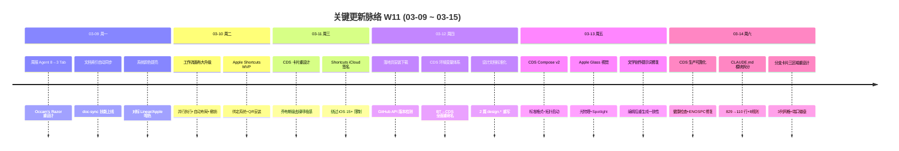

# 周报 2026-W11 (03-09 ~ 03-15)

> **总计 208 次提交 | 234 个文件变更 | +28,262 行 / -27,114 行 | 31 个 PR 合并 (#207 ~ #237)**
>
> **贡献者**：Claude (179 commits), InerNoro (27 commits), inernoro (2 commits)

**本周趋势**：延续 W10 的高密度交付节奏，但方向从"功能铺量"转向"架构深化与产品化"。三大主线并行推进：(1) CDS 从功能可用推进到生产可靠，两阶段就绪探测和 Import/Init 解决部署最后一公里；(2) 工作流引擎获得 DAG 并行执行能力，从串行管道升级为真正的编排引擎；(3) 周报 Agent 完成 Occam's Razor 产品化蜕变，8 Tab 合并为 3 Tab + 14 路数据自动采集实现零配置体验。同时 Apple Shortcuts 打通移动端内容采集入口，知识架构模块化拆分让 AI 辅助开发体系从"有技能"升级为"技能可治理"。

---

## 关键更新脉络

---

## 一、本周完成

### 1. CDS 云开发套件——从"能跑"到"能用"

> **价值**：开发团队需要并行测试多个特性分支，CDS 作为独立 Node.js 基础设施服务，将 git 分支自动转化为隔离的 Docker 容器环境。本周解决的是"部署成功但服务不可用"和"首次配置门槛高"两个阻碍实际使用的核心痛点。

- **两阶段就绪探测**（Liveness + Readiness）：进程存活检查（6秒内 3 次轮询容器状态）+ HTTP 可达探测（5 分钟超时轮询端口），消除"容器启动但服务未就绪"的假部署成功
- **Import/Init 一键引导**：解析标准 Docker Compose YAML，4 阶段编排（配置应用 → 基础设施启动 → 主分支 Worktree → 全量部署），SSE 实时进度流
- **Compose v2 标准格式**：兼容标准 docker-compose.yml，自动识别应用服务（有相对路径 volume）和基础设施服务（无相对路径），拓扑排序保证依赖启动顺序
- **ENOSPC 系列修复**：Docker 内 Node 项目 inotify 资源耗尽 → 自动增大限额 + pnpm store 隔离 + node_modules Docker 命名卷隔离
- **卡片三区域重设计**：信息区/状态区/操作区分离，3 列网格布局，端口徽章不遮挡分支名
- **BT→CDS 全面重命名**：环境变量、代码命名、文档统一从 Branch Tester 迁移到 Cloud Dev Suite

涉及 PR：#221, #223, #226, #234, #235, #236

---

### 2. 工作流引擎——获得真正的编排能力

> **价值**：工作流引擎是 MAP 的"自动化中枢"，连接数据采集、LLM 分析、报告生成等 30+ 胶囊类型。并行执行能力让多步骤管线效率倍增（如 TAPD Bug 采集 + Story 采集可同时进行），画布交互升级让复杂 DAG 的编辑从"能画"变为"好用"。

- **DAG 并行执行引擎**：BFS 拓扑排序 + `Task.WhenAll` 批量并发，`ConcurrentDictionary` 线程安全收集结果，批完成后单线程更新 DAG 状态
- **画布高级交互**：自动布局（实际节点尺寸计算对齐）、撤销/重做历史栈、连线插入节点、快捷键体系
- **ReactFlow 路由冲突根因修复**：ReactFlow 53+ zustand 订阅填满 React 调度队列，阻塞 React Router 位置变更事件——解决方案是"先卸载 ReactFlow 再导航"（`setUnmounting(true)` → `requestAnimationFrame` → `navigate()`），这是一个跨库状态管理冲突的通用解决模式
- **故障排查指南**：将 ReactFlow 案例沉淀为 `guide.troubleshooting.md`，建立问题诊断知识库

涉及 PR：#220

---

### 3. Apple Shortcuts——打通移动端内容采集入口

> **价值**：用户在抖音、微信、小红书等 App 中发现有价值内容时，需要手动复制链接 → 打开 MAP → 粘贴，流程割裂。Shortcuts 实现 iOS 任意 App 分享菜单一键收藏到 MAP，核心创新是"采集"与"处理"解耦——立即返回"已收藏"，异步触发绑定的工作流进行摘要/转录/分类。

- **三层绑定架构**：Token 绑定（独立 `scs-` 前缀，独立生命周期管理）+ 功能绑定（collect/workflow/agent 三种模式）+ 数据绑定（UserCollection 统一收藏模型）
- **QR 码安装流**：创建 → 生成 QR → 手机扫码 → 安装页引导 → 剪贴板传递配置
- **iCloud 模板方案**：iOS 15+ 拒绝未签名 .shortcut 文件 → 改用 Apple 签名的 iCloud 共享链接分发，首次运行从剪贴板读取 token 配置，后续离线可用
- **工作流异步触发**：收藏时注入 `input_url`、`input_text`、`shortcut_name`、`collection_id` 到工作流变量，后台执行不阻塞响应
- **HTTP API 天然跨平台**：`POST /api/shortcuts/collect` 可被 Android Tasker、桌面脚本等任意客户端调用

涉及 PR：#230

---

### 4. 周报 Agent——完成产品化蜕变

> **价值**：从"能用的工具"变为"零配置即有价值的产品"。Occam's Razor 重设计降低认知负荷，Phase 0 采集优先哲学确保新用户首次打开就能看到内容而非空白页。市场调研 20+ 竞品验证路线正确性，为后续迭代提供战略方向。

- **Occam's Razor (8→3 Tab)**：周报/团队/设置三个任务导向工作区，旧 Tab key 自动迁移保持向后兼容；"预览效果"按钮通过 mock 数据让用户在配置前即可体验完整功能
- **Phase 0 采集优先**：MapActivityCollector 从 6 路扩展到 14 路数据流（新增图片生成、视频生成、工作流执行、文档编辑、附件上传、网页托管等系统内生数据），AI 提示词增加"永远不要说无数据"指令
- **团队 UX 增强**：自动提交调度（按团队配置周几几点自动生成）、自定义日志标签（团队级标签词汇表）、报告可见性控制（all_members / leaders_only）
- **竞品市场调研**：分析 Steady、Geekbot、Spinach AI、飞书 AI 周报等 20+ 产品，识别 MCP Server（数据可查询化）、团队聚合摘要、音频消费等下一阶段机会

涉及 PR：#231, #237

---

### 5. 知识架构模块化——AI 辅助开发体系的治理升级

> **价值**：CLAUDE.md 从 829 行单体拆分为按 glob 触发的模块化规则，编辑 .cs 文件只加载后端规则、编辑 .tsx 只加载前端规则，token 效率和维护性同步提升。6 个技能按"渐进披露"原则重构（核心指令 vs 参考材料分层），create-skill-file 元技能建立 7 维质量评分体系，实现技能生态从"有技能"到"可治理"的转变。

- **CLAUDE.md 模块化拆分**：110 行主文件 + 8 个规则文件（app-identity / data-audit / llm-gateway / frontend-architecture / server-authority / doc-types / marketplace / codebase-snapshot），每个规则有明确的 glob 触发范围
- **技能 Anthropic 最佳实践优化**：doc-writer 592→127 行、weekly-update-summary 522→203 行、code-hygiene 400→194 行，参考材料提取到 reference/ 子目录
- **create-skill-file 元技能**：7 维评分（核心质量 25% / 简洁性 20% / 自由度 10% / 结构 15% / 工作流 15% / 示例 10% / 生态 5%），6 种反模式检测（百科全书/巨无霸文件/无出口流程/幽灵触发/嵌套引用/伪代码示例）

涉及 PR：#234（包含技能系统重构 commits）

---

### 6. 智能体-工作流联动——Agent 的能力放大器

> **价值**：打通"创建 Agent → 编排管线 → 自动执行"的完整链路。AI Toolbox 创建的智能体可直接发送到工作流执行，技能系统支持关联工作流执行模式，让工作流引擎不仅是独立工具，而是所有 Agent 的共享编排层。

- 快速创建步骤 2 重构为左右双栏布局，场景模板选择页精致化
- 工作流头像上传 + 选择器 UI 精致化
- QuickCreateWizard 工作流选择器替换为自定义下拉组件

涉及 PR：#215

---

### 7. 文档体系工程化——120+ 文档的索引不再漂移

> **价值**：doc-sync 技能将文档索引从手动维护升级为自动同步（扫描 doc/ → 重建 index.yml → 更新目录页），周报生成后自动触发。设计文档按 design.* 标准模板重写，为外部平台（语雀/Confluence）拉取 index.yml 做好联邦化准备。

- doc-sync 技能：扫描 doc/*.md 提取标题 → 重建 index.yml 单一数据源 → 同步 guide.list.directory.md 渲染视图
- 文档索引按阅读优先级重排
- 多通道适配器 + 账户数据共享设计文档按 design.* 标准模板重写

涉及 PR：#217, #219, #225

---

### 8. UI 系统性提亮——暗色主题的物理校准

> **价值**：不是表面美化，而是玻璃态设计语言在暗色主题下的系统性校准。系统颜色对标 Linear/Apple 暗色方案解决"灰蒙蒙"观感，Dialog 亚像素模糊修复解决 CSS `backdrop-filter` 与 `transform` 叠加导致的文字渲染问题。

- 系统颜色提亮：暗色方案对标 Linear/Apple 的明度和饱和度标准
- Dialog 模糊修复：`inset:0 + margin:auto` 替代 `translate(-50%, -50%)`，消除 transform 引发的亚像素偏移
- Dialog 背景改为硬编码高不透明度实底，替代 CSS 变量方案
- 排行榜进度条缩放逻辑修复 + 数字移至进度条上方
- UserAvatar 统一组件 + inline SVG 默认头像

涉及 PR：#216, #228

---

### 9. Apple Glass 视觉体系——有物理规则的交互反馈

> **价值**：基于光学物理的交互反馈系统，而非装饰性动效。6 级玻璃预设按功能层级分配模糊度和透明度，Quality/Performance 双模式确保低端设备可用。Spotlight 径向光跟随鼠标移动，赋予卡片物理存在感。

- 苹果风格玻璃物理效果：6 级预设（Panel 40px / Bar 40px / Sidebar 40px / Toolbar 16px / Tooltip 12px / MobileHeader 40px）
- Spotlight 工具卡片：径向渐变光源跟随鼠标位置，400px 光圈 + 40% 衰减
- 地图应用图标集成
- Performance 模式：CSS `!important` 剥离 `backdrop-filter`，回退纯色背景

涉及 PR：#233

---

### 10. 数据共享增强——组织知识流转效率

> **价值**：团队规模增长后"在 100 人列表中找人"的效率问题，以及人员变动带来的知识流失问题。可搜索选择器 + 批量操作降低操作成本，工作区卡片重设计增强数据资产可浏览性。

- 可搜索用户选择器：固定搜索框 + 富用户信息展示
- 批量删除用户功能
- 工作区卡片重设计：清晰边界 + 更好布局

涉及 PR：#218

---

### 11. 视频工作流管线

> **价值**：让视频 Agent 的能力可被工作流编排调用，形成"URL → 解析 → 分镜 → 渲染"的全自动管线。

- 短视频一键解析工作流模板
- `resolveAdminAppName` 路由→应用身份映射补全（video-agent、workflow-agent 等）

涉及 PR：#232

---

### 12. 落地页安装下载

> **价值**：解决桌面端分发的"用户找不到安装包"问题，GitHub API 运行时检测确保版本信息始终最新。

- 安装器下载区 + GitHub API 运行时版本检测
- TypewriterText 替代 DecryptedText + release 缓存优化首屏性能
- 直接下载链接替代重定向

涉及 PR：#227

---

### 13. Bug 修复集

- **文学创作旧提示词**：编辑文本卡后重新生成图片仍使用旧提示词——数据一致性问题 (#229)
- **Agent 封面兜底**：封面图加载失败时回退默认渐变——容错增强 (#222)
- **分享页匿名用户**：已登录用户在分享页面显示为匿名访客——权限边界问题 (#214)
- **移动端首页不可点击**：触摸事件冒泡 + 个人中心导航错误——移动端可用性 (#213)
- **Docker 只读文件系统**：VideoGen 在 read_only 容器中写文件失败 (#209)

---

### 14. 工程基础设施

- 周报技能增加 4 条核心纪律（PR 范围连续性、深读 commit、脉络确认、文件命名）(#207, #208)
- 网页托管 QR 码复用已有分享链接而非每次新建 (#210)
- 文档类型体系 11→6 前缀精简 + doc-writer 技能 (#211)
- 自动化工作流集成 3 个新胶囊（event-trigger、site-publisher、email-sender）(#212)
- README 英文重写 + CDS 章节 + 根目录清理 (#224)

---

## 二、本周数据

### 每日提交分布

| 日期 | 提交数 | 重点方向 |
|------|--------|----------|
| 03-09 (周一) | 36 | 周报 Agent 8→3 Tab 重设计、doc-sync 技能、系统颜色提亮、数据共享增强 |
| 03-10 (周二) | 17 | 工作流画布并行执行+高级交互、Apple Shortcuts MVP |
| 03-11 (周三) | 20 | CDS 卡片乔布斯级重设计、Shortcuts iCloud 签名方案 |
| 03-12 (周四) | 45 | 落地页安装下载、CDS 环境变量 BT→CDS 重命名、设计文档标准化、README 重写 |
| 03-13 (周五) | 20 | CDS Compose v2 标准格式、Apple Glass 视觉、文学创作提示词修复 |
| 03-14 (周六) | 48 | CDS 生产可靠化（健康检查+ENOSPC）、CLAUDE.md 模块拆分、分支卡片三区域重设计 |
| 03-15 (周日) | 22 | 周报 Agent 团队 UX 改进、CDS 部署样式修复、周报模板更新 |

### 提交类型分布

| 类型 | 数量 | 占比 |
|------|------|------|
| fix (Bug 修复) | 91 | 43.8% |
| feat (新功能) | 41 | 19.7% |
| Merge PR | 29 | 13.9% |
| refactor (重构) | 23 | 11.1% |
| docs (文档) | 7 | 3.4% |
| cleanup/chore/perf | 5 | 2.4% |
| 其他 (redesign/polish/debug/rename/revert) | 12 | 5.7% |

---

## 三、与上周 (W10) 对比

| 指标 | W10 | W11 | 变化 |
|------|-----|-----|------|
| 提交数 | 312 | 208 | -33% |
| 合并 PR 数 | 44 | 31 | -13 |
| 文件变更 | 406 | 234 | -42% |
| 净增行数 | +43,049 | +1,148 | -97% |

### 上周方向落地情况

| W10 建议方向 | W11 实际进展 |
|-------------|-------------|
| P0 知识库 RAG 集成 | ❌ 本周未涉及，连续三周半成品状态 |
| P0 CDS 稳定性验证 | ✅ 两阶段就绪探测 + ENOSPC 修复 + 健康检查，从"能跑"推进到"能用" |
| P1 工作流模板固化 | ⚠️ 新增视频工作流模板 + 质量月报模板，但框架级模板系统未启动 |
| P1 缺陷管理 Webhook | ❌ 本周未涉及 |
| P2 移动端 QA | ⚠️ 移动端首页点击修复 + CDS 移动端响应式，但未做系统性 QA |
| P2 网页托管迭代 | ⚠️ QR 码复用分享链接、site-publisher 胶囊，但版本管理/访问统计未启动 |

---

## 四、下周优先级建议

| 优先级 | 方向 | 建议动作 |
|--------|------|----------|
| P0 | 知识库 RAG 集成 | 连续三周未推进，多文档 UI 已就绪，补全向量索引 + 文档上传 + 对话引用 |
| P0 | CDS 实际使用验证 | 稳定性基础已就绪，需要用真实项目跑通 Import/Init → 多分支并行 → 代理路由全流程 |
| P1 | 周报 Agent Phase 1 | 团队聚合摘要（1 份管理者简报替代 N 份个人周报）+ MCP Server 数据可查询化 |
| P1 | Apple Shortcuts Phase 2 | Agent 绑定模式实现 + 收藏管理 UI + 跨平台客户端适配（Android Tasker） |
| P2 | 缺陷管理 Webhook | 对接飞书/企微，关键缺陷自动推送，连续两周未涉及 |
| P2 | 移动端系统性 QA | 连续四周未做系统性测试，技术债务持续积累 |

---

## 附录：已合并 Pull Requests (#207 ~ #237)

| PR | 标题 | 分类 |
|----|------|------|
| #207 | 生成 W10 周报 | 📝 文档 |
| #208 | 重写 W10 周报 + 周报技能纪律增强 | 📝 文档 |
| #209 | VideoGen Docker 只读文件系统修复 | 🐛 修复 |
| #210 | 网页托管 QR 码复用分享链接 | ✨ 增强 |
| #211 | 文档类型标准化 + doc-writer 技能 | 🏗️ 基础设施 |
| #212 | 自动化工作流集成（event-trigger/site-publisher/email-sender） | ✨ 新功能 |
| #213 | 移动端首页点击修复 + 个人中心导航 | 🐛 修复 |
| #214 | 分享页匿名用户身份修复 | 🐛 修复 |
| #215 | 智能体-工作流联动 + AI Toolbox 精致化 | ✨ 新功能 |
| #216 | 系统颜色提亮 + Dialog 模糊修复 | 🎨 UI/UX |
| #217 | doc-sync 技能 + 文档索引机制 | 🏗️ 基础设施 |
| #218 | 数据共享可搜索用户选择器 + 批量删除 | ✨ 增强 |
| #219 | 文档索引按阅读优先级重排 | 📝 文档 |
| #220 | 工作流画布大升级（并行执行+自动布局+路由修复） | ✨ 新功能 |
| #221 | CDS 部署规划文档 | 📝 文档 |
| #222 | Agent 封面图加载失败兜底 | 🐛 修复 |
| #223 | CDS 全面 UI 迭代（35 commits，卡片重设计+移动端+标签系统） | ✨ 增强 |
| #224 | README 英文重写 + 根目录清理 | 📝 文档 |
| #225 | 设计文档标准化重写（多通道适配器+数据共享） | 📝 文档 |
| #226 | CDS 环境变量文档 + BT→CDS 重命名 | 🔄 重构 |
| #227 | 落地页安装器下载 + GitHub API 版本检测 | ✨ 新功能 |
| #228 | 排行榜修复 + UserAvatar 统一组件 | 🐛 修复 |
| #229 | 文学创作编辑后重生成旧提示词修复 | 🐛 修复 |
| #230 | Apple Shortcuts 集成（绑定系统+QR安装+iCloud模板） | ✨ 新功能 |
| #231 | 周报 Agent 市场调研 + Phase 0 + Occam's Razor 重设计 | ✨ 新功能 |
| #232 | 短视频一键解析工作流管线 | ✨ 新功能 |
| #233 | Apple Glass 视觉体系 + Spotlight 工具卡片 | 🎨 UI/UX |
| #234 | CDS 生产可靠化（Import/Init+健康检查+ENOSPC+技能系统重构） | ✨ 增强 |
| #235 | CDS 纯功能 SRS + 架构文档精炼 | 📝 文档 |
| #236 | CDS 分支卡片三区域重设计 | 🎨 UI/UX |
| #237 | 周报 Agent 团队周报 UX 改进 | ✨ 增强 |
