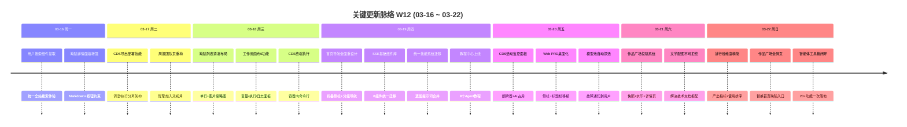

# 周报 2026-W12 (2026-03-16 ~ 2026-03-22)

> **总计 503 次提交 | 431 个文件变更 | +50,893 行 / -9,647 行 | 68 个 PR 合并 (#238 ~ #310)**
>
> **贡献者**：Claude (360 commits), InerNoro (88 commits), Cursor Agent (50 commits), RuXiuWEi (5 commits)

**本周趋势**：本周交付量达到项目历史峰值（503 commits / 68 PRs），较 W11 翻倍增长。三条主线并行爆发：(1) CDS 从"能部署"升级为"能监控+能自愈"的完整 DevOps 平台，14 个 PR 覆盖自动更新、AI 活动监控、SSE 日志流、容器状态推送和部署流水线技能；(2) 产品体验全面重塑——作品广场从零到一上线投稿/展示/点赞完整闭环，首页和导航彻底重新设计，教程中心覆盖 9 个 Agent；(3) 底层架构深度治理——遗留提示词系统统一迁移到技能系统，SSE 基础组件库收敛 6 个组件的实时通信代码，用户角色体系扩展到 12 个角色并引入涟漪审计规则。同时自定义智能体工具箱完成完整聊天闭环，周报 Agent 实现团队管理双视角和 AI 可配生成，缺陷管理 AI 评分接入流式推送。

---

## 关键更新脉络

---

## 一、本周完成

### 1. CDS 平台全面升级 — 从部署工具进化为完整 DevOps 平台

> **价值**：开发团队在多分支并行开发时，不仅需要一键部署，还需要实时监控容器状态、快速定位错误、自动接收更新。CDS 本周从"能用"升级为"好用"，减少人工 SSH 排查的时间。

- **自动更新小组件**：proxy 动态注入前端零侵入，分支可输入 combobox，"清理未托管分支"一键清理 (#280)
- **AI 活动监控面板**：翻牌器实时滚动、AI 占用指示器、中文标签 + AI Badge、详情页 IP/UA/Referer 诊断 (#293, #296)
- **容器状态推送**：服务器权威状态推送替代前端轮询，状态圆点 + commit SHA + commit message (#293)
- **SSE 日志流**：实时日志流替代轮询 + pnpm 缓存路径隔离 + 动态项目级缓存 (#293)
- **部署流水线技能**：跨服务器 API 驱动生命周期管理 (部署/观测/诊断/操作/验证/清理) (#291)
- **终端执行**：日志弹窗新增终端 Tab，支持容器内命令行执行 (#255)
- **导出部署技能 + 调度架构**：Scheduler/Executor 分离 + 闪烁拉取图标 + 蓝色边框新卡片 (#252)
- **启动信号与容量检查**：就绪探测 + 容量预警 + 孤儿分支清理 + 停止动画 (#267)
- **亮色主题 + 水波纹**：ClawHub 暖色方案 + View Transition API 主题切换 (#265)
- **错误诊断 UX**：一键复制错误给大模型排错、服务错误状态标红、友好提示替代 Docker 错误 (#280)
- **稳定性修复**：502 间歇错误修复、ETag 禁用消除误导 304、分支名 slug 解析修复 (#285, #290, #295)

涉及 PR：#252, #255, #260, #265, #267, #280, #282, #285, #290, #291, #293, #295, #296, #310

### 2. 作品广场从零到一 — 完整的投稿展示与社交互动系统

> **价值**：用户创作的文学配图作品有了公共展示舞台，投稿→展示→点赞→详情→Fork 水印的完整闭环让创作成果可被发现和欣赏。

- **投稿系统**：手动投稿/撤回按钮、自动投稿 toggle、公开 workspace 模式、封面图动态获取 (#299)
- **GenerationSnapshot 快照**：完整输入配方持久化（水印/参考图/系统提示词），Fallback 路径全量覆盖 (#299)
- **展示与互动**：瀑布流布局、详情弹窗、viewCount 统计、心型点赞特效组件 (#299, #301)
- **水印快照 Tab**：投稿详情展示完整水印配置 + 从快照一键 Fork 水印 (#299, #307)
- **独立全屏页面**：作品广场从首页内嵌改为独立路由页面 (#309)
- **文学创作配合**：配图提示词增加不可拒绝约束、COS 上传超时提升到 120s、仅展示当前版本配图 (#299, #303)

涉及 PR：#299, #301, #303, #307, #309

### 3. 周报 Agent 产品化闭环 — 团队协作与 AI 辅助写作完整落地

> **价值**：周报从"个人填写"升级为"团队协作平台"——管理者有汇总视图和打回机制，成员有 AI 辅助草稿和标签管理，评论区有点赞和打回理由，整个流程形成闭环。

- **团队页双视角重构**：管理/加入分离，团队汇总权限视图，成员抽屉聚焦增删 (#253)
- **AI 生成与 Prompt 配置**：接入个人 Prompt 配置、可配 AI 汇总 Prompt、生成信息展示增强 (#259)
- **富文本编辑**：粘贴图片支持、COS 上传认证、编辑模式预览渲染 (#253)
- **点赞与打回**：周报点赞能力、管理员打回并强制填写原因、作者审阅前可修订删除 (#253)
- **日常记录标签**：自定义打点标签迁移到日常记录页、统一多选 + 提交前必选校验 (#259)
- **评论改进**：评论输入框就地展开、匿名显示修复、评论查看态视觉优化 (#253, #259)

涉及 PR：#238, #239, #246, #250, #253, #259, #288

### 4. 自定义智能体工具箱 — 20+ 功能一次落地的完整聊天体验

> **价值**：自定义智能体从"能对话"升级为功能完备的 AI 助手——多格式文件上传、视觉理解、会话管理、分享协作，用户可以将任意 Agent 当作全功能 ChatGPT 使用。

- **核心聊天**：多轮对话、图片附件 + 视觉多模态、语法高亮 + LaTeX + XSS 防护 (#297)
- **消息操作**：重生成(不丢附件)、编辑回填、导出、清空、字符计数、反馈按钮 (#297)
- **会话管理**：搜索、排序、归档、置顶/收藏、标题自动更新、会话重命名 (#297)
- **高级功能**：thinking 过程展示、Token 消耗展示、分享链接、快捷方式、Prompt 查看 (#297)
- **多格式文件**：PDF/Word/Excel/PPT 上传支持、知识库上传按钮修复 (#275)
- **内置 Agent Fork**：从内置 Agent 一键 fork 为自定义智能体 (#297)

涉及 PR：#275, #297

### 5. 缺陷管理深度增强 — AI 评分流式化 + 外部 Agent 协作

> **价值**：缺陷管理从"记录问题"升级为"AI 辅助解决问题"——AI 评分过程实时可见，外部 Agent 可通过开放平台认证分析缺陷，严重等级体系完善让分级更精准。

- **AI 评分 SSE 流式**：实时展示评分过程替代空白等待，SSE 基础组件库统一实现 (#284)
- **外部 Agent 分析**：缺陷分享给外部 Agent + 开放平台认证 + AI 评论系统 (#262, #284)
- **桌面端双视图**：卡片 + 列表视图切换、缺陷 ID 和图片缩略图、Lightbox 复制图片 (#244)
- **列表紧凑布局**：单行布局 + 图片预览缩略图、默认列表模式、surface-inset 统一样式 (#264)
- **严重等级体系**：新增 Trivial 等级、严重程度可编辑下拉、测试断言同步 (#307, #308, #310)
- **AiScoreWatchdog**：新增后台服务自动检测并标记超时的 AI 评分任务为失败 (#307)
- **其他修复**：权限校验、水印预览自愈重新渲染、评论区 Markdown 渲染、清理上下文后消息过滤 (#283, #307)

涉及 PR：#244, #262, #264, #283, #284, #307, #308, #310

### 6. 首页与导航大改版 — 全新视觉体验与内容发现架构

> **价值**：用户进入系统后的第一印象和导航效率直接影响使用体验。全宽布局、折叠侧栏、教程中心让新用户快速上手，Agent 悬停视频让功能一目了然。

- **欢迎页全宽重设计**：Hero 背景图、自动填充网格、Arc 风格图标 Dock、快捷链接折叠 (#261)
- **侧栏永久折叠导航**：分组菜单结构、图标下短文字标签、42×42 圆角选中态、Logo 顶部 + 用户下置 (#261)
- **教程中心**：9 个 Agent 完整教程、教程详情页架构、首页教程区域、/tutorials 独立路由 (#300)
- **Agent 卡片悬停视频**：hover 时自动播放 Agent 介绍视频 (#292)
- **默认路由修复**：未登录访问根路径跳转公开首页，退出登录跳转登录页 (#305)
- **Favicon + 导航修复**：Favicon 破图修复、海鲜市场路由回归 AppShell、通知按钮交互反馈 (#266)

涉及 PR：#261, #266, #292, #300, #305

### 7. 统一技能系统迁移 — 遗留提示词系统清理与新技能扩展

> **价值**：三套并行的提示词管理（PromptStages / SystemPrompts / LiteraryPrompts）统一为 Skills，消除维护负担和用户认知成本，同时 SKILL.md 格式让技能可跨平台导入导出。

- **系统迁移**：PromptStagesPage 废弃合入 SkillsPage、IPromptService → ISkillService、migration key 清理 (#286)
- **SKILL.md 格式**：跨平台导入导出 + 桌面端多轮对话存为技能 (#286)
- **新增技能**：需求验证 /validate (#269)、预览地址 /preview (#271)、主题切换 /theme-transition (#273)
- **Changelog Fragments 机制**：碎片文件消除多分支 CHANGELOG.md 合并冲突 (#274)

涉及 PR：#269, #271, #273, #274, #286

### 8. SSE 实时响应基础设施 — 统一流式通信与体验优化

> **价值**：SSE 组件从各自为政收敛为统一基础库，消除重复代码的同时将流式延迟从 650ms 降至 100ms，乐观 UI 让用户感知"AI 秒回"。

- **SSE 基础组件库**：useSseStream + connectSse 基础组件 + llm-visibility 审计技能 (#284)
- **6 组件迁移**：ExecutionDetailPanel、ArenaPage 等统一迁移到基础组件 (#284)
- **延迟优化**：SSE 轮询间隔 650ms → 100ms、Channel 订阅先于 Mongo replay 消除事件丢失 (#268)
- **乐观 UI**：消息发送后即时显示 AI 思考动画、防闪烁和重复消息 (#268)
- **连接探测**：Store 回归测试覆盖同步竞态和连接探测 (#268)

涉及 PR：#268, #284

### 9. 用户体系与管理增强 — 角色扩展与运营工具

> **价值**：8 个新业务角色让权限分配更精细，用户管理表格和一键过期功能让管理员运营效率翻倍，涟漪审计规则防止枚举扩展时的全栈遗漏。

- **角色扩展**：新增行政/财务/研发/测试/文案/客成经理/客服/销售 8 个业务角色，新建 roleConfig.ts 统一角色元数据（中文标签、专属图标、颜色），消除角色颜色定义散落 (#298)
- **涟漪审计规则**：枚举/常量扩展时 6 层全栈审计清单，防止类型定义、映射表、硬编码列表遗漏 (#298)
- **用户管理表格**：列表改为表格布局 + 统计信息列 (#287)
- **一键过期**：强制全员重新登录 + 弹窗引导下载桌面端 (#306)
- **日志中文化**：系统日志显示用户名和应用中文名、筛选栏拆分为双 GlassCard (#258)
- **禁用账号提示**：显示"账号已被禁用"替代"用户名或密码错误" (#241)
- **图片预览修复**：弹窗层级 z-index 修复、幽灵层清理、下载弹窗文字重叠修复 (#306)

涉及 PR：#241, #242, #258, #279, #287, #298, #306

### 10. Web PRD Agent 桌面化 — 统一跨端体验

> **价值**：Web 端 PRD Agent 获得与桌面端一致的侧栏 + 标题栏布局，用户在两个端的操作体验趋于统一。

- 移植桌面端侧栏 + 标题栏布局到 Web (#294)
- PRD 预览 Markdown 渲染与桌面端对齐 (#294)
- TOC 目录修复 + 全平台操作指南文档 (#294)

涉及 PR：#294

### 11. 模型池故障自愈 — 自动探活与通知

> **价值**：模型故障时自动探活恢复，受影响用户收到个性化通知，减少人工干预和用户投诉。

- 模型池自动探活 + 快捷配置 (#277)
- 模型恢复时向受影响用户发送个人恢复通知 (#277)
- AppCallerCode 注册表强制校验 + 启动时自动同步 (#281)

涉及 PR：#277, #281

### 12. Safari 兼容性专项 — 6 类 CSS 问题批量修复

> **价值**：Safari 用户不再遇到弹窗显示不全、发光效果裁剪、渐变色失效等视觉问题。

- Dialog 改用 flex 居中修复显示不全 (#272)
- backdrop-filter / conic-gradient / @property / inset 兼容性处理 (#272)
- 配图卡片 Safari 降级改用 box-shadow 发光边框 (#272)

涉及 PR：#272

### 13. 桌面客户端体验优化 — 静默更新与加速下载

> **价值**：桌面端更新体验从"手动检查+慢速下载"升级为"静默后台+极速分发"，用户无感知完成版本更新。

- 静默更新 + 动态域名配置 + 默认域名替换 (#263)
- COS 缓存加速下载 + 3s 超时回退 GitHub + "极速下载"标签 (#270)
- 主题切换升级为 View Transition API 水波纹动效 (#273)

涉及 PR：#263, #270, #273

### 14. 工作流画布增强 — 编辑器功能集成与创建优化

> **价值**：工作流画布从"能画"升级为"能调试"——变量管理、执行按钮、日志面板让工作流开发体验更完整。

- 6 项编辑器功能集成：变量对话框、执行按钮、自动布局修复、执行日志面板、操作指南 (#254)
- 创建工作流后自动跳转到画布编辑 (#276)

涉及 PR：#254, #276

### 15. 排行榜维度重构 — 指标精简与产出导向

> **价值**：排行榜从堆砌维度转向聚焦产出，移除 5 个低价值维度（消息/会话/群组/开放/对话），新增 5 个产出维度（图片生成/工作流/竞技场/周报/视频），卡片按使用人数排序让热门维度优先展示。

- 移除冗余维度 + 新增产出指标 (#310)
- 综合排行榜进度条分母封顶 30 天、维度排行榜改为相对比例渲染 (#310)

涉及 PR：#310

### 16. 其他改进

- **群组管理**：解散/退出/添加成员/系统消息 (#247)
- **百宝箱**：卡片自适应列数 + 封面图补全 + 作者信息 (#278)
- **模型实验室**：API URL 相对路径修复 (#289)
- **文档技能评测**：4 个文档技能安装 + 对比评测报告 (#245)

---

## 二、本周数据

### 每日提交分布

| 日期 | 提交数 | 重点方向 |
|------|--------|----------|
| 03-16 (周一) | 26 | UserSearchSelect 公共组件提取、缺陷详情面板 Markdown 渲染 |
| 03-17 (周二) | 43 | CDS 导出部署技能+调度架构、周报团队页双视角重构 |
| 03-18 (周三) | 71 | 缺陷列表紧凑布局、工作流画布 6 功能集成、CDS 终端执行 |
| 03-19 (周四) | 162 | 首页+侧栏导航全面重设计、SSE 基础组件库、统一技能系统迁移、教程中心 |
| 03-20 (周五) | 74 | CDS AI 活动监控面板、Web PRD 桌面化、模型池自动探活 |
| 03-21 (周六) | 54 | 作品广场投稿系统、COS 上传超时提升、文学配图不可拒绝约束 |
| 03-22 (周日) | 72 | 排行榜维度精简+产出指标、缺陷严重等级、作品广场独立全屏页 |

### 提交类型分布

| 类型 | 数量 | 占比 |
|------|------|------|
| fix (Bug 修复) | 188 | 37.4% |
| feat (新功能) | 128 | 25.4% |
| Merge | 84 | 16.7% |
| chore (杂务) | 29 | 5.8% |
| refactor (重构) | 20 | 4.0% |
| docs (文档) | 15 | 3.0% |
| test (测试) | 2 | 0.4% |
| perf (性能) | 1 | 0.2% |
| 中文 commit / 无前缀 | 36 | 7.2% |

---

## 三、与上周 (W11) 对比

| 指标 | W11 | W12 | 变化 |
|------|-----|-----|------|
| 提交数 | 208 | 503 | +142% |
| 合并 PR 数 | 31 | 68 | +37 |
| 文件变更 | 234 | 431 | +84% |
| 净增行数 | +1,148 | +41,246 | +3,493% |

### 上周方向落地情况

| W11 建议方向 | W12 实际进展 |
|--------------|-------------|
| P0 知识库 RAG 集成 | ⚠️ PR #275 实现多格式文件支持 (PDF/Word/Excel/PPT)，但向量索引和对话引用仍未推进 |
| P0 CDS 实际使用验证 | ✅ 14 个 PR 深度验证并大幅增强：自动更新、活动监控、SSE 日志流、部署流水线、容器状态推送 |
| P1 周报 Agent Phase 1 | ✅ 超额完成：团队汇总视图、AI 可配生成、打回机制、富文本编辑、点赞评论完整闭环 |
| P1 Apple Shortcuts Phase 2 | ⚠️ PR #291 实现从快捷指令自动提取视频 URL，但 Agent 绑定和收藏管理未推进 |
| P2 缺陷管理 Webhook | ❌ Webhook 对接未推进，但缺陷管理获得 AI 评分流式化和外部 Agent 协作能力 |
| P2 移动端系统性 QA | ⚠️ PR #272 批量修复 Safari 6 类兼容性问题，但尚未进行系统性移动端测试 |

---

## 四、下周优先级建议

| 优先级 | 方向 | 建议动作 |
|--------|------|----------|
| P0 | 知识库 RAG 集成 | 连续四周未实质推进，多格式文件上传已就绪，补全向量索引 + 文档检索 + 对话引用 |
| P0 | 产品质量收敛 | 本周 68 PR 大量新功能上线，fix 占比 37.4% 说明质量债务在积累，需专项回归测试 |
| P1 | CDS 生产环境稳定性 | 功能已非常丰富，需要在真实多团队场景下长时间运行验证稳定性和资源占用 |
| P1 | 作品广场社交功能 | 基础展示已完成，可补充评论、收藏、推荐算法等社交互动能力 |
| P2 | 缺陷管理 Webhook | 连续三周未推进，对接飞书/企微关键缺陷自动推送 |
| P2 | 移动端系统性 QA | Safari 专项已修复，但 Android/响应式布局仍需系统性测试 |

---

## 附录：已合并 Pull Requests (#238 ~ #310)

| PR | 标题 | 分类 |
|----|------|------|
| #238 | 周报整理与 W11 周报生成 | 📝 文档 |
| #239 | 周报功能完整操作指南 | 📝 文档 |
| #240 | CDS 端口冲突修复 (仅杀 CDS 进程) | 🐛 修复 |
| #241 | 禁用账号友好错误提示 | 🐛 修复 |
| #242 | LLM 日志补全 UserId 和上下文字段 | 🐛 修复 |
| #243 | 配图标记批量修改尺寸 + 尺寸持久化 | ✨ 新功能 |
| #244 | 缺陷管理桌面端卡片+列表双视图 | ✨ 新功能 |
| #245 | 4 个文档技能安装与评测报告 | 📝 文档 |
| #246 | 周报两个 Bug 修复 | 🐛 修复 |
| #247 | 群组管理 — 解散/退出/成员/系统消息 | ✨ 新功能 |
| #250 | 周报周视图重设计，聚焦周报浏览 | 🔄 更新 |
| #252 | CDS 导出部署技能 + 调度/执行分离架构 | ✨ 新功能 |
| #253 | 周报团队页重构 + 富文本 + 点赞 + 打回 | ✨ 新功能 |
| #254 | 工作流画布 6 项编辑器功能集成 | ✨ 新功能 |
| #255 | CDS 终端 Tab 容器内命令执行 | ✨ 新功能 |
| #256 | 图片尺寸适配优先同档位匹配 | 🐛 修复 |
| #258 | 系统日志筛选 UI + UserSearchSelect 公共组件 | 🔄 更新 |
| #259 | 周报 AI 生成 + 数据源 + Prompt 配置 | ✨ 新功能 |
| #260 | CDS 状态栏移除 + 亮色模式切换 | 🔄 更新 |
| #261 | 首页 + 侧栏导航全面重设计 | 🎨 UI/UX |
| #262 | 缺陷分享外部 Agent 分析 + 开放平台认证 | ✨ 新功能 |
| #263 | 桌面端静默更新 + 动态域名配置 | ✨ 新功能 |
| #264 | 缺陷列表单行紧凑布局 + 图片缩略图 | 🎨 UI/UX |
| #265 | CDS 亮色主题 + 容量检查 + 水波纹动效 | ✨ 新功能 |
| #266 | Favicon 修复 + 侧栏导航圆角矩形统一 | 🐛 修复 |
| #267 | CDS 启动信号 + 孤儿分支清理 + 部署日志 | ✨ 新功能 |
| #268 | SSE 延迟优化 650→100ms + 乐观 UI 动画 | ⚡ 性能 |
| #269 | 需求验证技能 (/validate) | ✨ 新功能 |
| #270 | 桌面更新 COS 加速 + 3s 超时回退 GitHub | ⚡ 性能 |
| #271 | 预览地址技能 (/preview) | ✨ 新功能 |
| #272 | Safari 6 类 CSS 兼容性批量修复 | 🐛 修复 |
| #273 | 桌面端主题切换 View Transition 水波纹 | 🎨 UI/UX |
| #274 | Changelog Fragments 机制消除合并冲突 | 🏗️ 架构 |
| #275 | 自定义智能体多格式文件支持 (PDF/Word/Excel/PPT) | ✨ 新功能 |
| #276 | 工作流创建后自动跳转画布 | 🔄 更新 |
| #277 | 模型池自动探活 + 故障通知到用户 | ✨ 新功能 |
| #278 | 百宝箱卡片自适应 + 封面图补全 | 🐛 修复 |
| #279 | 日志补充用户信息字段 | 🔄 更新 |
| #280 | CDS 自动更新小组件 (proxy 注入 + combobox) | ✨ 新功能 |
| #281 | AppCallerCode 注册强制校验 + 启动同步 | 🐛 修复 |
| #282 | CDS 分支彩色标记 + Widget API 修复 | ✨ 新功能 |
| #283 | 缺陷管理权限校验 + 严重程度编辑修复 | 🐛 修复 |
| #284 | 缺陷 AI 评分 SSE 流式 + SSE 基础组件库 | ✨ 新功能 |
| #285 | CDS 分支名 slug 解析修复 | 🐛 修复 |
| #286 | 统一技能系统迁移 + SKILL.md 导入导出 | 🏗️ 架构 |
| #287 | 用户列表表格布局 + 统计信息列 | ✨ 新功能 |
| #288 | 周报完整操作指南重写 | 📝 文档 |
| #289 | 模型实验室 API URL 相对路径修复 | 🐛 修复 |
| #290 | CDS 502 间歇错误 + 主题切换皮肤修复 | 🐛 修复 |
| #291 | CDS AI 部署流水线技能 + API 活动监控 | ✨ 新功能 |
| #292 | Agent 卡片悬停视频自动播放 | ✨ 新功能 |
| #293 | CDS 活动监控面板 + 容器状态推送 + SSE 日志 | ✨ 新功能 |
| #294 | Web PRD Agent 桌面化布局 + 预览对齐 | ✨ 新功能 |
| #295 | CDS 系统状态接口描述修正 | 🐛 修复 |
| #296 | CDS SSE 心跳防 524 + 分支来源显示 | 🐛 修复 |
| #297 | 自定义智能体工具箱完整聊天闭环 (20+ 功能) | ✨ 新功能 |
| #298 | 用户角色扩展 8 个新角色 + 涟漪审计规则 | ✨ 新功能 |
| #299 | 作品广场完整投稿展示系统 | ✨ 新功能 |
| #300 | 教程中心 + 9 个 Agent 教程 + /tutorials 路由 | ✨ 新功能 |
| #301 | 心型点赞按钮动画修复 | 🐛 修复 |
| #302 | CI TypeScript 编译错误修复 | 🐛 修复 |
| #303 | 文学创作仅展示当前版本配图 | 🐛 修复 |
| #305 | 默认路由逻辑修复 (未登录→首页/退出→登录) | 🐛 修复 |
| #306 | 图片预览层级修复 + 用户一键过期功能 | ✨ 新功能 |
| #307 | 水印预览 COS URL + 评论 Markdown + 5 项修复 | 🐛 修复 |
| #308 | CI 测试断言修复 (Trivial 严重等级) | 🐛 修复 |
| #309 | 作品广场独立全屏页面 | ✨ 新功能 |
| #310 | 排行榜维度精简 + 产出指标 + 缺陷严重等级 | 🔄 更新 |
