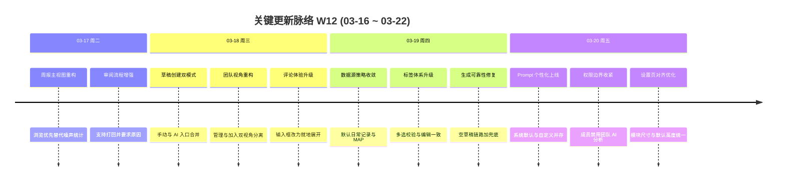

# 周报 2026-W12 (03-16 ~ 03-22)

> **统计口径说明**：本报告仅统计「周报 Agent 相关」改动（前后端周报模块、周报服务、周报文档与调用链相关修复）。
>
> **总计 46 次提交 | 26 个文件变更 | +5,786 行 / -2,117 行 | 5 个相关 PR 合并（#246, #250, #253, #279, #281）**
>
> **贡献者**：Cursor Agent (44 commits), Claude (2 commits)

**本周趋势**：周报 Agent 从“功能可用”进一步推进到“链路稳定可交付”。上半周集中在团队页与编辑体验重构，下半周重点解决 AI 生成空草稿、失败无感知、数据源与 Prompt 配置分散等问题，最终形成“数据源开关 + 生效 Prompt + 模板约束 + 失败兜底 + 模型标识回显”的闭环链路。

---

## 关键更新脉络

---

## 一、本周完成

### 1. AI 生成链路闭环化 — 从“能调模型”到“能稳定出稿”

> **价值**：用户最关心的是“点了 AI 生成就要有可用草稿”，本周把成功路径、失败路径和兜底路径打通，显著降低“看起来成功但内容为空”的风险。

- 创建周报支持 `manual / ai-draft` 双模式，AI 入口可直接生成草稿并保持 Draft 状态
- 修复“AI 生成成功但未更新”的伪成功链路，空结果不再覆盖已有内容
- 新增规则兜底生成：当 LLM 失败、空响应或解析失败时仍能产出可审阅草稿
- 创建接口返回 `aiGenerationError`，前端可精确提示失败原因，而不是笼统报错
- 生成后提示文案增加模型标识（如 `deepseek-v3`），兜底时明确显示“规则兜底”

涉及提交：`0c547370`, `69a44fca`, `74d7f43a`, `dc94ec30`, `bbf96805`

---

### 2. 周报 Prompt 配置化 — 用户可控生成风格

> **价值**：不同团队周报风格差异很大，Prompt 可配置后，用户可以在不改代码的前提下调优 AI 产出质量与表达方式。

- 个人设置新增“AI 生成周报 Prompt”模块
- 支持系统默认 Prompt 只读查看、自定义 Prompt 保存、恢复默认
- 生成链路统一为“数据源 + 生效 Prompt + 模板要求”组合提交大模型
- 优化 Prompt 区默认高度，保证开箱即用可读性

涉及提交：`dc94ec30`, `ea7db423`, `b04bd763`

---

### 3. 数据源治理与扩展源收敛 — 先稳定核心，再渐进扩展

> **价值**：先把真正影响生成质量的核心数据源稳定下来，减少用户误操作和配置噪声。

- “我的数据源”改为优先展示已添加数据源，默认包含“日常记录”“MAP 平台工作记录”
- MAP 源保留手动开关，关闭后不进入 AI 生成上下文
- 数据源中文名映射统一，展示名与配置名一致
- 语雀扩展源链路补齐，支持 spaceId/命名空间等格式
- “添加扩展源”入口改为“正在精细打磨中”提示，暂不暴露半成品流程

涉及提交：`5646f2ba`, `73c3bef5`, `b7ca6c54`

---

### 4. 日常记录标签体系重构 — 一致、可控、低负担

> **价值**：标签是周报生成的重要语义输入。本周重点解决了“新增与编辑不一致”“其它误显”“交互割裂”等影响准确率与体验的问题。

- 自定义标签入口从设置迁移到日常记录页，支持新增、修改、删除
- 标签区支持多选与反选，提交前强制至少选择一个标签
- “管理标签”与正式标签区分离，“其它”固定末位
- 修复“未选其它却默认显示其它”的错误
- 修复编辑态与新增态标签候选不一致问题
- 修复历史列表时间缺失导致的布局错位问题

涉及提交：`c0148a0e`, `eced12ae`, `3d2a92be`, `13b9730a`, `712b4877`

---

### 5. 团队视角与权限边界收敛 — 成员只看该看的，管理员做该做的

> **价值**：团队协作场景里，权限边界清晰比“功能堆叠”更重要，能直接减少误操作和角色混淆。

- 团队页重构为“我管理的团队 / 我加入的团队”双视角
- 团队周报列表与 AI 汇总入口解耦，流程更清晰
- 在“我加入的团队”视角隐藏并禁用“团队周报 AI 分析”
- 完善审阅流程：支持管理员打回已审阅周报并强制填写原因

涉及提交：`bd54f5cf`, `950ae43a`, `22cca89f`, `23f65bca`, `f731cd5b`

---

### 6. 可观测与调用治理补强 — 让问题可定位、调用可审计

> **价值**：生成质量问题往往不是“没调模型”，而是链路上的上下文或路由异常。本周补齐了关键日志与调用映射，缩短排障路径。

- 周报生成与团队汇总请求补齐 `UserId` 上下文，提升日志可追踪性
- 修复应用调用者模型解析 key 冲突，避免同一 appCaller 多类型解析被覆盖
- 启动时自动同步 AppCallerRegistry 到 `llm_app_callers`（本周分支内完成），降低新调用码可见性问题

涉及 PR/提交：`#279`, `#281`, `ef5e26a4`

---

## 二、本周数据

### 每日提交分布（周报 Agent 口径）

| 日期 | 提交数 | 重点方向 |
|------|--------|----------|
| 03-16 (周一) | 1 | 周报基础缺陷修复起步 |
| 03-17 (周二) | 4 | 周报主视图重构、审阅流程完善 |
| 03-18 (周三) | 22 | 团队页重构、AI 入口改造、评论与编辑体验升级 |
| 03-19 (周四) | 12 | 数据源收敛、标签体系重构、AI 生成可靠性修复 |
| 03-20 (周五) | 7 | Prompt 配置上线、权限收口、设置页对齐与高度优化 |

### 提交类型分布

| 类型 | 数量 | 占比 |
|------|------|------|
| feat (新功能) | 13 | 28.3% |
| fix (Bug 修复) | 12 | 26.1% |
| refactor (重构) | 4 | 8.7% |
| docs/chore/perf/ui/style | 1 | 2.2% |
| 中文 commit / 无前缀 | 16 | 34.8% |

---

## 三、与上周 (W11) 对比（同口径：周报 Agent 相关）

| 指标 | W11 | W12 | 变化 |
|------|-----|-----|------|
| 提交数 | 8 | 46 | +475.0% |
| 合并 PR 数（高置信相关） | 2 | 5 | +3 |
| 文件变更 | 16 | 26 | +62.5% |
| 净增行数 | +2,562 | +3,669 | +43.2% |

### 上周方向落地情况

| W11 建议方向 | W12 实际进展 |
|-------------|-------------|
| 周报 Agent Phase 1（团队聚合摘要） | 部分推进：团队页与权限边界完成收口，AI 汇总入口分离，摘要能力本体仍在持续打磨 |
| CDS 实际使用验证 | 非本周重点：周报 Agent 周内迭代占据主线 |
| Apple Shortcuts Phase 2 | 非本周重点：周报链路稳定性与可用性优先 |

---

## 四、下周优先级建议（周报 Agent）

| 优先级 | 方向 | 建议动作 |
|--------|------|----------|
| P0 | AI 生成质量稳定化 | 补充“生成成功但内容弱相关”的质量评估指标，增加可回放样本与回归集 |
| P0 | Prompt 配置可运营化 | 增加 Prompt 版本快照与回滚能力，支持按团队模板复用 |
| P1 | 数据源扩展能力产品化 | 在“敬请期待”阶段完成扩展源接入规范、授权流程与可观测埋点 |
| P1 | 团队汇总能力深化 | 补齐管理者视角聚合摘要结构化输出与审批流联动 |
| P2 | 标签语义治理 | 建立标签词典清理机制（同义词合并、低频回收）并联动生成提示词 |

---

## 附录：本周已合并相关 Pull Requests（周报 Agent 口径）

| PR | 标题 | 分类 |
|----|------|------|
| #246 | 周报功能两处缺陷修复 | 修复 |
| #250 | 周报主视图重构，强化“浏览优先”并保持 lint 安全 | 重构 |
| #253 | 周报详情/评论/点赞/富文本与团队视图交互增强 | 功能增强 |
| #279 | 周报生成与团队汇总链路补齐 UserId 日志上下文 | 可观测性 |
| #281 | 应用调用者模型解析键冲突修复，避免结果覆盖 | 基础设施修复 |
