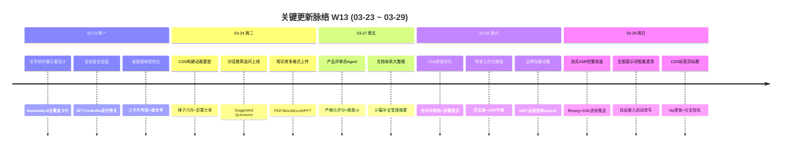

# 周报 2026-W13 (2026-03-23 ~ 2026-03-29)

> **总计 312 次提交 | 371 个文件变更 | +21,506 行 / -4,724 行 | 44 个 PR 合并 (#304 ~ #359)**
>
> **贡献者**：Claude (264 commits), InerNoro (40 commits), RuXiuWEi (4 commits), Cursor Agent (4 commits)

**本周趋势**：交付节奏从 W12 的历史峰值（503 commits / 68 PRs）回落至稳态（312 commits / 44 PRs），但功能深度显著提升。三条主线清晰呈现：(1) CDS 从"好用"进化到"精致"——色标冲击波动画、AI 操控边框、标签页标题、部署模式切换等 13 个 PR 打磨细节体验；(2) 两个新 Agent 上线——产品评审员（严格化评分+维度配置）和转录工作台（豆包 ASR 中继 + ffmpeg 全格式 + SSE 逐帧推送）从零到一落地；(3) 产品全链路品质提升——VisualAgent 生图提示词智能澄清、文学创作 NotebookLM 风格重设计、品牌化加载动画替换全站 spinner、37 篇设计文档补全管理摘要。同时全站安全加固（28 个 Controller 身份修复 + localStorage 禁用 + state.json 泄露修复）和知识库多格式文件上传为基础设施补齐短板。

---

## 关键更新脉络

---

## 一、本周完成

### 1. CDS 平台交互体验大升级 — 从功能完备到视觉精致的飞跃

> **价值**：开发团队每天在 CDS 上管理多个分支部署，交互细节决定效率。本周 13 个 PR 从动画、标签、模式切换到窗口调整全面打磨，让多分支管理不再混淆、操作更直觉。

- **色标切换冲击波动画**：金色圆弧冲击波从点击原点扩散，环形裁剪 + backdrop-filter 替代纯色覆盖，15+ 次迭代打磨动效细节 (#353)
- **AI 操控蓝色边框**：预览页新增 AI 操控时的蓝色光晕边框效果，轻量 inset box-shadow 不遮挡内容 (#358)
- **标签页标题功能**：浏览器标签页显示分支标签/短名，MutationObserver 守护防 SPA 水合覆盖，区分多个页签 (#328)
- **部署模式切换**：dev/static 模式一键切换，启动时从 compose 同步模式，左右按钮分工明确 (#354)
- **构建状态动画统一**：锤子闪烁 + 按钮发光替代旋转元素，server-driven 状态联动，移除所有 busy spinner (#323)
- **可拖拽窗口调整**：Activity 面板缩放控件替换为可拖拽边框 (#334)
- **启动加载页**：服务启动时展示加载页，Vite 启动信号触发切换 (#342)
- **分支悬浮操作**：分支名右侧悬浮复制和跳转按钮 (#328)
- **资源优化**：移除所有内存限制 + GC 堆限制从 env 移到 command 防 Roslyn OOM (#354)
- **安全修复**：移除 state.json 的 Git 跟踪，消除敏感信息泄露风险 (#324)

### 2. 转录工作台 (Transcript Agent) — 从零到一的语音识别 Agent

> **价值**：用户上传任意音频/视频文件，系统自动转录为文字。作为新 Agent 接入百宝箱体系，填补语音处理空白。

- **豆包 ASR 中继**：WebSocket 流式 ASR 客户端 + doubao-asr-stream 导入模板 (#355)
- **ffmpeg 全格式支持**：非 WAV 格式自动转换，静态编译版 bind mount 零依赖部署 (#359)
- **SSE 逐帧推送**：流式识别结果实时推送前端，边识别边展示 (#359)
- **自动重采样**：48kHz/2ch 自动降采样为 16kHz/1ch 适配 ASR 模型要求 (#359)
- **导航式渐进深入 UI**：转录工作台 UI 重设计，从上传到结果展示全流程引导 (#355)

### 3. 产品评审员 Agent — AI 驱动的产品评审系统

> **价值**：产品提交评审后由 AI 自动打分，按多维度给出严格评价。减少人工评审负担，建立量化评审标准。

- **严格化评分 + 维度明细**：AI 评分结果按维度拆分展示，支持重新评审 (#352)
- **维度配置 UI**：管理员可自定义评审维度，默认展开查看 (#352)
- **首页卡片 + 筛选联动**：集成到首页 ToolCard，支持状态筛选和计数 (#352)
- **设计文档**：完整技术设计文档 design.review-agent.md (#352)

### 4. VisualAgent 生图提示词智能化 — 降低创作门槛

> **价值**：用户不再需要精心构造英文生图提示词，中文描述即可自动改写为高质量英文 prompt，显著降低 AI 绘图门槛。

- **提示词智能澄清 (Clarify)**：用户自由输入自动改写为明确的英文生图提示词 (#329)
- **智能模式/直连模式拆分**：重命名"解析模式"为"直连模式"，模式切换更清晰 (#335)
- **生图 Watchdog**：自动恢复卡住的 running 项目，消除幽灵状态 (#329)
- **多模型适配修复**：Gemini/Google 生图 COS 上传失败和响应解析修复 (#329)
- **默认关闭智能模式**：避免不必要的 LLM 调用开销 (#343)

### 5. 文学创作展示全面重设计 — NotebookLM 风格

> **价值**：文学创作页面从传统列表升级为全覆盖图片卡片风格，配图成为视觉焦点，浏览体验接近 Google NotebookLM 的沉浸感。

- **NotebookLM 全覆盖卡片**：LiteraryCard 重写，图片作为主视觉元素 (#320, #322)
- **Sidebar 沉浸式布局**：图片主导覆盖层布局 + hover prompt overlay + click-to-edit (#327)
- **配图显示修复**：按时间顺序匹配旧数据配图、投稿改为 Space 粒度、并发生图 marker 丢失修复 (#317, #336)
- **投稿体验改进**：管理员撤稿按钮、无配图投稿守卫、历史数据清理端点 (#317)

### 6. 品牌化加载动画系统 — 统一全站视觉语言

> **价值**：用户在页面切换和权限加载时看到的不再是通用 spinner，而是品牌化的 MAP 过渡动画，强化产品辨识度。

- **MAP 品牌过渡动画**：全站 Loader2 spinner 和"加载中"文字统一替换为 MapSpinner 组件 (#338)
- **视频加载动画**：页面切换和权限加载屏使用视频加载效果 (#330)
- **主题切换零黑屏**：旧主题保持可见直到新主题圆形扩散覆盖完成 (#317)

### 7. 文档体系大整理 — 37 篇设计文档补全

> **价值**：所有设计文档补全管理摘要，非技术读者 30 秒即可了解方案全貌。新增涌现篇等 6 篇系统级设计文档，形成完整知识体系。

- **37 篇 design 文档补全管理摘要**、头部信息、废弃方案标注 (#351)
- **6 篇新设计文档**：涌现篇、Marketplace、RBAC、LLM Gateway、VisualAgent、ReportAgent (#351)
- **废弃文档清理**和结构重排 (#351)

### 8. 全站安全加固 — 身份与存储双重修复

> **价值**：杜绝部署后用户串数据、菜单缓存不更新等安全隐患，从根源上消除 localStorage 持久化带来的状态污染。

- **28 个 Controller 身份提取修复**：消除 "unknown" 回退安全漏洞 (#320)
- **全站禁用 localStorage**：统一改为 sessionStorage，部署自动清除认证缓存 (#320)
- **周报团队权限收紧**：团队可见性限定成员、Prompt 设置限定管理员 (#347, #348)
- **state.json 敏感信息泄露修复**：移除 Git 跟踪 (#324)

### 9. PRD Agent 知识库增强 — 多格式文件支持

> **价值**：用户不再受限于纯文本文件，可直接上传 PDF、Word、Excel、PPT 等常见办公文件，知识库的实用性大幅提升。

- **三阶段格式检测**：已知放行 → 已知拒绝 → 未知探测，智能判断文件格式 (#316)
- **UTF-16 BOM 支持 + 20MB 上传限制** (#318)
- **二进制格式支持**：PDF/Word/Excel/PPT 格式均可上传 (#316)

### 10. 对话推荐追问功能 — 引导深度交互

> **价值**：对话结束后自动推荐追问问题，引导用户深入探索，提升对话质量和用户粘性。

- **Suggested Questions**：对话末尾自动生成推荐追问列表 (#331)

### 11. 模型池管理 UI 重构 — Master-Detail 布局

> **价值**：左右分栏布局让模型池管理更高效，一眼纵览列表同时查看详情，新增"设为备用"快捷操作。

- 左右分栏 master-detail 布局 + 增量同步保留专属绑定 (#325)

### 12. 代码治理 — AppCallerCode 清理

> **价值**：清除 15 个未使用的注册项，减少维护负担，修复排行榜维度泄漏。

- 清理 15 个未使用 AppCallerCode + 别名归一化 (#321, #357)

### 13. 桌面端体验优化

> **价值**：桌面用户看到更清晰的服务器选择界面和版本信息，更新流程更顺畅。

- 服务器选择三卡片布局、Header 版本号显示、检查更新确认框改造 (#315)
- 18 个内置引导提示词自动种子 (#315)

### 14. 周报 Agent 增强

> **价值**：周报新增阅读追踪和 Todo 计划周功能，团队权限收紧保障数据安全。

- 阅读追踪 + Todo 计划周接入日常记录 (#304)
- 全局蒙版式使用指引 (#304)

---

## 二、本周数据

### 每日提交分布

| 日期 | 提交数 | 重点方向 |
|------|--------|----------|
| 03-23 (周一) | 48 | 文学创作重设计、全站安全加固、桌面端优化 |
| 03-24 (周二) | 95 | CDS 构建动画、投稿修复、知识库多格式、对话追问 |
| 03-25 (周三) | 1 | CDS compose 拆分 |
| 03-26 (周四) | 2 | 周报团队权限修复 |
| 03-27 (周五) | 17 | 产品评审员 Agent、文档体系整理 |
| 03-28 (周六) | 66 | CDS 资源优化、转录工作台、品牌加载动画 |
| 03-29 (周日) | 83 | 流式 ASR 改造、生图智能澄清、CDS 标签页标题 |

### 提交类型分布

| 类型 | 数量 | 占比 |
|------|------|------|
| fix (Bug 修复) | 134 | 43.0% |
| feat (新功能) | 61 | 19.6% |
| Merge | 46 | 14.7% |
| docs (文档) | 23 | 7.4% |
| chore (杂务) | 16 | 5.1% |
| refactor (重构) | 13 | 4.2% |
| test / style / perf / debug | 8 | 2.6% |
| 中文 commit / 无前缀 | 9 | 2.9% |
| Revert | 1 | 0.3% |

---

## 三、与上周 (W12) 对比

| 指标 | W12 | W13 | 变化 |
|------|-----|-----|------|
| 提交数 | 503 | 312 | -38.0% |
| 合并 PR 数 | 68 | 44 | -35.3% |
| 文件变更 | 431 | 371 | -13.9% |
| 净增行数 | +41,246 | +16,782 | -59.3% |

### 上周方向落地情况

| W12 建议方向 | W13 实际进展 |
|--------------|-------------|
| P0 知识库 RAG 集成 | ⚠️ 多格式文件上传已完成（PDF/Word/Excel/PPT），但 RAG 向量索引仍未开始 |
| P0 产品质量收敛 | ✅ fix 占比 43% 说明持续修复中，28 个 Controller 安全修复 + localStorage 禁用 + 主题切换黑屏修复 |
| P1 CDS 生产环境稳定性 | ✅ 资源优化（去内存限制）、部署模式切换、启动加载页、state.json 安全修复，稳定性持续提升 |
| P1 作品广场社交功能 | ⚠️ 瀑布流布局 + 无限滚动上线，但评论/收藏/推荐算法未推进 |
| P2 缺陷管理 Webhook | ❌ 连续四周未推进 |
| P2 移动端系统性 QA | ❌ 未推进 |

---

## 四、下周优先级建议

| 优先级 | 方向 | 建议动作 |
|--------|------|----------|
| P0 | 知识库 RAG 集成 | 连续五周文件上传已就绪但向量索引未动，本周必须启动 embedding + 检索 + 对话引用 |
| P0 | 转录工作台端到端验收 | 本周从零搭建完成，需在真实场景下验收全流程：上传 → ASR → 结果展示 → 导出 |
| P1 | 产品评审员场景验证 | 新 Agent 基本功能就绪，需真实产品提交走完评审流程，验证评分合理性和维度配置 |
| P1 | 缺陷管理 Webhook | 连续四周未推进，对接飞书/企微自动推送关键缺陷 |
| P2 | 作品广场社交互动 | 基础展示已完善（瀑布流+无限滚动），补充评论、收藏、推荐算法 |
| P2 | 移动端系统性 QA | 连续两周未推进，Android + 响应式布局需系统性测试 |

---

## 附录：已合并 Pull Requests (#304 ~ #359)

| PR | 标题 | 分类 |
|----|------|------|
| #304 | 周报阅读追踪 + Todo 计划周 + 使用指引 + TTL 自愈 | 🔄 更新 |
| #315 | 桌面端服务器选择重设计 + 版本号 + 引导提示词种子 | 🎨 UI/UX |
| #316 | PRD 知识库多文件上传 + 三阶段格式检测 | ✨ 新功能 |
| #317 | 投稿修复集：Space 粒度投稿 + 并发 marker 修复 + 撤稿 | 🐛 修复 |
| #318 | UTF-16 BOM 检测 + 20MB 上传限制 | 🐛 修复 |
| #320 | 文学创作展示重设计 + 全站 localStorage 禁用 + 安全修复 | ✨ 新功能 |
| #321 | AppCallerCode 别名归一化，修复排行榜维度泄漏 | 🐛 修复 |
| #322 | 文学创作 NotebookLM 风格卡片 + 封面图逻辑 | 🎨 UI/UX |
| #323 | CDS 构建动画统一 + 标签页标签 + pinned commit | ✨ 新功能 |
| #324 | CDS state.json 敏感信息泄露修复 | 🔐 安全 |
| #325 | 模型池管理 master-detail 布局 + 增量同步 | 🎨 UI/UX |
| #326 | 聊天图片和头像显示修复 | 🐛 修复 |
| #327 | 文学创作 sidebar 沉浸式卡片布局 | 🎨 UI/UX |
| #328 | CDS 标签页标题 + 分支悬浮操作 + 自动更新修复 | ✨ 新功能 |
| #329 | VisualAgent 生图提示词智能澄清 + watchdog | ✨ 新功能 |
| #330 | 视频加载动画 + 权限加载屏 | 🎨 UI/UX |
| #331 | 对话推荐追问功能 (Suggested Questions) | ✨ 新功能 |
| #332 | TypeScript 编译错误修复 | 🐛 修复 |
| #333 | CDS Activity 面板缩放 + 预览眨眼动效 | 🎨 UI/UX |
| #334 | CDS Activity 面板可拖拽边框调整 | 🎨 UI/UX |
| #335 | VisualAgent 直连模式 + 生图意图前缀 | 🔄 更新 |
| #336 | 文学创作配图按时间顺序匹配 + 认证修复 | 🐛 修复 |
| #337 | CDS env 编辑器移除变量遮蔽 | 🐛 修复 |
| #338 | MAP 品牌过渡动画替换全站 spinner | 🎨 UI/UX |
| #339 | 作品广场瀑布流布局 + 无限滚动 | ✨ 新功能 |
| #340 | VisualAgent 智能模式英文意图前缀 | 🐛 修复 |
| #341 | 移除未使用 Upload 导入修复 TS6133 | 🐛 修复 |
| #342 | CDS 启动加载页 + CSS MIME 类型修复 | ✨ 新功能 |
| #343 | VisualAgent 智能模式默认关闭 + 模型选择竞态修复 | 🐛 修复 |
| #344 | 作品广场心形图标放大 | 🎨 UI/UX |
| #345 | 规则：禁止自动创建 PR | 📝 文档 |
| #346 | 生图意图前缀不泄漏到 UI 展示 | 🐛 修复 |
| #347 | 周报团队 Prompt 设置权限收紧 | 🔐 安全 |
| #348 | 周报团队可见性权限收紧 | 🔐 安全 |
| #349 | CDS compose 全局变量拆分 | 🏗️ 架构 |
| #351 | 37 篇设计文档补全 + 6 篇新文档 + 废弃清理 | 📝 文档 |
| #352 | 产品评审员 Agent 全功能上线 | ✨ 新功能 |
| #353 | CDS 色标切换冲击波动画 | 🎨 UI/UX |
| #354 | CDS 资源优化 + 部署模式切换 | ⚡ 性能 |
| #355 | 转录工作台 Agent + 豆包 ASR 中继 | ✨ 新功能 |
| #356 | CDS badge 弹窗自适应 + 日志复制 | 🐛 修复 |
| #357 | AppCallerCode 清理 15 个未使用注册项 | 🏗️ 架构 |
| #358 | CDS 标签编辑 + AI 边框 + 环境变量回退 | ✨ 新功能 |
| #359 | 流式 ASR 完整改造：ffmpeg 全格式 + SSE 逐帧推送 | ✨ 新功能 |
