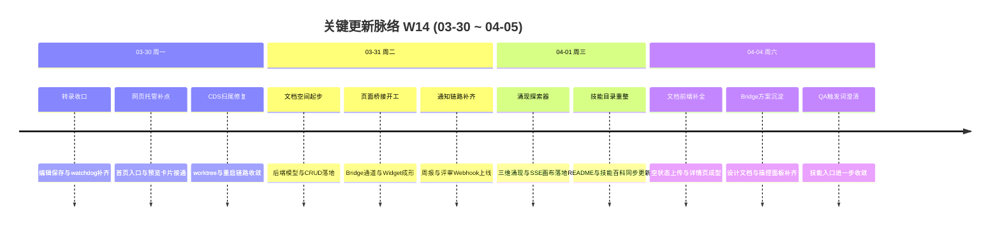

# 2026-W14 (2026-03-30 ~ 2026-04-05) · 周报

> **总计 95 次提交 | 145 个文件变更 | +10,313 行 / -768 行 | 12 个 PR 合并（详见附录）**
>
> **贡献者**：Claude (81 commits), InerNoro (11 commits), RuXiuWEi (2 commits), inernoro (1 commits)

**本周趋势**：W14 从 W13 的多 Agent 并行爆发，切到“知识载体 + 控制通道 + 通知链路”的基础设施周。最重要的三条主线分别是：(1) 文档空间、涌现探索器和 Page Agent Bridge 同时起步，把“内容沉淀”和“页面操控”两条能力链拉通；(2) 周报 Agent 与产品评审员打通 Webhook 通知，汇报型产品开始具备对外触达能力；(3) 转录工作台、CDS 本地开发与构建链路继续收口，把前一周的原型能力往可持续交付推进。整体节奏相比 W13 明显降速，但方向更聚焦于后续平台化能力的地基搭建。

---

## 关键更新脉络

---

## 一、本周完成

### 1. 文档空间基础设施起步 — 知识沉淀开始有统一容器

> **价值**：团队第一次有了可以承接“文档、知识条目、知识库权限”的统一底座，后续的知识库检索、订阅同步和内容再加工才有承载对象。

- 后端新增 `DocumentStore` / `DocumentEntry` 模型与完整 CRUD，支持空间创建、列表、详情、更新、删除和条目管理。
- 权限层补齐 `document-store.read` / `document-store.write`，文档空间正式进入平台能力版图。
- 前端补上空间列表、详情、上传、搜索、删除和空状态引导，用户不再只看到“设计概念”，而是能直接开始创建内容容器。

### 2. 涌现探索器从 0 到 1 — “从文档到新想法”开始进入系统

> **价值**：知识沉淀不再只停留在静态存储，团队可以把已有文档继续拉升为带锚点、带桥梁假设的探索树，形成更强的方案发散能力。

- 后端落地 `EmergenceTree` / `EmergenceNode` 与 `EmergenceService`，支持三维涌现建模。
- SSE 逐节点生长到画布，保证探索过程不是一次性黑盒输出，而是可观察、可中断、可追踪。
- 前端补齐 React Flow 画布、新建对话框、导出 Markdown，以及从文档空间一键带种子跳转的能力。

### 3. Page Agent Bridge 打通页面操控通路 — 编码 Agent 终于能“看页面、动页面”

> **价值**：这条链路把 CDS 从“只会部署和代理页面”推进到“能让 Agent 读取页面状态并执行操作”，是后续网页自动化和可视化调试的关键底座。

- CDS Widget 能读取 DOM、执行 click/type/scroll/navigate/spa-navigate/evaluate。
- Bridge 服务和 `/api/bridge/`* REST API 成型，导航请求和用户确认链路也补齐。
- Console 错误、网络异常、鼠标轨迹和操作面板一并上线，让操控不是黑箱命令，而是可视化、可追溯的交互过程。

### 4. 周报 Agent 与评审员接上 Webhook — 汇报型产品开始具备外发能力

> **价值**：团队汇报和产品评审不再只停留在站内页面，结果可以被推送到企微、钉钉、飞书等外部通道，真正进入组织协同链路。

- 周报 Agent 新增 Webhook 通知推送，团队设置页同步提供 CRUD 和测试连通性入口。
- 产品评审员 Agent 同步支持通知配置和结果外发，评审完成后能把评分结果推到群聊。
- 这一步让“周报”“评审”从孤立页面功能，变成可嵌入团队消息流的工作系统。

### 5. 转录工作台做了第一轮收口 — 从“能跑”变成“能稳定编辑和回看”

> **价值**：转录不再只是后台跑完返回结果，而是具备了编辑、保存、watchdog 清理和 SSE 保活，开始接近真实生产工作台的体验。

- 文案编辑支持保存，前后端新增结果保存接口。
- `TranscriptRunWatchdog` 自动清理长时间卡在 processing 的任务，避免孤儿任务堆积。
- SSE 进度流补 keepalive，客户端断开后数据库轮询立刻停掉，减少“页面在等、服务还在跑”的资源浪费。

### 6. CDS 本地开发与迁移链路继续收敛 — 把原型能力往可维护系统推进

> **价值**：这周没有再大铺新概念，而是把“本地调试、worktree、重启、自迁移”这类最容易拖慢交付的运维毛刺继续磨平。

- 数据迁移首版落地，支持 MongoDB 实例间一键迁移、集合级选择和 SSE 实时进度。
- worktree stale ref 清理、本地端口调试、自重启与构建链路继续修补，减少本地 CDS 卡住和假成功的概率。
- 数据库索引清理、TypeScript 构建警告修复，把工程噪声压下去，为下一周的 CDS 主线重构腾空间。

### 7. 网页托管与视觉工作区补了一批真实可见的小入口

> **价值**：虽然不是本周主线，但这些补点都直接打在用户高频触点上，能立刻降低“入口找不到”和“状态看不见”的摩擦。

- 首页实用工具区与侧边栏恢复网页托管入口，页面头部开始展示标题和描述。
- “我的资源”网页 tab 支持 iframe 缩略预览图，网页托管不再只是一串链接。
- 视觉创作工作区列表支持无限滚动，高频资产列表的使用成本继续下降。

### 8. 技能与文档体系做了一轮结构整理

> **价值**：当功能面持续扩张时，技能目录和文档结构如果不先收敛，后面所有 Agent 能力都会变得难找、难学、难维护。

- README 重写为英文版，对齐 CLAUDE.md 的结构和技能链说明。
- 技能百科全书 `guide.skill-catalog.md` 落地，35 个技能第一次有统一索引。
- `documentation-writer` / `technical-writing` / `user-guide-writing` 合并为 `technical-documentation`，触发词冲突也做了修正。

---

## 二、本周数据

### 每日提交分布

| 日期         | 提交数 | 重点方向                             |
| ---------- | --- | -------------------------------- |
| 03-30 (周一) | 15  | 转录工作台收口、网页托管补点、CDS 本地修复          |
| 03-31 (周二) | 37  | 文档空间后端、Page Agent Bridge、周报/评审通知 |
| 04-01 (周三) | 17  | 涌现探索器、技能目录与 README 整理            |
| 04-03 (周五) | 2   | 方案沉淀与零星修补                        |
| 04-04 (周六) | 24  | 文档空间前端、Bridge 设计文档、QA 触发词澄清      |

### 提交类型分布

| 类型                     | 数量  | 占比    |
| ---------------------- | --- | ----- |
| fix (Bug 修复)           | 34  | 35.8% |
| feat (新功能)             | 33  | 34.7% |
| refactor (重构)          | 5   | 5.3%  |
| docs (文档)              | 4   | 4.2%  |
| merge / debug / revert | 19  | 20.0% |

---

## 三、与上周 (W13) 对比

| 指标      | W13     | W14    | 变化     |
| ------- | ------- | ------ | ------ |
| 提交数     | 312     | 95     | -69.6% |
| 合并 PR 数 | 44      | 12     | -32    |
| 文件变更    | 371     | 145    | -60.9% |
| 净增行数    | +16,782 | +9,545 | -43.1% |

### 上周方向落地情况

| W13 建议方向        | W14 实际进展                                             |
| --------------- | ---------------------------------------------------- |
| P0 知识库 RAG 集成   | ⚠️ 文档空间、涌现探索器和 Page Agent Bridge 落地了底座，但检索问答与引用链还没开始 |
| P0 转录工作台端到端验收   | ✅ 编辑保存、watchdog、SSE keepalive 和结果回写全部补齐              |
| P1 产品评审员场景验证    | ✅ Webhook 通知推送与配置面板落地，评审链路开始具备外发能力                   |
| P1 缺陷管理 Webhook | ❌ 本周未推进                                              |
| P2 作品广场社交互动     | ⚠️ 视觉工作区和网页托管入口继续补强，但社交互动闭环没有展开                      |

---

## 四、下周优先级建议

| 优先级 | 方向                 | 建议动作                                           |
| --- | ------------------ | ---------------------------------------------- |
| P0  | 文档空间进入真实内容阶段       | 把“文档容器”推进到真实上传、订阅同步、文档浏览器和搜索能力，避免底座建好后迟迟没进入可用态 |
| P0  | CDS 统一生产入口与稳定性     | 把本周的迁移/重启/worktree 修补收束成统一入口、明确预览模式和更强的自恢复链路   |
| P1  | PR 审查与 GitHub 基础设施 | 让 PR 审查从设计和零散原型进入真正的 per-user GitHub 能力主干      |
| P1  | 首页与登录品牌重写          | 当前产品能力快速扩张，首页信息架构与品牌叙事需要一次系统性重构                |
| P2  | 汇报型产品的通知统一         | 周报和评审已经各自打通 Webhook，下一步应考虑统一约束、统一配置体验和统一异常观测   |

---

## 附录：已合并 Pull Requests

| PR   | 标题                               | 分类        |
| ---- | -------------------------------- | --------- |
| #358 | 编辑徽标与转录体验补点                      | 🎨 UI/UX  |
| #359 | 转录代理与流式 ASR 继续推进                 | ✨ 新功能     |
| #360 | 修复亮色主题更新卡片的绿色边框串色                | 🎨 UI/UX  |
| #361 | 清理数据库索引与相关工程噪声                   | 🏗️ 架构    |
| #362 | 修复 TypeScript 构建警告与编译阻塞          | 🐛 Bug 修复 |
| #363 | 网页托管入口与资源卡片预览补齐                  | ✨ 新功能     |
| #364 | 合并 W13 周报与文档索引同步                 | 📝 文档     |
| #365 | CDS worktree 初始化前自动清理 stale refs | 🐛 Bug 修复 |
| #366 | CDS 重启改为自退出流程并补本地调试修复            | 🐛 Bug 修复 |
| #367 | 转录 Relay 继续推进并收口工作台链路            | 🔄 更新     |
| #368 | 周报 Agent 外发通知与市场分析补充             | ✨ 新功能     |
| #369 | 产品评审员 Webhook 通知与月报标题修正          | ✨ 新功能     |

