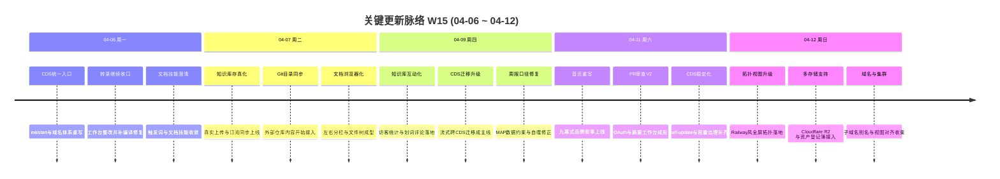

# 2026-W15 (2026-04-06 ~ 2026-04-12) · 周报

> **总计 301 次提交 | 392 个文件变更 | +65,395 行 / -8,174 行 | 39 个 PR 合并（详见附录）**
>
> **贡献者**：Claude (200 commits), Cursor Agent (51 commits), InerNoro (38 commits), root (7 commits), RuXiuWEi (2 commits)

**本周趋势**：W15 是典型的“平台化升级周”。CDS 从零散修补进入系统级改造：统一入口脚本、多根域名、server authority、迁移 v2、resilience、topology、cluster、subdomain alias 一起推进；知识库从“能存文档”升级成“可上传、可同步、可浏览、可互动”的完整产品雏形；PR Review V2 从顶层设计变成带 OAuth、摘要流式输出和 GitHub 基础设施分层的正式主线；首页和登录页也完成了彻底的品牌与信息架构重写。相比 W14，本周不是补点，而是在多个子系统上同时完成“第一版完整形态”的搭建。

---

## 关键更新脉络

---

## 一、本周完成

### 1. CDS 单入口、域名与初始化体系重写 — 运维入口终于从“脚本集合”变成“统一产品面”

> **价值**：新成员和运维同学不再需要记住多套脚本、域名规则和环境变量入口，CDS 的启动、初始化、证书和根域名配置第一次收敛成可解释的统一路径。

- `exec_cds.sh` 合并为单一入口，覆盖 `init/start/stop/restart/status/logs/cert`。
- `.cds.env`、多根域名、动态 nginx 渲染和渐进式 HTTPS 一次成型。
- `init` 会自动检查 Node/pnpm/Docker/curl/openssl/python3 等依赖，并按发行版给出安装命令。
- 文档同步更新到新的环境变量和 quickstart 口径，过去分散在多个脚本和 README 里的隐性知识被收束到了显式说明里。

### 2. CDS 稳定性、预览模式和自更新开始系统化 — 从“能跑”转向“可恢复、可观测、可共享”

> **价值**：CDS 以前最磨人的问题不是“没有功能”，而是入口不统一、默认值不可信、自更新容易假成功。本周把这些最影响日常使用的隐性风险集中处理了一轮。

- 预览模式改成服务器权威存储，分享链接打开后不再被本地 localStorage 污染默认值。
- self-update 引入规范的 daemon 参数、错误日志和 healthz 轮询，不再靠“5 秒后盲刷新”赌重启成功。
- 容量超售、剩余槽位、电池徽章、宿主机负载和空状态设计同步升级，CDS 的资源状态开始可解释。
- `root domain`、`dashboard domain`、子域名路由和端口模式代理都进一步明确，减少“我能打开但别人打不开”的灰区。

### 3. CDS 数据迁移 v2 成为独立主线 — 从临时工具升级为跨实例迁移系统

> **价值**：当 CDS 从个人工具转向多实例、多环境平台时，迁移能力不再是一次性脚本，而必须是可反复执行、可诊断、可跨环境传输的基础设施。

- 支持跨 CDS 密钥一键直连，源和目标都可通过访问密钥接入。
- `mongodump | mongorestore` 流式管道替代临时文件，长时间迁移更稳定。
- SSH 模式切到命令式迁移并支持 docker 容器名，兼容复杂远端环境。
- 对等 CDS 端点、隧道测试、任务编辑和集合级选择一起补齐，迁移正式进入产品级能力。

### 4. CDS 拓扑、集群和别名能力快速扩展 — 控制平面第一次有了“平台感”

> **价值**：多项目、多分支和多执行器如果没有好的控制视图，规模一上来就会变成纯运维负担。本周 CDS 开始具备类似现代平台的调度和拓扑体验。

- Railway 风全屏拓扑视图落地，支持 rich cards、pan/zoom、focus edge highlight、右侧详情面板。
- 集群接入支持热切换、连接码、容量汇总、节点管理和分支派发。
- 子域名别名、容器覆盖、host stats 和 view parity smoke 继续补齐，项目和分支的可控性明显提升。
- 这些变化把 CDS 从“单机分支看板”推向“有调度、有拓扑、有容量视图”的控制平面。

### 5. 知识库从“存文档”升级到“可浏览、可同步、可互动”的产品雏形

> **价值**：文档空间不再只是一个数据结构，而是开始具备真实上传、订阅、文件树、预览、搜索、评论和访客统计，成为一个可用的知识工作台。

- 真实 multipart 上传、正文读取、订阅源、`DocumentSyncWorker` 和 GitHub 目录同步全部接上。
- 左右分栏 `DocBrowser`、递归文件夹树、主文档、内容搜索、拖拽移动、右键菜单和在线编辑逐步完善。
- 访客统计、停留时长、划词评论和重锚定算法落地，知识内容开始从“被动存储”走向“主动协作”。
- 多文档置顶、预览卡片、订阅详情抽屉和内容索引回填把使用体验继续往可规模化使用推进。

### 6. PR Review V2 从设计进入主干实现 — GitHub 审查工作台第一次“站起来”

> **价值**：这周之前，PR 审查主要还是设计和散点功能。本周之后，它已经有 OAuth、摘要生成、统一错误码、GitHub 基础设施分层和工作台组件，可以被当作独立产品线继续推进。

- `GitHubUserConnection` / `PrReviewItem` / `PrReviewSnapshot` 等核心模型落地。
- GitHub OAuth 从 Web Flow 切到 Device Flow，解决 CDS 动态域名与回调地址预注册的根本冲突。
- 摘要流式输出、结构化 SummaryPanel、错误码治理和 GitHub 基础设施抽取全部成型。
- 后续扩展 commits/issues/check-runs 等能力时，已经不需要再在 PR 审查模块内部重复造轮子。

### 7. 首页与登录页完成品牌级重写 — 从“工具集合”切到“平台叙事”

> **价值**：随着 Agent 数量和产品面快速扩张，旧首页已经无法有效解释“这到底是什么平台”。九幕式 landing 和统一视觉语言把产品叙事重新组织了一遍。

- `/home` 重写为九幕 Linear 风结构：Hero、StatsStrip、FeatureDeepDive、HowItWorks、AgentGrid、CompatibilityStack、FinalCta 等完整串联。
- LoginPage 统一为 Linear × Retro-Futurism 视觉体系，和首页共享同一套设计语言。
- 中英文切换、Reveal 动画、SectionHeader、WorkflowCanvas、品牌语义和色彩规则一并沉淀。
- 这不是单纯“好看了”，而是把产品能力的表达方式从“功能堆叠”升级为“平台叙事”。

### 8. 周报、技能和外围能力继续补强 — 把高频工具链一起往前推

> **价值**：主线之外，这些补强项都直打平台的“好不好用”与“能不能继续扩张”。

- 技能引导 Agent（skill-agent）上线，支持导出 `SKILL.md` 和 ZIP 包。
- 周报 Agent 修复 MAP 数据口径、自噬统计和提示词约束，减少自动生成失真。
- Cloudflare R2、多对象存储 Provider、资产登记簿、更新中心、缺陷筛选和若干视觉/导航问题同步收口。
- 这些看似分散的小项，实际上是在给平台扩张后的管理、运营和可见性补底座。

---

## 二、本周数据

### 每日提交分布

| 日期         | 提交数 | 重点方向                                        |
| ---------- | --- | ------------------------------------------- |
| 04-06 (周一) | 21  | CDS 统一入口、转录整改、技能触发词澄清                       |
| 04-07 (周二) | 39  | 知识库真实上传、目录同步、文档浏览器初版                        |
| 04-08 (周三) | 24  | CDS server authority、知识库交互、页面桥接与样式收口        |
| 04-09 (周四) | 62  | 划词评论、访客统计、迁移 v2、周报数据修复                      |
| 04-10 (周五) | 39  | CDS host stats、容量、数据迁移与 nginx/idempotent 修补 |
| 04-11 (周六) | 77  | 首页九幕重写、PR Review V2、CDS 自更新与稳定性             |
| 04-12 (周日) | 39  | 拓扑 overhaul、子域名别名、多存储与域名收束                  |

### 提交类型分布

| 类型            | 数量  | 占比    |
| ------------- | --- | ----- |
| fix (Bug 修复)  | 87  | 28.9% |
| feat (新功能)    | 81  | 26.9% |
| refactor (重构) | 11  | 3.7%  |
| docs (文档)     | 12  | 4.0%  |
| chore (杂务)    | 6   | 2.0%  |
| test (测试)     | 5   | 1.7%  |
| perf / style  | 3   | 1.0%  |
| merge / 其他无前缀 | 96  | 31.9% |

---

## 三、与上周 (W14) 对比

| 指标      | W14    | W15     | 变化      |
| ------- | ------ | ------- | ------- |
| 提交数     | 95     | 301     | +216.8% |
| 合并 PR 数 | 12     | 39      | +27     |
| 文件变更    | 145    | 392     | +170.3% |
| 净增行数    | +9,545 | +57,221 | +499.4% |

### 上周方向落地情况

| W14 建议方向              | W15 实际进展                                                     |
| --------------------- | ------------------------------------------------------------ |
| P0 文档空间进入真实内容阶段       | ✅ 真实上传、订阅同步、文档浏览器、内容搜索、划词评论和访客统计全部落地                         |
| P0 CDS 统一生产入口与稳定性     | ✅ 单入口脚本、多根域名、server authority、self-update、resilience 一整周都在推进 |
| P1 PR 审查与 GitHub 基础设施 | ✅ PR Review V2 的 OAuth、摘要、错误治理和 GitHub infra 分层一起成型          |
| P1 首页与登录品牌重写          | ✅ 九幕式 landing 和统一登录页视觉语言全部完成                                 |
| P2 汇报型产品的通知统一         | ⚠️ 周报数据口径继续修复，但跨周报/评审/其他产品的统一通知策略仍未完全收束                      |

---

## 四、下周优先级建议

| 优先级 | 方向                           | 建议动作                                                 |
| --- | ---------------------------- | ---------------------------------------------------- |
| P0  | CDS 多项目与 GitHub 授权进入主线       | 在已有统一入口和稳定性基础上，把项目壳、项目隔离和 GitHub 认证正式拉入 CDS 主路径      |
| P0  | CDS 状态与鉴权持久化                 | 把内存 / JSON 的状态和认证能力推向 Mongo，避免重启丢态和后续多项目扩展被卡住        |
| P1  | GitHub 自动部署、Check Runs 与冒烟闭环 | PR Review 和 GitHub infra 已起步，下一步该让 CDS 真正接上自动部署和校验闭环 |
| P1  | 周报 / 视频 / 知识库做一轮体验收口         | 本周上线的能力很多，下一周应优先修正高频路径的边界问题，避免“功能多但使用感掉队”            |
| P2  | 统一 `cds` 技能与 drop-in 分发      | CDS 已经具备相当多运维知识，应该把技能、CLI 和参考文档打成可复用的统一包             |

---

## 附录：已合并 Pull Requests

| PR   | 标题                          | 分类        |
| ---- | --------------------------- | --------- |
| #370 | 文档技能澄清与周边 QA 技能收敛           | 📝 文档     |
| #371 | 首页产品页方向并入主线                 | 🎨 UI/UX  |
| #372 | CDS 数据迁移功能首版                | ✨ 新功能     |
| #373 | 转录工作台彻底整改                   | 🐛 Bug 修复 |
| #374 | 网页自动化与 Agent Web 补点         | ⚙️ 工作流    |
| #375 | PR 审查棱镜阶段性能力并入              | 🧠 AI 能力  |
| #376 | CDS 部署指示与入口收敛               | 🔧 DevOps |
| #377 | Cursor 分支并入与冲突收敛            | 🔄 更新     |
| #378 | 知识库真实上传与订阅同步                | ✨ 新功能     |
| #379 | 缺陷批量分享仅保留打开项                | 🐛 Bug 修复 |
| #380 | 缺陷数量展示与统计修复                 | 🐛 Bug 修复 |
| #382 | CDS 预览模式改为服务器权威             | 🐛 Bug 修复 |
| #384 | 域名与文档引用更新                   | 📝 文档     |
| #385 | 知识库导航搜索上线                   | ✨ 新功能     |
| #386 | 知识库真实性校验与阅读器增强              | 🔄 更新     |
| #387 | 知识库重命名与标签支持                 | ✨ 新功能     |
| #388 | 智能体入口与引导优化                  | 🎨 UI/UX  |
| #389 | 订阅详情与同步日志                   | ✨ 新功能     |
| #390 | CDS nginx 初始化 Part 1        | 🔧 DevOps |
| #391 | CDS nginx 初始化 Part 2        | 🔧 DevOps |
| #392 | CDS nginx 初始化 Part 3        | 🔧 DevOps |
| #393 | Dashboard 根域名接入             | 🔧 DevOps |
| #394 | Dashboard 与预览域名拆分           | 🔧 DevOps |
| #395 | CDS 宿主机负载与容量能力设计并入          | 🔧 DevOps |
| #396 | CDS 根目录入口统一                 | 🔧 DevOps |
| #397 | CDS 根域名路由进一步简化              | 🔧 DevOps |
| #398 | CDS v3.2 统一入口与多域名设计沉淀       | 📝 文档     |
| #399 | 容量电池改为显示剩余槽位                | 🎨 UI/UX  |
| #401 | 修复 `/local-dump` 0 字节问题     | 🐛 Bug 修复 |
| #402 | 周报 Agent 口径、自噬与提示词修复        | 🐛 Bug 修复 |
| #403 | 技能引导 Agent 上线               | ✨ 新功能     |
| #404 | CDS 集群与调度能力继续推进             | ✨ 新功能     |
| #405 | 首页九幕式重写并入主线                 | 🎨 UI/UX  |
| #407 | CDS 集群 UI 与视图问题修复           | 🐛 Bug 修复 |
| #408 | 登录页视觉体系重写                   | 🎨 UI/UX  |
| #409 | GitHub 基础设施分层抽取             | 🏗️ 架构    |
| #410 | 权限与环境问题排查收束                 | 🔐 权限     |
| #411 | 首页语言加载修复                    | 🐛 Bug 修复 |
| #412 | 多对象存储 / Cloudflare R2 研究与接入 | 🏗️ 架构    |

