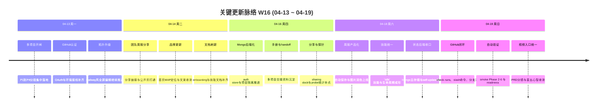

# 2026-W16 (2026-04-13 ~ 2026-04-19) · 周报

> **总计 329 次提交 | 522 个文件变更 | +74,371 行 / -4,803 行 | 38 个 PR 合并（详见附录）**
>
> **贡献者**：Claude (266 commits), InerNoro (35 commits), inernoro (22 commits), RuXiuWEi (4 commits), railway-app[bot] (2 commits)

**本周趋势**：W16 是最近三周里最像“收官周”的一周。W15 铺开的 CDS 多项目、GitHub 基础设施、知识库、周报和视频等多条主线，本周都进入“把骨架补齐、把闭环接上、把运维路打通”的阶段。最重要的结果有五个：(1) CDS 多项目 P1-P4 全量落地，项目壳、项目隔离、CRUD、scoping、routing、topology、build profile 和 completion/handoff 基本串成闭环；(2) GitHub 自动部署、Check Runs、slash 命令、live branch stream、smoke tests 与 preview readiness 继续向真正的平台自动化靠拢；(3) Mongo 认证 / 状态存储、自更新和项目级配置进一步收口，CDS 的状态后端和运维模型更稳了；(4) `cds` 统一技能、CLI 和生命周期体系成型，平台能力开始具备对外 drop-in 分发能力；(5) 周报 Agent 和 Video Agent 做了一轮明显的产品化补强，开始从“功能能用”迈向“日常更顺手”。  

---

## 关键更新脉络

---

## 一、本周完成

### 1. CDS 多项目 P1-P4 全量落地 — 从“单机分支面板”升级为真正的项目平台

> **价值**：这周之后，CDS 不再是围绕单项目、单仓库、单套路由打补丁，而是开始具备“项目列表、项目隔离、项目生命周期管理”的正式平台结构。

- P1 项目外壳：`/api/projects`、`projects.html`、`GET / -> /projects.html`、Dashboard 返回项目列表。
- P2 GitHub OAuth：新增 `CDS_AUTH_MODE=github`、session middleware、首登自举和登录落点。
- P3 数据层 project scoping：`BranchEntry` / `BuildProfile` / `InfraService` / `RoutingRule` 全部引入 `projectId` 语义。
- P4 项目 CRUD、routing、拓扑、variables、build profile 快速开始模板和 completion/handoff 全部补齐。
- 最终效果不是“多了几个接口”，而是 CDS 开始拥有能支撑多项目长期运行的基础形态。

### 2. CDS GitHub 自动部署主线继续接通 — 从“能看 GitHub”走向“GitHub 驱动 CDS”

> **价值**：GitHub 集成真正有价值的地方，不是显示仓库名，而是让 push、分支、PR 和验证结果能驱动 CDS 自动创建、自动部署和自动清理。

- 项目 Settings 的 GitHub 标签页支持安装引导、仓库绑定、auto deploy 开关和状态展示。
- Check Runs、GitHub badge、`from GitHub <sha7>`、删除分支自动停容器、仓库 rename/delete 自动解绑等能力继续补齐。
- Slash 命令 `/cds redeploy`、`/cds stop`、`/cds logs`、`/cds help` 上线，CDS 开始能被 PR 评论直接驱动。
- 这条线把“代码仓库”和“部署平台”的协同关系，从手工同步推进到了自动事件链。

### 3. CDS 自动验证和实时观测明显增强 — 闭环能力开始成型

> **价值**：平台一旦进入多项目和自动部署阶段，没有 smoke、状态流和预检链路，就很难做到敢放量、敢交接、敢回归。

- smoke tests 从 Phase 2 一直推到 Phase 6，CI 与人工触发路径都逐步接上。
- `branches/stream` SSE、live branch stream、fresh arrival 动画和 branch-events 事件总线，让 GitHub 自动建分支不再是“静默发生”。
- preview readiness、Bugbot hardening、view parity smoke 和 project creation fixes 让“自动化”不再建立在脆弱假设上。
- 这周 CDS 最明显的变化之一，是越来越多“人肉刷新确认”的动作，被状态流和自动校验替代了。

### 4. CDS 状态后端、自更新和项目级配置进一步收口 — 运维模型更像一个长期系统了

> **价值**：平台越复杂，越不能靠临时 JSON、模糊默认值和手动 SSH 修复来支撑；本周的变化是在把这些隐患系统性往后端治理和运维兜底上迁移。

- MongoAuthStore、Mongo 主存储、`no-autofallback`、URI 持久化和 bootstrap 流程继续推进。
- self-update modal、force-sync、hard-reset、自愈端点和 header 快捷入口一起收口。
- `customEnv`、全局设置、基础设施端点、project alias、project stats、project-scoped env 都继续项目化。
- 这一步的意义不是“功能更多了”，而是 CDS 的状态、配置和修复路径开始更可预期。

### 5. `cds` 统一技能与生命周期体系成型 — 平台能力开始具备外部分发能力

> **价值**：CDS 已经沉淀出大量运维和部署知识，如果还分散在多个旧技能、多个脚本和零散文档里，扩张成本会非常高。本周第一次把这套能力打成统一技能产品。

- `cds` 技能合并了 `cds-project-scan`、`cds-deploy-pipeline`、`smoke-test` 三条能力。
- `cdscli` 扩展 `init`、`scan`、`smoke`、`help-me-check`、`deploy`、`sync-from-cds` 等命令。
- 技能生命周期、消费方自升级、sync-from-cds、下载技能包、drop-in README 和维护者工作流一起成形。
- 这意味着 CDS 不再只是“这个仓库里的一套隐性操作习惯”，而是开始变成可迁移的能力包。

### 6. 周报 Agent 做了明显的产品化补强 — 从“写周报”延伸到“分享、记录、保存、润色”

> **价值**：周报 Agent 这周不是再加一个统计字段，而是把多人协作和高频使用场景里最影响体验的几个点集中打磨了一遍。

- 团队周报分享链接上线，支持密码和过期时间，负责人/副负责人可以把某团队某周结果发到站外。
- 新增 `weekly updates` 页面，让周报内容的浏览路径不再只停留在单条详情页。
- 编辑器支持 1.5 秒自动保存，减少长文本和多段内容被覆盖或丢失的风险。
- 日常记录支持图片上传、压缩、内联预览、AI 润色和标签编辑，日记式输入终于更贴近日常工作流。
- 浏览记录弹窗、滚动、已阅样式等细节问题也一并修了，减少“有功能但不好用”的感受。

### 7. Video Agent 统一入口与 PRD 分镜链路成型 — 心智模型更清晰了

> **价值**：用户不再需要先理解“分镜模式”和“直出模式”的技术差异，而是可以围绕“我有什么输入、我想要什么结果”来使用视频能力。

- 视频 Agent 合并为统一入口 Hero，按输入内容自动路由到拆分镜或一镜直出。
- PRD 文档输入源上线，支持 PDF/Word/Markdown 附件抽取文本后生成分镜。
- 历史抽屉、路由判定提示、模型三档卡片化和高级设置折叠一起重做，输入区复杂度被明显压低。
- 这周的视频改造不是“加更多配置项”，而是把已有能力重新排成了更低认知负担的路径。

### 8. 公开市场、公开页、桌面与首页继续做生态层补点

> **价值**：主线快速扩张的同时，如果平台的“展示面”和“日常入口”不跟进，用户感知会明显掉队。本周这些生态层补点让整个平台更完整。

- 百宝箱公开市场、公开发布引导、作者头像、公开状态和快捷操作继续补齐。
- 个人公开页支持装修、自助撤回、多领域卡片与下载技能 JSON。
- 首页品牌语义改为“米多智能体生态平台”，桌面连接页和移动首页的可读性也继续优化。
- Exchange 虚拟平台、Gemini relay 模板、公开文档跳转和一些 onboarding 文档一起补上，让外围能力不再明显落后于主线。

---

## 二、本周数据

### 每日提交分布

| 日期         | 提交数 | 重点方向                                                            |
| ---------- | --- | --------------------------------------------------------------- |
| 04-13 (周一) | 13  | CDS 多项目 P1-P4 起步、拓扑与 GitHub OAuth 接线                            |
| 04-14 (周二) | 66  | 团队周报分享、首页品牌更新、技能与 onboarding 文档刷新                               |
| 04-15 (周三) | 22  | weekly updates page、completion/handoff、exchange 虚拟平台            |
| 04-16 (周四) | 29  | Mongo auth store、framework detection、worktree per project、UI 审计 |
| 04-17 (周五) | 34  | 周报分享、已发布技能、视频平台接入、首页素材上传                                        |
| 04-18 (周六) | 92  | 周报自动保存、日常记录图片、统一 `cds` 技能、Mongo 主存储收口                           |
| 04-19 (周日) | 73  | GitHub phase2/3、smoke tests、preview readiness、video 统一入口、周报滚动修复 |

### 提交类型分布

| 类型            | 数量  | 占比    |
| ------------- | --- | ----- |
| feat (新功能)    | 114 | 34.7% |
| fix (Bug 修复)  | 112 | 34.0% |
| style (样式)    | 16  | 4.9%  |
| docs (文档)     | 13  | 4.0%  |
| refactor (重构) | 11  | 3.3%  |
| chore (杂务)    | 10  | 3.0%  |
| test (测试)     | 3   | 0.9%  |
| merge / 其他无前缀 | 50  | 15.2% |

---

## 三、与上周 (W15) 对比

| 指标      | W15     | W16     | 变化     |
| ------- | ------- | ------- | ------ |
| 提交数     | 301     | 329     | +9.3%  |
| 合并 PR 数 | 39      | 38      | -1     |
| 文件变更    | 392     | 522     | +33.2% |
| 净增行数    | +57,221 | +69,568 | +21.6% |

### 上周方向落地情况

| W15 建议方向                        | W16 实际进展                                                      |
| ------------------------------- | ------------------------------------------------------------- |
| P0 CDS 多项目与 GitHub 授权进入主线       | ✅ P1-P4 多项目链路与 GitHub OAuth / 绑定 / auto deploy 全部进入主线         |
| P0 CDS 状态与鉴权持久化                 | ✅ MongoAuthStore、Mongo 主存储、persist URI 和 no-autofallback 继续推进 |
| P1 GitHub 自动部署、Check Runs 与冒烟闭环 | ✅ Check Runs、slash 命令、smoke Phase 2-6、preview readiness 基本接通  |
| P1 周报 / 视频 / 知识库做一轮体验收口         | ✅ 周报分享与自动保存、视频统一入口、知识库若干边界修复都已展开                              |
| P2 统一 `cds` 技能与 drop-in 分发      | ✅ 统一 `cds` 技能、`cdscli`、sync-from-cds、下载技能包全部到位                |

---

## 四、下周优先级建议

| 优先级 | 方向                       | 建议动作                                                                                 |
| --- | ------------------------ | ------------------------------------------------------------------------------------ |
| P0  | GitHub 自动部署进入真实仓库规模验证    | 用更多真实仓库和真实分支流验证 auto deploy、slash 命令、preview readiness 与容器清理链路，优先补掉“只在 demo 场景成立”的隐患 |
| P0  | Mongo 单后端运维跑通            | 在 `no-autofallback` 已进入主线后，补齐备份、恢复、回滚和故障处置 runbook，避免状态后端切换留下灰区                      |
| P1  | 周报 / 视频 / 百宝箱 / 公开页做体验回归 | 本周产品化推进很多，下一步应优先做高频路径回归，压掉边界感、滚动、状态同步和弹窗类问题                                          |
| P1  | 多项目 + GitHub + 技能同步文档化   | 现在功能已经足够复杂，必须补齐 operator 视角的交接、排障和最佳实践文档，否则扩张速度会反噬维护成本                               |
| P2  | 更新中心、公开市场和公开页形成数据闭环      | 把“看得到能力”继续推进到“看得到使用情况、传播情况和回流情况”，为后续运营能力预留接口                                         |

---

## 附录：已合并 Pull Requests

| PR   | 标题                                             | 分类        |
| ---- | ---------------------------------------------- | --------- |
| #413 | CDS 多项目集成主线开闸（Railway platform integration）    | ✨ 新功能     |
| #414 | Railway 多阶段 Dockerfile 与部署补线                   | 🔧 DevOps |
| #416 | Railway 部署接线与环境配置修正                            | 🔧 DevOps |
| #417 | GitHub OAuth 环境变量接入 compose                    | 🔐 权限     |
| #418 | standalone nginx 默认配置修复与登录 502 收口              | 🔐 权限     |
| #420 | 项目删除级联清理 branches / profiles / infra / routing | 🐛 Bug 修复 |
| #421 | 知识库 Markdown 渲染与换行问题修复                         | 🐛 Bug 修复 |
| #422 | Agent 指南与 release/scope 文档刷新                   | 📝 文档     |
| #423 | 首页品牌文案与副标题收敛                                   | 🎨 UI/UX  |
| #424 | 多项目阶段性 completion / handoff / design sync      | 📝 文档     |
| #425 | weekly updates page 上线                         | ✨ 新功能     |
| #426 | handoff 报告与 runbook 继续收口                       | 📝 文档     |
| #427 | Gemini relay 模板与模型管理展示修正                       | 🧠 AI 能力  |
| #428 | Published document store 导航范围修复                | 🐛 Bug 修复 |
| #429 | Probe / 统计相关修补                                 | 🐛 Bug 修复 |
| #430 | 已发布技能列表能力并入                                    | ✨ 新功能     |
| #431 | 团队周报分享链接与使用指引弹窗重做                              | ✨ 新功能     |
| #432 | 分享面板与公开分享主线并入                                  | ✨ 新功能     |
| #433 | onboarding 节点布局与引导优化                           | 🎨 UI/UX  |
| #434 | 图片上传设置与相关入口补齐                                  | ✨ 新功能     |
| #435 | 多项目视图 parity / handoff 文档收口                    | 📝 文档     |
| #436 | ffmpeg 容器与视频依赖接入                               | 🔧 DevOps |
| #437 | 体验细节优化并入主线                                     | 🎨 UI/UX  |
| #438 | 公开分享与对外展示链路补强                                  | ✨ 新功能     |
| #440 | DocumentSyncWorker 超时拖垮 Host 的根因修复             | ⚙️ 工作流    |
| #441 | 周报草稿自动保存                                       | ✨ 新功能     |
| #442 | 缺陷提交与表单提示修复                                    | 🐛 Bug 修复 |
| #443 | 计划校验与若干边界问题修复                                  | 🐛 Bug 修复 |
| #444 | 项目创建流程修复与 project-scoped 收口                    | 🐛 Bug 修复 |
| #445 | 质量门禁提示增强与规则瘦身                                  | 🔄 更新     |
| #446 | OpenRouter app 归属字段支持                          | 🧠 AI 能力  |
| #447 | CDS 多项目主线收官                                    | ✨ 新功能     |
| #448 | 周报浏览记录弹窗边界感修复                                  | 🐛 Bug 修复 |
| #449 | 命令面板卡片与用户空间设置收口                                | 🎨 UI/UX  |
| #450 | GitHub × CDS 集成与 bugbot hardening              | 🐛 Bug 修复 |
| #451 | Video Agent 统一入口与 PRD 分镜主线                     | 🏗️ 架构    |
| #452 | GitHub phase 2 / auto deploy / check-runs 主线补齐 | ✨ 新功能     |
| #453 | 移动首页与桌面卡片可读性样式增强                               | 🖥️ 桌面端   |
