# 2026-W17 (2026-04-20 ~ 2026-04-26) · 周报

> **总计 363 次提交 | 827 个文件变更 | +55,345 行 / -4,638 行 | 43 个 PR 合并（详见附录）**
>
> **贡献者**：Claude (277 commits)、inernoro (39 commits)、InerNoro (38 commits)、RuXiuWEi (6 commits)、Cursor Agent (3 commits)
>
> **统计口径**：仅统计 `origin/main` 主干分支，按提交日期文本（`%cd --date=short`）过滤 `2026-04-20 ~ 2026-04-26`，PR 边界以 git log %cd 文本判断（不依赖 GitHub mergedAt UTC 时区），文件 / 行变更口径为 `git diff --shortstat FIRST^..LAST`。

**本周趋势**：W17 是过去十周内 PR 数和提交密度都明显爆表的"开闸 + 多线并行"周——43 个 PR / 363 commits，PR 数量比 W16 的 38 高 13%，提交数比 W16 的 329 高 10%，远高于 W18 的 223 / 23 PR 和 W19 的 310 / 15 PR。本周节奏最特别的是它**没有一根独占的主线**，而是同时铺开了七条平行高速：周报 Agent 浅色模式三波打磨与 Markdown 导入、海鲜市场技能板块开 API 化与 sk-ak 长效凭据、CDS 多项目隔离 + 暗黑/白天主题双色一劳永逸 + 6 轮 Bugbot 围剿、Daily Tips 全栈式新增（13+ 演示 + Cmd+K 命令面板）、LLM Gateway compute-then-send 重构两阶段（终结一周的"选 A 给 B"血泪）、移动端首页 Apple Today 风改造 + 移动端黑屏修复、用户自定义导航 + 默认导航管理。fix 占比 42.4% 与 feat 23.1% 拉开差距但没有压倒，说明本周是"既开新坑又压旧坑"的正常发育节奏，不像 W19 那样 56% 都是修补。最大的隐线是**架构升级**（compute-then-send 规则确立 + skill marketplace open API + agent_api_keys 集合落地 + external authorization 中心），把 W16 P1 提的"多项目 + GitHub + 技能同步文档化"方向一次性完成大半。

---

## 关键更新脉络

```mermaid
timeline
    title 关键更新脉络 W17 (04-20 ~ 04-26)
    section 04-20 周一
      桌面端 QuickLinks 改造 : Hero 全屏背景与色调净化
      CDS 预览就绪 : 三层兜底消除 Cloudflare 502
      W14-W16 周报回填 : 历史空档补齐
      文档体系收紧 : 163 文件 H1 统一
    section 04-21 周二
      Daily Tips 上线 : 全栈新增 + Cmd+K 命令面板
      用户自定义导航 : 横向双区拖拽 + 分隔符
      海鲜市场技能板块 : 第一波 UI 重设计与封面
      更新中心改造 : AI 总结 + GitHub 时间 + NEW 徽标
      文章配图标记 : Phase 1-1.7 位置策略 + 教程气泡
      PR 评论模板 : CDS GitHub 评论可自定义
    section 04-22 周三 (112 commits)
      移动端 Apple Today : 黑屏修复 + 海报轮播
      Daily Tips 第二波 : 跨页 Tour + 11 步大全套
      CDS 暗黑/白天 : 一劳永逸主题修复 + token 规则
      Skill Marketplace API : sk-ak 长效凭据 + 官方虚拟注入
      Cmd+K 命令面板 UX : 三项细节修复
      Weekly Poster : AI 海报工坊主线打通 + SSE 流式
    section 04-23 周四
      Compute-then-send : LLM Gateway 终结"选 A 给 B"
      CDS 项目隔离审计 : 9 处跨项目漏洞修补
      周报浅色模式 : 三波系统精修 + 字号缩放 + 三栏布局
      默认导航管理 : 管理员可设定全员默认顺序
      review-agent : 全局规则评审清单维度
      CDS 备份热更新 : 备份/回滚/热更新一揽子
    section 04-24 周五
      LLM Gateway 重构 : SendRawWithResolutionAsync 单次解析
      External Authorization : 渠道授权中心 M1-M3
      周报 Markdown 导入 : 上传 .md 一键转结构化
      周报 Anthropic 美化 : Editorial 暖白 + IssueList
    section 04-25 周六
      Markdown 导入收尾 : User Id 字段冲突修复
    section 04-26 周日
      Debt 台账 : doc/ 第 7 类前缀 debt.* 引入
      CDS 项目隔离收尾 : default 残留清理 + 6 轮 Bugbot
      浅色模式标准对齐 : warm shadow + 提交按钮韧化
      涌现权限迁移 : access -> use 反向兼容
      NuGet 缓存修复 : Server Deploy 缺包终结
```

---

## 一、本周完成

### 1. LLM Gateway compute-then-send 重构 — 终结"选 A 给 B"血泪

> **价值**：从 W16 末就反复出现"用户在前端选了 A 模型，后端实际上跑的却是 B 模型"的诡异 bug，本周一次性把根因摸清并把整个 LLM Gateway 调用链重构为"算/发"两阶段。从此前端选什么模型，日志里就一定能看到那个模型，账单和限额都对得上人。

- 第一阶段（PR #488）：先做 8 轮战术性补丁——Controller 强制 DirectModel、AsyncLocal 跨调用栈传递、装饰器拦截、debug 端点写 `_diag_resolver_calls`、实例字段方案——全部失败，最终 commit message 留下完整的失败链。
- 第二阶段（PR #490）：从战术补丁切到架构治理。新增 `SendRawWithResolutionAsync` 接收已解析结果不再二次 Resolve、`ExpectedModelRespectingResolver` 装饰器整体删除、`ResolverDebugController` test-chain/simulate-worker 端点删除、`OpenAIImageClient` 改用单次 Resolve 路径、`OpenRouterVideoClient` 缓存 Submit 解析结果消除轮询重复。
- 沉淀：`.claude/rules/compute-then-send.md` 规则上线 + `.claude/skills/llm-call-trace/` 技能上线 + `doc/design.llm-gateway-refactor.md` 状态文档。
- 修复 `GatewayModelResolution` 凭据泄露 + `OriginalPool` 字段丢失。
- 相关 PR：#488（10 commits）、#490（10 commits）。

### 2. 周报 Agent 浅色模式三波精修 + Markdown 导入 + 多团队权限解耦

> **价值**：周报 Agent 是本周改动最密集的产品（4 个 PR + 13 个 changelog 碎片），从只有暗色到具备真正的暗色/浅色双主题，从只能在线编辑到支持上传 .md 一键导入，从单团队到多团队 Leader/Deputy 协同。让"每周写周报"从"运营人员的负担"接近"两分钟点几下完事"。

- PR #487：第一波视觉精修（暖白底 + 三档字号缩放 + 详情三栏布局新增右侧点赞/已阅 Rail + 左侧导航去掉"跳回本周"按钮）。
- PR #494：Anthropic 风格化（卡片米黄 #f1ece5 → 暖白 #FAF9F5、Editorial hairline 风、Issue List 章节类型 + 团队问题视图、修"写周报"按钮消失 + 成员能审核别人周报两个 bug）。
- PR #495：Markdown 文件导入路径上线（593 行 `ReportGenerationService` 扩容 + 188 行集成测试）。
- PR #497：浅色模式系统级修复——补缺失 token + 统一 statusConfig + WCAG AA 对比度 + warm shadow + 纯白卡 + 克制 chip + 提交周报按钮多场景下消失彻底修复。
- PR #478：模板编辑/删除权限放宽到关联团队的 Leader/Deputy + 模板管理入口收窄到 Leader/Deputy + 多团队关联 + 团队默认 + 评论支持作者/管理员编辑 + 详情页本周成员侧边列表。
- 相关 PR：#487（10 commits）、#494（5 commits）、#495（2 commits）、#497（3 commits）、#478（6 commits）。

### 3. 海鲜市场技能板块开 API 化 — sk-ak 长效凭据 + 官方虚拟注入

> **价值**：把内部"装一个技能"从手动 PR 升级到"装个外部 Agent 也能调海鲜市场 API 装技能"。前端有「接入 AI」三 Tab 弹窗指引（cli / sdk / 海鲜市场）；后端有 `agent_api_keys` 集合 + `sk-ak-*` 长效 M2M 凭据 + scope 白名单（marketplace.skills:read/write + 动态 agent.{key}:{action}）。findmapskills 这个官方技能也通过虚拟注入机制出现在市场列表里，下游用户可以一视同仁地搜索/收藏/下载。

- PR #463：海鲜市场新增「技能」板块 + 收藏技能区块 + 用户菜单入口重构 + agent-switcher 置顶/最近/常用云端同步（换分支不丢数据）+ 筛选区液态玻璃卡 + 4 重质感层背景。
- PR #470：技能卡片重设计 + 封面图 + 预览地址（204 行 `MarketplaceSkillsController` 扩容）。
- PR #473：开放 API 主线落地——`AgentApiKeyService`（192 行）+ `MarketplaceSkill.ReferenceType` 字段预留 + `findmapskills 官方化（虚拟注入市场 + 版本号 + 更新机制）` + Bugbot 二轮安全审查（CSPRNG 用 `RandomNumberGenerator` 替代 `Random`、强类型日期、ResolveBaseUrl 支持 X-Forwarded-Host/Proto）+ `scripts/smoke-skill-marketplace.sh` 部署自测脚本 + 演示视频通用基础设施 + 「接入 AI」弹窗布局三处细节打磨。
- 沉淀：`doc/design.skill-marketplace-open-api.md` + `doc/plan.skill-marketplace-open-api-next.md` + `agent_api_keys` / `agent_open_endpoints` / `external_authorizations` 三个新集合。
- 相关 PR：#463（6 commits）、#470（1 commit）、#473（10 commits）。

### 4. Daily Tips 全栈新增 + 全局 Cmd+K 命令面板

> **价值**：把"老用户口口相传的小技巧"系统化——管理员能在后台编辑技巧 + AI 配脚本 + 按角色批量推送，普通用户登录后会看到 Spotlight 引导浮层一步步演示功能；同时把全局 Cmd+K 命令面板首发上线，所有页面/工具/智能体一键搜索跳转。从此"不知道这个系统能干啥"变成"⌘K 一搜就有"。

- PR #471：feat 主线——`DailyTip` Model + `DailyTipsController` (329 行) + `AdminDailyTipsController` (197 行) + `User.DailyTipPreferences` 字段 + Quick Links 四卡左对齐 + 智能体/工具/基础设施三桶分类 + 推送/统计奥卡姆剃刀版。
- PR #475：第二波——跨页 Tour + 多选批量推 + 场景 chip + 苹果风列表重设计 + 撒花改用真 canvas 算法（SuccessConfettiButton）+ Cursor Bugbot 三轮（autoClick 同病 / rect flash / dock 重复 dispatch / 超时卡 / 铃铛双向同步 / 常量共享）+ 11 步「大全套」showcase 用于回归测试。
- 文档：`doc/design.daily-tips.md`（原理）+ `doc/plan.daily-tips-remaining-work.md` + `doc/plan.daily-tips-scenarios-and-staleness.md`（剩余工作交接）。
- 11 个 changelog 碎片记录 11 个独立交付节点（Ctrl+B/K 演示、撒花、跨页 Tour、Tab Cmd+K、apple 风列表等）。
- 相关 PR：#471（5 commits）、#475（10 commits）。

### 5. CDS 多项目隔离 + 暗黑/白天主题一劳永逸 + 6 轮 Bugbot 围剿

> **价值**：CDS 在 W17 进入"上一周打通能力，本周补漏洞 + 美化"的阶段。最重要的修复是 9 处跨项目隔离漏洞（容量徽章、技能包打包、cds-compose 文件扫描、quickstart 跨项目污染、infra/discover、分支串流、4 处认证回路、2 处数据泄露），CDS 从"看着像多项目"升级到"真正多项目"。同时白天主题下"砸黑底"的反复体验问题在第 N 轮反馈后通过 token 治理 + `.claude/rules/cds-theme-tokens.md` 规则一次性根治。

- PR #484：项目隔离 8 处修复 + `doc/rule.cds-project-isolation-audit.md` 反思 MECE 矩阵盲区。
- PR #498：第 6 轮收尾——legacy-cleanup status 走 needsMigration 路径 + initialize 容器名用 entry.id 替代裸 mainSlug + 跨项目隔离的 4 处认证漏洞 + 2 处数据泄露 + 系统性扫除 default 硬编码 + 区分"需要迁移"与"仅剩残留" + 一键清理接口（共 1619+86 行）。
- PR #472：UI 大整理——header 精简 + Agent Key modal 白天模式修复 + Activity Monitor 去冗余 + 暗黑/白天 4 个具体 bug + 一劳永逸清理僵尸 token + MEM/CPU 上顶 + 分支排序 + 手机端 ☰ 菜单导航 + capacity+MEM/CPU 胶囊合并 + 项目列表 ⚙ 菜单去 emoji + 「白天主题彻底禁止暗色背景 + 把规则钉成最高优先级」（关联 `.claude/rules/cds-theme-tokens.md`）+ 启动审计 + API label 补全。
- PR #489：备份/回滚/热更新一揽子 + Dockerfile BuildKit cache mount + dotnet-restart 热更新 + 强制重建 + 字节码核验 + 二级菜单 + 可编辑构建命令 + AI 控制可结束 + 全局批量改部署命令。
- PR #459：预览就绪三层兜底（彻底消灭构建/重启窗口的 Cloudflare 502）+ 已删除分支子域名友好化。
- PR #457：GitHub Webhook 噪声事件过滤 + 断开 500 重试循环 + 部署去重 + `doc/guide.cds-github-webhook-events.md`。
- 相关 PR：#484（9 commits）、#498（10 commits）、#472（10 commits）、#489（4 commits）、#459（2 commits）、#457（2 commits）。

### 6. 移动端首页 Apple Today 风重构 + 黑屏修复

> **价值**：移动端首页过去既会黑屏（登录后白屏 → 黑屏），又是"PC 缩水版"。本周一次性把首页改成 Apple App Store Today 风格的横滑卡片 + 海报轮播 + 视频自动播放 + 水波纹切换动画，并且把根因（ChangelogBell 窄屏无限 re-render → API 请求风暴）一并修掉。

- PR #477：移动端登录后黑屏修复 + 自动化审计与兼容性门槛 + ChangelogBell 窄屏无限 re-render + API 请求风暴修复 + Apple App Store Today 风格横滑卡片 + 海报轮播 + 视频 + 极简化 + iOS app icon 封面图 + Carousel 水波纹切换。
- 同时新增 `prd-admin/src/pages/_dev/MobileAuditPage.tsx`（659 行）作为持续审计基础设施。
- 相关 PR：#477（6 commits）。

### 7. 用户自定义导航 + 管理员默认导航

> **价值**：每个用户登录后看到的左侧导航顺序终于可以自己拖；管理员可以为新用户/未自定义的用户设定一份默认导航序列。这是从"千人一面"到"千人千面"的关键一步，配合 W17 同期上线的 Cmd+K 命令面板形成"任意页面任意一秒到达"的导航体系。

- PR #469：用户自定义导航（横向双区拖拽 + 分隔符 + 恢复如初）+ AppShell 统一 NAV_DIVIDER_KEY + logout 同步重置 user-scoped stores + 设置页 Cmd+K 候选池纳入 + 死代码清理（updateNavOrder / updateNavHidden / isDivider 三条链）。
- PR #482：管理员默认导航管理——`DefaultNavConfigController`（105 行）+ `DefaultNavConfig` Model + 修复管理员隐藏的导航项泄露到用户个人导航的问题 + 导航回退逻辑 + 死代码清理。
- 相关 PR：#469（10 commits）、#482（4 commits）。

### 8. AI 周报海报工坊上线

> **价值**：把"每周生成一张可分享的周报海报"从想法变成产品。LLM 真流式打字机面板 + AI 配图 + 5 项验收反馈整顿（去掉「周报」绑定让任何主题都能海报化 / SSE 流式 / 多数据源 / 预览 fix / 返回按钮）+ 服务器权威化（Worker + RunId）+ 主页周报海报轮播弹窗 + 资源管理「海报设计」入口。

- PR #476：主线落地（4738+3 行）——`PosterAutopilotService`（601 行）+ `PosterTemplateRegistry`（96 行）+ `AppCallerCodeRegistryGuardTests` 测试基础设施 + 向导页液态玻璃 + 编辑器「生成图片」按钮真点击即生成 + LLM 输出改 Markdown 分段 + body 真 markdown 预览 + 修 runtime error。
- 文档：`doc/plan.weekly-poster-designer-handoff.md` 交接文档。
- 相关 PR：#476（10 commits）。

### 9. 更新中心改造 — AI 总结 + GitHub 时间秒级 + NEW 徽标 + 知识库选择

> **价值**：更新中心从"翻页看流水"升级到"AI 帮你提炼这次发布做了啥 + 上次打开后的 NEW 徽标 + GitHub commit 秒级时间 + 周报 tab 知识库选择 + 关键词过滤"。配合 W17 引入的 1.8.3 版本切换（37 天累积 1497 条更新归档），更新中心从"开发者后台"升级为"用户能消费的更新流"。

- PR #468：AI 总结接入 ILlmGateway + git log 并行读管道 + 4 项 Bugbot 修复（日志重试 / runId / git %cI / 预取与 GitHub 日志 tab 竞态） + GitHub 日志 tab 解锁 + 简化 changelog 日期表达。
- PR #455：周报 tab 接入液态玻璃 + 顶部 tab actions 槽合并 + 1.8.3 版本切换归档 203 个碎片 + GitHub commit 秒级时间 + 筛选 chip 加 icon + 周报 tab 默认展示首行/H1 不再裸露 spec.xxx.md 文件名 + NEW 徽标改"上次打开更新中心那一整天之后"判定 + 知识库选择 + 前端关键词过滤 + 文件树滚动联动修复 + 文档类型徽标 + 163 文件 H1 统一 + `output-*.md` 改名为 `report.skill-eval-sample-*` 并加强制规则。
- PR #462：NEW 徽章历史发布也接入 + 秒级 commit "近似向后匹配" + 周报列表 H1 展示 + 上述若干 perf 整合。
- 相关 PR：#468（10 commits）、#455（10 commits）、#462（10 commits）。

### 10. External Authorization 渠道授权中心 M1-M3

> **价值**：从"工作流和评审硬编码鉴权"演进到"配一份外部凭据，多个 Agent 复用"。GitHub / Tapd / Yuque 三家先行接入，每家有独立的 Auth Handler，凭据走 DataProtection API 加密落 MongoDB，过期前 push 通知用户重新授权。配合本周的 sk-ak 长效凭据形成"对内 m2m + 对外 oauth"的完整凭据体系。

- PR #493：核心落地——`ExternalAuthorizationService`（239 行）+ `GitHubAuthHandler`（48 行）+ `TapdAuthHandler`（118 行）+ `YuqueAuthHandler`（100 行）+ 验证失败时保留原有 metadata 和 expiresAt + 巡检 CSV header 检测改用关键词 + 数值特征双重判定 + 10 轮 Bugbot/Codex review（XSS / TOCTOU filter / chart data names ECharts innerHTML / cookie via variables / richText tooltip / dead code）。
- 文档：`doc/design.external-authorization.md`。
- 相关 PR：#493（10 commits）。

### 11. 文章配图标记 — 位置策略选择器 Phase 1-1.7

> **价值**：文学创作的文章配图从"AI 自动塞在哪算哪"升级到"用户可选 Above / Beside / Below 三种策略 + 锚点教程气泡 + 段落 gutter + 右键菜单 + 大小标题自适应 + 同尺寸配图占位"。让运营在排版长文时不再为"AI 把图塞错了位置"反复返工。

- PR #464：5 个连续 Phase 落地——位置策略选择器 + 配图锚点教程气泡 + 段落 gutter + 右键菜单 + 切换有反馈 + 同尺寸配图占位 + 大小标题自适应。
- 文档：`doc/plan.manual-image-marking-control.md`（计划） + `doc/design.literary-agent.md`（原理归档）。
- 相关 PR：#464（4 commits）。

### 12. CDS PR 评论模板可自定义 + GitHub 评论一键跳转

> **价值**：CDS 的 GitHub PR 评论从"硬编码模板"升级到"运营可在 settings 页面自定义 + 变量清单 + 一键跳转 PR 审查 Agent"。让平台运营不再受制于 CDS 默认评论格式，可以按团队风格定制提示链接。

- PR #466 / #467：评论模板可自定义 + `{{prReviewUrl}}` 自动拼接 + 变量侧栏改垂直卡片 + 长 URL 不溢出 + Bugbot 第二轮 2 处缺陷修复（comment-template 服务 + 路由测试）。
- 相关 PR：#466（5 commits）、#467（1 commit）。

### 13. ToolBox / Agent 可见性修复 + Review Agent 全局规则清单

> **价值**：把"公开技能/智能体让别人也能搜得到"从破到通——卡片改 4:3 横板 + 删"定制版"徽章 + 作者信息显示 + 系统头像 + 点卡片不再偷偷创建副本。Review Agent 新增「全局规则检查清单」默认评审维度（权重 30%），让 PR 评审从"凭直觉打分"升级为"按团队公认规则逐条核查"。

- PR #479：ToolBox 公开智能体可见性修复 + 4:3 卡片重设计 + 系统头像 + 去掉原生弹框 + 79 行 `AiToolboxController` 扩容。
- PR #485：Review Agent 全局规则检查清单（权重 30%）+ 反作弊核查 + 维度改读取用户勾选 + 修复未转义双引号导致编译失败 + `ReviewDimensionConfig`（115 行扩容） + `ReviewResult`（34 行扩容）。
- 相关 PR：#479（3 commits）、#485（3 commits）。

### 14. Debt 台账引入 + 历史周报回填 + 文档命名规则收紧

> **价值**：doc/ 引入第 7 类前缀 `debt.*` 用于"已知边界 / 后续可补 / TODO / 不确定风险"的台账记录。从此交付时主动声明的"已知边界"段落必须固化到对应 `debt.{module}.md`，不能只留在 commit message 里——否则下一次 session 没人记得。同时回填 W14-W16 三周缺失的周报，把项目历史首尾接上。

- PR #460：W14-W16 周报回填（797+56 行）。
- 新增 `doc/debt.video-agent.md` 录入视频 Agent 4 条债务 + 修订 `doc/rule.doc-naming.md` 引入 debt 前缀 + 同步 `doc/index.yml` 与 `doc/guide.list.directory.md`。
- AI 竞技场 v1 单轮设计文案对齐（避免暗示多轮上下文）。
- 跨 PR 的文档沉淀：14 个新文档（design / spec / plan / guide / report / debt / rule 全套），符合 W16 P1 提的"多项目 + GitHub + 技能同步文档化"方向。

### 15. 杂项稳定化 — Dockerfile / 桌面端 / 修复字体 / Cookie / NuGet

> **价值**：W17 还有几个独立但关键的稳定化收尾，都是"修一处改命的小坑"——Dockerfile 与 .dockerignore 冲突、Remotion 渲染容器 npx 找不到、Cookie 未注销时直接误注销、PRD 预览中 base64 图片不显示、全局 font-mono 被 VT323 像素字体劫持、桌面端 QuickLinks Hero 全屏背景、Server Deploy NuGet 缓存缺包。

- PR #491：Dockerfile 构建失败修复（与 `.dockerignore **/tests` 冲突）。
- PR #481 / #483：Remotion 渲染——Docker named build context 注入 prd-video + 使用系统 Chromium 替代 puppeteer 自带（彻底解决只读容器中失败）。
- PR #486：Cookie 直接打开页面误注销 + 生图重试系统提示词泄漏 + StripImageGenPrefix 改循环剥除（修复历史多重前缀积累）。
- PR #461：PRD 预览 base64 图片不显示。
- PR #474：全局 font-mono 被 VT323 像素字体劫持。
- PR #454：桌面端 QuickLinks Hero 真全屏背景 + 加速 reveal 动画 + 16/10 自然比例 + 流体渐变用户名。
- PR #499：Server Deploy NuGet 缓存缺包修复（Dockerfile + Dockerfile.build）。
- PR #465：知识库文档支持重命名 + 桌面端文档右键菜单扩展 + 自研模态窗 + Bugbot 6 条反馈修复。
- 相关 PR：#491（1 commit）、#481（2 commits）、#483（1 commit）、#486（2 commits）、#461（1 commit）、#474（1 commit）、#454（10 commits）、#499（1 commit）、#465（10 commits）。

---

## 二、提交量与节奏

### 每日提交分布

| 日期         | 提交数  | 主线方向                                              |
| ---------- | ---- | ------------------------------------------------- |
| 2026-04-20 (周一) | 63   | 桌面端 QuickLinks 重构 + W14-W16 周报回填 + CDS 预览就绪 + 更新中心 GitHub 时间 |
| 2026-04-21 (周二) | 40   | Daily Tips 全栈新增 + Cmd+K + 用户自定义导航 + 海鲜市场技能板块 + 配图位置策略 |
| 2026-04-22 (周三) | 112  | 移动端 Apple Today + Daily Tips 第二波 + CDS 主题一劳永逸 + Skill API + Weekly Poster |
| 2026-04-23 (周四) | 57   | LLM Gateway "选 A 给 B" + CDS 项目隔离审计 + 周报浅色三波 + 默认导航管理 |
| 2026-04-24 (周五) | 54   | LLM Gateway compute-then-send 重构 + Markdown 导入 + External Authorization |
| 2026-04-25 (周六) | 2    | Markdown 导入 User Id 字段冲突修复（短促收尾） |
| 2026-04-26 (周日) | 35   | Debt 台账引入 + CDS 项目隔离收尾 + 浅色模式标准对齐 + 涌现权限迁移 + NuGet 缓存修复 |

### 提交类型分布

| 类型             | 数量  | 占比     |
| -------------- | --- | ------ |
| fix（Bug 修复）    | 154 | 42.4%  |
| feat（新功能）      | 84  | 23.1%  |
| Merge / 其他无前缀  | 58  | 16.0%  |
| refactor（重构）   | 32  | 8.8%   |
| chore（杂务）      | 16  | 4.4%   |
| docs（文档）       | 11  | 3.0%   |
| perf（性能）       | 5   | 1.4%   |
| style（样式）      | 3   | 0.8%   |

> fix 占 42.4% + refactor 占 8.8% 合计超 50% —— 本周节奏明显偏向"把上周开的口子缝住 + 把架构债务还清（compute-then-send / cds 项目隔离 / 浅色模式 token / debt 台账）"，而不是单纯堆功能。feat 23.1% 集中在 Daily Tips、Skill Marketplace API、External Authorization、Weekly Poster 四条新主线上。

---

## 三、与上周（W16）对比

| 指标       | W16        | W17        | 变化       |
| -------- | ---------- | ---------- | -------- |
| 提交数      | 329        | 363        | +10.3%   |
| 合并 PR 数  | 38         | 43         | +13.2%   |
| 文件变更     | 522        | 827        | +58.4%   |
| 净增行数     | +69,568    | +50,707    | -27.1%   |
| 新增文档     | 较多         | 14 个       | 大幅落地     |

> PR 数与文件变更都比 W16 还要多，但净增行数下降 27% —— 说明本周走的是"PR 数量更多但单 PR 变更更细"的节奏（平均 8.4 commits/PR vs W16 的 8.7 commits/PR 基本一致），同时多了大量"删/改"性质的重构（compute-then-send 重构删除整个装饰器文件 + cds 项目隔离收口 default 残留 + 死代码清理三条链）。

### W16 → W17 方向落地情况

| W16 P 级建议方向                       | W17 实际进展                                                                |
| -------------------------------- | ----------------------------------------------------------------------- |
| P0 GitHub 自动部署进入真实仓库规模验证         | 显著落地。本周 #457 / #466 / #467 在 webhook 噪声过滤、PR 评论模板自定义、一键跳转 Review Agent 三个方向把 GitHub 自动部署体验产品化；#459 三层就绪兜底消灭 Cloudflare 502 让"刚 push 立刻访问"的瞬态体验过关。 |
| P0 Mongo 单后端运维跑通                 | 本周未在 PR 中显式推进 Mongo backup/restore/failover runbook。建议下周补。            |
| P1 周报 / 视频 / 百宝箱 / 公开页做体验回归      | 大幅落地。周报 4 个 PR 落地浅色 + Markdown 导入 + IssueList + 多团队权限；视频走 Remotion 系统 Chromium 收尾；百宝箱 #479 修可见性；移动端 #477 大改首页。 |
| P1 多项目 + GitHub + 技能同步文档化        | 显著落地。新增 14 篇文档（含 design.skill.marketplace-open-api / design.platform.external-authorization / design.platform.llm-gateway-refactor / debt.video-agent / rule.cds.project-isolation-audit 等关键架构文档）。 |
| P2 更新中心、公开市场和公开页形成数据闭环           | 部分推进。更新中心 #455 / #462 / #468 接入 AI 总结 + NEW 徽标 + GitHub 时间 + 知识库选择，形成"消费视角"。海鲜市场 #463 / #470 / #473 把"技能"开放为可下载/可订阅的数据流。公开页统计回流尚未推进。 |

---

## 四、下周（W18）优先级建议

| 优先级 | 方向                                  | 建议动作                                                                                            |
| --- | ----------------------------------- | ----------------------------------------------------------------------------------------------- |
| P0  | LLM Gateway 完成 compute-then-send 全量推广 | #490 已落地核心 + 删除装饰器，但其他 LLM 调用类（OpenAIChatClient / Anthropic / DeepSeek 各 Adapter）还需逐个审计是否有"二次 Resolve" 反模式残留，本周建立的规则要全量贯穿。 |
| P0  | Mongo 单后端 runbook 收口（W16 遗留两周）       | backup / restore / failover / 切换回 JSON 的兜底路径必须文档化。两周未推进，下周必须排上日程。                               |
| P1  | Daily Tips 真实运营回归 + 接力交接落地          | `doc/plan.daily-tips-remaining-work.md` + `doc/plan.daily-tips-scenarios-and-staleness.md` 两个交接文档已立。下周需要把"用户实际使用率 / 撒花完成率 / 跳过率 / 7 天后再次推送"等指标接入。 |
| P1  | 周报 Agent UAT 真人验收                   | W17 周报 4 个 PR 改了大量浅色模式 + token + 权限矩阵 + Markdown 导入，需要走 `/uat` 真人验收清单确保多浏览器/多分辨率不退化。       |
| P1  | Skill Marketplace P3 — AgentOpenEndpoint 落地 | PR #473 已经预留 `agent_open_endpoints` 集合 + `MarketplaceSkill.ReferenceType` 字段。下周应该把"装一个技能 → 自动注册一个 OpenEndpoint → 别的 Agent 可以调"的链路打通。 |
| P1  | CDS 项目隔离形成 lint 规则                  | PR #498 收口 9 处隔离漏洞，但未来还会有人写出新的 default 硬编码。建议把"CURRENT_PROJECT_ID 不允许 fallback 到 'default'"等规则做成 ESLint custom rule + CI 拦截。 |
| P2  | 涌现探索器 + 文档空间联动                      | 本周 #496 涌现兼容迁移改为一次性已落地，但涌现探索器应该具备"读取文档空间种子文档 → 探索"的能力，下周可以把这条链路接通。                       |
| P2  | 移动端持续审计基础设施利用                       | PR #477 新增的 `MobileAuditPage.tsx` (659 行) 是个持续审计入口。建议下周把它接入 CI，每次发布前跑一遍 viewport / breakpoint / 黑屏检查。 |

---

## 附录：本周已合并 Pull Requests（按 mergedAt 倒序）

| PR    | 标题                                                                            | 主要影响模块                          | 分类     |
| ----- | ----------------------------------------------------------------------------- | ------------------------------- | ------ |
| #499  | 修复 Server Deploy NuGet 缓存缺包                                                   | prd-api、Dockerfile             | Bug 修复 |
| #498  | CDS 多项目隔离收尾 — default 硬编码清理 + 6 轮 Bugbot                                       | cds、cds-web                    | Bug 修复 |
| #497  | 周报 Agent 浅色模式系统级修复 + 提交按钮多场景下消失彻底修复                                           | prd-admin、tokens               | UX 细节  |
| #496  | 涌现 access→use 反向兼容迁移 + AgentDefinition 权限显式声明 + CI 失败诊断改 ::error::            | prd-admin、prd-api、CI            | Bug 修复 |
| #493  | External Authorization 中心 M1-M3 + GitHub/Tapd/Yuque 三家 Auth Handler          | prd-api                         | 新功能    |
| #495  | 周报新增 Markdown 文件导入路径 + User Id 冲突修复                                          | prd-api、prd-admin               | 新功能    |
| #494  | 周报浅色模式 Anthropic 化美化 + Issue List 章节类型 + 团队问题视图 + 写周报按钮消失修复                  | prd-admin、prd-api、tokens        | 新功能    |
| #491  | Dockerfile 构建失败 — 与 .dockerignore `**/tests` 冲突修复                              | Dockerfile                      | Bug 修复 |
| #490  | LLM Gateway compute-then-send 重构 — `SendRawWithResolutionAsync` 单次解析路径        | prd-api LlmGateway              | 架构     |
| #489  | CDS 备份/回滚/热更新一揽子 + Dockerfile BuildKit cache + dotnet-restart 热更新 + AI 控制可结束 | cds、Dockerfile、prd-api          | 新功能    |
| #488  | "选 A 给 B" 8 轮战术补丁 + Controller 强制 DirectModel + AsyncLocal 跨调用栈尝试           | prd-api LlmGateway              | Bug 修复 |
| #487  | 周报 Agent 浅色模式三波视觉精修 + 三栏布局 + 三档字号缩放 + 详情右栏 Rail                              | prd-admin、tokens                | 新功能    |
| #486  | Cookie 误注销修复 + 生图重试系统提示词泄漏 + StripImageGenPrefix 循环剥除                         | prd-api、prd-admin               | Bug 修复 |
| #485  | Review Agent 新增「全局规则检查清单」默认评审维度（权重 30%）+ 反作弊核查                              | prd-api                         | 新功能    |
| #484  | CDS 多项目隔离 8 处修复 + MECE 矩阵盲区反思文档                                              | cds、cds-web                    | Bug 修复 |
| #483  | Remotion 渲染使用系统 Chromium 彻底解决只读容器中失败                                          | prd-api、Dockerfile             | Bug 修复 |
| #482  | 管理员默认导航管理 + 修隐藏导航项泄露                                                         | prd-api、prd-admin               | 新功能    |
| #481  | Remotion 分镜预览 npx 找不到 + Docker named build context 注入 prd-video                | prd-api、Dockerfile、prd-video   | Bug 修复 |
| #480  | Cmd+K 命令面板三项 UX 修复（hover 离开熄灭 / 高亮不再"跳转"最近项 / 键盘态分离）                          | prd-admin                       | UX 细节  |
| #479  | ToolBox 公开智能体可见性修复 + 卡片 4:3 重设计 + 不再偷偷创建副本                                   | prd-admin、prd-api               | Bug 修复 |
| #478  | 周报模板权限放宽到 Leader/Deputy + 多团队关联 + 团队默认 + 评论编辑 + 详情页本周成员侧边列表                  | prd-api、prd-admin               | 新功能    |
| #477  | 移动端登录后黑屏修复 + ChangelogBell 无限 re-render + 首页 Apple Today 风改造                  | prd-admin                       | 新功能    |
| #476  | AI 周报海报工坊主线 + LLM 真流式 + 主页轮播弹窗 + 服务器权威化                                       | prd-api、prd-admin               | 新功能    |
| #475  | Daily Tips 第二波 — 跨页 Tour + 11 步大全套 + 多选批量推 + 撒花真 canvas + 3 轮 Bugbot          | prd-admin、prd-api               | 新功能    |
| #474  | 全局 font-mono 被 VT323 像素字体劫持修复                                                | prd-admin、tokens                | Bug 修复 |
| #473  | Skill Marketplace 开放 API + sk-ak-* 长效凭据 + findmapskills 官方化虚拟注入 + 演示视频基础设施   | prd-api、prd-admin、scripts      | 新功能    |
| #472  | CDS 暗黑/白天主题一劳永逸 + Header 精简 + 手机端 ☰ + 僵尸 token 清理 + 主题最高优先级规则               | cds、cds-web                    | UX 细节  |
| #471  | Daily Tips 全栈新增 + 全局 ⌘K 命令面板 + 智能体/工具/基础设施三桶分类 + Quick Links 左对齐             | prd-admin、prd-api               | 新功能    |
| #470  | 海鲜市场技能卡片重设计 + 封面图 + 预览地址                                                      | prd-admin、prd-api               | 新功能    |
| #469  | 用户自定义导航（横向双区拖拽 + 分隔符 + 恢复如初）+ 死代码清理三条链                                       | prd-admin、prd-api               | 新功能    |
| #468  | 更新中心 AI 总结接入 ILlmGateway + GitHub 日志解锁 + 4 项 Bugbot 修复                       | prd-admin、prd-api               | 新功能    |
| #467  | CDS 评论模板 Bugbot 第二轮 2 处缺陷修复                                                  | cds                             | Bug 修复 |
| #466  | CDS GitHub PR 评论模板可自定义 + `{{prReviewUrl}}` 自动拼接 + 一键跳转 PR 审查                  | cds、prd-admin                  | 新功能    |
| #465  | 知识库文档支持重命名 + 桌面端文档右键菜单 + 自研模态窗 + Bugbot 6 条反馈                                | prd-desktop、prd-admin          | 新功能    |
| #464  | 文章配图标记位置策略 Phase 1-1.7 + 教程气泡 + 段落 gutter + 大小标题自适应                          | prd-admin、prd-api               | 新功能    |
| #463  | 海鲜市场新增「技能」板块 + 收藏技能区块 + agent-switcher 云端同步 + 4 重质感层背景                       | prd-api、prd-admin               | 新功能    |
| #462  | 更新中心周报 NEW 徽章 + 秒级 commit "近似向后匹配" + 1.8.3 版本切换归档 203 碎片                     | prd-api、prd-admin               | 新功能    |
| #461  | PRD 预览中 base64 图片不显示修复                                                       | prd-admin                       | Bug 修复 |
| #460  | W14-W16 周报回填                                                                  | doc                             | 文档     |
| #459  | CDS 预览就绪三层兜底消灭 Cloudflare 502 + 已删除分支子域名友好化                                   | cds、cds-web                    | Bug 修复 |
| #457  | CDS GitHub Webhook 噪声事件过滤 + 断开 500 重试循环 + 部署去重                               | cds、doc                         | Bug 修复 |
| #455  | 更新中心改造 — 周报 tab 液态玻璃 + GitHub 秒级 + 知识库选择 + 文档类型徽标 + 163 文件 H1 统一             | prd-admin、prd-api、doc          | 新功能    |
| #454  | 桌面端 QuickLinks 改造 — Hero 真全屏背景 + 流体渐变用户名 + 16/10 自然比例                        | prd-admin                       | UX 细节  |

---

> **附记**：本周 121 个 changelog 碎片为历史最高，其中 04-22 单日 41 个、04-21 单日 29 个，反映本周"多线并行"的节奏密度。下周建议在 W18 收尾时跑一次 `bash scripts/assemble-changelog.sh` 把碎片归档到 `[未发布]` 区域。
